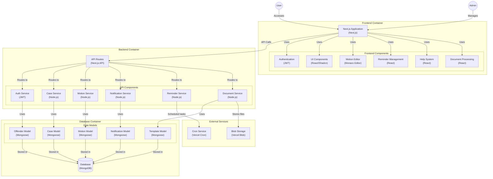

# codebase-export-2026-05-22

# Codebase Export

## court-jester-main/app/admin/dashboard/cases/[id]/page.tsx
```tsx
// app/admin/dashboard/cases/[id]/page.tsx

"use client"
import { useParams, useRouter } from "next/navigation"
import { useState, useEffect } from "react"
import { Button } from "@/components/ui/button"
import { Card, CardContent, CardHeader, CardTitle } from "@/components/ui/card"
import { Tabs, TabsContent, TabsList, TabsTrigger } from "@/components/ui/tabs"
import { Badge } from "@/components/ui/badge"
import Link from "next/link"
import { Calendar, FileText, User } from "lucide-react"

interface CaseData {
  case: {
    id: number
    case_number: string
    offender_id: number
    offender_name: string
    court: string
    judge: string
    status: string
    next_date: string | null
    created_at: string
    updated_at: string
    case_type?: string | null
    plaintiff?: string | null
    defendant?: string | null
  }
  charges: Array<{
    id: number
    description: string
    statute: string
    severity: string
    disposition: string | null
    charge_date: string
  }>
  hearings: Array<{
    id: number
    date: string
    time: string
    type: string
    location: string
    notes: string | null
  }>
  motions: Array<{
    id: number
    title: string
    status: string
    created_at: string
    updated_at: string
  }>
}

export default function CaseDetailPage() {
  const { id } = useParams<{ id: string }>()
  const router = useRouter()
  const [caseData, setCaseData] = useState<CaseData | null>(null)
  const [isLoading, setIsLoading] = useState(true)
  const [error, setError] = useState<string | null>(null)

  useEffect(() => {
    async function fetchCaseData() {
      try {
        const response = await fetch(`/api/admin/cases/${id}`)
        if (!response.ok) {
          const errorData = await response.json()
          throw new Error(errorData.error || "Failed to fetch case data")
        }
        const data = await response.json()
        setCaseData(data)
      } catch (err) {
        console.error("Error fetching case data:", err)
        setError(err instanceof Error ? err.message : "Failed to load case data")
      } finally {
        setIsLoading(false)
      }
    }

    if (id) {
      fetchCaseData()
    }
  }, [id])

  if (isLoading) {
    return (
      <div className="flex h-[calc(100vh-120px)] items-center justify-center">
        <div className="text-center">
          <div className="mb-4 text-2xl font-bold text-background">
            Loading case details...
          </div>
          <div className="text-sm text-background/60">
            Please wait while we fetch the case data.
          </div>
        </div>
      </div>
    )
  }

  if (error || !caseData) {
    return (
      <div className="flex h-[calc(100vh-120px)] items-center justify-center">
        <div className="text-center">
          <div className="mb-4 text-2xl font-bold text-red-500">Error</div>
          <div className="mb-4 text-sm text-background/60">
            {error || "Failed to load case data."}
          </div>
          <Button className="button-link" onClick={() => window.location.reload()}>
            Try Again
          </Button>
        </div>
      </div>
    )
  }

  const { case: caseInfo, charges, hearings, motions } = caseData

  const formatDate = (date: string | null) => {
    if (!date) return "Not set"
    return new Date(date).toLocaleDateString(undefined, {
      year: "numeric",
      month: "long",
      day: "numeric",
    })
  }

  const formatTime = (time: string | null) => {
    if (!time) return "Not set"
    return new Date(`1970-01-01T${time}`).toLocaleTimeString(undefined, {
      hour: "numeric",
      minute: "2-digit",
      hour12: true,
    })
  }

  return (
    <div className="card-secondary space-y-6">
      <div className="flex items-start justify-between">
        <h1 className="font-kings text-background text-3xl mb-2">
          Case #{caseInfo.case_number}
        </h1>
      </div>
      <div className="card-content">
        <div className="flex flex-col gap-4">
          <div className="flex justify-items-center gap-x-16">
            <div className="flex text-2xl font-semi-bold items-center gap-4">
              <User className="h-6 w-6" />
              <Link
                className="hover:text-background transition-colors"
                href={`/admin/dashboard/offenders/${caseInfo.offender_id}`}
              >
                {caseInfo.offender_name}
              </Link>
            </div>
            <div className="flex text-2xl font-semi-bold items-center gap-4">
              <Calendar className="h-6 w-6" />
              Created {formatDate(caseInfo.created_at)}
            </div>
            <div className="flex text-2xl font-semi-bold items-center gap-4">
            Status:
            <Badge
                variant={hearings.length > 0 ? "success" : "error"}
              >
              {hearings.length > 0 ? "Active" : "Inactive"}
              </Badge>
              </div>
          </div>
  
        </div>
        <div className="card-content grid grid-cols-3 gap-6">
          <div>
            <h3 className="font-semi-bold text-xl mb-1">Court:</h3>
            <p>{caseInfo.court || "Not assigned"}</p>
          </div>
          <div>
            <h3 className="font-semi-bold text-xl mb-1">Judge:</h3>
            <p>{caseInfo.judge || "Not assigned"}</p>
          </div>
          <div>
            <h3 className="font-semi-bold text-xl mb-1">Next Hearing:</h3>
            <p>
              {caseInfo.next_date ? formatDate(caseInfo.next_date) : "None scheduled"}
            </p>
          </div>
          {caseInfo.case_type && (
            <div>
              <h3 className="font-bold mb-1">Case Type</h3>
              <p>{caseInfo.case_type}</p>
            </div>
          )}
          {caseInfo.plaintiff && (
            <div>
              <h3 className="font-bold mb-1">Plaintiff</h3>
              <p>{caseInfo.plaintiff}</p>
            </div>
          )}
          {caseInfo.defendant && (
            <div>
              <h3 className="font-bold mb-1">Defendant</h3>
              <p>{caseInfo.defendant}</p>
            </div>
          )}
        </div>
        <Tabs className="w-full" defaultValue="charges">
          <TabsList className="grid w-full grid-cols-3">
            <TabsTrigger
              className="bg-foreground font-kings text-background"
              value="charges">
              Charges ({charges.length})
            </TabsTrigger>
            <TabsTrigger className="bg-foreground font-kings text-background" value="hearings">
              Hearings ({hearings.length})
            </TabsTrigger>
            <TabsTrigger className="bg-foreground font-kings text-background" value="motions">
              Motions ({motions.length})
            </TabsTrigger>
          </TabsList>

          <TabsContent value="charges">
            <Card>
              <CardHeader className="flex flex-row items-center justify-between">
                <CardTitle className="font-kings font-bold text-2xl mt-3 text-foreground">Charges</CardTitle>
                <Button
                  className="button-link"
                  variant="default"
                  onClick={() =>
                    router.push(`/admin/dashboard/cases/${id}/charges/new`)
                  }
                >
                  Add Charge
                </Button>
              </CardHeader>
              <CardContent className="card-content">
                {charges.length === 0 ? (
                  <div className="rounded-lg border border-dashed p-8 text-center">
                    <FileText className="mx-auto h-8 w-8 text-foreground mb-4" />
                    <p className="text-foreground">
                      No charges have been added to this case.
                    </p>
                  </div>
                ) : (
                  <div className="rounded-md border">
                    <table className="w-full">
                      <thead className="bg-background">
                        <tr>
                          <th className="px-4 py-3 text-left text-sm font-medium">
                            Description
                          </th>
                          <th className="px-4 py-3 text-left text-sm font-medium">
                            Statute
                          </th>
                          <th className="px-4 py-3 text-left text-sm font-medium">
                            Date
                          </th>
                          <th className="px-4 py-3 text-left text-sm font-medium">
                            Disposition
                          </th>
                          <th className="px-4 py-3 text-left text-sm font-medium">
                            Actions
                          </th>
                        </tr>
                      </thead>
                      <tbody>
                        {charges.map((charge) => (
                          <tr key={charge.id} className="border-b rounded-lg">
                            <td className="px-4 py-3 text-sm">{charge.description}</td>
                            <td className="px-4 py-3 text-sm">{charge.statute}</td>
                            <td className="px-4 py-3 text-sm">
                              {formatDate(charge.charge_date)}
                            </td>
                            <td className="px-4 py-3 text-sm">
                              {charge.disposition || "Pending"}
                            </td>
                            <td className="px-4 py-3 text-sm">
                              <Button
                                className="button-link"
                                size="sm"
                                variant="default"
                                onClick={() =>
                                  router.push(
                                    `/admin/dashboard/cases/${id}/charges/${charge.id}/edit`
                                  )
                                }
                              >
                                Edit
                              </Button>
                            </td>
                          </tr>
                        ))}
                      </tbody>
                    </table>
                  </div>
                )}
              </CardContent>
            </Card>
          </TabsContent>

          <TabsContent value="hearings">
            <Card>
              <CardHeader className="flex flex-row items-center justify-between">
                <CardTitle className="font-kings font-bold text-2xl mt-3 text-foreground">Hearings</CardTitle>
                <Button
                  className="button-link mt-2"
                  variant="default"
                  onClick={() =>
                    router.push(`/admin/dashboard/cases/${id}/hearings/new`)
                  }
                >
                  Schedule Hearing
                </Button>
              </CardHeader>
              <CardContent className="card-content">
                {hearings.length === 0 ? (
                  <div className="rounded-lg border border-dashed p-8 text-center">
                    <Calendar className="mx-auto h-8 w-8 text-background/60 mb-4" />
                    <p className="text-background/60">
                      No hearings are scheduled for this case.
                    </p>
                  </div>
                ) : (
                  <div className="rounded-md border">
                    <table className="w-full">
                      <thead className="bg-background">
                        <tr>
                          <th className="px-4 py-3 text-left text-sm font-medium">
                            Date
                          </th>
                          <th className="px-4 py-3 text-left text-sm font-medium">
                            Time
                          </th>
                          <th className="px-4 py-3 text-left text-sm font-medium">
                            Type
                          </th>
                          <th className="px-4 py-3 text-left text-sm font-medium">
                            Location
                          </th>
                          <th className="px-4 py-3 text-left text-sm font-medium">
                            Notes
                          </th>
                          <th className="px-4 py-3 text-left text-sm font-medium">
                            Actions
                          </th>
                        </tr>
                      </thead>
                      <tbody>
                        {hearings.map((hearing) => (
                          <tr key={hearing.id} className="border-t">
                            <td className="px-4 py-3 text-sm">
                              {formatDate(hearing.date)}
                            </td>
                            <td className="px-4 py-3 text-sm">
                              {formatTime(hearing.time)}
                            </td>
                            <td className="px-4 py-3 text-sm">{hearing.type}</td>
                            <td className="px-4 py-3 text-sm">{hearing.location}</td>
                            <td className="px-4 py-3 text-sm truncate max-w-[200px]">
                              {hearing.notes || "-"}
                            </td>
                            <td className="px-4 py-3 text-sm">
                              <Button
                                className="button-link"
                                size="sm"
                                variant="default"
                                onClick={() =>
                                  router.push(
                                    `/admin/dashboard/cases/${id}/hearings/${hearing.id}/edit`
                                  )
                                }
                              >
                                Edit
                              </Button>
                            </td>
                          </tr>
                        ))}
                      </tbody>
                    </table>
                  </div>
                )}
              </CardContent>
            </Card>
          </TabsContent>

          <TabsContent value="motions">
            <Card>
              <CardHeader className="flex flex-row items-center justify-between mt-2">
                <CardTitle className="font-kings font-bold text-2xl text-foreground">Motions</CardTitle>
                <Button
                  className="button-link"
                  variant="default"
                  onClick={() =>
                    router.push(`/admin/dashboard/tools/motions-editor?caseId=${id}`)
                  }
                >
                  Create Motion
                </Button>
              </CardHeader>
              <CardContent className="card-content">
                {motions.length === 0 ? (
                  <div className="rounded-lg border border-dashed p-8 text-center">
                    <FileText className="mx-auto h-8 w-8  mb-4" />
                    <p className="">
                      No motions have been filed for this case.
                    </p>
                  </div>
                ) : (
                    <table className="w-full">
                      <thead className="bg-background">
                        <tr>
                          <th className="px-4 py-3 text-left text-sm font-medium">
                            Title
                          </th>
                          <th className="px-4 py-3 text-left text-sm font-medium">
                            Status
                          </th>
                          <th className="px-4 py-3 text-left text-sm font-medium">
                            Filed
                          </th>
                          <th className="px-4 py-3 text-left text-sm font-medium">
                            Updated
                          </th>
                          <th className="px-4 py-3 text-left text-sm font-medium">
                            Actions
                          </th>
                        </tr>
                      </thead>
                      <tbody>
                        {motions.map((motion) => (
                          <tr key={motion.id} className="border-t">
                            <td className="px-4 py-3 text-sm">{motion.title}</td>
                            <td className="px-4 py-3 text-sm">
                              <Badge
                                className="capitalize"
                                variant={
                                  motion.status === "Draft"
                                    ? "secondary"
                                    : motion.status === "Submitted"
                                    ? "outline"
                                    : motion.status === "Approved"
                                    ? "success"
                                    : "error"
                                }
                              >
                                {motion.status}
                              </Badge>
                            </td>
                            <td className="px-4 py-3 text-sm">
                              {formatDate(motion.created_at)}
                            </td>
                            <td className="px-4 py-3 text-sm">
                              {formatDate(motion.updated_at)}
                            </td>
                            <td className="px-4 py-3 text-sm">
                              <Button
                                className="button-link"
                                size="sm"
                                variant="ghost"
                                onClick={() =>
                                  router.push(
                                    `/admin/dashboard/tools/motions-editor?id=${motion.id}`
                                  )
                                }
                              >
                                View
                              </Button>
                            </td>
                          </tr>
                        ))}
                      </tbody>
                    </table>
                )}
              </CardContent>
            </Card>
          </TabsContent>
        </Tabs>
      </div>
    </div>
  )
}

```

## court-jester-main/app/admin/dashboard/cases/page.tsx
```tsx
"use client"

import { useState, useEffect, type ReactNode } from "react"
import { Button } from "@/components/ui/button"
import Link from "next/link"
import { toast } from "sonner"

interface CaseItem {
  offender_name: ReactNode
  status: ReactNode
  next_hearing: Date | null 
  id: number
  case_number: string
  case_type?: string | null
  plaintiff?: string | null
  defendant?: string | null
}

export default function CasesPage() {
  const [cases, setCases] = useState<CaseItem[]>([])
  const [isLoading, setIsLoading] = useState(true)
  const [error, setError] = useState<string | null>(null)

  useEffect(() => {
    async function fetchCases() {
      try {
        setIsLoading(true)
        setError(null)
        const res = await fetch("/api/admin/cases")
        if (!res.ok) {
          throw new Error(`Error: ${res.status}`)
        }
        const data = await res.json()
        setCases(data.cases || [])
      } catch (err) {
        console.error(err)
        setError("Failed to load cases")
        toast.error("Failed to load cases")
      } finally {
        setIsLoading(false)
      }
    }
    fetchCases()
  }, [])

  return (
    <div className="space-y-2">
      <div className="card-secondary">
        <h3 className="font-kings text-3xl">Case List</h3>
        <p className="font-kings text-background mb-2 text-sm">Manage all cases in the system.</p>
        {isLoading ? (
          <p className="text-center py-4">Loading cases...</p>
        ) : error ? (
          <p className="text-center py-4 text-red-500">{error}</p>
        ) : cases.length === 0 ? (
          <p className="text-center py-4">No cases found.</p>
        ) : (
          <div className="card-secondary space-y-2">
            {cases.map((caseItem) => (
              <div
                key={caseItem.id}
                className="card-content hover:shadow-md transition-shadow"
              >
                <p>Case #{caseItem.case_number}</p>
                <p>Offender: {caseItem.offender_name}</p>
                <p>Status: {caseItem.status}</p>
                {caseItem.case_type && <p>Type: {caseItem.case_type}</p>}
                {caseItem.plaintiff && <p>Plaintiff: {caseItem.plaintiff}</p>}
                {caseItem.defendant && <p>Defendant: {caseItem.defendant}</p>}
                <p>Next Hearing: {caseItem.next_hearing ? new Date(caseItem.next_hearing).toLocaleDateString() : "N/A"}</p>
                <Link href={`/admin/dashboard/cases/${caseItem.id}`}>
                  <Button className="bg-foreground text-background hover:bg-foreground/90 mt-2">View Details</Button>
                </Link>
              </div>
            ))}
          </div>
        )}
      </div>
    </div>
  )
}

```

## court-jester-main/app/admin/dashboard/motions/[id]/page.tsx
```tsx
"use client"
import { useParams } from "next/navigation"

import { useState, useEffect } from "react"
import { Button } from "@/components/ui/button"
import { Card, CardContent, CardHeader, CardTitle } from "@/components/ui/card"
import { Badge } from "@/components/ui/badge"
import { toast } from "sonner"
import Link from "next/link"
import { Download, Loader2 } from "lucide-react"

interface MotionTemplate {
  id: number
  title: string
  content: string
  status: string
  created_at: string
  modified_at: string
  pdf_url?: string
}

export default function MotionDetailsPage() {
  const { id } = useParams<{ id: string }>()
  const [template, setTemplate] = useState<MotionTemplate | null>(null)
  const [isLoading, setIsLoading] = useState(true)
  const [error, setError] = useState<string | null>(null)
  const [isGeneratingPdf, setIsGeneratingPdf] = useState(false)
  const [isPdfGenerationEnabled, setIsPdfGenerationEnabled] = useState(false)

  useEffect(() => {
    async function fetchTemplateDetails() {
      try {
        const response = await fetch(`/api/admin/motions/${id}`)
        if (!response.ok) {
          const errorData = await response.json().catch(() => ({}))
          throw new Error(errorData.error || "Failed to fetch motion template details")
        }
        const data = await response.json()
        setTemplate(data.template)

        // Check if PDF generation is enabled
        const configResponse = await fetch("/api/admin/config")
        if (configResponse.ok) {
          const configData = await configResponse.json()
          setIsPdfGenerationEnabled(configData.enablePdfGeneration)
        }
      } catch (error) {
        console.error("Error fetching motion template details:", error)
        setError(
          error instanceof Error ? error.message : "Failed to load motion template details. Please try again later.",
        )
      } finally {
        setIsLoading(false)
      }
    }

    if (id) {
      fetchTemplateDetails()
    }
  }, [id])

  const handleGeneratePdf = async () => {
    if (!isPdfGenerationEnabled) {
      toast.error("PDF generation is not enabled")
      return
    }

    try {
      const response = await fetch("/api/admin/motions/generate-pdf") // Replace with the actual API endpoint
      const data = await response.json()
      // Update the template with the new PDF URL
      setTemplate((prev) => (prev ? { ...prev, pdf_url: data.pdfUrl } : null))
      toast.success("PDF generated successfully")
    } catch (error) {
      console.error("Error generating PDF:", error)
      toast.error(error instanceof Error ? error.message : "Failed to generate PDF")
    } finally {
      setIsGeneratingPdf(false)
    }
  }

  const formatDate = (dateString: string) => {
    return new Date(dateString).toLocaleString()
  }

  if (isLoading) {
    return (
      <div className="flex h-[calc(100vh-120px)] items-center justify-center">
        <div className="text-center">
          <div className="mb-4 text-2xl font-bold">Loading template details...</div>
          <div className="text-foreground/60">Please wait while we fetch the template data.</div>
        </div>
      </div>
    )
  }

  if (Error() || !template) {
    return (
      <div className="flex h-[calc(100vh-120px)] items-center justify-center">
        <div className="text-center">
          <div className="mb-4 text-2xl font-bold text-red-500">Error</div>
          <div className="mb-4 text-foreground/60">{error || "Failed to load motion template details."}</div>
          <Button className="bg-foreground text-background" onClick={() => window.location.reload()}>
            Try Again
          </Button>
        </div>
      </div>
    )
  }

  return (
    <div className="space-y-6">
      <div className="flex items-center justify-between">
        <h1 className="text-2xl font-bold">Motion Template Details</h1>
        {template.pdf_url && (
          <Button className="bg-foreground text-background" disabled={isGeneratingPdf} onClick={handleGeneratePdf}>
            {isGeneratingPdf ? (
              <>
                <Loader2 className="mr-2 h-4 w-4 animate-spin" />
                Generating PDF...
              </>
            ) : (
              <>
                <Download className="mr-2 h-4 w-4" />
                Generate PDF
              </>
            )}
          </Button>
        )}
      </div>
      <Card>
        <CardHeader>
          <div className="flex items-center justify-between">
            <CardTitle className="text-xl">{template.title}</CardTitle>
            <Badge variant={template.status === "approved" ? "success" : "outline"}>
              {template.status.charAt(0).toUpperCase() + template.status.slice(1)}
            </Badge>
          </div>
        </CardHeader>
        <CardContent>
          <div className="mb-4 grid grid-cols-2 gap-4 text-sm">
            <div>
              <span className="font-medium">Category:</span>{" "}
              {template.content ? template.content.substring(0, 100) + "..." : "N/A"}
            </div>
            <div>
              <span className="font-medium">Last Modified:</span> {formatDate(template.modified_at)}
            </div>
          </div>
          <p>{template.content}</p>
          {template.pdf_url && (
            <div className="mt-4">
              <h2 className="font-medium">Generated PDF:</h2>
              <Link className="text-blue-600 hover:underline" href={template.pdf_url} target="_blank">
                View PDF
              </Link>
            </div>
          )}
        </CardContent>
      </Card>
      <div className="flex justify-end">
        <Link href="/admin/dashboard/tools/motions-editor">
          <Button className="bg-foreground text-background">Create Template</Button>
        </Link>
      </div>
    </div>
  )
}


```

## court-jester-main/app/admin/dashboard/motions/page.tsx
```tsx
"use client"

import type React from "react"

import { useState, useEffect } from "react"
import { Button } from "@/components/ui/button"
import { Input } from "@/components/ui/input"
import Link from "next/link"
import { toast } from "sonner"

interface MotionTemplate {
  id: number
  title: string
  category: string
  created_by: string
  created_at: string
  modified_at: string
  is_template: boolean
  usage_count: number
}

export default function MotionsPage() {
  const [templates, setTemplates] = useState<MotionTemplate[]>([])
  const [filteredTemplates, setFilteredTemplates] = useState<MotionTemplate[]>([])
  const [isLoading, setIsLoading] = useState(true)
  const [error, setError] = useState<string | null>(null)
  const [searchTerm, setSearchTerm] = useState("")

  useEffect(() => {
    async function fetchTemplates() {
      try {
        setIsLoading(true)
        setError(null)
        const response = await fetch("/api/admin/motions")
        if (!response.ok) {
          throw new Error("Failed to fetch motion templates")
        }
        const data = await response.json()
        setTemplates(data.templates || [])
        setFilteredTemplates(data.templates || [])
      } catch (error) {
        console.error("Error fetching motion templates:", error)
        setError("Failed to load motion templates. Please try again later.")
      } finally {
        setIsLoading(false)
      }
    }

    fetchTemplates()
  }, [])

  useEffect(() => {
    if (searchTerm.trim() === "") {
      setFilteredTemplates(templates)
      return
    }

    const lowerCaseSearchTerm = searchTerm.toLowerCase()
    const filtered = templates.filter(
      (template) =>
        template.title.toLowerCase().includes(lowerCaseSearchTerm) ||
        template.category.toLowerCase().includes(lowerCaseSearchTerm) ||
        template.created_by.toLowerCase().includes(lowerCaseSearchTerm),
    )
    setFilteredTemplates(filtered)
  }, [searchTerm, templates])

  const handleSearch = (e: React.ChangeEvent<HTMLInputElement>) => {
    setSearchTerm(e.target.value)
  }

  const handleDeleteTemplate = async (id: number) => {
    if (!confirm("Are you sure you want to delete this template? This action cannot be undone.")) {
      return
    }

    try {
      const response = await fetch(`/api/admin/motions/${id}`, {
        method: "DELETE",
      })

      if (!response.ok) {
        throw new Error("Failed to delete template")
      }

      // Remove the template from the state
      setTemplates((prev) => prev.filter((template) => template.id !== id))
      setFilteredTemplates((prev) => prev.filter((template) => template.id !== id))
      toast.success("Template deleted successfully")
    } catch (error) {
      console.error("Error deleting template:", error)
      toast.error("Failed to delete template")
    }
  }

  if (isLoading) {
    return (
      <div className="flex h-[calc(100vh-120px)] items-center justify-center">
        <div className="text-center">
          <div className="mb-4 text-2xl font-bold">Loading motion templates...</div>
          <div className="text-foreground/60">Please wait while we fetch the motion templates.</div>
        </div>
      </div>
    )
  }

  if (error) {
    return (
      <div className="flex h-[calc(100vh-120px)] items-center justify-center">
        <div className="text-center">
          <div className="mb-4 text-2xl font-bold text-red-500">Error</div>
          <div className="mb-4 text-foreground/60">{error}</div>
          <Button className="bg-foreground text-background" onClick={() => window.location.reload()}>
            Try Again
          </Button>
        </div>
      </div>
    )
  }

  return (
    <div className="space-y-3">
      {/* Header Block */}
      <div className="card-secondary space-y-3">
        <h2 className="font-kings text-3xl ">Motion Templates</h2>
        <p className="font-kings text-background mb-2 text-sm">Manage all motion templates and custom motions in the system.</p>

      {/* Search and Create Template */}
      <div className="card-content flex flex-col sm:flex-row items-center justify-between space-y-4 sm:space-y-0">
        <Input
          className="w-full sm:w-64"
          placeholder="Search motion templates..."
          type="text"
          value={searchTerm}
          onChange={handleSearch}
          />
        <Link href="/admin/dashboard/tools/motions-editor">
          <Button className="w-full sm:w-64 bg-foreground text-background">Create Template</Button>
        </Link>
      </div>

      {/* Templates Table */}
      {filteredTemplates.length === 0 ? (
        <div className="card-content rounded-md border border-foreground/20 p-8 text-center">
          <div className="mb-2 text-xl font-semibold">No templates found</div>
          <p className="text-foreground/60">
            {searchTerm
              ? `No templates match the search term "${searchTerm}"`
              : "There are no motion templates in the system yet."}
          </p>
        </div>
      ) : (
        <div className="overflow-hidden rounded-md border border-foreground/20">
          <table className="card-content w-full border-collapse">
            <thead className="bg-foreground/10">
              <tr>
                <th className="px-4 py-2 text-left font-medium">Title</th>
                <th className="px-4 py-2 text-left font-medium">Category</th>
                <th className="px-4 py-2 text-left font-medium">Created By</th>
                <th className="px-4 py-2 text-left font-medium">Type</th>
                <th className="px-4 py-2 text-left font-medium">Usage</th>
                <th className="px-4 py-2 text-left font-medium">Last Modified</th>
                <th className="px-4 py-2 text-left font-medium">Actions</th>
              </tr>
            </thead>
            <tbody>
              {filteredTemplates.map((template) => (
                <tr key={template.id} className="border-t border-foreground/10 hover:bg-foreground/5">
                  <td className="px-4 py-2">{template.title}</td>
                  <td className="px-4 py-2">{template.category}</td>
                  <td className="px-4 py-2">{template.created_by}</td>
                  <td className="px-4 py-2">
                    <span
                      className={`inline-block rounded-full px-2 py-1 text-xs ${
                        template.is_template ? "bg-blue-100 text-blue-800" : "bg-purple-100 text-purple-800"
                      }`}
                    >
                      {template.is_template ? "Template" : "Custom"}
                    </span>
                  </td>
                  <td className="px-4 py-2">{template.usage_count}</td>
                  <td className="px-4 py-2">{new Date(template.modified_at).toLocaleDateString()}</td>
                  <td className="px-4 py-2">
                    <div className="flex gap-2">
                      <Link href={`/admin/dashboard/tools/motions-editor?id=${template.id}`}>
                        <Button size="sm" variant="default">
                          Edit
                        </Button>
                      </Link>
                      <Button
                        className="text-red-500 hover:bg-red-50 hover:text-red-600 text-background"
                        size="sm"
                        variant="default"
                        onClick={() => handleDeleteTemplate(template.id)}
                      >
                        Delete
                      </Button>
                    </div>
                  </td>
                </tr>
              ))}
            </tbody>
          </table>
        </div>
      )}
    </div>
   </div>
  )
}


```

## court-jester-main/app/admin/dashboard/notifications/page.tsx
```tsx
"use client"

import { useState, useEffect } from "react"
import { Button } from "@/components/ui/button"
import { toast } from "sonner"

interface Notification {
  id: number
  title: string
  message: string
  created_at: string
  read: boolean
}

export default function NotificationsPage() {
  const [notifications, setNotifications] = useState<Notification[]>([])
  const [isLoading, setIsLoading] = useState(true)
  const [error, setError] = useState<string | null>(null)

  useEffect(() => {
    fetchNotifications()
  }, [])

  async function fetchNotifications() {
    try {
      setIsLoading(true)
      setError(null)
      const res = await fetch("/api/admin/notifications")
      if (!res.ok) {
        throw new Error(`Error: ${res.status}`)
      }
      const data = await res.json()
      setNotifications(data.notifications || [])
    } catch (err) {
      console.error(err)
      setError("Failed to load notifications")
      toast.error("Failed to load notifications")
    } finally {
      setIsLoading(false)
    }
  }

  async function markAsRead(id: number) {
    try {
      const res = await fetch(`/api/admin/notifications/${id}/read`, {
        method: "POST",
      })
      if (!res.ok) {
        throw new Error(`Error: ${res.status}`)
      }

      setNotifications(
        notifications.map((notification) =>
          notification.id === id ? { ...notification, read: true } : notification,
        ),
      )

      toast.success("Notification marked as read")
    } catch (err) {
      console.error(err)
      toast.error("Failed to mark notification as read")
    }
  }

  async function markAllAsRead() {
    try {
      const res = await fetch("/api/admin/notifications/mark-all-read", {
        method: "POST",
      })
      if (!res.ok) {
        throw new Error(`Error: ${res.status}`)
      }

      setNotifications(notifications.map((notification) => ({ ...notification, read: true })))

      toast.success("All notifications marked as read")
    } catch (err) {
      console.error(err)
      toast.error("Failed to mark all notifications as read")
    }
  }

  return (
    <div className="card-secondary space-y-4 p-4">
      <h2 className="font-kings text-background text-3xl">Notifications</h2>
      <p className="font-kings text-background mb-2 text-sm">
        View and manage your system notifications.
      </p>
      <div className="flex justify-between items-center mb-4">
        {notifications.some((n) => !n.read) && (
          <Button className="button-link" variant="outline" onClick={markAllAsRead}>
            Mark All as Read
          </Button>
        )}
      </div>
      {isLoading ? (
        <p className="text-center py-4 text-background">Loading notifications...</p>
      ) : error ? (
        <p className="text-center py-4 text-red-500">{error}</p>
      ) : notifications.length === 0 ? (
        <p className="text-center py-4 text-background">No notifications found.</p>
      ) : (
        <div className="space-y-2">
          {notifications.map((notification) => (
            <div
              key={notification.id}
              className="notification-item hover:shadow-md transition-shadow flex justify-between items-center"
            >
              <div>
                <h3 className="font-medium text-lg">{notification.title}</h3>
                <p className="mt-1">{notification.message}</p>
                <p className="text-sm text-foreground mt-2">
                  {new Date(notification.created_at).toLocaleString()}
                </p>
              </div>
              {!notification.read && (
                <Button
                  className="button-link"
                  variant="outline"
                  onClick={() => markAsRead(notification.id)}
                >
                  Mark as Read
                </Button>
              )}
            </div>
          ))}
        </div>
      )}
    </div>
  )
}

```

## court-jester-main/app/admin/dashboard/offenders/[id]/page.tsx
```tsx
"use client";

import { useParams } from "next/navigation";
import { useState, useEffect } from "react";
import { Button } from "@/components/ui/button";
import { Card, CardContent, CardHeader, CardTitle } from "@/components/ui/card";
import Link from "next/link";
import Image from "next/image";

interface OffenderData {
  offender: {
    inmateNumber: string;
    nmcdNumber?: string;
    firstName: string;
    lastName: string;
    middleName?: string;
    status: string;
    facility?: string;
    age?: number;
    height?: string;
    weight?: number;
    eyeColor?: string;
    hair?: string;
    religion?: string;
    education?: string;
    complexion?: string;
    ethnicity?: string;
    alias?: string;
    mugshotUrl?: string;
    accountEnabled: boolean;
    profileEnabled: boolean;
    custodyStatus: string;
  };
  cases: Array<{
    id: number;
    caseNumber: string;
    court: string;
    status: string;
    nextDate?: string;
  }>;
}

export default function OffenderDetailPage() {
  const { id } = useParams<{ id: string }>();
  const [offenderData, setOffenderData] = useState<OffenderData | null>(null);
  const [isLoading, setIsLoading] = useState(true);
  const [error, setError] = useState<string | null>(null);

  useEffect(() => {
    async function fetchOffenderData() {
      try {
        const response = await fetch(`/api/admin/offenders/${id}`);
        if (!response.ok) {
          throw new Error("Failed to fetch offender data");
        }
        const data = await response.json();
        if (!data.offender) {
          throw new Error("Offender data is missing from the response");
        }
        setOffenderData(data);
      } catch (err) {
        console.error("Error fetching offender data:", err);
        setError("Failed to load offender data. Please try again later.");
      } finally {
        setIsLoading(false);
      }
    }
    if (id) {
      fetchOffenderData();
    }
  }, [id]);

  if (isLoading) {
    return (
      <div className="flex h-[calc(100vh-120px)] items-center justify-center">
        <div className="text-center">
          <div className="mb-4 text-2xl font-bold text-background">
            Loading offender details...
          </div>
          <div className="text-foreground/60">
            Please wait while we fetch the offender data.
          </div>
        </div>
      </div>
    );
  }

  if (error || !offenderData || !offenderData.offender) {
    return (
      <div className="flex h-[calc(100vh-120px)] items-center justify-center">
        <div className="text-center">
          <div className="mb-4 text-2xl font-bold text-red-500">Error</div>
          <div className="mb-4 text-foreground/60">
            {error || "Failed to load offender data."}
          </div>
          <Button className="button-link" onClick={() => window.location.reload()}>
            Try Again
          </Button>
        </div>
      </div>
    );
  }

  const { offender, cases } = offenderData;
  const fullName = `${offender.firstName} ${offender.middleName ? offender.middleName + " " : ""}${offender.lastName}`;

  return (
    <div className="card-secondary space-y-4 p-4">
      {/* Header Block */}
      <div className="card-primary p-4">
        <h1 className="font-kings text-3xl text-primary-foreground mb-2">
          Inmate: {fullName}
        </h1>
        <p className="text-primary-foreground">
          View and manage all details related to this inmate.
        </p>
      </div>

      {/* Offender Information */}
      <div className="card-content space-y-6">
        <div className="flex flex-col md:flex-row gap-6">
          <div className="w-full md:w-1/3 space-y-4">
            {offender.mugshotUrl ? (
              <div className="relative aspect-[3/4] w-full overflow-hidden rounded-md border border-foreground/20">
                <Image
                  fill
                  alt={`Mugshot of ${fullName}`}
                  className="object-cover"
                  src={offender.mugshotUrl}
                />
              </div>
            ) : (
              <div className="flex aspect-[3/4] w-full items-center justify-center rounded-md border border-foreground/20 bg-foreground/5">
                <p className="text-center text-foreground/60">No mugshot available</p>
              </div>
            )}
            <div>
              <Link href={`/admin/dashboard/tools/mugshot-upload?inmateNumber=${offender.inmateNumber}`}>
                <Button className="button-link w-full" variant="default">
                  {offender.mugshotUrl ? "Update Mugshot" : "Upload Mugshot"}
                </Button>
              </Link>
            </div>
          </div>
          <div className="w-full md:w-2/3 space-y-4">
            <h2 className="font-black text-2xl text-foreground mb-4">
              Inmate Information
            </h2>
            <div className="grid grid-cols-1 md:grid-cols-2 gap-1">
              <div className="card-content p-3">
                <p className="text-lg font-bold">Inmate Number:</p>
                <p className="text-md mt-1">{offender.inmateNumber}</p>
              </div>
              {offender.nmcdNumber && (
                <div className="card-content p-3">
                  <p className="text-lg font-bold">NMCD Number:</p>
                  <p className="text-md mt-1">{offender.nmcdNumber}</p>
                </div>
              )}
              <div className="card-content p-3">
                <p className="text-lg font-bold">Status:</p>
                <p className="text-md mt-1">{offender.status}</p>
              </div>
              {offender.facility && (
                <div className="card-content p-3">
                  <p className="text-lg font-bold">Facility:</p>
                  <p className="text-md mt-1">{offender.facility}</p>
                </div>
              )}
              {typeof offender.age === "number" && (
                <div className="card-content p-3">
                  <p className="text-lg font-bold">Age:</p>
                  <p className="text-md mt-1">{offender.age}</p>
                </div>
              )}
              {offender.height && (
                <div className="card-content p-3">
                  <p className="text-lg font-bold">Height:</p>
                  <p className="text-md mt-1">{offender.height}</p>
                </div>
              )}
              {typeof offender.weight === "number" && (
                <div className="card-content p-3">
                  <p className="text-lg font-bold">Weight:</p>
                  <p className="text-md mt-1">{offender.weight}</p>
                </div>
              )}
              {offender.eyeColor && (
                <div className="card-content p-3">
                  <p className="text-lg font-bold">Eye Color:</p>
                  <p className="text-md mt-1">{offender.eyeColor}</p>
                </div>
              )}
              {offender.hair && (
                <div className="card-content p-3">
                  <p className="text-lg font-bold">Hair:</p>
                  <p className="text-md mt-1">{offender.hair}</p>
                </div>
              )}
              {offender.religion && (
                <div className="card-content p-3">
                  <p className="text-lg font-bold">Religion:</p>
                  <p className="text-md mt-1">{offender.religion}</p>
                </div>
              )}
              {offender.education && (
                <div className="card-content p-3">
                  <p className="text-lg font-bold">Education:</p>
                  <p className="text-md mt-1">{offender.education}</p>
                </div>
              )}
              {offender.complexion && (
                <div className="card-content p-3">
                  <p className="text-lg font-bold">Complexion:</p>
                  <p className="text-md mt-1">{offender.complexion}</p>
                </div>
              )}
              {offender.ethnicity && (
                <div className="card-content p-3">
                  <p className="text-lg font-bold">Ethnicity:</p>
                  <p className="text-md mt-1">{offender.ethnicity}</p>
                </div>
              )}
              {offender.alias && (
                <div className="card-content p-3">
                  <p className="text-lg font-bold">Alias:</p>
                  <p className="text-md mt-1">{offender.alias}</p>
                </div>
              )}
              <div className="card-content p-3">
                <p className="text-lg font-bold">Custody Status:</p>
                <p className="text-md mt-1">{offender.custodyStatus}</p>
              </div>
            </div>
            <div className="flex gap-2">
              <Link href={`/admin/dashboard/tools/offender-profile?inmateNumber=${offender.inmateNumber}`}>
                <Button className="button-link" variant="default">
                  Edit Profile
                </Button>
              </Link>
              <Button className="button-link" variant="default">
                Notify Inmate
              </Button>
            </div>
          </div>
        </div>
      </div>

      {/* Cases Tab */}
      <Card className="card-content">
        <CardHeader className="flex flex-row items-center justify-between">
          <CardTitle className="text-2xl font-kings text-foreground">Cases</CardTitle>
          <Link href={`/admin/dashboard/tools/case-upload?inmateNumber=${offender.inmateNumber}`}>
            <Button className="button-link" size="sm" variant="default">
              Add Case
            </Button>
          </Link>
        </CardHeader>
        <CardContent>
          {cases.length === 0 ? (
            <div className="card-content p-4 text-center">
              <p className="text-foreground/60">No cases found for this inmate.</p>
            </div>
          ) : (
            <div className="overflow-hidden rounded-md border border-foreground/20">
              <table className="w-full border-collapse">
                <thead className="bg-foreground/10">
                  <tr>
                    <th className="px-4 py-2 text-left font-medium">Case Number</th>
                    <th className="px-4 py-2 text-left font-medium">Court</th>
                    <th className="px-4 py-2 text-left font-medium">Status</th>
                    <th className="px-4 py-2 text-left font-medium">Next Date</th>
                    <th className="px-4 py-2 text-left font-medium">Actions</th>
                  </tr>
                </thead>
                <tbody>
                  {cases.map((caseItem) => (
                    <tr key={caseItem.id} className="border-t border-foreground/10 hover:bg-foreground/5">
                      <td className="px-4 py-2">{caseItem.caseNumber}</td>
                      <td className="px-4 py-2">{caseItem.court}</td>
                      <td className="px-4 py-2">{caseItem.status}</td>
                      <td className="px-4 py-2">
                        {caseItem.nextDate
                          ? new Date(caseItem.nextDate).toLocaleDateString()
                          : "None"}
                      </td>
                      <td className="px-4 py-2">
                        <Link href={`/admin/dashboard/cases/${caseItem.id}`}>
                          <Button className="button-link" size="sm" variant="default">
                            View
                          </Button>
                        </Link>
                      </td>
                    </tr>
                  ))}
                </tbody>
              </table>
            </div>
          )}
        </CardContent>
      </Card>
    </div>
  );
}

```

## court-jester-main/app/admin/dashboard/offenders/page.tsx
```tsx
"use client"

import { useState, useEffect } from "react"
import { Button } from "@/components/ui/button"
import Link from "next/link"
import { toast } from "sonner"

interface OffenderItem {
  id: number
  inmate_number: string
  first_name: string
  middle_name: string
  last_name: string
  status: string
  facility: string
}

export default function OffendersPage() {
  const [offenders, setOffenders] = useState<OffenderItem[]>([])
  const [isLoading, setIsLoading] = useState(true)
  const [error, setError] = useState<string | null>(null)

  useEffect(() => {
    async function fetchOffenders() {
      try {
        setIsLoading(true)
        setError(null)
        const res = await fetch("/api/admin/offenders")
        if (!res.ok) {
          throw new Error(`Error: ${res.status}`)
        }
        const data = await res.json()
        setOffenders(data.offenders || [])
      } catch (err) {
        console.error(err)
        setError("Failed to load offenders")
        toast.error("Failed to load offenders")
      } finally {
        setIsLoading(false)
      }
    }
    fetchOffenders()
  }, [])

    
  return (
    <div className="card-secondary space-y-4 p-4">
      <h2 className="font-kings text-background text-3xl">Offender List</h2>
      <p className="font-kings text-background mb-2 text-sm">
        Manage all offenders in the system.
      </p>
      {isLoading ? (
        <p className="text-center py-4 text-background">Loading offenders...</p>
      ) : error ? (
        <p className="text-center py-4 text-red-500">{error}</p>
      ) : offenders.length === 0 ? (
        <p className="text-center py-4 text-background">No offenders found.</p>
      ) : (
        <div className="space-y-2">
          {offenders.map((offender) => (
            <div
              key={offender.id}
              className="card-content hover:shadow-md transition-shadow flex justify-between items-center"
            >
              <div>
                <h3 className="font-medium text-lg">{offender.first_name} {offender.middle_name} {offender.last_name}</h3>
                <p className="text-sm">
                  <span className="font-medium">Number:</span> {offender.inmate_number}
                </p>
                <p className="text-sm">
                  <span className="font-medium">Status:</span> {offender.status}
                </p>
                <p className="text-sm">
                  <span className="font-medium">Facility:</span> {offender.facility}
                </p>
              </div>
              <div className="flex gap-2 mt-4 md:mt-0">
                <Link href={`/admin/dashboard/offenders/${offender.id}`}>
                  <Button className="button-link" variant="outline">
                    View Details
                  </Button>
                </Link>
              </div>
            </div>
          ))}
        </div>
      )}
    </div>
  )
}

```

## court-jester-main/app/admin/dashboard/settings/page.tsx
```tsx
"use client"

import { useState, useEffect } from "react"
import { Button } from "@/components/ui/button"
import { Input } from "@/components/ui/input"
import { Switch } from "@/components/ui/switch"
import { toast } from "sonner"

interface SystemSettings {
  email_notifications: boolean
  pdf_generation: boolean
  admin_code: string
  version: string
}

export default function SettingsPage() {
  const [settings, setSettings] = useState<SystemSettings | null>(null)
  const [isLoading, setIsLoading] = useState(true)
  const [isSaving, setIsSaving] = useState(false)
  const [error, setError] = useState<string | null>(null)

  useEffect(() => {
    fetchSettings()
  }, [])

  async function fetchSettings() {
    try {
      setIsLoading(true)
      setError(null)
      const res = await fetch("/api/admin/settings/system")
      if (!res.ok) {
        throw new Error(`Error: ${res.status}`)
      }
      const data = await res.json()
      setSettings(data.settings)
    } catch (err) {
      console.error(err)
      setError("Failed to load settings")
      toast.error("Failed to load settings")
    } finally {
      setIsLoading(false)
    }
  }

  async function saveSettings() {
    if (!settings) return

    try {
      setIsSaving(true)
      const res = await fetch("/api/admin/settings/system", {
        method: "POST",
        headers: {
          "Content-Type": "application/json",
        },
        body: JSON.stringify({ settings }),
      })

      if (!res.ok) {
        throw new Error(`Error: ${res.status}`)
      }

      toast.success("Settings saved successfully")
    } catch (err) {
      console.error(err)
      toast.error("Failed to save settings")
    } finally {
      setIsSaving(false)
    }
  }

  function updateSetting(key: keyof SystemSettings, value: any) {
    if (!settings) return
    setSettings({ ...settings, [key]: value })
  }

  async function testEmailNotifications() {
    try {
      const res = await fetch("/api/admin/settings/email/test", {
        method: "POST",
      })

      if (!res.ok) {
        throw new Error(`Error: ${res.status}`)
      }

      toast.success("Test email sent successfully")
    } catch (err) {
      console.error(err)
      toast.error("Failed to send test email")
    }
  }

  if (isLoading) {
    return (
      <div className="flex h-[calc(100vh-120px)] items-center justify-center">
        <div className="text-center">
          <div className="mb-4 text-2xl font-bold text-background">
            Loading settings...
          </div>
          <div className="text-foreground/60">
            Please wait while we fetch the system settings.
          </div>
        </div>
      </div>
    )
  }

  if (error || !settings) {
    return (
      <div className="flex h-[calc(100vh-120px)] items-center justify-center">
        <div className="text-center">
          <div className="mb-4 text-2xl font-bold text-red-500">Error</div>
          <div className="mb-4 text-foreground/60">
            {error || "Failed to load settings."}
          </div>
          <Button
            className="button-link"
            variant="outline"
            onClick={() => window.location.reload()}
          >
            Try Again
          </Button>
        </div>
      </div>
    )
  }

  return (
    <div className="card-secondary space-y-4 p-4">
      {/* Title Block */}
      <h2 className="font-kings text-3xl text-background">
        System Settings
      </h2>
      <p className="font-kings text-background text-sm">
        Configure system-wide settings and preferences.
      </p>

      {/* Main Content Block */}
      <div className="space-y-4">
        {/* Email Notifications */}
        <div className="card-content">
          <div className="flex justify-between items-center">
            <div>
              <h3 className="font-medium">Email Notifications</h3>
              <p className="text-sm mt-1">
                Enable automatic email notifications for system events
              </p>
            </div>
            <div className="flex items-center gap-4">
              <Switch
                checked={settings.email_notifications}
                onCheckedChange={(checked) =>
                  updateSetting("email_notifications", checked)
                }
              />
              <Button
                className="button-link"
                disabled={!settings.email_notifications}
                size="sm"
                variant="outline"
                onClick={testEmailNotifications}
              >
                Test
              </Button>
            </div>
          </div>
        </div>

        {/* PDF Generation */}
        <div className="card-content">
          <div className="flex justify-between items-center">
            <div>
              <h3 className="font-medium">PDF Generation</h3>
              <p className="text-sm mt-1">
                Enable automatic PDF generation for motions and documents
              </p>
            </div>
            <Switch
              checked={settings.pdf_generation}
              onCheckedChange={(checked) =>
                updateSetting("pdf_generation", checked)
              }
            />
          </div>
        </div>

        {/* Admin Registration Code */}
        <div className="card-content">
          <div className="space-y-2">
            <h3 className="font-medium">Admin Registration Code</h3>
            <p className="text-sm">
              Code required for new admin registration
            </p>
            <div className="flex gap-2 mt-2">
              <Input
                className="border-foreground/20 bg-background text-foreground"
                value={settings.admin_code}
                onChange={(e) =>
                  updateSetting("admin_code", e.target.value)
                }
              />
              <Button
                className="button-link"
                variant="outline"
                onClick={() =>
                  updateSetting(
                    "admin_code",
                    Math.random().toString(36).substring(2, 10).toUpperCase(),
                  )
                }
              >
                Generate
              </Button>
            </div>
          </div>
        </div>

        {/* System Version */}
        <div className="card-content">
          <div className="flex justify-between items-center">
            <div>
              <h3 className="font-medium">System Version</h3>
              <p className="text-sm mt-1">
                Current version of the Court Jester system
              </p>
            </div>
            <div className="text-sm bg-foreground px-3 py-1">
              {settings.version}
            </div>
          </div>
        </div>

        {/* Save Button */}
        <div className="flex justify-end">
          <Button
            className="button-link"
            disabled={isSaving}
            variant="outline"
            onClick={saveSettings}
          >
            {isSaving ? "Saving..." : "Save Settings"}
          </Button>
        </div>
      </div>
    </div>
  )
}

```

## court-jester-main/app/admin/dashboard/tools/case-upload/page.tsx
```tsx
"use client"

import type React from "react"
import { useState, useRef, useEffect } from "react"
import { Button } from "@/components/ui/button"
import {
  Card,
  CardContent,
  CardDescription,
  CardFooter,
  CardHeader,
  CardTitle,
} from "@/components/ui/card"
import { Input } from "@/components/ui/input"
import { Label } from "@/components/ui/label"
import { Tabs, TabsContent, TabsList, TabsTrigger } from "@/components/ui/tabs"
import { Alert, AlertDescription, AlertTitle } from "@/components/ui/alert"
import { Progress } from "@/components/ui/progress"
import { FileUp, AlertCircle, CheckCircle2, File } from "lucide-react"
import { toast } from "sonner"
import { Select, SelectContent, SelectItem, SelectTrigger, SelectValue } from "@/components/ui/select"
import type { ParsedCaseData } from "@/lib/case-parser"

interface CaseItem {
  offender_name: string
  status: string
  next_hearing: Date | null 
  id: number
  case_number: string
}

interface UploadResult {
  success: boolean
  message: string
  details?: string
  cases?: CaseItem[]
}

interface RecentUpload {
  id: string
  filename: string
  timestamp: string
  status: "success" | "error"
  caseNumber?: string
}

interface UploadWarnings {
  message: string;
  details?: string[];
  level: "info" | "warning";
}

export default function CaseUploadPage() {
  const [selectedFile, setSelectedFile] = useState<File | null>(null);
  const [selectedOffenderId, setSelectedOffenderId] = useState<string>("");
  const [isUploading, setIsUploading] = useState(false);
  const [uploadProgress, setUploadProgress] = useState(0);
  const [uploadResult, setUploadResult] = useState<UploadResult | null>(null);
  const [recentUploads, setRecentUploads] = useState<RecentUpload[]>([]);
  const [offenders, setOffenders] = useState<Array<{ id: number; name: string }>>([]);
  const [parsedCase, setParsedCase] = useState<ParsedCaseData | null>(null);
  const [warnings, setWarnings] = useState<UploadWarnings[]>([]);
  const fileInputRef = useRef<HTMLInputElement>(null);

  interface Offender {
    id: number;
    first_name: string;
    last_name: string;
  }

  useEffect(() => {
    fetch("/api/admin/offenders")
      .then((res) => res.json())
      .then((data) => {
        setOffenders(
          data.offenders.map((o: Offender) => ({
            id: o.id,
            name: `${o.last_name}, ${o.first_name}`,
          }))
        );
      })
      .catch((error) => {
        console.error("Error fetching offenders:", error);
        toast.error("Failed to load offenders list");
      });
  }, []);

  const handleFileChange = async (e: React.ChangeEvent<HTMLInputElement>) => {
    const file = e.target.files?.[0];
    if (!file) {
      setSelectedFile(null);
      setParsedCase(null);
      setUploadResult(null);
      return;
    }

    if (file.type !== "text/csv") {
      toast.error("Only CSV files are supported");
      if (fileInputRef.current) {
        fileInputRef.current.value = "";
      }
      return;
    }

    if (file.size > 10 * 1024 * 1024) {
      toast.error("File size must be less than 10MB");
      if (fileInputRef.current) {
        fileInputRef.current.value = "";
      }
      return;
    }

    setSelectedFile(file);
    setParsedCase(null);
    setUploadResult(null);
  };

  const handleUpload = async () => {
    if (!selectedFile || !selectedOffenderId) {
      toast.error("Please select both a file and an offender");
      return;
    }

    setIsUploading(true);
    setUploadProgress(0);
    setParsedCase(null);
    setWarnings([]);

    const progressInterval = setInterval(() => {
      setUploadProgress((prev) => {
        const newProgress = prev + 5;
        return newProgress >= 90 ? 90 : newProgress;
      });
    }, 300);

    try {
      const formData = new FormData();
      formData.append("caseFile", selectedFile);
      formData.append("offenderId", selectedOffenderId);

      const response = await fetch(`/api/admin/cases/upload`, {
        method: "POST",
        body: formData,
      });

      clearInterval(progressInterval);
      setUploadProgress(100);

      const result = await response.json();

      if (response.ok) {
        setParsedCase(result.caseData);
        setUploadResult({
          success: true,
          message: "Case file uploaded and processed successfully",
          details: `Case #${result.caseData.caseDetail.case_number} has been created with ${result.caseData.charges?.length || 0} charges and ${result.caseData.hearings?.length || 0} hearings.`,
        });

        if (result.warnings?.length > 0) {
          setWarnings([
            {
              message: "The following issues were found but did not prevent processing:",
              details: result.warnings,
              level: "warning"
            }
          ])
        }

        setRecentUploads((prev) => [
          {
            id: Date.now().toString(),
            filename: selectedFile.name,
            timestamp: new Date().toISOString(),
            status: "success",
            caseNumber: result.caseData.caseDetail.case_number,
          },
          ...prev.slice(0, 4),
        ]);

        setSelectedFile(null);
        if (fileInputRef.current) {
          fileInputRef.current.value = "";
        }

        try {
          await fetch("/api/admin/dashboard/notifications", {
            method: "POST",
            headers: {
              "Content-Type": "application/json",
            },
            body: JSON.stringify({
              userId: selectedOffenderId,
              type: "case_created",
              message: `A new case (${result.caseData.caseDetail.case_number}) has been added to your account.`,
              data: {
                caseNumber: result.caseData.caseDetail.case_number,
              },
            }),
          });
        } catch (notificationError) {
          console.error("Failed to create notification:", notificationError);
        }

        toast.success("Case file processed successfully");
      } else {
        throw new Error(result.error || "Failed to process case file");
      }
    } catch (error: unknown) {
      clearInterval(progressInterval);
      setUploadProgress(0);
      setUploadResult({
        success: false,
        message: "Failed to process case file",
        details: (error as Error).message || "There was an error processing your file.",
      });

      if (error instanceof Error && error.message.includes("Invalid case file content")) {
        setWarnings([
          {
            message: "The following validation errors were found:",
            details: error.message.split(". "),
            level: "warning"
          }
        ])
      }

      setRecentUploads((prev) => [
        {
          id: Date.now().toString(),
          filename: selectedFile.name,
          timestamp: new Date().toISOString(),
          status: "error",
        },
        ...prev.slice(0, 4),
      ]);

      toast.error("Failed to process case file");
    } finally {
      setIsUploading(false);
    }
  };

  return (
    <div className="card-secondary space-y-6 p-4">
      <h1 className="font-kings text-3xl text-background mb-6">Case Upload Tool</h1>

      <Tabs className="w-full" defaultValue="upload">
        <TabsList className="mb-4">
          <TabsTrigger className="font-kings text-background" value="upload">
            Upload
          </TabsTrigger>
          <TabsTrigger className="font-kings text-background" value="history">
            Upload History
          </TabsTrigger>
        </TabsList>

        <TabsContent value="upload">
          <div className="grid gap-6 md:grid-cols-2">
            <Card className="card-content">
              <CardHeader>
                <CardTitle className="font-kings text-foreground">
                  Upload Case File
                </CardTitle>
                <CardDescription className="text-foreground">
                  Upload a CSV case file to extract and create case records.
                </CardDescription>
              </CardHeader>
              <CardContent>
                <div className="space-y-4">
                  <div className="space-y-2">
                    <Label className="text-background" htmlFor="offender">
                      Select Offender
                    </Label>
                    <Select
                      value={selectedOffenderId}
                      onValueChange={setSelectedOffenderId}
                    >
                      <SelectTrigger className="bg-background text-foreground">
                        <SelectValue placeholder="Select an offender..." />
                      </SelectTrigger>
                      <SelectContent className="bg-background text-foreground">
                        {offenders.map((offender) => (
                          <SelectItem key={offender.id} value={String(offender.id)}>
                            {offender.name}
                          </SelectItem>
                        ))}
                      </SelectContent>
                    </Select>
                  </div>

                  <div className="space-y-2">
                    <Label className="text-background" htmlFor="caseFile">
                      Case File (CSV)
                    </Label>
                    <Input
                      ref={fileInputRef}
                      accept=".csv"
                      className="bg-background text-foreground"
                      disabled={isUploading}
                      id="caseFile"
                      type="file"
                      onChange={handleFileChange}
                    />
                    <p className="text-sm text-muted-foreground">
                      Accepted format: CSV. Maximum size: 10MB.
                    </p>
                  </div>

                  {isUploading && (
                    <div className="space-y-2">
                      <div className="flex justify-between text-sm text-background">
                        <span>Processing...</span>
                        <span>{Math.round(uploadProgress)}%</span>
                      </div>
                      <Progress value={uploadProgress} />
                    </div>
                  )}

                  {uploadResult && (
                    <Alert variant={uploadResult.success ? "default" : "destructive"}>
                      <div className="flex items-center gap-2">
                        {uploadResult.success ? (
                          <CheckCircle2 className="h-4 w-4" />
                        ) : (
                          <AlertCircle className="h-4 w-4" />
                        )}
                        <AlertTitle>{uploadResult.message}</AlertTitle>
                      </div>
                      {uploadResult.details && (
                        <AlertDescription className="mt-2">
                          {uploadResult.details}
                        </AlertDescription>
                      )}
                    </Alert>
                  )}

                  {warnings.length > 0 && (
                    <div className="space-y-2">
                      {warnings.map((warning, index) => (
                        <Alert
                          key={index}
                          variant={warning.level === "warning" ? "destructive" : "default"}
                        >
                          <AlertCircle className="h-4 w-4" />
                          <AlertTitle>{warning.message}</AlertTitle>
                          {warning.details && (
                            <AlertDescription>
                              <ul className="list-disc pl-4 mt-2">
                                {warning.details.map((detail, i) => (
                                  <li key={i}>{detail}</li>
                                ))}
                              </ul>
                            </AlertDescription>
                          )}
                        </Alert>
                      ))}
                    </div>
                  )}

                  {parsedCase && (
                    <div className="mt-4 space-y-4 border rounded-md p-4">
                      <h3 className="font-medium text-background">Parsed Case Details:</h3>
                      <div className="space-y-2 text-sm">
                        <p><strong>Case Number:</strong> {parsedCase.caseDetail.case_number}</p>
                        <p><strong>Court:</strong> {parsedCase.caseDetail.court}</p>
                        <p><strong>Judge:</strong> {parsedCase.caseDetail.judge || 'Not assigned'}</p>
                        <p><strong>Filing Date:</strong> {parsedCase.caseDetail.filing_date instanceof Date ? parsedCase.caseDetail.filing_date.toLocaleDateString() : 'Invalid date'}</p>
                        <p><strong>Case Type:</strong> {parsedCase.caseDetail.case_type}</p>
                        {parsedCase.caseDetail.plaintiff && (
                          <p><strong>Plaintiff:</strong> {parsedCase.caseDetail.plaintiff}</p>
                        )}
                        {parsedCase.caseDetail.defendant && (
                          <p><strong>Defendant:</strong> {parsedCase.caseDetail.defendant}</p>
                        )}
                        <div className="mt-2">
                          <p><strong>Charges ({parsedCase.charges.length}):</strong></p>
                          <ul className="list-disc pl-4 mt-1">
                            {parsedCase.charges.map((charge, i) => (
                              <li key={i}>
                                Count {charge.count_number}: {charge.description} ({charge.statute})
                                {charge.class && ` - Class ${charge.class}`}
                                {charge.disposition && ` - ${charge.disposition}`}
                              </li>
                            ))}
                          </ul>
                        </div>
                        {parsedCase.hearings.length > 0 && (
                          <div className="mt-2">
                            <p><strong>Hearings ({parsedCase.hearings.length}):</strong></p>
                            <ul className="list-disc pl-4 mt-1">
                              {parsedCase.hearings.map((hearing, i) => (
                                <li key={i}>
                                  {new Date(hearing.hearing_date).toLocaleDateString()} at {hearing.hearing_time}
                                  {hearing.hearing_type && ` - ${hearing.hearing_type}`}
                                  {hearing.court_room && ` (${hearing.court} - Room ${hearing.court_room})`}
                                </li>
                              ))}
                            </ul>
                          </div>
                        )}
                        {parsedCase.motionFilings.length > 0 && (
                          <div className="mt-2">
                            <p><strong>Motions ({parsedCase.motionFilings.length}):</strong></p>
                            <ul className="list-disc pl-4 mt-1">
                              {parsedCase.motionFilings.map((motion, i) => (
                                <li key={i}>
                                  {new Date(motion.filing_date).toLocaleDateString()} - {motion.title}
                                  {motion.status && ` (${motion.status})`}
                                </li>
                              ))}
                            </ul>
                          </div>
                        )}
                      </div>
                    </div>
                  )}
                </div>
              </CardContent>
              <CardFooter>
                <Button
                  className="w-full button-link"
                  disabled={!selectedFile || !selectedOffenderId || isUploading}
                  onClick={handleUpload}
                >
                  <FileUp className="mr-2 h-4 w-4" />
                  {isUploading ? "Processing..." : "Upload Case File"}
                </Button>
              </CardFooter>
            </Card>

            <Card className="card-content">
              <CardHeader>
                <CardTitle className="font-kings text-foreground">
                  Recent Uploads
                </CardTitle>
                <CardDescription className="text-foreground">
                  Your 5 most recent case file uploads
                </CardDescription>
              </CardHeader>
              <CardContent>
                {recentUploads.length === 0 ? (
                  <div className="text-center py-8 text-muted-foreground">
                    <p>No recent uploads</p>
                  </div>
                ) : (
                  <div className="space-y-4">
                    {recentUploads.map((upload) => (
                      <div
                        key={upload.id}
                        className="flex items-center justify-between gap-3 p-3 rounded-md border card-content"
                      >
                        <div className="flex items-start gap-3">
                          <File className="h-5 w-5 mt-0.5 flex-shrink-0" />
                          <div className="flex-1 min-w-0">
                            <p className="font-medium truncate text-background">
                              {upload.filename}
                            </p>
                            <p className="text-sm text-muted-foreground">
                              {new Date(upload.timestamp).toLocaleString()}
                            </p>
                            {upload.caseNumber && (
                              <p className="text-sm text-muted-foreground">
                                Case Number: {upload.caseNumber}
                              </p>
                            )}
                          </div>
                        </div>
                        <div
                          className={`text-xs px-2 py-1 rounded-full ${
                            upload.status === "success"
                              ? "bg-green-100 text-green-800 dark:bg-green-900 dark:text-green-200"
                              : "bg-red-100 text-red-800 dark:bg-red-900 dark:text-red-200"
                          }`}
                        >
                          {upload.status === "success" ? "Success" : "Failed"}
                        </div>
                      </div>
                    ))}
                  </div>
                )}
              </CardContent>
            </Card>
          </div>
        </TabsContent>

        <TabsContent value="history">
          <Card className="card-content">
            <CardHeader>
              <CardTitle className="font-kings text-background">
                Upload History
              </CardTitle>
              <CardDescription className="text-background">
                Complete history of case file uploads
              </CardDescription>
            </CardHeader>
            <CardContent>
              <div className="text-center py-8 text-muted-foreground">
                <p>Upload history will be available in a future update.</p>
              </div>
            </CardContent>
          </Card>
        </TabsContent>
      </Tabs>
    </div>
  );
}

```

## court-jester-main/app/admin/dashboard/tools/database-reset/page.tsx
```tsx
"use client"

import { useState, useEffect } from "react"
import { Button } from "@/components/ui/button"
import { Card, CardContent, CardHeader, CardTitle } from "@/components/ui/card"
import { Input } from "@/components/ui/input"
import { toast } from "sonner"
import { Badge } from "@/components/ui/badge"

interface TableStat {
  table_name: string
  column_count: number
  size_bytes: number
  size_formatted: string
  row_count: number
  description: string | null
  last_activity: string
}

interface DatabaseMetadata {
  version: string
  database: string
  user: string
  timezone: string
}

export default function DatabaseDashboardPage() {
  const [connectionStatus, setConnectionStatus] = useState<string>("Loading...")
  const [tables, setTables] = useState<TableStat[]>([])
  const [metadata, setMetadata] = useState<DatabaseMetadata | null>(null)
  const [isLoading, setIsLoading] = useState(true)
  const [resetConfirmation, setResetConfirmation] = useState("")
  const [isResetting, setIsResetting] = useState(false)

  useEffect(() => {
    async function fetchDatabaseInfo() {
      setIsLoading(true)
      try {
        // Fetch connection status and metadata
        const connRes = await fetch("/api/admin/database/connection", {
          credentials: "include",
        })
        const connData = await connRes.json()
        if (connData.success) {
          setConnectionStatus("Connected")
          setMetadata(connData.metadata)
        } else {
          setConnectionStatus("Not connected")
        }

        // Fetch table statistics
        const tablesRes = await fetch("/api/admin/database/tables", {
          credentials: "include",
        })
        const tablesData = await tablesRes.json()
        if (tablesData.success) {
          setTables(tablesData.tables || [])
        }
      } catch (error) {
        console.error("Error fetching database info:", error)
        toast.error("Failed to fetch database information")
        setConnectionStatus("Error")
      } finally {
        setIsLoading(false)
      }
    }
    fetchDatabaseInfo()
  }, [])

  const handleResetDatabase = async () => {
    if (resetConfirmation !== "RESET DATABASE") {
      toast.error('Confirmation text does not match. Type "RESET DATABASE" to confirm.')
      return
    }
    setIsResetting(true)
    try {
      const res = await fetch("/api/admin/database/reset", {
        method: "POST",
        headers: { "Content-Type": "application/json" },
        credentials: "include",
        body: JSON.stringify({ confirmation: resetConfirmation }),
      })
      const data = await res.json()
      if (!res.ok) {
        throw new Error(data.error || "Failed to reset database")
      }
      toast.success("Database reset successfully")
      // Refetch database info after reset
      window.location.reload()
    } catch (error) {
      console.error("Error resetting database:", error)
      toast.error("Failed to reset database")
    } finally {
      setIsResetting(false)
    }
  }

  return (
    <div className="card-secondary space-y-6 p-4">
      <h1 className="font-kings text-3xl text-background mb-6">Database Dashboard</h1>
      {isLoading ? (
        <p className="text-background">Loading database information...</p>
      ) : (
        <>
          {/* Connection Status Card */}
          <Card className="card-content">
            <CardHeader>
              <CardTitle className="font-kings text-foreground">Connection Status</CardTitle>
            </CardHeader>
            <CardContent>
              <div className="space-y-4">
                <div className=" text-xl flex items-center gap-2">
                  <Badge variant={connectionStatus === "Connected" ? "success" : "error"}>
                    {connectionStatus}
                  </Badge>
                </div>
                {metadata && (
                  <div className="grid grid-cols-2 gap-4 text-sm text-foreground">
                    <div>
                      <p className="font-semibold">Version:</p>
                      <p>{metadata.version}</p>
                    </div>
                    <div>
                      <p className="font-semibold">Database:</p>
                      <p>{metadata.database}</p>
                    </div>
                    <div>
                      <p className="font-semibold">User:</p>
                      <p>{metadata.user}</p>
                    </div>
                    <div>
                      <p className="font-semibold">Timezone:</p>
                      <p>{metadata.timezone}</p>
                    </div>
                  </div>
                )}
              </div>
            </CardContent>
          </Card>

          {/* Table Statistics Card */}
          <Card className="card-content">
            <CardHeader>
              <CardTitle className="font-kings text-foreground">Table Statistics</CardTitle>
            </CardHeader>
            <CardContent>
              {tables.length === 0 ? (
                <p className="text-foreground">No table data available.</p>
              ) : (
                <div className="space-y-4">
                  <table className="w-full table-auto text-foreground">
                    <thead>
                      <tr>
                        <th className="px-4 py-2">Table Name</th>
                        <th className="px-4 py-2">Columns</th>
                        <th className="px-4 py-2">Rows</th>
                        <th className="px-4 py-2">Size</th>
                        <th className="px-4 py-2">Last Activity</th>
                      </tr>
                    </thead>
                    <tbody>
                      {tables.map((table) => (
                        <tr key={table.table_name}>
                          <td className="border px-4 py-2 text-foreground">{table.table_name}</td>
                          <td className="border px-4 py-2 text-foreground text-center">{table.column_count}</td>
                          <td className="border px-4 py-2 text-foreground text-center">{table.row_count}</td>
                          <td className="border px-4 py-2 text-foreground text-center">{table.size_formatted}</td>
                          <td className="border px-4 py-2 text-foreground text-center">{table.last_activity}</td>
                        </tr>
                      ))}
                    </tbody>
                  </table>
                </div>
              )}
            </CardContent>
          </Card>

          {/* Reset Database Card */}
          <Card className="card-content">
            <CardHeader>
              <CardTitle className="font-kings text-foreground">Reset Database</CardTitle>
            </CardHeader>
            <CardContent>
              <p className="mb-2 text-sm text-red-600">
                Warning: This action is destructive. It will drop all tables and recreate them.
              </p>
              <p className="mb-4 text-foreground">
                Type <strong>RESET DATABASE</strong> to confirm.
              </p>
              <Input
                className="bg-background text-foreground"
                placeholder='Type "RESET DATABASE" here'
                value={resetConfirmation}
                onChange={(e) => setResetConfirmation(e.target.value)}
              />
              <Button 
                className="mt-4 button-link" 
                disabled={isResetting}
                variant="destructive"
                onClick={handleResetDatabase}
              >
                {isResetting ? "Resetting..." : "Reset Database"}
              </Button>
            </CardContent>
          </Card>
        </>
      )}
    </div>
  )
}

```

## court-jester-main/app/admin/dashboard/tools/help/page.tsx
```tsx
import { Card, CardContent, CardDescription, CardHeader, CardTitle } from "@/components/ui/card"
import { Tabs, TabsContent, TabsList, TabsTrigger } from "@/components/ui/tabs"
import { Accordion, AccordionContent, AccordionItem, AccordionTrigger } from "@/components/ui/accordion"
import { Book, FileQuestion, MessageSquareIcon as MessageSquareHelp } from "lucide-react"

export default function HelpPage() {
  return (
    <div className="card-secondary space-y-6 p-4">
      <h1 className="font-kings text-3xl text-background mb-6">Help & Documentation</h1>

      <Tabs className="w-full" defaultValue="faq">
        <TabsList className="mb-4">
          <TabsTrigger className="font-kings text-background" value="faq">
            FAQ
          </TabsTrigger>
          <TabsTrigger className="font-kings text-background" value="guides">
            Guides
          </TabsTrigger>
          <TabsTrigger className="font-kings text-background" value="support">
            Support
          </TabsTrigger>
        </TabsList>

        <TabsContent value="faq">
          <Card className="card-content">
            <CardHeader>
              <CardTitle className="flex items-center gap-2 font-kings text-foreground">
                <FileQuestion className="h-5 w-5" />
                Frequently Asked Questions
              </CardTitle>
              <CardDescription className="text-foreground">
                Common questions and answers about the Court Jester system
              </CardDescription>
            </CardHeader>
            <CardContent>
              <Accordion collapsible className="w-full" type="single">
                <AccordionItem value="item-1">
                  <AccordionTrigger className="font-kings text-foreground">
                    How do I add a new offender?
                  </AccordionTrigger>
                  <AccordionContent>
                    <p className="text-sm text-muted-foreground">
                      You can add a new offender by going to the Offender Profile tool in the Admin Tools section. Click
                      on &quot;Create New Offender&quot; and fill out the required information. Alternatively, you can go to the
                      Offenders page and click the &quot;Add Offender&quot; button.
                    </p>
                  </AccordionContent>
                </AccordionItem>

                <AccordionItem value="item-2">
                  <AccordionTrigger className="font-kings text-foreground">
                    How do I upload a mugshot?
                  </AccordionTrigger>
                  <AccordionContent>
                    <p className="text-sm text-muted-foreground">
                      To upload a mugshot, go to the Mugshot Upload tool in the Admin Tools section. Search for the
                      offender by name or inmate number, select them from the results, and then upload the image file.
                      Supported formats include JPG, PNG, and GIF.
                    </p>
                  </AccordionContent>
                </AccordionItem>

                <AccordionItem value="item-3">
                  <AccordionTrigger className="font-kings text-foreground">
                    How do I create a new case?
                  </AccordionTrigger>
                  <AccordionContent>
                    <p className="text-sm text-muted-foreground">
                      Cases can be created in two ways:
                      <ol className="list-decimal ml-5 mt-2 space-y-1">
                        <li>
                          Manually through the Cases page by clicking &quot;Add Case&quot; and filling out the form
                        </li>
                        <li>
                          By uploading case files through the Case Upload tool in Admin Tools, which will automatically
                          extract case information
                        </li>
                      </ol>
                    </p>
                  </AccordionContent>
                </AccordionItem>

                <AccordionItem value="item-4">
                  <AccordionTrigger className="font-kings text-foreground">
                    How do I reset the database?
                  </AccordionTrigger>
                  <AccordionContent>
                    <p className="text-sm text-muted-foreground">
                      Database reset is a destructive action that should only be performed in development environments
                      or when setting up a new instance. To reset the database, go to the Database Management tool in
                      Admin Tools, select the &quot;Database Reset&quot; tab, and follow the confirmation steps.
                    </p>
                  </AccordionContent>
                </AccordionItem>

                <AccordionItem value="item-5">
                  <AccordionTrigger className="font-kings text-foreground">
                    How do offenders access the system?
                  </AccordionTrigger>
                  <AccordionContent>
                    <p className="text-sm text-muted-foreground">
                      Offenders can access the system by logging in with their inmate number. They will only be able to
                      view their own information, cases, and notifications. They cannot see other offenders&apos; data or
                      administrative functions.
                    </p>
                  </AccordionContent>
                </AccordionItem>
              </Accordion>
            </CardContent>
          </Card>
        </TabsContent>

        <TabsContent value="guides">
          <Card className="card-content">
            <CardHeader>
              <CardTitle className="flex items-center gap-2 font-kings text-foreground">
                <Book className="h-5 w-5" />
                User Guides
              </CardTitle>
              <CardDescription className="text-foreground">
                Step-by-step guides for common tasks
              </CardDescription>
            </CardHeader>
            <CardContent>
              <div className="space-y-6">
                <div>
                  <h3 className="text-lg font-kings mb-2 text-foreground">Case Management Guide</h3>
                  <p className="text-sm text-muted-foreground mb-2">
                    Learn how to effectively manage cases in the Court Jester system.
                  </p>
                  <ol className="list-decimal ml-5 space-y-2 text-sm">
                    <li>Navigate to the Cases page from the main dashboard</li>
                    <li>Use the search function to find specific cases</li>
                    <li>Click on a case to view its details</li>
                    <li>Use the &quot;Edit&quot; button to modify case information</li>
                    <li>Use the &quot;Add Motion&quot; button to create a new motion for the case</li>
                  </ol>
                </div>

                <div>
                  <h3 className="text-lg font-kings mb-2 text-foreground">Offender Profile Management</h3>
                  <p className="text-sm text-muted-foreground mb-2">
                    Learn how to create and manage offender profiles.
                  </p>
                  <ol className="list-decimal ml-5 space-y-2 text-sm">
                    <li>Go to the Offender Profile tool in Admin Tools</li>
                    <li>Click &quot;Create New Offender&quot; to add a new profile</li>
                    <li>Fill out all required fields (inmate number, name, status)</li>
                    <li>Add optional information as available</li>
                    <li>Upload a mugshot using the Mugshot Upload tool</li>
                    <li>Link cases to the offender as needed</li>
                  </ol>
                </div>

                <div>
                  <h3 className="text-lg font-kings mb-2 text-foreground">Motion Templates</h3>
                  <p className="text-sm text-muted-foreground mb-2">
                    Learn how to create and use motion templates.
                  </p>
                  <ol className="list-decimal ml-5 space-y-2 text-sm">
                    <li>Navigate to the Motions Editor tool in Admin Tools</li>
                    <li>Click &quot;Create Template&quot; to start a new template</li>
                    <li>Use the rich text editor to create the motion content</li>
                    <li>Add placeholders for dynamic content using the format {"{placeholder}"} </li>
                    <li>Save the template and assign it to appropriate case types</li>
                    <li>Templates will be available to offenders when creating motions</li>
                  </ol>
                </div>
              </div>
            </CardContent>
          </Card>
        </TabsContent>

        <TabsContent value="support">
          <Card className="card-content">
            <CardHeader>
              <CardTitle className="flex items-center gap-2 font-kings text-foreground">
                <MessageSquareHelp className="h-5 w-5" />
                Support Resources
              </CardTitle>
              <CardDescription className="text-foreground">
                Get help with the Court Jester system
              </CardDescription>
            </CardHeader>
            <CardContent>
              <div className="space-y-6">
                <div>
                  <h3 className="text-lg font-kings mb-2 text-foreground">Contact Support</h3>
                  <p className="text-sm text-muted-foreground">
                    For technical issues or questions, please contact the support team:
                  </p>
                  <ul className="list-disc ml-5 mt-2 space-y-1 text-sm">
                    <li>Email: support@courtjester.example.com</li>
                    <li>Phone: (555) 123-4567</li>
                    <li>Hours: Monday-Friday, 9am-5pm EST</li>
                  </ul>
                </div>

                <div>
                  <h3 className="text-lg font-kings mb-2 text-foreground">System Requirements</h3>
                  <p className="text-sm text-muted-foreground">
                    Court Jester is a web-based application that works best with:
                  </p>
                  <ul className="list-disc ml-5 mt-2 space-y-1 text-sm">
                    <li>Modern browsers (Chrome, Firefox, Edge, Safari)</li>
                    <li>JavaScript enabled</li>
                    <li>Minimum screen resolution of 1280x720</li>
                    <li>Stable internet connection</li>
                  </ul>
                </div>

                <div>
                  <h3 className="text-lg font-kings mb-2 text-foreground">Training Resources</h3>
                  <p className="text-sm text-muted-foreground">
                    Additional training resources are available:
                  </p>
                  <ul className="list-disc ml-5 mt-2 space-y-1 text-sm">
                    <li>Video tutorials (coming soon)</li>
                    <li>Monthly webinars for administrators</li>
                    <li>Printable quick-start guides</li>
                    <li>On-site training available upon request</li>
                  </ul>
                </div>
              </div>
            </CardContent>
          </Card>
        </TabsContent>
      </Tabs>
    </div>
  )
}

```

## court-jester-main/app/admin/dashboard/tools/motions-editor/page.tsx
```tsx
"use client"

import { useState, useEffect } from "react"
import { Button } from "@/components/ui/button"
import {
  Card,
  CardContent,
  CardDescription,
  CardFooter,
  CardHeader,
  CardTitle,
} from "@/components/ui/card"
import { Input } from "@/components/ui/input"
import { Label } from "@/components/ui/label"
import { Textarea } from "@/components/ui/textarea"
import {
  Select,
  SelectContent,
  SelectItem,
  SelectTrigger,
  SelectValue,
} from "@/components/ui/select"
import {
  Dialog,
  DialogContent,
  DialogDescription,
  DialogFooter,
  DialogHeader,
  DialogTitle,
  DialogTrigger,
} from "@/components/ui/dialog"
import { FileEdit, Plus, Save, Trash2 } from "lucide-react"
import { toast } from "sonner"

// Define the motion template type as stored in the database
interface MotionTemplate {
  id: number
  title: string
  content: string
  category: string
  is_active: boolean
  created_at: string
  updated_at: string
}

export default function MotionsEditorPage() {
  const [templates, setTemplates] = useState<MotionTemplate[]>([])
  const [selectedTemplate, setSelectedTemplate] = useState<MotionTemplate | null>(null)
  const [isEditing, setIsEditing] = useState(false)
  const [editedTemplate, setEditedTemplate] = useState<{
    id?: number
    title: string
    category: string
    content: string
  }>({
    title: "",
    category: "",
    content: "",
  })
  const [isDeleteDialogOpen, setIsDeleteDialogOpen] = useState(false)
  const [isSaving, setIsSaving] = useState(false)

  // Fetch templates from the database API on mount
  useEffect(() => {
    async function fetchTemplates() {
      try {
        const res = await fetch("/api/admin/motions", { credentials: "include" })
        if (!res.ok) {
          throw new Error("Failed to fetch motion templates")
        }
        const data = await res.json()
        setTemplates(data.templates || [])
      } catch (error) {
        console.error("Error fetching motion templates:", error)
        toast.error("Failed to load motion templates")
      }
    }
    fetchTemplates()
  }, [])

  const handleSelectTemplate = (template: MotionTemplate) => {
    setSelectedTemplate(template)
    setIsEditing(false)
  }

  const handleCreateNew = () => {
    setSelectedTemplate(null)
    setEditedTemplate({
      title: "",
      category: "",
      content: "",
    })
    setIsEditing(true)
  }

  const handleEditTemplate = () => {
    if (!selectedTemplate) return
    setEditedTemplate({
      id: selectedTemplate.id,
      title: selectedTemplate.title,
      category: selectedTemplate.category,
      content: selectedTemplate.content,
    })
    setIsEditing(true)
  }

  const handleSaveTemplate = async () => {
    if (!editedTemplate.title || !editedTemplate.category || !editedTemplate.content) {
      toast.error("Please fill out all fields")
      return
    }
    setIsSaving(true)
    try {
      if (editedTemplate.id) {
        // Update existing template
        const res = await fetch(`/api/admin/motion_templates/${editedTemplate.id}`, {
          method: "PUT",
          headers: { "Content-Type": "application/json" },
          credentials: "include",
          body: JSON.stringify(editedTemplate),
        })
        if (!res.ok) {
          throw new Error("Failed to update template")
        }
        const updatedTemplate = await res.json()
        setTemplates((prev) => prev.map((t) => (t.id === updatedTemplate.id ? updatedTemplate : t)))
        setSelectedTemplate(updatedTemplate)
        toast.success("Template updated successfully")
      } else {
        // Create new template
        const res = await fetch(`/api/admin/motion_templates`, {
          method: "POST",
          headers: { "Content-Type": "application/json" },
          credentials: "include",
          body: JSON.stringify(editedTemplate),
        })
        if (!res.ok) {
          throw new Error("Failed to create template")
        }
        const newTemplate = await res.json()
        setTemplates((prev) => [...prev, newTemplate])
        setSelectedTemplate(newTemplate)
        toast.success("Template created successfully")
      }
      setIsEditing(false)
    } catch (error) {
      console.error("Error saving template:", error)
      toast.error("Failed to save template")
    } finally {
      setIsSaving(false)
    }
  }

  const handleDeleteTemplate = async () => {
    if (!selectedTemplate) return
    try {
      const res = await fetch(`/api/admin/motion_templates/${selectedTemplate.id}`, {
        method: "DELETE",
        credentials: "include",
      })
      if (!res.ok) {
        throw new Error("Failed to delete template")
      }
      setTemplates((prev) => prev.filter((t) => t.id !== selectedTemplate.id))
      setSelectedTemplate(null)
      setIsDeleteDialogOpen(false)
      toast.success("Template deleted successfully")
    } catch (error) {
      console.error("Error deleting template:", error)
      toast.error("Failed to delete template")
    }
  }

  const handleCancelEdit = () => {
    setIsEditing(false)
    if (selectedTemplate) {
      setEditedTemplate({
        id: selectedTemplate.id,
        title: selectedTemplate.title,
        category: selectedTemplate.category,
        content: selectedTemplate.content,
      })
    } else {
      setEditedTemplate({
        title: "",
        category: "",
        content: "",
      })
    }
  }

  // Helper: Extract variables from template content (text between curly braces)
  const extractVariables = (content: string) => {
    const matches = content.match(/{([^}]+)}/g) || []
    return matches.map((match) => match.slice(1, -1))
  }

  const formatDate = (dateString: string) => {
    return new Date(dateString).toLocaleString()
  }

  return (
    <div className="card-secondary space-y-6 p-4">
      <h1 className="font-kings text-3xl text-background mb-6">Motions Editor</h1>
      <div className="grid gap-6 md:grid-cols-3">
        {/* Left Column: Template List */}
        <Card className="card-content md:col-span-1">
          <CardHeader>
            <CardTitle className="font-kings text-foreground">Motion Templates</CardTitle>
            <CardDescription className="text-foreground">
              Select a template to edit or create a new one
            </CardDescription>
          </CardHeader>
          <CardContent className="text-foreground">
            <div className="space-y-2">
              <Button
                className="w-full justify-start button-link"
                variant="outline"
                onClick={handleCreateNew}
              >
                <Plus className="mr-2 h-4 w-4" />
                Create New Template
              </Button>
              <div className="space-y-2 mt-4">
                {templates.map((template) => (
                  <Button
                    key={template.id}
                    className="w-full justify-start button-link"
                    variant={selectedTemplate?.id === template.id ? "default" : "ghost"}
                    onClick={() => handleSelectTemplate(template)}
                  >
                    <FileEdit className="mr-2 h-4 w-4" />
                    {template.title}
                  </Button>
                ))}
              </div>
            </div>
          </CardContent>
        </Card>

        {/* Right Column: Template Editor / Details */}
        <Card className="card-content md:col-span-2">
          {isEditing ? (
            <>
              <CardHeader>
                <CardTitle className="font-kings text-background">
                  {editedTemplate.id ? "Edit Template" : "Create New Template"}
                </CardTitle>
                <CardDescription className="text-background">
                  {editedTemplate.id
                    ? "Modify the existing template"
                    : "Create a new motion template"}
                </CardDescription>
              </CardHeader>
              <CardContent className="text-foreground">
                <div className="space-y-4">
                  <div className="space-y-2">
                    <Label className="text-background" htmlFor="title">
                      Template Title
                    </Label>
                    <Input
                      className="bg-background text-foreground"
                      id="title"
                      placeholder="e.g., Motion for Discovery"
                      value={editedTemplate.title}
                      onChange={(e) =>
                        setEditedTemplate((prev) => ({ ...prev, title: e.target.value }))
                      }
                    />
                  </div>
                  <div className="space-y-2">
                    <Label className="text-background" htmlFor="category">
                      Category
                    </Label>
                    <Select
                      value={editedTemplate.category}
                      onValueChange={(value) =>
                        setEditedTemplate((prev) => ({ ...prev, category: value }))
                      }
                    >
                      <SelectTrigger id="category">
                        <SelectValue placeholder="Select a category" />
                      </SelectTrigger>
                      <SelectContent>
                        <SelectItem value="bail">Bail</SelectItem>
                        <SelectItem value="dismissal">Dismissal</SelectItem>
                        <SelectItem value="venue">Venue</SelectItem>
                        <SelectItem value="counsel">Counsel</SelectItem>
                        <SelectItem value="other">Other</SelectItem>
                      </SelectContent>
                    </Select>
                  </div>
                  <div className="space-y-2">
                    <Label className="text-background" htmlFor="content">
                      Template Content
                    </Label>
                    <p className="text-xs text-muted-foreground mb-2">
                      Use {"{variable_name}"} for dynamic content (e.g., {"{defendant_name}"})
                    </p>
                    <Textarea
                      className="min-h-[300px] bg-background text-foreground font-mono"
                      id="content"
                      placeholder="Enter the motion template content..."
                      value={editedTemplate.content}
                      onChange={(e) =>
                        setEditedTemplate((prev) => ({ ...prev, content: e.target.value }))
                      }
                    />
                  </div>
                </div>
              </CardContent>
              <CardFooter className="flex justify-between">
                <Button className="button-link" variant="outline" onClick={handleCancelEdit}>
                  Cancel
                </Button>
                <Button className="button-link" disabled={isSaving} onClick={handleSaveTemplate}>
                  <Save className="mr-2 h-4 w-4" />
                  {isSaving ? "Saving..." : "Save Template"}
                </Button>
              </CardFooter>
            </>
          ) : selectedTemplate ? (
            <>
              <CardHeader>
                <div className="flex justify-between items-start">
                  <div>
                    <CardTitle className="font-kings text-background">
                      {selectedTemplate.title}
                    </CardTitle>
                    <CardDescription className="text-background">
                      Category: {selectedTemplate.category.charAt(0).toUpperCase() +
                        selectedTemplate.category.slice(1)}
                    </CardDescription>
                  </div>
                  <div className="flex gap-2">
                    <Button
                      className="button-link"
                      size="sm"
                      variant="outline"
                      onClick={handleEditTemplate}
                    >
                      Edit
                    </Button>
                    <Dialog open={isDeleteDialogOpen} onOpenChange={setIsDeleteDialogOpen}>
                      <DialogTrigger asChild>
                        <Button className="button-link" size="sm" variant="destructive">
                          Delete
                        </Button>
                      </DialogTrigger>
                      <DialogContent>
                        <DialogHeader>
                          <DialogTitle>Confirm Deletion</DialogTitle>
                          <DialogDescription>
                            Are you sure you want to delete the &quot;{selectedTemplate.title}&quot; template? This
                            action cannot be undone.
                          </DialogDescription>
                        </DialogHeader>
                        <DialogFooter>
                          <Button className="button-link" variant="outline" onClick={() => setIsDeleteDialogOpen(false)}>
                            Cancel
                          </Button>
                          <Button className="button-link" variant="destructive" onClick={handleDeleteTemplate}>
                            <Trash2 className="mr-2 h-4 w-4" />
                            Delete Template
                          </Button>
                        </DialogFooter>
                      </DialogContent>
                    </Dialog>
                  </div>
                </div>
              </CardHeader>
              <CardContent className="text-foreground">
                <div className="space-y-4">
                  <div>
                    <h3 className="text-sm font-medium text-muted-foreground mb-1">Template Information</h3>
                    <div className="text-xs text-muted-foreground space-y-1">
                      <p>Created: {formatDate(selectedTemplate.created_at)}</p>
                      <p>Last Updated: {formatDate(selectedTemplate.updated_at)}</p>
                      <p>Variables: {extractVariables(selectedTemplate.content).join(", ")}</p>
                    </div>
                  </div>
                  <div>
                    <h3 className="text-sm font-medium mb-2">Template Content</h3>
                    <div className="whitespace-pre-wrap border rounded-md p-4 bg-muted/30 text-sm text-foreground">
                      {selectedTemplate.content}
                    </div>
                  </div>
                </div>
              </CardContent>
            </>
          ) : (
            <div className="flex flex-col items-center justify-center py-12">
              <FileEdit className="h-12 w-12 text-muted-foreground mb-4" />
              <h3 className="text-lg font-medium mb-2 text-background">No Template Selected</h3>
              <p className="text-sm text-muted-foreground mb-4">
                Select a template from the list or create a new one
              </p>
              <Button className="button-link" onClick={handleCreateNew}>
                <Plus className="mr-2 h-4 w-4" />
                Create New Template
              </Button>
            </div>
          )}
        </Card>
      </div>
    </div>
  )
}

```

## court-jester-main/app/admin/dashboard/tools/mugshot-upload/page.tsx
```tsx
"use client"

import type React from "react"
import { useState, useRef, useEffect } from "react"
import { useRouter } from "next/navigation"
import { Button } from "@/components/ui/button"
import { Card, CardContent } from "@/components/ui/card"
import { toast } from "sonner"
import Image from "next/image"

interface OffenderItem {
  id: number
  inmate_number: string
  name: string
  status: string
  facility: string
}

export default function MugshotUploadPage() {
  const router = useRouter()
  const [offenderId, setOffenderId] = useState<string | null>(null)
  const [offenders, setOffenders] = useState<OffenderItem[]>([])

  useEffect(() => {
    async function fetchOffenders() {
      try {
        const res = await fetch("/api/admin/offenders")
        if (!res.ok) {
          throw new Error(`Error: ${res.status}`)
        }
        const data = await res.json()
        setOffenders(data.offenders || [])
      } catch (err) {
        console.error(err)
        toast.error("Failed to load offenders")
      }
    }
    fetchOffenders()
  }, [])

  const handleOffenderChange = (e: React.ChangeEvent<HTMLSelectElement>) => {
    setOffenderId(e.target.value)
  }

  const [selectedFile, setSelectedFile] = useState<File | null>(null)
  const [preview, setPreview] = useState<string | null>(null)
  const [isUploading, setIsUploading] = useState(false)
  const fileInputRef = useRef<HTMLInputElement>(null)

  const handleFileChange = (e: React.ChangeEvent<HTMLInputElement>) => {
    const file = e.target.files?.[0]
    if (!file) return

    // Check if file is an image
    if (!file.type.startsWith("image/")) {
      toast.error("Please select an image file")
      return
    }

    // Check file size (max 5MB)
    if (file.size > 5 * 1024 * 1024) {
      toast.error("File size must be less than 5MB")
      return
    }

    setSelectedFile(file)

    // Create preview
    const reader = new FileReader()
    reader.onloadend = () => {
      setPreview(reader.result as string)
    }
    reader.readAsDataURL(file)
  }

  const handleUpload = async () => {
    if (!selectedFile || !offenderId) return

    setIsUploading(true)

    try {
      const formData = new FormData()
      formData.append("mugshot", selectedFile)

      const response = await fetch(`/api/admin/offenders/${offenderId}/mugshot`, {
        method: "POST",
        body: formData,
      })

      if (!response.ok) {
        throw new Error("Failed to upload mugshot")
      }

      toast.success("Mugshot uploaded successfully")
      // Redirect back to offender profile
      router.push(`/admin/dashboard/offenders/${offenderId}`)
    } catch (error) {
      console.error("Error uploading mugshot:", error)
      toast.error("Failed to upload mugshot")
    } finally {
      setIsUploading(false)
    }
  }

  const triggerFileInput = () => {
    fileInputRef.current?.click()
  }

  return (
    <div className="card-secondary space-y-6 p-4">
      {/* Title block */}
      <div className="card-primary p-4">
        <h2 className="font-kings text-3xl text-primary-foreground mb-2">Mugshot Upload</h2>
        <p className="text-primary-foreground">Upload a mugshot image for the offender.</p>
      </div>

      {/* Offender selection */}
      <div className="mb-4">
        <label className="font-kings text-background mb-2 block" htmlFor="offender-select">
          Select Offender
        </label>
        <select
          className="w-full border border-foreground/20 p-2 rounded-md bg-background text-foreground"
          id="offender-select"
          value={offenderId || ""}
          onChange={handleOffenderChange}
        >
          <option value="">-- Select an Offender --</option>
          {offenders.map((offender) => (
            <option key={offender.id} value={offender.id.toString()}>
              {offender.name} ({offender.inmate_number})
            </option>
          ))}
        </select>
      </div>

      {/* If no offender selected, show message */}
      {!offenderId ? (
        <div className="flex h-[calc(100vh-120px)] items-center justify-center">
          <div className="text-center">
            <div className="mb-4 text-2xl font-bold text-red-500">Error</div>
            <div className="mb-4 text-foreground/60">Offender ID is required.</div>
            <Button className="button-link" onClick={() => router.push("/admin/dashboard/offenders")}>
              Back to Offenders
            </Button>
          </div>
        </div>
      ) : (
        // Main content block: Only render when offender is selected
        <Card className="card-content">
          <CardContent>
            <div className="grid grid-cols-1 md:grid-cols-2 gap-6">
              {/* Left Column: Upload Instructions */}
              <div>
                <h3 className="font-kings text-lg mb-4 text-background">Upload Instructions</h3>
                <ul className="list-disc list-inside space-y-2 text-sm text-background">
                  <li>Select a clear frontal image of the offender</li>
                  <li>Image must be in JPG, PNG, or WEBP format</li>
                  <li>Maximum file size is 5MB</li>
                  <li>Recommended dimensions: 600x800 pixels</li>
                  <li>Ensure proper lighting and neutral background</li>
                </ul>

                <div className="mt-6">
                  <input
                    ref={fileInputRef}
                    accept="image/jpeg,image/png,image/webp"
                    className="hidden"
                    type="file"
                    onChange={handleFileChange}
                  />
                  <Button className="w-full button-link" variant="default" onClick={triggerFileInput}>
                    Select Image
                  </Button>
                </div>
              </div>

              {/* Right Column: Image Preview & Actions */}
              <div>
                <h3 className="font-kings text-lg mb-4 text-background">Image Preview</h3>
                <div className="aspect-[3/4] w-full overflow-hidden rounded-md border border-foreground/20 bg-foreground/5">
                  {preview ? (
                    <Image
                      alt="Mugshot preview"
                      className="h-full w-full object-cover"
                      height={800}
                      src={preview || "/placeholder.svg"}
                      width={600}
                    />
                  ) : (
                    <div className="flex h-full items-center justify-center">
                      <p className="text-center text-foreground/60">No image selected</p>
                    </div>
                  )}
                </div>

                <div className="mt-4 flex justify-end gap-2">
                  <Button
                    className="button-link"
                    variant="default"
                    onClick={() => router.push(`/admin/dashboard/offenders/${offenderId}`)}
                  >
                    Cancel
                  </Button>
                  <Button
                    className="button-link"
                    disabled={!selectedFile || isUploading}
                    onClick={handleUpload}
                  >
                    {isUploading ? "Uploading..." : "Upload Mugshot"}
                  </Button>
                </div>
              </div>
            </div>
          </CardContent>
        </Card>
      )}
    </div>
  )
}

```

## court-jester-main/app/admin/dashboard/tools/offender-profile/page.tsx
```tsx
"use client"

import type React from "react"
import { useState, useEffect } from "react"
import { useRouter, useSearchParams } from "next/navigation"
import { Button } from "@/components/ui/button"
import {
  Card,
  CardContent,
  CardDescription,
  CardFooter,
  CardHeader,
  CardTitle,
} from "@/components/ui/card"
import { Input } from "@/components/ui/input"
import { Label } from "@/components/ui/label"
import { Tabs, TabsContent, TabsList, TabsTrigger } from "@/components/ui/tabs"
import { Separator } from "@/components/ui/separator"
import { toast } from "sonner"
import {
  Select,
  SelectTrigger,
  SelectValue,
  SelectContent,
  SelectItem,
} from "@/components/ui/select"

interface OffenderFormData {
  inmateNumber: string // required
  nmcdNumber: string
  firstName: string // required
  lastName: string // required
  middleName: string
  status: string // required
  facility: string
  age: string
  height: string
  weight: string
  eyeColor: string
  hair: string
  religion: string
  education: string
  complexion: string
  ethnicity: string
  alias: string
  mugshotUrl: string
  accountEnabled: boolean
  profileEnabled: boolean
  custodyStatus: string // required
}

export default function OffenderProfilePage() {
  const router = useRouter()
  const searchParams = useSearchParams()
  const editId = searchParams.get("edit")

  const [formData, setFormData] = useState<OffenderFormData>({
    inmateNumber: "",
    nmcdNumber: "",
    firstName: "",
    lastName: "",
    middleName: "",
    status: "",
    facility: "",
    age: "",
    height: "",
    weight: "",
    eyeColor: "",
    hair: "",
    religion: "",
    education: "",
    complexion: "",
    ethnicity: "",
    alias: "",
    mugshotUrl: "",
    accountEnabled: true,
    profileEnabled: true,
    custodyStatus: "in_custody",
  })
  const [isSubmitting, setIsSubmitting] = useState(false)
  const [isLoading, setIsLoading] = useState(false)

  // If editing, load offender data from the API
  useEffect(() => {
    if (editId) {
      setIsLoading(true)
      fetch(`/api/admin/offenders/${editId}`)
        .then((res) => {
          if (!res.ok) throw new Error("Failed to fetch offender data")
          return res.json()
        })
        .then((data) => {
          setFormData({
            inmateNumber: data.offender.inmateNumber,
            nmcdNumber: data.offender.nmcdNumber || "",
            firstName: data.offender.firstName,
            lastName: data.offender.lastName,
            middleName: data.offender.middleName || "",
            status: data.offender.status,
            facility: data.offender.facility || "",
            age: data.offender.age?.toString() || "",
            height: data.offender.height || "",
            weight: data.offender.weight?.toString() || "",
            eyeColor: data.offender.eyeColor || "",
            hair: data.offender.hair || "",
            religion: data.offender.religion || "",
            education: data.offender.education || "",
            complexion: data.offender.complexion || "",
            ethnicity: data.offender.ethnicity || "",
            alias: data.offender.alias || "",
            mugshotUrl: data.offender.mugshotUrl || "",
            accountEnabled: data.offender.accountEnabled ?? true,
            profileEnabled: data.offender.profileEnabled ?? true,
            custodyStatus: data.offender.custodyStatus || "in_custody",
          })
        })
        .catch((error) => {
          console.error("Error loading offender data:", error)
          toast.error("Failed to load offender data")
        })
        .finally(() => setIsLoading(false))
    }
  }, [editId])

  const handleInputChange = (
    e: React.ChangeEvent<HTMLInputElement | HTMLTextAreaElement>
  ) => {
    const { name, value } = e.target
    setFormData((prev) => ({ ...prev, [name]: value }))
  }

  const handleSelectChange = (name: string, value: string) => {
    setFormData((prev) => ({ ...prev, [name]: value }))
  }

  const handleSubmit = async (e: React.FormEvent) => {
    e.preventDefault()

    // Validate required fields
    const requiredFields = {
      inmateNumber: formData.inmateNumber?.trim(),
      firstName: formData.firstName?.trim(),
      lastName: formData.lastName?.trim(),
      status: formData.status?.trim(),
      custodyStatus: formData.custodyStatus?.trim()
    }

    const missingFields = Object.entries(requiredFields)
      .filter(([_, value]) => !value)
      .map(([field]) => field.charAt(0).toUpperCase() + field.slice(1).replace(/([A-Z])/g, ' $1'))

    if (missingFields.length > 0) {
      toast.error(`Please fill out required fields: ${missingFields.join(", ")}`)
      return
    }

    setIsSubmitting(true)
    try {
      const endpoint = editId
        ? `/api/admin/offenders/${editId}`
        : `/api/admin/offenders`
      const method = editId ? "PUT" : "POST"

      // Convert string values to appropriate types and ensure all required fields are included
      const submissionData = {
        ...formData,
        inmateNumber: formData.inmateNumber.trim(),
        firstName: formData.firstName.trim(),
        lastName: formData.lastName.trim(),
        status: formData.status.trim(),
        custodyStatus: formData.custodyStatus.trim(),
        age: formData.age ? parseInt(formData.age) : null,
        weight: formData.weight ? parseInt(formData.weight) : null,
        accountEnabled: Boolean(formData.accountEnabled),
        profileEnabled: Boolean(formData.profileEnabled),
        middleName: formData.middleName?.trim() || null,
        facility: formData.facility?.trim() || null,
        height: formData.height?.trim() || null,
        eyeColor: formData.eyeColor?.trim() || null,
        hair: formData.hair?.trim() || null,
        religion: formData.religion?.trim() || null,
        education: formData.education?.trim() || null,
        complexion: formData.complexion?.trim() || null,
        ethnicity: formData.ethnicity?.trim() || null,
        alias: formData.alias?.trim() || null,
        mugshotUrl: formData.mugshotUrl?.trim() || null,
      }

      const response = await fetch(endpoint, {
        method,
        headers: { "Content-Type": "application/json" },
        body: JSON.stringify({ offender: submissionData }),
      })

      if (!response.ok) {
        const errorData = await response.json()
        throw new Error(errorData.error || "Failed to save offender profile")
      }

      toast.success(
        editId
          ? "Offender profile updated successfully"
          : "Offender profile created successfully"
      )
      router.push("/admin/dashboard/offenders")
    } catch (error: unknown) {
      console.error("Submission error:", error)
      toast.error(
        error instanceof Error ? error.message : "Failed to save offender profile"
      )
    } finally {
      setIsSubmitting(false)
    }
  }

  if (isLoading) {
    return (
      <div className="flex items-center justify-center py-32 text-background">
        Loading...
      </div>
    )
  }

  return (
    <div className="card-secondary space-y-6 p-4">
      <h1 className="font-kings text-background text-3xl">
        {editId ? "Edit Offender Profile" : "Create Offender Profile"}
      </h1>

      <div className="relative flex-1 overflow-y-auto">
        <Tabs className="w-full" defaultValue={editId ? "edit" : "create"}>
          <TabsList className="mb-4">
            <TabsTrigger className="font-kings text-background" value="create">
              Create New
            </TabsTrigger>
            <TabsTrigger className="font-kings text-background" value="edit">
              Edit Existing
            </TabsTrigger>
          </TabsList>

          <TabsContent value="create">
            <Card className="card-content">
              <form onSubmit={handleSubmit}>
                <CardHeader>
                  <CardTitle className="font-kings text-foreground">
                    New Offender Profile
                  </CardTitle>
                  <CardDescription className="text-foreground">
                    Create a new offender profile in the system
                  </CardDescription>
                </CardHeader>
                <CardContent className="text-foreground">
                  <div className="space-y-6">
                    {/* Basic Information */}
                    <div className="space-y-4">
                      <h3 className="text-lg font-medium text-foreground">
                        Basic Information
                      </h3>
                      <div className="grid gap-4 md:grid-cols-2">
                        <div className="space-y-2">
                          <Label htmlFor="inmateNumber">
                            Inmate Number{" "}
                            <span className="text-destructive">*</span>
                          </Label>
                          <Input
                            required
                            id="inmateNumber"
                            name="inmateNumber"
                            placeholder="e.g., 12345"
                            value={formData.inmateNumber}
                            onChange={handleInputChange}
                          />
                        </div>
                        <div className="space-y-2">
                          <Label htmlFor="status">
                            Status <span className="text-destructive">*</span>
                          </Label>
                          <Select
                            value={formData.status}
                            onValueChange={(value: string) =>
                              handleSelectChange("status", value)
                            }
                          >
                            <SelectTrigger id="status">
                              <SelectValue placeholder="Select status" />
                            </SelectTrigger>
                            <SelectContent className="bg-background">
                              <SelectItem value="active">Active</SelectItem>
                              <SelectItem value="inactive">Inactive</SelectItem>
                              <SelectItem value="pending">Pending</SelectItem>
                              <SelectItem value="released">Released</SelectItem>
                            </SelectContent>
                          </Select>
                        </div>
                        <div className="space-y-2">
                          <Label htmlFor="lastName">
                            Last Name <span className="text-destructive">*</span>
                          </Label>
                          <Input
                            required
                            id="lastName"
                            name="lastName"
                            placeholder="Last name"
                            value={formData.lastName}
                            onChange={handleInputChange}
                          />
                        </div>
                        <div className="space-y-2">
                          <Label htmlFor="firstName">
                            First Name <span className="text-destructive">*</span>
                          </Label>
                          <Input
                            required
                            id="firstName"
                            name="firstName"
                            placeholder="First name"
                            value={formData.firstName}
                            onChange={handleInputChange}
                          />
                        </div>
                        <div className="space-y-2">
                          <Label htmlFor="middleName">Middle Name</Label>
                          <Input
                            id="middleName"
                            name="middleName"
                            placeholder="Middle name"
                            value={formData.middleName}
                            onChange={handleInputChange}
                          />
                        </div>
                        <div className="space-y-2">
                          <Label htmlFor="facility">Facility</Label>
                          <Input
                            id="facility"
                            name="facility"
                            placeholder="e.g., Central Correctional Facility"
                            value={formData.facility}
                            onChange={handleInputChange}
                          />
                        </div>
                      </div>
                    </div>

                    <Separator />

                    {/* Physical Characteristics */}
                    <div className="space-y-4">
                      <h3 className="text-lg font-medium text-foreground">
                        Physical Characteristics
                      </h3>
                      <div className="grid gap-4 md:grid-cols-3">
                        <div className="space-y-2">
                          <Label htmlFor="age">Age</Label>
                          <Input
                            id="age"
                            name="age"
                            placeholder="Age"
                            type="number"
                            value={formData.age}
                            onChange={handleInputChange}
                          />
                        </div>
                        <div className="space-y-2">
                          <Label htmlFor="height">Height</Label>
                          <Input
                            id="height"
                            name="height"
                            placeholder="e.g., 6'0"
                            value={formData.height}
                            onChange={handleInputChange}
                          />
                        </div>
                        <div className="space-y-2">
                          <Label htmlFor="weight">Weight (lbs)</Label>
                          <Input
                            id="weight"
                            name="weight"
                            placeholder="Weight"
                            type="number"
                            value={formData.weight}
                            onChange={handleInputChange}
                          />
                        </div>
                        <div className="space-y-2">
                          <Label htmlFor="eyeColor">Eye Color</Label>
                          <Select
                            value={formData.eyeColor}
                            onValueChange={(value: string) =>
                              handleSelectChange("eyeColor", value)
                            }
                          >
                            <SelectTrigger id="eyeColor">
                              <SelectValue placeholder="Select eye color" />
                            </SelectTrigger>
                            <SelectContent className="bg-background">
                              <SelectItem value="brown">Brown</SelectItem>
                              <SelectItem value="blue">Blue</SelectItem>
                              <SelectItem value="green">Green</SelectItem>
                              <SelectItem value="hazel">Hazel</SelectItem>
                              <SelectItem value="gray">Gray</SelectItem>
                            </SelectContent>
                          </Select>
                        </div>
                        <div className="space-y-2">
                          <Label htmlFor="hair">Hair Color</Label>
                          <Select
                            value={formData.hair}
                            onValueChange={(value: string) =>
                              handleSelectChange("hair", value)
                            }
                          >
                            <SelectTrigger id="hair">
                              <SelectValue placeholder="Select hair color" />
                            </SelectTrigger>
                            <SelectContent className="bg-background">
                              <SelectItem value="black">Black</SelectItem>
                              <SelectItem value="brown">Brown</SelectItem>
                              <SelectItem value="blonde">Blonde</SelectItem>
                              <SelectItem value="red">Red</SelectItem>
                              <SelectItem value="gray">Gray/White</SelectItem>
                              <SelectItem value="other">Other</SelectItem>
                            </SelectContent>
                          </Select>
                        </div>
                        <div className="space-y-2">
                          <Label htmlFor="ethnicity">Ethnicity</Label>
                          <Select
                            value={formData.ethnicity}
                            onValueChange={(value: string) =>
                              handleSelectChange("ethnicity", value)
                            }
                          >
                            <SelectTrigger id="ethnicity">
                              <SelectValue placeholder="Select ethnicity" />
                            </SelectTrigger>
                            <SelectContent className="bg-background">
                              <SelectItem value="caucasian">Caucasian</SelectItem>
                              <SelectItem value="african_american">
                                African American
                              </SelectItem>
                              <SelectItem value="hispanic">Hispanic</SelectItem>
                              <SelectItem value="asian">Asian</SelectItem>
                              <SelectItem value="native_american">
                                Native American
                              </SelectItem>
                              <SelectItem value="other">Other</SelectItem>
                            </SelectContent>
                          </Select>
                        </div>
                      </div>
                    </div>

                    <Separator />

                    {/* NMCD & Alias */}
                    <div className="space-y-2">
                      <Label htmlFor="nmcdNumber">NMCD Number</Label>
                      <Input
                        id="nmcdNumber"
                        name="nmcdNumber"
                        placeholder="NMCD Number"
                        value={formData.nmcdNumber}
                        onChange={handleInputChange}
                      />
                    </div>
                    <div className="space-y-2">
                      <Label htmlFor="alias">Alias</Label>
                      <Input
                        id="alias"
                        name="alias"
                        placeholder="Known aliases"
                        value={formData.alias}
                        onChange={handleInputChange}
                      />
                    </div>

                    {/* Additional Details */}
                    <div className="space-y-4">
                      <h3 className="text-lg font-medium text-foreground">
                        Additional Details
                      </h3>
                      <div className="grid gap-4 md:grid-cols-3">
                        <div className="space-y-2">
                          <Label htmlFor="religion">Religion</Label>
                          <Input
                            id="religion"
                            name="religion"
                            placeholder="Religion"
                            value={formData.religion}
                            onChange={handleInputChange}
                          />
                        </div>
                        <div className="space-y-2">
                          <Label htmlFor="education">Education</Label>
                          <Input
                            id="education"
                            name="education"
                            placeholder="Education level"
                            value={formData.education}
                            onChange={handleInputChange}
                          />
                        </div>
                        <div className="space-y-2">
                          <Label htmlFor="complexion">Complexion</Label>
                          <Select
                            value={formData.complexion}
                            onValueChange={(value: string) =>
                              handleSelectChange("complexion", value)
                            }
                          >
                            <SelectTrigger id="complexion">
                              <SelectValue placeholder="Select complexion" />
                            </SelectTrigger>
                            <SelectContent className="bg-background">
                              <SelectItem value="light">Light</SelectItem>
                              <SelectItem value="medium">Medium</SelectItem>
                              <SelectItem value="dark">Dark</SelectItem>
                              <SelectItem value="other">Other</SelectItem>
                            </SelectContent>
                          </Select>
                        </div>
                      </div>
                    </div>

                    {/* Status & System Settings */}
                    <div className="space-y-4">
                      <h3 className="text-lg font-medium text-foreground">
                        Status & System Settings
                      </h3>
                      <div className="grid gap-4 md:grid-cols-2">
                        <div className="space-y-2">
                          <Label htmlFor="custodyStatus">Custody Status</Label>
                          <Select
                            value={formData.custodyStatus}
                            onValueChange={(value: string) =>
                              handleSelectChange("custodyStatus", value)
                            }
                          >
                            <SelectTrigger id="custodyStatus">
                              <SelectValue placeholder="Select custody status" />
                            </SelectTrigger>
                            <SelectContent className="bg-background">
                              <SelectItem value="in_custody">In Custody</SelectItem>
                              <SelectItem value="released">Released</SelectItem>
                              <SelectItem value="transferred">
                                Transferred
                              </SelectItem>
                              <SelectItem value="escaped">Escaped</SelectItem>
                            </SelectContent>
                          </Select>
                        </div>
                        <div className="space-y-2">
                          <Label htmlFor="mugshotUrl">Mugshot URL</Label>
                          <Input
                            id="mugshotUrl"
                            name="mugshotUrl"
                            placeholder="URL to mugshot image"
                            value={formData.mugshotUrl}
                            onChange={handleInputChange}
                          />
                        </div>
                        <div className="flex items-center space-x-4">
                          <label className="flex items-center space-x-2">
                            <input
                              checked={formData.accountEnabled}
                              className="form-checkbox"
                              type="checkbox"
                              onChange={(e) =>
                                handleSelectChange(
                                  "accountEnabled",
                                  e.target.checked.toString()
                                )
                              }
                            />
                            <span>Account Enabled</span>
                          </label>
                          <label className="flex items-center space-x-2">
                            <input
                              checked={formData.profileEnabled}
                              className="form-checkbox"
                              type="checkbox"
                              onChange={(e) =>
                                handleSelectChange(
                                  "profileEnabled",
                                  e.target.checked.toString()
                                )
                              }
                            />
                            <span>Profile Enabled</span>
                          </label>
                        </div>
                      </div>
                    </div>
                  </div>
                </CardContent>
                <CardFooter className="flex justify-between">
                  <Button
                    className="button-link"
                    type="button"
                    variant="default"
                    onClick={() => router.push("/admin/dashboard/offenders")}
                  >
                    Cancel
                  </Button>
                  <Button className="button-link" disabled={isSubmitting} type="submit">
                    {isSubmitting ? "Saving..." : "Update Offender"}
                  </Button>
                </CardFooter>
              </form>
            </Card>
          </TabsContent>
        </Tabs>
      </div>
    </div>
  )
}

```

## court-jester-main/app/admin/dashboard/tools/loading.tsx
```tsx
import { Skeleton } from "@/components/ui/skeleton"

export default function ToolsLoading() {
  return (
    <div className="container mx-auto p-4">
      <Skeleton className="h-10 w-64 mb-6" />

      <div className="grid grid-cols-1 md:grid-cols-2 lg:grid-cols-3 gap-6">
        {Array.from({ length: 6 }).map((_, i) => (
          <Skeleton key={i} className="h-48 rounded-lg" />
        ))}
      </div>
    </div>
  )
}


```

## court-jester-main/app/admin/dashboard/tools/page.tsx
```tsx
import { Card, CardContent, CardDescription, CardHeader, CardTitle } from "@/components/ui/card"
import Link from "next/link"
import { FileUp, Database, Camera, UserPlus, FileEdit, HelpCircle, ArrowRight } from "lucide-react"

export default function AdminToolsPage() {
  return (
    <div className="container card-secondary">
      <h1 className="text-3xl font-bold mb-6">Administrative Tools</h1>

      <div className="grid grid-cols-1 md:grid-cols-2 lg:grid-cols-3 gap-6">
        {/* Case Upload Tool */}
        <Card className="card-content hover:shadow-md transition-shadow">
          <CardHeader className="pb-2">
            <CardTitle className="flex items-center gap-2">
              <FileUp className="h-5 w-5" />
              Case Upload
            </CardTitle>
            <CardDescription>Upload and process case files</CardDescription>
          </CardHeader>
          <CardContent>
            <p className="text-sm text-muted-foreground mb-4">
              Import case files in PDF format to automatically extract and create case records.
            </p>
            <Link
              className="flex items-center text-sm font-medium text-primary hover:underline"
              href="/admin/dashboard/tools/case-upload"
            >
              Go to Case Upload
              <ArrowRight className="ml-1 h-4 w-4" />
            </Link>
          </CardContent>
        </Card>

        {/* Database Reset Tool */}
        <Card className="card-content hover:shadow-md transition-shadow">
          <CardHeader className="pb-2">
            <CardTitle className="flex items-center gap-2">
              <Database className="h-5 w-5" />
              Database Management
            </CardTitle>
            <CardDescription>Manage database operations</CardDescription>
          </CardHeader>
          <CardContent>
            <p className="text-sm text-muted-foreground mb-4">
              Reset database, run migrations, or perform maintenance operations.
            </p>
            <Link
              className="flex items-center text-sm font-medium text-primary hover:underline"
              href="/admin/dashboard/tools/database-reset"
            >
              Go to Database Management
              <ArrowRight className="ml-1 h-4 w-4" />
            </Link>
          </CardContent>
        </Card>

        {/* Mugshot Upload Tool */}
        <Card className="card-content hover:shadow-md transition-shadow">
          <CardHeader className="pb-2">
            <CardTitle className="flex items-center gap-2">
              <Camera className="h-5 w-5" />
              Mugshot Upload
            </CardTitle>
            <CardDescription>Upload offender mugshots</CardDescription>
          </CardHeader>
          <CardContent>
            <p className="text-sm text-muted-foreground mb-4">Upload and manage offender mugshot images.</p>
            <Link
              className="flex items-center text-sm font-medium text-primary hover:underline"
              href="/admin/dashboard/tools/mugshot-upload"
            >
              Go to Mugshot Upload
              <ArrowRight className="ml-1 h-4 w-4" />
            </Link>
          </CardContent>
        </Card>

        {/* Offender Profile Tool */}
        <Card className="card-content hover:shadow-md transition-shadow">
          <CardHeader className="pb-2">
            <CardTitle className="flex items-center gap-2">
              <UserPlus className="h-5 w-5" />
              Offender Profile
            </CardTitle>
            <CardDescription>Create and edit offender profiles</CardDescription>
          </CardHeader>
          <CardContent>
            <p className="text-sm text-muted-foreground mb-4">Create new offender profiles or edit existing ones.</p>
            <Link
              className="flex items-center text-sm font-medium text-primary hover:underline"
              href="/admin/dashboard/tools/offender-profile"
            >
              Go to Offender Profile
              <ArrowRight className="ml-1 h-4 w-4" />
            </Link>
          </CardContent>
        </Card>

        {/* Motions Editor Tool */}
        <Card className="card-content hover:shadow-md transition-shadow">
          <CardHeader className="pb-2">
            <CardTitle className="flex items-center gap-2">
              <FileEdit className="h-5 w-5" />
              Motions Editor
            </CardTitle>
            <CardDescription>Create and edit motion templates</CardDescription>
          </CardHeader>
          <CardContent>
            <p className="text-sm text-muted-foreground mb-4">
              Create, edit, and manage motion templates for offenders.
            </p>
            <Link
              className="flex items-center text-sm font-medium text-primary hover:underline"
              href="/admin/dashboard/tools/motions-editor"
            >
              Go to Motions Editor
              <ArrowRight className="ml-1 h-4 w-4" />
            </Link>
          </CardContent>
        </Card>

        {/* Help Tool */}
        <Card className="card-content hover:shadow-md transition-shadow">
          <CardHeader className="pb-2">
            <CardTitle className="flex items-center gap-2">
              <HelpCircle className="h-5 w-5" />
              Help & Documentation
            </CardTitle>
            <CardDescription>Access help resources</CardDescription>
          </CardHeader>
          <CardContent>
            <p className="text-sm text-muted-foreground mb-4">
              View documentation and help resources for administrators.
            </p>
            <Link
              className="flex items-center text-sm font-medium text-primary hover:underline"
              href="/admin/dashboard/tools/help"
            >
              Go to Help
              <ArrowRight className="ml-1 h-4 w-4" />
            </Link>
          </CardContent>
        </Card>
      </div>
    </div>
  )
}


```

## court-jester-main/app/admin/dashboard/layout.tsx
```tsx
import type React from "react"
import { cookies } from "next/headers"
import { redirect } from "next/navigation"
import { verifyToken } from "@/lib/auth"
import { DashboardHeader } from "@/components/shared/dashboard-header"
import { DashboardTabs } from "@/components/shared/dashboard-tabs"

export default async function AdminDashboardLayout({ children }: { children: React.ReactNode }) {
  // Check admin auth token
  const cookieStore = await cookies()
  const token = cookieStore.get("token")?.value
  if (!token) {
    redirect("/")
  }
  const payload = await verifyToken(token)
  if (!payload || payload.role !== "admin") {
    redirect("/")
  }

  return (
    <div className="container mx-auto px-4 sm:px-6 py-4 bg-background text-foreground hide-scrollbar">
      {/* Header and tabs with updated styling */}
      <DashboardHeader />
      <DashboardTabs role="admin" />
      <div className="space-y-4 h-[calc(100vh-180px)] overflow-y-auto hide-scrollbar">{children}</div>
    </div>
  )
}


```

## court-jester-main/app/admin/dashboard/loading.tsx
```tsx
"use client";

import React, { type JSX } from "react";

/**
 * DashboardLoading shows a consistent loading indicator.
 * @returns {JSX.Element} Loading spinner.
 */
export default function DashboardLoading(): JSX.Element {
  return (
    <div className="flex items-center justify-center min-h-[calc(100vh-120px)]">
      <div className="text-center">
        <p className="text-xl font-bold">Loading Dashboard...</p>
      </div>
    </div>
  );
}

```

## court-jester-main/app/admin/dashboard/page.tsx
```tsx
import { redirect } from "next/navigation"

export default function AdminDashboardPage() {
  // Redirect to notifications tab
  redirect("/admin/dashboard/notifications")
}


```

## court-jester-main/app/api/admin/cases/search/route.ts
```ts
import { NextRequest, NextResponse } from "next/server";
import { query } from "@/lib/db/db";
import { verifyToken } from "@/lib/auth";

export async function GET(request: NextRequest) {
  try {
    const token = request.cookies.get("token")?.value;
    const session = await verifyToken(token);

    if (!session || session.role !== "admin") {
      return NextResponse.json({ error: "Unauthorized" }, { status: 401 });
    }

    const searchParams = request.nextUrl.searchParams;
    const searchQuery = searchParams.get("q");

    if (!searchQuery) {
      return NextResponse.json({ error: "Search query is required" }, { status: 400 });
    }

    const result = await query(
      `
        SELECT 
          c.id, 
          c.case_number, 
          c.offender_id, 
          CONCAT(o.last_name, ', ', o.first_name) AS offender_name,
          c.court, 
          c.judge, 
          c.status, 
          c.next_date, 
          c.created_at,
          c.case_type,
          c.plaintiff,
          c.defendant
        FROM cases c
        JOIN offenders o ON c.offender_id = o.id
        WHERE 
          c.case_number ILIKE $1 OR
          o.last_name ILIKE $1 OR
          o.first_name ILIKE $1 OR
          c.court ILIKE $1 OR
          c.judge ILIKE $1 OR
          c.status ILIKE $1
        ORDER BY c.created_at DESC
      `,
      [`%${searchQuery}%`]
    );

    return NextResponse.json({
      cases: result.rows,
    });
  } catch (error) {
    console.error("Error searching cases:", error);
    return NextResponse.json({ error: "Failed to search cases" }, { status: 500 });
  }
}

```

## court-jester-main/app/api/admin/cases/upload/route.ts
```ts
// app/api/admin/cases/upload/route.ts

import { type NextRequest, NextResponse } from "next/server";
import { verifyToken } from "@/lib/auth";
import { query } from "@/lib/db/db";
import { parseCsvBuffer, type ParsedCaseData } from "@/lib/case-parser";

interface DatabaseError extends Error {
  code?: string;
}

interface UploadResponse {
  message?: string;
  caseData?: ParsedCaseData;
  warnings?: string[];
  error?: string;
  details?: string;
}

async function insertCaseData(
  db: { query: typeof query },
  offenderId: number,
  parsedData: ParsedCaseData
): Promise<void> {
  // Insert main case record with better validation
  const caseResult = await db.query(
    `INSERT INTO cases (
      offender_id, case_number, judge, filing_date, court, 
      case_type, status, created_at, updated_at
    ) VALUES ($1, $2, $3, $4, $5, $6, $7, NOW(), NOW())
    RETURNING id`,
    [
      offenderId,
      parsedData.caseDetail.case_number?.trim() || 'NO_CASE_NUMBER',
      parsedData.caseDetail.judge?.trim() || null,
      parsedData.caseDetail.filing_date || new Date(),
      parsedData.caseDetail.court?.trim() || 'UNKNOWN',
      parsedData.caseDetail.case_type?.trim() || null,
      parsedData.caseDetail.status?.trim() || 'Active',
    ]
  );

  const caseId = caseResult.rows[0].id;

  // Insert related charges with better validation
  for (const charge of parsedData.charges) {
    await db.query(
      `INSERT INTO charges (
        case_id, count_number, statute, description, class,
        charge_date, citation_number, plea, disposition, 
        disposition_date, created_at
      ) VALUES ($1, $2, $3, $4, $5, $6, $7, $8, $9, $10, NOW())`,
      [
        caseId,
        Math.max(1, parseInt(String(charge.count_number)) || 1), // Ensure valid number, minimum 1
        charge.statute?.trim() || '',
        charge.description?.trim() || '',
        charge.class?.trim() || null,
        charge.charge_date || new Date(),
        charge.citation_number?.trim() || '',
        charge.plea?.trim() || '',
        charge.disposition?.trim() || null,
        charge.disposition_date || null,
      ]
    );
  }

  // Insert hearings with validation
  for (const hearing of parsedData.hearings) {
    await db.query(
      `INSERT INTO hearings (
        case_id, hearing_date, hearing_time, hearing_type,
        hearing_judge, court, court_room, created_at, updated_at
      ) VALUES ($1, $2, $3, $4, $5, $6, $7, NOW(), NOW())`,
      [
        caseId,
        hearing.hearing_date || new Date(),
        hearing.hearing_time?.trim() || '',
        hearing.hearing_type?.trim() || '',
        hearing.hearing_judge?.trim() || '',
        hearing.court?.trim() || '',
        hearing.court_room?.trim() || '',
      ]
    );
  }

  // Insert motion filings with validation
  for (const motion of parsedData.motionFilings) {
    await db.query(
      `INSERT INTO motion_filings (
        case_id, filing_date, title, content, status, created_at, updated_at
      ) VALUES ($1, $2, $3, $4, $5, NOW(), NOW())`,
      [
        caseId,
        motion.filing_date || new Date(),
        motion.title?.trim() || 'Untitled Motion',
        motion.content?.trim() || '',
        motion.status?.trim() || 'Draft',
      ]
    );
  }

  // Create notification
  await db.query(
    `INSERT INTO notifications (
      user_id, type, message, read, created_at
    ) VALUES ($1, $2, $3, $4, NOW())`,
    [
      offenderId,
      "new_case",
      `A new case (${parsedData.caseDetail.case_number}) has been added to your record.`,
      false,
    ]
  );
}

export async function POST(request: NextRequest): Promise<NextResponse<UploadResponse>> {
  try {
    // Verify admin authorization
    const token = request.cookies.get("token")?.value;
    const session = await verifyToken(token);

    if (!session?.role || session.role !== "admin") {
      return NextResponse.json({ error: "Unauthorized" }, { status: 401 });
    }

    // Parse and validate form data
    const formData = await request.formData();
    const file = formData.get("caseFile") as File | null;
    const offenderIdStr = formData.get("offenderId") as string | null;

    if (!file || !offenderIdStr) {
      return NextResponse.json(
        { error: "Missing required fields" },
        { status: 400 }
      );
    }

    if (file.type !== "text/csv") {
      return NextResponse.json(
        { error: "Only CSV files are supported" },
        { status: 400 }
      );
    }

    // Convert ArrayBuffer to Buffer and parse the CSV file
    const arrayBuffer = await file.arrayBuffer();
    const buffer = Buffer.from(arrayBuffer);
    const parsedData = await parseCsvBuffer(buffer);

    if (!parsedData || !parsedData.caseDetail) {
      return NextResponse.json(
        { error: "Failed to parse case file" },
        { status: 400 }
      );
    }

    // Insert data into database
    try {
      await insertCaseData({ query }, parseInt(offenderIdStr, 10), parsedData);

      return NextResponse.json({
        message: "Case file uploaded and processed successfully",
        caseData: parsedData,
      });
    } catch (error) {
      const dbError = error as DatabaseError;
      console.error("Database error:", dbError);
      return NextResponse.json(
        { error: "Failed to save case data to database", details: dbError.message },
        { status: 500 }
      );
    }
  } catch (error) {
    const e = error as Error;
    console.error("Error processing case upload:", e);
    return NextResponse.json(
      { 
        error: "Failed to process case upload",
        details: e.message || "Unknown error"
      },
      { status: 500 }
    );
  }
}

```

## court-jester-main/app/api/admin/cases/[id]/route.ts
```ts
import { type NextRequest, NextResponse } from "next/server";
import { query, transaction } from "@/lib/db/db";
import { verifyToken } from "@/lib/auth";

export async function GET(request: NextRequest, { params }: { params: Promise<{ id: string }> }) {
  try {
    const { id } = await params;
    // Verify admin authorization
    const token = request.cookies.get("token")?.value;
    const session = await verifyToken(token);

    if (!session || session.role !== "admin") {
      return NextResponse.json({ error: "Unauthorized" }, { status: 401 });
    }

    // Get case details along with offender information (including new fields)
    const caseResult = await query(
      `
        SELECT 
          c.id, 
          c.case_number, 
          c.offender_id, 
          CONCAT(o.last_name, ', ', o.first_name) AS offender_name,
          c.court, 
          c.judge, 
          c.status, 
          c.next_date, 
          c.created_at,
          c.updated_at,
          c.case_type,
          c.plaintiff,
          c.defendant
        FROM cases c
        JOIN offenders o ON c.offender_id = o.id
        WHERE c.id = $1
      `,
      [id]
    );

    if (caseResult.rowCount === 0) {
      return NextResponse.json({ error: "Case not found" }, { status: 404 });
    }

    // Get related charges, hearings, and motion filings
    const chargesResult = await query(
      `SELECT id, description, statute, disposition FROM charges WHERE case_id = $1`,
      [id]
    );
    const hearingsResult = await query(
      `SELECT id, hearing_time, hearing_type, hearing_judge FROM hearings WHERE case_id = $1 ORDER BY hearing_date ASC`,
      [id]
    );
    const motionFilingsResult = await query(
      `SELECT id, title, status, created_at, updated_at FROM motion_filings WHERE case_id = $1 ORDER BY created_at DESC`,
      [id]
    );

    return NextResponse.json({
      case: caseResult.rows[0],
      charges: chargesResult.rows,
      hearings: hearingsResult.rows,
      motions: motionFilingsResult.rows,
    });
  } catch (error) {
    console.error("Error fetching case details:", error);
    return NextResponse.json({ error: "Failed to fetch case details" }, { status: 500 });
  }
}

export async function PUT(request: NextRequest, { params }: { params: Promise<{ id: string }> }) {
  try {
    const { id } = await params;
    // Verify admin authorization
    const token = request.cookies.get("token")?.value;
    const session = await verifyToken(token);

    if (!session || session.role !== "admin") {
      return NextResponse.json({ error: "Unauthorized" }, { status: 401 });
    }

    const caseData = await request.json();
    
    // Update case details including new fields: case_type, plaintiff, defendant
    await query(
      `UPDATE cases 
       SET court = $1,
           judge = $2,
           status = $3,
           filing_date = $4,
           case_type = $5,
           plaintiff = $6,
           defendant = $7,
           updated_at = CURRENT_TIMESTAMP
       WHERE id = $8 AND offender_id = $9
       RETURNING id`,
      [
        caseData.court,
        caseData.judge,
        caseData.status,
        caseData.filing_date ? new Date(caseData.filing_date) : null,
        caseData.case_type,
        caseData.plaintiff,
        caseData.defendant,
        id,
        caseData.offender_id
      ]
    );

    // If case is closed, update all pending charges to dismissed
    if (caseData.status === "Closed") {
      await query(
        `UPDATE charges
         SET disposition = 'Dismissed',
             updated_at = CURRENT_TIMESTAMP
         WHERE case_id = $1 AND (disposition IS NULL OR disposition = 'Pending')`,
        [id]
      );
    }

    // Create notification for status change
    await query(
      `INSERT INTO notifications (
        user_id, type, message, read
      ) VALUES ($1, $2, $3, $4)`,
      [
        caseData.offender_id,
        'case_update',
        `Case #${caseData.case_number} has been updated. Status: ${caseData.status}`,
        false
      ]
    );

    return NextResponse.json({ success: true });
  } catch (error) {
    console.error("Error updating case:", error);
    return NextResponse.json({ error: "Failed to update case" }, { status: 500 });
  }
}

export async function DELETE(request: NextRequest, { params }: { params: Promise<{ id: string }> }) {
  try {
    const { id } = await params;
    // Verify admin authorization
    const token = request.cookies.get("token")?.value;
    const session = await verifyToken(token);

    if (!session || session.role !== "admin") {
      return NextResponse.json({ error: "Unauthorized" }, { status: 401 });
    }

    // Check if case exists
    const existingCase = await query("SELECT id, offender_id, case_number FROM cases WHERE id = $1", [id]);
    if (existingCase.rowCount === 0) {
      return NextResponse.json({ error: "Case not found" }, { status: 404 });
    }
    const { offender_id, case_number } = existingCase.rows[0];

    // Delete case and related records using a transaction
    await transaction(async (client) => {
      await client.query("DELETE FROM motion_filings WHERE case_id = $1", [id]);
      await client.query("DELETE FROM hearings WHERE case_id = $1", [id]);
      await client.query("DELETE FROM charges WHERE case_id = $1", [id]);
      await client.query("DELETE FROM cases WHERE id = $1", [id]);
      await client.query(
        `
          INSERT INTO notifications (
            user_id,
            type,
            message,
            read,
            created_at
          )
          VALUES ($1, $2, $3, $4, NOW())
        `,
        [offender_id, "case_deleted", `Case #${case_number} was deleted.`, false]
      );
    });

    return NextResponse.json({ message: "Case deleted successfully" });
  } catch (error) {
    console.error("Error deleting case:", error);
    return NextResponse.json({ error: "Failed to delete case" }, { status: 500 });
  }
}

```

## court-jester-main/app/api/admin/cases/route.ts
```ts
import { NextRequest, NextResponse } from "next/server";
import { query } from "@/lib/db/db";
import { verifyToken } from "@/lib/auth";

export async function GET(request: NextRequest) {
  try {
    const token = request.cookies.get("token")?.value;
    const session = await verifyToken(token);

    if (!session || session.role !== "admin") {
      return NextResponse.json({ error: "Unauthorized" }, { status: 401 });
    }

    const searchParams = request.nextUrl.searchParams;
    const limit = Number(searchParams.get("limit")) || 50;
    const offset = Number(searchParams.get("offset")) || 0;
    const search = searchParams.get("search") || "";

    let queryString = `
      SELECT 
        c.id, 
        c.case_number, 
        c.offender_id,
        CONCAT(o.last_name, ', ', o.first_name) as offender_name,
        c.court,
        c.judge,
        c.status,
        c.next_date,
        c.created_at,
        c.updated_at,
        c.case_type,
        c.plaintiff,
        c.defendant
      FROM cases c
      JOIN offenders o ON c.offender_id = o.id
    `;
    const queryParams: any[] = [];

    if (search) {
      queryString += ` 
        WHERE c.case_number ILIKE $1 
        OR o.last_name ILIKE $1 
        OR o.first_name ILIKE $1
      `;
      queryParams.push(`%${search}%`);
    }

    queryString += ` ORDER BY c.created_at DESC LIMIT $${queryParams.length + 1} OFFSET $${queryParams.length + 2}`;
    queryParams.push(limit, offset);

    const result = await query(queryString, queryParams);

    const countResult = await query(
      `SELECT COUNT(*) FROM cases c
       JOIN offenders o ON c.offender_id = o.id
       ${search ? 'WHERE c.case_number ILIKE $1 OR o.last_name ILIKE $1 OR o.first_name ILIKE $1' : ''}`,
      search ? [`%${search}%`] : []
    );

    return NextResponse.json({
      cases: result.rows,
      pagination: {
        total: parseInt(countResult.rows[0].count),
        limit,
        offset,
        hasMore: offset + limit < parseInt(countResult.rows[0].count)
      }
    });
  } catch (error) {
    console.error("Error fetching cases:", error);
    return NextResponse.json({ error: "Failed to fetch cases" }, { status: 500 });
  }
}

```

## court-jester-main/app/api/admin/config/route.ts
```ts
import { type NextRequest, NextResponse } from "next/server";
import { query } from "@/lib/db/db";
import { verifyToken } from "@/lib/auth";

export async function GET(request: NextRequest) {
  try {
    // Verify admin authorization
    const token = request.cookies.get("token")?.value;
    const session = await verifyToken(token);

    if (!session || session.role !== "admin") {
      return NextResponse.json({ error: "Unauthorized" }, { status: 401 });
    }

    // Get search query from URL parameters
    const searchParams = request.nextUrl.searchParams;
    const searchQuery = searchParams.get("q");

    if (!searchQuery) {
      return NextResponse.json({ error: "Search query is required" }, { status: 400 });
    }

    // Search cases with matching fields from the cases and offenders tables
    const result = await query(
      `
        SELECT 
          c.id, 
          c.case_number, 
          c.offender_id, 
          CONCAT(o.last_name, ', ', o.first_name) AS offender_name,
          c.court, 
          c.judge, 
          c.status, 
          c.next_date, 
          c.created_at
        FROM cases c
        JOIN offenders o ON c.offender_id = o.id
        WHERE 
          c.case_number ILIKE $1 OR
          o.last_name ILIKE $1 OR
          o.first_name ILIKE $1 OR
          c.court ILIKE $1 OR
          c.judge ILIKE $1 OR
          c.status ILIKE $1
        ORDER BY c.created_at DESC
      `,
      [`%${searchQuery}%`]
    );

    return NextResponse.json({
      cases: result.rows,
    });
  } catch (error) {
    console.error("Error searching cases:", error);
    return NextResponse.json({ error: "Failed to search cases" }, { status: 500 });
  }
}

```

## court-jester-main/app/api/admin/database/connection/route.ts
```ts
import { type NextRequest, NextResponse } from "next/server";
import { query, checkConnection } from "@/lib/db/db";
import { requireAdmin } from "@/lib/auth";

export async function GET(request: NextRequest) {
  // Verify admin authorization first
  const token = request.cookies.get("token")?.value;
  const session = await requireAdmin(token);

  if (!session) {
    return NextResponse.json({ success: false, error: "Unauthorized" }, { status: 401 });
  }

  try {
    // Check connection and get metadata
    const _connectionInfo = await checkConnection();
    const metadata = await query(`
      SELECT version() as version,
             current_database() as database,
             current_user as user,
             current_setting('timezone') as timezone
    `);

    return NextResponse.json({
      success: true,
      connected: true,
      metadata: metadata.rows[0]
    });
  } catch (error) {
    console.error("Database connection error:", error);
    return NextResponse.json({
      success: false,
      connected: false,
      error: "Unable to connect to database"
    }, { status: 500 });
  }
}

```

## court-jester-main/app/api/admin/database/migrate/route.ts
```ts
import { type NextRequest, NextResponse } from "next/server"
import { query } from "@/lib/db/db"

export async function POST(_request: NextRequest) {
  try {
    // Add email and phone columns if they don't exist
    await query(`
      DO $$ 
      BEGIN 
        BEGIN
          ALTER TABLE offenders 
          ADD COLUMN email VARCHAR(255),
          ADD COLUMN phone VARCHAR(50);
        EXCEPTION
          WHEN duplicate_column THEN 
            NULL;
        END;
      END $$;
    `)

    return NextResponse.json({ message: "Migration completed successfully" })
  } catch (error) {
    console.error("Migration failed:", error)
    return NextResponse.json({ error: "Migration failed" }, { status: 500 })
  }
}
```

## court-jester-main/app/api/admin/database/reset/route.ts
```ts
import { type NextRequest, NextResponse } from "next/server";
import { requireAdmin } from "@/lib/auth";
import { pool } from "@/lib/db/db";
import { createTablesSQL } from "@/lib/db/db-schema";

export async function POST(request: NextRequest) {
  const token = request.cookies.get("token")?.value;
  const session = await requireAdmin(token);

  if (!session) {
    return NextResponse.json({ success: false, error: "Unauthorized" }, { status: 401 });
  }

  // This is a destructive action, so we require additional confirmation
  const { confirmation } = await request.json();

  if (confirmation !== "RESET DATABASE") {
    return NextResponse.json({ success: false, error: "Invalid confirmation" }, { status: 400 });
  }

  if (!pool) {
    throw new Error("Pool is not initialized");
  }

  try {
    // Get a client from the pool
    const client = await pool.connect();

    try {
      // Start a transaction
      await client.query("BEGIN");

      // Drop all tables in the schema using the correct table names
      await client.query(`
        DROP TABLE IF EXISTS notifications CASCADE;
        DROP TABLE IF EXISTS motion_filings CASCADE;
        DROP TABLE IF EXISTS motion_templates CASCADE;
        DROP TABLE IF EXISTS charges CASCADE;
        DROP TABLE IF EXISTS hearings CASCADE;
        DROP TABLE IF EXISTS login_activity CASCADE;
        DROP TABLE IF EXISTS offenses CASCADE;
        DROP TABLE IF EXISTS tasks CASCADE;
        DROP TABLE IF EXISTS configs CASCADE;
        DROP TABLE IF EXISTS cases CASCADE;
        DROP TABLE IF EXISTS offenders CASCADE;
      `);

      // Recreate tables
      await client.query(createTablesSQL);

      // Commit the transaction
      await client.query("COMMIT");

      return NextResponse.json({
        success: true,
        message: "Database reset successfully",
      });
    } catch (error) {
      // Rollback in case of error
      await client.query("ROLLBACK");
      throw error;
    } finally {
      // Release the client back to the pool
      client.release();
    }
  } catch (error: unknown) {
    console.error("Error resetting database:", error);
    return NextResponse.json({ success: false, error: (error as Error).message || "Internal server error" }, { status: 500 });
  }
}

```

## court-jester-main/app/api/admin/database/tables/route.ts
```ts
import { type NextRequest, NextResponse } from "next/server"
import { requireAdmin } from "@/lib/auth"
import { query } from "@/lib/db/db"

export async function GET(request: NextRequest) {
  const token = request.cookies.get("token")?.value
  const session = await requireAdmin(token)

  if (!session) {
    return NextResponse.json({ success: false, error: "Unauthorized" }, { status: 401 })
  }

  try {
    // Get comprehensive table statistics
    const tableStats = await query(`
      WITH table_stats AS (
        SELECT
          t.table_name,
          (SELECT COUNT(*) FROM information_schema.columns WHERE table_name = t.table_name) AS column_count,
          (SELECT pg_total_relation_size(quote_ident(t.table_name))) AS size_bytes,
          pg_size_pretty(pg_total_relation_size(quote_ident(t.table_name))) AS size_formatted,
          (
            CASE 
              WHEN t.table_name = 'offenders' THEN (SELECT COUNT(*) FROM offenders)
              WHEN t.table_name = 'cases' THEN (SELECT COUNT(*) FROM cases)
              WHEN t.table_name = 'motion_filings' THEN (SELECT COUNT(*) FROM motion_filings)
              WHEN t.table_name = 'motion_templates' THEN (SELECT COUNT(*) FROM motion_templates)
              WHEN t.table_name = 'notifications' THEN (SELECT COUNT(*) FROM notifications)
              WHEN t.table_name = 'hearings' THEN (SELECT COUNT(*) FROM hearings)
              WHEN t.table_name = 'charges' THEN (SELECT COUNT(*) FROM charges)
              ELSE 0
            END
          ) AS row_count,
          obj_description(quote_ident(t.table_name)::regclass::oid, 'pg_class') AS description,
          age(now(), greatest(
            COALESCE((SELECT MAX(created_at) FROM (SELECT created_at FROM cases WHERE created_at IS NOT NULL
                                                  UNION ALL
                                                  SELECT created_at FROM offenders WHERE created_at IS NOT NULL
                                                  UNION ALL
                                                  SELECT created_at FROM motion_filings WHERE created_at IS NOT NULL
                                                  UNION ALL
                                                  SELECT created_at FROM notifications WHERE created_at IS NOT NULL) AS dates), now()),
            COALESCE((SELECT MAX(updated_at) FROM (SELECT updated_at FROM cases WHERE updated_at IS NOT NULL
                                                  UNION ALL
                                                  SELECT updated_at FROM offenders WHERE updated_at IS NOT NULL
                                                  UNION ALL
                                                  SELECT updated_at FROM motion_filings WHERE updated_at IS NOT NULL) AS dates), now())
          )) AS last_activity
        FROM information_schema.tables t
        WHERE table_schema = 'public'
        AND table_type = 'BASE TABLE'
      )
      SELECT 
        table_name,
        column_count,
        size_bytes,
        size_formatted,
        row_count,
        description,
        CASE 
          WHEN last_activity < interval '1 minute' THEN 'Just now'
          WHEN last_activity < interval '1 hour' THEN extract(minute from last_activity)::text || ' minutes ago'
          WHEN last_activity < interval '1 day' THEN extract(hour from last_activity)::text || ' hours ago'
          ELSE extract(day from last_activity)::text || ' days ago'
        END as last_activity
      FROM table_stats
      ORDER BY table_name
    `)

    return NextResponse.json({
      success: true,
      tables: tableStats.rows,
      summary: {
        totalTables: tableStats.rowCount,
        totalRows: tableStats.rows.reduce((sum, table) => sum + Number(table.row_count), 0),
        totalSize: tableStats.rows.reduce((sum, table) => sum + Number(table.size_bytes), 0)
      }
    })
  } catch (error) {
    console.error("Error getting database tables:", error)
    return NextResponse.json({ 
      success: false, 
      error: error instanceof Error ? error.message : "Internal server error" 
    }, { status: 500 })
  }
}

```

## court-jester-main/app/api/admin/motions/[id]/generate-pdf/route.ts
```ts
import { type NextRequest, NextResponse } from "next/server";
import { query } from "@/lib/db/db";
import { verifyToken } from "@/lib/auth";
import { generateMotionPdf, type MotionPdfData } from "@/lib/pdf-generator";
import { put } from "@vercel/blob";

export async function POST(request: NextRequest, { params }: { params: Promise<{ id: string }> }) {
  try {
    const { id: templateId } = await params;
    // Verify admin authorization
    const token = request.cookies.get("token")?.value;
    const session = await verifyToken(token);
    if (!session || session.role !== "admin") {
      return NextResponse.json({ error: "Unauthorized" }, { status: 401 });
    }

    // Fetch the motion template details from DB
    const templateRes = await query(
      "SELECT title, content, category FROM motion_templates WHERE id = $1",
      [templateId]
    );
    if (templateRes.rowCount === 0) {
      return NextResponse.json({ error: "Template not found" }, { status: 404 });
    }
    const template = templateRes.rows[0] as { title: string; content: string; category: string };

    // Prepare PDF data (using template title as a placeholder for case number)
    const pdfData: MotionPdfData = {
      motionTitle: template.title,
      motionContent: template.content,
      caseNumber: template.category || "N/A",
      courtName: "",
      offenderName: "",
      filingDate: "",
    };

    // Generate PDF bytes
    const pdfBytes = await generateMotionPdf(pdfData);
    const pdfBuffer = Buffer.from(pdfBytes);

    // Upload PDF to blob storage and get its URL
    const blobResult = await put(`motion-${templateId}.pdf`, pdfBuffer, {
      contentType: "application/pdf",
      access: "public",
    });
    const pdfUrl = blobResult.url;

    // Note: The motion_templates table does not include a column for storing a PDF URL.
    // If you wish to persist the generated PDF URL, consider modifying your schema to add a column.

    return NextResponse.json({ pdfUrl });
  } catch (error) {
    console.error("Error generating motion PDF:", error);
    return NextResponse.json({ error: "Failed to generate PDF" }, { status: 500 });
  }
}

```

## court-jester-main/app/api/admin/motions/[id]/route.ts
```ts
import { type NextRequest, NextResponse } from "next/server";
import { requireAdmin } from "@/lib/auth";
import { query } from "@/lib/db/db";

export async function GET(request: NextRequest, { params }: { params: Promise<{ id: string }> }) {
  const { id: templateId } = await params;
  const token = request.cookies.get("token")?.value;
  const session = await requireAdmin(token);

  if (!session) {
    return NextResponse.json({ error: "Unauthorized" }, { status: 401 });
  }

  try {
    // Get motion template details
    const result = await query(`SELECT * FROM motion_templates WHERE id = $1`, [templateId]);

    if (result.rowCount === 0) {
      return NextResponse.json({ error: "Template not found" }, { status: 404 });
    }

    return NextResponse.json({ template: result.rows[0] });
  } catch (error) {
    console.error("Error fetching motion template:", error);
    return NextResponse.json({ error: "An error occurred while fetching the template" }, { status: 500 });
  }
}

```

## court-jester-main/app/api/admin/motions/route.ts
```ts
import { type NextRequest, NextResponse } from "next/server";
import { requireAdmin } from "@/lib/auth";
import { query } from "@/lib/db/db";

export async function GET(request: NextRequest) {
  const token = request.cookies.get("token")?.value;
  const session = await requireAdmin(token);

  if (!session) {
    return NextResponse.json({ success: false, error: "Unauthorized" }, { status: 401 });
  }

  try {
    // Get all motion templates from the motion_templates table
    const templates = await query(`
      SELECT * FROM motion_templates
      ORDER BY title
    `);

    return NextResponse.json({
      success: true,
      templates: templates.rows,
    });
  } catch (error: unknown) {
    console.error("Error getting motion templates:", error);
    return NextResponse.json({ success: false, error: (error as Error).message || "Internal server error" }, { status: 500 });
  }
}

export async function POST(request: NextRequest) {
  const token = request.cookies.get("token")?.value;
  const session = await requireAdmin(token);

  if (!session) {
    return NextResponse.json({ success: false, error: "Unauthorized" }, { status: 401 });
  }

  try {
    const { title, category, content, variables } = await request.json();

    // Validate required fields (note: if you want category to be optional, remove it from this check)
    if (!title || !category || !content) {
      return NextResponse.json({ success: false, error: "Title, category, and content are required" }, { status: 400 });
    }

    // Insert a new template into the motion_templates table.
    const result = await query(
      `INSERT INTO motion_templates (title, category, content, variables)
       VALUES ($1, $2, $3, $4)
       RETURNING *`,
      [title, category, content, variables || []]
    );

    return NextResponse.json({
      success: true,
      template: result.rows[0],
    });
  } catch (error: unknown) {
    console.error("Error creating motion template:", error);
    return NextResponse.json({ success: false, error: (error as Error).message || "Internal server error" }, { status: 500 });
  }
}

```

## court-jester-main/app/api/admin/notifications/mark-all-read/route.ts
```ts
import { type NextRequest, NextResponse } from "next/server";
import { query } from "@/lib/db/db";
import { verifyToken } from "@/lib/auth";

export async function POST(request: NextRequest) {
  try {
    // Verify admin authorization
    const token = request.cookies.get("token")?.value;
    const session = await verifyToken(token);

    if (!session || session.role !== "admin") {
      return NextResponse.json({ error: "Unauthorized" }, { status: 401 });
    }

    const body = await request.json();
    const { ids } = body;

    if (!ids || !Array.isArray(ids) || ids.length === 0) {
      return NextResponse.json({ error: "No notification IDs provided" }, { status: 400 });
    }

    // Mark all specified notifications as read using placeholders
    const placeholders = ids.map((_, i) => `$${i + 1}`).join(", ");
    await query(`UPDATE notifications SET read = true WHERE id IN (${placeholders})`, ids);

    return NextResponse.json({
      message: "All notifications marked as read",
    });
  } catch (error) {
    console.error("Error marking all notifications as read:", error);
    return NextResponse.json({ error: "Failed to mark all notifications as read" }, { status: 500 });
  }
}

```

## court-jester-main/app/api/admin/notifications/[id]/read/route.ts
```ts
import { type NextRequest, NextResponse } from "next/server";
import { query } from "@/lib/db/db";
import { verifyToken } from "@/lib/auth";

export async function POST(request: NextRequest, { params }: { params: { id: string } }) {
  try {
    // Verify admin authorization
    const token = request.cookies.get("token")?.value;
    const session = await verifyToken(token);

    if (!session || session.role !== "admin") {
      return NextResponse.json({ error: "Unauthorized" }, { status: 401 });
    }

    const id = params.id;

    // Check if notification exists in the notifications table
    const notificationResult = await query("SELECT id FROM notifications WHERE id = $1", [id]);

    if (notificationResult.rowCount === 0) {
      return NextResponse.json({ error: "Notification not found" }, { status: 404 });
    }

    // Mark notification as read
    await query("UPDATE notifications SET read = true WHERE id = $1", [id]);

    return NextResponse.json({
      message: "Notification marked as read",
    });
  } catch (error) {
    console.error("Error marking notification as read:", error);
    return NextResponse.json({ error: "Failed to mark notification as read" }, { status: 500 });
  }
}

```

## court-jester-main/app/api/admin/notifications/route.ts
```ts
import { type NextRequest, NextResponse } from "next/server";
import { query } from "@/lib/db/db";
import { verifyToken } from "@/lib/auth";

export async function GET(request: NextRequest) {
  try {
    // Verify admin authorization
    const token = request.cookies.get("token")?.value;
    const session = await verifyToken(token);

    if (!session || session.role !== "admin") {
      return NextResponse.json({ error: "Unauthorized" }, { status: 401 });
    }

    // Get query parameters
    const searchParams = request.nextUrl.searchParams;
    const limit = Number.parseInt(searchParams.get("limit") || "50", 10);
    const offset = Number.parseInt(searchParams.get("offset") || "0", 10);
    const type = searchParams.get("type") || "";
    const readStatus = searchParams.get("read");

    // Build query based on provided filters
    let sql = `
      SELECT 
        id, 
        type, 
        message, 
        "read", 
        created_at
      FROM notifications
    `;

    const queryParams: unknown[] = [];
    const conditions: string[] = [];

    if (type) {
      conditions.push(`type = $${queryParams.length + 1}`);
      queryParams.push(type);
    }

    if (readStatus !== null) {
      conditions.push(`"read" = $${queryParams.length + 1}`);
      queryParams.push(readStatus === "true");
    }

    if (conditions.length > 0) {
      sql += ` WHERE ${conditions.join(" AND ")}`;
    }

    sql += ` ORDER BY created_at DESC LIMIT $${queryParams.length + 1} OFFSET $${queryParams.length + 2}`;
    queryParams.push(limit, offset);

    // Execute query
    const result = await query(sql, queryParams);

    return NextResponse.json({
      notifications: result.rows,
    });
  } catch (error) {
    console.error("Error fetching notifications:", error);
    return NextResponse.json({ error: "Failed to fetch notifications" }, { status: 500 });
  }
}

```

## court-jester-main/app/api/admin/offenders/search/route.ts
```ts
import { type NextRequest, NextResponse } from "next/server";
import { query } from "@/lib/db/db";
import { verifyToken } from "@/lib/auth";

export async function GET(request: NextRequest) {
  try {
    // Verify admin authorization
    const token = request.cookies.get("token")?.value;
    const session = await verifyToken(token);
    
    if (!session || session.role !== "admin") {
      return NextResponse.json({ error: "Unauthorized" }, { status: 401 });
    }
    
    // Get query parameters
    const searchParams = request.nextUrl.searchParams;
    const search = searchParams.get("search") || "";
    const limit = Number.parseInt(searchParams.get("limit") || "50", 10);
    const offset = Number.parseInt(searchParams.get("offset") || "0", 10);
    
    // Build query based on search parameter
    let sql = `
      SELECT 
        id, 
        inmate_number, 
        last_name, 
        first_name, 
        status, 
        facility, 
        created_at
      FROM offenders
    `;
    
    const queryParams: unknown[] = [];
    
    if (search) {
      sql += `
        WHERE 
          inmate_number ILIKE $1 OR
          last_name ILIKE $1 OR
          first_name ILIKE $1 OR
          facility ILIKE $1
      `;
      queryParams.push(`%${search}%`);
    }
    
    sql += ` ORDER BY created_at DESC LIMIT $${queryParams.length + 1} OFFSET $${queryParams.length + 2}`;
    queryParams.push(limit, offset);
    
    // Execute query to fetch offenders
    const result = await query(sql, queryParams);
    
    // Get total count for pagination
    const countResult = await query(
      `SELECT COUNT(*) FROM offenders ${
        search
          ? "WHERE inmate_number ILIKE $1 OR last_name ILIKE $1 OR first_name ILIKE $1 OR facility ILIKE $1"
          : ""
      }`,
      search ? [`%${search}%`] : []
    );
    
    const total: number = Number.parseInt(String(countResult.rows[0].count));
    
    return NextResponse.json({
      offenders: result.rows,
      pagination: {
        total,
        limit,
        offset,
        hasMore: offset + limit < total,
      },
    });
  } catch (error) {
    console.error("Error fetching offenders:", error);
    return NextResponse.json({ error: "Failed to fetch offenders" }, { status: 500 });
  }
}

export async function POST(request: NextRequest) {
  try {
    // Verify admin authorization
    const token = request.cookies.get("token")?.value;
    const session = await verifyToken(token);
    
    if (!session || session.role !== "admin") {
      return NextResponse.json({ error: "Unauthorized" }, { status: 401 });
    }
    
    // Parse request body
    const body = await request.json();
    
    // Validate required fields
    const { inmate_number, first_name, last_name, status } = body;
    
    if (!inmate_number || !first_name || !last_name || !status) {
      return NextResponse.json({ error: "Missing required fields" }, { status: 400 });
    }
    
    // Check if offender already exists
    const existingOffender = await query("SELECT id FROM offenders WHERE inmate_number = $1", [inmate_number]);
    
    if ((existingOffender.rowCount ?? 0) > 0) {
      return NextResponse.json({ error: "Offender with this inmate number already exists" }, { status: 409 });
    }
    
    // Insert new offender
    const result = await query(
      `
        INSERT INTO offenders (
          inmate_number, 
          first_name, 
          last_name, 
          middle_name, 
          status, 
          facility, 
          age, 
          height, 
          weight, 
          eye_color, 
          hair, 
          ethnicity, 
          created_at,
          updated_at
        ) 
        VALUES ($1, $2, $3, $4, $5, $6, $7, $8, $9, $10, $11, $12, NOW(), NOW())
        RETURNING id
      `,
      [
        inmate_number,
        first_name,
        last_name,
        body.middle_name || null,
        status,
        body.facility || null,
        body.age || null,
        body.height || null,
        body.weight || null,
        body.eye_color || null,
        body.hair || null,
        body.ethnicity || null,
      ]
    );
    
    const newOffenderId = result.rows[0].id;
    
    // Create notification for new offender registration
    await query(
      `
        INSERT INTO notifications (
          user_id,
          type,
          message,
          read,
          created_at
        )
        VALUES ($1, $2, $3, $4, NOW())
      `,
      [newOffenderId, "new_registration", `New offender registration: ${last_name}, ${first_name} (${inmate_number})`, false]
    );
    
    return NextResponse.json(
      {
        id: newOffenderId,
        message: "Offender created successfully",
      },
      { status: 201 }
    );
  } catch (error) {
    console.error("Error creating offender:", error);
    return NextResponse.json({ error: "Failed to create offender" }, { status: 500 });
  }
}

```

## court-jester-main/app/api/admin/offenders/[id]/mugshot/route.ts
```ts
import { type NextRequest, NextResponse } from "next/server";
import { put } from "@vercel/blob";
import { requireAdmin } from "@/lib/auth";
import { query } from "@/lib/db/db";

export async function POST(request: NextRequest, { params }: { params: { id: string } }) {
  const token = request.cookies.get("token")?.value;
  const session = await requireAdmin(token);

  if (!session) {
    return NextResponse.json({ success: false, error: "Unauthorized" }, { status: 401 });
  }

  try {
    const offenderId = params.id;

    // Check if offender exists in the offenders table
    const offenderResult = await query("SELECT * FROM offenders WHERE id = $1", [offenderId]);
    if (offenderResult.rows.length === 0) {
      return NextResponse.json({ success: false, error: "Offender not found" }, { status: 404 });
    }

    const formData = await request.formData();
    const file = formData.get("mugshot") as File;
    if (!file) {
      return NextResponse.json({ success: false, error: "No file provided" }, { status: 400 });
    }

    // Validate file type
    const validTypes = ["image/jpeg", "image/png", "image/gif"];
    if (!validTypes.includes(file.type)) {
      return NextResponse.json(
        { success: false, error: "Invalid file type. Only JPG, PNG, and GIF are allowed." },
        { status: 400 }
      );
    }

    // Validate file size (5MB max)
    const maxSize = 5 * 1024 * 1024; // 5MB
    if (file.size > maxSize) {
      return NextResponse.json({ success: false, error: "File too large. Maximum size is 5MB." }, { status: 400 });
    }

    // Upload file to Vercel Blob storage
    const blob = await put(`offenders/${offenderId}/mugshot.${file.type.split("/")[1]}`, file, {
      contentType: file.type,
      access: "public",
    });

    // Update offender record with the new mugshot URL
    await query("UPDATE offenders SET mugshot_url = $1 WHERE id = $2", [blob.url, offenderId]);

    return NextResponse.json({
      success: true,
      mugshot_url: blob.url,
    });
  } catch (error: unknown) {
    console.error("Error uploading mugshot:", error);
    return NextResponse.json({ success: false, error: (error as Error).message || "Internal server error" }, { status: 500 });
  }
}

```

## court-jester-main/app/api/admin/offenders/[id]/route.ts
```ts
import { type NextRequest, NextResponse } from "next/server"
import { query } from "@/lib/db/db"
import { verifyToken } from "@/lib/auth"

interface OffenderData {
  inmateNumber: string
  nmcdNumber?: string
  firstName: string
  lastName: string
  middleName?: string
  status: string
  facility?: string
  age?: number
  height?: string
  weight?: number
  eyeColor?: string
  hair?: string
  religion?: string
  education?: string
  complexion?: string
  ethnicity?: string
  alias?: string
  mugshotUrl?: string
  accountEnabled: boolean
  profileEnabled: boolean
  custodyStatus: string
}

export async function GET(
  request: NextRequest,
  { params }: { params: { id: string } }
) {
  try {
    // Verify admin authorization
    const token = request.cookies.get("token")?.value
    const session = await verifyToken(token)
    
    if (!session || session.role !== "admin") {
      return NextResponse.json({ error: "Unauthorized" }, { status: 401 })
    }

    // Get offender by ID
    const result = await query(
      `SELECT 
        id,
        inmate_number as "inmateNumber",
        nmcd_number as "nmcdNumber",
        first_name as "firstName",
        last_name as "lastName",
        middle_name as "middleName",
        status,
        facility,
        age,
        height,
        weight,
        eye_color as "eyeColor",
        hair,
        religion,
        education,
        complexion,
        ethnicity,
        alias,
        mugshot_url as "mugshotUrl",
        account_enabled as "accountEnabled",
        profile_enabled as "profileEnabled",
        custody_status as "custodyStatus"
      FROM offenders
      WHERE id = $1`,
      [params.id]
    )

    if (result.rowCount === 0) {
      return NextResponse.json({ error: "Offender not found" }, { status: 404 })
    }

    // Get cases for this offender
    const casesResult = await query(
      `SELECT 
        id,
        case_number as "caseNumber",
        court,
        status,
        next_date as "nextDate"
      FROM cases 
      WHERE offender_id = $1 
      ORDER BY created_at DESC`,
      [params.id]
    )

    return NextResponse.json({
      offender: result.rows[0],
      cases: casesResult.rows,
    })
  } catch (error) {
    console.error("Error fetching offender:", error)
    return NextResponse.json({ error: "Failed to fetch offender" }, { status: 500 })
  }
}

export async function PUT(
  request: NextRequest,
  { params }: { params: { id: string } }
) {
  try {
    // Verify admin authorization
    const token = request.cookies.get("token")?.value
    const session = await verifyToken(token)
    
    if (!session || session.role !== "admin") {
      return NextResponse.json({ error: "Unauthorized" }, { status: 401 })
    }

    const body = await request.json()
    const offender: OffenderData = body.offender

    // Validate required fields
    const requiredFields = ["inmateNumber", "firstName", "lastName", "status", "custodyStatus"]
    const missingFields = requiredFields.filter(field => !offender[field as keyof OffenderData]?.toString().trim())
    
    if (missingFields.length > 0) {
      return NextResponse.json(
        { error: `Missing required fields: ${missingFields.join(", ")}` },
        { status: 400 }
      )
    }

    // Check if inmate number exists for a different offender
    const existingOffender = await query(
      `SELECT id FROM offenders WHERE inmate_number = $1 AND id != $2`,
      [offender.inmateNumber, params.id]
    )
    
    if ((existingOffender.rowCount ?? 0) > 0) {
      return NextResponse.json(
        { error: "Another offender with this inmate number already exists" },
        { status: 409 }
      )
    }

    // Update offender
    const result = await query(
      `UPDATE offenders SET
        inmate_number = $1,
        nmcd_number = $2,
        first_name = $3,
        last_name = $4,
        middle_name = $5,
        status = $6,
        facility = $7,
        age = $8,
        height = $9,
        weight = $10,
        eye_color = $11,
        hair = $12,
        religion = $13,
        education = $14,
        complexion = $15,
        ethnicity = $16,
        alias = $17,
        mugshot_url = $18,
        account_enabled = $19,
        profile_enabled = $20,
        custody_status = $21,
        updated_at = NOW()
      WHERE id = $22
      RETURNING id`,
      [
        offender.inmateNumber,
        offender.nmcdNumber || null,
        offender.firstName,
        offender.lastName,
        offender.middleName || null,
        offender.status,
        offender.facility || null,
        offender.age ? parseInt(String(offender.age)) : null,
        offender.height || null,
        offender.weight ? parseInt(String(offender.weight)) : null,
        offender.eyeColor || null,
        offender.hair || null,
        offender.religion || null,
        offender.education || null,
        offender.complexion || null,
        offender.ethnicity || null,
        offender.alias || null,
        offender.mugshotUrl || null,
        offender.accountEnabled,
        offender.profileEnabled,
        offender.custodyStatus,
        params.id
      ]
    )

    if (result.rowCount === 0) {
      return NextResponse.json({ error: "Offender not found" }, { status: 404 })
    }

    return NextResponse.json({
      message: "Offender updated successfully",
      id: result.rows[0].id
    })
  } catch (error) {
    console.error("Error updating offender:", error)
    return NextResponse.json({ error: "Failed to update offender" }, { status: 500 })
  }
}

export async function POST(request: NextRequest) {
  try {
    // Verify admin authorization
    const token = request.cookies.get("token")?.value
    const session = await verifyToken(token)
    
    if (!session || session.role !== "admin") {
      return NextResponse.json({ error: "Unauthorized" }, { status: 401 })
    }
    
    // Parse request body
    const { offender } = await request.json()
    
    // Validate required fields
    if (!offender.inmateNumber || !offender.firstName || !offender.lastName || !offender.status) {
      return NextResponse.json({ 
        error: "Missing required fields",
        details: {
          inmateNumber: !offender.inmateNumber,
          firstName: !offender.firstName,
          lastName: !offender.lastName,
          status: !offender.status
        }
      }, { status: 400 })
    }
    
    // Check if offender already exists
    const existingOffender = await query(
      "SELECT id FROM offenders WHERE inmate_number = $1",
      [offender.inmateNumber]
    )
    
    if ((existingOffender.rowCount ?? 0) > 0) {
      return NextResponse.json(
        { error: "Offender with this inmate number already exists" },
        { status: 409 }
      )
    }
    
    // Insert new offender
    const result = await query(
      `INSERT INTO offenders (
        inmate_number,
        nmcd_number,
        first_name,
        last_name,
        middle_name,
        status,
        facility,
        age,
        height,
        weight,
        eye_color,
        hair,
        religion,
        education,
        complexion,
        ethnicity,
        alias,
        mugshot_url,
        account_enabled,
        profile_enabled,
        custody_status,
        created_at,
        updated_at
      ) VALUES ($1, $2, $3, $4, $5, $6, $7, $8, $9, $10, $11, $12, $13, $14, $15, $16, $17, $18, $19, $20, $21, NOW(), NOW())
      RETURNING id`,
      [
        offender.inmateNumber,
        offender.nmcdNumber || null,
        offender.firstName,
        offender.lastName,
        offender.middleName || null,
        offender.status,
        offender.facility || null,
        offender.age ? parseInt(offender.age) : null,
        offender.height || null,
        offender.weight ? parseInt(offender.weight) : null,
        offender.eyeColor || null,
        offender.hair || null,
        offender.religion || null,
        offender.education || null,
        offender.complexion || null,
        offender.ethnicity || null,
        offender.alias || null,
        offender.mugshotUrl || null,
        offender.accountEnabled,
        offender.profileEnabled,
        offender.custodyStatus || 'in_custody'
      ]
    )
    
    const newOffenderId = result.rows[0].id
    
    return NextResponse.json(
      {
        id: newOffenderId,
        message: "Offender created successfully"
      },
      { status: 201 }
    )
  } catch (error) {
    console.error("Error creating offender:", error)
    return NextResponse.json({ error: "Failed to create offender" }, { status: 500 })
  }
}

export async function DELETE(
  request: NextRequest,
  { params }: { params: { id: string } }
) {
  try {
    // Verify admin authorization
    const token = request.cookies.get("token")?.value
    const session = await verifyToken(token)
    
    if (!session || session.role !== "admin") {
      return NextResponse.json({ error: "Unauthorized" }, { status: 401 })
    }

    // Delete offender
    const result = await query(
      "DELETE FROM offenders WHERE id = $1 RETURNING id",
      [params.id]
    )

    if (result.rows.length === 0) {
      return NextResponse.json({ error: "Offender not found" }, { status: 404 })
    }

    return NextResponse.json({
      id: result.rows[0].id,
      message: "Offender deleted successfully"
    })
  } catch (error) {
    console.error("Error deleting offender:", error)
    return NextResponse.json({ error: "Failed to delete offender" }, { status: 500 })
  }
}
```

## court-jester-main/app/api/admin/offenders/route.ts
```ts
import { type NextRequest, NextResponse } from "next/server"
import { verifyToken } from "@/lib/auth"
import { query } from "@/lib/db/db"

export async function GET(request: NextRequest) {
  try {
    // Verify admin authorization
    const token = request.cookies.get("token")?.value
    const session = await verifyToken(token)
    
    if (!session || session.role !== "admin") {
      return NextResponse.json({ error: "Unauthorized" }, { status: 401 })
    }
    
    // Get query parameters
    const searchParams = request.nextUrl.searchParams
    const search = searchParams.get("search") || ""
    const limit = Number.parseInt(searchParams.get("limit") || "50", 10)
    const offset = Number.parseInt(searchParams.get("offset") || "0", 10)
    
    // Build query based on search parameter
    let sql = `
      SELECT 
        id, 
        inmate_number, 
        first_name, 
        last_name,
        middle_name,
        status, 
        facility,
        custody_status,
        created_at
      FROM offenders
    `
    
    const queryParams: any[] = []
    
    if (search) {
      sql += `
        WHERE 
          inmate_number ILIKE $1 OR
          last_name ILIKE $1 OR
          first_name ILIKE $1 OR
          facility ILIKE $1
      `
      queryParams.push(`%${search}%`)
    }
    
    sql += ` ORDER BY created_at DESC LIMIT $${queryParams.length + 1} OFFSET $${queryParams.length + 2}`
    queryParams.push(limit, offset)
    
    // Execute query
    const result = await query(sql, queryParams)
    
    // Get total count for pagination
    const countResult = await query(
      `SELECT COUNT(*) FROM offenders ${
        search
          ? "WHERE inmate_number ILIKE $1 OR last_name ILIKE $1 OR first_name ILIKE $1 OR facility ILIKE $1"
          : ""
      }`,
      search ? [`%${search}%`] : []
    )
    
    const total = Number.parseInt(String(countResult.rows[0].count))
    
    return NextResponse.json({
      offenders: result.rows,
      pagination: {
        total,
        limit,
        offset,
      },
    })
  } catch (error) {
    console.error("Error fetching offenders:", error)
    return NextResponse.json({ error: "Failed to fetch offenders" }, { status: 500 })
  }
}

export async function POST(request: NextRequest) {
  try {
    // Verify admin authorization
    const token = request.cookies.get("token")?.value
    const session = await verifyToken(token)
    
    if (!session || session.role !== "admin") {
      return NextResponse.json({ error: "Unauthorized" }, { status: 401 })
    }
    
    const body = await request.json()
    const offender = body.offender

    // Validate required fields
    const requiredFields = ["inmateNumber", "firstName", "lastName", "status", "custodyStatus"]
    const missingFields = requiredFields.filter(field => !offender[field]?.trim())
    
    if (missingFields.length > 0) {
      return NextResponse.json(
        { error: `Missing required fields: ${missingFields.join(", ")}` },
        { status: 400 }
      )
    }

    // Check if offender with this inmate number already exists
    const existingOffender = await query(
      "SELECT id FROM offenders WHERE inmate_number = $1",
      [offender.inmateNumber]
    )
    
    if ((existingOffender.rowCount ?? 0) > 0) {
      return NextResponse.json(
        { error: "Offender with this inmate number already exists" },
        { status: 409 }
      )
    }
    
    // Insert new offender
    const result = await query(
      `
      INSERT INTO offenders (
        inmate_number,
        nmcd_number,
        first_name,
        last_name,
        middle_name,
        status,
        facility,
        age,
        height,
        weight,
        eye_color,
        hair,
        religion,
        education,
        complexion,
        ethnicity,
        alias,
        mugshot_url,
        account_enabled,
        profile_enabled,
        custody_status,
        created_at,
        updated_at
      ) VALUES ($1, $2, $3, $4, $5, $6, $7, $8, $9, $10, $11, $12, $13, $14, $15, $16, $17, $18, $19, $20, $21, NOW(), NOW())
      RETURNING id
      `,
      [
        offender.inmateNumber,
        offender.nmcdNumber || null,
        offender.firstName,
        offender.lastName,
        offender.middleName || null,
        offender.status,
        offender.facility || null,
        offender.age ? parseInt(offender.age) : null,
        offender.height || null,
        offender.weight ? parseInt(offender.weight) : null,
        offender.eyeColor || null,
        offender.hair || null,
        offender.religion || null,
        offender.education || null,
        offender.complexion || null,
        offender.ethnicity || null,
        offender.alias || null,
        offender.mugshotUrl || null,
        offender.accountEnabled,
        offender.profileEnabled,
        offender.custodyStatus,
      ]
    )
    
    const newOffenderId = result.rows[0].id
    
    return NextResponse.json(
      {
        id: newOffenderId,
        message: "Offender created successfully"
      },
      { status: 201 }
    )
  } catch (error) {
    console.error("Error creating offender:", error)
    return NextResponse.json({ error: "Failed to create offender" }, { status: 500 })
  }
}

```

## court-jester-main/app/api/admin/settings/email/test/route.ts
```ts
import { type NextRequest, NextResponse } from "next/server";
import { requireAdmin } from "@/lib/auth";

export async function POST(request: NextRequest) {
  const token = request.cookies.get("token")?.value;
  const session = await requireAdmin(token);

  if (!session) {
    return NextResponse.json({ error: "Unauthorized" }, { status: 401 });
  }

  try {
    const body = await request.json();

    if (!body.settings) {
      return NextResponse.json({ error: "Missing settings object" }, { status: 400 });
    }

    const { settings } = body;

    // Validate settings
    if (!settings.smtp_host || !settings.smtp_port || !settings.from_email) {
      return NextResponse.json({ error: "Missing required email settings" }, { status: 400 });
    }

    // In a real application, you would attempt to send a test email here.
    // For this example, we'll simulate a successful test with a delay.
    await new Promise((resolve) => setTimeout(resolve, 1000));

    return NextResponse.json({
      success: true,
      message: "Test email sent successfully",
    });
  } catch (error) {
    console.error("Error testing email settings:", error);
    return NextResponse.json({ error: "An error occurred while testing email settings" }, { status: 500 });
  }
}

```

## court-jester-main/app/api/admin/settings/email/route.ts
```ts
import { type NextRequest, NextResponse } from "next/server";
import { requireAdmin } from "@/lib/auth";
import { query } from "@/lib/db/db";

export async function GET(request: NextRequest) {
  const token = request.cookies.get("token")?.value;
  const session = await requireAdmin(token);

  if (!session) {
    return NextResponse.json({ error: "Unauthorized" }, { status: 401 });
  }

  try {
    // Fetch email settings from database
    const result = await query(`
      SELECT 
        smtp_host, 
        smtp_port, 
        smtp_user, 
        smtp_password, 
        from_email, 
        from_name
      FROM email_settings
      LIMIT 1
    `);

    // If no settings exist, return default values
    const settings =
      (result.rowCount ?? 0) > 0
        ? result.rows[0]
        : {
            smtp_host: "",
            smtp_port: 587,
            smtp_user: "",
            smtp_password: "",
            from_email: "",
            from_name: "Court Jester",
          };

    // Mask the password for security
    if (settings.smtp_password) {
      settings.smtp_password = "••••••••";
    }

    return NextResponse.json({
      settings,
    });
  } catch (error) {
    console.error("Error fetching email settings:", error);
    return NextResponse.json({ error: "An error occurred while fetching email settings" }, { status: 500 });
  }
}

export async function PUT(request: NextRequest) {
  const token = request.cookies.get("token")?.value;
  const session = await requireAdmin(token);

  if (!session) {
    return NextResponse.json({ error: "Unauthorized" }, { status: 401 });
  }

  try {
    const body = await request.json();

    if (!body.settings) {
      return NextResponse.json({ error: "Missing settings object" }, { status: 400 });
    }

    const { settings } = body;

    // Validate settings
    if (!settings.smtp_host || !settings.smtp_port || !settings.from_email) {
      return NextResponse.json({ error: "Missing required email settings" }, { status: 400 });
    }

    // Check if settings already exist
    const checkResult = await query("SELECT COUNT(*) as count FROM email_settings");
    const exists = Number.parseInt(String(checkResult.rows[0].count)) > 0;

    let result;
    if (exists) {
      // Update existing settings; if the smtp_password value is the masked string, retain the current value.
      result = await query(
        `UPDATE email_settings SET 
          smtp_host = $1, 
          smtp_port = $2, 
          smtp_user = $3, 
          smtp_password = CASE WHEN $4 = '••••••••' THEN smtp_password ELSE $4 END, 
          from_email = $5, 
          from_name = $6, 
          updated_at = NOW()
        RETURNING *`,
        [
          settings.smtp_host,
          settings.smtp_port,
          settings.smtp_user,
          settings.smtp_password,
          settings.from_email,
          settings.from_name,
        ]
      );
    } else {
      // Insert new settings
      result = await query(
        `INSERT INTO email_settings (
          smtp_host, 
          smtp_port, 
          smtp_user, 
          smtp_password, 
          from_email, 
          from_name, 
          created_at, 
          updated_at
        ) VALUES ($1, $2, $3, $4, $5, $6, NOW(), NOW()) 
        RETURNING *`,
        [
          settings.smtp_host,
          settings.smtp_port,
          settings.smtp_user,
          settings.smtp_password,
          settings.from_email,
          settings.from_name,
        ]
      );
    }

    return NextResponse.json({
      success: true,
      message: "Email settings updated successfully",
      settings: result.rows[0],
    });
  } catch (error) {
    console.error("Error updating email settings:", error);
    return NextResponse.json({ error: "An error occurred while updating email settings" }, { status: 500 });
  }
}

```

## court-jester-main/app/api/admin/settings/system/route.ts
```ts
import { type NextRequest, NextResponse } from "next/server";
import { requireAdmin } from "@/lib/auth";

export async function GET(request: NextRequest) {
  const token = request.cookies.get("token")?.value;
  const session = await requireAdmin(token);

  if (!session) {
    return NextResponse.json({ error: "Unauthorized" }, { status: 401 });
  }

  try {
    // Return system settings from environment variables
    const settings = {
      pdf_generation: process.env.ENABLE_PDF_GENERATION === "true",
      email_notifications: process.env.ENABLE_EMAIL_NOTIFICATIONS === "true",
      admin_code: process.env.ADMIN_CODE || "",
      app_version: process.env.NEXT_PUBLIC_APP_VERSION || "1.0.0",
    };

    return NextResponse.json({ settings });
  } catch (error) {
    console.error("Error fetching system settings:", error);
    return NextResponse.json(
      { error: "An error occurred while fetching system settings" },
      { status: 500 }
    );
  }
}

export async function PUT(request: NextRequest) {
  const token = request.cookies.get("token")?.value;
  const session = await requireAdmin(token);

  if (!session) {
    return NextResponse.json({ error: "Unauthorized" }, { status: 401 });
  }

  try {
    const body = await request.json();

    if (!body.settings) {
      return NextResponse.json({ error: "Missing settings object" }, { status: 400 });
    }

    const { settings } = body;

    // Validate settings
    if (settings.admin_code && settings.admin_code.length < 4) {
      return NextResponse.json(
        { error: "Admin code must be at least 4 characters" },
        { status: 400 }
      );
    }

    // Update environment variables
    process.env.ENABLE_PDF_GENERATION = settings.pdf_generation ? "true" : "false";
    process.env.ENABLE_EMAIL_NOTIFICATIONS = settings.email_notifications ? "true" : "false";
    process.env.ADMIN_CODE = settings.admin_code || "";

    return NextResponse.json({
      success: true,
      message: "System settings updated successfully",
    });
  } catch (error) {
    console.error("Error updating system settings:", error);
    return NextResponse.json(
      { error: "An error occurred while updating system settings" },
      { status: 500 }
    );
  }
}

```

## court-jester-main/app/api/auth/confirm/route.ts
```ts
import { type NextRequest, NextResponse } from "next/server"
import { verifyToken, generateToken } from "@/lib/auth"
import { query } from "@/lib/db/db"

export async function POST(request: NextRequest) {
  try {
    const body = await request.json()
    const { password } = body

    if (!password) {
      return NextResponse.json({ error: "Password is required" }, { status: 400 })
    }

    const token = request.cookies.get("token")?.value
    if (!token) {
      return NextResponse.json({ error: "Authentication required" }, { status: 401 })
    }

    const payload = await verifyToken(token)
    if (!payload || payload.role !== "offender" || !payload.offenderId) {
      return NextResponse.json({ error: "Invalid or expired token" }, { status: 401 })
    }

    // In production, hash the password before saving
    await query(
      `UPDATE offenders SET 
         password_hash = $1,
         updated_at = NOW()
       WHERE id = $2`,
      [password, payload.offenderId],
    )

    // Generate a new token after confirmation
    const newToken = await generateToken({
      offenderId: payload.offenderId,
      role: "offender",
      createdAt: new Date().toISOString(),
      id: ""
    })

    const response = NextResponse.json({
      success: true,
      offenderId: payload.offenderId,
    })

    response.cookies.set({
      name: "token",
      value: newToken,
      httpOnly: true,
      path: "/",
      secure: process.env.NODE_ENV === "production",
      maxAge: 60 * 60 * 24 * 7, // 7 days
    })

    return response
  } catch (error) {
    console.error("Password confirmation error:", error)
    return NextResponse.json({ error: "An unexpected error occurred" }, { status: 500 })
  }
}


```

## court-jester-main/app/api/auth/login/route.ts
```ts
// app/api/auth/login/route.ts
import { type NextRequest, NextResponse } from "next/server";
import { query } from "@/lib/db/db";
import { generateToken } from "@/lib/auth";
import { cookies } from "next/headers";

export async function POST(request: NextRequest) {
  try {
    const body = await request.json();
    const { credential } = body;

    if (!credential) {
      console.warn("Login attempt without inmate number");
      return NextResponse.json({ error: "Inmate number is required" }, { status: 400 });
    }

    // Admin Login
    if (credential === process.env.ADMIN_CODE) {
      console.log("Admin login attempt");

      const token = await generateToken({
        role: "admin",
        createdAt: new Date().toISOString(),
        id: "", // Legacy/unused
      });

      ( await cookies() ).set({
        name: "token",
        value: token,
        httpOnly: true,
        secure: process.env.NODE_ENV === "production",
        sameSite: "strict",
        path: "/",
        maxAge: 60 * 60 * 24,
      });

      console.log("Admin token issued");
      return NextResponse.json({
        success: true,
        role: "admin",
        adminId: process.env.ADMIN_CODE,
      });
    }

    // Offender Login
    const result = await query(
      `SELECT id, inmate_number, status, account_enabled, custody_status FROM offenders WHERE inmate_number = $1`,
      [credential]
    );

    if (!result || result.rowCount === 0) {
      console.log(`New offender registration for inmate_number=${credential}`);
      return NextResponse.json({
        success: true,
        role: "offender",
        newUser: true,
      });
    }

    const offender = result.rows[0];

    if (!offender.account_enabled || offender.status !== "active") {
      console.warn(`Account disabled or inactive for inmate_number=${credential}`);
      return NextResponse.json({ error: "Account is not active. Please contact administration." }, { status: 403 });
    }

    const token = await generateToken({
      offenderId: offender.id,
      role: "offender",
      createdAt: new Date().toISOString(),
      id: "", // Legacy
    });

    ( await cookies() ).set({
      name: "token",
      value: token,
      httpOnly: true,
      secure: process.env.NODE_ENV === "production",
      sameSite: "strict",
      path: "/",
      maxAge: 60 * 60 * 24,
    });

    try {
      await query(
        `
        INSERT INTO login_activity (
          offender_id,
          activity_type,
          ip_address,
          user_agent,
          created_at
        )
        VALUES ($1, 'login', $2, $3, NOW())
        `,
        [
          offender.id,
          request.headers.get("x-forwarded-for") || request.headers.get("cf-connecting-ip") || "unknown",
          request.headers.get("user-agent") || "unknown",
        ]
      );
      console.log(`Login activity logged for offenderId=${offender.id}`);
    } catch (logError) {
      console.error("Failed to log login activity:", logError);
    }

    return NextResponse.json({
      success: true,
      role: "offender",
      offenderId: offender.inmate_number,
    });
  } catch (error) {
    console.error("Login error:", error);
    return NextResponse.json({ error: "Authentication failed" }, { status: 500 });
  }
}

```

## court-jester-main/app/api/auth/logout/route.ts
```ts
import { type NextRequest, NextResponse } from "next/server"
import { cookies } from "next/headers"
import { verifyToken } from "@/lib/auth"
import { query } from "@/lib/db/db"

export async function GET(request: NextRequest) {
  try {
    const token = request.cookies.get("token")?.value
    if (token) {
      const session = await verifyToken(token)
      if (session && session.role === "offender" && session.offenderId) {
        await query(
          `
            INSERT INTO login_activity (
              offender_id,
              activity_type,
              ip_address,
              user_agent,
              created_at
            )
            VALUES ($1, 'logout', $2, $3, NOW())
          `,
          [
            session.offenderId,
            request.headers.get("x-forwarded-for") || request.headers.get("cf-connecting-ip") || "unknown",
            request.headers.get("user-agent") || "unknown",
          ],
        )
      }
    }
    ;(await cookies()).delete("token")
    return NextResponse.json({ success: true, message: "Logged out successfully" })
  } catch (error) {
    console.error("Logout error:", error)
    ;(await cookies()).delete("token")
    return NextResponse.json({ success: true, message: "Logged out successfully" })
  }
}


```

## court-jester-main/app/api/notifications/check-court-dates/route.ts
```ts
import { type NextRequest, NextResponse } from "next/server"
import { query } from "@/lib/db/db"

// Check upcoming court dates and prepare reminder information
export async function GET(request: NextRequest) {
  try {
    // Get all upcoming hearings within the next 7 days that haven't been notified
    const result = await query(`
      SELECT 
        h.id,
        h.hearing_date,
        h.hearing_time,
        h.hearing_type,
        h.court,
        o.id as offender_id,
        np.preferences,
        COALESCE(hn.notification_ids, '{}') as sent_notifications
      FROM hearings h
      JOIN cases c ON h.case_id = c.id
      JOIN offenders o ON c.offender_id = o.id
      LEFT JOIN notification_preferences np ON o.id = np.offender_id
      LEFT JOIN hearing_notifications hn ON h.id = hn.hearing_id
      WHERE 
        h.hearing_date > CURRENT_DATE
        AND h.hearing_date <= CURRENT_DATE + INTERVAL '7 days'
        AND (np.preferences->>'court_date')::boolean = true
      ORDER BY h.hearing_date ASC
    `)

    // Transform the data for the service worker
    const hearings = result.rows.map(hearing => {
      const date = new Date(`${hearing.hearing_date}T${hearing.hearing_time}`)
      const title = `${hearing.hearing_type} at ${hearing.court}`
      
      // Calculate which reminders should be sent
      const reminders = [
        { type: 'reminder', daysBeforeDate: 7 },
        { type: 'reminder', daysBeforeDate: 3 },
        { type: 'warning', daysBeforeDate: 1 },
        { type: 'court_date', daysBeforeDate: 0 }
      ].filter(reminder => {
        const reminderDate = new Date(date)
        reminderDate.setDate(date.getDate() - reminder.daysBeforeDate)
        
        // Only include reminders that haven't been sent yet
        const reminderKey = `${hearing.id}-${reminder.daysBeforeDate}`
        return !hearing.sent_notifications.includes(reminderKey)
      })

      return {
        id: hearing.id,
        date: date.toISOString(),
        title,
        offenderId: hearing.offender_id,
        reminders
      }
    })

    return NextResponse.json({ hearings })
  } catch (error) {
    console.error("Error checking court dates:", error)
    return NextResponse.json(
      { error: "Failed to check court dates" },
      { status: 500 }
    )
  }
}

// Record that a notification was sent
export async function POST(request: NextRequest) {
  try {
    const body = await request.json()
    const { hearingId, notificationId } = body

    // Add the notification ID to the hearing's sent notifications
    await query(`
      INSERT INTO hearing_notifications (hearing_id, notification_ids)
      VALUES ($1, ARRAY[$2])
      ON CONFLICT (hearing_id) DO UPDATE
      SET notification_ids = array_append(
        hearing_notifications.notification_ids, 
        $2
      )
    `, [hearingId, notificationId])

    return NextResponse.json({
      message: "Notification recorded successfully"
    })
  } catch (error) {
    console.error("Error recording notification:", error)
    return NextResponse.json(
      { error: "Failed to record notification" },
      { status: 500 }
    )
  }
}
```

## court-jester-main/app/api/offenders/me/route.ts
```ts
import { cookies } from "next/headers";
import { verifyToken } from "@/lib/auth"; // Ensure this is async and returns TokenPayload | null
import { NextResponse } from "next/server";

export async function GET() {
  const token = ( await cookies() ).get("token")?.value;

  if (!token) {
    console.error("❌ Missing auth token");
    return NextResponse.json({ error: "Unauthorized" }, { status: 401 });
  }

  try {
    const payload = await verifyToken(token); // ⬅️ await the token

    if (!payload) {
      console.warn("❌ Token verification returned null");
      return NextResponse.json({ error: "Invalid token" }, { status: 403 });
    }

    if (payload.role !== "offender") {
      console.warn(`â›” Role violation: ${payload.role}`);
      return NextResponse.json({ error: "Forbidden" }, { status: 403 });
    }

    console.log(`🎯 /api/offenders/me: offenderId=${payload.offenderId}`);
    return NextResponse.json({ offenderId: payload.offenderId });
  } catch (error) {
    console.error("💥 JWT verification failed:", error);
    return NextResponse.json({ error: "Invalid or expired token" }, { status: 403 });
  }
}

```

## court-jester-main/app/api/offenders/[id]/cases/[caseId]/charges/route.ts
```ts
// ✅ Path: app/api/offenders/[id]/cases/[caseId]/charges/route.ts

"use server";

import { type NextRequest, NextResponse } from "next/server";
import { query } from "@/lib/db/db";
import { verifyToken } from "@/lib/auth";

export async function GET(
  request: NextRequest,
  context: { params: Promise<{ id: string; caseId: string }> }
) {
  try {
    const { id, caseId } = await context.params;

    const token = request.cookies.get("token")?.value;
    const session = await verifyToken(token);

    if (!session) {
      return NextResponse.json({ error: "Unauthorized" }, { status: 401 });
    }

    if (session.role === "offender" && session.offenderId !== Number(id)) {
      return NextResponse.json({ error: "Forbidden" }, { status: 403 });
    }

    // Verify that the case belongs to this offender.
    const caseResult = await query(
      "SELECT id FROM cases WHERE id = $1 AND offender_id = $2",
      [Number(caseId), Number(id)]
    );
    if (caseResult.rowCount === 0) {
      return NextResponse.json(
        { error: "Case not found or does not belong to this offender" },
        { status: 404 }
      );
    }

    const chargesResult = await query(
      `SELECT 
          id, 
          description, 
          statute, 
          class, 
          citation_number,
          disposition,
          charge_date
        FROM charges
        WHERE case_id = $1`,
      [Number(caseId)]
    );

    return NextResponse.json({ charges: chargesResult.rows });
  } catch (error) {
    console.error("Error fetching case charges:", error);
    return NextResponse.json({ error: "Failed to fetch case charges" }, { status: 500 });
  }
}

```

## court-jester-main/app/api/offenders/[id]/cases/[caseId]/route.ts
```ts
// ✅ Path: app/api/offenders/[id]/cases/[caseId]/route.ts

"use server";

import { NextRequest, NextResponse } from "next/server";
import { query } from "@/lib/db/db";
import { verifyToken } from "@/lib/auth";

export async function GET(
  request: NextRequest,
  context: { params: Promise<{ id: string; caseId: string }> }
) {
  try {
    const token = request.cookies.get("token")?.value;
    const session = await verifyToken(token);
    if (!session) {
      return NextResponse.json({ error: "Unauthorized" }, { status: 401 });
    }

    // Await the params per Next.js 15 guidelines
    const { id, caseId } = await context.params;

    if (session.role === "offender" && session.offenderId !== Number(id)) {
      return NextResponse.json({ error: "Forbidden" }, { status: 403 });
    }

    const offenderId = Number(id);
    const caseIdNum = Number(caseId);

    const sql = `
      WITH aggregated_charges AS (
        SELECT
          ch.case_id,
          JSON_AGG(
            JSON_BUILD_OBJECT(
              'id', ch.id,
              'description', ch.description,
              'statute', ch.statute,
              'class', ch.class,
              'citation_number', ch.citation_number,
              'disposition', ch.disposition,
              'charge_date', ch.charge_date
            )
          ) AS charges
        FROM charges ch
        GROUP BY ch.case_id
      )
      SELECT
        c.id,
        c.case_number,
        c.offender_id,
        CONCAT(o.last_name, ', ', o.first_name) AS offender_name,
        c.court,
        c.judge,
        c.next_date,
        c.created_at,
        COALESCE(ac.charges, '[]'::json) AS charges
      FROM cases c
      JOIN offenders o ON c.offender_id = o.id
      LEFT JOIN aggregated_charges ac ON c.id = ac.case_id
      WHERE c.id = $1 AND c.offender_id = $2;
    `;

    const caseResult = await query(sql, [caseIdNum, offenderId]);
    if (caseResult.rowCount === 0) {
      return NextResponse.json({ error: "Case not found" }, { status: 404 });
    }
    return NextResponse.json({ data: caseResult.rows[0] });
  } catch (error) {
    console.error("Error fetching case details:", error);
    return NextResponse.json({ error: "Failed to fetch case details" }, { status: 500 });
  }
}

```

## court-jester-main/app/api/offenders/[id]/cases/route.ts
```ts
// ✅ Path: app/api/offenders/[id]/cases/route.ts

import { NextRequest, NextResponse } from "next/server";
import { query } from "@/lib/db/db";
import { verifyToken } from "@/lib/auth";

export async function GET(
  request: NextRequest,
  { params }: { params: Promise<{ id: string }> }
) {
  try {
    // Await the params before destructuring to ensure we work with resolved values.
    const { id } = await params;
    const token = request.cookies.get("token")?.value;
    const session = await verifyToken(token);

    if (!session) {
      return NextResponse.json({ error: "Unauthorized" }, { status: 401 });
    }

    if (session.role === "offender" && session.offenderId !== Number(id)) {
      return NextResponse.json({ error: "Unauthorized" }, { status: 401 });
    }

    // Fetch cases for this offender using the internal ID from the URL.
    const casesResult = await query(
      `SELECT 
         id,
         case_number,
         court,
         judge,
         status,
         next_date
       FROM cases 
       WHERE offender_id = $1 
       ORDER BY created_at DESC`,
      [id]
    );

    return NextResponse.json({
      cases: casesResult.rows,
    });
  } catch (error) {
    console.error("Error fetching offender cases:", error);
    return NextResponse.json({ error: "Failed to fetch cases" }, { status: 500 });
  }
}

```

## court-jester-main/app/api/offenders/[id]/court-dates/route.ts
```ts
// ✅ Path: app/api/offenders/[id]/court-dates/route.ts

import { type NextRequest, NextResponse } from "next/server";
import { query } from "@/lib/db/db";
import { verifyToken } from "@/lib/auth";

export async function GET(
  request: NextRequest,
  { params }: { params: Promise<{ id: string }> }
) {
  try {
    // Await the params to obtain the offender internal id from the URL.
    const { id } = await params;

    // Retrieve and verify the token from cookies.
    const token = request.cookies.get("token")?.value;
    if (!token) {
      return NextResponse.json({ error: "Unauthorized" }, { status: 401 });
    }
    const session = await verifyToken(token);
    if (!session) {
      return NextResponse.json({ error: "Unauthorized" }, { status: 401 });
    }
    if (session.role === "offender" && String(session.offenderId) !== id) {
      return NextResponse.json({ error: "Forbidden" }, { status: 403 });
    }

    // Use the internal offender id directly.
    const offenderResult = await query(
      `SELECT id FROM offenders WHERE id = $1`,
      [Number(id)]
    );
    if (offenderResult.rowCount === 0) {
      return NextResponse.json({ error: "Offender not found" }, { status: 404 });
    }
    const offenderInternalId = Number(id);

    // Query for court dates (hearing data) for this offender without hearing messages.
    const text = `
      SELECT 
        h.id,
        h.case_id,
        c.case_number,
        h.hearing_date AS date,
        h.hearing_time AS time,
        h.hearing_type AS type,
        h.court AS location,
        h.court_room AS room,
        h.hearing_judge AS judge,
        c.status AS case_status,
        h.created_at
      FROM hearings h
      JOIN cases c ON h.case_id = c.id
      WHERE c.offender_id = $1
      ORDER BY h.hearing_date ASC, h.hearing_time ASC
    `;

    const result = await query(text, [offenderInternalId]);

    return NextResponse.json({ courtDates: result.rows });
  } catch (error) {
    console.error("Error fetching court dates:", error);
    return NextResponse.json({ error: "Failed to fetch court dates" }, { status: 500 });
  }
}

```

## court-jester-main/app/api/offenders/[id]/delete-account/route.ts
```ts
import { type NextRequest, NextResponse } from "next/server"
import { query } from "@/lib/db/db"
import { requireOffender } from "@/lib/auth"

export async function POST(request: NextRequest, { params }: { params: { id: string } }) {
  try {
    // Verify authorization
    const token = request.cookies.get("token")?.value
    const session = await requireOffender(token, Number.parseInt(params.id))
    if (!session) {
      return NextResponse.json({ error: "Unauthorized" }, { status: 401 })
    }

    // Convert inmate number (params.id) to internal offender id
    const offenderResult = await query(
      `SELECT id FROM offenders WHERE inmate_number = $1`,
      [params.id],
    )
    if (offenderResult.rowCount === 0) {
      return NextResponse.json({ error: "Offender not found" }, { status: 404 })
    }
    const internalOffenderId = offenderResult.rows[0].id

    // Start transaction
    await query("BEGIN")

    try {
      // Delete related records first
      await query("DELETE FROM login_activity WHERE offender_id = $1", [internalOffenderId])
      
      // Removed deletion of offender_settings, motion_downloads, past_offenses (nonexistent tables)

      // Delete cases and related records
      const casesResult = await query("SELECT id FROM cases WHERE offender_id = $1", [internalOffenderId])
      for (const caseRow of casesResult.rows) {
        await query("DELETE FROM motion_filings WHERE case_id = $1", [caseRow.id])
        await query("DELETE FROM hearings WHERE case_id = $1", [caseRow.id])
      }
      await query("DELETE FROM cases WHERE offender_id = $1", [internalOffenderId])

      // Delete notifications (using the correct column 'user_id')
      await query("DELETE FROM notifications WHERE user_id = $1", [internalOffenderId])

      // Finally, delete the offender
      await query("DELETE FROM offenders WHERE id = $1", [internalOffenderId])

      // Commit transaction
      await query("COMMIT")

      return NextResponse.json({
        success: true,
        message: "Account deleted successfully",
      })
    } catch (error) {
      // Rollback on error
      await query("ROLLBACK")
      throw error
    }
  } catch (error) {
    console.error("Error deleting account:", error)
    return NextResponse.json({ error: "Failed to delete account" }, { status: 500 })
  }
}

```

## court-jester-main/app/api/offenders/[id]/hearings/notifications/route.ts
```ts
import { type NextRequest, NextResponse } from "next/server"
import { query } from "@/lib/db/db"

// Get all upcoming hearings for notification scheduling
export async function GET(
  request: NextRequest,
  { params }: { params: { id: string } }
) {
  try {
    const result = await query(`
      SELECT 
        h.id,
        h.hearing_date,
        h.hearing_time,
        h.hearing_type,
        h.court,
        o.email,
        o.phone
      FROM hearings h
      JOIN cases c ON h.case_id = c.id
      JOIN offenders o ON c.offender_id = o.id
      WHERE 
        o.id = $1 
        AND h.hearing_date >= CURRENT_DATE
      ORDER BY h.hearing_date ASC
    `, [params.id])

    return NextResponse.json({
      hearings: result.rows
    })
  } catch (error) {
    console.error("Error fetching hearing notifications:", error)
    return NextResponse.json(
      { error: "Failed to fetch hearing notifications" },
      { status: 500 }
    )
  }
}

// Record notification preferences for a hearing
export async function POST(
  request: NextRequest,
  { params }: { params: { id: string } }
) {
  try {
    const body = await request.json()
    const { hearingId, notificationIds } = body

    // Store or update notification settings
    await query(`
      INSERT INTO hearing_notifications (
        hearing_id, 
        notification_ids, 
        created_at, 
        updated_at
      ) 
      VALUES ($1, $2, NOW(), NOW())
      ON CONFLICT (hearing_id) 
      DO UPDATE SET 
        notification_ids = $2,
        updated_at = NOW()
    `, [hearingId, JSON.stringify(notificationIds)])

    return NextResponse.json({
      message: "Hearing notifications scheduled successfully"
    })
  } catch (error) {
    console.error("Error scheduling hearing notifications:", error)
    return NextResponse.json(
      { error: "Failed to schedule hearing notifications" },
      { status: 500 }
    )
  }
}

// Cancel notifications for a hearing
export async function DELETE(
  request: NextRequest,
  { params }: { params: { id: string } }
) {
  try {
    const { searchParams } = new URL(request.url)
    const hearingId = searchParams.get("hearingId")

    if (!hearingId) {
      return NextResponse.json(
        { error: "Hearing ID is required" },
        { status: 400 }
      )
    }

    await query(`
      DELETE FROM hearing_notifications 
      WHERE hearing_id = $1
    `, [hearingId])

    return NextResponse.json({
      message: "Hearing notifications cancelled successfully"
    })
  } catch (error) {
    console.error("Error cancelling hearing notifications:", error)
    return NextResponse.json(
      { error: "Failed to cancel hearing notifications" },
      { status: 500 }
    )
  }
}
```

## court-jester-main/app/api/offenders/[id]/hearings/route.ts
```ts
// ✅ Path: app/api/offenders/[id]/hearings/route.ts

"use server";

import { NextRequest, NextResponse } from "next/server";
import { query } from "@/lib/db/db";
import { verifyToken } from "@/lib/auth";

export async function GET(
  request: NextRequest,
  context: { params: Promise<{ id: string }> }
) {
  try {
    // Await the params to get the offender id
    const { id } = await context.params;
    const token = request.cookies.get("token")?.value;
    const session = await verifyToken(token);
    
    if (!session) {
      return NextResponse.json({ error: "Unauthorized" }, { status: 401 });
    }
    
    if (session.role === "offender" && session.offenderId !== Number(id)) {
      return NextResponse.json({ error: "Forbidden" }, { status: 403 });
    }
    
    // Get the caseId from the URL query parameters
    const url = new URL(request.url);
    const caseId = url.searchParams.get("caseId");
    if (!caseId) {
      return NextResponse.json({ error: "Missing caseId parameter" }, { status: 400 });
    }
    
    const caseIdNum = Number(caseId);
    const hearingsQuery = `
      SELECT
        id,
        hearing_date,
        hearing_time,
        hearing_type,
        hearing_judge,
        court,
        court_room,
        status
      FROM hearings
      WHERE case_id = $1
      ORDER BY hearing_date ASC;
    `;
    
    const hearingsResult = await query(hearingsQuery, [caseIdNum]);
    return NextResponse.json({ hearings: hearingsResult.rows });
  } catch (error) {
    console.error("Error fetching hearings:", error);
    return NextResponse.json({ error: "Failed to fetch hearings" }, { status: 500 });
  }
}

```

## court-jester-main/app/api/offenders/[id]/motions/notifications/route.ts
```ts
import { type NextRequest, NextResponse } from "next/server"
import { query } from "@/lib/db/db"

// Get all motion updates that require notifications
export async function GET(
  { params }: { params: { id: string } }
) {
  try {
    const result = await query(`
      SELECT 
        m.id,
        m.title,
        m.status,
        m.updated_at,
        o.email,
        o.phone,
        c.case_number
      FROM motion_filings m
      JOIN cases c ON m.case_id = c.id
      JOIN offenders o ON c.offender_id = o.id
      WHERE 
        o.id = $1 
        AND m.updated_at >= NOW() - INTERVAL '24 hours'
      ORDER BY m.updated_at DESC
    `, [params.id])

    return NextResponse.json({
      motions: result.rows
    })
  } catch (error) {
    console.error("Error fetching motion notifications:", error)
    return NextResponse.json(
      { error: "Failed to fetch motion notifications" },
      { status: 500 }
    )
  }
}

// Send notification for motion status update
export async function POST(
  request: NextRequest) {
  try {
    const body = await request.json()
    const { motionId, notificationSent } = body

    // Record that notification was sent
    await query(`
      UPDATE motion_filings 
      SET 
        notification_sent = $1,
        notification_sent_at = NOW()
      WHERE id = $2
    `, [notificationSent, motionId])

    return NextResponse.json({
      message: "Motion notification status updated"
    })
  } catch (error) {
    console.error("Error updating motion notification status:", error)
    return NextResponse.json(
      { error: "Failed to update motion notification status" },
      { status: 500 }
    )
  }
}
```

## court-jester-main/app/api/offenders/[id]/motions/templates/[templateId]/route.ts
```ts
import { type NextRequest, NextResponse } from "next/server"
import { requireOffender } from "@/lib/auth"
import { query } from "@/lib/db/db"

export async function GET(request: NextRequest, { params }: { params: Promise<{ id: string; templateId: string }> }) {
  const { id, templateId } = await params
  const token = request.cookies.get("token")?.value
  const session = await requireOffender(token)

  // Ensure the user is authorized to access this offender's data
  if (!session || (session.role !== "admin" && session.offenderId !== Number(id))) {
    return NextResponse.json({ error: "Unauthorized" }, { status: 401 })
  }

  try {
    // Fetch template details from the motion_templates table
    const result = await query(
      `SELECT id, title, content, category, created_at, updated_at, variables FROM motion_templates WHERE id = $1`,
      [templateId],
    )
    if (result.rowCount === 0) {
      return NextResponse.json({ error: "Template not found" }, { status: 404 })
    }
    return NextResponse.json({ template: result.rows[0] })
  } catch (error) {
    console.error("Error fetching motion template:", error)
    return NextResponse.json({ error: "An error occurred while fetching the template" }, { status: 500 })
  }
}

```

## court-jester-main/app/api/offenders/[id]/motions/templates/route.ts
```ts
import { type NextRequest, NextResponse } from "next/server"
import { requireOffender } from "@/lib/auth"
import { query } from "@/lib/db/db"

export async function GET(request: NextRequest, { params }: { params: Promise<{ id: string }> }) {
  const { id } = await params
  const token = request.cookies.get("token")?.value
  const session = await requireOffender(token)

  if (!session || (session.role !== "admin" && session.offenderId !== Number(id))) {
    return NextResponse.json({ error: "Unauthorized" }, { status: 401 })
  }

  try {
    // Get query parameters for filtering templates
    const { searchParams } = new URL(request.url)
    const category = searchParams.get("category")

    // Base query for all motion templates
    let queryText = `
      SELECT id, title, category, created_at, updated_at
      FROM motion_templates
    `
    const queryParams: unknown[] = []

    if (category) {
      queryText += " WHERE category = $1"
      queryParams.push(category)
    }
    queryText += " ORDER BY category, title"

    const result = await query(queryText, queryParams)

    // Get distinct categories for filtering (optional feature)
    const categoriesResult = await query(`SELECT DISTINCT category FROM motion_templates`)

    return NextResponse.json({
      templates: result.rows,
      categories: categoriesResult.rows.map((row) => row.category),
    })
  } catch (error) {
    console.error("Error fetching motion templates:", error)
    return NextResponse.json({ error: "Failed to fetch templates" }, { status: 500 })
  }
}

```

## court-jester-main/app/api/offenders/[id]/motions/[motionId]/download-pdf/route.ts
```ts
import { type NextRequest, NextResponse } from "next/server"
import { query } from "@/lib/db/db"
import { verifyToken } from "@/lib/auth"

export async function GET(request: NextRequest, { params }: { params: Promise<{ id: string; motionId: string }> }) {
  try {
    const { id: offenderId, motionId } = await params
    // Verify authorization
    const token = request.cookies.get("token")?.value
    const session = await verifyToken(token)

    if (!session) {
      return NextResponse.json({ error: "Unauthorized" }, { status: 401 })
    }

    // Check offender access
    if (session.role === "offender" && session.offenderId !== Number.parseInt(offenderId)) {
      return NextResponse.json({ error: "Forbidden" }, { status: 403 })
    }

    // Get motion details using the motion_filings table and the content column
    const motionResult = await query(
      `
        SELECT m.id, m.content, c.offender_id
        FROM motion_filings m
        JOIN cases c ON m.case_id = c.id
        WHERE m.id = $1 AND c.offender_id = $2
      `,
      [motionId, offenderId],
    )
    if (motionResult.rowCount === 0) {
      return NextResponse.json({ error: "Motion not found" }, { status: 404 })
    }
    const motion = motionResult.rows[0]
    if (!motion.content) {
      return NextResponse.json({ error: "Content not available for this motion" }, { status: 404 })
    }

    // Return the motion content as the response (since pdf_url is not part of the schema)
    return NextResponse.json({ motionContent: motion.content })
  } catch (error) {
    console.error("Error downloading motion content:", error)
    return NextResponse.json({ error: "Failed to download motion content" }, { status: 500 })
  }
}

```

## court-jester-main/app/api/offenders/[id]/motions/[motionId]/route.ts
```ts
// ✅ Path: app/api/offenders/[id]/motions/route.ts

"use server";

import { NextRequest, NextResponse } from "next/server";
import { query } from "@/lib/db/db";
import { verifyToken } from "@/lib/auth";

export async function GET(
  request: NextRequest,
  context: { params: Promise<{ id: string }> }
) {
  try {
    // Extract offenderId from path and caseId from the query parameters
    const { id } = await context.params;
    const url = new URL(request.url);
    const caseId = url.searchParams.get("caseId");
    if (!caseId) {
      return NextResponse.json({ error: "caseId parameter is required" }, { status: 400 });
    }

    const token = request.cookies.get("token")?.value;
    const session = await verifyToken(token);
    if (!session) {
      return NextResponse.json({ error: "Unauthorized" }, { status: 401 });
    }

    if (session.role === "offender" && session.offenderId !== Number(id)) {
      return NextResponse.json({ error: "Forbidden" }, { status: 403 });
    }

    const caseIdNum = Number(caseId);

    const motionsQuery = `
      SELECT 
        m.id, 
        m.title, 
        m.status, 
        m.filing_date,
        m.created_at
      FROM motion_filings m
      WHERE m.case_id = $1
      ORDER BY m.created_at DESC;
    `;

    const motionsResult = await query(motionsQuery, [caseIdNum]);
    return NextResponse.json({ motions: motionsResult.rows });
  } catch (error) {
    console.error("Error fetching motions:", error);
    return NextResponse.json({ error: "Failed to fetch motions" }, { status: 500 });
  }
}

```

## court-jester-main/app/api/offenders/[id]/motions/route.ts
```ts
import { type NextRequest, NextResponse } from "next/server"
import { query } from "@/lib/db/db"
import { verifyToken } from "@/lib/auth"

export async function GET(request: NextRequest, { params }: { params: Promise<{ id: string }> }) {
  try {
    const { id } = await params
    // Verify authorization
    const token = request.cookies.get("token")?.value
    const session = await verifyToken(token)

    if (!session) {
      return NextResponse.json({ error: "Unauthorized" }, { status: 401 })
    }

    // Check offender access (using internal offender id)
    if (session.role === "offender" && session.offenderId !== Number.parseInt(id)) {
      return NextResponse.json({ error: "Forbidden" }, { status: 403 })
    }

    // Get motions for this offender from the motion_filings table
    const result = await query(
      `
        SELECT 
          m.id, 
          m.title, 
          m.status, 
          m.created_at,
          c.case_number
        FROM motion_filings m
        JOIN cases c ON m.case_id = c.id
        WHERE c.offender_id = $1
        ORDER BY m.created_at DESC
      `,
      [id],
    )

    return NextResponse.json({ motions: result.rows })
  } catch (error) {
    console.error("Error fetching offender motions:", error)
    return NextResponse.json({ error: "Failed to fetch motions" }, { status: 500 })
  }
}

```

## court-jester-main/app/api/offenders/[id]/mugshot/route.ts
```ts
import { type NextRequest, NextResponse } from "next/server"
import { requireOffender } from "@/lib/auth"
import { query } from "@/lib/db/db"

async function getOffenderMugshotUrl(offenderId: number): Promise<string> {
  const result = await query(`SELECT mugshot_url FROM offenders WHERE id = $1`, [offenderId])
  if (result.rowCount === 0) {
    throw new Error("Offender not found")
  }
  const mugshotUrl = result.rows[0].mugshot_url
  if (!mugshotUrl) {
    throw new Error("Mugshot not found")
  }
  return mugshotUrl
}

export async function GET(request: NextRequest, { params }: { params: Promise<{ id: string }> }) {
  const { id } = await params
  const token = request.cookies.get("token")?.value
  const session = await requireOffender(token)

  // Ensure the user is authorized to access this mugshot
  if (!session || (session.role !== "admin" && session.offenderId !== Number(id))) {
    return NextResponse.json({ error: "Unauthorized" }, { status: 401 })
  }

  try {
    const mugshotUrl = await getOffenderMugshotUrl(Number(id))
    return NextResponse.json({ mugshot_url: mugshotUrl })
  } catch (error: unknown) {
    if ((error as Error).message === "Offender not found") {
      return NextResponse.json({ error: "Offender not found" }, { status: 404 })
    }
    if ((error as Error).message === "Mugshot not found") {
      return NextResponse.json({ error: "Mugshot not found" }, { status: 404 })
    }
    console.error("Error fetching mugshot:", error)
    return NextResponse.json({ error: "Failed to fetch mugshot" }, { status: 500 })
  }
}

```

## court-jester-main/app/api/offenders/[id]/notifications/preferences/route.ts
```ts
import { type NextRequest, NextResponse } from "next/server"
import { query } from "@/lib/db/db"

// Get notification preferences for an offender
export async function GET(
  request: NextRequest,
  { params }: { params: { id: string } }
) {
  try {
    const result = await query(`
      SELECT preferences 
      FROM notification_preferences 
      WHERE offender_id = $1
    `, [params.id])

    if (result.rowCount === 0) {
      // Return default preferences if none exist
      return NextResponse.json({
        preferences: {
          court_date: true,
          motion_status: true,
          system: true,
          warning: true,
          reminder: true
        }
      })
    }

    return NextResponse.json({
      preferences: result.rows[0].preferences
    })
  } catch (error) {
    console.error("Error fetching notification preferences:", error)
    return NextResponse.json(
      { error: "Failed to fetch notification preferences" },
      { status: 500 }
    )
  }
}

// Save or update notification preferences
export async function PUT(
  request: NextRequest,
  { params }: { params: { id: string } }
) {
  try {
    const body = await request.json()
    const { preferences } = body

    // Validate preferences
    const requiredTypes = ['court_date', 'motion_status', 'system', 'warning', 'reminder']
    const invalidTypes = Object.keys(preferences).filter(type => !requiredTypes.includes(type))
    
    if (invalidTypes.length > 0) {
      return NextResponse.json(
        { error: `Invalid notification types: ${invalidTypes.join(', ')}` },
        { status: 400 }
      )
    }

    // Insert or update preferences
    await query(`
      INSERT INTO notification_preferences (offender_id, preferences)
      VALUES ($1, $2)
      ON CONFLICT (offender_id) 
      DO UPDATE SET 
        preferences = $2,
        updated_at = CURRENT_TIMESTAMP
    `, [params.id, JSON.stringify(preferences)])

    return NextResponse.json({
      message: "Notification preferences updated successfully",
      preferences
    })
  } catch (error) {
    console.error("Error updating notification preferences:", error)
    return NextResponse.json(
      { error: "Failed to update notification preferences" },
      { status: 500 }
    )
  }
}
```

## court-jester-main/app/api/offenders/[id]/notifications/unread-count/route.ts
```ts
import { type NextRequest, NextResponse } from "next/server"
import { requireOffender } from "@/lib/auth"
import { query } from "@/lib/db/db"

export async function GET(request: NextRequest, { params }: { params: { id: string } }) {
  const token = request.cookies.get("token")?.value
  const session = await requireOffender(token)

  // Ensure the user is authorized to access this offender's data
  if (!session || (session.role !== "admin" && session.offenderId !== Number(params.id))) {
    return NextResponse.json({ error: "Unauthorized" }, { status: 401 })
  }

  try {
    // Count unread notifications for this offender using the correct user_id column
    const result = await query(
      `SELECT COUNT(*) as count
       FROM notifications
       WHERE user_id = $1 AND read = false`,
      [params.id],
    )

    return NextResponse.json({
      unreadCount: Number.parseInt(String(result.rows[0].count)),
    })
  } catch (error) {
    console.error("Error counting unread notifications:", error)
    return NextResponse.json({ error: "An error occurred while counting notifications" }, { status: 500 })
  }
}

```

## court-jester-main/app/api/offenders/[id]/notifications/[notificationId]/read/route.ts
```ts
import { type NextRequest, NextResponse } from "next/server"
import { requireOffender } from "@/lib/auth"
import { query } from "@/lib/db/db"

export async function POST(request: NextRequest, { params }: { params: { id: string; notificationId: string } }) {
  const token = request.cookies.get("token")?.value
  const session = await requireOffender(token)

  // Ensure the user is authorized to access this offender's data
  if (!session || (session.role !== "admin" && session.offenderId !== Number(params.id))) {
    return NextResponse.json({ error: "Unauthorized" }, { status: 401 })
  }

  try {
    // Mark notification as read, ensuring it belongs to this offender using the correct user_id column
    const result = await query(
      `UPDATE notifications SET 
         read = true
       WHERE id = $1 AND user_id = $2
       RETURNING *`,
      [params.notificationId, params.id],
    )

    if (result.rowCount === 0) {
      return NextResponse.json({ error: "Notification not found" }, { status: 404 })
    }

    return NextResponse.json({
      success: true,
      notification: result.rows[0],
    })
  } catch (error) {
    console.error("Error marking notification as read:", error)
    return NextResponse.json({ error: "An error occurred while updating the notification" }, { status: 500 })
  }
}

```

## court-jester-main/app/api/offenders/[id]/notifications/route.ts
```ts
import { type NextRequest, NextResponse } from "next/server"
import { requireOffender } from "@/lib/auth"
import { query } from "@/lib/db/db"

// GET route: fetch notifications for an offender
export async function GET(request: NextRequest, { params }: { params: { id: string } }) {
  const token = request.cookies.get("token")?.value
  const session = await requireOffender(token)

  // Ensure the user is authorized to access this offender's notifications
  if (!session || (session.role !== "admin" && session.offenderId !== Number(params.id))) {
    return NextResponse.json({ error: "Unauthorized" }, { status: 401 })
  }

  try {
    // Fetch notifications using the correct user_id column
    const result = await query(
      `SELECT 
         id, 
         type, 
         message, 
         read, 
         created_at as "createdAt"
       FROM notifications
       WHERE user_id = $1
       ORDER BY created_at DESC`,
      [params.id],
    )

    return NextResponse.json({
      notifications: result.rows,
    })
  } catch (error) {
    console.error("Error fetching notifications:", error)
    return NextResponse.json({ error: "An error occurred while fetching notifications" }, { status: 500 })
  }
}

// POST route: create a notification for an offender (admin only)
export async function POST(request: NextRequest, { params }: { params: { id: string } }) {
  const token = request.cookies.get("token")?.value
  const session = await requireOffender(token)

  // Only admins can create notifications
  if (!session || session.role !== "admin") {
    return NextResponse.json({ error: "Unauthorized" }, { status: 401 })
  }

  try {
    const { type, message } = await request.json()

    // Validate required fields
    if (!type || !message) {
      return NextResponse.json({ error: "Type and message are required" }, { status: 400 })
    }

    // Create notification using the correct user_id column and without updated_at
    const result = await query(
      `INSERT INTO notifications (
         user_id, 
         type, 
         message, 
         read, 
         created_at
       ) VALUES ($1, $2, $3, $4, NOW()) 
       RETURNING *`,
      [params.id, type, message, false],
    )

    return NextResponse.json({
      success: true,
      notification: result.rows[0],
    })
  } catch (error) {
    console.error("Error creating notification:", error)
    return NextResponse.json({ error: "An error occurred while creating notification" }, { status: 500 })
  }
}

```

## court-jester-main/app/api/offenders/[id]/profile/route.ts
```ts
// app/api/offenders/[id]/profile/route.ts
import { type NextRequest, NextResponse } from "next/server";
import { verifyToken } from "@/lib/auth";
import { query } from "@/lib/db/db";

export async function GET(request: NextRequest) {
  try {
    const token = request.cookies.get("token")?.value;
    const session = await verifyToken(token);

    if (!session || session.role !== "offender" || !session.offenderId) {
      console.warn("Unauthorized access attempt to profile API");
      return NextResponse.json({ error: "Unauthorized" }, { status: 401 });
    }

    const result = await query(
      `SELECT 
        id,
        inmate_number as "inmateNumber",
        nmcd_number as "nmcdNumber",
        first_name as "firstName",
        last_name as "lastName",
        middle_name as "middleName",
        status,
        facility,
        age,
        height,
        weight,
        eye_color as "eyeColor",
        hair,
        religion,
        education,
        complexion,
        ethnicity,
        alias,
        mugshot_url as "mugshotUrl",
        account_enabled as "accountEnabled",
        profile_enabled as "profileEnabled",
        custody_status as "custodyStatus"
      FROM offenders
      WHERE id = $1`,
      [session.offenderId]
    );

    if (result.rowCount === 0) {
      console.warn(`No offender found with id=${session.offenderId}`);
      return NextResponse.json({ error: "Offender not found" }, { status: 404 });
    }

    console.log(`Offender profile loaded: offenderId=${session.offenderId}`);
    return NextResponse.json({ offender: result.rows[0] });
  } catch (error) {
    console.error("Error fetching offender profile:", error);
    return NextResponse.json({ error: "Failed to fetch offender" }, { status: 500 });
  }
}

```

## court-jester-main/app/api/offenders/[id]/request-update/route.ts
```ts
import { type NextRequest, NextResponse } from "next/server"
import { query } from "@/lib/db/db"
import { verifyToken } from "@/lib/auth"

export async function POST(request: NextRequest, { params }: { params: { id: string } }) {
  try {
    // Verify authorization
    const token = request.cookies.get("token")?.value
    const session = await verifyToken(token)

    if (!session) {
      return NextResponse.json({ error: "Unauthorized" }, { status: 401 })
    }

    // Check if user has access to this offender's data
    if (session.role === "offender" && session.offenderId !== Number.parseInt(params.id)) {
      return NextResponse.json({ error: "Forbidden" }, { status: 403 })
    }

    const { id } = params

    // Check if offender exists
    const offenderResult = await query(
      "SELECT id, first_name, last_name, inmate_number FROM offenders WHERE id = $1",
      [id],
    )
    if (offenderResult.rowCount === 0) {
      return NextResponse.json({ error: "Offender not found" }, { status: 404 })
    }
    const offender = offenderResult.rows[0]

    // Create an admin notification for the update request.
    // We insert into notifications with a NULL user_id to denote an admin notification.
    await query(
      `
        INSERT INTO notifications (
          user_id,
          type,
          message,
          read,
          created_at
        )
        VALUES (NULL, $1, $2, $3, NOW())
      `,
      [
        "profile_update_request",
        `Offender ${offender.last_name}, ${offender.first_name} (${offender.inmate_number}) has requested a profile update.`,
        false,
      ],
    )

    // Create a notification for the offender.
    await query(
      `
        INSERT INTO notifications (
          user_id,
          type,
          message,
          read,
          created_at
        )
        VALUES ($1, $2, $3, $4, NOW())
      `,
      [
        id,
        "profile_update_request",
        "Your profile update request has been submitted. An administrator will review your request.",
        false,
      ],
    )

    return NextResponse.json({
      message: "Profile update request submitted successfully",
    })
  } catch (error) {
    console.error("Error requesting profile update:", error)
    return NextResponse.json({ error: "Failed to submit profile update request" }, { status: 500 })
  }
}

```

## court-jester-main/app/api/offenders/[id]/settings/route.ts
```ts
// ✅ Path: app/api/offenders/[id]/settings/route.ts

import { type NextRequest, NextResponse } from "next/server"
import { query } from "@/lib/db/db"
import { verifyToken } from "@/lib/auth"

export async function GET(
  request: NextRequest,
  { params }: { params: Promise<{ id: string }> }
) {
  try {
    // Await params to get the internal offender id from the URL.
    const { id } = await params
    const offenderId = Number(id)

    // Retrieve and verify the token from cookies.
    const token = request.cookies.get("token")?.value
    if (!token) {
      return NextResponse.json({ error: "Unauthorized" }, { status: 401 })
    }
    const session = await verifyToken(token)
    if (!session) {
      return NextResponse.json({ error: "Unauthorized" }, { status: 401 })
    }
    // Ensure that if the user is an offender, they can only access their own settings.
    if (session.role === "offender" && String(session.offenderId) !== String(offenderId)) {
      return NextResponse.json({ error: "Unauthorized" }, { status: 401 })
    }

    // Query the offender_settings table using the internal offender id.
    let settingsResult = await query(
      `SELECT email, phone, motion_updates, new_cases, system_alerts 
       FROM offender_settings 
       WHERE offender_id = $1`,
      [offenderId]
    )

    // If no settings record exists, insert default settings and re-query.
    if (settingsResult.rowCount === 0) {
      await query(
        `INSERT INTO offender_settings (offender_id, email, phone, motion_updates, new_cases, system_alerts)
         VALUES ($1, NULL, NULL, true, true, true)`,
        [offenderId]
      )
      settingsResult = await query(
        `SELECT email, phone, motion_updates, new_cases, system_alerts 
         FROM offender_settings 
         WHERE offender_id = $1`,
        [offenderId]
      )
      if (settingsResult.rowCount === 0) {
        return NextResponse.json({ error: "Settings not found" }, { status: 404 })
      }
    }

    const dbSettings = settingsResult.rows[0]

    // Wrap database values in a nested structure expected by the settings page.
    const outputSettings = {
      email: dbSettings.email,
      phone: dbSettings.phone,
      notification_preferences: {
        motion_updates: dbSettings.motion_updates,
        new_cases: dbSettings.new_cases,
        system_alerts: dbSettings.system_alerts,
      },
    }

    return NextResponse.json({ settings: outputSettings })
  } catch (error) {
    console.error("Error fetching offender settings:", error)
    return NextResponse.json({ error: "Failed to fetch offender settings" }, { status: 500 })
  }
}

export async function PUT(
  request: NextRequest,
  { params }: { params: Promise<{ id: string }> }
) {
  try {
    const { id } = await params
    const offenderId = Number(id)

    const token = request.cookies.get("token")?.value
    if (!token) {
      return NextResponse.json({ error: "Unauthorized" }, { status: 401 })
    }
    const session = await verifyToken(token)
    if (!session) {
      return NextResponse.json({ error: "Unauthorized" }, { status: 401 })
    }
    // Ensure offenders can only update their own settings.
    if (session.role === "offender" && String(session.offenderId) !== String(offenderId)) {
      return NextResponse.json({ error: "Unauthorized" }, { status: 401 })
    }

    // Retrieve settings from the request body.
    const { settings } = await request.json()

    // Update the offender_settings record using the internal offender id.
    await query(
      `UPDATE offender_settings 
       SET email = $1, phone = $2, motion_updates = $3, new_cases = $4, system_alerts = $5, updated_at = CURRENT_TIMESTAMP
       WHERE offender_id = $6`,
      [
        settings.email || null,
        settings.phone || null,
        settings.notification_preferences?.motion_updates ?? true,
        settings.notification_preferences?.new_cases ?? true,
        settings.notification_preferences?.system_alerts ?? true,
        offenderId
      ]
    )

    return NextResponse.json({ success: true })
  } catch (error) {
    console.error("Error updating offender settings:", error)
    return NextResponse.json({ error: "Failed to update settings" }, { status: 500 })
  }
}

```

## court-jester-main/app/confirmation/page.tsx
```tsx
"use client"

import { useState } from "react"
import { useRouter } from "next/navigation"
import { Button } from "@/components/ui/button"
import { Card, CardContent, CardDescription, CardFooter, CardHeader, CardTitle } from "@/components/ui/card"
import Image from "next/image"

export default function ConfirmationPage() {
  const [isSubmitting, setIsSubmitting] = useState(false)
  const router = useRouter()

  const handleReturn = () => {
    setIsSubmitting(true)
    router.push("/")
  }

  return (
    <div className="min-h-screen flex flex-col items-center justify-center p-4 bg-background text-foreground">
      <div className="w-full max-w-md flex flex-col items-center">
        <h1 className="text-6xl font-jacquard mb-2">Court Jester</h1>
        <p className="text-2xl mb-8 italic font-kings">Tu camarada en la sombra</p>

        <Card className="w-full">
          <CardHeader>
            <CardTitle className="text-xl text-center">Registration Received</CardTitle>
            <CardDescription className="text-center">Your account is being processed</CardDescription>
          </CardHeader>
          <CardContent className="space-y-4 text-center">
            <div className="relative w-full h-32 flex justify-center">
              <Image
                priority
                alt="Court Jester"
                height={150}
                src="https://a5fvmmg873kgkibm.public.blob.vercel-storage.com/court-jester/joker-playing-card_u-l-q1llfru0-osUnpoXVjFN6NKKiez5weQaczsIMdU.jpeg"
                width={100}
              />
            </div>
            <p className="text-foreground">
              Thank you for registering with Court Jester. Your account is being processed and will be available within
              24 hours.
            </p>
            <p className="text-foreground">
              Please check back later using your inmate number to access your dashboard.
            </p>
          </CardContent>
          <CardFooter>
            <Button
              className="w-full p-3 bg-foreground text-background font-bold uppercase font-kings"
              disabled={isSubmitting}
              onClick={handleReturn}
            >
              {isSubmitting ? "REGRESANDO..." : "REGRESAR"}
            </Button>
          </CardFooter>
        </Card>
      </div>
    </div>
  )
}

```

## court-jester-main/app/offender/dashboard/[id]/cases/[caseId]/loading.tsx
```tsx
import { Card, CardContent, CardHeader } from "@/components/ui/card"
import { Skeleton } from "@/components/ui/skeleton"

export default function CaseDetailLoading() {
  return (
    <div className="card-secondary space-y-6 p-4">
      <div className="flex items-center justify-between">
        <div>
          <Skeleton className="h-9 w-32 mb-4" />
          <Skeleton className="h-9 w-48 mb-2" />
          <Skeleton className="h-5 w-64" />
        </div>
      </div>

      <Card>
        <CardHeader>
          <div className="flex items-center justify-between">
            <Skeleton className="h-7 w-48" />
            <Skeleton className="h-5 w-20" />
          </div>
        </CardHeader>
        <CardContent className="space-y-6">
          <div className="grid gap-4 md:grid-cols-2">
            <div>
              <Skeleton className="h-6 w-36 mb-4" />
              <div className="space-y-4">
                {[...Array(5)].map((_, i) => (
                  <div key={i} className="space-y-2">
                    <Skeleton className="h-4 w-24" />
                    <Skeleton className="h-4 w-48" />
                  </div>
                ))}
              </div>
            </div>

            <div>
              <Skeleton className="h-6 w-24 mb-4" />
              <div className="space-y-4">
                {[...Array(2)].map((_, i) => (
                  <div key={i} className="space-y-2">
                    <Skeleton className="h-4 w-24" />
                    <Skeleton className="h-4 w-48" />
                  </div>
                ))}
              </div>
            </div>
          </div>

          <div>
            <Skeleton className="h-6 w-24 mb-4" />
            <div className="space-y-4">
              {[...Array(2)].map((_, i) => (
                <Card key={i}>
                  <CardContent className="p-4">
                    <div className="space-y-4">
                      {[...Array(4)].map((_, j) => (
                        <div key={j} className="grid grid-cols-3 gap-2">
                          <Skeleton className="h-4 w-20" />
                          <Skeleton className="h-4 w-64 col-span-2" />
                        </div>
                      ))}
                    </div>
                  </CardContent>
                </Card>
              ))}
            </div>
          </div>

          <div>
            <Skeleton className="h-6 w-40 mb-4" />
            <div className="space-y-4">
              {[...Array(2)].map((_, i) => (
                <Card key={i}>
                  <CardContent className="p-4">
                    <div className="space-y-4">
                      {[...Array(6)].map((_, j) => (
                        <div key={j} className="grid grid-cols-3 gap-2">
                          <Skeleton className="h-4 w-20" />
                          <Skeleton className="h-4 w-48 col-span-2" />
                        </div>
                      ))}
                    </div>
                  </CardContent>
                </Card>
              ))}
            </div>
          </div>
        </CardContent>
      </Card>
    </div>
  )
}
```

## court-jester-main/app/offender/dashboard/[id]/cases/[caseId]/page.tsx
```tsx
// ✅ Path: app/offender/dashboard/[id]/cases/[caseId]/page.tsx

"use client";

import { useParams } from "next/navigation";
import { useEffect, useState } from "react";
import { Badge } from "@/components/ui/badge";
import { Card, CardHeader, CardTitle, CardContent } from "@/components/ui/card";
import { Tabs, TabsContent, TabsList, TabsTrigger } from "@/components/ui/tabs";
import { Calendar, FileText, User } from "lucide-react";
import Link from "next/link";

interface Charge {
  id: number;
  description: string;
  statute: string;
  class: string;
  citation_number: string;
  disposition: string;
  charge_date: string;
}

interface Hearing {
  id: number;
  hearing_date: string;
  hearing_time: string;
  hearing_type: string;
  hearing_judge: string;
  court: string;
  court_room: string;
  status: string;
}

interface Motion {
  id: number;
  title: string;
  status: string;
  filing_date?: string;
  created_at: string;
}

interface CaseDetail {
  id: number;
  case_number: string;
  offender_id: number;
  offender_name: string;
  court: string;
  judge: string;
  next_date: string | null;
  created_at: string;
  charges: Charge[];
}

export default function OffenderCaseDetailPage() {
  // Explicitly type parameters for clarity.
  const { id: offenderId, caseId } = useParams() as { id: string; caseId: string };

  const [caseDetail, setCaseDetail] = useState<CaseDetail | null>(null);
  const [loadingCase, setLoadingCase] = useState<boolean>(true);

  const [activeTab, setActiveTab] = useState<"charges" | "hearings" | "motions">("charges");

  const [hearings, setHearings] = useState<Hearing[]>([]);
  const [loadingHearings, setLoadingHearings] = useState<boolean>(false);

  const [motions, setMotions] = useState<Motion[]>([]);
  const [loadingMotions, setLoadingMotions] = useState<boolean>(false);

  useEffect(() => {
    if (!offenderId || !caseId) return;

    async function fetchCaseData() {
      try {
        const res = await fetch(`/api/offenders/${offenderId}/cases/${caseId}`);
        if (!res.ok) throw new Error("Failed to fetch case detail");
        const data = await res.json();
        setCaseDetail(data.data);
      } catch (error) {
        console.error("Error fetching case detail:", error);
      } finally {
        setLoadingCase(false);
      }
    }

    fetchCaseData();
  }, [offenderId, caseId]);

  // Fetch hearings data when "hearings" tab is active

  useEffect(() => {
    if (activeTab !== "hearings" || !offenderId || !caseId) return;
  
    async function fetchHearings() {
      setLoadingHearings(true);
      try {
        // Update URL to use a query parameter "caseId"
        const res = await fetch(`/api/offenders/${offenderId}/hearings?caseId=${caseId}`);
        if (!res.ok) throw new Error("Failed to fetch hearings");
        const data = await res.json();
        setHearings(data.hearings);
      } catch (error) {
        console.error("Error fetching hearings:", error);
      } finally {
        setLoadingHearings(false);
      }
    }
  
    fetchHearings();
  }, [activeTab, offenderId, caseId]);

  // Fetch motions data when "motions" tab is active
  useEffect(() => {
    if (activeTab !== "motions" || !offenderId || !caseId) return;

    async function fetchMotions() {
      setLoadingMotions(true);
      try {
        // Using a query parameter to pass caseId into the motions list endpoint
        const res = await fetch(`/api/offenders/${offenderId}/motions?caseId=${caseId}`);
        if (!res.ok) throw new Error("Failed to fetch motions");
        const data = await res.json();
        setMotions(data.motions);
      } catch (error) {
        console.error("Error fetching motions:", error);
      } finally {
        setLoadingMotions(false);
      }
    }

    fetchMotions();
  }, [activeTab, offenderId, caseId]);

  const formatDate = (date: string | null): string => {
    if (!date) return "N/A";
    return new Date(date).toLocaleDateString(undefined, {
      year: "numeric",
      month: "long",
      day: "numeric",
    });
  };

  if (loadingCase) {
    return <div className="text-center mt-10">Loading case details...</div>;
  }

  if (!caseDetail) {
    return <div className="text-center mt-10">Case not found.</div>;
  }

  return (
    <div className="card-secondary space-y-6 p-4">
      <h1 className="font-kings text-background text-3xl mb-2">
        Case #{caseDetail.case_number}
      </h1>

      <div className="card-content">
        <div className="flex flex-col gap-4 mb-4">
          <div className="flex flex-wrap gap-4 justify-between">
            <div className="flex items-center gap-2 text-xl">
              <User className="h-5 w-5" />
              {caseDetail.offender_name}
            </div>
            <div className="flex items-center gap-2 text-xl">
              <Calendar className="h-5 w-5" />
              {formatDate(caseDetail.next_date)}
            </div>
            <div className="flex items-center gap-2 text-xl">
            <Badge variant={caseDetail.next_date ? "success" : "error"}>
              {caseDetail.next_date ? "Active" : "Closed"}
            </Badge>

            </div>
          </div>

          <div className="grid grid-cols-1 md:grid-cols-3 gap-6">
            <div>
              <h3 className="font-semibold">Court:</h3>
              <p>{caseDetail.court || "Not assigned"}</p>
            </div>
            <div>
              <h3 className="font-semibold">Judge:</h3>
              <p>{caseDetail.judge || "Not assigned"}</p>
            </div>
            <div>
              <h3 className="font-semibold">Created:</h3>
              <p>{formatDate(caseDetail.created_at)}</p>
            </div>
          </div>
        </div>

        <Tabs
          className="w-full mt-6"
          value={activeTab}
          onValueChange={(value) => setActiveTab(value as "charges" | "hearings" | "motions")}
        >
          <TabsList className="grid grid-cols-3 w-full">
            <TabsTrigger className="font-kings bg-foreground text-background" value="charges">
              Charges ({caseDetail.charges.length})
            </TabsTrigger>
            <TabsTrigger className="font-kings bg-foreground text-background" value="hearings">
              Hearings ({hearings.length})
            </TabsTrigger>
            <TabsTrigger className="font-kings bg-foreground text-background" value="motions">
              Motions ({motions.length})
            </TabsTrigger>
          </TabsList>

          <TabsContent value="charges">
            <Card>
              <CardHeader>
                <CardTitle className="font-kings text-2xl">Charges</CardTitle>
              </CardHeader>
              <CardContent>
                {caseDetail.charges.length === 0 ? (
                  <div className="border-dashed border rounded p-6 text-center">
                    <FileText className="mx-auto h-8 w-8 mb-4" />
                    <p>No charges recorded for this case.</p>
                  </div>
                ) : (
                  <div className="overflow-x-auto">
                    <table className="min-w-full border">
                      <thead>
                        <tr className="bg-background text-left">
                          <th className="px-4 py-2">Description</th>
                          <th className="px-4 py-2">Statute</th>
                          <th className="px-4 py-2">Class</th>
                          <th className="px-4 py-2">Citation</th>
                          <th className="px-4 py-2">Disposition</th>
                          <th className="px-4 py-2">Filed</th>
                        </tr>
                      </thead>
                      <tbody>
                        {caseDetail.charges.map((charge) => (
                          <tr key={charge.id} className="border-t">
                            <td className="px-4 py-2">{charge.description}</td>
                            <td className="px-4 py-2">{charge.statute}</td>
                            <td className="px-4 py-2">{charge.class}</td>
                            <td className="px-4 py-2">{charge.citation_number}</td>
                            <td className="px-4 py-2">{charge.disposition || "Pending"}</td>
                            <td className="px-4 py-2">{formatDate(charge.charge_date)}</td>
                          </tr>
                        ))}
                      </tbody>
                    </table>
                  </div>
                )}
              </CardContent>
            </Card>
          </TabsContent>

          <TabsContent value="hearings">
            {loadingHearings ? (
              <div className="p-4 text-center">Loading hearings...</div>
            ) : hearings.length === 0 ? (
              <div className="p-4 text-center">No hearings scheduled for this case.</div>
            ) : (
              <div className="overflow-x-auto">
                <table className="min-w-full border">
                  <thead>
                    <tr className="bg-background text-left">
                      <th className="px-4 py-2">Date</th>
                      <th className="px-4 py-2">Time</th>
                      <th className="px-4 py-2">Type</th>
                      <th className="px-4 py-2">Judge</th>
                      <th className="px-4 py-2">Court</th>
                      <th className="px-4 py-2">Room</th>
                      <th className="px-4 py-2">Status</th>
                    </tr>
                  </thead>
                  <tbody>
                    {hearings.map((hearing) => (
                      <tr key={hearing.id} className="border-t">
                        <td className="px-4 py-2">{formatDate(hearing.hearing_date)}</td>
                        <td className="px-4 py-2">{hearing.hearing_time}</td>
                        <td className="px-4 py-2">{hearing.hearing_type}</td>
                        <td className="px-4 py-2">{hearing.hearing_judge || "TBA"}</td>
                        <td className="px-4 py-2">{hearing.court}</td>
                        <td className="px-4 py-2">{hearing.court_room || "N/A"}</td>
                        <td className="px-4 py-2">{hearing.status}</td>
                      </tr>
                    ))}
                  </tbody>
                </table>
              </div>
            )}
          </TabsContent>

          <TabsContent value="motions">
            {loadingMotions ? (
              <div className="p-4 text-center">Loading motions...</div>
            ) : motions.length === 0 ? (
              <div className="p-4 text-center">No motions available for this case.</div>
            ) : (
              <div className="overflow-x-auto">
                <table className="min-w-full border">
                  <thead>
                    <tr className="bg-background text-left">
                      <th className="px-4 py-2">Title</th>
                      <th className="px-4 py-2">Status</th>
                      <th className="px-4 py-2">Filed</th>
                      <th className="px-4 py-2">Created</th>
                    </tr>
                  </thead>
                  <tbody>
                    {motions.map((motion) => (
                      <tr key={motion.id} className="border-t">
                        <td className="px-4 py-2">{motion.title}</td>
                        <td className="px-4 py-2">{motion.status}</td>
                        <td className="px-4 py-2">
                          {motion.filing_date ? formatDate(motion.filing_date) : "N/A"}
                        </td>
                        <td className="px-4 py-2">{formatDate(motion.created_at)}</td>
                      </tr>
                    ))}
                  </tbody>
                </table>
              </div>
            )}
          </TabsContent>
        </Tabs>
      </div>

      <div className="p-4">
        <Link className="text-primary underline" href={`/offender/dashboard/${offenderId}/cases`}>
          &larr; Back to Cases
        </Link>
      </div>
    </div>
  );
}

```

## court-jester-main/app/offender/dashboard/[id]/cases/loading.tsx
```tsx
import { Card, CardContent, CardHeader } from "@/components/ui/card"
import { Skeleton } from "@/components/ui/skeleton"

export default function CasesLoading() {
  return (
    <div className="card-secondary space-y-6 p-4">
      <div>
        <Skeleton className="h-9 w-48 mb-2" />
        <Skeleton className="h-5 w-64" />
      </div>

      <div className="grid gap-4">
        {[...Array(3)].map((_, i) => (
          <Card key={i}>
            <CardHeader>
              <div className="flex items-center justify-between">
                <div className="space-y-2">
                  <Skeleton className="h-6 w-32" />
                  <Skeleton className="h-4 w-48" />
                </div>
                <Skeleton className="h-5 w-16" />
              </div>
            </CardHeader>
            <CardContent>
              <div className="grid grid-cols-2 gap-4">
                <div className="space-y-2">
                  <Skeleton className="h-4 w-20" />
                  <Skeleton className="h-4 w-32" />
                </div>
                <div className="space-y-2">
                  <Skeleton className="h-4 w-20" />
                  <Skeleton className="h-4 w-32" />
                </div>
                <div className="space-y-2">
                  <Skeleton className="h-4 w-20" />
                  <Skeleton className="h-4 w-16" />
                </div>
                <div className="space-y-2">
                  <Skeleton className="h-4 w-20" />
                  <Skeleton className="h-4 w-16" />
                </div>
              </div>
            </CardContent>
          </Card>
        ))}
      </div>
    </div>
  )
}
```

## court-jester-main/app/offender/dashboard/[id]/cases/page.tsx
```tsx
// ✅ Path: app/offender/dashboard/[id]/cases/page.tsx

"use client";

import React, { useEffect, useState } from "react";
import Link from "next/link";
import { Card, CardHeader, CardTitle, CardContent } from "@/components/ui/card";
import { Badge } from "@/components/ui/badge";
import { toast } from "sonner";
import { useParams } from "next/navigation";

interface Case {
  id: number;
  case_number: string;
  court: string;
  judge: string;
  next_date: string | null;
  created_at: string;
  // additional fields if needed
}

export default function OffenderCasesPage() {
  const params = useParams();
  const offenderId = params?.id;
  const [cases, setCases] = useState<Case[]>([]);
  const [loading, setLoading] = useState(true);

  useEffect(() => {
    if (!offenderId) return;
    async function fetchCases() {
      try {
        const res = await fetch(`/api/offenders/${offenderId}/cases`);
        if (!res.ok) throw new Error("Failed to fetch cases");
        const data = await res.json();
        setCases(data.cases);
      } catch (error) {
        console.error("Error fetching cases:", error);
        toast.error("Error fetching cases");
      } finally {
        setLoading(false);
      }
    }
    fetchCases();
  }, [offenderId]);

  return (
    <Card className="card-secondary shadow mb-4">
      <CardHeader>
        <CardTitle className="text-2xl font-bold">Cases</CardTitle>
      </CardHeader>
      <CardContent>
        {loading ? (
          <p>Loading cases...</p>
        ) : cases.length === 0 ? (
          <p>No cases found.</p>
        ) : (
          <div className="space-y-4">
            {cases.map((c) => (
              <div key={c.id} className="card-content rounded p-4 hover:shadow">
                <div className="flex justify-between items-center">
                  <h2 className="text-lg font-medium">
                    <span className="font-semibold">Case Number:</span> {c.case_number}
                  </h2>
                  <Badge variant={c.next_date ? "success" : "error"}>
                    {c.next_date ? "Active" : "Closed"}
                  </Badge>
                </div>
                <p className="text-md text-foreground mt-1">
                  <span className="font-medium">Court:</span> {c.court} |{" "}
                  <span className="font-medium">Judge:</span> {c.judge}
                </p>
                <Link
                  className="text-primary underline mt-2 block"
                  href={`/offender/dashboard/${offenderId}/cases/${c.id}`}
                >
                  View Details
                </Link>
              </div>
            ))}
          </div>
        )}
      </CardContent>
    </Card>
  );
}

```

## court-jester-main/app/offender/dashboard/[id]/court-dates/page.tsx
```tsx
// ✅ Path: app/offender/dashboard/[id]/court-dates/page.tsx

"use client"

import { useParams } from "next/navigation"
import { useEffect, useState } from "react"
import { Calendar } from "@/components/ui/calendar"
import { Card, CardContent } from "@/components/ui/card"
import { Button } from "@/components/ui/button"
import { toast } from "sonner"

interface CourtDate {
  id: number
  case_id: number
  case_number: string
  date: string
  time: string
  type: string
  location: string
  room: string
  judge: string
  case_status: string
  created_at: string
}

export default function CourtDatesPage() {
  const { id } = useParams<{ id: string }>()
  const [courtDates, setCourtDates] = useState<CourtDate[]>([])
  const [isLoading, setIsLoading] = useState(true)
  const [error, setError] = useState<string | null>(null)
  const [selectedDate, setSelectedDate] = useState<Date | null>(new Date())
  const [displayDates, setDisplayDates] = useState<CourtDate[]>([])

  useEffect(() => {
    async function fetchCourtDates() {
      try {
        const res = await fetch(`/api/offenders/${id}/court-dates`)
        if (!res.ok) {
          throw new Error("Failed to fetch court dates")
        }
        const data = await res.json()
        setCourtDates(data.courtDates || [])
      } catch (err) {
        console.error("Error fetching court dates:", err)
        setError("Failed to load court dates. Please try again later.")
        toast.error("Failed to load court dates.")
      } finally {
        setIsLoading(false)
      }
    }
    if (id) {
      fetchCourtDates()
    }
  }, [id])

  useEffect(() => {
    if (!selectedDate) {
      // No date selected – show upcoming dates
      const today = new Date()
      today.setHours(0, 0, 0, 0)
      const upcoming = courtDates.filter(cd => new Date(cd.date) >= today)
      upcoming.sort(
        (a, b) => new Date(a.date).getTime() - new Date(b.date).getTime()
      )
      setDisplayDates(upcoming)
      return
    }
    const sel = new Date(selectedDate)
    sel.setHours(0, 0, 0, 0)
    const filtered = courtDates.filter(cd => {
      const cdDate = new Date(cd.date)
      cdDate.setHours(0, 0, 0, 0)
      return cdDate.getTime() === sel.getTime()
    })
    setDisplayDates(filtered)
  }, [selectedDate, courtDates])

  // Highlights for the Calendar (all court date days)
  const highlights = courtDates.map(cd => new Date(cd.date))

  if (isLoading) {
    return (
      <div className="mt-20 items-center">
        <div className="text-center">
          <div className="mb-4 text-3xl font-bold font-kings text-foreground">
            Loading court dates...
          </div>
          <div className="text-sm text-foreground">
            Please wait while we fetch your court dates.
          </div>
        </div>
      </div>
    )
  }

  if (error) {
    return (
      <div className="mt-20 items-center">
        <div className="text-center">
          <div className="mb-4 text-3xl font-bold text-foreground font-kings">
            Error
          </div>
          <div className="mb-4 text-sm text-forground">{error}</div>
          <Button variant="default" onClick={() => window.location.reload()}>
            Try Again
          </Button>
        </div>
      </div>
    )
  }

  return (
    <Card className="card-secondary">
      {/* Heading in its own content block */}
        <h2 className="text-3xl font-semibold text-background mb-4">
          Court Dates
        </h2>

      {/* Calendar in its own content block - no padding to remove gap */}
      <CardContent>
        <Calendar
          initialFocus
          aria-label="Select court date"
          className="card-content" 
          mode="single"
          modifiers={{ highlighted: highlights }}
          modifiersClassNames={{
            highlighted: "bg-foreground text-background font-bold",
          }}
          selected={selectedDate || undefined}
          onSelect={day => setSelectedDate(day as Date | null)}
        />
      </CardContent>
      <div className="card-secondary">
      {/* Appearances section in its own content block */}
        <h2 className="text-3xl tracking-wide font-semibold mb-4 text-background">
          {displayDates.length > 0
            ? `Appearances on ${new Date(displayDates[0].date).toLocaleDateString()}`
            : "Upcoming Appearances"}
        </h2>
        {displayDates.length === 0 ? (
          <div className="card-content text-center">
            <p className="text-lg font-kings text-foreground">
              No court dates scheduled.
            </p>
            <p className="text-sm text-foreground">
              When you have court appearances scheduled, they will appear here.
            </p>
            </div>
        ) : (
          <CardContent className="card-content">
            {displayDates.map(cd => (
              <div key={cd.id}>
                <h3 className="text-2xl tracking-wide font-semibold mb-2 text-foreground">
                {cd.case_number}
                </h3>
                <div className="mx-auto  grid grid-cols-3 gap-4 text-2xl">
                  <div><span className="font-bold">Time: </span>{cd.time}</div>
                  <div><span className="font-bold">Location: </span> {cd.location}</div>
                  <div><span className="font-bold">Court: </span>Room: {cd.room}</div>
                  <div><span className="font-bold">Type: </span> {cd.type}</div>
                  <div><span className="font-bold">Judge: </span> {cd.judge || "Not assigned"}</div>
                  <div><span className="font-bold">Status: </span> {cd.case_status}</div>
                </div>
                </div>
              ))}
            </CardContent>
          )
        }
        </div>
    </Card>
  )
}


```

## court-jester-main/app/offender/dashboard/[id]/motions/[motionId]/page.tsx
```tsx
"use client"
import { useParams } from "next/navigation"
import { useState, useEffect } from "react"
import { Button } from "@/components/ui/button"
import { Card, CardContent, CardHeader, CardTitle } from "@/components/ui/card"
import { Badge } from "@/components/ui/badge"
import { toast } from "sonner"
import Link from "next/link"
import { Download, Loader2 } from "lucide-react"

interface Motion {
  id: number
  title: string
  content: string
  status: string
  created_at: string
  updated_at: string
  pdf_url?: string
  case: {
    id: number
    case_number: string
    court: string
    judge?: string
  }
}

export default function OffenderMotionDetailsPage() {
  const { id, motionId } = useParams<{ id: string; motionId: string }>()
  const [motion, setMotion] = useState<Motion | null>(null)
  const [isLoading, setIsLoading] = useState(true)
  const [error, setError] = useState<string | null>(null)
  const [isDownloading, setIsDownloading] = useState(false)

  useEffect(() => {
    async function fetchMotionDetails() {
      try {
        const response = await fetch(`/api/offenders/${id}/motions/${motionId}`)
        if (!response.ok) {
          const errorData = await response.json().catch(() => ({}))
          throw new Error(errorData.error || "Failed to fetch motion details")
        }
        const data = await response.json()
        setMotion(data.motion)
      } catch (error) {
        console.error("Error fetching motion details:", error)
        setError(
          error instanceof Error
            ? error.message
            : "Failed to load motion details. Please try again later."
        )
      } finally {
        setIsLoading(false)
      }
    }
    if (id && motionId) {
      fetchMotionDetails()
    }
  }, [id, motionId])

  const handleDownloadPdf = async () => {
    try {
      setIsDownloading(true)
      const response = await fetch(`/api/offenders/${id}/motions/${motionId}/download-pdf`)
      if (!response.ok) {
        const errorData = await response.json().catch(() => ({}))
        throw new Error(errorData.error || "Failed to download PDF")
      }
      const data = await response.json()
      if (data.pdfUrl) {
        window.open(data.pdfUrl, "_blank")
      } else {
        throw new Error("PDF URL not found")
      }
    } catch (error) {
      console.error("Error downloading PDF:", error)
      toast.error(
        error instanceof Error ? error.message : "Failed to download PDF"
      )
    } finally {
      setIsDownloading(false)
    }
  }

  if (isLoading) {
    return (
      <div className="flex h-[calc(100vh-120px)] items-center justify-center">
        <div className="text-center">
          <div className="mb-4 text-2xl font-bold text-background">
            Loading motion details...
          </div>
          <div className="text-sm text-background">
            Please wait while we fetch the motion data.
          </div>
        </div>
      </div>
    )
  }

  if (error || !motion) {
    return (
      <div className="flex h-[calc(100vh-120px)] items-center justify-center">
        <div className="text-center">
          <div className="mb-4 text-2xl font-bold text-red-500">Error</div>
          <div className="mb-4 text-sm text-background">
            {error || "Failed to load motion details."}
          </div>
          <Button className="button-link" onClick={() => window.location.reload()}>
            Try Again
          </Button>
        </div>
      </div>
    )
  }

  return (
    <div className="card-secondary space-y-6 p-4">
      <div className="flex items-center justify-between">
        <h1 className="font-kings text-background text-2xl font-bold">
          Motion Details
        </h1>
        {motion.pdf_url && (
          <Button className="button-link" disabled={isDownloading} onClick={handleDownloadPdf}>
            {isDownloading ? (
              <>
                <Loader2 className="mr-2 h-4 w-4 animate-spin" />
                Downloading...
              </>
            ) : (
              <>
                <Download className="mr-2 h-4 w-4" />
                Download PDF
              </>
            )}
          </Button>
        )}
      </div>
      <Card className="card-secondary">
        <CardHeader>
          <div className="flex items-center justify-between">
            <CardTitle className="font-kings text-background text-xl">
              {motion.title}
            </CardTitle>
            <Badge variant={motion.status === "approved" ? "secondary" : "outline"}>
              {motion.status.charAt(0).toUpperCase() + motion.status.slice(1)}
            </Badge>
          </div>
        </CardHeader>
        <CardContent className="card-content">
          <div className="mb-4 grid grid-cols-2 gap-4 text-sm">
            <div>
              <span className="font-medium text-background">
                Case Number:
              </span>{" "}
              <Link
                className="text-blue-600 hover:underline"
                href={`/offender/dashboard/${id}/cases/${motion.case.id}`}
              >
                {motion.case.case_number}
              </Link>
            </div>
            <div>
              <span className="font-medium text-background">Court:</span>{" "}
              {motion.case.court}
            </div>
          </div>
          <p className="text-background">{motion.content}</p>
        </CardContent>
      </Card>
    </div>
  )
}

```

## court-jester-main/app/offender/dashboard/[id]/motions/page.tsx
```tsx
"use client"

import { useState, useEffect } from "react"
import { Button } from "@/components/ui/button"
import { Card, CardContent, CardHeader, CardTitle } from "@/components/ui/card"
import { Badge } from "@/components/ui/badge"
import Link from "next/link"
import { FileText } from "lucide-react"

interface Motion {
  id: number
  title: string
  status: string
  created_at: string
  case_number: string
  has_pdf: boolean
}

export default function OffenderMotionsPage({ params }: { params: { id: string } }) {
  const [motions, setMotions] = useState<Motion[]>([])
  const [isLoading, setIsLoading] = useState(true)
  const [error, setError] = useState<string | null>(null)

  useEffect(() => {
    async function fetchMotions() {
      try {
        const response = await fetch(`/api/offenders/${params.id}/motions`)
        if (!response.ok) {
          const errorData = await response.json().catch(() => ({}))
          throw new Error(errorData.error || "Failed to fetch motions")
        }
        const data = await response.json()
        setMotions(data.motions || [])
      } catch (error) {
        console.error("Error fetching motions:", error)
        setError(
          error instanceof Error
            ? error.message
            : "Failed to load motions. Please try again later."
        )
      } finally {
        setIsLoading(false)
      }
    }
    fetchMotions()
  }, [params.id])

  const formatDate = (dateString: string) => {
    return new Date(dateString).toLocaleDateString()
  }

  if (isLoading) {
    return (
      <div className="flex h-[calc(100vh-120px)] items-center justify-center">
        <div className="text-center">
          <div className="mb-4 text-2xl font-bold text-background">
            Loading motions...
          </div>
          <div className="text-sm text-background/60">
            Please wait while we fetch your motion data.
          </div>
        </div>
      </div>
    )
  }

  if (error) {
    return (
      <div className="flex h-[calc(100vh-120px)] items-center justify-center">
        <div className="text-center">
          <div className="mb-4 text-2xl font-bold text-red-500">Error</div>
          <div className="mb-4 text-sm text-background/60">{error}</div>
          <Button className="button-link" onClick={() => window.location.reload()}>
            Try Again
          </Button>
        </div>
      </div>
    )
  }

  return (
    <div className="card-secondary space-y-6 p-4">
      <h1 className="font-kings text-background text-2xl font-bold">My Motions</h1>
      {motions.length === 0 ? (
        <div className="rounded-md border border-background/20 p-8 text-center">
          <div className="mb-2 text-xl font-semibold text-background">No motions found</div>
          <p className="text-background/60">
            You don&apos;t have any motions in the system yet.
          </p>
        </div>
      ) : (
        <div className="grid gap-4 md:grid-cols-2">
          {motions.map((motion) => (
            <Card key={motion.id} className="card-secondary">
              <CardHeader className="pb-2">
                <div className="flex items-start justify-between">
                  <CardTitle className="font-kings text-background text-lg">
                    {motion.title}
                  </CardTitle>
                  <Badge variant={motion.status === "approved" ? "secondary" : "outline"}>
                    {motion.status.charAt(0).toUpperCase() + motion.status.slice(1)}
                  </Badge>
                </div>
              </CardHeader>
              <CardContent className="card-content">
                <div className="mb-4 space-y-1 text-sm">
                  <div>
                    <span className="font-medium text-background">Case:</span>{" "}
                    {motion.case_number}
                  </div>
                  <div>
                    <span className="font-medium text-background">Filed:</span>{" "}
                    {formatDate(motion.created_at)}
                  </div>
                  {motion.has_pdf && (
                    <div className="text-green-600">
                      <FileText className="mr-1 inline-block h-4 w-4" />
                      PDF Available
                    </div>
                  )}
                </div>
                <Link href={`/offender/dashboard/${params.id}/motions/${motion.id}`}>
                  <Button className="button-link w-full" variant="outline">
                    View Details
                  </Button>
                </Link>
              </CardContent>
            </Card>
          ))}
        </div>
      )}
    </div>
  )
}

```

## court-jester-main/app/offender/dashboard/[id]/notifications/page.tsx
```tsx
// app/offender/dashboard/[id]/notifications/page.tsx

"use client"

import { useParams } from "next/navigation"
import { useState, useEffect } from "react"
import { Bell, Calendar, FileText, Info, AlertTriangle } from "lucide-react"
import { Card, CardContent, CardHeader } from "@/components/ui/card"
import { Button } from "@/components/ui/button"
import { Tabs, TabsContent, TabsList, TabsTrigger } from "@/components/ui/tabs"
import { toast } from "sonner"

interface Notification {
  id: number
  type: string
  message: string
  read: boolean
  created_at: string
}

export default function OffenderNotificationsPage() {
  const { id } = useParams<{ id: string }>()
  const [notifications, setNotifications] = useState<Notification[]>([])
  const [isLoading, setIsLoading] = useState(true)

  useEffect(() => {
    async function fetchNotifications() {
      try {
        const response = await fetch(`/api/offenders/${id}/notifications`)
        if (!response.ok) {
          throw new Error("Failed to fetch notifications")
        }
        const data = await response.json()
        setNotifications(data.notifications || [])
      } catch (error) {
        console.error("Error fetching notifications:", error)
        toast.error("Failed to load notifications")
      } finally {
        setIsLoading(false)
      }
    }
    if (id) {
      fetchNotifications()
    }
  }, [id])

  const markAsRead = async (notificationId: number) => {
    try {
      const response = await fetch(
        `/api/offenders/${id}/notifications/${notificationId}/read`,
        { method: "POST" },
      )
      if (!response.ok) {
        throw new Error("Failed to mark notification as read")
      }
      setNotifications(
        notifications.map((notification) =>
          notification.id === notificationId ? { ...notification, read: true } : notification,
        ),
      )
      toast.success("Notification marked as read")
    } catch (error) {
      console.error("Error marking notification as read:", error)
      toast.error("Failed to mark notification as read")
    }
  }

  const getNotificationIcon = (type: string) => {
    switch (type) {
      case "court_date":
        return <Calendar className="h-5 w-5 text-blue-500" />
      case "motion_status":
        return <FileText className="h-5 w-5 text-green-500" />
      case "system":
        return <Info className="h-5 w-5 text-gray-500" />
      case "warning":
        return <AlertTriangle className="h-5 w-5 text-yellow-500" />
      default:
        return <Bell className="h-5 w-5 text-gray-500" />
    }
  }

  const formatDate = (dateString: string) => {
    return new Date(dateString).toLocaleDateString(undefined, {
      year: "numeric",
      month: "short",
      day: "numeric",
      hour: "2-digit",
      minute: "2-digit",
    })
  }

  if (isLoading) {
    return (
      <div className="flex h-[calc(100vh-120px)] items-center justify-center">
        <div className="text-center">
          <div className="mb-4 text-2xl font-bold text-background">
            Loading notifications...
          </div>
          <div className="text-sm text-background/60">
            Please wait while we fetch your notifications.
          </div>
        </div>
      </div>
    )
  }

  const unreadNotifications = notifications.filter((notification) => !notification.read)
  const readNotifications = notifications.filter((notification) => notification.read)

  return (
    <div className="card-secondary space-y-6 p-4">
      <h1 className="font-kings text-background text-2xl font-bold">Notifications</h1>
      <Tabs defaultValue="unread">
        <TabsList className="grid w-full grid-cols-2">
          <TabsTrigger value="unread">Unread</TabsTrigger>
          <TabsTrigger value="read">Read</TabsTrigger>
        </TabsList>
        <TabsContent value="unread">
          {unreadNotifications.length === 0 ? (
            <p className="text-background">No unread notifications.</p>
          ) : (
            unreadNotifications.map((notification) => (
              <Card key={notification.id} className="card-secondary">
                <CardHeader className="flex justify-between">
                  <div className="flex items-center gap-2">
                    {getNotificationIcon(notification.type)}
                    <span className="font-medium text-background capitalize">
                      {notification.type.replace("_", " ")}
                    </span>
                  </div>
                  {!notification.read && (
                    <Button className="button-link" size="sm" variant="outline" onClick={() => markAsRead(notification.id)}>
                      Mark as Read
                    </Button>
                  )}
                </CardHeader>
                <CardContent className="card-content">
                  <p className="text-background">{notification.message}</p>
                  <p className="mt-2 text-sm text-background/60">{formatDate(notification.created_at)}</p>
                </CardContent>
              </Card>
            ))
          )}
        </TabsContent>
        <TabsContent value="read">
          {readNotifications.length === 0 ? (
            <p className="text-background">No read notifications.</p>
          ) : (
            readNotifications.map((notification) => (
              <Card key={notification.id} className="card-secondary">
                <CardHeader className="flex items-center gap-2">
                  {getNotificationIcon(notification.type)}
                  <span className="font-medium text-background capitalize">
                    {notification.type.replace("_", " ")}
                  </span>
                </CardHeader>
                <CardContent className="card-content">
                  <p className="text-background">{notification.message}</p>
                  <p className="mt-2 text-sm text-background/60">{formatDate(notification.created_at)}</p>
                </CardContent>
              </Card>
            ))
          )}
        </TabsContent>
      </Tabs>
    </div>
  )
}

```

## court-jester-main/app/offender/dashboard/[id]/profile/error.tsx
```tsx
// app/offender/dashboard/[id]/profile/error.tsx
"use client";

import { useEffect } from "react";
import { Button } from "@/components/ui/button";

export default function Error({ error, reset }: { error: Error; reset: () => void }) {
  useEffect(() => {
    console.error("Profile Page Error:", error);
  }, [error]);

  return (
    <div className="flex h-[calc(100vh-120px)] items-center justify-center">
      <div className="text-center">
        <h2 className="text-2xl font-bold text-red-600 mb-2">Something went wrong</h2>
        <p className="text-foreground/60 mb-4">
          The system failed to load your profile. Try again or report the issue.
        </p>
        <Button variant="default" onClick={() => reset()}>
          Retry
        </Button>
      </div>
    </div>
  );
}

```

## court-jester-main/app/offender/dashboard/[id]/profile/loading.tsx
```tsx
// app/offender/dashboard/[id]/profile/loading.tsx
export default function Loading() {
    return (
      <div className="flex h-[calc(100vh-120px)] items-center justify-center">
        <div className="text-center animate-pulse">
          <h2 className="text-3xl font-bold text-muted">Loading Profile...</h2>
          <p className="text-muted-foreground mt-2 font-kings">Retrieving your case file from the depths of the system.</p>
        </div>
      </div>
    );
  }
  
```

## court-jester-main/app/offender/dashboard/[id]/profile/page.tsx
```tsx
// app/offender/dashboard/[id]/profile/page.tsx
"use client";

import { useOffenderId, useOffenderProfile } from "@/lib/hooks/useOffenderData";
import { Button } from "@/components/ui/button";
import Image from "next/image";

export default function OffenderProfilePage() {
  const { offenderId, isLoading: loadingId, error: errorId } = useOffenderId();
  const offenderIdAsNumber = Number(offenderId);
  const { profile, isLoading: loadingProfile, error: errorProfile } = useOffenderProfile(offenderIdAsNumber);

  if (loadingId || loadingProfile) {
    return (
      <div className="flex h-[calc(100vh-120px)] items-center justify-center">
        <div className="text-center">
          <div className="mb-4 text-2xl font-bold text-background">Loading profile...</div>
          <div className="text-foreground/60">Please wait while we fetch your data.</div>
        </div>
      </div>
    );
  }

  const fatalError = errorId || errorProfile;
  if (fatalError) {
    return (
      <div className="flex h-[calc(100vh-120px)] items-center justify-center">
        <div className="text-center">
          <div className="mb-4 text-2xl font-bold text-red-500">Error</div>
          <div className="mb-4 text-foreground/60">{fatalError}</div>
          <Button variant="default" onClick={() => window.location.reload()}>
            Try Again
          </Button>
        </div>
      </div>
    );
  }

  if (!profile) return null;

  const fullName = `${profile.firstName} ${profile.middleName ? profile.middleName + " " : ""}${profile.lastName}`;

  return (
    <div className="card-secondary space-y-4 p-4">
      <div className="card-primary p-4">
        <h1 className="font-kings text-3xl text-primary-foreground mb-2">Inmate: {fullName}</h1>
        <p className="text-primary-foreground">View all details related to your account.</p>
      </div>

      <div className="card-content space-y-6">
        <div className="flex flex-col md:flex-row gap-6">
          <div className="w-full md:w-1/3 space-y-4">
            {profile.mugshotUrl ? (
              <div className="relative aspect-[3/4] w-full overflow-hidden rounded-md border border-foreground/20">
                <Image
                  fill
                  alt={`Mugshot of ${fullName}`}
                  className="object-cover"
                  src={profile.mugshotUrl}
                />
              </div>
            ) : (
              <div className="flex aspect-[3/4] w-full items-center justify-center rounded-md border border-foreground/20 bg-foreground/5">
                <p className="text-center text-foreground/60">No mugshot available</p>
              </div>
            )}
          </div>
          <div className="w-full md:w-2/3 space-y-4">
            <h2 className="font-black text-2xl text-foreground mb-4">Inmate Information</h2>
            <div className="grid grid-cols-1 md:grid-cols-2 gap-1">
              {Object.entries(profile).map(([key, value]) => {
                if (!value || key === "mugshotUrl") return null;
                const label = key.replace(/([A-Z])/g, " $1").replace(/^./, s => s.toUpperCase());
                return (
                  <div key={key} className="card-content p-3">
                    <p className="text-lg font-bold">{label}:</p>
                    <p className="text-md mt-1">{String(value)}</p>
                  </div>
                );
              })}
            </div>
          </div>
        </div>
      </div>
    </div>
  );
}

```

## court-jester-main/app/offender/dashboard/[id]/settings/page.tsx
```tsx
// app/offender/dashboard/[id]/settings/page.tsx

"use client"

import { useState, useEffect } from "react"
import { Button } from "@/components/ui/button"
import { Input } from "@/components/ui/input"
import { Switch } from "@/components/ui/switch"
import { Label } from "@/components/ui/label"
import { Card, CardContent,  CardFooter, CardHeader, CardTitle } from "@/components/ui/card"
import { toast } from "sonner"
import { DeleteAccount } from "@/components/shared/delete-account"
import { NotificationPermission } from "@/components/shared/notification-permission"
import { useParams } from "next/navigation"
import { Settings } from "lucide-react"

interface NotificationPreferences {
  motion_updates: boolean
  new_cases: boolean
  system_alerts: boolean
}

interface OffenderSettings {
  email?: string
  phone?: string
  notification_preferences: NotificationPreferences
}

export default function OffenderSettingsPage() {
  const params = useParams<{ id: string }>()
  const { id } = params
  const [settings, setSettings] = useState<OffenderSettings | null>(null)
  const [isLoading, setIsLoading] = useState(true)
  const [isSaving, setIsSaving] = useState(false)
  const [error, setError] = useState<string | null>(null)

  useEffect(() => {
    async function fetchSettings() {
      try {
        const response = await fetch(`/api/offenders/${id}/settings`)
        if (!response.ok) {
          throw new Error("Failed to fetch settings")
        }
        const data = await response.json()
        setSettings(data.settings)
      } catch (error) {
        console.error("Error fetching settings:", error)
        setError("Failed to load settings. Please try again later.")
      } finally {
        setIsLoading(false)
      }
    }
    if (id) {
      fetchSettings()
    }
  }, [id])

  const handleInputChange = (field: string, value: string) => {
    if (!settings) return
    setSettings({ ...settings, [field]: value })
  }

  const handleNotificationChange = (field: string, value: boolean) => {
    if (!settings) return
    setSettings({
      ...settings,
      notification_preferences: {
        ...settings.notification_preferences,
        [field]: value,
      },
    })
  }

  const saveSettings = async () => {
    if (!settings) return
    setIsSaving(true)
    try {
      const response = await fetch(`/api/offenders/${id}/settings`, {
        method: "PUT",
        headers: { "Content-Type": "application/json" },
        body: JSON.stringify({ settings }),
      })
      if (!response.ok) {
        throw new Error("Failed to save settings")
      }
      toast.success("Settings saved successfully")
    } catch (error) {
      console.error("Error saving settings:", error)
      toast.error("Failed to save settings")
    } finally {
      setIsSaving(false)
    }
  }

  if (isLoading) {
    return (
      <div className="flex h-[calc(100vh-120px)] items-center justify-center">
        <div className="text-center">
          <div className="mb-4 text-2xl font-bold">Loading settings...</div>
          <div className="text-foreground/60">Please wait while we fetch your settings.</div>
        </div>
      </div>
    )
  }

  if (error || !settings) {
    return (
      <div className="flex h-[calc(100vh-120px)] items-center justify-center">
        <div className="text-center">
          <div className="mb-4 text-2xl font-bold text-red-500">Error</div>
          <div className="mb-4 text-foreground/60">{error || "Failed to load settings."}</div>
        </div>
      </div>
    )
  }

  return (
    <div className="space-y-6">
      <Card className="card-secondary">
        <CardHeader>
          <CardTitle className="text-2xl">Settings</CardTitle>
        </CardHeader>
        <CardContent className="card-content space-y-4">
          <div className="border border-border rounded-lg p-4">
          <div className="mb-4">
          <h2 className="text-lg font-bold mb-2" >
            <Settings className="mr-2 inline-block h-5 w-5" />
          Manage your contact information and preferences.</h2>
          </div>
          <div className="mb-4">
            <Label htmlFor="email">Email</Label>
            <Input
              id="email"
              type="email"
              value={settings.email || ""}
              onChange={(e) => handleInputChange("email", e.target.value)}
            />
          </div>
          <div>
            <Label htmlFor="phone">Phone</Label>
            <Input
              id="phone"
              type="tel"
              value={settings.phone || ""}
              onChange={(e) => handleInputChange("phone", e.target.value)}
            />
          </div>
          <div className="flex items-center gap-2 mt-4">
            <Switch
              checked={settings.notification_preferences.motion_updates}
              id="profile_enabled"
              onCheckedChange={(checked) => handleNotificationChange("motion_updates", checked)}
            />
            <Label htmlFor="profile_enabled">Notify me about motion status updates</Label>
          </div>
          <div className="flex items-center gap-2">
            <Switch
              checked={settings.notification_preferences.new_cases}
              id="new_cases"
              onCheckedChange={(checked) => handleNotificationChange("new_cases", checked)}
            />
            <Label htmlFor="new_cases">Notify me about new cases added</Label>
          </div>
          <div className="flex items-center gap-2 mb-4">
            <Switch
              checked={settings.notification_preferences.system_alerts}
              id="system_alerts"
              onCheckedChange={(checked) => handleNotificationChange("system_alerts", checked)}
            />
            <Label htmlFor="system_alerts">Receive system alerts and updates</Label>
          </div>
          <Button className="bg-foreground text-background w-full" disabled={isSaving} onClick={saveSettings}>
            {isSaving ? "Saving..." : "Save Settings"}
          </Button>
          </div>
            <NotificationPermission />
      <DeleteAccount offenderId={id} />
        </CardContent>
        <CardFooter className="flex justify-end">
        </CardFooter>
      </Card>
    </div>
  )
}


```

## court-jester-main/app/offender/dashboard/[id]/layout.tsx
```tsx
// app/offender/dashboard/[id]/layout.tsx
import { DashboardHeader } from "@/components/shared/dashboard-header";
import { DashboardTabs } from "@/components/shared/dashboard-tabs";
import { redirect } from "next/navigation";
import { cookies } from "next/headers";
import { verifyToken } from "@/lib/auth";
import type React from "react";

export default async function OffenderDashboardLayout({
  children,
}: { children: React.ReactNode }) {
  const cookieStore = cookies();
  const token = ( await cookieStore ).get("token")?.value;

  if (!token) {
    console.warn("Dashboard layout load failed - No token found");
    redirect("/");
  }

  const payload = await verifyToken(token);
  if (!payload || payload.role !== "offender" || !payload.offenderId) {
    console.warn("Invalid offender token payload in layout");
    redirect("/");
  }

  return (
    <div className="container mx-auto px-4 sm:px-6 py-4 bg-background text-foreground">
      <DashboardHeader />
      <DashboardTabs offenderId={payload.offenderId} role="offender" />
      <div className="space-y-4 h-[calc(100vh-180px)] overflow-y-auto hide-scrollbar">
        {children}
      </div>
    </div>
  );
}

```

## court-jester-main/app/offender/dashboard/[id]/loading.tsx
```tsx
"use client";

import React, { type JSX } from "react";
import { Loader2 } from "lucide-react";

/**
 * OffenderProfileLoading component for profile page loading state.
 * @returns {JSX.Element} Loading indicator.
 */
export default function OffenderProfileLoading(): JSX.Element {
  return (
    <div className="flex items-center justify-center min-h-[calc(100vh-120px)]">
      <Loader2 className="h-8 w-8 animate-spin" />
    </div>
  );
}

```

## court-jester-main/app/offender/dashboard/[id]/page.tsx
```tsx
// app/offender/dashboard/[id]/page.tsx
import { redirect } from "next/navigation";
import { cookies } from "next/headers";
import { verifyToken } from "@/lib/auth";

export default async function OffenderDashboardRedirect() {
  const token = ( await cookies() ).get("token")?.value;

  if (!token) {
    console.warn("Dashboard redirect failed - no token found");
    redirect("/");
  }

  const payload = await verifyToken(token);

  if (!payload || payload.role !== "offender" || !payload.offenderId) {
    console.warn("Invalid offender token during redirect");
    redirect("/");
  }

  redirect(`/offender/dashboard/${payload.offenderId}/profile`);
}

```

## court-jester-main/app/fonts.ts
```ts
import { Jacquard_24_Charted, Kings } from "next/font/google"

export const jacquard = Jacquard_24_Charted({
  subsets: ["latin"],
  weight: "400",
  variable: "--font-jacquard",
  display: "swap",
})

export const kings = Kings({
  subsets: ["latin"],
  weight: "400",
  variable: "--font-kings",
  display: "swap",
})


```

## court-jester-main/app/globals.css
```css
@import "tailwindcss";

@theme {
  --color-*: initial;
  --background: 38, 44%, 85%;
  --foreground: 36, 10%, 15%;
  
  --card: 38, 44%, 85%;
  --card-foreground: 36, 10%, 15%;
  
  --popover: 38, 44%, 85%;
  --popover-foreground: 36, 10%, 15%;
  
  --primary: 36, 10%, 15%;
  --primary-foreground: 38, 44%, 85%;
  
  --secondary: 25, 29%, 28%;
  --secondary-foreground: 38, 44%, 85%;
  
  --muted: 36, 10%, 20%;
  --muted-foreground: 38, 44%, 85%;
  
  --accent: 38, 44%, 85%;
  --accent-foreground: 36, 10%, 15%;
  
  --destructive: 0, 65%, 40%;
  --destructive-foreground: 38, 44%, 85%;
  
  --border: 36, 10%, 15%;
  --input: 38, 44%, 85%;
  --ring: 38, 44%, 85%;
  --radius: 0.5rem;
}

/* Custom Court Jester Styles */

body {
  height: 100vh;
  overflow-x: hidden;
  background-color: hsl(var(--background));
}

.font-jacquard {
  font-family: "Jacquard 24 Charted", serif;
  font-weight: 400;
  font-style: normal;
}

.font-kings {
  font-family: "Kings", serif;
  font-weight: 400;
  font-style: normal;
}

/* Hide scrollbar for Chrome, Safari, Opera, IE, Edge, and Firefox */
.hide-scrollbar::-webkit-scrollbar {
  display: none;
}
.hide-scrollbar {
  -ms-overflow-style: none;
  scrollbar-width: none;
}

/* Card Styles */
.card-primary {
  border-radius: 0.375rem;
  border: 1px solid hsl(var(--primary));
  padding: 1rem;
  background-color: hsl(var(--primary));
  color: hsl(var(--primary-foreground));
}

.card-secondary {
  border-radius: 0.375rem;
  border: 1px solid hsl(var(--primary));
  padding: 1rem;
  background-color: hsl(var(--foreground));
  color: hsl(var(--background));
}

.card-content {
  border-radius: 0.375rem;
  border: 1px solid hsl(var(--background));
  padding: 1rem;
  background-color: hsl(var(--background));
  color: hsl(var(--foreground));
}

/* Button Link Styles */
.button-link {
  border-radius: 0.375rem;
  border: 1px solid hsl(var(--primary));
  padding: 1rem;
  background-color: hsl(var(--background));
  color: hsl(var(--foreground));
  transition: background-color 0.2s;
}

.button-link:hover {
  background-color: hsl(var(--background), 0.9);
}

/* Settings Control Styles */
.settings-control {
  display: flex;
  justify-content: space-between;
  align-items: center;
  border-radius: 0.375rem;
  border: 1px solid hsl(var(--primary));
  padding: 1rem;
  background-color: hsl(var(--background));
  color: hsl(var(--foreground));
}

/* Notification Styles */
.notification-item {
  border-radius: 0.375rem;
  border: 1px solid hsl(var(--primary));
  padding: 1rem;
  background-color: hsl(var(--background));
  color: hsl(var(--foreground));
}

/* Colors */

.bg-background {
  background-color: hsl(var(--background));
}

.text-foreground {
  color: hsl(var(--foreground));
}

.bg-foreground {
  background-color: hsl(var(--foreground));
}

.text-background {
  color: hsl(var(--background));
}

.border-foreground {
  border: 4px solid hsl(var(--foreground));
}

.border-background {
  border: 4px solid hsl(var(--background));
}

/* Calendar  */

.day-highlighted {
  background-color: var(--primary);
  color: var(--primary-foreground);
  border-radius: 50%;
}

.month {
  display: flex;
  flex-direction: column;
  gap: 1rem; /* 4 * 0.25rem */
}


```

## court-jester-main/app/layout.tsx
```tsx
import type React from "react"
import type { Metadata } from "next"
import { jacquard, kings } from "@/app/fonts"
import "./globals.css"

export const metadata: Metadata = {
  title: "Court Jester",
  description: "Tu camarada en la sombra",
}

export default function RootLayout({ children }: { children: React.ReactNode }) {
  return (
    <html className={`${jacquard.variable} ${kings.variable}`} lang="en">
      <head>
      </head>
      <body className="font-kings hide-scrollbar">{children}</body>
    </html>
  )
}


```

## court-jester-main/app/page.tsx
```tsx
// app/page.tsx

"use client";

import { useForm } from "react-hook-form";
import { useRouter } from "next/navigation";
import { Button } from "@/components/ui/button";
import Image from "next/image";
import { toast } from "sonner";

type FormData = {
  username: string;
};

export default function LoginPage() {
  const {
    register,
    handleSubmit,
    formState: { isSubmitting },
  } = useForm<FormData>();
  const router = useRouter();

  const onSubmit = async (data: FormData) => {
    const username = data.username;
    if (!username.trim()) {
      // Show dismissible toast error instead of form error
      toast.error("Ingrese un número de preso válido", {
        dismissible: true, // Make toast dismissible
        duration: 5000, // 5 seconds duration
      });
      return;
    }
    try {
      const response = await fetch("/api/auth/login", {
        method: "POST",
        headers: { "Content-Type": "application/json" },
        body: JSON.stringify({ credential: username }),
      });
      const responseText = await response.text();
      const result = JSON.parse(responseText);
      if (!response.ok) {
        const errorMessage = result.error || "Login failed";
        toast.error(errorMessage, {
          dismissible: true,
          duration: 5000,
        });
        return;
      }
      if (result.success) {
        const { role, newUser, offenderId } = result;
        if (role === "admin") {
          router.push("/admin/dashboard");
        } else if (role === "offender") {
          router.push(newUser ? "/confirmation" : `/offender/dashboard/${offenderId}`);
        }
      } else {
        toast.error("Unknown error occurred", {
          dismissible: true,
          duration: 5000,
        });
      }
    } catch (error: unknown) {
      const errorMessage = (error as Error).message || "An error occurred during login";
      toast.error(errorMessage, {
        dismissible: true,
        duration: 5000,
      });
    }
  };

  return (
    <div className="min-h-screen flex flex-col items-center justify-center p-4 bg-background text-foreground">
      <div className="w-full max-w-md flex flex-col items-center">
        <h1 className="text-6xl font-jacquard mb-2">Court Jester</h1>
        <p className="text-2xl mb-8 italic font-kings">Tu camarada en la sombra</p>

        <div className="relative mb-8 flex justify-center">
          <Image
            priority
            alt="Court Jester"
            height={220}
            src="https://a5fvmmg873kgkibm.public.blob.vercel-storage.com/court-jester/joker-playing-card_u-l-q1llfru0-osUnpoXVjFN6NKKiez5weQaczsIMdU.jpeg"
            width={150}
          />
        </div>

        <form className="w-full" onSubmit={handleSubmit(onSubmit)}>
          <div className="mb-4">
            <input
              className="w-full p-3 border-2 rounded-md border-border bg-background text-foreground text-center font-kings"
              placeholder="Número de preso"
              type="text"
              {...register("username")}
            />
            {/* Removed the error message div that was here */}
          </div>

          <Button
            className="w-full p-4 bg-foreground text-background hover:bg-background hover:text-foreground"
            disabled={isSubmitting}
            type="submit"
          >
            {isSubmitting ? "Procesando..." : "BUSCAR"}
          </Button>
        </form>

        <p className="mt-6 text-sm text-center font-kings">
          Versión 3.0 • &quot;La Pinta Edition&quot; • Sin Vigilancia
        </p>
      </div>
    </div>
  );
}
```

## court-jester-main/components/shared/dashboard-tabs.tsx
```tsx
// components/shared/dashboard-tabs.tsx
"use client";

import Link from "next/link";
import { usePathname } from "next/navigation";
import { cn } from "@/lib/utils/utils";

interface TabItem {
  label: string;
  href: string;
  count?: number | string;
}

interface DashboardTabsProps {
  role: "admin" | "offender";
  offenderId?: number;
}

export function DashboardTabs({ role, offenderId }: DashboardTabsProps) {
  const pathname = usePathname();

  const tabs: TabItem[] =
    role === "admin"
      ? [
          { label: "Notifications", href: "/admin/dashboard/notifications" },
          { label: "Offenders", href: "/admin/dashboard/offenders" },
          { label: "Cases", href: "/admin/dashboard/cases" },
          { label: "Motions", href: "/admin/dashboard/motions" },
          { label: "Settings", href: "/admin/dashboard/settings" },
          { label: "Tools", href: "/admin/dashboard/tools" },
        ]
      : offenderId
        ? [
            { label: "Profile", href: `/offender/dashboard/${offenderId}/profile` },
            { label: "Cases", href: `/offender/dashboard/${offenderId}/cases` },
            { label: "Court Dates", href: `/offender/dashboard/${offenderId}/court-dates` },
            { label: "Settings", href: `/offender/dashboard/${offenderId}/settings` },
          ]
        : [];

  return (
    <div className="mb-4">
      <div className="flex w-full rounded-md border-2 border-border overflow-hidden">
        {tabs.map((tab) => (
          <Link
            key={tab.href}
            href={tab.href}
            className={cn(
              "relative flex-1 px-4 py-2 text-center transition-colors font-kings",
              pathname === tab.href || pathname.startsWith(tab.href.replace(/\/$/, ""))
                ? "font-medium bg-background text-foreground"
                : "bg-foreground text-background hover:bg-background hover:opacity-90"
            )}
          >
            <span>{tab.label}</span>
            {tab.count && (
              <span className="ml-1 inline-flex h-5 w-5 items-center justify-center rounded-full bg-foreground text-xs text-background">
                {tab.count}
              </span>
            )}
          </Link>
        ))}
      </div>
    </div>
  );
}

```

## court-jester-main/components/shared/dashboard-header.tsx
```tsx
// components/shared/dashboard-header.tsx
"use client";

import { usePathname } from "next/navigation";
import { Button } from "../ui/button";
import Link from "next/link";

/**
 * Logs out the user and redirects to home.
 */
async function logout() {
  try {
    const res = await fetch("/api/auth/logout", { method: "GET" });
    if (res.ok) {
      window.location.href = "/";
    } else {
      console.error("Logout failed");
    }
  } catch (err) {
    console.error("Logout error:", err);
  }
}

export function AdminDashboardHeader() {
  return (
    <header className="flex justify-between items-center py-4 mb-2.5">
      <Link className="font-jacquard text-5xl sm:text-5xl" href="/admin/dashboard">
        Court Jester
      </Link>
      <Button
        className="bg-foreground text-background hover:bg-foreground/90 font-kings px-4 py-2 rounded-md"
        onClick={logout}
      >
        Logout
      </Button>
    </header>
  );
}

export function OffenderDashboardHeader() {
  return (
    <header className="flex justify-between items-center py-4 mb-2.5">
      <Link className="font-jacquard text-5xl sm:text-5xl" href="/offender/dashboard">
        Court Jester
      </Link>
      <Button
        className="bg-foreground text-background hover:bg-foreground/90 font-kings px-4 py-2 rounded-md"
        onClick={logout}
      >
        Logout
      </Button>
    </header>
  );
}

export function DashboardHeader() {
  const pathname = usePathname();
  const isAdmin = pathname.includes("/admin/");

  return isAdmin ? <AdminDashboardHeader /> : <OffenderDashboardHeader />;
}

```

## court-jester-main/components/shared/delete-account.tsx
```tsx
"use client"

import { useState } from "react"
import { useRouter } from "next/navigation"
import { Trash2 } from "lucide-react"
import { Button } from "@/components/ui/button"
import { Card, CardContent, CardDescription, CardFooter, CardHeader, CardTitle } from "@/components/ui/card"
import {
  Dialog,
  DialogContent,
  DialogDescription,
  DialogFooter,
  DialogHeader,
  DialogTitle,
  DialogTrigger,
} from "@/components/ui/dialog"
import { Input } from "@/components/ui/input"
import { toast } from "sonner"

interface DeleteAccountProps {
  offenderId: string
}

export function DeleteAccount({ offenderId }: DeleteAccountProps) {
  const [isOpen, setIsOpen] = useState(false)
  const [confirmation, setConfirmation] = useState("")
  const [isDeleting, setIsDeleting] = useState(false)
  const router = useRouter()

  const handleDelete = async () => {
    if (confirmation !== "DELETE") {
      toast.error("Please type DELETE to confirm")
      return
    }

    setIsDeleting(true)
    try {
      const response = await fetch(`/api/offenders/${offenderId}/delete-account`, {
        method: "POST",
      })

      if (!response.ok) {
        throw new Error("Failed to delete account")
      }

      toast.success("Account deleted successfully")

      // Clear cookies and redirect to home
      document.cookie = "token=; path=/; expires=Thu, 01 Jan 1970 00:00:00 GMT"
      router.push("/")
    } catch (error) {
      console.error("Error deleting account:", error)
      toast.error("Failed to delete account")
      setIsDeleting(false)
    }
  }

  return (
    <Card className="border-red-200">
      <CardHeader>
        <CardTitle className="flex items-center gap-2 text-red-500">
          <Trash2 className="h-5 w-5" />
          Delete Account
        </CardTitle>
        <CardDescription>Permanently delete your account and all associated data</CardDescription>
      </CardHeader>
      <CardContent>
        <p className="text-sm text-muted-foreground">
          This action cannot be undone. All your personal data, cases, motions, and settings will be permanently
          removed.
        </p>
      </CardContent>
      <CardFooter>
        <Dialog open={isOpen} onOpenChange={setIsOpen}>
          <DialogTrigger asChild>
            <Button className="bg-foreground text-background  w-full font-kings" variant="destructive">
              DELETE ACCOUNT
            </Button>
          </DialogTrigger>
          <DialogContent>
            <DialogHeader>
              <DialogTitle>Are you absolutely sure?</DialogTitle>
              <DialogDescription>
                This action cannot be undone. This will permanently delete your account and remove all your data from
                our servers.
              </DialogDescription>
            </DialogHeader>
            <div className="space-y-4 py-4">
              <p className="text-sm text-muted-foreground">
                Type <span className="font-bold">DELETE</span> to confirm:
              </p>
              <Input
                value={confirmation}
                onChange={(e) => setConfirmation(e.target.value)}
                placeholder="Type DELETE to confirm"
                className="font-mono"
              />
            </div>
            <DialogFooter>
              <Button variant="outline" onClick={() => setIsOpen(false)} disabled={isDeleting}>
                Cancel
              </Button>
              <Button
                variant="destructive"
                onClick={handleDelete}
                disabled={confirmation !== "DELETE" || isDeleting}
                className="font-kings"
              >
                {isDeleting ? "DELETING..." : "CONFIRM DELETE"}
              </Button>
            </DialogFooter>
          </DialogContent>
        </Dialog>
      </CardFooter>
    </Card>
  )
}


```

## court-jester-main/components/shared/notification-permission.tsx
```tsx
"use client"

import { useEffect, useState } from "react"
import { Bell, BellOff } from "lucide-react"
import { Button } from "@/components/ui/button"
import { Card, CardContent, CardDescription, CardFooter, CardHeader, CardTitle } from "@/components/ui/card"
import { browserSupportsNotifications, requestNotificationPermission } from "@/lib/utils/notification-utils"

interface NotificationPermissionProps {
  onPermissionChange?: (granted: boolean) => void
}

export function NotificationPermission({ onPermissionChange }: NotificationPermissionProps) {
  const [permissionState, setPermissionState] = useState<string>("default")
  const [supported, setSupported] = useState<boolean>(false)

  useEffect(() => {
    // Check if notifications are supported
    const isSupported = browserSupportsNotifications()
    setSupported(isSupported)

    if (isSupported && typeof Notification !== "undefined") {
      setPermissionState(Notification.permission)

      if (onPermissionChange) {
        onPermissionChange(Notification.permission === "granted")
      }
    }
  }, [onPermissionChange])

  const handleRequestPermission = async () => {
    const granted = await requestNotificationPermission()
    setPermissionState(granted ? "granted" : "denied")

    if (onPermissionChange) {
      onPermissionChange(granted)
    }
  }

  if (!supported) {
    return (
      <Card>
        <CardHeader>
          <CardTitle className="flex items-center gap-2">
            <BellOff className="h-5 w-5" />
            Notifications Not Supported
          </CardTitle>
        </CardHeader>
        <CardContent>
          <p>Your browser does not support notifications. You will receive in-app reminders instead.</p>
        </CardContent>
      </Card>
    )
  }

  if (permissionState === "granted") {
    return (
      <Card>
        <CardHeader>
          <CardTitle className="flex items-center gap-2">
            <Bell className="h-5 w-5" />
            Notifications Enabled
          </CardTitle>
        </CardHeader>
        <CardContent>
          <p>You will receive notifications for important updates and court dates.</p>
        </CardContent>
      </Card>
    )
  }

  return (
    <Card>
      <CardHeader>
        <CardTitle className="flex items-center gap-2">
          <Bell className="h-5 w-5" />
          Enable Notifications
        </CardTitle>
        <CardDescription>Get timely reminders for court dates and important updates</CardDescription>
      </CardHeader>
      <CardContent>
        <p>
          Court Jester can send you notifications about upcoming court dates and important case updates.
          {permissionState === "denied" &&
            " You have previously denied notification permissions. Please update your browser settings to enable notifications."}
        </p>
      </CardContent>
      <CardFooter>
        <Button
          onClick={handleRequestPermission}
          disabled={permissionState === "denied"}
          className="w-full bg-foreground text-background font-kings"
        >
          {permissionState === "denied" ? "NOTIFICATIONS BLOCKED" : "ENABLE NOTIFICATIONS"}
        </Button>
      </CardFooter>
    </Card>
  )
}


```

## court-jester-main/components/shared/notification-manager.tsx
```tsx
"use client"

import { useEffect, useState } from "react"
import { NotificationPermission } from "./notification-permission"
import { toast } from "sonner"
import {
  loadNotificationPreferences,
  saveNotificationPreferences,
  scheduleCourtDateNotifications,
  sendNotification,
} from "@/lib/utils/notification-utils"
import { Card, CardContent, CardHeader, CardTitle } from "@/components/ui/card"
import { Checkbox } from "@/components/ui/checkbox"
import { ScrollArea } from "@/components/ui/scroll-area"

interface NotificationPreferences {
  court_date: boolean
  motion_status: boolean
  system: boolean
  warning: boolean
  reminder: boolean
}

interface NotificationManagerProps {
  offenderId: string
  courtDates?: Array<{
    id: number
    date: string
    title: string
  }>
}

export function NotificationManager({ offenderId, courtDates = [] }: NotificationManagerProps) {
  const [preferences, setPreferences] = useState<NotificationPreferences>(() => {
    const prefs = loadNotificationPreferences();
    return {
      court_date: prefs.court_date,
      motion_status: prefs.motion_status,
      system: prefs.system,
      warning: prefs.warning,
      reminder: prefs.reminder
    }
  })
  const [permissionGranted, setPermissionGranted] = useState(false)

  useEffect(() => {
    // Schedule notifications for upcoming court dates when permissions are granted
    if (permissionGranted && preferences.court_date) {
      courtDates.forEach(hearing => {
        const hearingDate = new Date(hearing.date)
        if (hearingDate > new Date()) {
          scheduleCourtDateNotifications(
            hearing.id,
            hearing.title,
            hearingDate,
            {
              data: { offenderId }
            }
          )
        }
      })
    }
  }, [permissionGranted, preferences.court_date, courtDates, offenderId])

  const handlePermissionChange = (granted: boolean) => {
    setPermissionGranted(granted)
    if (granted) {
      toast.success("Notifications enabled")
      // Send a test notification
      sendNotification("system", "Notifications enabled", {
        body: "You will now receive important updates about your cases."
      })
    }
  }

  const handlePreferenceChange = (type: keyof NotificationPreferences) => {
    const newPreferences = {
      ...preferences,
      [type]: !preferences[type]
    }
    setPreferences(newPreferences)
    saveNotificationPreferences(newPreferences)

    // Show confirmation
    toast.success(`${type.replace('_', ' ')} notifications ${newPreferences[type] ? 'enabled' : 'disabled'}`)
  }

  return (
    <div className="space-y-4">
      <NotificationPermission onPermissionChange={handlePermissionChange} />

      {permissionGranted && (
        <Card>
          <CardHeader>
            <CardTitle>Notification Preferences</CardTitle>
          </CardHeader>
          <CardContent>
            <ScrollArea className="h-[300px] pr-4">
              <div className="space-y-4">
                <div className="flex items-center space-x-2">
                  <Checkbox
                    checked={preferences.court_date}
                    id="court_date"
                    onCheckedChange={() => handlePreferenceChange("court_date")}
                  />
                  <label className="text-sm font-medium leading-none peer-disabled:cursor-not-allowed peer-disabled:opacity-70" htmlFor="court_date">
                    Court Date Reminders (7 days, 3 days, and day before)
                  </label>
                </div>

                <div className="flex items-center space-x-2">
                  <Checkbox
                    checked={preferences.motion_status}
                    id="motion_status"
                    onCheckedChange={() => handlePreferenceChange("motion_status")}
                  />
                  <label className="text-sm font-medium leading-none peer-disabled:cursor-not-allowed peer-disabled:opacity-70" htmlFor="motion_status">
                    Motion Status Updates
                  </label>
                </div>

                <div className="flex items-center space-x-2">
                  <Checkbox
                    checked={preferences.system}
                    id="system"
                    onCheckedChange={() => handlePreferenceChange("system")}
                  />
                  <label className="text-sm font-medium leading-none peer-disabled:cursor-not-allowed peer-disabled:opacity-70" htmlFor="system">
                    System Notifications
                  </label>
                </div>

                <div className="flex items-center space-x-2">
                  <Checkbox
                    checked={preferences.warning}
                    id="warning"
                    onCheckedChange={() => handlePreferenceChange("warning")}
                  />
                  <label className="text-sm font-medium leading-none peer-disabled:cursor-not-allowed peer-disabled:opacity-70" htmlFor="warning">
                    Important Reminders and Warnings
                  </label>
                </div>

                <div className="flex items-center space-x-2">
                  <Checkbox
                    checked={preferences.reminder}
                    id="reminder"
                    onCheckedChange={() => handlePreferenceChange("reminder")}
                  />
                  <label className="text-sm font-medium leading-none peer-disabled:cursor-not-allowed peer-disabled:opacity-70" htmlFor="reminder">
                    General Reminders
                  </label>
                </div>
              </div>
            </ScrollArea>
          </CardContent>
        </Card>
      )}
    </div>
  )}
```

## court-jester-main/components/ui/accordion.tsx
```tsx
"use client"

import * as React from "react"
import * as AccordionPrimitive from "@radix-ui/react-accordion"
import { ChevronDownIcon } from "lucide-react"

import { cn } from "@/lib/utils/utils"

function Accordion({
  ...props
}: React.ComponentProps<typeof AccordionPrimitive.Root>) {
  return <AccordionPrimitive.Root data-slot="accordion" {...props} />
}

function AccordionItem({
  className,
  ...props
}: React.ComponentProps<typeof AccordionPrimitive.Item>) {
  return (
    <AccordionPrimitive.Item
      data-slot="accordion-item"
      className={cn("border-b last:border-b-0", className)}
      {...props}
    />
  )
}

function AccordionTrigger({
  className,
  children,
  ...props
}: React.ComponentProps<typeof AccordionPrimitive.Trigger>) {
  return (
    <AccordionPrimitive.Header className="flex">
      <AccordionPrimitive.Trigger
        data-slot="accordion-trigger"
        className={cn(
          "focus-visible:border-ring focus-visible:ring-ring/50 flex flex-1 items-start justify-between gap-4 rounded-md py-4 text-left text-sm font-medium transition-all outline-none hover:underline focus-visible:ring-[3px] disabled:pointer-events-none disabled:opacity-50 [&[data-state=open]>svg]:rotate-180",
          className
        )}
        {...props}
      >
        {children}
        <ChevronDownIcon className="text-muted-foreground pointer-events-none size-4 shrink-0 translate-y-0.5 transition-transform duration-200" />
      </AccordionPrimitive.Trigger>
    </AccordionPrimitive.Header>
  )
}

function AccordionContent({
  className,
  children,
  ...props
}: React.ComponentProps<typeof AccordionPrimitive.Content>) {
  return (
    <AccordionPrimitive.Content
      data-slot="accordion-content"
      className="data-[state=closed]:animate-accordion-up data-[state=open]:animate-accordion-down overflow-hidden text-sm"
      {...props}
    >
      <div className={cn("pt-0 pb-4", className)}>{children}</div>
    </AccordionPrimitive.Content>
  )
}

export { Accordion, AccordionItem, AccordionTrigger, AccordionContent }

```

## court-jester-main/components/ui/alert-dialog.tsx
```tsx
"use client"

import * as React from "react"
import * as AlertDialogPrimitive from "@radix-ui/react-alert-dialog"

import { cn } from "@/lib/utils/utils"
import { buttonVariants } from "@/components/ui/button"

const AlertDialog = AlertDialogPrimitive.Root

const AlertDialogTrigger = AlertDialogPrimitive.Trigger

const AlertDialogPortal = AlertDialogPrimitive.Portal

const AlertDialogOverlay = React.forwardRef<
  React.ElementRef<typeof AlertDialogPrimitive.Overlay>,
  React.ComponentPropsWithoutRef<typeof AlertDialogPrimitive.Overlay>
>(({ className, ...props }, ref) => (
  <AlertDialogPrimitive.Overlay
    className={cn(
      "fixed inset-0 z-50 bg-black/80  data-[state=open]:animate-in data-[state=closed]:animate-out data-[state=closed]:fade-out-0 data-[state=open]:fade-in-0",
      className
    )}
    {...props}
    ref={ref}
  />
))
AlertDialogOverlay.displayName = AlertDialogPrimitive.Overlay.displayName

const AlertDialogContent = React.forwardRef<
  React.ElementRef<typeof AlertDialogPrimitive.Content>,
  React.ComponentPropsWithoutRef<typeof AlertDialogPrimitive.Content>
>(({ className, ...props }, ref) => (
  <AlertDialogPortal>
    <AlertDialogOverlay />
    <AlertDialogPrimitive.Content
      ref={ref}
      className={cn(
        "fixed left-[50%] top-[50%] z-50 grid w-full max-w-lg translate-x-[-50%] translate-y-[-50%] gap-4 border bg-background p-6 shadow-lg duration-200 data-[state=open]:animate-in data-[state=closed]:animate-out data-[state=closed]:fade-out-0 data-[state=open]:fade-in-0 data-[state=closed]:zoom-out-95 data-[state=open]:zoom-in-95 data-[state=closed]:slide-out-to-left-1/2 data-[state=closed]:slide-out-to-top-[48%] data-[state=open]:slide-in-from-left-1/2 data-[state=open]:slide-in-from-top-[48%] sm:rounded-lg",
        className
      )}
      {...props}
    />
  </AlertDialogPortal>
))
AlertDialogContent.displayName = AlertDialogPrimitive.Content.displayName

const AlertDialogHeader = ({
  className,
  ...props
}: React.HTMLAttributes<HTMLDivElement>) => (
  <div
    className={cn(
      "flex flex-col space-y-2 text-center sm:text-left",
      className
    )}
    {...props}
  />
)
AlertDialogHeader.displayName = "AlertDialogHeader"

const AlertDialogFooter = ({
  className,
  ...props
}: React.HTMLAttributes<HTMLDivElement>) => (
  <div
    className={cn(
      "flex flex-col-reverse sm:flex-row sm:justify-end sm:space-x-2",
      className
    )}
    {...props}
  />
)
AlertDialogFooter.displayName = "AlertDialogFooter"

const AlertDialogTitle = React.forwardRef<
  React.ElementRef<typeof AlertDialogPrimitive.Title>,
  React.ComponentPropsWithoutRef<typeof AlertDialogPrimitive.Title>
>(({ className, ...props }, ref) => (
  <AlertDialogPrimitive.Title
    ref={ref}
    className={cn("text-lg font-semibold", className)}
    {...props}
  />
))
AlertDialogTitle.displayName = AlertDialogPrimitive.Title.displayName

const AlertDialogDescription = React.forwardRef<
  React.ElementRef<typeof AlertDialogPrimitive.Description>,
  React.ComponentPropsWithoutRef<typeof AlertDialogPrimitive.Description>
>(({ className, ...props }, ref) => (
  <AlertDialogPrimitive.Description
    ref={ref}
    className={cn("text-sm text-muted-foreground", className)}
    {...props}
  />
))
AlertDialogDescription.displayName =
  AlertDialogPrimitive.Description.displayName

const AlertDialogAction = React.forwardRef<
  React.ElementRef<typeof AlertDialogPrimitive.Action>,
  React.ComponentPropsWithoutRef<typeof AlertDialogPrimitive.Action>
>(({ className, ...props }, ref) => (
  <AlertDialogPrimitive.Action
    ref={ref}
    className={cn(buttonVariants(), className)}
    {...props}
  />
))
AlertDialogAction.displayName = AlertDialogPrimitive.Action.displayName

const AlertDialogCancel = React.forwardRef<
  React.ElementRef<typeof AlertDialogPrimitive.Cancel>,
  React.ComponentPropsWithoutRef<typeof AlertDialogPrimitive.Cancel>
>(({ className, ...props }, ref) => (
  <AlertDialogPrimitive.Cancel
    ref={ref}
    className={cn(
      buttonVariants({ variant: "outline" }),
      "mt-2 sm:mt-0",
      className
    )}
    {...props}
  />
))
AlertDialogCancel.displayName = AlertDialogPrimitive.Cancel.displayName

export {
  AlertDialog,
  AlertDialogPortal,
  AlertDialogOverlay,
  AlertDialogTrigger,
  AlertDialogContent,
  AlertDialogHeader,
  AlertDialogFooter,
  AlertDialogTitle,
  AlertDialogDescription,
  AlertDialogAction,
  AlertDialogCancel,
}

```

## court-jester-main/components/ui/alert.tsx
```tsx
import * as React from "react"
import { cva, type VariantProps } from "class-variance-authority"

import { cn } from "@/lib/utils/utils"

const alertVariants = cva(
  "relative w-full rounded-lg border px-4 py-3 text-sm grid has-[>svg]:grid-cols-[calc(var(--spacing)*4)_1fr] grid-cols-[0_1fr] has-[>svg]:gap-x-3 gap-y-0.5 items-start [&>svg]:size-4 [&>svg]:translate-y-0.5 [&>svg]:text-current",
  {
    variants: {
      variant: {
        default: "bg-card text-card-foreground",
        destructive:
          "text-destructive bg-card [&>svg]:text-current *:data-[slot=alert-description]:text-destructive/90",
      },
    },
    defaultVariants: {
      variant: "default",
    },
  }
)

function Alert({
  className,
  variant,
  ...props
}: React.ComponentProps<"div"> & VariantProps<typeof alertVariants>) {
  return (
    <div
      data-slot="alert"
      role="alert"
      className={cn(alertVariants({ variant }), className)}
      {...props}
    />
  )
}

function AlertTitle({ className, ...props }: React.ComponentProps<"div">) {
  return (
    <div
      data-slot="alert-title"
      className={cn(
        "col-start-2 line-clamp-1 min-h-4 font-medium tracking-tight",
        className
      )}
      {...props}
    />
  )
}

function AlertDescription({
  className,
  ...props
}: React.ComponentProps<"div">) {
  return (
    <div
      data-slot="alert-description"
      className={cn(
        "text-muted-foreground col-start-2 grid justify-items-start gap-1 text-sm [&_p]:leading-relaxed",
        className
      )}
      {...props}
    />
  )
}

export { Alert, AlertTitle, AlertDescription }

```

## court-jester-main/components/ui/aspect-ratio.tsx
```tsx
"use client"

import * as AspectRatioPrimitive from "@radix-ui/react-aspect-ratio"

const AspectRatio = AspectRatioPrimitive.Root

export { AspectRatio }


```

## court-jester-main/components/ui/avatar.tsx
```tsx
"use client"

import * as React from "react"
import * as AvatarPrimitive from "@radix-ui/react-avatar"

import { cn } from "@/lib/utils/utils"

const Avatar = React.forwardRef<
  React.ElementRef<typeof AvatarPrimitive.Root>,
  React.ComponentPropsWithoutRef<typeof AvatarPrimitive.Root>
>(({ className, ...props }, ref) => (
  <AvatarPrimitive.Root
    ref={ref}
    className={cn("relative flex h-10 w-10 shrink-0 overflow-hidden rounded-full", className)}
    {...props}
  />
))
Avatar.displayName = "Avatar"

const AvatarImage = React.forwardRef<
  React.ElementRef<typeof AvatarPrimitive.Image>,
  React.ComponentPropsWithoutRef<typeof AvatarPrimitive.Image>
>(({ className, ...props }, ref) => (
  <AvatarPrimitive.Image ref={ref} className={cn("aspect-square h-full w-full", className)} {...props} />
))
AvatarImage.displayName = "AvatarImage"

const AvatarFallback = React.forwardRef<
  React.ElementRef<typeof AvatarPrimitive.Fallback>,
  React.ComponentPropsWithoutRef<typeof AvatarPrimitive.Fallback>
>(({ className, ...props }, ref) => (
  <AvatarPrimitive.Fallback
    ref={ref}
    className={cn("flex h-full w-full items-center justify-center rounded-full bg-muted", className)}
    {...props}
  />
))
AvatarFallback.displayName = "AvatarFallback"

export { Avatar, AvatarImage, AvatarFallback }


```

## court-jester-main/components/ui/button.tsx
```tsx
import * as React from "react"
import { Slot } from "@radix-ui/react-slot"
import { cva, type VariantProps } from "class-variance-authority"

import { cn } from "@/lib/utils/utils"

const buttonVariants = cva(
  "inline-flex items-center justify-center gap-2 whitespace-nowrap rounded-md text-sm font-medium transition-all disabled:pointer-events-none disabled:opacity-50 [&_svg]:pointer-events-none [&_svg:not([class*='size-'])]:size-4 shrink-0 [&_svg]:shrink-0 outline-none focus-visible:border-ring focus-visible:ring-ring/50 focus-visible:ring-[3px] aria-invalid:ring-destructive/20 dark:aria-invalid:ring-destructive/40 aria-invalid:border-destructive",
  {
    variants: {
      variant: {
        default:
          "bg-foreground text-background shadow-xs hover:bg-background hover:text-foreground",
        destructive:
          "bg-destructive text-white shadow-xs hover:bg-destructive/90 focus-visible:ring-destructive/20 dark:focus-visible:ring-destructive/40 dark:bg-destructive/60",
        outline:
          "border bg-background shadow-xs hover:bg-accent hover:text-accent-foreground dark:bg-input/30 dark:border-input dark:hover:bg-input/50",
        secondary:
          "bg-foreground text-background shadow-xs hover:bg-background hover:text-foreground",
        ghost:
          "hover:bg-accent hover:text-accent-foreground dark:hover:bg-accent/50",
        link: "text-primary underline-offset-4 hover:underline",
      },
      size: {
        default: "h-9 px-4 py-2 has-[>svg]:px-3",
        sm: "h-8 rounded-md gap-1.5 px-3 has-[>svg]:px-2.5",
        lg: "h-10 rounded-md px-6 has-[>svg]:px-4",
        icon: "size-9",
      },
    },
    defaultVariants: {
      variant: "default",
      size: "default",
    },
  }
)

function Button({
  className,
  variant,
  size,
  asChild = false,
  ...props
}: React.ComponentProps<"button"> &
  VariantProps<typeof buttonVariants> & {
    asChild?: boolean
  }) {
  const Comp = asChild ? Slot : "button"

  return (
    <Comp
      data-slot="button"
      className={cn(buttonVariants({ variant, size, className }))}
      {...props}
    />
  )
}

export { Button, buttonVariants }

```

## court-jester-main/components/ui/badge.tsx
```tsx
import * as React from "react"
import { Slot } from "@radix-ui/react-slot"
import { cva, type VariantProps } from "class-variance-authority"

import { cn } from "@/lib/utils/utils"

const badgeVariants = cva(
  "inline-flex items-center justify-center rounded-md border px-2 py-0.5 text-xs font-medium w-fit whitespace-nowrap shrink-0 [&>svg]:size-3 gap-1 [&>svg]:pointer-events-none focus-visible:border-ring focus-visible:ring-ring/50 focus-visible:ring-[3px] aria-invalid:ring-destructive/20 dark:aria-invalid:ring-destructive/40 aria-invalid:border-destructive transition-[color,box-shadow] overflow-hidden",
  {
    variants: {
      variant: {
        success:
          "border-transparent bg-[#00FF00] text-black [a&]:hover:bg-primary/90",
        secondary:
          "border-transparent bg-secondary text-secondary-foreground [a&]:hover:bg-secondary/90",
        error:
          "border-transparent bg-[#FF0000] text-white [a&]:hover:bg-destructive/90 focus-visible:ring-destructive/20 dark:focus-visible:ring-destructive/40 dark:bg-destructive/60",
        warning:
          "border-transparent bg-[#FFFF00] text-black [a&]:hover:bg-warning/90 focus-visible:ring-warning/20 dark:focus-visible:ring-warning/40 dark:bg-warning/60",
        outline:
          "text-foreground [a&]:hover:bg-accent [a&]:hover:text-accent-foreground",
      },
    },
    defaultVariants: {
      variant: "success",
    },
  }
)

function Badge({
  className,
  variant,
  asChild = false,
  ...props
}: React.ComponentProps<"span"> &
  VariantProps<typeof badgeVariants> & { asChild?: boolean }) {
  const Comp = asChild ? Slot : "span"

  return (
    <Comp
      className={cn(badgeVariants({ variant }), className)}
      data-slot="badge"
      {...props}
    />
  )
}

export { Badge, badgeVariants }

```

## court-jester-main/components/ui/breadcrumb.tsx
```tsx
import * as React from "react"
import { Slot } from "@radix-ui/react-slot"
import { ChevronRight, MoreHorizontal } from "lucide-react"

import { cn } from "@/lib/utils/utils"

const Breadcrumb = React.forwardRef<
  HTMLElement,
  React.HTMLAttributes<HTMLElement> & {
    separator?: React.ReactNode
  }
>(({ ...props }, ref) => <nav ref={ref} aria-label="breadcrumb" {...props} />)
Breadcrumb.displayName = "Breadcrumb"

const BreadcrumbList = React.forwardRef<HTMLOListElement, React.OlHTMLAttributes<HTMLOListElement>>(
  ({ className, ...props }, ref) => (
    <ol
      ref={ref}
      className={cn("flex flex-wrap items-center gap-1.5 break-words text-sm text-muted-foreground", className)}
      {...props}
    />
  ),
)
BreadcrumbList.displayName = "BreadcrumbList"

const BreadcrumbItem = React.forwardRef<HTMLLIElement, React.LiHTMLAttributes<HTMLLIElement>>(
  ({ className, ...props }, ref) => (
    <li ref={ref} className={cn("inline-flex items-center gap-1.5", className)} {...props} />
  ),
)
BreadcrumbItem.displayName = "BreadcrumbItem"

const BreadcrumbLink = React.forwardRef<
  HTMLAnchorElement,
  React.AnchorHTMLAttributes<HTMLAnchorElement> & {
    asChild?: boolean
  }
>(({ asChild, className, ...props }, ref) => {
  const Comp = asChild ? Slot : "a"

  return <Comp ref={ref} className={cn("transition-colors hover:text-foreground", className)} {...props} />
})
BreadcrumbLink.displayName = "BreadcrumbLink"

const BreadcrumbPage = React.forwardRef<HTMLSpanElement, React.HTMLAttributes<HTMLSpanElement>>(
  ({ className, ...props }, ref) => (
    <span
      ref={ref}
      role="link"
      aria-disabled="true"
      aria-current="page"
      className={cn("font-normal text-foreground", className)}
      {...props}
    />
  ),
)
BreadcrumbPage.displayName = "BreadcrumbPage"

const BreadcrumbSeparator = ({ children, className, ...props }: React.HTMLAttributes<HTMLSpanElement>) => (
  <span role="presentation" aria-hidden="true" className={cn("[&>svg]:size-3.5", className)} {...props}>
    {children ?? <ChevronRight className="h-4 w-4" />}
  </span>
)
BreadcrumbSeparator.displayName = "BreadcrumbSeparator"

const BreadcrumbEllipsis = ({ className, ...props }: React.HTMLAttributes<HTMLSpanElement>) => (
  <span
    role="presentation"
    aria-hidden="true"
    className={cn("flex h-9 w-9 items-center justify-center", className)}
    {...props}
  >
    <MoreHorizontal className="h-4 w-4" />
    <span className="sr-only">More</span>
  </span>
)
BreadcrumbEllipsis.displayName = "BreadcrumbElipssis"

export {
  Breadcrumb,
  BreadcrumbList,
  BreadcrumbItem,
  BreadcrumbLink,
  BreadcrumbPage,
  BreadcrumbSeparator,
  BreadcrumbEllipsis,
}


```

## court-jester-main/components/ui/calendar.tsx
```tsx
"use client"

import * as React from "react"
import { ChevronLeft, ChevronRight } from "lucide-react"
import { DayPicker } from "react-day-picker"

import { cn } from "@/lib/utils/utils"
import { buttonVariants } from "@/components/ui/button"

function Calendar({
  className,
  classNames,
  showOutsideDays = true,
  ...props
}: React.ComponentProps<typeof DayPicker>) {
  return (
    <DayPicker
      className={cn("p-3", className)}
      classNames={{
        month: "flex flex-col gap-4",
        caption: "flex justify-center pt-1 relative items-center",
        caption_label: "text-3xl font-black",
        nav: "flex items-center",
        nav_button: cn(
          buttonVariants({ variant: "outline" }),
          "size-12 bg-foreground text-background p-0  hover:opacity-100"
        ),
        nav_button_previous: "absolute xl:left-120 lg:left-70 md:left-40 sm:left-30",
        nav_button_next: "absolute xl:right-120 lg:right-70 md:right-40 sm:right-30",
        table: "flex flex-col pt-3",
        head_row: "flex items-center justify-center",
        head_cell:
          "text-foreground rounded-md w-18 pb-4  font-bold text-xl",
        row: "flex items-center justify-center gap-1.5",
        cell: 
          " text-center text-md focus-within:relative ",
        
        day: cn(
          buttonVariants({ variant: "ghost" }),
          "size-16  font-normal text-xl aria-selected:opacity-100"
        ),
        
        ...classNames,
      }}
      components={{
        IconLeft: ({ className, ...props }) => (
          <ChevronLeft className={cn("size-4", className)} {...props} />
        ),
        IconRight: ({ className, ...props }) => (
          <ChevronRight className={cn("size-4", className)} {...props} />
        ),
      }}
      showOutsideDays={showOutsideDays}
      {...props}
    />
  )
}

export { Calendar }

```

## court-jester-main/components/ui/card.tsx
```tsx
import * as React from "react"

import { cn } from "@/lib/utils/utils"

const Card = React.forwardRef<HTMLDivElement, React.HTMLAttributes<HTMLDivElement>>(({ className, ...props }, ref) => (
  <div
    ref={ref}
    className={cn("rounded-md border border-foreground/20 bg-card text-card-foreground shadow-sm", className)}
    {...props}
  />
))
Card.displayName = "Card"

const CardHeader = React.forwardRef<HTMLDivElement, React.HTMLAttributes<HTMLDivElement>>(
  ({ className, ...props }, ref) => (
    <div ref={ref} className={cn("flex flex-col space-y-1.5 p-4", className)} {...props} />
  ),
)
CardHeader.displayName = "CardHeader"

const CardTitle = React.forwardRef<HTMLParagraphElement, React.HTMLAttributes<HTMLHeadingElement>>(
  ({ className, ...props }, ref) => (
    <h3 ref={ref} className={cn("text-xl font-medium leading-none tracking-tight font-kings", className)} {...props} />
  ),
)
CardTitle.displayName = "CardTitle"

const CardDescription = React.forwardRef<HTMLParagraphElement, React.HTMLAttributes<HTMLParagraphElement>>(
  ({ className, ...props }, ref) => (
    <p ref={ref} className={cn("text-sm text-muted-foreground", className)} {...props} />
  ),
)
CardDescription.displayName = "CardDescription"

const CardContent = React.forwardRef<HTMLDivElement, React.HTMLAttributes<HTMLDivElement>>(
  ({ className, ...props }, ref) => <div ref={ref} className={cn("p-4 pt-0", className)} {...props} />,
)
CardContent.displayName = "CardContent"

const CardFooter = React.forwardRef<HTMLDivElement, React.HTMLAttributes<HTMLDivElement>>(
  ({ className, ...props }, ref) => (
    <div ref={ref} className={cn("flex items-center p-4 pt-0", className)} {...props} />
  ),
)
CardFooter.displayName = "CardFooter"

export { Card, CardHeader, CardFooter, CardTitle, CardDescription, CardContent }


```

## court-jester-main/components/ui/chart.tsx
```tsx
"use client"

import * as React from "react"
import * as RechartsPrimitive from "recharts"

import { cn } from "@/lib/utils/utils"

// Format: { THEME_NAME: CSS_SELECTOR }
const THEMES = { light: "", dark: ".dark" } as const

export type ChartConfig = {
  [k in string]: {
    label?: React.ReactNode
    icon?: React.ComponentType
  } & (
    | { color?: string; theme?: never }
    | { color?: never; theme: Record<keyof typeof THEMES, string> }
  )
}

type ChartContextProps = {
  config: ChartConfig
}

const ChartContext = React.createContext<ChartContextProps | null>(null)

function useChart() {
  const context = React.useContext(ChartContext)

  if (!context) {
    throw new Error("useChart must be used within a <ChartContainer />")
  }

  return context
}

const ChartContainer = React.forwardRef<
  HTMLDivElement,
  React.ComponentProps<"div"> & {
    config: ChartConfig
    children: React.ComponentProps<
      typeof RechartsPrimitive.ResponsiveContainer
    >["children"]
  }
>(({ id, className, children, config, ...props }, ref) => {
  const uniqueId = React.useId()
  const chartId = `chart-${id || uniqueId.replace(/:/g, "")}`

  return (
    <ChartContext.Provider value={{ config }}>
      <div
        data-chart={chartId}
        ref={ref}
        className={cn(
          "flex aspect-video justify-center text-xs [&_.recharts-cartesian-axis-tick_text]:fill-muted-foreground [&_.recharts-cartesian-grid_line[stroke='#ccc']]:stroke-border/50 [&_.recharts-curve.recharts-tooltip-cursor]:stroke-border [&_.recharts-dot[stroke='#fff']]:stroke-transparent [&_.recharts-layer]:outline-none [&_.recharts-polar-grid_[stroke='#ccc']]:stroke-border [&_.recharts-radial-bar-background-sector]:fill-muted [&_.recharts-rectangle.recharts-tooltip-cursor]:fill-muted [&_.recharts-reference-line_[stroke='#ccc']]:stroke-border [&_.recharts-sector[stroke='#fff']]:stroke-transparent [&_.recharts-sector]:outline-none [&_.recharts-surface]:outline-none",
          className
        )}
        {...props}
      >
        <ChartStyle id={chartId} config={config} />
        <RechartsPrimitive.ResponsiveContainer>
          {children}
        </RechartsPrimitive.ResponsiveContainer>
      </div>
    </ChartContext.Provider>
  )
})
ChartContainer.displayName = "Chart"

const ChartStyle = ({ id, config }: { id: string; config: ChartConfig }) => {
  const colorConfig = Object.entries(config).filter(
    ([_, config]) => config.theme || config.color
  )

  if (!colorConfig.length) {
    return null
  }

  return (
    <style
      dangerouslySetInnerHTML={{
        __html: Object.entries(THEMES)
          .map(
            ([theme, prefix]) => `
${prefix} [data-chart=${id}] {
${colorConfig
  .map(([key, itemConfig]) => {
    const color =
      itemConfig.theme?.[theme as keyof typeof itemConfig.theme] ||
      itemConfig.color
    return color ? `  --color-${key}: ${color};` : null
  })
  .join("\n")}
}
`
          )
          .join("\n"),
      }}
    />
  )
}

const ChartTooltip = RechartsPrimitive.Tooltip

const ChartTooltipContent = React.forwardRef<
  HTMLDivElement,
  React.ComponentProps<typeof RechartsPrimitive.Tooltip> &
    React.ComponentProps<"div"> & {
      hideLabel?: boolean
      hideIndicator?: boolean
      indicator?: "line" | "dot" | "dashed"
      nameKey?: string
      labelKey?: string
    }
>(
  (
    {
      active,
      payload,
      className,
      indicator = "dot",
      hideLabel = false,
      hideIndicator = false,
      label,
      labelFormatter,
      labelClassName,
      formatter,
      color,
      nameKey,
      labelKey,
    },
    ref
  ) => {
    const { config } = useChart()

    const tooltipLabel = React.useMemo(() => {
      if (hideLabel || !payload?.length) {
        return null
      }

      const [item] = payload
      const key = `${labelKey || item.dataKey || item.name || "value"}`
      const itemConfig = getPayloadConfigFromPayload(config, item, key)
      const value =
        !labelKey && typeof label === "string"
          ? config[label as keyof typeof config]?.label || label
          : itemConfig?.label

      if (labelFormatter) {
        return (
          <div className={cn("font-medium", labelClassName)}>
            {labelFormatter(value, payload)}
          </div>
        )
      }

      if (!value) {
        return null
      }

      return <div className={cn("font-medium", labelClassName)}>{value}</div>
    }, [
      label,
      labelFormatter,
      payload,
      hideLabel,
      labelClassName,
      config,
      labelKey,
    ])

    if (!active || !payload?.length) {
      return null
    }

    const nestLabel = payload.length === 1 && indicator !== "dot"

    return (
      <div
        ref={ref}
        className={cn(
          "grid min-w-[8rem] items-start gap-1.5 rounded-lg border border-border/50 bg-background px-2.5 py-1.5 text-xs shadow-xl",
          className
        )}
      >
        {!nestLabel ? tooltipLabel : null}
        <div className="grid gap-1.5">
          {payload.map((item, index) => {
            const key = `${nameKey || item.name || item.dataKey || "value"}`
            const itemConfig = getPayloadConfigFromPayload(config, item, key)
            const indicatorColor = color || item.payload.fill || item.color

            return (
              <div
                key={item.dataKey}
                className={cn(
                  "flex w-full flex-wrap items-stretch gap-2 [&>svg]:h-2.5 [&>svg]:w-2.5 [&>svg]:text-muted-foreground",
                  indicator === "dot" && "items-center"
                )}
              >
                {formatter && item?.value !== undefined && item.name ? (
                  formatter(item.value, item.name, item, index, item.payload)
                ) : (
                  <>
                    {itemConfig?.icon ? (
                      <itemConfig.icon />
                    ) : (
                      !hideIndicator && (
                        <div
                          className={cn(
                            "shrink-0 rounded-[2px] border-[--color-border] bg-[--color-bg]",
                            {
                              "h-2.5 w-2.5": indicator === "dot",
                              "w-1": indicator === "line",
                              "w-0 border-[1.5px] border-dashed bg-transparent":
                                indicator === "dashed",
                              "my-0.5": nestLabel && indicator === "dashed",
                            }
                          )}
                          style={
                            {
                              "--color-bg": indicatorColor,
                              "--color-border": indicatorColor,
                            } as React.CSSProperties
                          }
                        />
                      )
                    )}
                    <div
                      className={cn(
                        "flex flex-1 justify-between leading-none",
                        nestLabel ? "items-end" : "items-center"
                      )}
                    >
                      <div className="grid gap-1.5">
                        {nestLabel ? tooltipLabel : null}
                        <span className="text-muted-foreground">
                          {itemConfig?.label || item.name}
                        </span>
                      </div>
                      {item.value && (
                        <span className="font-mono font-medium tabular-nums text-foreground">
                          {item.value.toLocaleString()}
                        </span>
                      )}
                    </div>
                  </>
                )}
              </div>
            )
          })}
        </div>
      </div>
    )
  }
)
ChartTooltipContent.displayName = "ChartTooltip"

const ChartLegend = RechartsPrimitive.Legend

const ChartLegendContent = React.forwardRef<
  HTMLDivElement,
  React.ComponentProps<"div"> &
    Pick<RechartsPrimitive.LegendProps, "payload" | "verticalAlign"> & {
      hideIcon?: boolean
      nameKey?: string
    }
>(
  (
    { className, hideIcon = false, payload, verticalAlign = "bottom", nameKey },
    ref
  ) => {
    const { config } = useChart()

    if (!payload?.length) {
      return null
    }

    return (
      <div
        ref={ref}
        className={cn(
          "flex items-center justify-center gap-4",
          verticalAlign === "top" ? "pb-3" : "pt-3",
          className
        )}
      >
        {payload.map((item) => {
          const key = `${nameKey || item.dataKey || "value"}`
          const itemConfig = getPayloadConfigFromPayload(config, item, key)

          return (
            <div
              key={item.value}
              className={cn(
                "flex items-center gap-1.5 [&>svg]:h-3 [&>svg]:w-3 [&>svg]:text-muted-foreground"
              )}
            >
              {itemConfig?.icon && !hideIcon ? (
                <itemConfig.icon />
              ) : (
                <div
                  className="h-2 w-2 shrink-0 rounded-[2px]"
                  style={{
                    backgroundColor: item.color,
                  }}
                />
              )}
              {itemConfig?.label}
            </div>
          )
        })}
      </div>
    )
  }
)
ChartLegendContent.displayName = "ChartLegend"

// Helper to extract item config from a payload.
function getPayloadConfigFromPayload(
  config: ChartConfig,
  payload: unknown,
  key: string
) {
  if (typeof payload !== "object" || payload === null) {
    return undefined
  }

  const payloadPayload =
    "payload" in payload &&
    typeof payload.payload === "object" &&
    payload.payload !== null
      ? payload.payload
      : undefined

  let configLabelKey: string = key

  if (
    key in payload &&
    typeof payload[key as keyof typeof payload] === "string"
  ) {
    configLabelKey = payload[key as keyof typeof payload] as string
  } else if (
    payloadPayload &&
    key in payloadPayload &&
    typeof payloadPayload[key as keyof typeof payloadPayload] === "string"
  ) {
    configLabelKey = payloadPayload[
      key as keyof typeof payloadPayload
    ] as string
  }

  return configLabelKey in config
    ? config[configLabelKey]
    : config[key as keyof typeof config]
}

export {
  ChartContainer,
  ChartTooltip,
  ChartTooltipContent,
  ChartLegend,
  ChartLegendContent,
  ChartStyle,
}

```

## court-jester-main/components/ui/carousel.tsx
```tsx
"use client"

import * as React from "react"
import useEmblaCarousel, {
  type UseEmblaCarouselType,
} from "embla-carousel-react"
import { ArrowLeft, ArrowRight } from "lucide-react"

import { cn } from "@/lib/utils/utils"
import { Button } from "@/components/ui/button"

type CarouselApi = UseEmblaCarouselType[1]
type UseCarouselParameters = Parameters<typeof useEmblaCarousel>
type CarouselOptions = UseCarouselParameters[0]
type CarouselPlugin = UseCarouselParameters[1]

type CarouselProps = {
  opts?: CarouselOptions
  plugins?: CarouselPlugin
  orientation?: "horizontal" | "vertical"
  setApi?: (api: CarouselApi) => void
}

type CarouselContextProps = {
  carouselRef: ReturnType<typeof useEmblaCarousel>[0]
  api: ReturnType<typeof useEmblaCarousel>[1]
  scrollPrev: () => void
  scrollNext: () => void
  canScrollPrev: boolean
  canScrollNext: boolean
} & CarouselProps

const CarouselContext = React.createContext<CarouselContextProps | null>(null)

function useCarousel() {
  const context = React.useContext(CarouselContext)

  if (!context) {
    throw new Error("useCarousel must be used within a <Carousel />")
  }

  return context
}

const Carousel = React.forwardRef<
  HTMLDivElement,
  React.HTMLAttributes<HTMLDivElement> & CarouselProps
>(
  (
    {
      orientation = "horizontal",
      opts,
      setApi,
      plugins,
      className,
      children,
      ...props
    },
    ref
  ) => {
    const [carouselRef, api] = useEmblaCarousel(
      {
        ...opts,
        axis: orientation === "horizontal" ? "x" : "y",
      },
      plugins
    )
    const [canScrollPrev, setCanScrollPrev] = React.useState(false)
    const [canScrollNext, setCanScrollNext] = React.useState(false)

    const onSelect = React.useCallback((api: CarouselApi) => {
      if (!api) {
        return
      }

      setCanScrollPrev(api.canScrollPrev())
      setCanScrollNext(api.canScrollNext())
    }, [])

    const scrollPrev = React.useCallback(() => {
      api?.scrollPrev()
    }, [api])

    const scrollNext = React.useCallback(() => {
      api?.scrollNext()
    }, [api])

    const handleKeyDown = React.useCallback(
      (event: React.KeyboardEvent<HTMLDivElement>) => {
        if (event.key === "ArrowLeft") {
          event.preventDefault()
          scrollPrev()
        } else if (event.key === "ArrowRight") {
          event.preventDefault()
          scrollNext()
        }
      },
      [scrollPrev, scrollNext]
    )

    React.useEffect(() => {
      if (!api || !setApi) {
        return
      }

      setApi(api)
    }, [api, setApi])

    React.useEffect(() => {
      if (!api) {
        return
      }

      onSelect(api)
      api.on("reInit", onSelect)
      api.on("select", onSelect)

      return () => {
        api?.off("select", onSelect)
      }
    }, [api, onSelect])

    return (
      <CarouselContext.Provider
        value={{
          carouselRef,
          api: api,
          opts,
          orientation:
            orientation || (opts?.axis === "y" ? "vertical" : "horizontal"),
          scrollPrev,
          scrollNext,
          canScrollPrev,
          canScrollNext,
        }}
      >
        <div
          ref={ref}
          onKeyDownCapture={handleKeyDown}
          className={cn("relative", className)}
          role="region"
          aria-roledescription="carousel"
          {...props}
        >
          {children}
        </div>
      </CarouselContext.Provider>
    )
  }
)
Carousel.displayName = "Carousel"

const CarouselContent = React.forwardRef<
  HTMLDivElement,
  React.HTMLAttributes<HTMLDivElement>
>(({ className, ...props }, ref) => {
  const { carouselRef, orientation } = useCarousel()

  return (
    <div ref={carouselRef} className="overflow-hidden">
      <div
        ref={ref}
        className={cn(
          "flex",
          orientation === "horizontal" ? "-ml-4" : "-mt-4 flex-col",
          className
        )}
        {...props}
      />
    </div>
  )
})
CarouselContent.displayName = "CarouselContent"

const CarouselItem = React.forwardRef<
  HTMLDivElement,
  React.HTMLAttributes<HTMLDivElement>
>(({ className, ...props }, ref) => {
  const { orientation } = useCarousel()

  return (
    <div
      ref={ref}
      role="group"
      aria-roledescription="slide"
      className={cn(
        "min-w-0 shrink-0 grow-0 basis-full",
        orientation === "horizontal" ? "pl-4" : "pt-4",
        className
      )}
      {...props}
    />
  )
})
CarouselItem.displayName = "CarouselItem"

const CarouselPrevious = React.forwardRef<
  HTMLButtonElement,
  React.ComponentProps<typeof Button>
>(({ className, variant = "outline", size = "icon", ...props }, ref) => {
  const { orientation, scrollPrev, canScrollPrev } = useCarousel()

  return (
    <Button
      ref={ref}
      variant={variant}
      size={size}
      className={cn(
        "absolute  h-8 w-8 rounded-full",
        orientation === "horizontal"
          ? "-left-12 top-1/2 -translate-y-1/2"
          : "-top-12 left-1/2 -translate-x-1/2 rotate-90",
        className
      )}
      disabled={!canScrollPrev}
      onClick={scrollPrev}
      {...props}
    >
      <ArrowLeft className="h-4 w-4" />
      <span className="sr-only">Previous slide</span>
    </Button>
  )
})
CarouselPrevious.displayName = "CarouselPrevious"

const CarouselNext = React.forwardRef<
  HTMLButtonElement,
  React.ComponentProps<typeof Button>
>(({ className, variant = "outline", size = "icon", ...props }, ref) => {
  const { orientation, scrollNext, canScrollNext } = useCarousel()

  return (
    <Button
      ref={ref}
      variant={variant}
      size={size}
      className={cn(
        "absolute h-8 w-8 rounded-full",
        orientation === "horizontal"
          ? "-right-12 top-1/2 -translate-y-1/2"
          : "-bottom-12 left-1/2 -translate-x-1/2 rotate-90",
        className
      )}
      disabled={!canScrollNext}
      onClick={scrollNext}
      {...props}
    >
      <ArrowRight className="h-4 w-4" />
      <span className="sr-only">Next slide</span>
    </Button>
  )
})
CarouselNext.displayName = "CarouselNext"

export {
  type CarouselApi,
  Carousel,
  CarouselContent,
  CarouselItem,
  CarouselPrevious,
  CarouselNext,
}

```

## court-jester-main/components/ui/checkbox.tsx
```tsx
"use client"

import * as React from "react"
import * as CheckboxPrimitive from "@radix-ui/react-checkbox"
import { Check } from "lucide-react"

import { cn } from "@/lib/utils/utils"

const Checkbox = React.forwardRef<
  React.ElementRef<typeof CheckboxPrimitive.Root>,
  React.ComponentPropsWithoutRef<typeof CheckboxPrimitive.Root>
>(({ className, ...props }, ref) => (
  <CheckboxPrimitive.Root
    ref={ref}
    className={cn(
      "peer h-4 w-4 shrink-0 rounded-sm border border-border ring-offset-background focus-visible:outline-none focus-visible:ring-2 focus-visible:ring-ring focus-visible:ring-offset-2 disabled:cursor-not-allowed disabled:opacity-50 data-[state=checked]:bg-primary data-[state=checked]:text-primary-foreground",
      className,
    )}
    {...props}
  >
    <CheckboxPrimitive.Indicator className={cn("flex items-center justify-center text-current")}>
      <Check className="h-4 w-4" />
    </CheckboxPrimitive.Indicator>
  </CheckboxPrimitive.Root>
))
Checkbox.displayName = CheckboxPrimitive.Root.displayName

export { Checkbox }


```

## court-jester-main/components/ui/collapsible.tsx
```tsx
"use client"

import * as CollapsiblePrimitive from "@radix-ui/react-collapsible"

const Collapsible = CollapsiblePrimitive.Root

const CollapsibleTrigger = CollapsiblePrimitive.Trigger

const CollapsibleContent = CollapsiblePrimitive.Content

export { Collapsible, CollapsibleTrigger, CollapsibleContent }


```

## court-jester-main/components/ui/context-menu.tsx
```tsx
"use client"

import * as React from "react"
import * as ContextMenuPrimitive from "@radix-ui/react-context-menu"
import { Check, ChevronRight, Circle } from "lucide-react"

import { cn } from "@/lib/utils/utils"

const ContextMenu = ContextMenuPrimitive.Root

const ContextMenuTrigger = ContextMenuPrimitive.Trigger

const ContextMenuGroup = ContextMenuPrimitive.Group

const ContextMenuPortal = ContextMenuPrimitive.Portal

const ContextMenuSub = ContextMenuPrimitive.Sub

const ContextMenuRadioGroup = ContextMenuPrimitive.RadioGroup

const ContextMenuSubTrigger = React.forwardRef<
  React.ElementRef<typeof ContextMenuPrimitive.SubTrigger>,
  React.ComponentPropsWithoutRef<typeof ContextMenuPrimitive.SubTrigger> & {
    inset?: boolean
  }
>(({ className, inset, children, ...props }, ref) => (
  <ContextMenuPrimitive.SubTrigger
    ref={ref}
    className={cn(
      "flex cursor-default select-none items-center rounded-sm px-2 py-1.5 text-sm outline-none focus:bg-accent focus:text-accent-foreground data-[state=open]:bg-accent data-[state=open]:text-accent-foreground",
      inset && "pl-8",
      className
    )}
    {...props}
  >
    {children}
    <ChevronRight className="ml-auto h-4 w-4" />
  </ContextMenuPrimitive.SubTrigger>
))
ContextMenuSubTrigger.displayName = ContextMenuPrimitive.SubTrigger.displayName

const ContextMenuSubContent = React.forwardRef<
  React.ElementRef<typeof ContextMenuPrimitive.SubContent>,
  React.ComponentPropsWithoutRef<typeof ContextMenuPrimitive.SubContent>
>(({ className, ...props }, ref) => (
  <ContextMenuPrimitive.SubContent
    ref={ref}
    className={cn(
      "z-50 min-w-[8rem] overflow-hidden rounded-md border bg-popover p-1 text-popover-foreground shadow-md data-[state=open]:animate-in data-[state=closed]:animate-out data-[state=closed]:fade-out-0 data-[state=open]:fade-in-0 data-[state=closed]:zoom-out-95 data-[state=open]:zoom-in-95 data-[side=bottom]:slide-in-from-top-2 data-[side=left]:slide-in-from-right-2 data-[side=right]:slide-in-from-left-2 data-[side=top]:slide-in-from-bottom-2",
      className
    )}
    {...props}
  />
))
ContextMenuSubContent.displayName = ContextMenuPrimitive.SubContent.displayName

const ContextMenuContent = React.forwardRef<
  React.ElementRef<typeof ContextMenuPrimitive.Content>,
  React.ComponentPropsWithoutRef<typeof ContextMenuPrimitive.Content>
>(({ className, ...props }, ref) => (
  <ContextMenuPrimitive.Portal>
    <ContextMenuPrimitive.Content
      ref={ref}
      className={cn(
        "z-50 min-w-[8rem] overflow-hidden rounded-md border bg-popover p-1 text-popover-foreground shadow-md animate-in fade-in-80 data-[state=open]:animate-in data-[state=closed]:animate-out data-[state=closed]:fade-out-0 data-[state=open]:fade-in-0 data-[state=closed]:zoom-out-95 data-[state=open]:zoom-in-95 data-[side=bottom]:slide-in-from-top-2 data-[side=left]:slide-in-from-right-2 data-[side=right]:slide-in-from-left-2 data-[side=top]:slide-in-from-bottom-2",
        className
      )}
      {...props}
    />
  </ContextMenuPrimitive.Portal>
))
ContextMenuContent.displayName = ContextMenuPrimitive.Content.displayName

const ContextMenuItem = React.forwardRef<
  React.ElementRef<typeof ContextMenuPrimitive.Item>,
  React.ComponentPropsWithoutRef<typeof ContextMenuPrimitive.Item> & {
    inset?: boolean
  }
>(({ className, inset, ...props }, ref) => (
  <ContextMenuPrimitive.Item
    ref={ref}
    className={cn(
      "relative flex cursor-default select-none items-center rounded-sm px-2 py-1.5 text-sm outline-none focus:bg-accent focus:text-accent-foreground data-[disabled]:pointer-events-none data-[disabled]:opacity-50",
      inset && "pl-8",
      className
    )}
    {...props}
  />
))
ContextMenuItem.displayName = ContextMenuPrimitive.Item.displayName

const ContextMenuCheckboxItem = React.forwardRef<
  React.ElementRef<typeof ContextMenuPrimitive.CheckboxItem>,
  React.ComponentPropsWithoutRef<typeof ContextMenuPrimitive.CheckboxItem>
>(({ className, children, checked, ...props }, ref) => (
  <ContextMenuPrimitive.CheckboxItem
    ref={ref}
    className={cn(
      "relative flex cursor-default select-none items-center rounded-sm py-1.5 pl-8 pr-2 text-sm outline-none focus:bg-accent focus:text-accent-foreground data-[disabled]:pointer-events-none data-[disabled]:opacity-50",
      className
    )}
    checked={checked}
    {...props}
  >
    <span className="absolute left-2 flex h-3.5 w-3.5 items-center justify-center">
      <ContextMenuPrimitive.ItemIndicator>
        <Check className="h-4 w-4" />
      </ContextMenuPrimitive.ItemIndicator>
    </span>
    {children}
  </ContextMenuPrimitive.CheckboxItem>
))
ContextMenuCheckboxItem.displayName =
  ContextMenuPrimitive.CheckboxItem.displayName

const ContextMenuRadioItem = React.forwardRef<
  React.ElementRef<typeof ContextMenuPrimitive.RadioItem>,
  React.ComponentPropsWithoutRef<typeof ContextMenuPrimitive.RadioItem>
>(({ className, children, ...props }, ref) => (
  <ContextMenuPrimitive.RadioItem
    ref={ref}
    className={cn(
      "relative flex cursor-default select-none items-center rounded-sm py-1.5 pl-8 pr-2 text-sm outline-none focus:bg-accent focus:text-accent-foreground data-[disabled]:pointer-events-none data-[disabled]:opacity-50",
      className
    )}
    {...props}
  >
    <span className="absolute left-2 flex h-3.5 w-3.5 items-center justify-center">
      <ContextMenuPrimitive.ItemIndicator>
        <Circle className="h-2 w-2 fill-current" />
      </ContextMenuPrimitive.ItemIndicator>
    </span>
    {children}
  </ContextMenuPrimitive.RadioItem>
))
ContextMenuRadioItem.displayName = ContextMenuPrimitive.RadioItem.displayName

const ContextMenuLabel = React.forwardRef<
  React.ElementRef<typeof ContextMenuPrimitive.Label>,
  React.ComponentPropsWithoutRef<typeof ContextMenuPrimitive.Label> & {
    inset?: boolean
  }
>(({ className, inset, ...props }, ref) => (
  <ContextMenuPrimitive.Label
    ref={ref}
    className={cn(
      "px-2 py-1.5 text-sm font-semibold text-foreground",
      inset && "pl-8",
      className
    )}
    {...props}
  />
))
ContextMenuLabel.displayName = ContextMenuPrimitive.Label.displayName

const ContextMenuSeparator = React.forwardRef<
  React.ElementRef<typeof ContextMenuPrimitive.Separator>,
  React.ComponentPropsWithoutRef<typeof ContextMenuPrimitive.Separator>
>(({ className, ...props }, ref) => (
  <ContextMenuPrimitive.Separator
    ref={ref}
    className={cn("-mx-1 my-1 h-px bg-border", className)}
    {...props}
  />
))
ContextMenuSeparator.displayName = ContextMenuPrimitive.Separator.displayName

const ContextMenuShortcut = ({
  className,
  ...props
}: React.HTMLAttributes<HTMLSpanElement>) => {
  return (
    <span
      className={cn(
        "ml-auto text-xs tracking-widest text-muted-foreground",
        className
      )}
      {...props}
    />
  )
}
ContextMenuShortcut.displayName = "ContextMenuShortcut"

export {
  ContextMenu,
  ContextMenuTrigger,
  ContextMenuContent,
  ContextMenuItem,
  ContextMenuCheckboxItem,
  ContextMenuRadioItem,
  ContextMenuLabel,
  ContextMenuSeparator,
  ContextMenuShortcut,
  ContextMenuGroup,
  ContextMenuPortal,
  ContextMenuSub,
  ContextMenuSubContent,
  ContextMenuSubTrigger,
  ContextMenuRadioGroup,
}

```

## court-jester-main/components/ui/command.tsx
```tsx
"use client"

import * as React from "react"
import type { DialogProps } from "@radix-ui/react-dialog"
import { Command as CommandPrimitive } from "cmdk"
import { Search } from "lucide-react"

import { cn } from "@/lib/utils/utils"
import { Dialog, DialogContent } from "@/components/ui/dialog"

const Command = React.forwardRef<
  React.ElementRef<typeof CommandPrimitive>,
  React.ComponentPropsWithoutRef<typeof CommandPrimitive>
>(({ className, ...props }, ref) => (
  <CommandPrimitive
    ref={ref}
    className={cn(
      "flex h-full w-full flex-col overflow-hidden rounded-md bg-popover text-popover-foreground",
      className,
    )}
    {...props}
  />
))
Command.displayName = CommandPrimitive.displayName

interface CommandDialogProps extends DialogProps {}

const CommandDialog = ({ children, ...props }: CommandDialogProps) => {
  return (
    <Dialog {...props}>
      <DialogContent className="overflow-hidden p-0 shadow-lg">
        <Command className="[&_[cmdk-group-heading]]:px-2 [&_[cmdk-group-heading]]:font-medium [&_[cmdk-group-heading]]:text-muted-foreground [&_[cmdk-group]:not([hidden])_~[cmdk-group]]:pt-0 [&_[cmdk-group]]:px-2 [&_[cmdk-input-wrapper]_svg]:h-5 [&_[cmdk-input-wrapper]_svg]:w-5 [&_[cmdk-input]]:h-12 [&_[cmdk-item]]:px-2 [&_[cmdk-item]]:py-3 [&_[cmdk-item]_svg]:h-5 [&_[cmdk-item]_svg]:w-5">
          {children}
        </Command>
      </DialogContent>
    </Dialog>
  )
}

const CommandInput = React.forwardRef<
  React.ElementRef<typeof CommandPrimitive.Input>,
  React.ComponentPropsWithoutRef<typeof CommandPrimitive.Input>
>(({ className, ...props }, ref) => (
  <div className="flex items-center border-b px-3" cmdk-input-wrapper="">
    <Search className="mr-2 h-4 w-4 shrink-0 opacity-50" />
    <CommandPrimitive.Input
      ref={ref}
      className={cn(
        "flex h-11 w-full rounded-md bg-transparent py-3 text-sm outline-none placeholder:text-muted-foreground disabled:cursor-not-allowed disabled:opacity-50",
        className,
      )}
      {...props}
    />
  </div>
))

CommandInput.displayName = CommandPrimitive.Input.displayName

const CommandList = React.forwardRef<
  React.ElementRef<typeof CommandPrimitive.List>,
  React.ComponentPropsWithoutRef<typeof CommandPrimitive.List>
>(({ className, ...props }, ref) => (
  <CommandPrimitive.List
    ref={ref}
    className={cn("max-h-[300px] overflow-y-auto overflow-x-hidden", className)}
    {...props}
  />
))

CommandList.displayName = CommandPrimitive.List.displayName

const CommandEmpty = React.forwardRef<
  React.ElementRef<typeof CommandPrimitive.Empty>,
  React.ComponentPropsWithoutRef<typeof CommandPrimitive.Empty>
>((props, ref) => <CommandPrimitive.Empty ref={ref} className="py-6 text-center text-sm" {...props} />)

CommandEmpty.displayName = CommandPrimitive.Empty.displayName

const CommandGroup = React.forwardRef<
  React.ElementRef<typeof CommandPrimitive.Group>,
  React.ComponentPropsWithoutRef<typeof CommandPrimitive.Group>
>(({ className, ...props }, ref) => (
  <CommandPrimitive.Group
    ref={ref}
    className={cn(
      "overflow-hidden p-1 text-foreground [&_[cmdk-group-heading]]:px-2 [&_[cmdk-group-heading]]:py-1.5 [&_[cmdk-group-heading]]:text-xs [&_[cmdk-group-heading]]:font-medium [&_[cmdk-group-heading]]:text-muted-foreground",
      className,
    )}
    {...props}
  />
))

CommandGroup.displayName = CommandPrimitive.Group.displayName

const CommandSeparator = React.forwardRef<
  React.ElementRef<typeof CommandPrimitive.Separator>,
  React.ComponentPropsWithoutRef<typeof CommandPrimitive.Separator>
>(({ className, ...props }, ref) => (
  <CommandPrimitive.Separator ref={ref} className={cn("-mx-1 h-px bg-border", className)} {...props} />
))
CommandSeparator.displayName = CommandPrimitive.Separator.displayName

const CommandItem = React.forwardRef<
  React.ElementRef<typeof CommandPrimitive.Item>,
  React.ComponentPropsWithoutRef<typeof CommandPrimitive.Item>
>(({ className, ...props }, ref) => (
  <CommandPrimitive.Item
    ref={ref}
    className={cn(
      "relative flex cursor-default select-none items-center rounded-sm px-2 py-1.5 text-sm outline-none aria-selected:bg-accent aria-selected:text-accent-foreground data-[disabled]:pointer-events-none data-[disabled]:opacity-50",
      className,
    )}
    {...props}
  />
))

CommandItem.displayName = CommandPrimitive.Item.displayName

const CommandShortcut = ({ className, ...props }: React.HTMLAttributes<HTMLSpanElement>) => {
  return <span className={cn("ml-auto text-xs tracking-widest text-muted-foreground", className)} {...props} />
}
CommandShortcut.displayName = "CommandShortcut"

export {
  Command,
  CommandDialog,
  CommandInput,
  CommandList,
  CommandEmpty,
  CommandGroup,
  CommandItem,
  CommandShortcut,
  CommandSeparator,
}


```

## court-jester-main/components/ui/dialog.tsx
```tsx
"use client"

import * as React from "react"
import * as DialogPrimitive from "@radix-ui/react-dialog"
import { XIcon } from "lucide-react"

import { cn } from "@/lib/utils/utils"

function Dialog({
  ...props
}: React.ComponentProps<typeof DialogPrimitive.Root>) {
  return <DialogPrimitive.Root data-slot="dialog" {...props} />
}

function DialogTrigger({
  ...props
}: React.ComponentProps<typeof DialogPrimitive.Trigger>) {
  return <DialogPrimitive.Trigger data-slot="dialog-trigger" {...props} />
}

function DialogPortal({
  ...props
}: React.ComponentProps<typeof DialogPrimitive.Portal>) {
  return <DialogPrimitive.Portal data-slot="dialog-portal" {...props} />
}

function DialogClose({
  ...props
}: React.ComponentProps<typeof DialogPrimitive.Close>) {
  return <DialogPrimitive.Close data-slot="dialog-close" {...props} />
}

function DialogOverlay({
  className,
  ...props
}: React.ComponentProps<typeof DialogPrimitive.Overlay>) {
  return (
    <DialogPrimitive.Overlay
      data-slot="dialog-overlay"
      className={cn(
        "data-[state=open]:animate-in data-[state=closed]:animate-out data-[state=closed]:fade-out-0 data-[state=open]:fade-in-0 fixed inset-0 z-50 bg-black/50",
        className
      )}
      {...props}
    />
  )
}

function DialogContent({
  className,
  children,
  ...props
}: React.ComponentProps<typeof DialogPrimitive.Content>) {
  return (
    <DialogPortal data-slot="dialog-portal">
      <DialogOverlay />
      <DialogPrimitive.Content
        data-slot="dialog-content"
        className={cn(
          "bg-background data-[state=open]:animate-in data-[state=closed]:animate-out data-[state=closed]:fade-out-0 data-[state=open]:fade-in-0 data-[state=closed]:zoom-out-95 data-[state=open]:zoom-in-95 fixed top-[50%] left-[50%] z-50 grid w-full max-w-[calc(100%-2rem)] translate-x-[-50%] translate-y-[-50%] gap-4 rounded-lg border p-6 shadow-lg duration-200 sm:max-w-lg",
          className
        )}
        {...props}
      >
        {children}
        <DialogPrimitive.Close className="ring-offset-background focus:ring-ring data-[state=open]:bg-accent data-[state=open]:text-muted-foreground absolute top-4 right-4 rounded-xs opacity-70 transition-opacity hover:opacity-100 focus:ring-2 focus:ring-offset-2 focus:outline-hidden disabled:pointer-events-none [&_svg]:pointer-events-none [&_svg]:shrink-0 [&_svg:not([class*='size-'])]:size-4">
          <XIcon />
          <span className="sr-only">Close</span>
        </DialogPrimitive.Close>
      </DialogPrimitive.Content>
    </DialogPortal>
  )
}

function DialogHeader({ className, ...props }: React.ComponentProps<"div">) {
  return (
    <div
      data-slot="dialog-header"
      className={cn("flex flex-col gap-2 text-center sm:text-left", className)}
      {...props}
    />
  )
}

function DialogFooter({ className, ...props }: React.ComponentProps<"div">) {
  return (
    <div
      data-slot="dialog-footer"
      className={cn(
        "flex flex-col-reverse gap-2 sm:flex-row sm:justify-end",
        className
      )}
      {...props}
    />
  )
}

function DialogTitle({
  className,
  ...props
}: React.ComponentProps<typeof DialogPrimitive.Title>) {
  return (
    <DialogPrimitive.Title
      data-slot="dialog-title"
      className={cn("text-lg leading-none font-semibold", className)}
      {...props}
    />
  )
}

function DialogDescription({
  className,
  ...props
}: React.ComponentProps<typeof DialogPrimitive.Description>) {
  return (
    <DialogPrimitive.Description
      data-slot="dialog-description"
      className={cn("text-muted-foreground text-sm", className)}
      {...props}
    />
  )
}

export {
  Dialog,
  DialogClose,
  DialogContent,
  DialogDescription,
  DialogFooter,
  DialogHeader,
  DialogOverlay,
  DialogPortal,
  DialogTitle,
  DialogTrigger,
}

```

## court-jester-main/components/ui/drawer.tsx
```tsx
"use client"

import * as React from "react"
import { Drawer as DrawerPrimitive } from "vaul"

import { cn } from "@/lib/utils/utils"

const Drawer = ({
  shouldScaleBackground = true,
  ...props
}: React.ComponentProps<typeof DrawerPrimitive.Root>) => (
  <DrawerPrimitive.Root
    shouldScaleBackground={shouldScaleBackground}
    {...props}
  />
)
Drawer.displayName = "Drawer"

const DrawerTrigger = DrawerPrimitive.Trigger

const DrawerPortal = DrawerPrimitive.Portal

const DrawerClose = DrawerPrimitive.Close

const DrawerOverlay = React.forwardRef<
  React.ElementRef<typeof DrawerPrimitive.Overlay>,
  React.ComponentPropsWithoutRef<typeof DrawerPrimitive.Overlay>
>(({ className, ...props }, ref) => (
  <DrawerPrimitive.Overlay
    ref={ref}
    className={cn("fixed inset-0 z-50 bg-black/80", className)}
    {...props}
  />
))
DrawerOverlay.displayName = DrawerPrimitive.Overlay.displayName

const DrawerContent = React.forwardRef<
  React.ElementRef<typeof DrawerPrimitive.Content>,
  React.ComponentPropsWithoutRef<typeof DrawerPrimitive.Content>
>(({ className, children, ...props }, ref) => (
  <DrawerPortal>
    <DrawerOverlay />
    <DrawerPrimitive.Content
      ref={ref}
      className={cn(
        "fixed inset-x-0 bottom-0 z-50 mt-24 flex h-auto flex-col rounded-t-[10px] border bg-background",
        className
      )}
      {...props}
    >
      <div className="mx-auto mt-4 h-2 w-[100px] rounded-full bg-muted" />
      {children}
    </DrawerPrimitive.Content>
  </DrawerPortal>
))
DrawerContent.displayName = "DrawerContent"

const DrawerHeader = ({
  className,
  ...props
}: React.HTMLAttributes<HTMLDivElement>) => (
  <div
    className={cn("grid gap-1.5 p-4 text-center sm:text-left", className)}
    {...props}
  />
)
DrawerHeader.displayName = "DrawerHeader"

const DrawerFooter = ({
  className,
  ...props
}: React.HTMLAttributes<HTMLDivElement>) => (
  <div
    className={cn("mt-auto flex flex-col gap-2 p-4", className)}
    {...props}
  />
)
DrawerFooter.displayName = "DrawerFooter"

const DrawerTitle = React.forwardRef<
  React.ElementRef<typeof DrawerPrimitive.Title>,
  React.ComponentPropsWithoutRef<typeof DrawerPrimitive.Title>
>(({ className, ...props }, ref) => (
  <DrawerPrimitive.Title
    ref={ref}
    className={cn(
      "text-lg font-semibold leading-none tracking-tight",
      className
    )}
    {...props}
  />
))
DrawerTitle.displayName = DrawerPrimitive.Title.displayName

const DrawerDescription = React.forwardRef<
  React.ElementRef<typeof DrawerPrimitive.Description>,
  React.ComponentPropsWithoutRef<typeof DrawerPrimitive.Description>
>(({ className, ...props }, ref) => (
  <DrawerPrimitive.Description
    ref={ref}
    className={cn("text-sm text-muted-foreground", className)}
    {...props}
  />
))
DrawerDescription.displayName = DrawerPrimitive.Description.displayName

export {
  Drawer,
  DrawerPortal,
  DrawerOverlay,
  DrawerTrigger,
  DrawerClose,
  DrawerContent,
  DrawerHeader,
  DrawerFooter,
  DrawerTitle,
  DrawerDescription,
}

```

## court-jester-main/components/ui/dropdown-menu.tsx
```tsx
"use client"

import * as React from "react"
import * as DropdownMenuPrimitive from "@radix-ui/react-dropdown-menu"
import { Check, ChevronRight, Circle } from "lucide-react"

import { cn } from "@/lib/utils/utils"

const DropdownMenu = DropdownMenuPrimitive.Root

const DropdownMenuTrigger = DropdownMenuPrimitive.Trigger

const DropdownMenuGroup = DropdownMenuPrimitive.Group

const DropdownMenuPortal = DropdownMenuPrimitive.Portal

const DropdownMenuSub = DropdownMenuPrimitive.Sub

const DropdownMenuRadioGroup = DropdownMenuPrimitive.RadioGroup

const DropdownMenuSubTrigger = React.forwardRef<
  React.ElementRef<typeof DropdownMenuPrimitive.SubTrigger>,
  React.ComponentPropsWithoutRef<typeof DropdownMenuPrimitive.SubTrigger> & {
    inset?: boolean
  }
>(({ className, inset, children, ...props }, ref) => (
  <DropdownMenuPrimitive.SubTrigger
    ref={ref}
    className={cn(
      "flex cursor-default select-none items-center rounded-sm px-2 py-1.5 text-sm outline-none focus:bg-accent data-[state=open]:bg-accent",
      inset && "pl-8",
      className,
    )}
    {...props}
  >
    {children}
    <ChevronRight className="ml-auto h-4 w-4" />
  </DropdownMenuPrimitive.SubTrigger>
))
DropdownMenuSubTrigger.displayName = DropdownMenuPrimitive.SubTrigger.displayName

const DropdownMenuSubContent = React.forwardRef<
  React.ElementRef<typeof DropdownMenuPrimitive.SubContent>,
  React.ComponentPropsWithoutRef<typeof DropdownMenuPrimitive.SubContent>
>(({ className, ...props }, ref) => (
  <DropdownMenuPrimitive.SubContent
    ref={ref}
    className={cn(
      "z-50 min-w-[8rem] overflow-hidden rounded-md border bg-popover p-1 text-popover-foreground shadow-lg data-[state=open]:animate-in data-[state=closed]:animate-out data-[state=closed]:fade-out-0 data-[state=open]:fade-in-0 data-[state=closed]:zoom-out-95 data-[state=open]:zoom-in-95 data-[side=bottom]:slide-in-from-top-2 data-[side=left]:slide-in-from-right-2 data-[side=right]:slide-in-from-left-2 data-[side=top]:slide-in-from-bottom-2",
      className,
    )}
    {...props}
  />
))
DropdownMenuSubContent.displayName = DropdownMenuPrimitive.SubContent.displayName

const DropdownMenuContent = React.forwardRef<
  React.ElementRef<typeof DropdownMenuPrimitive.Content>,
  React.ComponentPropsWithoutRef<typeof DropdownMenuPrimitive.Content>
>(({ className, sideOffset = 4, ...props }, ref) => (
  <DropdownMenuPrimitive.Portal>
    <DropdownMenuPrimitive.Content
      ref={ref}
      sideOffset={sideOffset}
      className={cn(
        "z-50 min-w-[8rem] overflow-hidden rounded-md border bg-popover p-1 text-popover-foreground shadow-md data-[state=open]:animate-in data-[state=closed]:animate-out data-[state=closed]:fade-out-0 data-[state=open]:fade-in-0 data-[state=closed]:zoom-out-95 data-[state=open]:zoom-in-95 data-[side=bottom]:slide-in-from-top-2 data-[side=left]:slide-in-from-right-2 data-[side=right]:slide-in-from-left-2 data-[side=top]:slide-in-from-bottom-2",
        className,
      )}
      {...props}
    />
  </DropdownMenuPrimitive.Portal>
))
DropdownMenuContent.displayName = DropdownMenuPrimitive.Content.displayName

const DropdownMenuItem = React.forwardRef<
  React.ElementRef<typeof DropdownMenuPrimitive.Item>,
  React.ComponentPropsWithoutRef<typeof DropdownMenuPrimitive.Item> & {
    inset?: boolean
  }
>(({ className, inset, ...props }, ref) => (
  <DropdownMenuPrimitive.Item
    ref={ref}
    className={cn(
      "relative flex cursor-default select-none items-center rounded-sm px-2 py-1.5 text-sm outline-none transition-colors focus:bg-accent focus:text-accent-foreground data-[disabled]:pointer-events-none data-[disabled]:opacity-50",
      inset && "pl-8",
      className,
    )}
    {...props}
  />
))
DropdownMenuItem.displayName = DropdownMenuPrimitive.Item.displayName

const DropdownMenuCheckboxItem = React.forwardRef<
  React.ElementRef<typeof DropdownMenuPrimitive.CheckboxItem>,
  React.ComponentPropsWithoutRef<typeof DropdownMenuPrimitive.CheckboxItem>
>(({ className, children, checked, ...props }, ref) => (
  <DropdownMenuPrimitive.CheckboxItem
    ref={ref}
    className={cn(
      "relative flex cursor-default select-none items-center rounded-sm py-1.5 pl-8 pr-2 text-sm outline-none transition-colors focus:bg-accent focus:text-accent-foreground data-[disabled]:pointer-events-none data-[disabled]:opacity-50",
      className,
    )}
    checked={checked}
    {...props}
  >
    <span className="absolute left-2 flex h-3.5 w-3.5 items-center justify-center">
      <DropdownMenuPrimitive.ItemIndicator>
        <Check className="h-4 w-4" />
      </DropdownMenuPrimitive.ItemIndicator>
    </span>
    {children}
  </DropdownMenuPrimitive.CheckboxItem>
))
DropdownMenuCheckboxItem.displayName = DropdownMenuPrimitive.CheckboxItem.displayName

const DropdownMenuRadioItem = React.forwardRef<
  React.ElementRef<typeof DropdownMenuPrimitive.RadioItem>,
  React.ComponentPropsWithoutRef<typeof DropdownMenuPrimitive.RadioItem>
>(({ className, children, ...props }, ref) => (
  <DropdownMenuPrimitive.RadioItem
    ref={ref}
    className={cn(
      "relative flex cursor-default select-none items-center rounded-sm py-1.5 pl-8 pr-2 text-sm outline-none transition-colors focus:bg-accent focus:text-accent-foreground data-[disabled]:pointer-events-none data-[disabled]:opacity-50",
      className,
    )}
    {...props}
  >
    <span className="absolute left-2 flex h-3.5 w-3.5 items-center justify-center">
      <DropdownMenuPrimitive.ItemIndicator>
        <Circle className="h-2 w-2 fill-current" />
      </DropdownMenuPrimitive.ItemIndicator>
    </span>
    {children}
  </DropdownMenuPrimitive.RadioItem>
))
DropdownMenuRadioItem.displayName = DropdownMenuPrimitive.RadioItem.displayName

const DropdownMenuLabel = React.forwardRef<
  React.ElementRef<typeof DropdownMenuPrimitive.Label>,
  React.ComponentPropsWithoutRef<typeof DropdownMenuPrimitive.Label> & {
    inset?: boolean
  }
>(({ className, inset, ...props }, ref) => (
  <DropdownMenuPrimitive.Label
    ref={ref}
    className={cn("px-2 py-1.5 text-sm font-semibold", inset && "pl-8", className)}
    {...props}
  />
))
DropdownMenuLabel.displayName = DropdownMenuPrimitive.Label.displayName

const DropdownMenuSeparator = React.forwardRef<
  React.ElementRef<typeof DropdownMenuPrimitive.Separator>,
  React.ComponentPropsWithoutRef<typeof DropdownMenuPrimitive.Separator>
>(({ className, ...props }, ref) => (
  <DropdownMenuPrimitive.Separator ref={ref} className={cn("-mx-1 my-1 h-px bg-muted", className)} {...props} />
))
DropdownMenuSeparator.displayName = DropdownMenuPrimitive.Separator.displayName

const DropdownMenuShortcut = ({ className, ...props }: React.HTMLAttributes<HTMLSpanElement>) => {
  return <span className={cn("ml-auto text-xs tracking-widest opacity-60", className)} {...props} />
}
DropdownMenuShortcut.displayName = "DropdownMenuShortcut"

export {
  DropdownMenu,
  DropdownMenuTrigger,
  DropdownMenuContent,
  DropdownMenuItem,
  DropdownMenuCheckboxItem,
  DropdownMenuRadioItem,
  DropdownMenuLabel,
  DropdownMenuSeparator,
  DropdownMenuShortcut,
  DropdownMenuGroup,
  DropdownMenuPortal,
  DropdownMenuSub,
  DropdownMenuSubContent,
  DropdownMenuSubTrigger,
  DropdownMenuRadioGroup,
}


```

## court-jester-main/components/ui/form.tsx
```tsx
"use client"

import * as React from "react"
import type * as LabelPrimitive from "@radix-ui/react-label"
import { Slot } from "@radix-ui/react-slot"
import {
  Controller,
  type ControllerProps,
  type FieldPath,
  type FieldValues,
  FormProvider,
  useFormContext,
} from "react-hook-form"

import { cn } from "@/lib/utils/utils"
import { Label } from "@/components/ui/label"

const Form = FormProvider

type FormFieldContextValue<
  TFieldValues extends FieldValues = FieldValues,
  TName extends FieldPath<TFieldValues> = FieldPath<TFieldValues>,
> = {
  name: TName
}

const FormFieldContext = React.createContext<FormFieldContextValue>({} as FormFieldContextValue)

const FormField = <
  TFieldValues extends FieldValues = FieldValues,
  TName extends FieldPath<TFieldValues> = FieldPath<TFieldValues>,
>({
  ...props
}: ControllerProps<TFieldValues, TName>) => {
  return (
    <FormFieldContext.Provider value={{ name: props.name }}>
      <Controller {...props} />
    </FormFieldContext.Provider>
  )
}

const useFormField = () => {
  const fieldContext = React.useContext(FormFieldContext)
  const itemContext = React.useContext(FormItemContext)
  const { getFieldState, formState } = useFormContext()

  const fieldState = getFieldState(fieldContext.name, formState)

  if (!fieldContext) {
    throw new Error("useFormField should be used within <FormField>")
  }

  const { id } = itemContext

  return {
    id,
    name: fieldContext.name,
    formItemId: `${id}-form-item`,
    formDescriptionId: `${id}-form-item-description`,
    formMessageId: `${id}-form-item-message`,
    ...fieldState,
  }
}

type FormItemContextValue = {
  id: string
}

const FormItemContext = React.createContext<FormItemContextValue>({} as FormItemContextValue)

const FormItem = React.forwardRef<HTMLDivElement, React.HTMLAttributes<HTMLDivElement>>(
  ({ className, ...props }, ref) => {
    const id = React.useId()

    return (
      <FormItemContext.Provider value={{ id }}>
        <div ref={ref} className={cn("space-y-2", className)} {...props} />
      </FormItemContext.Provider>
    )
  },
)
FormItem.displayName = "FormItem"

const FormLabel = React.forwardRef<
  React.ElementRef<typeof LabelPrimitive.Root>,
  React.ComponentPropsWithoutRef<typeof LabelPrimitive.Root>
>(({ className, ...props }, ref) => {
  const { error, formItemId } = useFormField()

  return <Label ref={ref} className={cn(error && "text-destructive", className)} htmlFor={formItemId} {...props} />
})
FormLabel.displayName = "FormLabel"

const FormControl = React.forwardRef<React.ElementRef<typeof Slot>, React.ComponentPropsWithoutRef<typeof Slot>>(
  ({ ...props }, ref) => {
    const { error, formItemId, formDescriptionId, formMessageId } = useFormField()

    return (
      <Slot
        ref={ref}
        id={formItemId}
        aria-describedby={!error ? `${formDescriptionId}` : `${formDescriptionId} ${formMessageId}`}
        aria-invalid={!!error}
        {...props}
      />
    )
  },
)
FormControl.displayName = "FormControl"

const FormDescription = React.forwardRef<HTMLParagraphElement, React.HTMLAttributes<HTMLParagraphElement>>(
  ({ className, ...props }, ref) => {
    const { formDescriptionId } = useFormField()

    return <p ref={ref} id={formDescriptionId} className={cn("text-sm text-muted-foreground", className)} {...props} />
  },
)
FormDescription.displayName = "FormDescription"

const FormMessage = React.forwardRef<HTMLParagraphElement, React.HTMLAttributes<HTMLParagraphElement>>(
  ({ className, children, ...props }, ref) => {
    const { error, formMessageId } = useFormField()
    const body = error ? String(error?.message) : children

    if (!body) {
      return null
    }

    return (
      <p ref={ref} id={formMessageId} className={cn("text-sm font-medium text-destructive", className)} {...props}>
        {body}
      </p>
    )
  },
)
FormMessage.displayName = "FormMessage"

export { useFormField, Form, FormItem, FormLabel, FormControl, FormDescription, FormMessage, FormField }


```

## court-jester-main/components/ui/hover-card.tsx
```tsx
"use client"

import * as React from "react"
import * as HoverCardPrimitive from "@radix-ui/react-hover-card"

import { cn } from "@/lib/utils/utils"

const HoverCard = HoverCardPrimitive.Root

const HoverCardTrigger = HoverCardPrimitive.Trigger

const HoverCardContent = React.forwardRef<
  React.ElementRef<typeof HoverCardPrimitive.Content>,
  React.ComponentPropsWithoutRef<typeof HoverCardPrimitive.Content>
>(({ className, align = "center", sideOffset = 4, ...props }, ref) => (
  <HoverCardPrimitive.Content
    ref={ref}
    align={align}
    sideOffset={sideOffset}
    className={cn(
      "z-50 w-64 rounded-md border bg-popover p-4 text-popover-foreground shadow-md outline-none data-[state=open]:animate-in data-[state=closed]:animate-out data-[state=closed]:fade-out-0 data-[state=open]:fade-in-0 data-[state=closed]:zoom-out-95 data-[state=open]:zoom-in-95 data-[side=bottom]:slide-in-from-top-2 data-[side=left]:slide-in-from-right-2 data-[side=right]:slide-in-from-left-2 data-[side=top]:slide-in-from-bottom-2",
      className,
    )}
    {...props}
  />
))
HoverCardContent.displayName = HoverCardPrimitive.Content.displayName

export { HoverCard, HoverCardTrigger, HoverCardContent }


```

## court-jester-main/components/ui/input-otp.tsx
```tsx
"use client"

import * as React from "react"
import { OTPInput, OTPInputContext } from "input-otp"
import { Dot } from "lucide-react"

import { cn } from "@/lib/utils/utils"

const InputOTP = React.forwardRef<
  React.ElementRef<typeof OTPInput>,
  React.ComponentPropsWithoutRef<typeof OTPInput>
>(({ className, containerClassName, ...props }, ref) => (
  <OTPInput
    ref={ref}
    containerClassName={cn(
      "flex items-center gap-2 has-[:disabled]:opacity-50",
      containerClassName
    )}
    className={cn("disabled:cursor-not-allowed", className)}
    {...props}
  />
))
InputOTP.displayName = "InputOTP"

const InputOTPGroup = React.forwardRef<
  React.ElementRef<"div">,
  React.ComponentPropsWithoutRef<"div">
>(({ className, ...props }, ref) => (
  <div ref={ref} className={cn("flex items-center", className)} {...props} />
))
InputOTPGroup.displayName = "InputOTPGroup"

const InputOTPSlot = React.forwardRef<
  React.ElementRef<"div">,
  React.ComponentPropsWithoutRef<"div"> & { index: number }
>(({ index, className, ...props }, ref) => {
  const inputOTPContext = React.useContext(OTPInputContext)
  const { char, hasFakeCaret, isActive } = inputOTPContext.slots[index]

  return (
    <div
      ref={ref}
      className={cn(
        "relative flex h-10 w-10 items-center justify-center border-y border-r border-input text-sm transition-all first:rounded-l-md first:border-l last:rounded-r-md",
        isActive && "z-10 ring-2 ring-ring ring-offset-background",
        className
      )}
      {...props}
    >
      {char}
      {hasFakeCaret && (
        <div className="pointer-events-none absolute inset-0 flex items-center justify-center">
          <div className="h-4 w-px animate-caret-blink bg-foreground duration-1000" />
        </div>
      )}
    </div>
  )
})
InputOTPSlot.displayName = "InputOTPSlot"

const InputOTPSeparator = React.forwardRef<
  React.ElementRef<"div">,
  React.ComponentPropsWithoutRef<"div">
>(({ ...props }, ref) => (
  <div ref={ref} role="separator" {...props}>
    <Dot />
  </div>
))
InputOTPSeparator.displayName = "InputOTPSeparator"

export { InputOTP, InputOTPGroup, InputOTPSlot, InputOTPSeparator }

```

## court-jester-main/components/ui/input.tsx
```tsx
import * as React from "react"

import { cn } from "@/lib/utils/utils"

export interface InputProps extends React.InputHTMLAttributes<HTMLInputElement> {}

const Input = React.forwardRef<HTMLInputElement, InputProps>(({ className, type, ...props }, ref) => {
  return (
    <input
      type={type}
      className={cn(
        "flex h-10 w-full rounded-md border border-foreground/20 bg-background px-3 py-2 text-sm text-foreground ring-offset-background file:border-0 file:bg-transparent file:text-sm file:font-medium placeholder:text-foreground/70 focus-visible:outline-none focus-visible:ring-2 focus-visible:ring-ring focus-visible:ring-offset-2 disabled:cursor-not-allowed disabled:opacity-50",
        className,
      )}
      ref={ref}
      {...props}
    />
  )
})
Input.displayName = "Input"

export { Input }


```

## court-jester-main/components/ui/label.tsx
```tsx
"use client"

import * as React from "react"
import * as LabelPrimitive from "@radix-ui/react-label"

import { cn } from "@/lib/utils/utils"

function Label({
  className,
  ...props
}: React.ComponentProps<typeof LabelPrimitive.Root>) {
  return (
    <LabelPrimitive.Root
      data-slot="label"
      className={cn(
        "flex items-center gap-2 text-sm leading-none font-medium select-none group-data-[disabled=true]:pointer-events-none group-data-[disabled=true]:opacity-50 peer-disabled:cursor-not-allowed peer-disabled:opacity-50",
        className
      )}
      {...props}
    />
  )
}

export { Label }

```

## court-jester-main/components/ui/menubar.tsx
```tsx
"use client"

import * as React from "react"
import * as MenubarPrimitive from "@radix-ui/react-menubar"
import { Check, ChevronRight, Circle } from "lucide-react"

import { cn } from "@/lib/utils/utils"

const MenubarMenu = MenubarPrimitive.Menu

const MenubarGroup = MenubarPrimitive.Group

const MenubarPortal = MenubarPrimitive.Portal

const MenubarSub = MenubarPrimitive.Sub

const MenubarRadioGroup = MenubarPrimitive.RadioGroup

const Menubar = React.forwardRef<
  React.ElementRef<typeof MenubarPrimitive.Root>,
  React.ComponentPropsWithoutRef<typeof MenubarPrimitive.Root>
>(({ className, ...props }, ref) => (
  <MenubarPrimitive.Root
    ref={ref}
    className={cn("flex h-10 items-center space-x-1 rounded-md border bg-background p-1", className)}
    {...props}
  />
))
Menubar.displayName = MenubarPrimitive.Root.displayName

const MenubarTrigger = React.forwardRef<
  React.ElementRef<typeof MenubarPrimitive.Trigger>,
  React.ComponentPropsWithoutRef<typeof MenubarPrimitive.Trigger>
>(({ className, ...props }, ref) => (
  <MenubarPrimitive.Trigger
    ref={ref}
    className={cn(
      "flex cursor-default select-none items-center rounded-sm px-3 py-1.5 text-sm font-medium outline-none focus:bg-accent focus:text-accent-foreground data-[state=open]:bg-accent data-[state=open]:text-accent-foreground",
      className,
    )}
    {...props}
  />
))
MenubarTrigger.displayName = MenubarPrimitive.Trigger.displayName

const MenubarSubTrigger = React.forwardRef<
  React.ElementRef<typeof MenubarPrimitive.SubTrigger>,
  React.ComponentPropsWithoutRef<typeof MenubarPrimitive.SubTrigger> & {
    inset?: boolean
  }
>(({ className, inset, children, ...props }, ref) => (
  <MenubarPrimitive.SubTrigger
    ref={ref}
    className={cn(
      "flex cursor-default select-none items-center rounded-sm px-2 py-1.5 text-sm outline-none focus:bg-accent focus:text-accent-foreground data-[state=open]:bg-accent data-[state=open]:text-accent-foreground",
      inset && "pl-8",
      className,
    )}
    {...props}
  >
    {children}
    <ChevronRight className="ml-auto h-4 w-4" />
  </MenubarPrimitive.SubTrigger>
))
MenubarSubTrigger.displayName = MenubarPrimitive.SubTrigger.displayName

const MenubarSubContent = React.forwardRef<
  React.ElementRef<typeof MenubarPrimitive.SubContent>,
  React.ComponentPropsWithoutRef<typeof MenubarPrimitive.SubContent>
>(({ className, ...props }, ref) => (
  <MenubarPrimitive.SubContent
    ref={ref}
    className={cn(
      "z-50 min-w-[8rem] overflow-hidden rounded-md border bg-popover p-1 text-popover-foreground data-[state=open]:animate-in data-[state=closed]:animate-out data-[state=closed]:fade-out-0 data-[state=open]:fade-in-0 data-[state=closed]:zoom-out-95 data-[state=open]:zoom-in-95 data-[side=bottom]:slide-in-from-top-2 data-[side=left]:slide-in-from-right-2 data-[side=right]:slide-in-from-left-2 data-[side=top]:slide-in-from-bottom-2",
      className,
    )}
    {...props}
  />
))
MenubarSubContent.displayName = MenubarPrimitive.SubContent.displayName

const MenubarContent = React.forwardRef<
  React.ElementRef<typeof MenubarPrimitive.Content>,
  React.ComponentPropsWithoutRef<typeof MenubarPrimitive.Content>
>(({ className, align = "start", alignOffset = -4, sideOffset = 8, ...props }, ref) => (
  <MenubarPrimitive.Portal>
    <MenubarPrimitive.Content
      ref={ref}
      align={align}
      alignOffset={alignOffset}
      sideOffset={sideOffset}
      className={cn(
        "z-50 min-w-[12rem] overflow-hidden rounded-md border bg-popover p-1 text-popover-foreground shadow-md data-[state=open]:animate-in data-[state=closed]:fade-out-0 data-[state=open]:fade-in-0 data-[state=closed]:zoom-out-95 data-[state=open]:zoom-in-95 data-[side=bottom]:slide-in-from-top-2 data-[side=left]:slide-in-from-right-2 data-[side=right]:slide-in-from-left-2 data-[side=top]:slide-in-from-bottom-2",
        className,
      )}
      {...props}
    />
  </MenubarPrimitive.Portal>
))
MenubarContent.displayName = MenubarPrimitive.Content.displayName

const MenubarItem = React.forwardRef<
  React.ElementRef<typeof MenubarPrimitive.Item>,
  React.ComponentPropsWithoutRef<typeof MenubarPrimitive.Item> & {
    inset?: boolean
  }
>(({ className, inset, ...props }, ref) => (
  <MenubarPrimitive.Item
    ref={ref}
    className={cn(
      "relative flex cursor-default select-none items-center rounded-sm px-2 py-1.5 text-sm outline-none focus:bg-accent focus:text-accent-foreground data-[disabled]:pointer-events-none data-[disabled]:opacity-50",
      inset && "pl-8",
      className,
    )}
    {...props}
  />
))
MenubarItem.displayName = MenubarPrimitive.Item.displayName

const MenubarCheckboxItem = React.forwardRef<
  React.ElementRef<typeof MenubarPrimitive.CheckboxItem>,
  React.ComponentPropsWithoutRef<typeof MenubarPrimitive.CheckboxItem>
>(({ className, children, checked, ...props }, ref) => (
  <MenubarPrimitive.CheckboxItem
    ref={ref}
    className={cn(
      "relative flex cursor-default select-none items-center rounded-sm py-1.5 pl-8 pr-2 text-sm outline-none focus:bg-accent focus:text-accent-foreground data-[disabled]:pointer-events-none data-[disabled]:opacity-50",
      className,
    )}
    checked={checked}
    {...props}
  >
    <span className="absolute left-2 flex h-3.5 w-3.5 items-center justify-center">
      <MenubarPrimitive.ItemIndicator>
        <Check className="h-4 w-4" />
      </MenubarPrimitive.ItemIndicator>
    </span>
    {children}
  </MenubarPrimitive.CheckboxItem>
))
MenubarCheckboxItem.displayName = MenubarPrimitive.CheckboxItem.displayName

const MenubarRadioItem = React.forwardRef<
  React.ElementRef<typeof MenubarPrimitive.RadioItem>,
  React.ComponentPropsWithoutRef<typeof MenubarPrimitive.RadioItem>
>(({ className, children, ...props }, ref) => (
  <MenubarPrimitive.RadioItem
    ref={ref}
    className={cn(
      "relative flex cursor-default select-none items-center rounded-sm py-1.5 pl-8 pr-2 text-sm outline-none focus:bg-accent focus:text-accent-foreground data-[disabled]:pointer-events-none data-[disabled]:opacity-50",
      className,
    )}
    {...props}
  >
    <span className="absolute left-2 flex h-3.5 w-3.5 items-center justify-center">
      <MenubarPrimitive.ItemIndicator>
        <Circle className="h-2 w-2 fill-current" />
      </MenubarPrimitive.ItemIndicator>
    </span>
    {children}
  </MenubarPrimitive.RadioItem>
))
MenubarRadioItem.displayName = MenubarPrimitive.RadioItem.displayName

const MenubarLabel = React.forwardRef<
  React.ElementRef<typeof MenubarPrimitive.Label>,
  React.ComponentPropsWithoutRef<typeof MenubarPrimitive.Label> & {
    inset?: boolean
  }
>(({ className, inset, ...props }, ref) => (
  <MenubarPrimitive.Label
    ref={ref}
    className={cn("px-2 py-1.5 text-sm font-semibold", inset && "pl-8", className)}
    {...props}
  />
))
MenubarLabel.displayName = MenubarPrimitive.Label.displayName

const MenubarSeparator = React.forwardRef<
  React.ElementRef<typeof MenubarPrimitive.Separator>,
  React.ComponentPropsWithoutRef<typeof MenubarPrimitive.Separator>
>(({ className, ...props }, ref) => (
  <MenubarPrimitive.Separator ref={ref} className={cn("-mx-1 my-1 h-px bg-muted", className)} {...props} />
))
MenubarSeparator.displayName = MenubarPrimitive.Separator.displayName

const MenubarShortcut = ({ className, ...props }: React.HTMLAttributes<HTMLSpanElement>) => {
  return <span className={cn("ml-auto text-xs tracking-widest text-muted-foreground", className)} {...props} />
}
MenubarShortcut.displayName = "MenubarShortcut"

export {
  Menubar,
  MenubarMenu,
  MenubarTrigger,
  MenubarContent,
  MenubarItem,
  MenubarSeparator,
  MenubarLabel,
  MenubarCheckboxItem,
  MenubarRadioGroup,
  MenubarRadioItem,
  MenubarPortal,
  MenubarSubContent,
  MenubarSubTrigger,
  MenubarGroup,
  MenubarSub,
  MenubarShortcut,
}


```

## court-jester-main/components/ui/navigation-menu.tsx
```tsx
"use client"

import * as React from "react"
import * as NavigationMenuPrimitive from "@radix-ui/react-navigation-menu"
import { cva } from "class-variance-authority"
import { ChevronDown } from "lucide-react"

import { cn } from "@/lib/utils/utils"

const NavigationMenu = React.forwardRef<
  React.ElementRef<typeof NavigationMenuPrimitive.Root>,
  React.ComponentPropsWithoutRef<typeof NavigationMenuPrimitive.Root>
>(({ className, children, ...props }, ref) => (
  <NavigationMenuPrimitive.Root
    ref={ref}
    className={cn("relative z-10 flex max-w-max flex-1 items-center justify-center", className)}
    {...props}
  >
    {children}
    <NavigationMenuViewport />
  </NavigationMenuPrimitive.Root>
))
NavigationMenu.displayName = NavigationMenuPrimitive.Root.displayName

const NavigationMenuList = React.forwardRef<
  React.ElementRef<typeof NavigationMenuPrimitive.List>,
  React.ComponentPropsWithoutRef<typeof NavigationMenuPrimitive.List>
>(({ className, ...props }, ref) => (
  <NavigationMenuPrimitive.List
    ref={ref}
    className={cn("group flex flex-1 list-none items-center justify-center space-x-1", className)}
    {...props}
  />
))
NavigationMenuList.displayName = NavigationMenuPrimitive.List.displayName

const NavigationMenuItem = NavigationMenuPrimitive.Item

const navigationMenuTriggerStyle = cva(
  "group inline-flex h-10 w-max items-center justify-center rounded-md bg-background px-4 py-2 text-sm font-medium transition-colors hover:bg-accent hover:text-accent-foreground focus:bg-accent focus:text-accent-foreground focus:outline-none disabled:pointer-events-none disabled:opacity-50 data-[active]:bg-accent/50 data-[state=open]:bg-accent/50",
)

const NavigationMenuTrigger = React.forwardRef<
  React.ElementRef<typeof NavigationMenuPrimitive.Trigger>,
  React.ComponentPropsWithoutRef<typeof NavigationMenuPrimitive.Trigger>
>(({ className, children, ...props }, ref) => (
  <NavigationMenuPrimitive.Trigger
    ref={ref}
    className={cn(navigationMenuTriggerStyle(), "group", className)}
    {...props}
  >
    {children}{" "}
    <ChevronDown
      className="relative top-[1px] ml-1 h-3 w-3 transition duration-200 group-data-[state=open]:rotate-180"
      aria-hidden="true"
    />
  </NavigationMenuPrimitive.Trigger>
))
NavigationMenuTrigger.displayName = NavigationMenuPrimitive.Trigger.displayName

const NavigationMenuContent = React.forwardRef<
  React.ElementRef<typeof NavigationMenuPrimitive.Content>,
  React.ComponentPropsWithoutRef<typeof NavigationMenuPrimitive.Content>
>(({ className, ...props }, ref) => (
  <NavigationMenuPrimitive.Content
    ref={ref}
    className={cn(
      "left-0 top-0 w-full data-[motion^=from-]:animate-in data-[motion^=to-]:animate-out data-[motion^=from-]:fade-in data-[motion^=to-]:fade-out data-[motion^=from-]:slide-in-from-top-[--viewport-padding] data-[motion^=to-]:slide-out-to-top-[--viewport-padding] md:absolute md:w-auto",
      className,
    )}
    {...props}
  />
))
NavigationMenuContent.displayName = NavigationMenuPrimitive.Content.displayName

const NavigationMenuLink = NavigationMenuPrimitive.Link

const NavigationMenuViewport = React.forwardRef<
  React.ElementRef<typeof NavigationMenuPrimitive.Viewport>,
  React.ComponentPropsWithoutRef<typeof NavigationMenuPrimitive.Viewport>
>(({ className, ...props }, ref) => (
  <div className={cn("absolute left-0 top-full flex justify-center")}>
    <NavigationMenuPrimitive.Viewport
      className={cn(
        "origin-top-center relative mt-1.5 h-[var(--radix-navigation-menu-viewport-height)] w-full overflow-hidden rounded-md border bg-popover text-popover-foreground shadow-lg data-[state=open]:animate-in data-[state=closed]:animate-out data-[state=closed]:zoom-out-95 data-[state=open]:zoom-in-90 md:w-[var(--radix-navigation-menu-viewport-width)]",
        className,
      )}
      ref={ref}
      {...props}
    />
  </div>
))
NavigationMenuViewport.displayName = NavigationMenuPrimitive.Viewport.displayName

const NavigationMenuIndicator = React.forwardRef<
  React.ElementRef<typeof NavigationMenuPrimitive.Indicator>,
  React.ComponentPropsWithoutRef<typeof NavigationMenuPrimitive.Indicator>
>(({ className, ...props }, ref) => (
  <NavigationMenuPrimitive.Indicator
    ref={ref}
    className={cn(
      "top-full z-[1] flex h-1.5 items-end justify-center overflow-hidden data-[state=visible]:animate-in data-[state=hidden]:animate-out data-[state=hidden]:fade-out data-[state=visible]:fade-in",
      className,
    )}
    {...props}
  >
    <div className="relative top-[60%] h-2 w-2 rotate-45 rounded-tl-sm bg-border shadow-md" />
  </NavigationMenuPrimitive.Indicator>
))
NavigationMenuIndicator.displayName = NavigationMenuPrimitive.Indicator.displayName

export {
  navigationMenuTriggerStyle,
  NavigationMenu,
  NavigationMenuList,
  NavigationMenuItem,
  NavigationMenuContent,
  NavigationMenuTrigger,
  NavigationMenuLink,
  NavigationMenuIndicator,
  NavigationMenuViewport,
}


```

## court-jester-main/components/ui/pagination.tsx
```tsx
import * as React from "react"
import {
  ChevronLeftIcon,
  ChevronRightIcon,
  MoreHorizontalIcon,
} from "lucide-react"

import { cn } from "@/lib/utils/utils"
import { Button, buttonVariants } from "@/components/ui/button"

function Pagination({ className, ...props }: React.ComponentProps<"nav">) {
  return (
    <nav
      role="navigation"
      aria-label="pagination"
      data-slot="pagination"
      className={cn("mx-auto flex w-full justify-center", className)}
      {...props}
    />
  )
}

function PaginationContent({
  className,
  ...props
}: React.ComponentProps<"ul">) {
  return (
    <ul
      data-slot="pagination-content"
      className={cn("flex flex-row items-center gap-1", className)}
      {...props}
    />
  )
}

function PaginationItem({ ...props }: React.ComponentProps<"li">) {
  return <li data-slot="pagination-item" {...props} />
}

type PaginationLinkProps = {
  isActive?: boolean
} & Pick<React.ComponentProps<typeof Button>, "size"> &
  React.ComponentProps<"a">

function PaginationLink({
  className,
  isActive,
  size = "icon",
  ...props
}: PaginationLinkProps) {
  return (
    <a
      aria-current={isActive ? "page" : undefined}
      data-slot="pagination-link"
      data-active={isActive}
      className={cn(
        buttonVariants({
          variant: isActive ? "outline" : "ghost",
          size,
        }),
        className
      )}
      {...props}
    />
  )
}

function PaginationPrevious({
  className,
  ...props
}: React.ComponentProps<typeof PaginationLink>) {
  return (
    <PaginationLink
      aria-label="Go to previous page"
      size="default"
      className={cn("gap-1 px-2.5 sm:pl-2.5", className)}
      {...props}
    >
      <ChevronLeftIcon />
      <span className="hidden sm:block">Previous</span>
    </PaginationLink>
  )
}

function PaginationNext({
  className,
  ...props
}: React.ComponentProps<typeof PaginationLink>) {
  return (
    <PaginationLink
      aria-label="Go to next page"
      size="default"
      className={cn("gap-1 px-2.5 sm:pr-2.5", className)}
      {...props}
    >
      <span className="hidden sm:block">Next</span>
      <ChevronRightIcon />
    </PaginationLink>
  )
}

function PaginationEllipsis({
  className,
  ...props
}: React.ComponentProps<"span">) {
  return (
    <span
      aria-hidden
      data-slot="pagination-ellipsis"
      className={cn("flex size-9 items-center justify-center", className)}
      {...props}
    >
      <MoreHorizontalIcon className="size-4" />
      <span className="sr-only">More pages</span>
    </span>
  )
}

export {
  Pagination,
  PaginationContent,
  PaginationLink,
  PaginationItem,
  PaginationPrevious,
  PaginationNext,
  PaginationEllipsis,
}

```

## court-jester-main/components/ui/popover.tsx
```tsx
"use client"

import * as React from "react"
import * as PopoverPrimitive from "@radix-ui/react-popover"

import { cn } from "@/lib/utils/utils"

function Popover({
  ...props
}: React.ComponentProps<typeof PopoverPrimitive.Root>) {
  return <PopoverPrimitive.Root data-slot="popover" {...props} />
}

function PopoverTrigger({
  ...props
}: React.ComponentProps<typeof PopoverPrimitive.Trigger>) {
  return <PopoverPrimitive.Trigger data-slot="popover-trigger" {...props} />
}

function PopoverContent({
  className,
  align = "center",
  sideOffset = 4,
  ...props
}: React.ComponentProps<typeof PopoverPrimitive.Content>) {
  return (
    <PopoverPrimitive.Portal>
      <PopoverPrimitive.Content
        data-slot="popover-content"
        align={align}
        sideOffset={sideOffset}
        className={cn(
          "bg-popover text-popover-foreground data-[state=open]:animate-in data-[state=closed]:animate-out data-[state=closed]:fade-out-0 data-[state=open]:fade-in-0 data-[state=closed]:zoom-out-95 data-[state=open]:zoom-in-95 data-[side=bottom]:slide-in-from-top-2 data-[side=left]:slide-in-from-right-2 data-[side=right]:slide-in-from-left-2 data-[side=top]:slide-in-from-bottom-2 z-50 w-72 origin-(--radix-popover-content-transform-origin) rounded-md border p-4 shadow-md outline-hidden",
          className
        )}
        {...props}
      />
    </PopoverPrimitive.Portal>
  )
}

function PopoverAnchor({
  ...props
}: React.ComponentProps<typeof PopoverPrimitive.Anchor>) {
  return <PopoverPrimitive.Anchor data-slot="popover-anchor" {...props} />
}

export { Popover, PopoverTrigger, PopoverContent, PopoverAnchor }

```

## court-jester-main/components/ui/progress.tsx
```tsx
"use client"

import * as React from "react"
import * as ProgressPrimitive from "@radix-ui/react-progress"

import { cn } from "@/lib/utils/utils"

function Progress({
  className,
  value,
  ...props
}: React.ComponentProps<typeof ProgressPrimitive.Root>) {
  return (
    <ProgressPrimitive.Root
      data-slot="progress"
      className={cn(
        "bg-primary/20 relative h-2 w-full overflow-hidden rounded-full",
        className
      )}
      {...props}
    >
      <ProgressPrimitive.Indicator
        data-slot="progress-indicator"
        className="bg-primary h-full w-full flex-1 transition-all"
        style={{ transform: `translateX(-${100 - (value || 0)}%)` }}
      />
    </ProgressPrimitive.Root>
  )
}

export { Progress }

```

## court-jester-main/components/ui/radio-group.tsx
```tsx
"use client"

import * as React from "react"
import * as RadioGroupPrimitive from "@radix-ui/react-radio-group"
import { Circle } from "lucide-react"

import { cn } from "@/lib/utils/utils"

const RadioGroup = React.forwardRef<
  React.ElementRef<typeof RadioGroupPrimitive.Root>,
  React.ComponentPropsWithoutRef<typeof RadioGroupPrimitive.Root>
>(({ className, ...props }, ref) => {
  return <RadioGroupPrimitive.Root className={cn("grid gap-2", className)} {...props} ref={ref} />
})
RadioGroup.displayName = RadioGroupPrimitive.Root.displayName

const RadioGroupItem = React.forwardRef<
  React.ElementRef<typeof RadioGroupPrimitive.Item>,
  React.ComponentPropsWithoutRef<typeof RadioGroupPrimitive.Item>
>(({ className, ...props }, ref) => {
  return (
    <RadioGroupPrimitive.Item
      ref={ref}
      className={cn(
        "aspect-square h-4 w-4 rounded-full border border-border text-primary ring-offset-background focus:outline-none focus-visible:ring-2 focus-visible:ring-ring focus-visible:ring-offset-2 disabled:cursor-not-allowed disabled:opacity-50",
        className,
      )}
      {...props}
    >
      <RadioGroupPrimitive.Indicator className="flex items-center justify-center">
        <Circle className="h-2.5 w-2.5 fill-current text-current" />
      </RadioGroupPrimitive.Indicator>
    </RadioGroupPrimitive.Item>
  )
})
RadioGroupItem.displayName = RadioGroupPrimitive.Item.displayName

export { RadioGroup, RadioGroupItem }


```

## court-jester-main/components/ui/resizable.tsx
```tsx
"use client"

import { GripVertical } from "lucide-react"
import * as ResizablePrimitive from "react-resizable-panels"

import { cn } from "@/lib/utils/utils"

const ResizablePanelGroup = ({
  className,
  ...props
}: React.ComponentProps<typeof ResizablePrimitive.PanelGroup>) => (
  <ResizablePrimitive.PanelGroup
    className={cn(
      "flex h-full w-full data-[panel-group-direction=vertical]:flex-col",
      className
    )}
    {...props}
  />
)

const ResizablePanel = ResizablePrimitive.Panel

const ResizableHandle = ({
  withHandle,
  className,
  ...props
}: React.ComponentProps<typeof ResizablePrimitive.PanelResizeHandle> & {
  withHandle?: boolean
}) => (
  <ResizablePrimitive.PanelResizeHandle
    className={cn(
      "relative flex w-px items-center justify-center bg-border after:absolute after:inset-y-0 after:left-1/2 after:w-1 after:-translate-x-1/2 focus-visible:outline-none focus-visible:ring-1 focus-visible:ring-ring focus-visible:ring-offset-1 data-[panel-group-direction=vertical]:h-px data-[panel-group-direction=vertical]:w-full data-[panel-group-direction=vertical]:after:left-0 data-[panel-group-direction=vertical]:after:h-1 data-[panel-group-direction=vertical]:after:w-full data-[panel-group-direction=vertical]:after:-translate-y-1/2 data-[panel-group-direction=vertical]:after:translate-x-0 [&[data-panel-group-direction=vertical]>div]:rotate-90",
      className
    )}
    {...props}
  >
    {withHandle && (
      <div className="z-10 flex h-4 w-3 items-center justify-center rounded-sm border bg-border">
        <GripVertical className="h-2.5 w-2.5" />
      </div>
    )}
  </ResizablePrimitive.PanelResizeHandle>
)

export { ResizablePanelGroup, ResizablePanel, ResizableHandle }

```

## court-jester-main/components/ui/scroll-area.tsx
```tsx
"use client"

import * as React from "react"
import * as ScrollAreaPrimitive from "@radix-ui/react-scroll-area"

import { cn } from "@/lib/utils/utils"

const ScrollArea = React.forwardRef<
  React.ElementRef<typeof ScrollAreaPrimitive.Root>,
  React.ComponentPropsWithoutRef<typeof ScrollAreaPrimitive.Root>
>(({ className, children, ...props }, ref) => (
  <ScrollAreaPrimitive.Root
    ref={ref}
    className={cn("relative overflow-hidden", className)}
    {...props}
  >
    <ScrollAreaPrimitive.Viewport className="h-full w-full rounded-[inherit]">
      {children}
    </ScrollAreaPrimitive.Viewport>
    <ScrollBar />
    <ScrollAreaPrimitive.Corner />
  </ScrollAreaPrimitive.Root>
))
ScrollArea.displayName = ScrollAreaPrimitive.Root.displayName

const ScrollBar = React.forwardRef<
  React.ElementRef<typeof ScrollAreaPrimitive.ScrollAreaScrollbar>,
  React.ComponentPropsWithoutRef<typeof ScrollAreaPrimitive.ScrollAreaScrollbar>
>(({ className, orientation = "vertical", ...props }, ref) => (
  <ScrollAreaPrimitive.ScrollAreaScrollbar
    ref={ref}
    orientation={orientation}
    className={cn(
      "flex touch-none select-none transition-colors",
      orientation === "vertical" &&
        "h-full w-2.5 border-l border-l-transparent p-[1px]",
      orientation === "horizontal" &&
        "h-2.5 flex-col border-t border-t-transparent p-[1px]",
      className
    )}
    {...props}
  >
    <ScrollAreaPrimitive.ScrollAreaThumb className="relative flex-1 rounded-full bg-border" />
  </ScrollAreaPrimitive.ScrollAreaScrollbar>
))
ScrollBar.displayName = ScrollAreaPrimitive.ScrollAreaScrollbar.displayName

export { ScrollArea, ScrollBar }

```

## court-jester-main/components/ui/select.tsx
```tsx
"use client"

import * as React from "react"
import * as SelectPrimitive from "@radix-ui/react-select"
import { CheckIcon, ChevronDownIcon, ChevronUpIcon } from "lucide-react"

import { cn } from "@/lib/utils/utils"

function Select({
  ...props
}: React.ComponentProps<typeof SelectPrimitive.Root>) {
  return <SelectPrimitive.Root data-slot="select" {...props} />
}

function SelectGroup({
  ...props
}: React.ComponentProps<typeof SelectPrimitive.Group>) {
  return <SelectPrimitive.Group data-slot="select-group" {...props} />
}

function SelectValue({
  ...props
}: React.ComponentProps<typeof SelectPrimitive.Value>) {
  return <SelectPrimitive.Value data-slot="select-value" {...props} />
}

function SelectTrigger({
  className,
  size = "default",
  children,
  ...props
}: React.ComponentProps<typeof SelectPrimitive.Trigger> & {
  size?: "sm" | "default"
}) {
  return (
    <SelectPrimitive.Trigger
      data-slot="select-trigger"
      data-size={size}
      className={cn(
        "border-input data-[placeholder]:text-muted-foreground [&_svg:not([class*='text-'])]:text-muted-foreground focus-visible:border-ring focus-visible:ring-ring/50 aria-invalid:ring-destructive/20 dark:aria-invalid:ring-destructive/40 aria-invalid:border-destructive dark:bg-input/30 dark:hover:bg-input/50 flex w-fit items-center justify-between gap-2 rounded-md border bg-transparent px-3 py-2 text-sm whitespace-nowrap shadow-xs transition-[color,box-shadow] outline-none focus-visible:ring-[3px] disabled:cursor-not-allowed disabled:opacity-50 data-[size=default]:h-9 data-[size=sm]:h-8 *:data-[slot=select-value]:line-clamp-1 *:data-[slot=select-value]:flex *:data-[slot=select-value]:items-center *:data-[slot=select-value]:gap-2 [&_svg]:pointer-events-none [&_svg]:shrink-0 [&_svg:not([class*='size-'])]:size-4",
        className
      )}
      {...props}
    >
      {children}
      <SelectPrimitive.Icon asChild>
        <ChevronDownIcon className="size-4 opacity-50" />
      </SelectPrimitive.Icon>
    </SelectPrimitive.Trigger>
  )
}

function SelectContent({
  className,
  children,
  position = "popper",
  ...props
}: React.ComponentProps<typeof SelectPrimitive.Content>) {
  return (
    <SelectPrimitive.Portal>
      <SelectPrimitive.Content
        data-slot="select-content"
        className={cn(
          "bg-popover text-popover-foreground data-[state=open]:animate-in data-[state=closed]:animate-out data-[state=closed]:fade-out-0 data-[state=open]:fade-in-0 data-[state=closed]:zoom-out-95 data-[state=open]:zoom-in-95 data-[side=bottom]:slide-in-from-top-2 data-[side=left]:slide-in-from-right-2 data-[side=right]:slide-in-from-left-2 data-[side=top]:slide-in-from-bottom-2 relative z-50 max-h-(--radix-select-content-available-height) min-w-[8rem] origin-(--radix-select-content-transform-origin) overflow-x-hidden overflow-y-auto rounded-md border shadow-md",
          position === "popper" &&
            "data-[side=bottom]:translate-y-1 data-[side=left]:-translate-x-1 data-[side=right]:translate-x-1 data-[side=top]:-translate-y-1",
          className
        )}
        position={position}
        {...props}
      >
        <SelectScrollUpButton />
        <SelectPrimitive.Viewport
          className={cn(
            "p-1",
            position === "popper" &&
              "h-[var(--radix-select-trigger-height)] w-full min-w-[var(--radix-select-trigger-width)] scroll-my-1"
          )}
        >
          {children}
        </SelectPrimitive.Viewport>
        <SelectScrollDownButton />
      </SelectPrimitive.Content>
    </SelectPrimitive.Portal>
  )
}

function SelectLabel({
  className,
  ...props
}: React.ComponentProps<typeof SelectPrimitive.Label>) {
  return (
    <SelectPrimitive.Label
      data-slot="select-label"
      className={cn("text-muted-foreground px-2 py-1.5 text-xs", className)}
      {...props}
    />
  )
}

function SelectItem({
  className,
  children,
  ...props
}: React.ComponentProps<typeof SelectPrimitive.Item>) {
  return (
    <SelectPrimitive.Item
      data-slot="select-item"
      className={cn(
        "focus:bg-accent focus:text-accent-foreground [&_svg:not([class*='text-'])]:text-muted-foreground relative flex w-full cursor-default items-center gap-2 rounded-sm py-1.5 pr-8 pl-2 text-sm outline-hidden select-none data-[disabled]:pointer-events-none data-[disabled]:opacity-50 [&_svg]:pointer-events-none [&_svg]:shrink-0 [&_svg:not([class*='size-'])]:size-4 *:[span]:last:flex *:[span]:last:items-center *:[span]:last:gap-2",
        className
      )}
      {...props}
    >
      <span className="absolute right-2 flex size-3.5 items-center justify-center">
        <SelectPrimitive.ItemIndicator>
          <CheckIcon className="size-4" />
        </SelectPrimitive.ItemIndicator>
      </span>
      <SelectPrimitive.ItemText>{children}</SelectPrimitive.ItemText>
    </SelectPrimitive.Item>
  )
}

function SelectSeparator({
  className,
  ...props
}: React.ComponentProps<typeof SelectPrimitive.Separator>) {
  return (
    <SelectPrimitive.Separator
      data-slot="select-separator"
      className={cn("bg-border pointer-events-none -mx-1 my-1 h-px", className)}
      {...props}
    />
  )
}

function SelectScrollUpButton({
  className,
  ...props
}: React.ComponentProps<typeof SelectPrimitive.ScrollUpButton>) {
  return (
    <SelectPrimitive.ScrollUpButton
      data-slot="select-scroll-up-button"
      className={cn(
        "flex cursor-default items-center justify-center py-1",
        className
      )}
      {...props}
    >
      <ChevronUpIcon className="size-4" />
    </SelectPrimitive.ScrollUpButton>
  )
}

function SelectScrollDownButton({
  className,
  ...props
}: React.ComponentProps<typeof SelectPrimitive.ScrollDownButton>) {
  return (
    <SelectPrimitive.ScrollDownButton
      data-slot="select-scroll-down-button"
      className={cn(
        "flex cursor-default items-center justify-center py-1",
        className
      )}
      {...props}
    >
      <ChevronDownIcon className="size-4" />
    </SelectPrimitive.ScrollDownButton>
  )
}

export {
  Select,
  SelectContent,
  SelectGroup,
  SelectItem,
  SelectLabel,
  SelectScrollDownButton,
  SelectScrollUpButton,
  SelectSeparator,
  SelectTrigger,
  SelectValue,
}

```

## court-jester-main/components/ui/separator.tsx
```tsx
"use client"

import * as React from "react"
import * as SeparatorPrimitive from "@radix-ui/react-separator"

import { cn } from "@/lib/utils/utils"

function Separator({
  className,
  orientation = "horizontal",
  decorative = true,
  ...props
}: React.ComponentProps<typeof SeparatorPrimitive.Root>) {
  return (
    <SeparatorPrimitive.Root
      data-slot="separator-root"
      decorative={decorative}
      orientation={orientation}
      className={cn(
        "bg-border shrink-0 data-[orientation=horizontal]:h-px data-[orientation=horizontal]:w-full data-[orientation=vertical]:h-full data-[orientation=vertical]:w-px",
        className
      )}
      {...props}
    />
  )
}

export { Separator }

```

## court-jester-main/components/ui/sidebar.tsx
```tsx
"use client"

import * as React from "react"
import { Slot } from "@radix-ui/react-slot"
import { VariantProps, cva } from "class-variance-authority"
import { PanelLeftIcon } from "lucide-react"

import { useIsMobile } from "@/lib/hooks/use-mobile"
import { cn } from "@/lib/utils/utils"
import { Button } from "@/components/ui/button"
import { Input } from "@/components/ui/input"
import { Separator } from "@/components/ui/separator"
import {
  Sheet,
  SheetContent,
  SheetDescription,
  SheetHeader,
  SheetTitle,
} from "@/components/ui/sheet"
import { Skeleton } from "@/components/ui/skeleton"
import {
  Tooltip,
  TooltipContent,
  TooltipProvider,
  TooltipTrigger,
} from "@/components/ui/tooltip"

const SIDEBAR_COOKIE_NAME = "sidebar_state"
const SIDEBAR_COOKIE_MAX_AGE = 60 * 60 * 24 * 7
const SIDEBAR_WIDTH = "16rem"
const SIDEBAR_WIDTH_MOBILE = "18rem"
const SIDEBAR_WIDTH_ICON = "3rem"
const SIDEBAR_KEYBOARD_SHORTCUT = "b"

type SidebarContextProps = {
  state: "expanded" | "collapsed"
  open: boolean
  setOpen: (open: boolean) => void
  openMobile: boolean
  setOpenMobile: (open: boolean) => void
  isMobile: boolean
  toggleSidebar: () => void
}

const SidebarContext = React.createContext<SidebarContextProps | null>(null)

function useSidebar() {
  const context = React.useContext(SidebarContext)
  if (!context) {
    throw new Error("useSidebar must be used within a SidebarProvider.")
  }

  return context
}

function SidebarProvider({
  defaultOpen = true,
  open: openProp,
  onOpenChange: setOpenProp,
  className,
  style,
  children,
  ...props
}: React.ComponentProps<"div"> & {
  defaultOpen?: boolean
  open?: boolean
  onOpenChange?: (open: boolean) => void
}) {
  const isMobile = useIsMobile()
  const [openMobile, setOpenMobile] = React.useState(false)

  // This is the internal state of the sidebar.
  // We use openProp and setOpenProp for control from outside the component.
  const [_open, _setOpen] = React.useState(defaultOpen)
  const open = openProp ?? _open
  const setOpen = React.useCallback(
    (value: boolean | ((value: boolean) => boolean)) => {
      const openState = typeof value === "function" ? value(open) : value
      if (setOpenProp) {
        setOpenProp(openState)
      } else {
        _setOpen(openState)
      }

      // This sets the cookie to keep the sidebar state.
      document.cookie = `${SIDEBAR_COOKIE_NAME}=${openState}; path=/; max-age=${SIDEBAR_COOKIE_MAX_AGE}`
    },
    [setOpenProp, open]
  )

  // Helper to toggle the sidebar.
  const toggleSidebar = React.useCallback(() => {
    return isMobile ? setOpenMobile((open) => !open) : setOpen((open) => !open)
  }, [isMobile, setOpen, setOpenMobile])

  // Adds a keyboard shortcut to toggle the sidebar.
  React.useEffect(() => {
    const handleKeyDown = (event: KeyboardEvent) => {
      if (
        event.key === SIDEBAR_KEYBOARD_SHORTCUT &&
        (event.metaKey || event.ctrlKey)
      ) {
        event.preventDefault()
        toggleSidebar()
      }
    }

    window.addEventListener("keydown", handleKeyDown)
    return () => window.removeEventListener("keydown", handleKeyDown)
  }, [toggleSidebar])

  // We add a state so that we can do data-state="expanded" or "collapsed".
  // This makes it easier to style the sidebar with Tailwind classes.
  const state = open ? "expanded" : "collapsed"

  const contextValue = React.useMemo<SidebarContextProps>(
    () => ({
      state,
      open,
      setOpen,
      isMobile,
      openMobile,
      setOpenMobile,
      toggleSidebar,
    }),
    [state, open, setOpen, isMobile, openMobile, setOpenMobile, toggleSidebar]
  )

  return (
    <SidebarContext.Provider value={contextValue}>
      <TooltipProvider delayDuration={0}>
        <div
          data-slot="sidebar-wrapper"
          style={
            {
              "--sidebar-width": SIDEBAR_WIDTH,
              "--sidebar-width-icon": SIDEBAR_WIDTH_ICON,
              ...style,
            } as React.CSSProperties
          }
          className={cn(
            "group/sidebar-wrapper has-data-[variant=inset]:bg-sidebar flex min-h-svh w-full",
            className
          )}
          {...props}
        >
          {children}
        </div>
      </TooltipProvider>
    </SidebarContext.Provider>
  )
}

function Sidebar({
  side = "left",
  variant = "sidebar",
  collapsible = "offcanvas",
  className,
  children,
  ...props
}: React.ComponentProps<"div"> & {
  side?: "left" | "right"
  variant?: "sidebar" | "floating" | "inset"
  collapsible?: "offcanvas" | "icon" | "none"
}) {
  const { isMobile, state, openMobile, setOpenMobile } = useSidebar()

  if (collapsible === "none") {
    return (
      <div
        data-slot="sidebar"
        className={cn(
          "bg-sidebar text-sidebar-foreground flex h-full w-(--sidebar-width) flex-col",
          className
        )}
        {...props}
      >
        {children}
      </div>
    )
  }

  if (isMobile) {
    return (
      <Sheet open={openMobile} onOpenChange={setOpenMobile} {...props}>
        <SheetContent
          data-sidebar="sidebar"
          data-slot="sidebar"
          data-mobile="true"
          className="bg-sidebar text-sidebar-foreground w-(--sidebar-width) p-0 [&>button]:hidden"
          style={
            {
              "--sidebar-width": SIDEBAR_WIDTH_MOBILE,
            } as React.CSSProperties
          }
          side={side}
        >
          <SheetHeader className="sr-only">
            <SheetTitle>Sidebar</SheetTitle>
            <SheetDescription>Displays the mobile sidebar.</SheetDescription>
          </SheetHeader>
          <div className="flex h-full w-full flex-col">{children}</div>
        </SheetContent>
      </Sheet>
    )
  }

  return (
    <div
      className="group peer text-sidebar-foreground hidden md:block"
      data-state={state}
      data-collapsible={state === "collapsed" ? collapsible : ""}
      data-variant={variant}
      data-side={side}
      data-slot="sidebar"
    >
      {/* This is what handles the sidebar gap on desktop */}
      <div
        data-slot="sidebar-gap"
        className={cn(
          "relative w-(--sidebar-width) bg-transparent transition-[width] duration-200 ease-linear",
          "group-data-[collapsible=offcanvas]:w-0",
          "group-data-[side=right]:rotate-180",
          variant === "floating" || variant === "inset"
            ? "group-data-[collapsible=icon]:w-[calc(var(--sidebar-width-icon)+(--spacing(4)))]"
            : "group-data-[collapsible=icon]:w-(--sidebar-width-icon)"
        )}
      />
      <div
        data-slot="sidebar-container"
        className={cn(
          "fixed inset-y-0 z-10 hidden h-svh w-(--sidebar-width) transition-[left,right,width] duration-200 ease-linear md:flex",
          side === "left"
            ? "left-0 group-data-[collapsible=offcanvas]:left-[calc(var(--sidebar-width)*-1)]"
            : "right-0 group-data-[collapsible=offcanvas]:right-[calc(var(--sidebar-width)*-1)]",
          // Adjust the padding for floating and inset variants.
          variant === "floating" || variant === "inset"
            ? "p-2 group-data-[collapsible=icon]:w-[calc(var(--sidebar-width-icon)+(--spacing(4))+2px)]"
            : "group-data-[collapsible=icon]:w-(--sidebar-width-icon) group-data-[side=left]:border-r group-data-[side=right]:border-l",
          className
        )}
        {...props}
      >
        <div
          data-sidebar="sidebar"
          data-slot="sidebar-inner"
          className="bg-sidebar group-data-[variant=floating]:border-sidebar-border flex h-full w-full flex-col group-data-[variant=floating]:rounded-lg group-data-[variant=floating]:border group-data-[variant=floating]:shadow-sm"
        >
          {children}
        </div>
      </div>
    </div>
  )
}

function SidebarTrigger({
  className,
  onClick,
  ...props
}: React.ComponentProps<typeof Button>) {
  const { toggleSidebar } = useSidebar()

  return (
    <Button
      data-sidebar="trigger"
      data-slot="sidebar-trigger"
      variant="ghost"
      size="icon"
      className={cn("size-7", className)}
      onClick={(event) => {
        onClick?.(event)
        toggleSidebar()
      }}
      {...props}
    >
      <PanelLeftIcon />
      <span className="sr-only">Toggle Sidebar</span>
    </Button>
  )
}

function SidebarRail({ className, ...props }: React.ComponentProps<"button">) {
  const { toggleSidebar } = useSidebar()

  return (
    <button
      data-sidebar="rail"
      data-slot="sidebar-rail"
      aria-label="Toggle Sidebar"
      tabIndex={-1}
      onClick={toggleSidebar}
      title="Toggle Sidebar"
      className={cn(
        "hover:after:bg-sidebar-border absolute inset-y-0 z-20 hidden w-4 -translate-x-1/2 transition-all ease-linear group-data-[side=left]:-right-4 group-data-[side=right]:left-0 after:absolute after:inset-y-0 after:left-1/2 after:w-[2px] sm:flex",
        "in-data-[side=left]:cursor-w-resize in-data-[side=right]:cursor-e-resize",
        "[[data-side=left][data-state=collapsed]_&]:cursor-e-resize [[data-side=right][data-state=collapsed]_&]:cursor-w-resize",
        "hover:group-data-[collapsible=offcanvas]:bg-sidebar group-data-[collapsible=offcanvas]:translate-x-0 group-data-[collapsible=offcanvas]:after:left-full",
        "[[data-side=left][data-collapsible=offcanvas]_&]:-right-2",
        "[[data-side=right][data-collapsible=offcanvas]_&]:-left-2",
        className
      )}
      {...props}
    />
  )
}

function SidebarInset({ className, ...props }: React.ComponentProps<"main">) {
  return (
    <main
      data-slot="sidebar-inset"
      className={cn(
        "bg-background relative flex w-full flex-1 flex-col",
        "md:peer-data-[variant=inset]:m-2 md:peer-data-[variant=inset]:ml-0 md:peer-data-[variant=inset]:rounded-xl md:peer-data-[variant=inset]:shadow-sm md:peer-data-[variant=inset]:peer-data-[state=collapsed]:ml-2",
        className
      )}
      {...props}
    />
  )
}

function SidebarInput({
  className,
  ...props
}: React.ComponentProps<typeof Input>) {
  return (
    <Input
      data-slot="sidebar-input"
      data-sidebar="input"
      className={cn("bg-background h-8 w-full shadow-none", className)}
      {...props}
    />
  )
}

function SidebarHeader({ className, ...props }: React.ComponentProps<"div">) {
  return (
    <div
      data-slot="sidebar-header"
      data-sidebar="header"
      className={cn("flex flex-col gap-2 p-2", className)}
      {...props}
    />
  )
}

function SidebarFooter({ className, ...props }: React.ComponentProps<"div">) {
  return (
    <div
      data-slot="sidebar-footer"
      data-sidebar="footer"
      className={cn("flex flex-col gap-2 p-2", className)}
      {...props}
    />
  )
}

function SidebarSeparator({
  className,
  ...props
}: React.ComponentProps<typeof Separator>) {
  return (
    <Separator
      data-slot="sidebar-separator"
      data-sidebar="separator"
      className={cn("bg-sidebar-border mx-2 w-auto", className)}
      {...props}
    />
  )
}

function SidebarContent({ className, ...props }: React.ComponentProps<"div">) {
  return (
    <div
      data-slot="sidebar-content"
      data-sidebar="content"
      className={cn(
        "flex min-h-0 flex-1 flex-col gap-2 overflow-auto group-data-[collapsible=icon]:overflow-hidden",
        className
      )}
      {...props}
    />
  )
}

function SidebarGroup({ className, ...props }: React.ComponentProps<"div">) {
  return (
    <div
      data-slot="sidebar-group"
      data-sidebar="group"
      className={cn("relative flex w-full min-w-0 flex-col p-2", className)}
      {...props}
    />
  )
}

function SidebarGroupLabel({
  className,
  asChild = false,
  ...props
}: React.ComponentProps<"div"> & { asChild?: boolean }) {
  const Comp = asChild ? Slot : "div"

  return (
    <Comp
      data-slot="sidebar-group-label"
      data-sidebar="group-label"
      className={cn(
        "text-sidebar-foreground/70 ring-sidebar-ring flex h-8 shrink-0 items-center rounded-md px-2 text-xs font-medium outline-hidden transition-[margin,opacity] duration-200 ease-linear focus-visible:ring-2 [&>svg]:size-4 [&>svg]:shrink-0",
        "group-data-[collapsible=icon]:-mt-8 group-data-[collapsible=icon]:opacity-0",
        className
      )}
      {...props}
    />
  )
}

function SidebarGroupAction({
  className,
  asChild = false,
  ...props
}: React.ComponentProps<"button"> & { asChild?: boolean }) {
  const Comp = asChild ? Slot : "button"

  return (
    <Comp
      data-slot="sidebar-group-action"
      data-sidebar="group-action"
      className={cn(
        "text-sidebar-foreground ring-sidebar-ring hover:bg-sidebar-accent hover:text-sidebar-accent-foreground absolute top-3.5 right-3 flex aspect-square w-5 items-center justify-center rounded-md p-0 outline-hidden transition-transform focus-visible:ring-2 [&>svg]:size-4 [&>svg]:shrink-0",
        // Increases the hit area of the button on mobile.
        "after:absolute after:-inset-2 md:after:hidden",
        "group-data-[collapsible=icon]:hidden",
        className
      )}
      {...props}
    />
  )
}

function SidebarGroupContent({
  className,
  ...props
}: React.ComponentProps<"div">) {
  return (
    <div
      data-slot="sidebar-group-content"
      data-sidebar="group-content"
      className={cn("w-full text-sm", className)}
      {...props}
    />
  )
}

function SidebarMenu({ className, ...props }: React.ComponentProps<"ul">) {
  return (
    <ul
      data-slot="sidebar-menu"
      data-sidebar="menu"
      className={cn("flex w-full min-w-0 flex-col gap-1", className)}
      {...props}
    />
  )
}

function SidebarMenuItem({ className, ...props }: React.ComponentProps<"li">) {
  return (
    <li
      data-slot="sidebar-menu-item"
      data-sidebar="menu-item"
      className={cn("group/menu-item relative", className)}
      {...props}
    />
  )
}

const sidebarMenuButtonVariants = cva(
  "peer/menu-button flex w-full items-center gap-2 overflow-hidden rounded-md p-2 text-left text-sm outline-hidden ring-sidebar-ring transition-[width,height,padding] hover:bg-sidebar-accent hover:text-sidebar-accent-foreground focus-visible:ring-2 active:bg-sidebar-accent active:text-sidebar-accent-foreground disabled:pointer-events-none disabled:opacity-50 group-has-data-[sidebar=menu-action]/menu-item:pr-8 aria-disabled:pointer-events-none aria-disabled:opacity-50 data-[active=true]:bg-sidebar-accent data-[active=true]:font-medium data-[active=true]:text-sidebar-accent-foreground data-[state=open]:hover:bg-sidebar-accent data-[state=open]:hover:text-sidebar-accent-foreground group-data-[collapsible=icon]:size-8! group-data-[collapsible=icon]:p-2! [&>span:last-child]:truncate [&>svg]:size-4 [&>svg]:shrink-0",
  {
    variants: {
      variant: {
        default: "hover:bg-sidebar-accent hover:text-sidebar-accent-foreground",
        outline:
          "bg-background shadow-[0_0_0_1px_hsl(var(--sidebar-border))] hover:bg-sidebar-accent hover:text-sidebar-accent-foreground hover:shadow-[0_0_0_1px_hsl(var(--sidebar-accent))]",
      },
      size: {
        default: "h-8 text-sm",
        sm: "h-7 text-xs",
        lg: "h-12 text-sm group-data-[collapsible=icon]:p-0!",
      },
    },
    defaultVariants: {
      variant: "default",
      size: "default",
    },
  }
)

function SidebarMenuButton({
  asChild = false,
  isActive = false,
  variant = "default",
  size = "default",
  tooltip,
  className,
  ...props
}: React.ComponentProps<"button"> & {
  asChild?: boolean
  isActive?: boolean
  tooltip?: string | React.ComponentProps<typeof TooltipContent>
} & VariantProps<typeof sidebarMenuButtonVariants>) {
  const Comp = asChild ? Slot : "button"
  const { isMobile, state } = useSidebar()

  const button = (
    <Comp
      data-slot="sidebar-menu-button"
      data-sidebar="menu-button"
      data-size={size}
      data-active={isActive}
      className={cn(sidebarMenuButtonVariants({ variant, size }), className)}
      {...props}
    />
  )

  if (!tooltip) {
    return button
  }

  if (typeof tooltip === "string") {
    tooltip = {
      children: tooltip,
    }
  }

  return (
    <Tooltip>
      <TooltipTrigger asChild>{button}</TooltipTrigger>
      <TooltipContent
        side="right"
        align="center"
        hidden={state !== "collapsed" || isMobile}
        {...tooltip}
      />
    </Tooltip>
  )
}

function SidebarMenuAction({
  className,
  asChild = false,
  showOnHover = false,
  ...props
}: React.ComponentProps<"button"> & {
  asChild?: boolean
  showOnHover?: boolean
}) {
  const Comp = asChild ? Slot : "button"

  return (
    <Comp
      data-slot="sidebar-menu-action"
      data-sidebar="menu-action"
      className={cn(
        "text-sidebar-foreground ring-sidebar-ring hover:bg-sidebar-accent hover:text-sidebar-accent-foreground peer-hover/menu-button:text-sidebar-accent-foreground absolute top-1.5 right-1 flex aspect-square w-5 items-center justify-center rounded-md p-0 outline-hidden transition-transform focus-visible:ring-2 [&>svg]:size-4 [&>svg]:shrink-0",
        // Increases the hit area of the button on mobile.
        "after:absolute after:-inset-2 md:after:hidden",
        "peer-data-[size=sm]/menu-button:top-1",
        "peer-data-[size=default]/menu-button:top-1.5",
        "peer-data-[size=lg]/menu-button:top-2.5",
        "group-data-[collapsible=icon]:hidden",
        showOnHover &&
          "peer-data-[active=true]/menu-button:text-sidebar-accent-foreground group-focus-within/menu-item:opacity-100 group-hover/menu-item:opacity-100 data-[state=open]:opacity-100 md:opacity-0",
        className
      )}
      {...props}
    />
  )
}

function SidebarMenuBadge({
  className,
  ...props
}: React.ComponentProps<"div">) {
  return (
    <div
      data-slot="sidebar-menu-badge"
      data-sidebar="menu-badge"
      className={cn(
        "text-sidebar-foreground pointer-events-none absolute right-1 flex h-5 min-w-5 items-center justify-center rounded-md px-1 text-xs font-medium tabular-nums select-none",
        "peer-hover/menu-button:text-sidebar-accent-foreground peer-data-[active=true]/menu-button:text-sidebar-accent-foreground",
        "peer-data-[size=sm]/menu-button:top-1",
        "peer-data-[size=default]/menu-button:top-1.5",
        "peer-data-[size=lg]/menu-button:top-2.5",
        "group-data-[collapsible=icon]:hidden",
        className
      )}
      {...props}
    />
  )
}

function SidebarMenuSkeleton({
  className,
  showIcon = false,
  ...props
}: React.ComponentProps<"div"> & {
  showIcon?: boolean
}) {
  // Random width between 50 to 90%.
  const width = React.useMemo(() => {
    return `${Math.floor(Math.random() * 40) + 50}%`
  }, [])

  return (
    <div
      data-slot="sidebar-menu-skeleton"
      data-sidebar="menu-skeleton"
      className={cn("flex h-8 items-center gap-2 rounded-md px-2", className)}
      {...props}
    >
      {showIcon && (
        <Skeleton
          className="size-4 rounded-md"
          data-sidebar="menu-skeleton-icon"
        />
      )}
      <Skeleton
        className="h-4 max-w-(--skeleton-width) flex-1"
        data-sidebar="menu-skeleton-text"
        style={
          {
            "--skeleton-width": width,
          } as React.CSSProperties
        }
      />
    </div>
  )
}

function SidebarMenuSub({ className, ...props }: React.ComponentProps<"ul">) {
  return (
    <ul
      data-slot="sidebar-menu-sub"
      data-sidebar="menu-sub"
      className={cn(
        "border-sidebar-border mx-3.5 flex min-w-0 translate-x-px flex-col gap-1 border-l px-2.5 py-0.5",
        "group-data-[collapsible=icon]:hidden",
        className
      )}
      {...props}
    />
  )
}

function SidebarMenuSubItem({
  className,
  ...props
}: React.ComponentProps<"li">) {
  return (
    <li
      data-slot="sidebar-menu-sub-item"
      data-sidebar="menu-sub-item"
      className={cn("group/menu-sub-item relative", className)}
      {...props}
    />
  )
}

function SidebarMenuSubButton({
  asChild = false,
  size = "md",
  isActive = false,
  className,
  ...props
}: React.ComponentProps<"a"> & {
  asChild?: boolean
  size?: "sm" | "md"
  isActive?: boolean
}) {
  const Comp = asChild ? Slot : "a"

  return (
    <Comp
      data-slot="sidebar-menu-sub-button"
      data-sidebar="menu-sub-button"
      data-size={size}
      data-active={isActive}
      className={cn(
        "text-sidebar-foreground ring-sidebar-ring hover:bg-sidebar-accent hover:text-sidebar-accent-foreground active:bg-sidebar-accent active:text-sidebar-accent-foreground [&>svg]:text-sidebar-accent-foreground flex h-7 min-w-0 -translate-x-px items-center gap-2 overflow-hidden rounded-md px-2 outline-hidden focus-visible:ring-2 disabled:pointer-events-none disabled:opacity-50 aria-disabled:pointer-events-none aria-disabled:opacity-50 [&>span:last-child]:truncate [&>svg]:size-4 [&>svg]:shrink-0",
        "data-[active=true]:bg-sidebar-accent data-[active=true]:text-sidebar-accent-foreground",
        size === "sm" && "text-xs",
        size === "md" && "text-sm",
        "group-data-[collapsible=icon]:hidden",
        className
      )}
      {...props}
    />
  )
}

export {
  Sidebar,
  SidebarContent,
  SidebarFooter,
  SidebarGroup,
  SidebarGroupAction,
  SidebarGroupContent,
  SidebarGroupLabel,
  SidebarHeader,
  SidebarInput,
  SidebarInset,
  SidebarMenu,
  SidebarMenuAction,
  SidebarMenuBadge,
  SidebarMenuButton,
  SidebarMenuItem,
  SidebarMenuSkeleton,
  SidebarMenuSub,
  SidebarMenuSubButton,
  SidebarMenuSubItem,
  SidebarProvider,
  SidebarRail,
  SidebarSeparator,
  SidebarTrigger,
  useSidebar,
}

```

## court-jester-main/components/ui/sheet.tsx
```tsx
"use client"

import * as React from "react"
import * as SheetPrimitive from "@radix-ui/react-dialog"
import { XIcon } from "lucide-react"

import { cn } from "@/lib/utils/utils"

function Sheet({ ...props }: React.ComponentProps<typeof SheetPrimitive.Root>) {
  return <SheetPrimitive.Root data-slot="sheet" {...props} />
}

function SheetTrigger({
  ...props
}: React.ComponentProps<typeof SheetPrimitive.Trigger>) {
  return <SheetPrimitive.Trigger data-slot="sheet-trigger" {...props} />
}

function SheetClose({
  ...props
}: React.ComponentProps<typeof SheetPrimitive.Close>) {
  return <SheetPrimitive.Close data-slot="sheet-close" {...props} />
}

function SheetPortal({
  ...props
}: React.ComponentProps<typeof SheetPrimitive.Portal>) {
  return <SheetPrimitive.Portal data-slot="sheet-portal" {...props} />
}

function SheetOverlay({
  className,
  ...props
}: React.ComponentProps<typeof SheetPrimitive.Overlay>) {
  return (
    <SheetPrimitive.Overlay
      data-slot="sheet-overlay"
      className={cn(
        "data-[state=open]:animate-in data-[state=closed]:animate-out data-[state=closed]:fade-out-0 data-[state=open]:fade-in-0 fixed inset-0 z-50 bg-black/50",
        className
      )}
      {...props}
    />
  )
}

function SheetContent({
  className,
  children,
  side = "right",
  ...props
}: React.ComponentProps<typeof SheetPrimitive.Content> & {
  side?: "top" | "right" | "bottom" | "left"
}) {
  return (
    <SheetPortal>
      <SheetOverlay />
      <SheetPrimitive.Content
        data-slot="sheet-content"
        className={cn(
          "bg-background data-[state=open]:animate-in data-[state=closed]:animate-out fixed z-50 flex flex-col gap-4 shadow-lg transition ease-in-out data-[state=closed]:duration-300 data-[state=open]:duration-500",
          side === "right" &&
            "data-[state=closed]:slide-out-to-right data-[state=open]:slide-in-from-right inset-y-0 right-0 h-full w-3/4 border-l sm:max-w-sm",
          side === "left" &&
            "data-[state=closed]:slide-out-to-left data-[state=open]:slide-in-from-left inset-y-0 left-0 h-full w-3/4 border-r sm:max-w-sm",
          side === "top" &&
            "data-[state=closed]:slide-out-to-top data-[state=open]:slide-in-from-top inset-x-0 top-0 h-auto border-b",
          side === "bottom" &&
            "data-[state=closed]:slide-out-to-bottom data-[state=open]:slide-in-from-bottom inset-x-0 bottom-0 h-auto border-t",
          className
        )}
        {...props}
      >
        {children}
        <SheetPrimitive.Close className="ring-offset-background focus:ring-ring data-[state=open]:bg-secondary absolute top-4 right-4 rounded-xs opacity-70 transition-opacity hover:opacity-100 focus:ring-2 focus:ring-offset-2 focus:outline-hidden disabled:pointer-events-none">
          <XIcon className="size-4" />
          <span className="sr-only">Close</span>
        </SheetPrimitive.Close>
      </SheetPrimitive.Content>
    </SheetPortal>
  )
}

function SheetHeader({ className, ...props }: React.ComponentProps<"div">) {
  return (
    <div
      data-slot="sheet-header"
      className={cn("flex flex-col gap-1.5 p-4", className)}
      {...props}
    />
  )
}

function SheetFooter({ className, ...props }: React.ComponentProps<"div">) {
  return (
    <div
      data-slot="sheet-footer"
      className={cn("mt-auto flex flex-col gap-2 p-4", className)}
      {...props}
    />
  )
}

function SheetTitle({
  className,
  ...props
}: React.ComponentProps<typeof SheetPrimitive.Title>) {
  return (
    <SheetPrimitive.Title
      data-slot="sheet-title"
      className={cn("text-foreground font-semibold", className)}
      {...props}
    />
  )
}

function SheetDescription({
  className,
  ...props
}: React.ComponentProps<typeof SheetPrimitive.Description>) {
  return (
    <SheetPrimitive.Description
      data-slot="sheet-description"
      className={cn("text-muted-foreground text-sm", className)}
      {...props}
    />
  )
}

export {
  Sheet,
  SheetTrigger,
  SheetClose,
  SheetContent,
  SheetHeader,
  SheetFooter,
  SheetTitle,
  SheetDescription,
}

```

## court-jester-main/components/ui/skeleton.tsx
```tsx
import { cn } from "@/lib/utils/utils"

function Skeleton({ className, ...props }: React.ComponentProps<"div">) {
  return (
    <div
      data-slot="skeleton"
      className={cn("bg-accent animate-pulse rounded-md", className)}
      {...props}
    />
  )
}

export { Skeleton }

```

## court-jester-main/components/ui/slider.tsx
```tsx
"use client"

import * as React from "react"
import * as SliderPrimitive from "@radix-ui/react-slider"

import { cn } from "@/lib/utils/utils"

const Slider = React.forwardRef<
  React.ElementRef<typeof SliderPrimitive.Root>,
  React.ComponentPropsWithoutRef<typeof SliderPrimitive.Root>
>(({ className, ...props }, ref) => (
  <SliderPrimitive.Root
    ref={ref}
    className={cn("relative flex w-full touch-none select-none items-center", className)}
    {...props}
  >
    <SliderPrimitive.Track className="relative h-2 w-full grow overflow-hidden rounded-full bg-secondary">
      <SliderPrimitive.Range className="absolute h-full bg-primary" />
    </SliderPrimitive.Track>
    <SliderPrimitive.Thumb className="block h-5 w-5 rounded-full border-2 border-border bg-background ring-offset-background transition-colors focus-visible:outline-none focus-visible:ring-2 focus-visible:ring-ring focus-visible:ring-offset-2 disabled:pointer-events-none disabled:opacity-50" />
  </SliderPrimitive.Root>
))
Slider.displayName = SliderPrimitive.Root.displayName

export { Slider }


```

## court-jester-main/components/ui/sonner.tsx
```tsx
"use client"

import type React from "react"

import { useTheme } from "next-themes"
import { Toaster as Sonner } from "sonner"

type ToasterProps = React.ComponentProps<typeof Sonner>

const Toaster = ({ ...props }: ToasterProps) => {
  const { theme = "system" } = useTheme()

  return (
    <Sonner
      theme={theme as ToasterProps["theme"]}
      className="toaster group"
      toastOptions={{
        classNames: {
          toast:
            "group toast group-[.toaster]:bg-background group-[.toaster]:text-foreground group-[.toaster]:border-border group-[.toaster]:shadow-lg",
          description: "group-[.toast]:text-muted-foreground",
          actionButton: "group-[.toast]:bg-primary group-[.toast]:text-primary-foreground",
          cancelButton: "group-[.toast]:bg-muted group-[.toast]:text-muted-foreground",
        },
      }}
      {...props}
    />
  )
}

export { Toaster }


```

## court-jester-main/components/ui/switch.tsx
```tsx
"use client"

import * as React from "react"
import * as SwitchPrimitive from "@radix-ui/react-switch"

import { cn } from "@/lib/utils/utils"

function Switch({
  className,
  ...props
}: React.ComponentProps<typeof SwitchPrimitive.Root>) {
  return (
    <SwitchPrimitive.Root
      className={cn(
        "peer data-[state=checked]:bg-primary data-[state=unchecked]:bg-input focus-visible:border-ring focus-visible:ring-ring/50 dark:data-[state=unchecked]:bg-input/80 inline-flex h-[1.15rem] w-8 shrink-0 items-center rounded-full border border-border shadow-xs transition-all outline-none focus-visible:ring-[3px] disabled:cursor-not-allowed disabled:opacity-50",
        className
      )}
      data-slot="switch"
      {...props}
    >
      <SwitchPrimitive.Thumb
        className={cn(
          "bg-foreground dark:data-[state=unchecked]:bg-foreground dark:data-[state=checked]:bg-primary-foreground pointer-events-none block size-4 rounded-full ring-0 transition-transform data-[state=checked]:translate-x-[calc(100%-2px)] data-[state=unchecked]:translate-x-0"
        )}
        data-slot="switch-thumb"
      />
    </SwitchPrimitive.Root>
  )
}

export { Switch }

```

## court-jester-main/components/ui/table.tsx
```tsx
import * as React from "react"

import { cn } from "@/lib/utils/utils"

const Table = React.forwardRef<HTMLTableElement, React.HTMLAttributes<HTMLTableElement>>(
  ({ className, ...props }, ref) => (
    <div className="relative w-full overflow-auto">
      <table ref={ref} className={cn("w-full caption-bottom text-sm", className)} {...props} />
    </div>
  ),
)
Table.displayName = "Table"

const TableHeader = React.forwardRef<HTMLTableSectionElement, React.HTMLAttributes<HTMLTableSectionElement>>(
  ({ className, ...props }, ref) => <thead ref={ref} className={cn("[&_tr]:border-b", className)} {...props} />,
)
TableHeader.displayName = "TableHeader"

const TableBody = React.forwardRef<HTMLTableSectionElement, React.HTMLAttributes<HTMLTableSectionElement>>(
  ({ className, ...props }, ref) => (
    <tbody ref={ref} className={cn("[&_tr:last-child]:border-0", className)} {...props} />
  ),
)
TableBody.displayName = "TableBody"

const TableFooter = React.forwardRef<HTMLTableSectionElement, React.HTMLAttributes<HTMLTableSectionElement>>(
  ({ className, ...props }, ref) => (
    <tfoot ref={ref} className={cn("bg-primary font-medium text-primary-foreground", className)} {...props} />
  ),
)
TableFooter.displayName = "TableFooter"

const TableRow = React.forwardRef<HTMLTableRowElement, React.HTMLAttributes<HTMLTableRowElement>>(
  ({ className, ...props }, ref) => (
    <tr
      ref={ref}
      className={cn("border-b transition-colors hover:bg-muted/50 data-[state=selected]:bg-muted", className)}
      {...props}
    />
  ),
)
TableRow.displayName = "TableRow"

const TableHead = React.forwardRef<HTMLTableCellElement, React.ThHTMLAttributes<HTMLTableCellElement>>(
  ({ className, ...props }, ref) => (
    <th
      ref={ref}
      className={cn(
        "h-12 px-4 text-left align-middle font-medium text-muted-foreground [&:has([role=checkbox])]:pr-0",
        className,
      )}
      {...props}
    />
  ),
)
TableHead.displayName = "TableHead"

const TableCell = React.forwardRef<HTMLTableCellElement, React.TdHTMLAttributes<HTMLTableCellElement>>(
  ({ className, ...props }, ref) => (
    <td ref={ref} className={cn("p-4 align-middle [&:has([role=checkbox])]:pr-0", className)} {...props} />
  ),
)
TableCell.displayName = "TableCell"

const TableCaption = React.forwardRef<HTMLTableCaptionElement, React.HTMLAttributes<HTMLTableCaptionElement>>(
  ({ className, ...props }, ref) => (
    <caption ref={ref} className={cn("mt-4 text-sm text-muted-foreground", className)} {...props} />
  ),
)
TableCaption.displayName = "TableCaption"

export { Table, TableHeader, TableBody, TableFooter, TableHead, TableRow, TableCell, TableCaption }


```

## court-jester-main/components/ui/tabs.tsx
```tsx
"use client"

import * as React from "react"
import * as TabsPrimitive from "@radix-ui/react-tabs"

import { cn } from "@/lib/utils/utils"

function Tabs({
  className,
  ...props
}: React.ComponentProps<typeof TabsPrimitive.Root>) {
  return (
    <TabsPrimitive.Root
      data-slot="tabs"
      className={cn("flex flex-col gap-2", className)}
      {...props}
    />
  )
}

function TabsList({
  className,
  ...props
}: React.ComponentProps<typeof TabsPrimitive.List>) {
  return (
    <TabsPrimitive.List
      data-slot="tabs-list"
      className={cn(
        "bg-muted text-muted-foreground inline-flex h-9 w-fit items-center justify-center rounded-lg p-[3px]",
        className
      )}
      {...props}
    />
  )
}

function TabsTrigger({
  className,
  ...props
}: React.ComponentProps<typeof TabsPrimitive.Trigger>) {
  return (
    <TabsPrimitive.Trigger
      data-slot="tabs-trigger"
      className={cn(
        "data-[state=active]:bg-background dark:data-[state=active]:text-foreground focus-visible:border-ring focus-visible:ring-ring/50 focus-visible:outline-ring dark:data-[state=active]:border-input dark:data-[state=active]:bg-input/30 text-foreground dark:text-muted-foreground inline-flex h-[calc(100%-1px)] flex-1 items-center justify-center gap-1.5 rounded-md border border-transparent px-2 py-1 text-sm font-medium whitespace-nowrap transition-[color,box-shadow] focus-visible:ring-[3px] focus-visible:outline-1 disabled:pointer-events-none disabled:opacity-50 data-[state=active]:shadow-sm [&_svg]:pointer-events-none [&_svg]:shrink-0 [&_svg:not([class*='size-'])]:size-4",
        className
      )}
      {...props}
    />
  )
}

function TabsContent({
  className,
  ...props
}: React.ComponentProps<typeof TabsPrimitive.Content>) {
  return (
    <TabsPrimitive.Content
      data-slot="tabs-content"
      className={cn("flex-1 outline-none", className)}
      {...props}
    />
  )
}

export { Tabs, TabsList, TabsTrigger, TabsContent }

```

## court-jester-main/components/ui/textarea.tsx
```tsx
import * as React from "react"

import { cn } from "@/lib/utils/utils"

function Textarea({ className, ...props }: React.ComponentProps<"textarea">) {
  return (
    <textarea
      data-slot="textarea"
      className={cn(
        "border-input placeholder:text-muted-foreground focus-visible:border-ring focus-visible:ring-ring/50 aria-invalid:ring-destructive/20 dark:aria-invalid:ring-destructive/40 aria-invalid:border-destructive dark:bg-input/30 flex field-sizing-content min-h-16 w-full rounded-md border bg-transparent px-3 py-2 text-base shadow-xs transition-[color,box-shadow] outline-none focus-visible:ring-[3px] disabled:cursor-not-allowed disabled:opacity-50 md:text-sm",
        className
      )}
      {...props}
    />
  )
}

export { Textarea }

```

## court-jester-main/components/ui/toaster.tsx
```tsx
"use client"

import { useToast } from "@/lib/hooks/use-toast"
import { Toast, ToastClose, ToastDescription, ToastProvider, ToastTitle, ToastViewport } from "@/components/ui/toast"

export function Toaster() {
  const { toasts } = useToast()

  return (
    <ToastProvider>
      {toasts.map(({ id, title, description, action, ...props }) => (
        <Toast key={id} {...props}>
          <div className="grid gap-1">
            {title && <ToastTitle>{title}</ToastTitle>}
            {description && <ToastDescription>{description}</ToastDescription>}
          </div>
          {action}
          <ToastClose />
        </Toast>
      ))}
      <ToastViewport />
    </ToastProvider>
  )
}


```

## court-jester-main/components/ui/toast.tsx
```tsx
"use client"

import * as React from "react"
import * as ToastPrimitives from "@radix-ui/react-toast"
import { cva, type VariantProps } from "class-variance-authority"
import { X } from "lucide-react"

import { cn } from "@/lib/utils/utils"

const ToastProvider = ToastPrimitives.Provider

const ToastViewport = React.forwardRef<
  React.ElementRef<typeof ToastPrimitives.Viewport>,
  React.ComponentPropsWithoutRef<typeof ToastPrimitives.Viewport>
>(({ className, ...props }, ref) => (
  <ToastPrimitives.Viewport
    ref={ref}
    className={cn(
      "fixed top-0 z-[100] flex max-h-screen w-full flex-col-reverse p-4 sm:bottom-0 sm:right-0 sm:top-auto sm:flex-col md:max-w-[420px]",
      className,
    )}
    {...props}
  />
))
ToastViewport.displayName = ToastPrimitives.Viewport.displayName

const toastVariants = cva(
  "group pointer-events-auto relative flex w-full items-center justify-between space-x-4 overflow-hidden rounded-md border p-6 pr-8 shadow-lg transition-all data-[swipe=cancel]:translate-x-0 data-[swipe=end]:translate-x-[var(--radix-toast-swipe-end-x)] data-[swipe=move]:translate-x-[var(--radix-toast-swipe-move-x)] data-[swipe=move]:transition-none data-[state=open]:animate-in data-[state=closed]:animate-out data-[swipe=end]:animate-out data-[state=closed]:fade-out-80 data-[state=closed]:slide-out-to-right-full data-[state=open]:slide-in-from-top-full data-[state=open]:sm:slide-in-from-bottom-full",
  {
    variants: {
      variant: {
        default: "border bg-background text-foreground",
        destructive: "destructive group border-destructive bg-destructive text-destructive-foreground",
      },
    },
    defaultVariants: {
      variant: "default",
    },
  },
)

const Toast = React.forwardRef<
  React.ElementRef<typeof ToastPrimitives.Root>,
  React.ComponentPropsWithoutRef<typeof ToastPrimitives.Root> & VariantProps<typeof toastVariants>
>(({ className, variant, ...props }, ref) => {
  return <ToastPrimitives.Root ref={ref} className={cn(toastVariants({ variant }), className)} {...props} />
})
Toast.displayName = ToastPrimitives.Root.displayName

const ToastAction = React.forwardRef<
  React.ElementRef<typeof ToastPrimitives.Action>,
  React.ComponentPropsWithoutRef<typeof ToastPrimitives.Action>
>(({ className, ...props }, ref) => (
  <ToastPrimitives.Action
    ref={ref}
    className={cn(
      "inline-flex h-8 shrink-0 items-center justify-center rounded-md border bg-transparent px-3 text-sm font-medium ring-offset-background transition-colors hover:bg-secondary focus:outline-none focus:ring-2 focus:ring-ring focus:ring-offset-2 disabled:pointer-events-none disabled:opacity-50 group-[.destructive]:border-muted/40 group-[.destructive]:hover:border-destructive/30 group-[.destructive]:hover:bg-destructive group-[.destructive]:hover:text-destructive-foreground group-[.destructive]:focus:ring-destructive",
      className,
    )}
    {...props}
  />
))
ToastAction.displayName = ToastPrimitives.Action.displayName

const ToastClose = React.forwardRef<
  React.ElementRef<typeof ToastPrimitives.Close>,
  React.ComponentPropsWithoutRef<typeof ToastPrimitives.Close>
>(({ className, ...props }, ref) => (
  <ToastPrimitives.Close
    ref={ref}
    className={cn(
      "absolute right-2 top-2 rounded-md p-1 text-foreground/50 opacity-0 transition-opacity hover:text-foreground focus:opacity-100 focus:outline-none focus:ring-2 group-hover:opacity-100 group-[.destructive]:text-red-300 group-[.destructive]:hover:text-red-50 group-[.destructive]:focus:ring-red-400 group-[.destructive]:focus:ring-offset-red-600",
      className,
    )}
    toast-close=""
    {...props}
  >
    <X className="h-4 w-4" />
  </ToastPrimitives.Close>
))
ToastClose.displayName = ToastPrimitives.Close.displayName

const ToastTitle = React.forwardRef<
  React.ElementRef<typeof ToastPrimitives.Title>,
  React.ComponentPropsWithoutRef<typeof ToastPrimitives.Title>
>(({ className, ...props }, ref) => (
  <ToastPrimitives.Title ref={ref} className={cn("text-sm font-semibold", className)} {...props} />
))
ToastTitle.displayName = ToastPrimitives.Title.displayName

const ToastDescription = React.forwardRef<
  React.ElementRef<typeof ToastPrimitives.Description>,
  React.ComponentPropsWithoutRef<typeof ToastPrimitives.Description>
>(({ className, ...props }, ref) => (
  <ToastPrimitives.Description ref={ref} className={cn("text-sm opacity-90", className)} {...props} />
))
ToastDescription.displayName = ToastPrimitives.Description.displayName

type ToastProps = React.ComponentPropsWithoutRef<typeof Toast>

type ToastActionElement = React.ReactElement<typeof ToastAction>

export {
  type ToastProps,
  type ToastActionElement,
  ToastProvider,
  ToastViewport,
  Toast,
  ToastTitle,
  ToastDescription,
  ToastClose,
  ToastAction,
}


```

## court-jester-main/components/ui/toggle-group.tsx
```tsx
"use client"

import * as React from "react"
import * as ToggleGroupPrimitive from "@radix-ui/react-toggle-group"
import { type VariantProps } from "class-variance-authority"

import { cn } from "@/lib/utils/utils"
import { toggleVariants } from "@/components/ui/toggle"

const ToggleGroupContext = React.createContext<
  VariantProps<typeof toggleVariants>
>({
  size: "default",
  variant: "default",
})

const ToggleGroup = React.forwardRef<
  React.ElementRef<typeof ToggleGroupPrimitive.Root>,
  React.ComponentPropsWithoutRef<typeof ToggleGroupPrimitive.Root> &
    VariantProps<typeof toggleVariants>
>(({ className, variant, size, children, ...props }, ref) => (
  <ToggleGroupPrimitive.Root
    ref={ref}
    className={cn("flex items-center justify-center gap-1", className)}
    {...props}
  >
    <ToggleGroupContext.Provider value={{ variant, size }}>
      {children}
    </ToggleGroupContext.Provider>
  </ToggleGroupPrimitive.Root>
))

ToggleGroup.displayName = ToggleGroupPrimitive.Root.displayName

const ToggleGroupItem = React.forwardRef<
  React.ElementRef<typeof ToggleGroupPrimitive.Item>,
  React.ComponentPropsWithoutRef<typeof ToggleGroupPrimitive.Item> &
    VariantProps<typeof toggleVariants>
>(({ className, children, variant, size, ...props }, ref) => {
  const context = React.useContext(ToggleGroupContext)

  return (
    <ToggleGroupPrimitive.Item
      ref={ref}
      className={cn(
        toggleVariants({
          variant: context.variant || variant,
          size: context.size || size,
        }),
        className
      )}
      {...props}
    >
      {children}
    </ToggleGroupPrimitive.Item>
  )
})

ToggleGroupItem.displayName = ToggleGroupPrimitive.Item.displayName

export { ToggleGroup, ToggleGroupItem }

```

## court-jester-main/components/ui/toggle.tsx
```tsx
"use client"

import * as React from "react"
import * as TogglePrimitive from "@radix-ui/react-toggle"
import { cva, type VariantProps } from "class-variance-authority"

import { cn } from "@/lib/utils/utils"

const toggleVariants = cva(
  "inline-flex items-center justify-center rounded-md text-sm font-medium ring-offset-background transition-colors hover:bg-muted hover:text-muted-foreground focus-visible:outline-none focus-visible:ring-2 focus-visible:ring-ring focus-visible:ring-offset-2 disabled:pointer-events-none disabled:opacity-50 data-[state=on]:bg-accent data-[state=on]:text-accent-foreground [&_svg]:pointer-events-none [&_svg]:size-4 [&_svg]:shrink-0 gap-2",
  {
    variants: {
      variant: {
        default: "bg-transparent",
        outline:
          "border border-input bg-transparent hover:bg-accent hover:text-accent-foreground",
      },
      size: {
        default: "h-10 px-3 min-w-10",
        sm: "h-9 px-2.5 min-w-9",
        lg: "h-11 px-5 min-w-11",
      },
    },
    defaultVariants: {
      variant: "default",
      size: "default",
    },
  }
)

const Toggle = React.forwardRef<
  React.ElementRef<typeof TogglePrimitive.Root>,
  React.ComponentPropsWithoutRef<typeof TogglePrimitive.Root> &
    VariantProps<typeof toggleVariants>
>(({ className, variant, size, ...props }, ref) => (
  <TogglePrimitive.Root
    ref={ref}
    className={cn(toggleVariants({ variant, size, className }))}
    {...props}
  />
))

Toggle.displayName = TogglePrimitive.Root.displayName

export { Toggle, toggleVariants }

```

## court-jester-main/components/ui/use-mobile.tsx
```tsx
import * as React from "react"

const MOBILE_BREAKPOINT = 768

export function useIsMobile() {
  const [isMobile, setIsMobile] = React.useState<boolean | undefined>(undefined)

  React.useEffect(() => {
    const mql = window.matchMedia(`(max-width: ${MOBILE_BREAKPOINT - 1}px)`)
    const onChange = () => {
      setIsMobile(window.innerWidth < MOBILE_BREAKPOINT)
    }
    mql.addEventListener("change", onChange)
    setIsMobile(window.innerWidth < MOBILE_BREAKPOINT)
    return () => mql.removeEventListener("change", onChange)
  }, [])

  return !!isMobile
}

```

## court-jester-main/components/ui/use-toast.ts
```ts
"use client"

// Inspired by react-hot-toast library
import * as React from "react"

import type {
  ToastActionElement,
  ToastProps,
} from "@/components/ui/toast"

const TOAST_LIMIT = 1
const TOAST_REMOVE_DELAY = 1000000

type ToasterToast = ToastProps & {
  id: string
  title?: React.ReactNode
  description?: React.ReactNode
  action?: ToastActionElement
}

const actionTypes = {
  ADD_TOAST: "ADD_TOAST",
  UPDATE_TOAST: "UPDATE_TOAST",
  DISMISS_TOAST: "DISMISS_TOAST",
  REMOVE_TOAST: "REMOVE_TOAST",
} as const

let count = 0

function genId() {
  count = (count + 1) % Number.MAX_SAFE_INTEGER
  return count.toString()
}

type ActionType = typeof actionTypes

type Action =
  | {
      type: ActionType["ADD_TOAST"]
      toast: ToasterToast
    }
  | {
      type: ActionType["UPDATE_TOAST"]
      toast: Partial<ToasterToast>
    }
  | {
      type: ActionType["DISMISS_TOAST"]
      toastId?: ToasterToast["id"]
    }
  | {
      type: ActionType["REMOVE_TOAST"]
      toastId?: ToasterToast["id"]
    }

interface State {
  toasts: ToasterToast[]
}

const toastTimeouts = new Map<string, ReturnType<typeof setTimeout>>()

const addToRemoveQueue = (toastId: string) => {
  if (toastTimeouts.has(toastId)) {
    return
  }

  const timeout = setTimeout(() => {
    toastTimeouts.delete(toastId)
    dispatch({
      type: "REMOVE_TOAST",
      toastId: toastId,
    })
  }, TOAST_REMOVE_DELAY)

  toastTimeouts.set(toastId, timeout)
}

export const reducer = (state: State, action: Action): State => {
  switch (action.type) {
    case "ADD_TOAST":
      return {
        ...state,
        toasts: [action.toast, ...state.toasts].slice(0, TOAST_LIMIT),
      }

    case "UPDATE_TOAST":
      return {
        ...state,
        toasts: state.toasts.map((t) =>
          t.id === action.toast.id ? { ...t, ...action.toast } : t
        ),
      }

    case "DISMISS_TOAST": {
      const { toastId } = action

      // ! Side effects ! - This could be extracted into a dismissToast() action,
      // but I'll keep it here for simplicity
      if (toastId) {
        addToRemoveQueue(toastId)
      } else {
        state.toasts.forEach((toast) => {
          addToRemoveQueue(toast.id)
        })
      }

      return {
        ...state,
        toasts: state.toasts.map((t) =>
          t.id === toastId || toastId === undefined
            ? {
                ...t,
                open: false,
              }
            : t
        ),
      }
    }
    case "REMOVE_TOAST":
      if (action.toastId === undefined) {
        return {
          ...state,
          toasts: [],
        }
      }
      return {
        ...state,
        toasts: state.toasts.filter((t) => t.id !== action.toastId),
      }
  }
}

const listeners: Array<(state: State) => void> = []

let memoryState: State = { toasts: [] }

function dispatch(action: Action) {
  memoryState = reducer(memoryState, action)
  listeners.forEach((listener) => {
    listener(memoryState)
  })
}

type Toast = Omit<ToasterToast, "id">

function toast({ ...props }: Toast) {
  const id = genId()

  const update = (props: ToasterToast) =>
    dispatch({
      type: "UPDATE_TOAST",
      toast: { ...props, id },
    })
  const dismiss = () => dispatch({ type: "DISMISS_TOAST", toastId: id })

  dispatch({
    type: "ADD_TOAST",
    toast: {
      ...props,
      id,
      open: true,
      onOpenChange: (open) => {
        if (!open) dismiss()
      },
    },
  })

  return {
    id: id,
    dismiss,
    update,
  }
}

function useToast() {
  const [state, setState] = React.useState<State>(memoryState)

  React.useEffect(() => {
    listeners.push(setState)
    return () => {
      const index = listeners.indexOf(setState)
      if (index > -1) {
        listeners.splice(index, 1)
      }
    }
  }, [state])

  return {
    ...state,
    toast,
    dismiss: (toastId?: string) => dispatch({ type: "DISMISS_TOAST", toastId }),
  }
}

export { useToast, toast }

```

## court-jester-main/components/ui/tooltip.tsx
```tsx
"use client"

import * as React from "react"
import * as TooltipPrimitive from "@radix-ui/react-tooltip"

import { cn } from "@/lib/utils/utils"

function TooltipProvider({
  delayDuration = 0,
  ...props
}: React.ComponentProps<typeof TooltipPrimitive.Provider>) {
  return (
    <TooltipPrimitive.Provider
      data-slot="tooltip-provider"
      delayDuration={delayDuration}
      {...props}
    />
  )
}

function Tooltip({
  ...props
}: React.ComponentProps<typeof TooltipPrimitive.Root>) {
  return (
    <TooltipProvider>
      <TooltipPrimitive.Root data-slot="tooltip" {...props} />
    </TooltipProvider>
  )
}

function TooltipTrigger({
  ...props
}: React.ComponentProps<typeof TooltipPrimitive.Trigger>) {
  return <TooltipPrimitive.Trigger data-slot="tooltip-trigger" {...props} />
}

function TooltipContent({
  className,
  sideOffset = 0,
  children,
  ...props
}: React.ComponentProps<typeof TooltipPrimitive.Content>) {
  return (
    <TooltipPrimitive.Portal>
      <TooltipPrimitive.Content
        data-slot="tooltip-content"
        sideOffset={sideOffset}
        className={cn(
          "bg-primary text-primary-foreground animate-in fade-in-0 zoom-in-95 data-[state=closed]:animate-out data-[state=closed]:fade-out-0 data-[state=closed]:zoom-out-95 data-[side=bottom]:slide-in-from-top-2 data-[side=left]:slide-in-from-right-2 data-[side=right]:slide-in-from-left-2 data-[side=top]:slide-in-from-bottom-2 z-50 w-fit origin-(--radix-tooltip-content-transform-origin) rounded-md px-3 py-1.5 text-xs text-balance",
          className
        )}
        {...props}
      >
        {children}
        <TooltipPrimitive.Arrow className="bg-primary fill-primary z-50 size-2.5 translate-y-[calc(-50%_-_2px)] rotate-45 rounded-[2px]" />
      </TooltipPrimitive.Content>
    </TooltipPrimitive.Portal>
  )
}

export { Tooltip, TooltipTrigger, TooltipContent, TooltipProvider }

```

## court-jester-main/components/search-form.tsx
```tsx
"use client"

import type React from "react"

import { useState } from "react"
import { useRouter } from "next/navigation"
import { Search } from "lucide-react"
import { Button } from "@/components/ui/button"
import { SidebarInput } from "@/components/ui/sidebar"

export function SearchForm() {
  const [query, setQuery] = useState("")
  const router = useRouter()

  const handleSearch = (e: React.FormEvent) => {
    e.preventDefault()
    if (query.trim()) {
      router.push(`/admin/dashboard/offenders?search=${encodeURIComponent(query)}`)
    }
  }

  return (
    <form onSubmit={handleSearch} className="relative">
      <SidebarInput
        type="search"
        placeholder="Search offenders..."
        value={query}
        onChange={(e) => setQuery(e.target.value)}
        className="pl-8"
      />
      <Search className="absolute left-2 top-1/2 h-4 w-4 -translate-y-1/2 text-muted-foreground" />
      <Button type="submit" variant="ghost" size="icon" className="absolute right-0 top-0">
        <Search className="h-4 w-4" />
        <span className="sr-only">Search</span>
      </Button>
    </form>
  )
}


```

## court-jester-main/components/theme-provider.tsx
```tsx
"use client"
import { ThemeProvider as NextThemesProvider, type ThemeProviderProps } from "next-themes"

export function ThemeProvider({ children, ...props }: ThemeProviderProps) {
  return <NextThemesProvider {...props}>{children}</NextThemesProvider>
}


```

## court-jester-main/components/date-range-picker.tsx
```tsx
// ✅ Path: components/date-range-picker.tsx
"use client";

import type React from "react";
import { format } from "date-fns";
import { CalendarIcon } from "lucide-react";
import type { DateRange } from "react-day-picker";

import { cn } from "@/lib/utils/utils";
import { Button } from "@/components/ui/button";
import { Calendar } from "@/components/ui/calendar";
import { Popover, PopoverContent, PopoverTrigger } from "@/components/ui/popover";

interface DateRangePickerProps extends React.HTMLAttributes<HTMLDivElement> {
  dateRange: DateRange | undefined;
  setDateRange: (dateRange: DateRange | undefined) => void;
  /** Optional array of dates to highlight on the calendar */
  highlightedDates?: Date[];
}

export function DateRangePicker({ className, dateRange, setDateRange, highlightedDates, ...props }: DateRangePickerProps) {
  return (
    <div className={cn("grid gap-2", className)} {...props}>
      <Popover>
        <PopoverTrigger asChild>
          <Button
            className={cn("w-full justify-start text-left font-normal", !dateRange && "text-muted-foreground")}
            id="date"
            variant="outline"
          >
            <CalendarIcon className="mr-2 h-4 w-4" />
            {dateRange?.from ? (
              dateRange.to ? (
                <>
                  {format(dateRange.from, "LLL dd, y")} - {format(dateRange.to, "LLL dd, y")}
                </>
              ) : (
                format(dateRange.from, "LLL dd, y")
              )
            ) : (
              <span>Pick a date range</span>
            )}
          </Button>
        </PopoverTrigger>
        <PopoverContent align="start" className="w-auto p-0">
          <Calendar
            initialFocus
            defaultMonth={dateRange?.from}
            mode="range"
            modifiers={highlightedDates ? { highlighted: highlightedDates } : {}}
            modifiersClassNames={
              highlightedDates
                ? { highlighted: "bg-primary/40 text-foreground font-bold border border-primary/30" }
                : undefined
            }
            numberOfMonths={2}
            selected={dateRange}
            onSelect={setDateRange}
          />
        </PopoverContent>
      </Popover>
    </div>
  );
}

```

## court-jester-main/components/toast-provider.tsx
```tsx
"use client"

import { Toaster } from "sonner"

export function ToastProvider() {
  return (
    <Toaster
      position="top-center"
      toastOptions={{
        style: {
          background: "#292520",
          color: "#e8ddca",
          border: "1px solid #e8ddca",
          fontFamily: "'Kings', serif",
        },
      }}
    />
  )
}


```

## court-jester-main/lib/db/blob.ts
```ts
// lib/blob.ts
import { put } from "@vercel/blob"

/**
 * Uploads a mugshot file to Vercel Blob storage.
 *
 * This function validates that the necessary environment variables are set,
 * performs the upload using the official Vercel Blob API, and returns the URL of the uploaded file.
 *
 * @param fileBuffer - The file data as a Buffer.
 * @param filename - The desired filename for storage.
 * @param contentType - The MIME type of the file.
 * @returns A Promise that resolves to the URL of the uploaded file.
 * @throws An error if the upload fails.
 */
export async function uploadMugshot(fileBuffer: Buffer, filename: string, contentType: string): Promise<string> {
  // Validate required environment variables.
  if (!process.env.JOKER_MUGSHOT_ENDPOINT) {
    throw new Error("Blob endpoint is not configured")
  }
  if (!process.env.JOKER_READ_WRITE_TOKEN) {
    throw new Error("Blob API key is not configured")
  }

  try {
    // Construct the storage key (e.g., store in the "court-jester" folder).
    const key = `court-jester/${filename}`
    // Use the put function from @vercel/blob.
    // Pass only supported options (e.g., contentType and access).
    const blob = await put(key, fileBuffer, {
      contentType,
      access: "public",
    })
    if (!blob || !blob.url) {
      throw new Error("Blob upload failed, missing URL in response")
    }
    return blob.url
  } catch (error: any) {
    console.error("Error uploading mugshot:", error)
    throw new Error(`Failed to upload mugshot: ${error.message}`)
  }
}


```

## court-jester-main/lib/db/db-schema.ts
```ts
// lib/db/db-schema.ts

// Updated import: use the synchronous API from "csv-parse/sync"
import { query } from "./db";

// SQL statements to create all tables (example)
const createTablesSQL = `
CREATE TABLE offenders (
  id SERIAL PRIMARY KEY,
  inmate_number VARCHAR(50) UNIQUE NOT NULL,
  nmcd_number VARCHAR(50),
  last_name VARCHAR(100) NOT NULL,
  first_name VARCHAR(100) NOT NULL,
  middle_name VARCHAR(100),
  status VARCHAR(50) NOT NULL,
  facility VARCHAR(100),
  age INTEGER,
  height VARCHAR(50),
  weight INTEGER,
  eye_color VARCHAR(50),
  hair VARCHAR(50),
  religion VARCHAR(50),
  education VARCHAR(100),
  complexion VARCHAR(50),
  ethnicity VARCHAR(50),
  alias VARCHAR(100),
  mugshot_url TEXT,
  created_at TIMESTAMP DEFAULT CURRENT_TIMESTAMP,
  updated_at TIMESTAMP DEFAULT CURRENT_TIMESTAMP,
  account_enabled BOOLEAN DEFAULT TRUE,
  profile_enabled BOOLEAN DEFAULT TRUE,
  custody_status VARCHAR(20) DEFAULT 'in_custody'
);

CREATE TABLE cases (
  id SERIAL PRIMARY KEY,
  case_number VARCHAR(100) UNIQUE NOT NULL,
  court VARCHAR(100) NOT NULL,
  judge VARCHAR(100),
  filing_date DATE,
  offender_id INTEGER REFERENCES offenders(id) ON DELETE CASCADE,
  case_type VARCHAR(50),
  plaintiff VARCHAR(100),
  defendant VARCHAR(100),
  status VARCHAR(50) NOT NULL,
  created_at TIMESTAMP DEFAULT CURRENT_TIMESTAMP,
  updated_at TIMESTAMP DEFAULT CURRENT_TIMESTAMP,
  next_date TIMESTAMP
);

CREATE TABLE charges (
  id SERIAL PRIMARY KEY,
  case_id INTEGER REFERENCES cases(id) ON DELETE CASCADE,
  count_number INTEGER NOT NULL DEFAULT 1,
  statute VARCHAR(100) NOT NULL DEFAULT '',
  description TEXT NOT NULL DEFAULT '',
  class VARCHAR(50),
  charge_date DATE NOT NULL DEFAULT CURRENT_DATE,
  citation_number VARCHAR(50) NOT NULL DEFAULT '',
  plea VARCHAR(50) NOT NULL DEFAULT 'Not Entered',
  disposition VARCHAR(100),
  disposition_date DATE,
  created_at TIMESTAMP NOT NULL DEFAULT CURRENT_TIMESTAMP,
  updated_at TIMESTAMP NOT NULL DEFAULT CURRENT_TIMESTAMP
);

CREATE TABLE hearings (
  id SERIAL PRIMARY KEY,
  case_id INTEGER REFERENCES cases(id) ON DELETE CASCADE,
  hearing_date DATE NOT NULL,
  hearing_time VARCHAR(50) NOT NULL DEFAULT '00:00',
  hearing_type VARCHAR(50) NOT NULL DEFAULT 'Status',
  hearing_judge VARCHAR(100),
  court VARCHAR(100) NOT NULL,
  court_room VARCHAR(100),
  created_at TIMESTAMP NOT NULL DEFAULT CURRENT_TIMESTAMP,
  updated_at TIMESTAMP NOT NULL DEFAULT CURRENT_TIMESTAMP,
  status VARCHAR(50) NOT NULL DEFAULT 'Scheduled'
);

CREATE TABLE login_activity (
  id SERIAL PRIMARY KEY,
  offender_id INTEGER REFERENCES offenders(id) ON DELETE CASCADE,
  activity_type VARCHAR(20) NOT NULL,
  ip_address VARCHAR(50),
  user_agent TEXT,
  created_at TIMESTAMP DEFAULT CURRENT_TIMESTAMP
);

CREATE TABLE offenses (
  id SERIAL PRIMARY KEY,
  offender_id INTEGER REFERENCES offenders(id) ON DELETE CASCADE,
  offense_description TEXT,
  case_number VARCHAR(50),
  status VARCHAR(50),
  created_at TIMESTAMP DEFAULT CURRENT_TIMESTAMP
);

CREATE TABLE tasks (
  id SERIAL PRIMARY KEY,
  offender_id INTEGER REFERENCES offenders(id) ON DELETE CASCADE,
  case_id INTEGER REFERENCES cases(id) ON DELETE CASCADE,
  title VARCHAR(100),
  description TEXT,
  due_date DATE,
  is_completed BOOLEAN DEFAULT FALSE,
  created_at TIMESTAMP DEFAULT CURRENT_TIMESTAMP,
  updated_at TIMESTAMP DEFAULT CURRENT_TIMESTAMP
);

CREATE TABLE configs (
  id SERIAL PRIMARY KEY,
  key VARCHAR(100) UNIQUE NOT NULL,
  value VARCHAR(50) NOT NULL,
  description TEXT,
  created_at TIMESTAMP DEFAULT CURRENT_TIMESTAMP,
  updated_at TIMESTAMP DEFAULT CURRENT_TIMESTAMP
);

CREATE TABLE motion_templates (
  id SERIAL PRIMARY KEY,
  title VARCHAR(150) NOT NULL,
  content TEXT NOT NULL,
  category VARCHAR(50),
  created_at TIMESTAMP DEFAULT CURRENT_TIMESTAMP,
  updated_at TIMESTAMP DEFAULT CURRENT_TIMESTAMP,
  variables TEXT[]
);

CREATE TABLE motion_filings (
  id SERIAL PRIMARY KEY,
  case_id INTEGER REFERENCES cases(id) ON DELETE CASCADE,
  title VARCHAR(150) NOT NULL,
  content TEXT,
  filing_date DATE,
  status VARCHAR(50),
  created_at TIMESTAMP DEFAULT CURRENT_TIMESTAMP,
  updated_at TIMESTAMP DEFAULT CURRENT_TIMESTAMP
);

CREATE TABLE notifications (
  id SERIAL PRIMARY KEY,
  user_id INTEGER REFERENCES offenders(id) ON DELETE CASCADE,
  type VARCHAR(50),
  message TEXT,
  read BOOLEAN DEFAULT FALSE,
  created_at TIMESTAMP DEFAULT CURRENT_TIMESTAMP
);
`

// Add notification-related tables
const notificationTablesSQL = `
-- Table for storing hearing notification settings
CREATE TABLE IF NOT EXISTS hearing_notifications (
  id SERIAL PRIMARY KEY,
  hearing_id INTEGER REFERENCES hearings(id) ON DELETE CASCADE,
  notification_ids TEXT[], -- Array of browser notification IDs
  created_at TIMESTAMP DEFAULT CURRENT_TIMESTAMP,
  updated_at TIMESTAMP DEFAULT CURRENT_TIMESTAMP,
  UNIQUE(hearing_id)
);

-- Add notification tracking columns to motion_filings
ALTER TABLE motion_filings
ADD COLUMN IF NOT EXISTS notification_sent BOOLEAN DEFAULT FALSE,
ADD COLUMN IF NOT EXISTS notification_sent_at TIMESTAMP;

-- Table for storing notification preferences
CREATE TABLE IF NOT EXISTS notification_preferences (
  id SERIAL PRIMARY KEY,
  offender_id INTEGER REFERENCES offenders(id) ON DELETE CASCADE,
  preferences JSONB NOT NULL DEFAULT '{
    "court_date": true,
    "motion_status": true,
    "system": true,
    "warning": true,
    "reminder": true
  }',
  created_at TIMESTAMP DEFAULT CURRENT_TIMESTAMP,
  updated_at TIMESTAMP DEFAULT CURRENT_TIMESTAMP,
  UNIQUE(offender_id)
);

-- Function to update the updated_at timestamp
CREATE OR REPLACE FUNCTION update_updated_at_column()
RETURNS TRIGGER AS $$
BEGIN
  NEW.updated_at = CURRENT_TIMESTAMP;
  RETURN NEW;
END;
$$ language 'plpgsql';

-- Add triggers for updating timestamps
CREATE TRIGGER update_hearing_notifications_updated_at
  BEFORE UPDATE ON hearing_notifications
  FOR EACH ROW
  EXECUTE FUNCTION update_updated_at_column();

CREATE TRIGGER update_notification_preferences_updated_at
  BEFORE UPDATE ON notification_preferences
  FOR EACH ROW
  EXECUTE FUNCTION update_updated_at_column();
`;

async function initializeDatabaseSchema() {
  try {
    await query(createTablesSQL)
    await query(notificationTablesSQL)
    console.log("Database schema initialized successfully")
  } catch (error) {
    console.error("Error initializing database schema:", error)
    throw error
  }
}

export { createTablesSQL, notificationTablesSQL, initializeDatabaseSchema }


```

## court-jester-main/lib/db/db.ts
```ts
// lib/db/db.ts
import { Pool, type PoolClient } from "pg";

export let pool: Pool | null = null;

/**
 * Returns the singleton Pool instance, creating one if necessary.
 * Includes logging for connection events.
 */
function getPool(): Pool {
  if (!pool) {
    console.log("Creating new database connection pool");

    if (!process.env.POSTGRES_URL) {
      console.error("Missing POSTGRES_URL environment variable");
      throw new Error("Database connection string is not configured");
    }

    pool = new Pool({
      connectionString: process.env.POSTGRES_URL,
      max: 20,
      idleTimeoutMillis: 30000,
      connectionTimeoutMillis: 5000,
    });

    pool.on("connect", () => {
      console.log("New client connected to PostgreSQL database");
    });

    pool.on("error", (err) => {
      console.error("PostgreSQL pool error:", err);
    });
  }
  return pool;
}

/**
 * Executes a database query with detailed logging.
 */
export async function query(text: string, params?: unknown[]) {
  const pool = getPool();
  const client = await pool.connect();

  try {
    console.log(`Executing query: ${text.substring(0, 50)}${text.length > 50 ? "..." : ""}`);
    if (params) {
      console.log(`Query parameters: ${JSON.stringify(params)}`);
    }
    const start = Date.now();
    const result = await client.query(text, params);
    const duration = Date.now() - start;
    console.log(`Query executed in ${duration}ms, returned ${result.rowCount} rows`);
    return result;
  } catch (error) {
    console.error("Database query error:", error);
    throw error;
  } finally {
    client.release();
    console.log("Database client released");
  }
}

/**
 * Checks connectivity to the database.
 */
export async function checkConnection() {
  try {
    console.log("Checking database connection");
    const result = await query("SELECT NOW()");
    console.log("Database connection successful:", result.rows[0]);
    return result.rows[0];
  } catch (error) {
    console.error("Database connection check failed:", error);
    throw error;
  }
}

/**
 * Executes a transaction with proper error handling and logging.
 */
export async function transaction<T>(cb: (client: PoolClient) => Promise<T>) {
  const pool = getPool();
  const client = await pool.connect();

  try {
    await client.query("BEGIN");
    const start = Date.now();
    const result = await cb(client);
    const duration = Date.now() - start;
    console.log(`Transaction executed in ${duration}ms`);
    await client.query("COMMIT");
    return result;
  } catch (error) {
    console.error("Database transaction error:", error);
    await client.query("ROLLBACK");
    throw error;
  } finally {
    client.release();
    console.log("Database client released after transaction");
  }
}

/**
 * Closes the database connection pool.
 */
export async function closePool() {
  if (pool) {
    console.log("Closing database connection pool");
    await pool.end();
    pool = null;
    console.log("Database connection pool closed");
  }
}

export { getPool };

```

## court-jester-main/lib/hooks/use-mobile.tsx
```tsx
"use client"

import * as React from "react"

const MOBILE_BREAKPOINT = 768

export function useIsMobile() {
  const [isMobile, setIsMobile] = React.useState<boolean | undefined>(undefined)

  React.useEffect(() => {
    const mql = window.matchMedia(`(max-width: ${MOBILE_BREAKPOINT - 1}px)`)
    const onChange = () => {
      setIsMobile(window.innerWidth < MOBILE_BREAKPOINT)
    }
    mql.addEventListener("change", onChange)
    setIsMobile(window.innerWidth < MOBILE_BREAKPOINT)
    return () => mql.removeEventListener("change", onChange)
  }, [])

  return isMobile
}


```

## court-jester-main/lib/hooks/use-mobile.ts
```ts
import * as React from "react"

const MOBILE_BREAKPOINT = 768

export function useIsMobile() {
  const [isMobile, setIsMobile] = React.useState<boolean | undefined>(undefined)

  React.useEffect(() => {
    const mql = window.matchMedia(`(max-width: ${MOBILE_BREAKPOINT - 1}px)`)
    const onChange = () => {
      setIsMobile(window.innerWidth < MOBILE_BREAKPOINT)
    }
    mql.addEventListener("change", onChange)
    setIsMobile(window.innerWidth < MOBILE_BREAKPOINT)
    return () => mql.removeEventListener("change", onChange)
  }, [])

  return !!isMobile
}

```

## court-jester-main/lib/hooks/useOffenderData.ts
```ts
// hooks/useOffenderData.ts

"use client";

import { useEffect, useState } from "react";

export function useOffenderId() {
  const [offenderId, setOffenderId] = useState<number | null>(null);
  const [isLoading, setIsLoading] = useState(true);
  const [error, setError] = useState<string | null>(null);

  useEffect(() => {
    async function fetchId() {
      try {
        const res = await fetch("/api/offenders/me");
        if (!res.ok) throw new Error("Failed to fetch offenderId");
        const data = await res.json();
        setOffenderId(data.offenderId);
      } catch (err) {
        console.error("Error fetching offenderId:", err);
        setError("Could not retrieve your profile.");
      } finally {
        setIsLoading(false);
      }
    }

    fetchId();
  }, []);

  return { offenderId, isLoading, error };
}

export function useOffenderProfile(offenderId: number | null) {
  const [profile, setProfile] = useState<any>(null);
  const [isLoading, setIsLoading] = useState(true);
  const [error, setError] = useState<string | null>(null);

  useEffect(() => {
    if (!offenderId) return;

    async function fetchProfile() {
      try {
        const res = await fetch(`/api/offenders/${offenderId}/profile`);
        if (!res.ok) throw new Error("Failed to fetch profile");
        const data = await res.json();
        setProfile(data.offender);
      } catch (err) {
        console.error("Error fetching offender profile:", err);
        setError("Failed to load profile.");
      } finally {
        setIsLoading(false);
      }
    }

    fetchProfile();
  }, [offenderId]);

  return { profile, isLoading, error };
}

```

## court-jester-main/lib/hooks/use-toast.ts
```ts
"use client"

// Inspired by react-hot-toast library
import * as React from "react"

import type {
  ToastActionElement,
  ToastProps,
} from "@/components/ui/toast"

const TOAST_LIMIT = 1
const TOAST_REMOVE_DELAY = 1000000

type ToasterToast = ToastProps & {
  id: string
  title?: React.ReactNode
  description?: React.ReactNode
  action?: ToastActionElement
}

const actionTypes = {
  ADD_TOAST: "ADD_TOAST",
  UPDATE_TOAST: "UPDATE_TOAST",
  DISMISS_TOAST: "DISMISS_TOAST",
  REMOVE_TOAST: "REMOVE_TOAST",
} as const

let count = 0

function genId() {
  count = (count + 1) % Number.MAX_SAFE_INTEGER
  return count.toString()
}

type ActionType = typeof actionTypes

type Action =
  | {
      type: ActionType["ADD_TOAST"]
      toast: ToasterToast
    }
  | {
      type: ActionType["UPDATE_TOAST"]
      toast: Partial<ToasterToast>
    }
  | {
      type: ActionType["DISMISS_TOAST"]
      toastId?: ToasterToast["id"]
    }
  | {
      type: ActionType["REMOVE_TOAST"]
      toastId?: ToasterToast["id"]
    }

interface State {
  toasts: ToasterToast[]
}

const toastTimeouts = new Map<string, ReturnType<typeof setTimeout>>()

const addToRemoveQueue = (toastId: string) => {
  if (toastTimeouts.has(toastId)) {
    return
  }

  const timeout = setTimeout(() => {
    toastTimeouts.delete(toastId)
    dispatch({
      type: "REMOVE_TOAST",
      toastId: toastId,
    })
  }, TOAST_REMOVE_DELAY)

  toastTimeouts.set(toastId, timeout)
}

export const reducer = (state: State, action: Action): State => {
  switch (action.type) {
    case "ADD_TOAST":
      return {
        ...state,
        toasts: [action.toast, ...state.toasts].slice(0, TOAST_LIMIT),
      }

    case "UPDATE_TOAST":
      return {
        ...state,
        toasts: state.toasts.map((t) =>
          t.id === action.toast.id ? { ...t, ...action.toast } : t
        ),
      }

    case "DISMISS_TOAST": {
      const { toastId } = action

      // ! Side effects ! - This could be extracted into a dismissToast() action,
      // but I'll keep it here for simplicity
      if (toastId) {
        addToRemoveQueue(toastId)
      } else {
        state.toasts.forEach((toast) => {
          addToRemoveQueue(toast.id)
        })
      }

      return {
        ...state,
        toasts: state.toasts.map((t) =>
          t.id === toastId || toastId === undefined
            ? {
                ...t,
                open: false,
              }
            : t
        ),
      }
    }
    case "REMOVE_TOAST":
      if (action.toastId === undefined) {
        return {
          ...state,
          toasts: [],
        }
      }
      return {
        ...state,
        toasts: state.toasts.filter((t) => t.id !== action.toastId),
      }
  }
}

const listeners: Array<(state: State) => void> = []

let memoryState: State = { toasts: [] }

function dispatch(action: Action) {
  memoryState = reducer(memoryState, action)
  listeners.forEach((listener) => {
    listener(memoryState)
  })
}

type Toast = Omit<ToasterToast, "id">

function toast({ ...props }: Toast) {
  const id = genId()

  const update = (props: ToasterToast) =>
    dispatch({
      type: "UPDATE_TOAST",
      toast: { ...props, id },
    })
  const dismiss = () => dispatch({ type: "DISMISS_TOAST", toastId: id })

  dispatch({
    type: "ADD_TOAST",
    toast: {
      ...props,
      id,
      open: true,
      onOpenChange: (open) => {
        if (!open) dismiss()
      },
    },
  })

  return {
    id: id,
    dismiss,
    update,
  }
}

function useToast() {
  const [state, setState] = React.useState<State>(memoryState)

  React.useEffect(() => {
    listeners.push(setState)
    return () => {
      const index = listeners.indexOf(setState)
      if (index > -1) {
        listeners.splice(index, 1)
      }
    }
  }, [state])

  return {
    ...state,
    toast,
    dismiss: (toastId?: string) => dispatch({ type: "DISMISS_TOAST", toastId }),
  }
}

export { useToast, toast }

```

## court-jester-main/lib/utils/date-utils.ts
```ts
/**
 * Formats a date string or Date object into a localized date string
 * @param date Date string or Date object
 * @param locale Locale string (default: 'en-US')
 * @returns Formatted date string
 */
export function formatDate(dateString: string): string {
  const date = new Date(dateString)
  return new Intl.DateTimeFormat("en-US", {
    year: "numeric",
    month: "short",
    day: "numeric",
  }).format(date)
}

/**
 * Formats a date string or Date object into a localized time string
 * @param date Date string or Date object
 * @param locale Locale string (default: 'en-US')
 * @returns Formatted time string
 */
export function formatTime(date: string | Date, locale = "en-US"): string {
  if (!date) return "N/A"

  const dateObj = typeof date === "string" ? new Date(date) : date

  return dateObj.toLocaleTimeString(locale, {
    hour: "2-digit",
    minute: "2-digit",
  })
}

/**
 * Formats a date string or Date object into a localized date and time string
 * @param date Date string or Date object
 * @param locale Locale string (default: 'en-US')
 * @returns Formatted date and time string
 */
export function formatDateTime(date: string | Date, locale = "en-US"): string {
  if (!date) return "N/A"

  const dateObj = typeof date === "string" ? new Date(date) : date

  return dateObj.toLocaleString(locale, {
    year: "numeric",
    month: "long",
    day: "numeric",
    hour: "2-digit",
    minute: "2-digit",
  })
}

/**
 * Checks if a date is in the past
 * @param date Date string or Date object
 * @returns Boolean indicating if the date is in the past
 */
export function isPastDate(date: string | Date): boolean {
  if (!date) return false

  const dateObj = typeof date === "string" ? new Date(date) : date
  const now = new Date()

  // Set time to midnight for date comparison
  const dateOnly = new Date(dateObj.getFullYear(), dateObj.getMonth(), dateObj.getDate())
  const nowOnly = new Date(now.getFullYear(), now.getMonth(), now.getDate())

  return dateOnly < nowOnly
}

/**
 * Checks if a date is today
 * @param date Date string or Date object
 * @returns Boolean indicating if the date is today
 */
export function isToday(date: string | Date): boolean {
  if (!date) return false

  const dateObj = typeof date === "string" ? new Date(date) : date
  const now = new Date()

  return (
    dateObj.getDate() === now.getDate() &&
    dateObj.getMonth() === now.getMonth() &&
    dateObj.getFullYear() === now.getFullYear()
  )
}

/**
 * Gets the number of days between two dates
 * @param startDate Start date string or Date object
 * @param endDate End date string or Date object
 * @returns Number of days between the dates
 */
export function getDaysBetween(startDate: string | Date, endDate: string | Date): number {
  if (!startDate || !endDate) return 0

  const start = typeof startDate === "string" ? new Date(startDate) : startDate
  const end = typeof endDate === "string" ? new Date(endDate) : endDate

  // Set time to midnight for date comparison
  const startOnly = new Date(start.getFullYear(), start.getMonth(), start.getDate())
  const endOnly = new Date(end.getFullYear(), end.getMonth(), end.getDate())

  // Calculate difference in days
  const diffTime = Math.abs(endOnly.getTime() - startOnly.getTime())
  const diffDays = Math.ceil(diffTime / (1000 * 60 * 60 * 24))

  return diffDays
}

/**
 * Gets a relative time string (e.g., "2 days ago", "in 3 hours")
 * @param date Date string or Date object
 * @param locale Locale string (default: 'en-US')
 * @returns Relative time string
 */
export function getRelativeTimeString(date: string | Date, locale = "en-US"): string {
  if (!date) return "N/A"

  const dateObj = typeof date === "string" ? new Date(date) : date

  const rtf = new Intl.RelativeTimeFormat(locale, { numeric: "auto" })
  const now = new Date()
  const diffInSeconds = Math.floor((dateObj.getTime() - now.getTime()) / 1000)

  // Define time units and their values in seconds
  const units: [string, number][] = [
    ["year", 60 * 60 * 24 * 365],
    ["month", 60 * 60 * 24 * 30],
    ["week", 60 * 60 * 24 * 7],
    ["day", 60 * 60 * 24],
    ["hour", 60 * 60],
    ["minute", 60],
    ["second", 1],
  ]

  // Find the appropriate unit
  for (const [unit, secondsInUnit] of units) {
    if (Math.abs(diffInSeconds) >= secondsInUnit || unit === "second") {
      const value = Math.round(diffInSeconds / secondsInUnit)
      return rtf.format(value, unit as Intl.RelativeTimeFormatUnit)
    }
  }

  return "just now"
}


```

## court-jester-main/lib/utils/email-utils.ts
```ts
import { query } from "@/lib/db/db"

interface EmailSettings {
  smtp_host: string
  smtp_port: number
  smtp_user: string
  smtp_password: string
  from_email: string
  from_name: string
}

/**
 * Gets the email settings from the database
 * @returns Promise resolving to the email settings
 */
export async function getEmailSettings(): Promise<EmailSettings> {
  try {
    const result = await query(`
      SELECT 
        smtp_host, 
        smtp_port, 
        smtp_user, 
        smtp_password, 
        from_email, 
        from_name
      FROM email_settings
      LIMIT 1
    `)

    if (result.rowCount === 0) {
      throw new Error("Email settings not found")
    }

    return result.rows[0]
  } catch (error) {
    console.error("Error fetching email settings:", error)
    throw new Error("Failed to fetch email settings")
  }
}

/**
 * Sends an email
 * Note: This is a placeholder implementation. In a real application,
 * you would use a library like Nodemailer or an email service API.
 *
 * @param to Recipient email address
 * @param subject Email subject
 * @param html Email HTML content
 * @param text Plain text alternative
 * @returns Promise resolving to a success message
 */
export async function sendEmail(to: string, subject: string, html: string, text?: string): Promise<string> {
  // Check if email notifications are enabled
  if (process.env.ENABLE_EMAIL_NOTIFICATIONS !== "true") {
    throw new Error("Email notifications are not enabled")
  }

  try {
    // Get email settings
    const settings = await getEmailSettings()

    // In a real implementation, you would use Nodemailer or an email service API here
    // For this example, we'll just log the email details

    console.log("Sending email:")
    console.log(`From: ${settings.from_name} <${settings.from_email}>`)
    console.log(`To: ${to}`)
    console.log(`Subject: ${subject}`)
    console.log(`HTML: ${html.substring(0, 100)}...`)
    if (text) console.log(`Text: ${text.substring(0, 100)}...`)

    // Simulate sending delay
    await new Promise((resolve) => setTimeout(resolve, 500))

    return "Email sent successfully"
  } catch (error) {
    console.error("Error sending email:", error)
    throw new Error("Failed to send email")
  }
}

/**
 * Sends a court date reminder email
 * @param to Recipient email address
 * @param offenderName Offender name
 * @param caseNumber Case number
 * @param courtDate Court date
 * @param location Court location
 * @returns Promise resolving to a success message
 */
export async function sendCourtDateReminderEmail(
  to: string,
  offenderName: string,
  caseNumber: string,
  courtDate: string,
  location: string,
): Promise<string> {
  const subject = `Court Date Reminder: ${new Date(courtDate).toLocaleDateString()}`

  const html = `
    <div style="font-family: Arial, sans-serif; max-width: 600px; margin: 0 auto;">
      <h2>Court Date Reminder</h2>
      <p>Hello ${offenderName},</p>
      <p>This is a reminder that you have an upcoming court appearance:</p>
      <div style="background-color: #f5f5f5; padding: 15px; margin: 15px 0; border-left: 4px solid #333;">
        <p><strong>Case Number:</strong> ${caseNumber}</p>
        <p><strong>Date:</strong> ${new Date(courtDate).toLocaleDateString()}</p>
        <p><strong>Location:</strong> ${location}</p>
      </div>
      <p>Please ensure you arrive at least 30 minutes before your scheduled appearance.</p>
      <p>Regards,<br>Court Jester System</p>
    </div>
  `

  const text = `
    Court Date Reminder
    
    Hello ${offenderName},
    
    This is a reminder that you have an upcoming court appearance:
    
    Case Number: ${caseNumber}
    Date: ${new Date(courtDate).toLocaleDateString()}
    Location: ${location}
    
    Please ensure you arrive at least 30 minutes before your scheduled appearance.
    
    Regards,
    Court Jester System
  `

  return sendEmail(to, subject, html, text)
}

/**
 * Sends a motion status update email
 * @param to Recipient email address
 * @param offenderName Offender name
 * @param motionTitle Motion title
 * @param status New motion status
 * @returns Promise resolving to a success message
 */
export async function sendMotionStatusEmail(
  to: string,
  offenderName: string,
  motionTitle: string,
  status: string,
): Promise<string> {
  const subject = `Motion Status Update: ${status}`

  const html = `
    <div style="font-family: Arial, sans-serif; max-width: 600px; margin: 0 auto;">
      <h2>Motion Status Update</h2>
      <p>Hello ${offenderName},</p>
      <p>The status of your motion has been updated:</p>
      <div style="background-color: #f5f5f5; padding: 15px; margin: 15px 0; border-left: 4px solid #333;">
        <p><strong>Motion:</strong> ${motionTitle}</p>
        <p><strong>New Status:</strong> ${status}</p>
      </div>
      <p>You can view the details in your Court Jester account.</p>
      <p>Regards,<br>Court Jester System</p>
    </div>
  `

  const text = `
    Motion Status Update
    
    Hello ${offenderName},
    
    The status of your motion has been updated:
    
    Motion: ${motionTitle}
    New Status: ${status}
    
    You can view the details in your Court Jester account.
    
    Regards,
    Court Jester System
  `

  return sendEmail(to, subject, html, text)
}


```

## court-jester-main/lib/utils/case-utils.ts
```ts
// lib/utils/case-utils.ts

/**
 * Gets the status label and color for a case status
 * @param status The case status
 * @returns Object with label and color information
 */
export function getCaseStatusInfo(status: string): { label: string; color: string } {
  switch (status?.toLowerCase()) {
    case "active":
      return { label: "Active", color: "bg-green-100 text-green-800" }
    case "closed":
      return { label: "Closed", color: "bg-red-100 text-red-800" }
    case "pending":
      return { label: "Pending", color: "bg-yellow-100 text-yellow-800" }
    case "suspended":
      return { label: "Suspended", color: "bg-orange-100 text-orange-800" }
    case "appealed":
      return { label: "Appealed", color: "bg-blue-100 text-blue-800" }
    default:
      return { label: status || "Unknown", color: "bg-gray-100 text-gray-800" }
  }
}

/**
 * Gets the severity label and color for a charge severity
 * @param severity The charge severity
 * @returns Object with label and color information
 */
export function getChargeSeverityInfo(severity: string): { label: string; color: string } {
  switch (severity?.toLowerCase()) {
    case "felony":
      return { label: "Felony", color: "bg-red-100 text-red-800" }
    case "misdemeanor":
      return { label: "Misdemeanor", color: "bg-yellow-100 text-yellow-800" }
    case "infraction":
      return { label: "Infraction", color: "bg-blue-100 text-blue-800" }
    case "violation":
      return { label: "Violation", color: "bg-purple-100 text-purple-800" }
    default:
      return { label: severity || "Unknown", color: "bg-gray-100 text-gray-800" }
  }
}

/**
 * Gets the disposition label and color for a charge disposition
 * @param disposition The charge disposition
 * @returns Object with label and color information
 */
export function getChargeDispositionInfo(disposition: string): { label: string; color: string } {
  switch (disposition?.toLowerCase()) {
    case "guilty":
      return { label: "Guilty", color: "bg-red-100 text-red-800" }
    case "not guilty":
      return { label: "Not Guilty", color: "bg-green-100 text-green-800" }
    case "dismissed":
      return { label: "Dismissed", color: "bg-blue-100 text-blue-800" }
    case "pending":
      return { label: "Pending", color: "bg-yellow-100 text-yellow-800" }
    case "plea bargain":
      return { label: "Plea Bargain", color: "bg-purple-100 text-purple-800" }
    default:
      return { label: disposition || "Unknown", color: "bg-gray-100 text-gray-800" }
  }
}

/**
 * Formats a case number for display
 * @param caseNumber The case number to format
 * @returns Formatted case number
 */
export function formatCaseNumber(caseNumber: string): string {
  if (!caseNumber) return "N/A"

  if (!caseNumber.toLowerCase().startsWith("case")) {
    return `Case #${caseNumber}`
  }

  return caseNumber
}

/**
 * Parses case information from a CSV row.
 * This function assumes the row is from the "Cases Table" of the new CSV format.
 * @param row A CSV row object with case information
 * @returns Parsed case information or null if parsing fails
 */
export function parseCaseInfoFromCsvRow(row: Record<string, string>): any | null {
  if (!row) return null

  try {
    // Map CSV columns to case properties based on the new CSV header names.
    const case_number = row["case_number"] || row["Case Number"] || null;
    const court = row["court"] || row["Court"] || null;
    const judge = row["judge"] || row["Judge"] || null;
    const filing_date = row["filing_date"] || row["Filing Date"] || null;
    const offender_id = row["offender_id"] || row["Offender ID"] || null;
    const case_type = row["case_type"] || row["Case Type"] || null;
    const plaintiff = row["plaintiff"] || row["Plaintiff"] || null;
    const defendant = row["defendant"] || row["Defendant"] || null;
    const status = row["status"] || row["Status"] || "Active";
    const created_at = row["created_at"] || row["Created At"] || null;
    const updated_at = row["updated_at"] || row["Updated At"] || null;
    const next_date = row["next_date"] || row["Next Date"] || null;

    // Ensure that required fields are available.
    if (!case_number || !court) {
      return null;
    }

    return {
      case_number,
      court,
      judge,
      filing_date: filing_date ? new Date(filing_date) : new Date(),
      offender_id: offender_id ? parseInt(offender_id, 10) : undefined,
      case_type,
      plaintiff,
      defendant,
      status,
      created_at: created_at ? new Date(created_at) : undefined,
      updated_at: updated_at ? new Date(updated_at) : undefined,
      next_date: next_date ? new Date(next_date) : undefined,
    }
  } catch (error) {
    console.error("Error parsing case information from CSV row:", error);
    return null;
  }
}

```

## court-jester-main/lib/utils/notification-utils.ts
```ts
// Types of notifications supported by the system
export type NotificationType = 
  | 'court_date'      // Upcoming court hearings
  | 'motion_status'   // Changes in motion status
  | 'system'          // System notifications
  | 'warning'         // Warning messages
  | 'reminder'        // General reminders

interface NotificationConfig {
  icon?: string
  badge?: string
  vibrate?: number[]
  data?: Record<string, unknown>
}

const DEFAULT_NOTIFICATION_CONFIG: Record<NotificationType, NotificationConfig> = {
  court_date: {
    icon: '/icons/calendar.png',
    badge: '/icons/badge-calendar.png',
    vibrate: [100, 50, 100],
    data: { type: 'court_date' }
  },
  motion_status: {
    icon: '/icons/document.png',
    badge: '/icons/badge-document.png',
    vibrate: [100, 50, 100],
    data: { type: 'motion_status' }
  },
  system: {
    icon: '/icons/info.png',
    badge: '/icons/badge-info.png',
    data: { type: 'system' }
  },
  warning: {
    icon: '/icons/warning.png',
    badge: '/icons/badge-warning.png',
    vibrate: [200, 100, 200],
    data: { type: 'warning' }
  },
  reminder: {
    icon: '/icons/reminder.png',
    badge: '/icons/badge-reminder.png',
    vibrate: [50, 25, 50],
    data: { type: 'reminder' }
  }
}

// Check if the browser supports notifications
export function browserSupportsNotifications(): boolean {
  return "Notification" in window
}

// Request notification permissions
export async function requestNotificationPermission(): Promise<boolean> {
  if (!browserSupportsNotifications()) {
    return false
  }

  try {
    const permission = await Notification.requestPermission()
    return permission === "granted"
  } catch (error) {
    console.error("Error requesting notification permission:", error)
    return false
  }
}

// Send a notification with type-specific configuration
export function sendNotification(
  type: NotificationType,
  title: string,
  options?: NotificationOptions
): boolean {
  if (!browserSupportsNotifications() || Notification.permission !== "granted") {
    return false
  }

  try {
    const config = DEFAULT_NOTIFICATION_CONFIG[type]
    const notification = new Notification(title, {
      ...config,
      ...options,
      // Ensure data includes the notification type
      data: { ...config.data, ...options?.data }
    })

    notification.addEventListener('click', () => {
      // Handle notification click based on type
      window.focus()
      if (notification.data?.url) {
        window.location.href = notification.data.url
      }
    })

    return true
  } catch (error) {
    console.error("Error sending notification:", error)
    return false
  }
}

// Schedule notifications for court dates with backup reminders
export function scheduleCourtDateNotifications(
  hearingId: number,
  title: string,
  date: Date,
  options?: NotificationOptions
): number[] {
  const notificationIds: number[] = []
  const now = new Date()

  // Main notification schedules (days before)
  const schedules = [
    { days: 7, type: 'reminder' as NotificationType },
    { days: 3, type: 'reminder' as NotificationType },
    { days: 1, type: 'warning' as NotificationType },
    { days: 0, type: 'court_date' as NotificationType }
  ]

  schedules.forEach(({ days, type }) => {
    const notificationDate = new Date(date)
    notificationDate.setDate(date.getDate() - days)

    if (notificationDate > now) {
      const delay = notificationDate.getTime() - now.getTime()
      const timeoutId = window.setTimeout(() => {
        const message = days === 0
          ? `Court hearing today at ${date.toLocaleTimeString()}`
          : `Court hearing in ${days} day${days > 1 ? 's' : ''}`

        sendNotification(type, message, {
          ...options,
          data: {
            ...options?.data,
            hearingId,
            url: `/hearing/${hearingId}`
          }
        })
      }, delay)

      notificationIds.push(timeoutId)
    }
  })

  return notificationIds
}

// Cancel scheduled notifications
export function cancelScheduledNotifications(ids: number[]): void {
  ids.forEach(id => window.clearTimeout(id))
}

// Save notification preferences to local storage
export function saveNotificationPreferences(preferences: Record<string, boolean>): void {
  localStorage.setItem('notificationPreferences', JSON.stringify(preferences))
}

// Load notification preferences from local storage
export function loadNotificationPreferences(): Record<string, boolean> {
  const saved = localStorage.getItem('notificationPreferences')
  return saved ? JSON.parse(saved) : {
    court_date: true,
    motion_status: true,
    system: true,
    warning: true,
    reminder: true
  }
}


```

## court-jester-main/lib/utils/motion-utils.ts
```ts
/**
 * Processes a motion template by replacing placeholders with actual values
 * @param template The motion template content
 * @param variables Object containing variable values to replace placeholders
 * @returns Processed motion content
 */
export function processMotionTemplate(template: string, variables: Record<string, string>): string {
  if (!template) return ""

  // Replace all placeholders in the format {{variable_name}}
  let processedContent = template

  for (const [key, value] of Object.entries(variables)) {
    const placeholder = new RegExp(`{{\\s*${key}\\s*}}`, "g")
    processedContent = processedContent.replace(placeholder, value || "")
  }

  // Highlight any remaining placeholders that weren't replaced
  processedContent = processedContent.replace(
    /{{([^}]+)}}/g,
    '<span style="background-color: yellow; color: black;">{{$1}}</span>',
  )

  return processedContent
}

/**
 * Extracts placeholders from a motion template
 * @param template The motion template content
 * @returns Array of placeholder names
 */
export function extractPlaceholders(template: string): string[] {
  if (!template) return []

  const placeholderRegex = /{{([^}]+)}}/g
  const placeholders: string[] = []
  let match

  while ((match = placeholderRegex.exec(template)) !== null) {
    // Extract the placeholder name and trim whitespace
    const placeholder = match[1].trim()
    if (!placeholders.includes(placeholder)) {
      placeholders.push(placeholder)
    }
  }

  return placeholders
}

/**
 * Validates a motion for submission
 * @param content The motion content
 * @returns Object with validation result and any error messages
 */
export function validateMotionForSubmission(content: string): { valid: boolean; errors: string[] } {
  const errors: string[] = []

  // Check if the content is empty
  if (!content || content.trim() === "") {
    errors.push("Motion content cannot be empty")
  }

  // Check if there are any remaining placeholders
  const remainingPlaceholders = extractPlaceholders(content)
  if (remainingPlaceholders.length > 0) {
    errors.push(`Motion contains unfilled placeholders: ${remainingPlaceholders.join(", ")}`)
  }

  // Check minimum content length (arbitrary example)
  if (content && content.length < 100) {
    errors.push("Motion content is too short (minimum 100 characters)")
  }

  return {
    valid: errors.length === 0,
    errors,
  }
}

/**
 * Gets the status label and color for a motion status
 * @param status The motion status
 * @returns Object with label and color information
 */
export function getMotionStatusInfo(status: string): { label: string; color: string } {
  switch (status?.toLowerCase()) {
    case "draft":
      return { label: "Draft", color: "bg-yellow-100 text-yellow-800" }
    case "submitted":
      return { label: "Submitted", color: "bg-blue-100 text-blue-800" }
    case "approved":
      return { label: "Approved", color: "bg-green-100 text-green-800" }
    case "rejected":
      return { label: "Rejected", color: "bg-red-100 text-red-800" }
    case "filed":
      return { label: "Filed", color: "bg-purple-100 text-purple-800" }
    default:
      return { label: status || "Unknown", color: "bg-gray-100 text-gray-800" }
  }
}


```

## court-jester-main/lib/utils/pdf-utils.ts
```ts
/**
 * Generates a PDF from HTML content
 * Note: This is a placeholder implementation. In a real application,
 * you would use a library like jsPDF, PDFKit, or a server-side solution.
 *
 * @param html The HTML content to convert to PDF
 * @param options PDF generation options
 * @returns Promise resolving to a Buffer containing the PDF data
 */
export async function generatePDF(
  html: string,
  options: {
    title?: string
    author?: string
    subject?: string
    keywords?: string[]
  } = {},
): Promise<Buffer> {
  // Check if PDF generation is enabled
  if (process.env.ENABLE_PDF_GENERATION !== "true") {
    throw new Error("PDF generation is not enabled")
  }

  try {
    // In a real implementation, you would use a PDF generation library here
    // For this example, we'll just return a placeholder message

    // This is just a placeholder to simulate PDF generation
    // In a real application, you would use a library like jsPDF, PDFKit, or a server-side solution
    const placeholderPDF = Buffer.from(`
      PDF Content (Placeholder)
      ------------------------
      Title: ${options.title || "Untitled"}
      Author: ${options.author || "Court Jester System"}
      Subject: ${options.subject || ""}
      Keywords: ${options.keywords?.join(", ") || ""}
      
      Content:
      ${html.replace(/<[^>]*>/g, "")}
    `)

    return placeholderPDF
  } catch (error) {
    console.error("Error generating PDF:", error)
    throw new Error("Failed to generate PDF")
  }
}

/**
 * Generates a motion PDF
 * @param motionTitle The motion title
 * @param motionContent The motion content (HTML)
 * @param caseNumber The case number
 * @param offenderName The offender name
 * @returns Promise resolving to a Buffer containing the PDF data
 */
export async function generateMotionPDF(
  motionTitle: string,
  motionContent: string,
  caseNumber: string,
  offenderName: string,
): Promise<Buffer> {
  // Create a formatted HTML document for the motion
  const html = `
    <html>
    <head>
      <title>${motionTitle}</title>
      <style>
        body { font-family: Arial, sans-serif; margin: 1in; }
        .header { text-align: center; margin-bottom: 1in; }
        .title { font-size: 16pt; font-weight: bold; margin-bottom: 0.5in; }
        .case-info { margin-bottom: 0.5in; }
        .content { line-height: 1.5; }
        .signature { margin-top: 1in; }
      </style>
    </head>
    <body>
      <div class="header">
        <div class="title">${motionTitle}</div>
      </div>
      
      <div class="case-info">
        <p><strong>Case Number:</strong> ${caseNumber}</p>
        <p><strong>Filed By:</strong> ${offenderName}</p>
        <p><strong>Date:</strong> ${new Date().toLocaleDateString()}</p>
      </div>
      
      <div class="content">
        ${motionContent}
      </div>
      
      <div class="signature">
        <p>Respectfully submitted,</p>
        <p style="margin-top: 0.5in;">${offenderName}</p>
      </div>
    </body>
    </html>
  `

  return generatePDF(html, {
    title: motionTitle,
    author: offenderName,
    subject: `Motion for Case ${caseNumber}`,
    keywords: ["motion", "legal", "court", caseNumber],
  })
}


```

## court-jester-main/lib/utils/utils.ts
```ts
import { type ClassValue, clsx } from "clsx"
import { twMerge } from "tailwind-merge"

export function cn(...inputs: ClassValue[]) {
  return twMerge(clsx(inputs))
}

export function urlBase64ToUint8Array(base64String: string): Uint8Array {
  const padding = '='.repeat((4 - (base64String.length % 4)) % 4)
  const base64 = (base64String + padding)
    .replace(/\\-/g, '+')
    .replace(/_/g, '/')

  const rawData = window.atob(base64)
  const outputArray = new Uint8Array(rawData.length)

  for (let i = 0; i < rawData.length; ++i) {
    outputArray[i] = rawData.charCodeAt(i)
  }
  return outputArray
}


```

## court-jester-main/lib/utils/push-notification-utils.ts
```ts
import { urlBase64ToUint8Array } from "./utils"

// Configuration for push notifications
const VAPID_PUBLIC_KEY = process.env.NEXT_PUBLIC_VAPID_PUBLIC_KEY || ''

// Register the service worker
export async function registerServiceWorker(): Promise<ServiceWorkerRegistration | null> {
  if (!('serviceWorker' in navigator)) {
    console.log('Service workers are not supported')
    return null
  }

  try {
    const registration = await navigator.serviceWorker.register('/notification-worker.ts')
    return registration
  } catch (error) {
    console.error('Error registering service worker:', error)
    return null
  }
}

// Subscribe to push notifications
export async function subscribeToPushNotifications(
  registration: ServiceWorkerRegistration
): Promise<PushSubscription | null> {
  try {
    let subscription = await registration.pushManager.getSubscription()

    if (!subscription) {
      subscription = await registration.pushManager.subscribe({
        userVisibleOnly: true,
        applicationServerKey: urlBase64ToUint8Array(VAPID_PUBLIC_KEY)
      })
    }

    // Send the subscription to the server
    await saveSubscription(subscription)

    return subscription
  } catch (error) {
    console.error('Error subscribing to push notifications:', error)
    return null
  }
}

// Unsubscribe from push notifications
export async function unsubscribeFromPushNotifications(): Promise<boolean> {
  try {
    const registration = await navigator.serviceWorker.ready
    const subscription = await registration.pushManager.getSubscription()

    if (subscription) {
      await subscription.unsubscribe()
      await deleteSubscription(subscription)
      return true
    }

    return false
  } catch (error) {
    console.error('Error unsubscribing from push notifications:', error)
    return false
  }
}

// Save the subscription to the server
async function saveSubscription(subscription: PushSubscription): Promise<void> {
  try {
    await fetch('/api/notifications/subscriptions', {
      method: 'POST',
      headers: {
        'Content-Type': 'application/json',
      },
      body: JSON.stringify(subscription)
    })
  } catch (error) {
    console.error('Error saving push subscription:', error)
    throw error
  }
}

// Delete the subscription from the server
async function deleteSubscription(subscription: PushSubscription): Promise<void> {
  try {
    await fetch('/api/notifications/subscriptions', {
      method: 'DELETE',
      headers: {
        'Content-Type': 'application/json',
      },
      body: JSON.stringify(subscription)
    })
  } catch (error) {
    console.error('Error deleting push subscription:', error)
    throw error
  }
}

// Request background sync permission
export async function requestBackgroundSync(): Promise<boolean> {
  try {
    const registration = await navigator.serviceWorker.ready

    if (!('serviceWorker' in navigator) || !(registration as any).sync) {
      return false
    }

    await (registration as any).sync.register('check-court-dates')
    return true
  } catch (error) {
    console.error('Error requesting background sync:', error)
    return false
  }
}
// Schedule periodic background sync
export async function schedulePeriodicSync(): Promise<boolean> {
  try {
    const registration = await navigator.serviceWorker.ready as any

    if (!('serviceWorker' in navigator) || !('periodicSync' in registration)) {
      return false
    }

    const status = await navigator.permissions.query({
      name: 'periodic-background-sync' as PermissionName
    })

    if (status.state === 'granted') {
      await registration.periodicSync.register('check-court-dates', {
        minInterval: 24 * 60 * 60 * 1000 // 24 hours
      })
      return true
    }

    return false
  } catch (error) {
    console.error('Error scheduling periodic sync:', error)
    return false
  }
}
```

## court-jester-main/lib/utils/validation-utils.ts
```ts
/**
 * Validates an email address
 * @param email The email address to validate
 * @returns Boolean indicating if the email is valid
 */
export function isValidEmail(email: string): boolean {
  if (!email) return false

  // Basic email validation regex
  const emailRegex = /^[^\s@]+@[^\s@]+\.[^\s@]+$/
  return emailRegex.test(email)
}

/**
 * Validates a phone number
 * @param phone The phone number to validate
 * @returns Boolean indicating if the phone number is valid
 */
export function isValidPhone(phone: string): boolean {
  if (!phone) return false

  // Basic phone validation regex (allows various formats)
  const phoneRegex = /^[\d\s\-+()]{7,20}$/
  return phoneRegex.test(phone)
}

/**
 * Validates a case number
 * @param caseNumber The case number to validate
 * @returns Boolean indicating if the case number is valid
 */
export function isValidCaseNumber(caseNumber: string): boolean {
  if (!caseNumber) return false

  // Example case number format: ABC-12345 or 12-CR-3456
  const caseNumberRegex = /^[A-Za-z0-9-]{5,20}$/
  return caseNumberRegex.test(caseNumber)
}

/**
 * Validates a password
 * @param password The password to validate
 * @returns Object with validation result and error message
 */
export function validatePassword(password: string): { valid: boolean; message?: string } {
  if (!password) {
    return { valid: false, message: "Password is required" }
  }

  if (password.length < 8) {
    return { valid: false, message: "Password must be at least 8 characters long" }
  }

  // Check for at least one uppercase letter
  if (!/[A-Z]/.test(password)) {
    return { valid: false, message: "Password must contain at least one uppercase letter" }
  }

  // Check for at least one lowercase letter
  if (!/[a-z]/.test(password)) {
    return { valid: false, message: "Password must contain at least one lowercase letter" }
  }

  // Check for at least one number
  if (!/\d/.test(password)) {
    return { valid: false, message: "Password must contain at least one number" }
  }

  // Check for at least one special character
  if (!/[!@#$%^&*()_+\-=[\]{};':"\\|,.<>/?]/.test(password)) {
    return { valid: false, message: "Password must contain at least one special character" }
  }

  return { valid: true }
}

/**
 * Sanitizes a string for safe display in HTML
 * @param input The input string to sanitize
 * @returns Sanitized string
 */
export function sanitizeHtml(input: string): string {
  if (!input) return ""

  return input
    .replace(/&/g, "&amp;")
    .replace(/</g, "&lt;")
    .replace(/>/g, "&gt;")
    .replace(/"/g, "&quot;")
    .replace(/'/g, "&#039;")
}

/**
 * Validates form data against a schema
 * @param data The data to validate
 * @param schema The validation schema
 * @returns Object with validation results
 */
export function validateForm(
  data: Record<string, any>,
  schema: Record<string, { required?: boolean; validator?: (value: any) => boolean; message?: string }>,
): { valid: boolean; errors: Record<string, string> } {
  const errors: Record<string, string> = {}

  for (const [field, rules] of Object.entries(schema)) {
    const value = data[field]

    // Check required fields
    if (rules.required && (value === undefined || value === null || value === "")) {
      errors[field] = rules.message || `${field} is required`
      continue
    }

    // Skip validation for empty optional fields
    if ((value === undefined || value === null || value === "") && !rules.required) {
      continue
    }

    // Run custom validator if provided
    if (rules.validator && !rules.validator(value)) {
      errors[field] = rules.message || `${field} is invalid`
    }
  }

  return {
    valid: Object.keys(errors).length === 0,
    errors,
  }
}


```

## court-jester-main/lib/auth.ts
```ts
// lib/auth.ts
import jwt from "jsonwebtoken";

export interface TokenPayload {
  id: string;
  offenderId?: number;
  role: "admin" | "offender";
  createdAt: string;
}

/**
 * Generates a JWT token from a payload
 */
export async function generateToken(payload: TokenPayload): Promise<string> {
  const expiresIn = process.env.JWT_EXPIRES_IN || "24h";
  const expiresInNumber = expiresIn.endsWith("h")
    ? parseInt(expiresIn.slice(0, -1), 10) * 3600
    : expiresIn.endsWith("d")
      ? parseInt(expiresIn.slice(0, -1), 10) * 86400
      : parseInt(expiresIn, 10);

  return new Promise((resolve, reject) => {
    jwt.sign(
      payload,
      process.env.JWT_SECRET || "fallback-secret",
      { expiresIn: expiresInNumber },
      (err, token) => {
        if (err) return reject(err);
        resolve(token as string);
      }
    );
  });
}

/**
 * Verifies a token and returns its decoded payload
 */
export async function verifyToken(token?: string): Promise<TokenPayload | null> {
  if (!token) return null;

  try {
    return await new Promise((resolve, reject) => {
      jwt.verify(token, process.env.JWT_SECRET || "fallback-secret", (err, decoded) => {
        if (err) return reject(err);
        resolve(decoded as TokenPayload);
      });
    });
  } catch (error) {
    console.error("Token verification error:", error);
    return null;
  }
}

/**
 * Admin auth guard
 */
export async function requireAdmin(token?: string): Promise<TokenPayload | null> {
  const payload = await verifyToken(token);
  if (!payload || payload.role !== "admin") return null;
  return payload;
}

/**
 * Offender auth guard with optional ID check
 */
export async function requireOffender(token?: string, offenderId?: number): Promise<TokenPayload | null> {
  const payload = await verifyToken(token);
  if (!payload || payload.role !== "offender") return null;
  if (offenderId && payload.offenderId !== offenderId) return null;
  return payload;
}

```

## court-jester-main/lib/case-parser.ts
```ts
// lib/pdf-parser.ts

/**
 * Interfaces matching your Postgres tables.
 */
export interface Case {
  case_number: string;
  court: string;
  judge: string;
  filing_date: Date;
  offender_id?: number;
  case_type?: string;
  plaintiff?: string;
  defendant?: string;
  status: string;
  created_at?: Date;
  updated_at?: Date;
  next_date?: Date;
}

export interface Charge {
  case_id?: number; // to be linked later
  count_number: number;
  statute: string;
  description: string;
  class?: string;
  charge_date: Date;
  citation_number: string;
  plea: string;
  disposition?: string;
  disposition_date?: Date;
  created_at?: Date;
}

export interface Hearing {
  case_id?: number; // to be linked later
  hearing_date: Date;
  hearing_time: string;
  hearing_type: string;
  hearing_judge: string;
  court: string;
  court_room: string;
  created_at?: Date;
}

export interface MotionFiling {
  case_id?: number; // to be linked later
  title: string;
  content: string;
  filing_date: Date;
  status: string;
  created_at?: Date;
  updated_at?: Date;
}

export interface ParsedCaseData {
  caseDetail: Case;
  charges: Charge[];
  hearings: Hearing[];
  motionFilings: MotionFiling[];
}

/**
 * Main function to parse a CSV buffer.
 * The CSV is expected to be structured into 4 sections with comment header lines:
 *   # Cases Table
 *   # Charges Table
 *   # Hearings Table
 *   # Motion Filings Table
 */
export async function parseCsvBuffer(buffer: Buffer): Promise<ParsedCaseData> {
  const csvContent = buffer.toString("utf-8");
  const lines = csvContent.split("\n");

  // Locate the section markers
  const caseSectionIndex = lines.findIndex(line =>
    line.trim().startsWith("# Cases Table")
  );
  const chargesSectionIndex = lines.findIndex(line =>
    line.trim().startsWith("# Charges Table")
  );
  const hearingsSectionIndex = lines.findIndex(line =>
    line.trim().startsWith("# Hearings Table")
  );
  const motionSectionIndex = lines.findIndex(line =>
    line.trim().startsWith("# Motion Filings Table")
  );

  // Helper: Parse a section from startIndex (exclusive header) to endIndex (exclusive)
  function parseSection(startIndex: number, endIndex: number): string[][] {
    const sectionLines = lines.slice(startIndex + 1, endIndex);
    // Filter out blank lines
    return sectionLines
      .filter(line => line.trim() !== "")
      .map(line =>
        // Simple CSV split (assumes no commas within quoted values)
        line.split(",").map((val) => val.trim())
      );
  }

  // Determine the end of each section using the next section's index or the file end.
  const caseSectionRows = parseSection(caseSectionIndex, chargesSectionIndex);
  const chargesSectionRows = parseSection(chargesSectionIndex, hearingsSectionIndex);
  const hearingsSectionRows = parseSection(hearingsSectionIndex, motionSectionIndex);
  const motionSectionRows = parseSection(motionSectionIndex, lines.length);

  // Helper: Map rows into objects using header row.
  function parseTable<T>(rows: string[][], rowMapper: (row: Record<string, string>) => T): T[] {
    if (rows.length === 0) return [];
    const header = rows[0];
    const dataRows = rows.slice(1);
    return dataRows.map(row => {
      const record: Record<string, string> = {};
      header.forEach((col, i) => {
        record[col] = row[i] || "";
      });
      return rowMapper(record);
    });
  }

  // Helper: Parse dates from CSV (ISO or date-time strings)
  function parseDate(dateStr: string): Date | null {
    if (!dateStr) return null;
    const d = new Date(dateStr);
    return isNaN(d.getTime()) ? null : d;
  }

  const caseData = parseTable<Case>(caseSectionRows, (record) => ({
    case_number: record["case_number"],
    court: record["court"],
    judge: record["judge"],
    filing_date: parseDate(record["filing_date"]) || new Date(),
    offender_id: record["offender_id"] ? parseInt(record["offender_id"], 10) : undefined,
    case_type: record["case_type"] || undefined,
    plaintiff: record["plaintiff"] || undefined,
    defendant: record["defendant"] || undefined,
    status: record["status"],
    created_at: record["created_at"] ? new Date(record["created_at"]) : undefined,
    updated_at: record["updated_at"] ? new Date(record["updated_at"]) : undefined,
    next_date: record["next_date"] ? new Date(record["next_date"]) : undefined,
  }));

  const chargesData = parseTable<Charge>(chargesSectionRows, (record) => ({
    case_id: record["case_id"] ? parseInt(record["case_id"], 10) : undefined,
    count_number: record["count_number"] ? parseInt(record["count_number"], 10) || 1 : 1, // Default to 1 if invalid
    statute: record["statute"] || "",
    description: record["description"] || "",
    class: record["class"] || undefined,
    charge_date: parseDate(record["charge_date"]) || new Date(),
    citation_number: record["citation_number"] || "",
    plea: record["plea"] || "",
    disposition: record["disposition"] || undefined,
    disposition_date: record["disposition_date"] ? new Date(record["disposition_date"]) : undefined,
    created_at: record["created_at"] ? new Date(record["created_at"]) : undefined,
  }));

  const hearingsData = parseTable<Hearing>(hearingsSectionRows, (record) => ({
    case_id: record["case_id"] ? parseInt(record["case_id"], 10) : undefined,
    hearing_date: parseDate(record["hearing_date"]) || new Date(),
    hearing_time: record["hearing_time"],
    hearing_type: record["hearing_type"],
    hearing_judge: record["hearing_judge"],
    court: record["court"],
    court_room: record["court_room"],
    created_at: record["created_at"] ? new Date(record["created_at"]) : undefined,
  }));

  const motionFilingsData = parseTable<MotionFiling>(motionSectionRows, (record) => ({
    case_id: record["case_id"] ? parseInt(record["case_id"], 10) : undefined,
    title: record["title"],
    content: record["content"],
    filing_date: parseDate(record["filing_date"]) || new Date(),
    status: record["status"],
    created_at: record["created_at"] ? new Date(record["created_at"]) : undefined,
    updated_at: record["updated_at"] ? new Date(record["updated_at"]) : undefined,
  }));

  // Expect one case row
  const caseDetail = caseData.length > 0 ? caseData[0] : {
    case_number: "N/A",
    judge: "N/A",
    filing_date: new Date(),
    court: "N/A",
    status: "Error",
  };

  return {
    caseDetail,
    charges: chargesData,
    hearings: hearingsData,
    motionFilings: motionFilingsData,
  };
}

```

## court-jester-main/lib/pdf-generator.ts
```ts
import { PDFDocument, rgb, StandardFonts } from "pdf-lib"

export interface MotionPdfData {
  caseNumber: string
  courtName: string
  judgeName?: string
  offenderName: string
  motionTitle: string
  motionContent: string
  filingDate: string
  attorneyName?: string
}

export async function generateMotionPdf(data: MotionPdfData): Promise<Uint8Array> {
  // Check if PDF generation is enabled
  if (!process.env.ENABLE_PDF_GENERATION) {
    throw new Error("PDF generation is disabled")
  }

  // Create a new PDF document
  const pdfDoc = await PDFDocument.create()

  // Add a page to the document
  const page = pdfDoc.addPage([612, 792]) // Letter size: 8.5 x 11 inches

  // Get the standard fonts
  const timesRomanFont = await pdfDoc.embedFont(StandardFonts.TimesRoman)
  const timesRomanBoldFont = await pdfDoc.embedFont(StandardFonts.TimesRomanBold)

  // Set some constants
  const margin = 72 // 1 inch margin
  const fontSize = 12
  const lineHeight = fontSize * 1.2
  const headerFontSize = 14
  const titleFontSize = 16

  // Current y position (start from top)
  let y = page.getHeight() - margin

  // Add court information
  page.drawText(data.courtName.toUpperCase(), {
    x: margin,
    y,
    size: headerFontSize,
    font: timesRomanBoldFont,
  })
  y -= lineHeight * 2

  // Add case information
  page.drawText(`CASE NO. ${data.caseNumber}`, {
    x: margin,
    y,
    size: fontSize,
    font: timesRomanBoldFont,
  })
  y -= lineHeight * 2

  // Add offender information
  page.drawText(`STATE OF FLORIDA`, {
    x: margin,
    y,
    size: fontSize,
    font: timesRomanFont,
  })
  y -= lineHeight

  page.drawText(`vs.`, {
    x: margin,
    y,
    size: fontSize,
    font: timesRomanFont,
  })
  y -= lineHeight

  page.drawText(data.offenderName.toUpperCase(), {
    x: margin,
    y,
    size: fontSize,
    font: timesRomanBoldFont,
  })
  y -= lineHeight * 3

  // Add motion title
  page.drawText(data.motionTitle.toUpperCase(), {
    x: page.getWidth() / 2,
    y,
    size: titleFontSize,
    font: timesRomanBoldFont,
    color: rgb(0, 0, 0),
  })
  y -= lineHeight * 3

  // Add motion content
  const contentWidth = page.getWidth() - margin * 2
  const contentLines = splitTextIntoLines(data.motionContent, contentWidth, timesRomanFont, fontSize)

  for (const line of contentLines) {
    page.drawText(line, {
      x: margin,
      y,
      size: fontSize,
      font: timesRomanFont,
    })
    y -= lineHeight

    // Check if we need a new page
    if (y < margin) {
      const newPage = pdfDoc.addPage([612, 792])
      y = newPage.getHeight() - margin
    }
  }

  // Add filing date
  y -= lineHeight * 2
  page.drawText(`Respectfully submitted on ${data.filingDate}`, {
    x: margin,
    y,
    size: fontSize,
    font: timesRomanFont,
  })

  // Add attorney information if provided
  if (data.attorneyName) {
    y -= lineHeight * 3
    page.drawText(data.attorneyName, {
      x: margin,
      y,
      size: fontSize,
      font: timesRomanBoldFont,
    })
    y -= lineHeight
    page.drawText("Attorney for Defendant", {
      x: margin,
      y,
      size: fontSize,
      font: timesRomanFont,
    })
  }

  // Serialize the PDF to bytes
  return await pdfDoc.save()
}

// Helper function to split text into lines that fit within a given width
function splitTextIntoLines(text: string, maxWidth: number, font: any, fontSize: number): string[] {
  const words = text.split(" ")
  const lines: string[] = []
  let currentLine = ""

  for (const word of words) {
    const testLine = currentLine ? `${currentLine} ${word}` : word
    const width = font.widthOfTextAtSize(testLine, fontSize)

    if (width <= maxWidth) {
      currentLine = testLine
    } else {
      lines.push(currentLine)
      currentLine = word
    }
  }

  if (currentLine) {
    lines.push(currentLine)
  }

  return lines
}


```

## court-jester-main/lib/profile-parser.ts
```ts
import { query } from "./db/db"

export interface OffenderProfile {
  inmateNumber: string
  lastName: string
  firstName: string
  middleName?: string
  status: string
  facility?: string
  age?: number
  height?: string
  weight?: number
  eyeColor?: string
  hair?: string
  religion?: string
  education?: string
  complexion?: string
  ethnicity?: string
  pastOffenses: Array<{
    description: string
    caseNumber?: string
    status?: string
  }>
}

export async function parseOffenderProfile(
  text: string,
): Promise<{ success: boolean; offenderId?: number; error?: unknown }> {
  try {
    // This is a simplified parser for demonstration purposes

    // Extract inmate number
    const inmateNumberMatch = text.match(/Offender ID:\s*(\d+)/)
    const inmateNumber = inmateNumberMatch ? inmateNumberMatch[1].trim() : ""

    // Extract name
    const lastNameMatch = text.match(/Last Name:\s*([^\n]+)/)
    const lastName = lastNameMatch ? lastNameMatch[1].trim() : ""

    const firstNameMatch = text.match(/First Name:\s*([^\n]+)/)
    const firstName = firstNameMatch ? firstNameMatch[1].trim() : ""

    const middleNameMatch = text.match(/Middle Name:\s*([^\n]+)/)
    const middleName = middleNameMatch ? middleNameMatch[1].trim() : ""

    // Extract status
    const statusMatch = text.match(/Offender Status:\s*([^\n]+)/)
    const status = statusMatch ? statusMatch[1].trim() : ""

    // Extract facility
    const facilityMatch = text.match(/Facility\/Region:\s*([^\n]+)/)
    const facility = facilityMatch ? facilityMatch[1].trim() : ""

    // Extract demographics
    const ageMatch = text.match(/Age:\s*(\d+)/)
    const age = ageMatch ? Number.parseInt(ageMatch[1].trim()) : null

    const heightMatch = text.match(/Height:\s*([^\n]+)/)
    const height = heightMatch ? heightMatch[1].trim() : ""

    const weightMatch = text.match(/Weight:\s*(\d+)/)
    const weight = weightMatch ? Number.parseInt(weightMatch[1].trim()) : null

    const eyeColorMatch = text.match(/Eye Color:\s*([^\n]+)/)
    const eyeColor = eyeColorMatch ? eyeColorMatch[1].trim() : ""

    const hairMatch = text.match(/Hair:\s*([^\n]+)/)
    const hair = hairMatch ? hairMatch[1].trim() : ""

    const ethnicityMatch = text.match(/Ethnicity:\s*([^\n]+)/)
    const ethnicity = ethnicityMatch ? ethnicityMatch[1].trim() : ""

    // Check if offender already exists
    const existingOffender = await query("SELECT id FROM offenders WHERE inmate_number = $1", [inmateNumber])

    let offenderId: number | undefined

    if (existingOffender && existingOffender.rowCount !== null && existingOffender.rowCount > 0) {
      // Update existing offender
      offenderId = Number(existingOffender.rows[0].id)

      await query(
        `UPDATE offenders SET 
          last_name = $1, first_name = $2, middle_name = $3, status = $4, 
          facility = $5, age = $6, height = $7, weight = $8, 
          eye_color = $9, hair = $10, ethnicity = $11, updated_at = NOW()
        WHERE id = $12`,
        [lastName, firstName, middleName, status, facility, age, height, weight, eyeColor, hair, ethnicity, offenderId],
      )
    } else {
      // Create new offender
      const result = await query(
        `INSERT INTO offenders (
          inmate_number, last_name, first_name, middle_name, status, 
          facility, age, height, weight, eye_color, hair, ethnicity
        ) VALUES ($1, $2, $3, $4, $5, $6, $7, $8, $9, $10, $11, $12) RETURNING id`,
        [
          inmateNumber,
          lastName,
          firstName,
          middleName,
          status,
          facility,
          age,
          height,
          weight,
          eyeColor,
          hair,
          ethnicity,
        ],
      )

      offenderId = result.rows[0].id

      // Create user for the offender
      await query(
        `INSERT INTO users (username, password_hash, role, offender_id)
        VALUES ($1, $2, $3, $4)`,
        [inmateNumber, "$2b$10$X7VYVy1GUERl.Uo/5z.YUOtZY0r5gZ5VnhWK5/5.I5jWXSEFyimYO", "offender", offenderId],
      )
    }

    // Extract past offenses
    const pastOffensesSection = text.match(/Past Offense$$s$$([\s\S]*?)$/)
    if (pastOffensesSection) {
      const pastOffensesText = pastOffensesSection[1]
      const offenseLines = pastOffensesText.split("\n").filter((line) => line.includes("[") && line.includes("]"))

      // Clear existing past offenses
      await query("DELETE FROM past_offenses WHERE offender_id = $1", [offenderId])

      for (const line of offenseLines) {
        const descriptionMatch = line.match(/^([^[]+)/)
        const description = descriptionMatch ? descriptionMatch[1].trim() : ""

        const caseNumberMatch = line.match(/\[(.*?)\]/)
        const caseNumber = caseNumberMatch ? caseNumberMatch[1].trim() : ""

        const statusMatch = line.match(/\]\s*([^\n]+)/)
        const status = statusMatch ? statusMatch[1].trim() : ""

        await query(
          `INSERT INTO past_offenses (offender_id, offense_description, case_number, status)
          VALUES ($1, $2, $3, $4)`,
          [offenderId, description, caseNumber, status],
        )
      }
    }

    return { success: true, offenderId }
  } catch (error) {
    console.error("Error parsing offender profile", error)
    return { success: false, error }
  }
}


```

## court-jester-main/public/fonts/jacquard-24-charted.woff2
```woff2
[Binary file: jacquard-24-charted.woff2, 4 bytes]
```

## court-jester-main/public/fonts/kings.woff2
```woff2
[Binary file: kings.woff2, 4 bytes]
```

## court-jester-main/public/notification-worker.ts
```ts
/// <reference lib="webworker" />
/// <reference no-default-lib="true"/>
/// <reference lib="esnext" />
/// <reference lib="dom" />

// Custom interface updates with proper modifiers:
interface PeriodicSyncEvent extends ExtendableEvent {
  readonly tag: string;
  waitUntil(promise: Promise<void>): void;
}

interface ServiceWorkerRegistration {
  addEventListener ( arg0: string, arg1: ( event: PushEvent ) => void ): unknown;
  showNotification(title: string, options?: NotificationOptions): Promise<void>;
}

export interface ServiceWorkerGlobalScope {
  readonly registration: ServiceWorkerRegistration;
  readonly clients: Clients;
}

export interface NotificationEvent extends ExtendableEvent {
  readonly notification: Notification;
  waitUntil(promise: Promise<void>): void;
  readonly action: string;
}

export interface PushEvent extends ExtendableEvent {
  readonly data: PushMessageData | null;
  waitUntil(promise: Promise<void>): void;
}

interface HearingReminder {
  type: 'email' | 'push' | 'sms';
  daysBeforeDate: number;
}

interface Hearing {
  id: string;
  date: string;
  title: string;
  reminders: HearingReminder[];
}

// Handle push notifications
(self as unknown as ServiceWorkerGlobalScope).registration.addEventListener('push', (event: PushEvent) => {
  if (!event.data) return;

  const data = event.data.json();
  const { title, options } = data;

  event.waitUntil(
    (self as unknown as ServiceWorkerGlobalScope).registration.showNotification(title, {
      ...options,
      icon: options.icon || '/icons/default.png',
      badge: options.badge || '/icons/badge.png',
      vibrate: options.vibrate || [100, 50, 100],
      data: {
        ...options.data,
        url: options.data?.url || '/'
      }
    })
  );
});

// Handle notification clicks
(self as any).addEventListener('notificationclick', (event: NotificationEvent) => {
  event.notification.close();

  const url = event.notification.data?.url || '/';
  event.waitUntil(
    (self as any).clients.matchAll({ type: 'window' }).then((clientList: WindowClient[]) => {
      for (const client of clientList) {
        if (client.url === url && 'focus' in client) {
          return client.focus();
        }
      }
      return (self as unknown as ServiceWorkerGlobalScope).clients.openWindow(url);
    })
  );
});

// Handle notification close events


// Periodic sync for court date reminders
self.addEventListener('periodicsync', (event) => {
  const psEvent = event as PeriodicSyncEvent;
  if (psEvent.tag === 'check-court-dates') {
    psEvent.waitUntil(checkUpcomingCourtDates());
  }
});

async function checkUpcomingCourtDates(): Promise<void> {
  try {
    const response = await fetch('/api/notifications/check-court-dates');
    const data: { hearings: Hearing[] } = await response.json();

    for (const hearing of data.hearings) {
      const { id, date, title, reminders } = hearing;

      reminders.forEach(({ type, daysBeforeDate }) => {
        const reminderDate = new Date(date);
        reminderDate.setDate(reminderDate.getDate() - daysBeforeDate);

        if (reminderDate > new Date()) {
          (self as unknown as ServiceWorkerGlobalScope).registration.showNotification(`Court Date Reminder: ${title}`, {
            body: `You have a court date in ${daysBeforeDate} days`,
            icon: '/icons/calendar.png',
            badge: '/icons/badge-calendar.png',
            data: {
              id,
              url: `/hearing/${id}`,
              type
            }
          });
        }
      });
    }
  } catch (error) {
    console.error('Error checking court dates:', error);
  }
}

```

## court-jester-main/.gitignore
```gitignore
# See https://help.github.com/articles/ignoring-files/ for more about ignoring files.

# dependencies
/node_modules

# next.js
/.next/
/out/

# production
/build/

# debug
npm-debug.log*
yarn-debug.log*
yarn-error.log*
.pnpm-debug.log*

# env files
.env*

# vercel
.vercel

# typescript
*.tsbuildinfo
next-env.d.ts

# LLM
/.context/

```

## court-jester-main/.hintrc
```hintrc
{
  "extends": [
    "development"
  ],
  "hints": {
    "no-inline-styles": "off",
    "axe/forms": "off"
  }
}
```

## court-jester-main/.prettierignore
```prettierignore
.next
node_modules
public
build
dist
.vercel
.github
app/globals.css

```

## court-jester-main/.prettierrc.js
```js
module.exports = {
    semi: false,
    singleQuote: true,
    printWidth: 100,
    tabWidth: 2,
    trailingComma: 'es5',
    arrowParens: 'always',
    endOfLine: 'lf',
    bracketSpacing: true,
    bracketSameLine: false,
    plugins: ['prettier-plugin-tailwindcss'],
    tailwindConfig: './tailwind.config.ts',
  }
```

## court-jester-main/components.json
```json
{
  "$schema": "https://ui.shadcn.com/schema.json",
  "style": "new-york",
  "rsc": true,
  "tsx": true,
  "tailwind": {
    "config": "tailwind.config.ts",
    "css": "app/globals.css",
    "baseColor": "neutral",
    "cssVariables": true,
    "prefix": ""
  },
  "aliases": {
    "components": "@/components",
    "utils": "@/lib/utils",
    "ui": "@/components/ui",
    "lib": "@/lib",
    "hooks": "@/hooks"
  },
  "iconLibrary": "lucide"
}
```

## court-jester-main/next.config.mjs
```mjs
/** @type {import('next').NextConfig} */
const nextConfig = {
  eslint: {
    ignoreDuringBuilds: true,
  },
  typescript: {
    ignoreBuildErrors: true,
  },
  images: {
    remotePatterns: [
      {
        protocol: 'https',
        hostname: 'a5fvmmg873kgkibm.public.blob.vercel-storage.com',
      },
    ],
  },
  experimental: {
    webpackBuildWorker: true,
    parallelServerBuildTraces: true,
    parallelServerCompiles: true,
  },
}

export default nextConfig

```

## court-jester-main/middleware.ts
```ts
// middleware.ts
import { NextResponse } from "next/server";
import type { NextRequest } from "next/server";
import { jwtVerify } from "jose";

const PUBLIC_PATHS = ["/", "/confirmation", "/api/auth/login", "/api/auth/confirm"];

export async function middleware(request: NextRequest) {
  const { pathname } = request.nextUrl;

  // Allow all public paths
  if (PUBLIC_PATHS.some(path => pathname === path || pathname.startsWith(path))) {
    return NextResponse.next();
  }

  const token = request.cookies.get("token")?.value;
  if (!token) {
    console.warn(`Unauthorized access attempt to ${pathname} - No token present`);
    return NextResponse.redirect(new URL("/", request.url));
  }

  try {
    const secret = new TextEncoder().encode(process.env.JWT_SECRET || "fallback-secret");
    const { payload } = await jwtVerify(token, secret);

    if (pathname.startsWith("/admin") && payload.role !== "admin") {
      console.warn(`Forbidden access: Offender attempted to access admin route: ${pathname}`);
      return NextResponse.redirect(new URL("/", request.url));
    }

    if (pathname.startsWith("/offender/dashboard/")) {
      const segments = pathname.split("/");
      const pathId = Number(segments[3]);

      if (payload.role !== "offender" || payload.offenderId !== pathId) {
        console.warn(`Forbidden access: OffenderId mismatch. Token: ${payload.offenderId}, URL: ${pathId}`);
        return NextResponse.redirect(new URL("/", request.url));
      }
    }

    return NextResponse.next();
  } catch (err) {
    console.error("Invalid or expired token:", err);
    return NextResponse.redirect(new URL("/", request.url));
  }
}

export const config = {
  matcher: ["/admin/:path*", "/offender/:path*", "/api/:path*"],
};

```

## court-jester-main/eslint.config.mjs
```mjs
import { FlatCompat } from '@eslint/eslintrc'
import js from '@eslint/js'
import typescriptEslint from '@typescript-eslint/eslint-plugin'
import typescriptParser from '@typescript-eslint/parser'

const compat = new FlatCompat({
  baseDirectory: import.meta.dirname,
})

export default [
  // Base JS config
  js.configs.recommended,
  
  // Next.js config
  ...compat.config({
    extends: [
      'next/core-web-vitals',
      'next/typescript',
    ],
  }),
  
  // TypeScript config
  {
    files: ['**/*.ts', '**/*.tsx'],
    plugins: {
      '@typescript-eslint': typescriptEslint,
    },
    languageOptions: {
      parser: typescriptParser,
      parserOptions: {
        project: './tsconfig.json',
        ecmaVersion: 'latest',
        sourceType: 'module',
      },
    },
    rules: {
      // TypeScript specific rules
      '@typescript-eslint/no-unused-vars': ['error', { 
        argsIgnorePattern: '^_',
        varsIgnorePattern: '^_' 
      }],
      '@typescript-eslint/explicit-function-return-type': 'off',
      '@typescript-eslint/explicit-module-boundary-types': 'off',
      '@typescript-eslint/no-explicit-any': 'warn',
      '@typescript-eslint/no-non-null-assertion': 'warn',
      
      // React specific rules
      'react/react-in-jsx-scope': 'off',
      'react/prop-types': 'off',
      'react/jsx-sort-props': ['warn', {
        callbacksLast: true,
        shorthandFirst: true,
        ignoreCase: true,
        reservedFirst: true,
      }],
      
      // Next.js specific rules
      '@next/next/no-html-link-for-pages': 'error',
      '@next/next/no-img-element': 'warn',
    },
  },
  
  // Special rules for server components
  {
    files: ['app/**/*.tsx', 'app/**/*.ts'],
    rules: {
      'react-hooks/rules-of-hooks': 'off', // Disable hooks rules for server components
    },
  },
  
  // Special rules for client components
  {
    files: ['app/**/*client*.tsx', 'app/**/*client*.ts', 'components/**/*.tsx', 'components/**/*.ts'],
    rules: {
      'react-hooks/rules-of-hooks': 'error', // Enable hooks rules for client components
    },
  },
  
  // Ignore build artifacts and dependencies
  {
    files: ['node_modules/**/*', '.next/**/*', 'out/**/*', 'public/**/*', 'build/**/*', 'dist/**/*', 'coverage/**/*'],
    rules: {
      '*': 'off',
    },
  },
]
```

## court-jester-main/DESIGN.md
```md
# Court⚖️Jester Design | System

## Overview

---

This comprehensive set of files and configurations will allow you to implement the Court Jester design system in any Next.js 15 TypeScript 5 project with shadcn/ui 2. The design system features a beige/cream background with dark brown/black text and UI elements, providing a consistent and visually appealing user interface.

## Configuration

---

Here are the essential files to implement the Court Jester design system in any Next.js 15 TypeScript 5 project with shadcn/ui 2:

### 1. tailwind.config.ts

```typescript
import type { Config } from "tailwindcss"
import { fontFamily } from "tailwindcss/defaultTheme"

const config = {
  darkMode: ["class"],
  content: [
    "./pages/**/*.{ts,tsx}",
    "./components/**/*.{ts,tsx}",
    "./app/**/*.{ts,tsx}",
    "./src/**/*.{ts,tsx}",
  ],
  prefix: "",
  theme: {
    container: {
      center: true,
      padding: "2rem",
      screens: {
        "2xl": "1400px",
      },
    },
    extend: {
      colors: {
        border: "hsl(36, 33%, 90%)",
        input: "hsl(36, 33%, 90%)",
        ring: "hsl(36, 33%, 90%)",
        background: "hsl(36, 33%, 85%)",
        foreground: "hsl(36, 10%, 15%)",
        primary: {
          DEFAULT: "hsl(36, 10%, 15%)",
          foreground: "hsl(36, 33%, 85%)",
        },
        secondary: {
          DEFAULT: "hsl(25, 29%, 28%)",
          foreground: "hsl(36, 33%, 85%)",
        },
        destructive: {
          DEFAULT: "hsl(0, 65%, 40%)",
          foreground: "hsl(36, 33%, 85%)",
        },
        muted: {
          DEFAULT: "hsl(36, 10%, 20%)",
          foreground: "hsl(36, 33%, 70%)",
        },
        accent: {
          DEFAULT: "hsl(36, 33%, 75%)",
          foreground: "hsl(36, 10%, 15%)",
        },
        popover: {
          DEFAULT: "hsl(36, 33%, 85%)",
          foreground: "hsl(36, 10%, 15%)",
        },
        card: {
          DEFAULT: "hsl(36, 33%, 85%)",
          foreground: "hsl(36, 10%, 15%)",
        },
      },
      borderRadius: {
        lg: "0.5rem",
        md: "calc(0.5rem - 2px)",
        sm: "calc(0.5rem - 4px)",
      },
      fontFamily: {
        sans: ["var(--font-sans)", ...fontFamily.sans],
        kings: ["Kings", "serif"],
        jacquard: ['"Jacquard 24 Charted"', "serif"],
      },
      keyframes: {
        "accordion-down": {
          from: { height: "0" },
          to: { height: "var(--radix-accordion-content-height)" },
        },
        "accordion-up": {
          from: { height: "var(--radix-accordion-content-height)" },
          to: { height: "0" },
        },
      },
      animation: {
        "accordion-down": "accordion-down 0.2s ease-out",
        "accordion-up": "accordion-up 0.2s ease-out",
      },
    },
  },
  plugins: [require("tailwindcss-animate"), require("@tailwindcss/typography")],
} satisfies Config

export default config
```

### 2. globals.css

```css
@tailwind base;
@tailwind components;
@tailwind components;
@tailwind utilities;

@layer base {
  :root {
    --background: 36 33% 85%;
    --foreground: 36 10% 15%;
    
    --card: 36 33% 85%;
    --card-foreground: 36 10% 15%;
    
    --popover: 36 33% 85%;
    --popover-foreground: 36 10% 15%;
    
    --primary: 36 10% 15%;
    --primary-foreground: 36 33% 85%;
    
    --secondary: 25 29% 28%;
    --secondary-foreground: 36 33% 85%;
    
    --muted: 36 10% 20%;
    --muted-foreground: 36 33% 70%;
    
    --accent: 36 33% 75%;
    --accent-foreground: 36 10% 15%;
    
    --destructive: 0 65% 40%;
    --destructive-foreground: 36 33% 85%;
    
    --border: 36 33% 90%;
    --input: 36 33% 90%;
    --ring: 36 33% 90%;
    
    --radius: 0.5rem;
  }
 
  .dark {
    --background: 36 10% 15%;
    --foreground: 36 33% 85%;
    
    --card: 36 10% 15%;
    --card-foreground: 36 33% 85%;
    
    --popover: 36 10% 15%;
    --popover-foreground: 36 33% 85%;
    
    --primary: 36 33% 85%;
    --primary-foreground: 36 10% 15%;
    
    --secondary: 25 29% 28%;
    --secondary-foreground: 36 33% 85%;
    
    --muted: 36 33% 70%;
    --muted-foreground: 36 10% 20%;
    
    --accent: 36 10% 20%;
    --accent-foreground: 36 33% 85%;
    
    --destructive: 0 65% 40%;
    --destructive-foreground: 36 33% 85%;
    
    --border: 36 10% 20%;
    --input: 36 10% 20%;
    --ring: 36 33% 85%;
  }
}

@layer base {
  * {
    @apply border-border;
  }
  body {
    @apply bg-background text-foreground;
    font-feature-settings: "rlig" 1, "calt" 1;
  }
}

/* Custom Court Jester Styles */
body {
  height: 100vh;
  overflow-x: hidden;
}

.font-jacquard {
  font-family: "Jacquard 24 Charted", serif;
  font-weight: 400;
  font-style: normal;
}

.font-kings {
  font-family: "Kings", serif;
  font-weight: 400;
  font-style: normal;
}

.page-transition {
  transition: opacity 0.5s ease-in-out;
}

.scrollable-area {
  overflow-y: auto;
  max-height: calc(100vh - 200px);
  scrollbar-width: thin;
  scrollbar-color: hsl(var(--foreground)) hsl(var(--background));
}

.scrollable-area::-webkit-scrollbar {
  width: 8px;
}

.scrollable-area::-webkit-scrollbar-track {
  background: hsl(var(--background));
}

.scrollable-area::-webkit-scrollbar-thumb {
  background-color: hsl(var(--foreground));
  border-radius: 4px;
  border: 2px solid hsl(var(--background));
}

/* Hide scrollbar for Chrome, Safari and Opera */
.hide-scrollbar::-webkit-scrollbar {
  display: none;
}

/* Hide scrollbar for IE, Edge and Firefox */
.hide-scrollbar {
  -ms-overflow-style: none; /* IE and Edge */
  scrollbar-width: none; /* Firefox */
}

/* Card Styles */
.card-primary {
  @apply rounded-md border border-primary/20 p-4 bg-primary text-primary-foreground;
}

.card-secondary {
  @apply rounded-md border border-primary p-4 bg-foreground text-background;
}

.card-content {
  @apply rounded-md border border-background/20 p-4 bg-background text-foreground;
}

/* Button Link Styles */
.button-link {
  @apply rounded-md border border-primary p-4 bg-background text-foreground hover:bg-background/90 transition-colors;
}

/* Settings Control Styles */
.settings-control {
  @apply flex justify-between items-center rounded-md border border-primary p-4 bg-background text-foreground;
}

/* Notification Styles */
.notification-item {
  @apply rounded-md border border-primary p-4 bg-background text-foreground;
}
```

### 3. lib/utils.ts

```typescript
import { type ClassValue, clsx } from "clsx"
import { twMerge } from "tailwind-merge"

export function cn(...inputs: ClassValue[]) {
  return twMerge(clsx(inputs))
}
```

### 4. components/ui/button.tsx

```typescript
import * as React from "react"
import { Slot } from "@radix-ui/react-slot"
import { cva, type VariantProps } from "class-variance-authority"

import { cn } from "@/lib/utils"

const buttonVariants = cva(
  "inline-flex items-center justify-center whitespace-nowrap rounded-md text-sm font-medium ring-offset-background transition-colors focus-visible:outline-none focus-visible:ring-2 focus-visible:ring-ring focus-visible:ring-offset-2 disabled:pointer-events-none disabled:opacity-50",
  {
    variants: {
      variant: {
        default: "bg-foreground text-background hover:bg-foreground/80 border border-transparent",
        destructive: "bg-destructive text-destructive-foreground hover:bg-destructive/90",
        outline: "border border-foreground/20 bg-background text-foreground hover:bg-foreground hover:text-background",
        secondary: "bg-secondary text-secondary-foreground hover:bg-secondary/90",
        ghost: "bg-transparent text-foreground hover:bg-foreground/10",
        link: "text-foreground underline-offset-4 hover:underline",
      },
      size: {
        default: "h-10 px-4 py-2",
        sm: "h-9 rounded-md px-3",
        lg: "h-11 rounded-md px-8",
        icon: "h-10 w-10",
      },
    },
    defaultVariants: {
      variant: "default",
      size: "default",
    },
  },
)

export interface ButtonProps
  extends React.ButtonHTMLAttributes<HTMLButtonElement>,
    VariantProps<typeof buttonVariants> {
  asChild?: boolean
}

const Button = React.forwardRef<HTMLButtonElement, ButtonProps>(
  ({ className, variant, size, asChild = false, ...props }, ref) => {
    const Comp = asChild ? Slot : "button"
    return (
      <Comp
        className={cn(buttonVariants({ variant, size, className }))}
        ref={ref}
        {...props}
      />
    )
  },
)
Button.displayName = "Button"

export { Button, buttonVariants }
```

### 5. Font Configuration (app/fonts.ts)

```typescript
import { Jacquard_24_Charted, Kings } from 'next/font/google'

export const jacquard = Jacquard_24_Charted({
  subsets: ["latin"],
  weight: "400",
  variable: "--font-jacquard",
  display: "swap",
})

export const kings = Kings({
  subsets: ["latin"],
  weight: "400",
  variable: "--font-kings",
  display: "swap",
})
```

### 6. Root Layout (app/layout.tsx)

```typescript
import type React from "react"
import type { Metadata } from "next"
import { jacquard, kings } from "@/app/fonts"
import "./globals.css"

export const metadata: Metadata = {
  title: "Court Jester",
  description: "Tu camarada en la sombra",
  generator: "v0.dev",
}

export default function RootLayout({ children }: { children: React.ReactNode }) {
  return (
    <html lang="en" className={`${jacquard.variable} ${kings.variable}`}>
      <head>
        <link rel="preconnect" href="https://fonts.googleapis.com" />
        <link rel="preconnect" href="https://fonts.gstatic.com" crossOrigin="anonymous" />
        <link
          href="https://fonts.googleapis.com/css2?family=Jacquard+24+Charted&family=Kings&display=swap"
          rel="stylesheet"
        />
        <link
          rel="icon"
          href="data:image/svg+xml,<svg xmlns=%22http://www.w3.org/2000/svg%22 viewBox=%220 0 100 100%22><text y=%22.9em%22 fontSize=%2290%22>♠️</text></svg>"
        />
      </head>
      <body className="font-kings">{children}</body>
    </html>
  )
}
```

---
#### Screenshot 1


---

#### Screenshot 2


---

#### Screenshot 3


---

#### Screenshot 4


---

#### Screenshot 5


---

## Installation Instructions

1. **Install required dependencies:**


```shellscript
npm install clsx tailwind-merge class-variance-authority @radix-ui/react-slot tailwindcss-animate @tailwindcss/typography
```

2. **Install shadcn/ui components:**


```shellscript
npx shadcn@latest init
```

3. **Copy the configuration files to your project:**

- Place `tailwind.config.ts` in the root directory
- Place `globals.css` in the app directory
- Place `utils.ts` in the lib directory
- Place `button.tsx` in the components/ui directory
- Place `fonts.ts` in the app directory
- Update your `layout.tsx` to include the font configuration

4. **Add Google Fonts:**

- Make sure to add the Jacquard 24 Charted and Kings fonts to your project
- You can use the Google Fonts API as shown in the layout.tsx file

## 8. Usage Examples

---

### Primary Card

```tsx
<div className="card-primary">
  <h2 className="font-kings mb-4 text-xl">Card Title</h2>
  <p className="mb-4">This is a primary card with a dark background and light text.</p>
  <Button>Action Button</Button>
</div>
```

### Secondary Card with Content

```tsx
<div className="card-secondary">
  <h2 className="font-kings mb-4 text-xl">Card Title</h2>
  <div className="card-content">
    <p>This is a nested content area within a secondary card.</p>
  </div>
  <Button variant="outline">Secondary Action</Button>
</div>
```

### Settings Control

```tsx
<div className="settings-control">
  <div>
    <h3 className="font-medium">Automatic Notifications</h3>
    <p className="text-sm mt-1">Enable automatic notifications for new case events</p>
  </div>
  <Button>Activate</Button>
</div>
```

### Notification Item

```tsx
<div className="notification-item">
  <div className="flex justify-between items-start">
    <div>
      <h3 className="font-medium">New Offender Registration</h3>
      <p className="mt-1">New offender with inmate number 468079 has been registered.</p>
      <p className="text-sm text-foreground/70 mt-2">3/22/2025 at 11:54:49 AM</p>
    </div>
    <Button variant="outline">Mark as Read</Button>
  </div>
</div>
```
---

## Design System Code

```tsx
import Link from "next/link"
import { Button } from "@/components/ui/button"
import { Input } from "@/components/ui/input"

export default function DesignSystemPage() {
  return (
    <div className="min-h-screen bg-background text-foreground">
      <header className="border-b border-foreground/20 py-6">
        <div className="container mx-auto px-4">
          <div className="flex items-center justify-between">
            <h1 className="font-jacquard text-4xl">Court Jester</h1>
            <Link href="/" className="px-4 py-2 bg-foreground text-background rounded-md hover:bg-foreground/90">
              Back to Home
            </Link>
          </div>
        </div>
      </header>

      <main className="container mx-auto px-4 py-8 h-[calc(100vh-200px)] overflow-y-auto pr-4 hide-scrollbar">
        <div className="mb-12 text-center">
          <h1 className="font-jacquard text-5xl mb-4">Design System</h1>
          <p className="text-xl font-kings max-w-2xl mx-auto">
            A comprehensive showcase of Court Jester's design elements, components, and styling patterns.
          </p>
        </div>

        {/* Color Palette */}
        <section className="mb-16">
          <h2 className="font-jacquard text-3xl mb-6 pb-2 border-b border-foreground/20">Color Palette</h2>
          <div className="grid grid-cols-1 md:grid-cols-3 gap-6">
            <div className="rounded-md overflow-hidden border border-foreground/20">
              <div className="h-32 bg-background border border-foreground"></div>
              <div className="p-4">
                <h3 className="font-kings text-xl mb-2">Background</h3>
                <p className="font-mono text-sm">#e8ddca</p>
                <p className="text-sm mt-2">Primary background color used throughout the application.</p>
              </div>
            </div>

            <div className="rounded-md overflow-hidden border border-foreground/20">
              <div className="h-32 bg-foreground border border-foreground"></div>
              <div className="p-4">
                <h3 className="font-kings text-xl mb-2">Foreground</h3>
                <p className="font-mono text-sm">#292520</p>
                <p className="text-sm mt-2">Primary text color and button background.</p>
              </div>
            </div>

            <div className="rounded-md overflow-hidden border border-foreground/20">
              <div className="h-32 bg-primary border border-foreground"></div>
              <div className="p-4">
                <h3 className="font-kings text-xl mb-2">Primary</h3>
                <p className="font-mono text-sm">#5c4032</p>
                <p className="text-sm mt-2">Used for primary elements and accents.</p>
              </div>
            </div>
          </div>
        </section>

        {/* Typography */}
        <section className="mb-16">
          <h2 className="font-jacquard text-3xl mb-6 pb-2 border-b border-foreground/20">Typography</h2>

          <div className="grid grid-cols-1 md:grid-cols-2 gap-8">
            <div className="space-y-4">
              <h3 className="font-kings text-xl mb-2">Jacquard 24 Charted (Display)</h3>
              <div className="space-y-2">
                <p className="font-jacquard text-5xl">Display (5xl)</p>
                <p className="font-jacquard text-4xl">Heading 1 (4xl)</p>
                <p className="font-jacquard text-3xl">Heading 2 (3xl)</p>
                <p className="font-jacquard text-2xl">Heading 3 (2xl)</p>
                <p className="font-jacquard text-xl">Heading 4 (xl)</p>
              </div>
            </div>

            <div className="space-y-4">
              <h3 className="font-kings text-xl mb-2">Kings (Body)</h3>
              <div className="space-y-2">
                <p className="font-kings text-2xl">Large Text (2xl)</p>
                <p className="font-kings text-xl">Medium Text (xl)</p>
                <p className="font-kings text-base">Regular Text (base)</p>
                <p className="font-kings text-sm">Small Text (sm)</p>
                <p className="font-kings text-xs">Extra Small (xs)</p>
              </div>
            </div>
          </div>
        </section>

        {/* Buttons */}
        <section className="mb-16">
          <h2 className="font-jacquard text-3xl mb-6 pb-2 border-b border-foreground/20">Buttons</h2>

          <div className="grid grid-cols-1 md:grid-cols-2 gap-8">
            <div className="space-y-4">
              <h3 className="font-kings text-xl mb-2">Primary Buttons</h3>
              <div className="flex flex-wrap gap-4">
                <Button className="bg-foreground text-background hover:bg-foreground/90">Default Button</Button>
                <Button className="bg-foreground text-background hover:bg-foreground/90" disabled>
                  Disabled
                </Button>
                <Button className="bg-foreground text-background hover:bg-foreground/90 h-8 text-sm px-3">Small</Button>
                <Button className="bg-foreground text-background hover:bg-foreground/90 h-12 text-lg px-6">
                  Large
                </Button>
              </div>
            </div>

            <div className="space-y-4">
              <h3 className="font-kings text-xl mb-2">Secondary Buttons</h3>
              <div className="flex flex-wrap gap-4">
                <Button variant="outline" className="border-foreground/20 hover:bg-background hover:text-foreground">
                  Outline
                </Button>
                <Button
                  variant="outline"
                  className="border-foreground/20 hover:bg-background hover:text-foreground"
                  disabled
                >
                  Disabled
                </Button>
                <Button className="bg-primary text-background hover:bg-primary/90">Accent</Button>
                <Button className="bg-background text-foreground hover:bg-background/90 border border-foreground/20">
                  Inverse
                </Button>
              </div>
            </div>
          </div>
        </section>

        {/* Form Elements */}
        <section className="mb-16">
          <h2 className="font-jacquard text-3xl mb-6 pb-2 border-b border-foreground/20">Form Elements</h2>

          <div className="grid grid-cols-1 md:grid-cols-2 gap-8">
            <div>
              <h3 className="font-kings text-xl mb-4">Text Inputs</h3>
              <div className="rounded-md border border-background/20 p-4 bg-foreground text-background">
                <h4 className="font-kings mb-4 text-xl">Input Controls</h4>
                <div className="space-y-4">
                  <div className="rounded-md border border-background/20 p-4 bg-background text-foreground">
                    <label className="block mb-2 font-kings">Default Input</label>
                    <Input
                      placeholder="Enter text here..."
                      className="border-foreground/20 bg-background text-foreground placeholder:text-foreground/70"
                    />
                  </div>
                  <div className="rounded-md border border-background/20 p-4 bg-background text-foreground">
                    <label className="block mb-2 font-kings">Disabled Input</label>
                    <Input
                      placeholder="Disabled input"
                      disabled
                      className="border-foreground/20 bg-background text-foreground placeholder:text-foreground/70"
                    />
                  </div>
                </div>
              </div>
            </div>

            <div>
              <h3 className="font-kings text-xl mb-4">Select & Textarea</h3>
              <div className="rounded-md border border-background/20 p-4 bg-foreground text-background">
                <h4 className="font-kings mb-4 text-xl">Advanced Controls</h4>
                <div className="space-y-4">
                  <div className="rounded-md border border-background/20 p-4 bg-background text-foreground">
                    <label className="block mb-2 font-kings">Select Input</label>
                    <select className="w-full p-3 border border-foreground/20 bg-background text-foreground font-kings rounded-md">
                      <option value="">Select an option...</option>
                      <option value="1">Option 1</option>
                      <option value="2">Option 2</option>
                      <option value="3">Option 3</option>
                    </select>
                  </div>
                  <div className="rounded-md border border-background/20 p-4 bg-background text-foreground">
                    <label className="block mb-2 font-kings">Textarea</label>
                    <textarea
                      placeholder="Enter longer text here..."
                      className="w-full p-3 border border-foreground/20 bg-background text-foreground font-kings rounded-md min-h-[100px]"
                    ></textarea>
                  </div>
                </div>
              </div>
            </div>
          </div>
        </section>

        {/* Cards */}
        <section className="mb-16">
          <h2 className="font-jacquard text-3xl mb-6 pb-2 border-b border-foreground/20">Cards & Containers</h2>

          <div className="grid grid-cols-1 md:grid-cols-2 gap-8">
            <div>
              <h3 className="font-kings text-xl mb-4">Primary Card</h3>
              <div className="rounded-md border border-background/20 p-4 bg-primary text-background">
                <h4 className="font-kings mb-4 text-xl">Card Title</h4>
                <p className="mb-4">
                  This is a primary card with a dark background and light text. It's commonly used for important
                  sections.
                </p>
                <Button className="bg-background text-foreground hover:bg-background/90">Action Button</Button>
              </div>
            </div>

            <div>
              <h3 className="font-kings text-xl mb-4">Secondary Card</h3>
              <div className="rounded-md border border-background/20 p-4 bg-foreground text-background">
                <h4 className="font-kings mb-4 text-xl">Card Title</h4>
                <div className="rounded-md border border-background/20 p-4 bg-background text-foreground mb-4">
                  <p>This is a nested content area within a secondary card.</p>
                </div>
                <Button variant="outline" className="border-background/20 hover:bg-foreground hover:text-background">
                  Secondary Action
                </Button>
              </div>
            </div>
          </div>
        </section>

        {/* Notifications */}
        <section className="mb-16">
          <h2 className="font-jacquard text-3xl mb-6 pb-2 border-b border-foreground/20">Notifications</h2>

          <div className="rounded-md border border-primary p-4 bg-foreground text-background">
            <h4 className="font-kings mb-4 text-xl">Recent Notifications</h4>
            <div className="space-y-4">
              <div className="rounded-md border border-background/20 p-4 bg-background text-foreground">
                <div className="flex justify-between items-start">
                  <div>
                    <h3 className="font-medium">New Offender Registration</h3>
                    <p className="mt-1">New offender with inmate number 468079 has been registered.</p>
                    <p className="text-sm text-foreground/70 mt-2">3/22/2025 at 11:54:49 AM</p>
                  </div>
                  <Button variant="outline" className="border-foreground/20 hover:bg-background hover:text-foreground">
                    Mark as Read
                  </Button>
                </div>
              </div>

              <div className="rounded-md border border-background/20 p-4 bg-background text-foreground">
                <div className="flex justify-between items-start">
                  <div>
                    <h3 className="font-medium">Hearing Scheduled</h3>
                    <p className="mt-1">A hearing has been scheduled for case M-14-VM-20240546.</p>
                    <p className="text-sm text-foreground/70 mt-2">3/21/2025 at 11:54:49 AM</p>
                  </div>
                  <Button variant="outline" className="border-foreground/20 hover:bg-background hover:text-foreground">
                    Mark as Read
                  </Button>
                </div>
              </div>
            </div>
          </div>
        </section>

        {/* Offender Cards */}
        <section className="mb-16">
          <h2 className="font-jacquard text-3xl mb-6 pb-2 border-b border-foreground/20">Offender Cards</h2>

          <div className="rounded-md border border-primary p-4 bg-foreground text-background">
            <h4 className="font-kings mb-4 text-xl">Offender Information</h4>
            <div className="space-y-4">
              <div className="rounded-md border border-background/20 p-4 bg-background text-foreground">
                <div className="flex flex-col md:flex-row md:justify-between md:items-center">
                  <div>
                    <h3 className="font-medium text-lg">Christopher Dominguez</h3>
                    <div className="grid grid-cols-2 gap-x-4 gap-y-1 mt-2">
                      <p className="text-sm">
                        <span className="font-medium">Number:</span> 468079
                      </p>
                      <p className="text-sm">
                        <span className="font-medium">Status:</span> In Custody
                      </p>
                      <p className="text-sm">
                        <span className="font-medium">Facility:</span> Las Cruces Magistrate
                      </p>
                      <p className="text-sm">
                        <span className="font-medium">Registered:</span> 3/22/2025
                      </p>
                    </div>
                  </div>
                  <div className="flex gap-2 mt-4 md:mt-0">
                    <Button className="bg-foreground text-background hover:bg-foreground/90">View Details</Button>
                    <Button
                      variant="outline"
                      className="border-background/20 hover:bg-foreground hover:text-background"
                    >
                      Notify Profile Ready
                    </Button>
                  </div>
                </div>
              </div>
            </div>
          </div>
        </section>

        {/* Navigation */}
        <section className="mb-16">
          <h2 className="font-jacquard text-3xl mb-6 pb-2 border-b border-foreground/20">Navigation</h2>

          <div className="space-y-8">
            <div>
              <h3 className="font-kings text-xl mb-4">Tab Navigation</h3>
              <nav className="mb-8 overflow-x-auto">
                <div className="flex w-full rounded-md border border-foreground">
                  {[
                    { label: "Notifications", count: 3, active: true },
                    { label: "Offenders", active: false },
                    { label: "Admin", active: false },
                    { label: "Settings", active: false },
                  ].map((tab, index) => (
                    <div
                      key={index}
                      className={`relative flex-1 px-4 py-2 text-center transition-colors ${
                        tab.active
                          ? "font-medium bg-background text-foreground"
                          : "bg-foreground text-background hover:bg-foreground/90"
                      }`}
                    >
                      <span>{tab.label}</span>
                      {tab.count && (
                        <span className="ml-1 inline-flex h-5 w-5 items-center justify-center rounded-full bg-foreground text-xs text-background">
                          {tab.count}
                        </span>
                      )}
                    </div>
                  ))}
                </div>
              </nav>
            </div>

            <div>
              <h3 className="font-kings text-xl mb-4">Button Links</h3>
              <div className="rounded-md border border-primary p-4 bg-foreground text-background">
                <h4 className="font-kings mb-4 text-xl">Navigation Options</h4>
                <div className="grid grid-cols-1 md:grid-cols-2 gap-4">
                  <div className="rounded-md border border-background/20 p-4 bg-background text-foreground hover:bg-background/90">
                    <h3 className="font-medium text-lg">Admin Tools</h3>
                    <p className="mt-1">Manage offenders, cases, and system settings</p>
                  </div>

                  <div className="rounded-md border border-background/20 p-4 bg-background text-foreground hover:bg-background/90">
                    <h3 className="font-medium text-lg">Offenders</h3>
                    <p className="mt-1">View and manage offender records</p>
                  </div>
                </div>
              </div>
            </div>
          </div>
        </section>

        {/* Settings Controls */}
        <section className="mb-16">
          <h2 className="font-jacquard text-3xl mb-6 pb-2 border-b border-foreground/20">Settings Controls</h2>

          <div className="rounded-md border border-primary p-4 bg-foreground text-background">
            <h4 className="font-kings mb-4 text-xl">System Configuration</h4>
            <div className="space-y-4">
              <div className="rounded-md border border-background/20 p-4 bg-background text-foreground">
                <div className="flex justify-between items-center">
                  <div>
                    <h3 className="font-medium">Automatic Notifications</h3>
                    <p className="text-sm mt-1">Enable automatic notifications for new case events</p>
                  </div>
                  <Button className="bg-foreground text-background hover:bg-foreground/90">Activate</Button>
                </div>
              </div>

              <div className="rounded-md border border-background/20 p-4 bg-background text-foreground">
                <div className="flex justify-between items-center">
                  <div>
                    <h3 className="font-medium">Automatic Motion Generation</h3>
                    <p className="text-sm mt-1">Enable AI-assisted motion generation</p>
                  </div>
                  <Button className="bg-foreground text-background hover:bg-foreground/90">Activate</Button>
                </div>
              </div>
            </div>
          </div>
        </section>
      </main>

      <footer className="bg-foreground text-background py-8">
        <div className="container mx-auto px-4">
          <div className="flex flex-col md:flex-row justify-between items-center">
            <div>
              <h2 className="font-jacquard text-2xl mb-2">Court Jester</h2>
              <p className="font-kings">Tu camarada en la sombra</p>
            </div>
            <div className="mt-4 md:mt-0">
              <p className="text-sm">Versión 3.0 • "La Pinta Edition" • Sin vigilancia</p>
            </div>
          </div>
        </div>
      </footer>
    </div>
  )
}

```

```

## court-jester-main/README.md
```md

# <p align="center">Court⚖️Jester</p>    

<p align="center">
  <a href="https://nextjs.org/">
    
  </a>
  <a href="https://reactjs.org/">
    
  </a>
  <a href="https://tailwindcss.com/">
    
  </a>
  <a href="https://www.framer.com/motion/">
    
  </a>
</p>

<p align="center">
  <a href="https://nodejs.org/">
    
  </a>
  <a href="https://vercel.com/">
    
  </a>
  <a href="https://www.mongodb.com/">
    
  </a>
</p>


Court Jester is a modern, full-stack legal management platform that streamlines offender case management, notifications, motions, and more. Built with cutting-edge technologies, Court Jester delivers a seamless experience for legal teams and offenders alike.

---


---

## Table of Contents

* [Overview](#overview)
* [Features](#features)
* [Tech Stack](#tech-stack)
* [Architecture](#architecture)
* [Getting Started](#getting-started)
* [API Documentation](#api-documentation)
* [Contributing](#contributing)
* [License](#license)
* [Contact](#contact)

---

## Overview

Court Jester automates legal workflows—from managing offender profiles and cases to handling notifications and motion submissions. With a modular, scalable architecture, this project is built for performance and maintainability using Next.js, React, TypeScript, and Vercel.

---

## Features

* <i class="fa fa-tachometer" aria-hidden="true"></i> **Admin Dashboard**: Manage notifications, offenders, cases, motions, and reminders with a sleek, user-friendly interface.
* <i class="fa fa-user-circle" aria-hidden="true"></i> **Offender Portal**: Secure access for offenders to view their profiles, cases, and receive timely notifications.
* <i class="fa fa-plug" aria-hidden="true"></i> **Dynamic API Endpoints**: RESTful endpoints covering all CRUD operations for legal entities such as cases, motions, and notifications.
* <i class="fa fa-clock-o" aria-hidden="true"></i> **Real-time Data**: Utilize Next.js server actions and API routes for seamless, real-time updates.
* <i class="fa fa-shield" aria-hidden="true"></i> **Comprehensive Type System**: Leverage TypeScript to ensure robust type safety across all modules—from data models to component props.
* <i class="fa fa-magic" aria-hidden="true"></i> **Modern UX**: Responsive design, intuitive interactions, and smooth animations (powered by Framer Motion) make for an outstanding user experience.

---

<p align="center" style="font-size: 100px;">🃏</p>


---

## Tech Stack

* 🚀 **Frontend**: Next.js 15, React 19, Tailwind CSS, Framer Motion
* 🔧 **Backend**: Node.js, Next.js API routes, Vercel Blob Storage
* 🗄️ **Database**: MongoDB with a well-defined TypeScript model layer (Offender, Case, Motion, Notification, Reminder)
* 🔐 **Authentication**: Clerk for secure, reliable session management
* ☁️ **Deployment**: Vercel for effortless scaling and deployments

---

## Architecture

Court Jester embraces a modular, hybrid architecture with a clear separation between client and server logic:

* <i class="fa fa-user-circle" aria-hidden="true"></i> **Admin & Offender Dashboards**: Two distinct portals designed for administrators and offenders, respectively, each with its own set of tailored features.
* <i class="fa fa-plug" aria-hidden="true"></i> **API Endpoints**: A rich set of RESTful endpoints to handle operations for offenders, cases, motions, notifications, and reminders. (See the API Documentation for details.)
* <i class="fa fa-file-code-o" aria-hidden="true"></i> **Type-Driven Development**: An extensive TypeScript type system ensures consistency and type safety across the application, as detailed in the comprehensive type system documentation.
* <i class="fa fa-cogs" aria-hidden="true"></i> **Modern Development Practices**: Optimized for CI/CD workflows, efficient API performance, and secure authentication.

--- 

#### <p align="center">Code<i class="fa fa-balance-scale" aria-hidden="true"></i>Visualization</p>    



---

## Getting Started

### Prerequisites

- **Node.js**: (>= 14.x)
- **Package Manager**: npm or yarn
- **Database**: MongoDB instance
- **Deployment**: Vercel account

### Installation

1. **Clone the repository:**

   ```bash
   git clone https://github.com/your-username/court-jester.git
   cd court-jester
   ```

2. **Install dependencies:**

   ```bash
   npm install
   # or
   yarn install
   ```

3. **Copy and configure environment variables:**

   ```bash
   cp .env.example .env
   ```

### Running Locally

Start the development server:

```bash
npm run dev
# or
yarn dev
```

Open [http://localhost:3000](http://localhost:3000) to explore the app.

---

## API Documentation

Court Jester includes a robust API for managing legal workflows. The API provides endpoints for:

- **Offenders**: Listing, retrieving, updating, and deleting offender profiles.
- **Cases**: Managing legal cases including filing, updating, and deletion.
- **Notifications**: Creating, listing, updating, and deleting notifications.
- **Motions & Reminders**: Handling motions and reminders with support for document uploads and automated processing.

For full API details, please see the [API Documentation](#api-documentation).

---

## Contributing

Contributions are welcome! Please follow these steps:

1. Fork the repository.
2. Create a new branch for your feature or bug fix.
3. Commit your changes with clear, descriptive messages.
4. Open a pull request with details on your changes.

---

## License

This project is licensed under the MIT License.

---

## Contact

For questions, feedback, or support, please open an issue on GitHub.

---

<p align="center">Made with ❤️ by the Court Jester Team</p>

```

## court-jester-main/tsconfig.json
```json
{
  "compilerOptions": {
    "target": "ES2022",
    "lib": [
      "dom",
      "dom.iterable",
      "esnext"
    ],
    "forceConsistentCasingInFileNames": true,
    "allowJs": true,
    "skipLibCheck": true,
    "strict": true,
    "noEmit": true,
    "esModuleInterop": true,
    "module": "esnext",
    "moduleResolution": "bundler",
    "resolveJsonModule": true,
    "isolatedModules": true,
    "jsx": "preserve",
    "incremental": true,
    "plugins": [
      {
        "name": "next"
      }
    ],
    "paths": {
      "@/*": [
        "./*"
      ]
    }
  },
  "include": [
    "next-env.d.ts",
    "**/*.ts",
    "**/*.tsx",
    ".next/types/**/*.ts"
  ],
  "exclude": [
    "node_modules"
  ]
}

```

## court-jester-main/HELP.md
```md
# Explanation of Buttons and Features in Court Jester

## Offender Interface (Available in Spanish and English)

### Login Page

-   **BUSCAR AHORA / SEARCH NOW Button**: Submits the inmate number to authenticate and access the system.
-   **Special "GRINGO" Code**: If you enter "GRINGO" as the inmate number and submit, the next inmate number you enter will have the interface in English instead of Spanish.

### Offender Profile Page

#### Profile Tab

-   Displays personal information about the inmate (number, name, status, facility)
-   No interactive buttons in this section

#### Cases Tab

-   **Generar Moción / Generate Motion Button**: Creates a legal motion related to the specific case
-   **Ver Detalles / View Details Button**: Shows more detailed information about the selected case

#### Settings Tab

-   **Notificaciones / Notifications Toggle**: Enables or disables push notifications for the application
-   **Probar Notificación / Test Notification Button**: Sends a test notification to verify they're working
-   **Notificaciones por Correo / Email Notifications Toggle**: Enables or disables email notifications
-   **Notificaciones en la Aplicación / In-App Notifications Toggle**: Enables or disables notifications within the app
-   **Recordatorios de Audiencias / Hearing Reminders Toggle**: Enables or disables reminders for upcoming hearings
-   **Generación Automática de Mociones / Automatic Motion Generation Toggle**: Enables or disables automatic creation of legal motions
-   **Notificaciones de Mociones / Motion Notifications Toggle**: Enables or disables notifications about motion status
-   **Perfil Público / Public Profile Toggle**: Controls whether profile information is publicly visible
-   **Mostrar Información de Casos / Show Case Information Toggle**: Controls visibility of case information
-   **Editar Perfil / Edit Profile Button**: Takes user to profile editing page

## Admin Interface (Always in English)

### Admin Dashboard

#### Notifications Tab

-   **Mark as Read Button**: Marks unread notifications as read
-   **Badge Counter**: Shows the number of unread new offender registrations

#### Offenders Tab

-   **Search Button**: Searches for inmates by number or name
-   **View Details Button**: Opens detailed view of a specific offender
-   **Notify Profile Ready Button**: Sends notification to offender that their profile is ready to access

#### Motions Tab

-   **Edit Template Button**: Opens editor for different motion templates (Dismiss, Bond Reduction, Discovery, Attorney Change, Continuance)

#### Settings Tab

-   **Activate Buttons**: For various system features (Automatic Notifications, Automatic Motion Generation, Automatic Case Search, Calendar Sync, Automatic Data Backup)

### Offender Detail Page (Admin View)

#### Profile Tab

-   **Search Information Button**: Searches for inmate information in external systems
-   **Notify Profile Ready Button**: Sends notification that profile is ready to access

#### Cases Tab

-   **Edit Case Button**: Opens case editor
-   **Generate Motion Button**: Creates a legal motion for the case

#### Motions Tab

-   **Generate Motion Buttons**: For different motion types (Dismiss, Bond Reduction, Discovery, Attorney Change, Continuance)

#### Notifications Tab

-   **Send Notification Button**: Sends a custom notification to the offender
-   **Schedule Reminder Button**: Sets up a scheduled reminder for the offender

## Key Features

1.  **Language Toggle**: The "GRINGO" code allows switching the offender interface from Spanish to English
2.  **Notification System**: Both push and in-app notifications for important updates
3.  **Motion Generation**: Tools to create legal motions for cases
4.  **Admin Management**: Tools for admins to manage offenders, cases, and notifications
5.  **Custom Styling**: All toggle switches now have the circle (thumb) matching the button color for visual consistency

The system is designed to help inmates track their legal cases, receive notifications about hearings and case updates, and generate legal motions, while giving administrators tools to manage the system and help inmates navigate their legal proceedings.


```

## court-jester-main/tailwind.config.ts
```ts
import type { Config } from "tailwindcss";
import tailwindcssAnimate from "tailwindcss-animate";
import typography from "@tailwindcss/typography";

const config: Config = {
  darkMode: "class",
  content: [
    "./pages/**/*.{ts,tsx}",
    "./components/**/*.{ts,tsx}",
    "./app/**/*.{ts,tsx}",
    "./src/**/*.{ts,tsx}",
    "*.{js,ts,jsx,tsx,mdx}",
  ],
  prefix: "",
  theme: {
    container: {
      center: true,
      padding: "2rem",
      screens: {
        xs: "480px",
        sm: "640px",
        md: "768px",
        lg: "1024px",
        xl: "1280px",
        "2xl": "1536px",
      },
    },
    extend: {
      colors: {
        border: "hsl(var(--primary))",
        input: "hsl(var(--input))",
        ring: "hsl(var(--ring))",
        background: "hsl(var(--background))",
        foreground: "hsl(var(--foreground))",
        primary: {
          DEFAULT: "hsl(var(--primary))",
          foreground: "hsl(var(--primary-foreground))",
        },
        secondary: {
          DEFAULT: "hsl(var(--secondary))",
          foreground: "hsl(var(--secondary-foreground))",
        },
        destructive: {
          DEFAULT: "hsl(var(--destructive))",
          foreground: "hsl(var(--destructive-foreground))",
        },
        muted: {
          DEFAULT: "hsl(var(--muted))",
          foreground: "hsl(var(--muted-foreground))",
        },
        accent: {
          DEFAULT: "hsl(var(--accent))",
          foreground: "hsl(var(--accent-foreground))",
        },
        popover: {
          DEFAULT: "hsl(var(--popover))",
          foreground: "hsl(var(--popover-foreground))",
        },
        card: {
          DEFAULT: "hsl(var(--card))",
          foreground: "hsl(var(--card-foreground))",
        },
      },
      borderRadius: {
        lg: "var(--radius)",
        md: "calc(var(--radius) - 2px)",
        sm: "calc(var(--radius) - 4px)",
      },
      fontFamily: {
        kings: ["Kings", "serif"],
        jacquard: ['"Jacquard 24 Charted"', "serif"],
      },
      keyframes: {
        "accordion-down": {
          from: { height: "0" },
          to: { height: "100%" },
        },
        "accordion-up": {
          from: { height: "100%" },
          to: { height: "0" },
        },
      },
      animation: {
        "accordion-down": "accordion-down 0.2s ease-out",
        "accordion-up": "accordion-up 0.2s ease-out",
      },
    },
  },
  plugins: [tailwindcssAnimate, typography],
} satisfies Config;

export default config;

```

## court-jester-main/package.json
```json
{
  "name": "court-jester",
  "version": "3.0.0",
  "private": true,
  "scripts": {
    "dev": "next dev --turbopack",
    "build": "next build",
    "start": "next start",
    "lint": "next lint",
    "lint:fix": "next lint --fix",
    "format": "prettier --write .",
    "format:check": "prettier --check ."
  },
  "dependencies": {
    "@hookform/resolvers": "^4.1.3",
    "@radix-ui/react-accordion": "^1.2.3",
    "@radix-ui/react-alert-dialog": "^1.1.6",
    "@radix-ui/react-aspect-ratio": "^1.1.2",
    "@radix-ui/react-avatar": "^1.1.3",
    "@radix-ui/react-checkbox": "^1.1.4",
    "@radix-ui/react-collapsible": "^1.1.3",
    "@radix-ui/react-context-menu": "^2.2.6",
    "@radix-ui/react-dialog": "^1.1.6",
    "@radix-ui/react-dropdown-menu": "^2.1.6",
    "@radix-ui/react-hover-card": "^1.1.6",
    "@radix-ui/react-label": "^2.1.2",
    "@radix-ui/react-menubar": "^1.1.6",
    "@radix-ui/react-navigation-menu": "^1.2.5",
    "@radix-ui/react-popover": "^1.1.6",
    "@radix-ui/react-progress": "^1.1.2",
    "@radix-ui/react-radio-group": "^1.2.3",
    "@radix-ui/react-scroll-area": "^1.2.3",
    "@radix-ui/react-select": "^2.1.6",
    "@radix-ui/react-separator": "^1.1.2",
    "@radix-ui/react-slider": "^1.2.3",
    "@radix-ui/react-slot": "^1.1.2",
    "@radix-ui/react-switch": "^1.1.3",
    "@radix-ui/react-tabs": "^1.1.3",
    "@radix-ui/react-toast": "^1.2.6",
    "@radix-ui/react-toggle": "^1.1.2",
    "@radix-ui/react-toggle-group": "^1.1.2",
    "@radix-ui/react-tooltip": "^1.1.8",
    "@tailwindcss/typography": "^0.5.16",
    "@types/jsonwebtoken": "^9.0.9",
    "@types/react-day-picker": "^5.2.1",
    "@vercel/blob": "^0.27.3",
    "autoprefixer": "^10.4.21",
    "class-variance-authority": "^0.7.1",
    "clsx": "^2.1.1",
    "cmdk": "^1.1.1",
    "csv-parse": "^5.6.0",
    "date-fns": "^4.1.0",
    "embla-carousel-react": "^8.5.2",
    "formidable": "^3.5.2",
    "input-otp": "^1.4.1",
    "jose": "^6.0.10",
    "jsonwebtoken": "^9.0.2",
    "lucide-react": "^0.484.0",
    "next": "^15.2.5",
    "next-themes": "^0.4.6",
    "path": "^0.12.7",
    "pdf-lib": "^1.17.1",
    "pg": "^8.14.1",
    "prettier-eslint": "^16.3.0",
    "react": "^19.0.0",
    "react-day-picker": "^8.10.1",
    "react-dom": "^19.0.0",
    "react-hook-form": "^7.55.0",
    "react-resizable-panels": "^2.1.7",
    "recharts": "^2.15.0",
    "sonner": "^2.0.2",
    "tailwind-merge": "^3.0.2",
    "tailwindcss-animate": "^1.0.7",
    "tw-animate-css": "^1.2.5",
    "vaul": "^1.1.2",
    "zod": "^3.24.2"
  },
  "devDependencies": {
    "@eslint/eslintrc": "^3.3.1",
    "@eslint/js": "^9.23.0",
    "@tailwindcss/postcss": "^4.0.17",
    "@types/csv-parse": "^1.1.12",
    "@types/formidable": "^3.4.5",
    "@types/node": "^22.13.14",
    "@types/pg": "^8.11.11",
    "@types/react": "^19.0.0",
    "@types/react-dom": "^19.0.0",
    "@typescript-eslint/eslint-plugin": "^8.28.0",
    "@typescript-eslint/parser": "^8.28.0",
    "eslint": "^9.23.0",
    "eslint-config-next": "^15.2.4",
    "eslint-config-prettier": "^10.1.1",
    "eslint-plugin-react": "^7.37.4",
    "globals": "^16.0.0",
    "postcss": "^8.5.3",
    "prettier": "^3.5.3",
    "prettier-plugin-tailwindcss": "^0.6.11",
    "tailwindcss": "^4.0.17",
    "typescript": "^5.8.2",
    "typescript-eslint": "^8.28.0"
  }
}

```

## court-jester-main/package-lock.json
```json
{
  "name": "court-jester",
  "version": "3.0.0",
  "lockfileVersion": 3,
  "requires": true,
  "packages": {
    "": {
      "name": "court-jester",
      "version": "3.0.0",
      "dependencies": {
        "@hookform/resolvers": "^4.1.3",
        "@radix-ui/react-accordion": "^1.2.3",
        "@radix-ui/react-alert-dialog": "^1.1.6",
        "@radix-ui/react-aspect-ratio": "^1.1.2",
        "@radix-ui/react-avatar": "^1.1.3",
        "@radix-ui/react-checkbox": "^1.1.4",
        "@radix-ui/react-collapsible": "^1.1.3",
        "@radix-ui/react-context-menu": "^2.2.6",
        "@radix-ui/react-dialog": "^1.1.6",
        "@radix-ui/react-dropdown-menu": "^2.1.6",
        "@radix-ui/react-hover-card": "^1.1.6",
        "@radix-ui/react-label": "^2.1.2",
        "@radix-ui/react-menubar": "^1.1.6",
        "@radix-ui/react-navigation-menu": "^1.2.5",
        "@radix-ui/react-popover": "^1.1.6",
        "@radix-ui/react-progress": "^1.1.2",
        "@radix-ui/react-radio-group": "^1.2.3",
        "@radix-ui/react-scroll-area": "^1.2.3",
        "@radix-ui/react-select": "^2.1.6",
        "@radix-ui/react-separator": "^1.1.2",
        "@radix-ui/react-slider": "^1.2.3",
        "@radix-ui/react-slot": "^1.1.2",
        "@radix-ui/react-switch": "^1.1.3",
        "@radix-ui/react-tabs": "^1.1.3",
        "@radix-ui/react-toast": "^1.2.6",
        "@radix-ui/react-toggle": "^1.1.2",
        "@radix-ui/react-toggle-group": "^1.1.2",
        "@radix-ui/react-tooltip": "^1.1.8",
        "@tailwindcss/typography": "^0.5.16",
        "@types/jsonwebtoken": "^9.0.9",
        "@types/react-day-picker": "^5.2.1",
        "@vercel/blob": "^0.27.3",
        "autoprefixer": "^10.4.21",
        "class-variance-authority": "^0.7.1",
        "clsx": "^2.1.1",
        "cmdk": "^1.1.1",
        "csv-parse": "^5.6.0",
        "date-fns": "^4.1.0",
        "embla-carousel-react": "^8.5.2",
        "formidable": "^3.5.2",
        "input-otp": "^1.4.1",
        "jose": "^6.0.10",
        "jsonwebtoken": "^9.0.2",
        "lucide-react": "^0.484.0",
        "next": "^15.2.5",
        "next-themes": "^0.4.6",
        "path": "^0.12.7",
        "pdf-lib": "^1.17.1",
        "pg": "^8.14.1",
        "prettier-eslint": "^16.3.0",
        "react": "^19.0.0",
        "react-day-picker": "^8.10.1",
        "react-dom": "^19.0.0",
        "react-hook-form": "^7.55.0",
        "react-resizable-panels": "^2.1.7",
        "recharts": "^2.15.0",
        "sonner": "^2.0.2",
        "tailwind-merge": "^3.0.2",
        "tailwindcss-animate": "^1.0.7",
        "tw-animate-css": "^1.2.5",
        "vaul": "^1.1.2",
        "zod": "^3.24.2"
      },
      "devDependencies": {
        "@eslint/eslintrc": "^3.3.1",
        "@eslint/js": "^9.23.0",
        "@tailwindcss/postcss": "^4.0.17",
        "@types/csv-parse": "^1.1.12",
        "@types/formidable": "^3.4.5",
        "@types/node": "^22.13.14",
        "@types/pg": "^8.11.11",
        "@types/react": "^19.0.0",
        "@types/react-dom": "^19.0.0",
        "@typescript-eslint/eslint-plugin": "^8.28.0",
        "@typescript-eslint/parser": "^8.28.0",
        "eslint": "^9.23.0",
        "eslint-config-next": "^15.2.4",
        "eslint-config-prettier": "^10.1.1",
        "eslint-plugin-react": "^7.37.4",
        "globals": "^16.0.0",
        "postcss": "^8.5.3",
        "prettier": "^3.5.3",
        "prettier-plugin-tailwindcss": "^0.6.11",
        "tailwindcss": "^4.0.17",
        "typescript": "^5.8.2",
        "typescript-eslint": "^8.28.0"
      }
    },
    "node_modules/@alloc/quick-lru": {
      "version": "5.2.0",
      "resolved": "https://registry.npmjs.org/@alloc/quick-lru/-/quick-lru-5.2.0.tgz",
      "integrity": "sha512-UrcABB+4bUrFABwbluTIBErXwvbsU/V7TZWfmbgJfbkwiBuziS9gxdODUyuiecfdGQ85jglMW6juS3+z5TsKLw==",
      "dev": true,
      "license": "MIT",
      "engines": {
        "node": ">=10"
      },
      "funding": {
        "url": "https://github.com/sponsors/sindresorhus"
      }
    },
    "node_modules/@babel/runtime": {
      "version": "7.27.0",
      "resolved": "https://registry.npmjs.org/@babel/runtime/-/runtime-7.27.0.tgz",
      "integrity": "sha512-VtPOkrdPHZsKc/clNqyi9WUA8TINkZ4cGk63UUE3u4pmB2k+ZMQRDuIOagv8UVd6j7k0T3+RRIb7beKTebNbcw==",
      "license": "MIT",
      "dependencies": {
        "regenerator-runtime": "^0.14.0"
      },
      "engines": {
        "node": ">=6.9.0"
      }
    },
    "node_modules/@emnapi/core": {
      "version": "1.4.0",
      "resolved": "https://registry.npmjs.org/@emnapi/core/-/core-1.4.0.tgz",
      "integrity": "sha512-H+N/FqT07NmLmt6OFFtDfwe8PNygprzBikrEMyQfgqSmT0vzE515Pz7R8izwB9q/zsH/MA64AKoul3sA6/CzVg==",
      "dev": true,
      "license": "MIT",
      "optional": true,
      "dependencies": {
        "@emnapi/wasi-threads": "1.0.1",
        "tslib": "^2.4.0"
      }
    },
    "node_modules/@emnapi/runtime": {
      "version": "1.4.0",
      "resolved": "https://registry.npmjs.org/@emnapi/runtime/-/runtime-1.4.0.tgz",
      "integrity": "sha512-64WYIf4UYcdLnbKn/umDlNjQDSS8AgZrI/R9+x5ilkUVFxXcA1Ebl+gQLc/6mERA4407Xof0R7wEyEuj091CVw==",
      "license": "MIT",
      "optional": true,
      "dependencies": {
        "tslib": "^2.4.0"
      }
    },
    "node_modules/@emnapi/wasi-threads": {
      "version": "1.0.1",
      "resolved": "https://registry.npmjs.org/@emnapi/wasi-threads/-/wasi-threads-1.0.1.tgz",
      "integrity": "sha512-iIBu7mwkq4UQGeMEM8bLwNK962nXdhodeScX4slfQnRhEMMzvYivHhutCIk8uojvmASXXPC2WNEjwxFWk72Oqw==",
      "dev": true,
      "license": "MIT",
      "optional": true,
      "dependencies": {
        "tslib": "^2.4.0"
      }
    },
    "node_modules/@eslint-community/eslint-utils": {
      "version": "4.5.1",
      "resolved": "https://registry.npmjs.org/@eslint-community/eslint-utils/-/eslint-utils-4.5.1.tgz",
      "integrity": "sha512-soEIOALTfTK6EjmKMMoLugwaP0rzkad90iIWd1hMO9ARkSAyjfMfkRRhLvD5qH7vvM0Cg72pieUfR6yh6XxC4w==",
      "license": "MIT",
      "dependencies": {
        "eslint-visitor-keys": "^3.4.3"
      },
      "engines": {
        "node": "^12.22.0 || ^14.17.0 || >=16.0.0"
      },
      "funding": {
        "url": "https://opencollective.com/eslint"
      },
      "peerDependencies": {
        "eslint": "^6.0.0 || ^7.0.0 || >=8.0.0"
      }
    },
    "node_modules/@eslint-community/regexpp": {
      "version": "4.12.1",
      "resolved": "https://registry.npmjs.org/@eslint-community/regexpp/-/regexpp-4.12.1.tgz",
      "integrity": "sha512-CCZCDJuduB9OUkFkY2IgppNZMi2lBQgD2qzwXkEia16cge2pijY/aXi96CJMquDMn3nJdlPV1A5KrJEXwfLNzQ==",
      "license": "MIT",
      "engines": {
        "node": "^12.0.0 || ^14.0.0 || >=16.0.0"
      }
    },
    "node_modules/@eslint/config-array": {
      "version": "0.20.0",
      "resolved": "https://registry.npmjs.org/@eslint/config-array/-/config-array-0.20.0.tgz",
      "integrity": "sha512-fxlS1kkIjx8+vy2SjuCB94q3htSNrufYTXubwiBFeaQHbH6Ipi43gFJq2zCMt6PHhImH3Xmr0NksKDvchWlpQQ==",
      "dev": true,
      "license": "Apache-2.0",
      "dependencies": {
        "@eslint/object-schema": "^2.1.6",
        "debug": "^4.3.1",
        "minimatch": "^3.1.2"
      },
      "engines": {
        "node": "^18.18.0 || ^20.9.0 || >=21.1.0"
      }
    },
    "node_modules/@eslint/config-helpers": {
      "version": "0.2.1",
      "resolved": "https://registry.npmjs.org/@eslint/config-helpers/-/config-helpers-0.2.1.tgz",
      "integrity": "sha512-RI17tsD2frtDu/3dmI7QRrD4bedNKPM08ziRYaC5AhkGrzIAJelm9kJU1TznK+apx6V+cqRz8tfpEeG3oIyjxw==",
      "dev": true,
      "license": "Apache-2.0",
      "engines": {
        "node": "^18.18.0 || ^20.9.0 || >=21.1.0"
      }
    },
    "node_modules/@eslint/core": {
      "version": "0.12.0",
      "resolved": "https://registry.npmjs.org/@eslint/core/-/core-0.12.0.tgz",
      "integrity": "sha512-cmrR6pytBuSMTaBweKoGMwu3EiHiEC+DoyupPmlZ0HxBJBtIxwe+j/E4XPIKNx+Q74c8lXKPwYawBf5glsTkHg==",
      "dev": true,
      "license": "Apache-2.0",
      "dependencies": {
        "@types/json-schema": "^7.0.15"
      },
      "engines": {
        "node": "^18.18.0 || ^20.9.0 || >=21.1.0"
      }
    },
    "node_modules/@eslint/eslintrc": {
      "version": "3.3.1",
      "resolved": "https://registry.npmjs.org/@eslint/eslintrc/-/eslintrc-3.3.1.tgz",
      "integrity": "sha512-gtF186CXhIl1p4pJNGZw8Yc6RlshoePRvE0X91oPGb3vZ8pM3qOS9W9NGPat9LziaBV7XrJWGylNQXkGcnM3IQ==",
      "dev": true,
      "license": "MIT",
      "dependencies": {
        "ajv": "^6.12.4",
        "debug": "^4.3.2",
        "espree": "^10.0.1",
        "globals": "^14.0.0",
        "ignore": "^5.2.0",
        "import-fresh": "^3.2.1",
        "js-yaml": "^4.1.0",
        "minimatch": "^3.1.2",
        "strip-json-comments": "^3.1.1"
      },
      "engines": {
        "node": "^18.18.0 || ^20.9.0 || >=21.1.0"
      },
      "funding": {
        "url": "https://opencollective.com/eslint"
      }
    },
    "node_modules/@eslint/eslintrc/node_modules/globals": {
      "version": "14.0.0",
      "resolved": "https://registry.npmjs.org/globals/-/globals-14.0.0.tgz",
      "integrity": "sha512-oahGvuMGQlPw/ivIYBjVSrWAfWLBeku5tpPE2fOPLi+WHffIWbuh2tCjhyQhTBPMf5E9jDEH4FOmTYgYwbKwtQ==",
      "dev": true,
      "license": "MIT",
      "engines": {
        "node": ">=18"
      },
      "funding": {
        "url": "https://github.com/sponsors/sindresorhus"
      }
    },
    "node_modules/@eslint/js": {
      "version": "9.24.0",
      "resolved": "https://registry.npmjs.org/@eslint/js/-/js-9.24.0.tgz",
      "integrity": "sha512-uIY/y3z0uvOGX8cp1C2fiC4+ZmBhp6yZWkojtHL1YEMnRt1Y63HB9TM17proGEmeG7HeUY+UP36F0aknKYTpYA==",
      "dev": true,
      "license": "MIT",
      "engines": {
        "node": "^18.18.0 || ^20.9.0 || >=21.1.0"
      }
    },
    "node_modules/@eslint/object-schema": {
      "version": "2.1.6",
      "resolved": "https://registry.npmjs.org/@eslint/object-schema/-/object-schema-2.1.6.tgz",
      "integrity": "sha512-RBMg5FRL0I0gs51M/guSAj5/e14VQ4tpZnQNWwuDT66P14I43ItmPfIZRhO9fUVIPOAQXU47atlywZ/czoqFPA==",
      "dev": true,
      "license": "Apache-2.0",
      "engines": {
        "node": "^18.18.0 || ^20.9.0 || >=21.1.0"
      }
    },
    "node_modules/@eslint/plugin-kit": {
      "version": "0.2.8",
      "resolved": "https://registry.npmjs.org/@eslint/plugin-kit/-/plugin-kit-0.2.8.tgz",
      "integrity": "sha512-ZAoA40rNMPwSm+AeHpCq8STiNAwzWLJuP8Xv4CHIc9wv/PSuExjMrmjfYNj682vW0OOiZ1HKxzvjQr9XZIisQA==",
      "dev": true,
      "license": "Apache-2.0",
      "dependencies": {
        "@eslint/core": "^0.13.0",
        "levn": "^0.4.1"
      },
      "engines": {
        "node": "^18.18.0 || ^20.9.0 || >=21.1.0"
      }
    },
    "node_modules/@eslint/plugin-kit/node_modules/@eslint/core": {
      "version": "0.13.0",
      "resolved": "https://registry.npmjs.org/@eslint/core/-/core-0.13.0.tgz",
      "integrity": "sha512-yfkgDw1KR66rkT5A8ci4irzDysN7FRpq3ttJolR88OqQikAWqwA8j5VZyas+vjyBNFIJ7MfybJ9plMILI2UrCw==",
      "dev": true,
      "license": "Apache-2.0",
      "dependencies": {
        "@types/json-schema": "^7.0.15"
      },
      "engines": {
        "node": "^18.18.0 || ^20.9.0 || >=21.1.0"
      }
    },
    "node_modules/@fastify/busboy": {
      "version": "2.1.1",
      "resolved": "https://registry.npmjs.org/@fastify/busboy/-/busboy-2.1.1.tgz",
      "integrity": "sha512-vBZP4NlzfOlerQTnba4aqZoMhE/a9HY7HRqoOPaETQcSQuWEIyZMHGfVu6w9wGtGK5fED5qRs2DteVCjOH60sA==",
      "license": "MIT",
      "engines": {
        "node": ">=14"
      }
    },
    "node_modules/@floating-ui/core": {
      "version": "1.6.9",
      "resolved": "https://registry.npmjs.org/@floating-ui/core/-/core-1.6.9.tgz",
      "integrity": "sha512-uMXCuQ3BItDUbAMhIXw7UPXRfAlOAvZzdK9BWpE60MCn+Svt3aLn9jsPTi/WNGlRUu2uI0v5S7JiIUsbsvh3fw==",
      "license": "MIT",
      "dependencies": {
        "@floating-ui/utils": "^0.2.9"
      }
    },
    "node_modules/@floating-ui/dom": {
      "version": "1.6.13",
      "resolved": "https://registry.npmjs.org/@floating-ui/dom/-/dom-1.6.13.tgz",
      "integrity": "sha512-umqzocjDgNRGTuO7Q8CU32dkHkECqI8ZdMZ5Swb6QAM0t5rnlrN3lGo1hdpscRd3WS8T6DKYK4ephgIH9iRh3w==",
      "license": "MIT",
      "dependencies": {
        "@floating-ui/core": "^1.6.0",
        "@floating-ui/utils": "^0.2.9"
      }
    },
    "node_modules/@floating-ui/react-dom": {
      "version": "2.1.2",
      "resolved": "https://registry.npmjs.org/@floating-ui/react-dom/-/react-dom-2.1.2.tgz",
      "integrity": "sha512-06okr5cgPzMNBy+Ycse2A6udMi4bqwW/zgBF/rwjcNqWkyr82Mcg8b0vjX8OJpZFy/FKjJmw6wV7t44kK6kW7A==",
      "license": "MIT",
      "dependencies": {
        "@floating-ui/dom": "^1.0.0"
      },
      "peerDependencies": {
        "react": ">=16.8.0",
        "react-dom": ">=16.8.0"
      }
    },
    "node_modules/@floating-ui/utils": {
      "version": "0.2.9",
      "resolved": "https://registry.npmjs.org/@floating-ui/utils/-/utils-0.2.9.tgz",
      "integrity": "sha512-MDWhGtE+eHw5JW7lq4qhc5yRLS11ERl1c7Z6Xd0a58DozHES6EnNNwUWbMiG4J9Cgj053Bhk8zvlhFYKVhULwg==",
      "license": "MIT"
    },
    "node_modules/@hookform/resolvers": {
      "version": "4.1.3",
      "resolved": "https://registry.npmjs.org/@hookform/resolvers/-/resolvers-4.1.3.tgz",
      "integrity": "sha512-Jsv6UOWYTrEFJ/01ZrnwVXs7KDvP8XIo115i++5PWvNkNvkrsTfGiLS6w+eJ57CYtUtDQalUWovCZDHFJ8u1VQ==",
      "license": "MIT",
      "dependencies": {
        "@standard-schema/utils": "^0.3.0"
      },
      "peerDependencies": {
        "react-hook-form": "^7.0.0"
      }
    },
    "node_modules/@humanfs/core": {
      "version": "0.19.1",
      "resolved": "https://registry.npmjs.org/@humanfs/core/-/core-0.19.1.tgz",
      "integrity": "sha512-5DyQ4+1JEUzejeK1JGICcideyfUbGixgS9jNgex5nqkW+cY7WZhxBigmieN5Qnw9ZosSNVC9KQKyb+GUaGyKUA==",
      "dev": true,
      "license": "Apache-2.0",
      "engines": {
        "node": ">=18.18.0"
      }
    },
    "node_modules/@humanfs/node": {
      "version": "0.16.6",
      "resolved": "https://registry.npmjs.org/@humanfs/node/-/node-0.16.6.tgz",
      "integrity": "sha512-YuI2ZHQL78Q5HbhDiBA1X4LmYdXCKCMQIfw0pw7piHJwyREFebJUvrQN4cMssyES6x+vfUbx1CIpaQUKYdQZOw==",
      "dev": true,
      "license": "Apache-2.0",
      "dependencies": {
        "@humanfs/core": "^0.19.1",
        "@humanwhocodes/retry": "^0.3.0"
      },
      "engines": {
        "node": ">=18.18.0"
      }
    },
    "node_modules/@humanfs/node/node_modules/@humanwhocodes/retry": {
      "version": "0.3.1",
      "resolved": "https://registry.npmjs.org/@humanwhocodes/retry/-/retry-0.3.1.tgz",
      "integrity": "sha512-JBxkERygn7Bv/GbN5Rv8Ul6LVknS+5Bp6RgDC/O8gEBU/yeH5Ui5C/OlWrTb6qct7LjjfT6Re2NxB0ln0yYybA==",
      "dev": true,
      "license": "Apache-2.0",
      "engines": {
        "node": ">=18.18"
      },
      "funding": {
        "type": "github",
        "url": "https://github.com/sponsors/nzakas"
      }
    },
    "node_modules/@humanwhocodes/config-array": {
      "version": "0.13.0",
      "resolved": "https://registry.npmjs.org/@humanwhocodes/config-array/-/config-array-0.13.0.tgz",
      "integrity": "sha512-DZLEEqFWQFiyK6h5YIeynKx7JlvCYWL0cImfSRXZ9l4Sg2efkFGTuFf6vzXjK1cq6IYkU+Eg/JizXw+TD2vRNw==",
      "deprecated": "Use @eslint/config-array instead",
      "license": "Apache-2.0",
      "dependencies": {
        "@humanwhocodes/object-schema": "^2.0.3",
        "debug": "^4.3.1",
        "minimatch": "^3.0.5"
      },
      "engines": {
        "node": ">=10.10.0"
      }
    },
    "node_modules/@humanwhocodes/module-importer": {
      "version": "1.0.1",
      "resolved": "https://registry.npmjs.org/@humanwhocodes/module-importer/-/module-importer-1.0.1.tgz",
      "integrity": "sha512-bxveV4V8v5Yb4ncFTT3rPSgZBOpCkjfK0y4oVVVJwIuDVBRMDXrPyXRL988i5ap9m9bnyEEjWfm5WkBmtffLfA==",
      "license": "Apache-2.0",
      "engines": {
        "node": ">=12.22"
      },
      "funding": {
        "type": "github",
        "url": "https://github.com/sponsors/nzakas"
      }
    },
    "node_modules/@humanwhocodes/object-schema": {
      "version": "2.0.3",
      "resolved": "https://registry.npmjs.org/@humanwhocodes/object-schema/-/object-schema-2.0.3.tgz",
      "integrity": "sha512-93zYdMES/c1D69yZiKDBj0V24vqNzB/koF26KPaagAfd3P/4gUlh3Dys5ogAK+Exi9QyzlD8x/08Zt7wIKcDcA==",
      "deprecated": "Use @eslint/object-schema instead",
      "license": "BSD-3-Clause"
    },
    "node_modules/@humanwhocodes/retry": {
      "version": "0.4.2",
      "resolved": "https://registry.npmjs.org/@humanwhocodes/retry/-/retry-0.4.2.tgz",
      "integrity": "sha512-xeO57FpIu4p1Ri3Jq/EXq4ClRm86dVF2z/+kvFnyqVYRavTZmaFaUBbWCOuuTh0o/g7DSsk6kc2vrS4Vl5oPOQ==",
      "dev": true,
      "license": "Apache-2.0",
      "engines": {
        "node": ">=18.18"
      },
      "funding": {
        "type": "github",
        "url": "https://github.com/sponsors/nzakas"
      }
    },
    "node_modules/@img/sharp-darwin-arm64": {
      "version": "0.33.5",
      "resolved": "https://registry.npmjs.org/@img/sharp-darwin-arm64/-/sharp-darwin-arm64-0.33.5.tgz",
      "integrity": "sha512-UT4p+iz/2H4twwAoLCqfA9UH5pI6DggwKEGuaPy7nCVQ8ZsiY5PIcrRvD1DzuY3qYL07NtIQcWnBSY/heikIFQ==",
      "cpu": [
        "arm64"
      ],
      "license": "Apache-2.0",
      "optional": true,
      "os": [
        "darwin"
      ],
      "engines": {
        "node": "^18.17.0 || ^20.3.0 || >=21.0.0"
      },
      "funding": {
        "url": "https://opencollective.com/libvips"
      },
      "optionalDependencies": {
        "@img/sharp-libvips-darwin-arm64": "1.0.4"
      }
    },
    "node_modules/@img/sharp-darwin-x64": {
      "version": "0.33.5",
      "resolved": "https://registry.npmjs.org/@img/sharp-darwin-x64/-/sharp-darwin-x64-0.33.5.tgz",
      "integrity": "sha512-fyHac4jIc1ANYGRDxtiqelIbdWkIuQaI84Mv45KvGRRxSAa7o7d1ZKAOBaYbnepLC1WqxfpimdeWfvqqSGwR2Q==",
      "cpu": [
        "x64"
      ],
      "license": "Apache-2.0",
      "optional": true,
      "os": [
        "darwin"
      ],
      "engines": {
        "node": "^18.17.0 || ^20.3.0 || >=21.0.0"
      },
      "funding": {
        "url": "https://opencollective.com/libvips"
      },
      "optionalDependencies": {
        "@img/sharp-libvips-darwin-x64": "1.0.4"
      }
    },
    "node_modules/@img/sharp-libvips-darwin-arm64": {
      "version": "1.0.4",
      "resolved": "https://registry.npmjs.org/@img/sharp-libvips-darwin-arm64/-/sharp-libvips-darwin-arm64-1.0.4.tgz",
      "integrity": "sha512-XblONe153h0O2zuFfTAbQYAX2JhYmDHeWikp1LM9Hul9gVPjFY427k6dFEcOL72O01QxQsWi761svJ/ev9xEDg==",
      "cpu": [
        "arm64"
      ],
      "license": "LGPL-3.0-or-later",
      "optional": true,
      "os": [
        "darwin"
      ],
      "funding": {
        "url": "https://opencollective.com/libvips"
      }
    },
    "node_modules/@img/sharp-libvips-darwin-x64": {
      "version": "1.0.4",
      "resolved": "https://registry.npmjs.org/@img/sharp-libvips-darwin-x64/-/sharp-libvips-darwin-x64-1.0.4.tgz",
      "integrity": "sha512-xnGR8YuZYfJGmWPvmlunFaWJsb9T/AO2ykoP3Fz/0X5XV2aoYBPkX6xqCQvUTKKiLddarLaxpzNe+b1hjeWHAQ==",
      "cpu": [
        "x64"
      ],
      "license": "LGPL-3.0-or-later",
      "optional": true,
      "os": [
        "darwin"
      ],
      "funding": {
        "url": "https://opencollective.com/libvips"
      }
    },
    "node_modules/@img/sharp-libvips-linux-arm": {
      "version": "1.0.5",
      "resolved": "https://registry.npmjs.org/@img/sharp-libvips-linux-arm/-/sharp-libvips-linux-arm-1.0.5.tgz",
      "integrity": "sha512-gvcC4ACAOPRNATg/ov8/MnbxFDJqf/pDePbBnuBDcjsI8PssmjoKMAz4LtLaVi+OnSb5FK/yIOamqDwGmXW32g==",
      "cpu": [
        "arm"
      ],
      "license": "LGPL-3.0-or-later",
      "optional": true,
      "os": [
        "linux"
      ],
      "funding": {
        "url": "https://opencollective.com/libvips"
      }
    },
    "node_modules/@img/sharp-libvips-linux-arm64": {
      "version": "1.0.4",
      "resolved": "https://registry.npmjs.org/@img/sharp-libvips-linux-arm64/-/sharp-libvips-linux-arm64-1.0.4.tgz",
      "integrity": "sha512-9B+taZ8DlyyqzZQnoeIvDVR/2F4EbMepXMc/NdVbkzsJbzkUjhXv/70GQJ7tdLA4YJgNP25zukcxpX2/SueNrA==",
      "cpu": [
        "arm64"
      ],
      "license": "LGPL-3.0-or-later",
      "optional": true,
      "os": [
        "linux"
      ],
      "funding": {
        "url": "https://opencollective.com/libvips"
      }
    },
    "node_modules/@img/sharp-libvips-linux-s390x": {
      "version": "1.0.4",
      "resolved": "https://registry.npmjs.org/@img/sharp-libvips-linux-s390x/-/sharp-libvips-linux-s390x-1.0.4.tgz",
      "integrity": "sha512-u7Wz6ntiSSgGSGcjZ55im6uvTrOxSIS8/dgoVMoiGE9I6JAfU50yH5BoDlYA1tcuGS7g/QNtetJnxA6QEsCVTA==",
      "cpu": [
        "s390x"
      ],
      "license": "LGPL-3.0-or-later",
      "optional": true,
      "os": [
        "linux"
      ],
      "funding": {
        "url": "https://opencollective.com/libvips"
      }
    },
    "node_modules/@img/sharp-libvips-linux-x64": {
      "version": "1.0.4",
      "resolved": "https://registry.npmjs.org/@img/sharp-libvips-linux-x64/-/sharp-libvips-linux-x64-1.0.4.tgz",
      "integrity": "sha512-MmWmQ3iPFZr0Iev+BAgVMb3ZyC4KeFc3jFxnNbEPas60e1cIfevbtuyf9nDGIzOaW9PdnDciJm+wFFaTlj5xYw==",
      "cpu": [
        "x64"
      ],
      "license": "LGPL-3.0-or-later",
      "optional": true,
      "os": [
        "linux"
      ],
      "funding": {
        "url": "https://opencollective.com/libvips"
      }
    },
    "node_modules/@img/sharp-libvips-linuxmusl-arm64": {
      "version": "1.0.4",
      "resolved": "https://registry.npmjs.org/@img/sharp-libvips-linuxmusl-arm64/-/sharp-libvips-linuxmusl-arm64-1.0.4.tgz",
      "integrity": "sha512-9Ti+BbTYDcsbp4wfYib8Ctm1ilkugkA/uscUn6UXK1ldpC1JjiXbLfFZtRlBhjPZ5o1NCLiDbg8fhUPKStHoTA==",
      "cpu": [
        "arm64"
      ],
      "license": "LGPL-3.0-or-later",
      "optional": true,
      "os": [
        "linux"
      ],
      "funding": {
        "url": "https://opencollective.com/libvips"
      }
    },
    "node_modules/@img/sharp-libvips-linuxmusl-x64": {
      "version": "1.0.4",
      "resolved": "https://registry.npmjs.org/@img/sharp-libvips-linuxmusl-x64/-/sharp-libvips-linuxmusl-x64-1.0.4.tgz",
      "integrity": "sha512-viYN1KX9m+/hGkJtvYYp+CCLgnJXwiQB39damAO7WMdKWlIhmYTfHjwSbQeUK/20vY154mwezd9HflVFM1wVSw==",
      "cpu": [
        "x64"
      ],
      "license": "LGPL-3.0-or-later",
      "optional": true,
      "os": [
        "linux"
      ],
      "funding": {
        "url": "https://opencollective.com/libvips"
      }
    },
    "node_modules/@img/sharp-linux-arm": {
      "version": "0.33.5",
      "resolved": "https://registry.npmjs.org/@img/sharp-linux-arm/-/sharp-linux-arm-0.33.5.tgz",
      "integrity": "sha512-JTS1eldqZbJxjvKaAkxhZmBqPRGmxgu+qFKSInv8moZ2AmT5Yib3EQ1c6gp493HvrvV8QgdOXdyaIBrhvFhBMQ==",
      "cpu": [
        "arm"
      ],
      "license": "Apache-2.0",
      "optional": true,
      "os": [
        "linux"
      ],
      "engines": {
        "node": "^18.17.0 || ^20.3.0 || >=21.0.0"
      },
      "funding": {
        "url": "https://opencollective.com/libvips"
      },
      "optionalDependencies": {
        "@img/sharp-libvips-linux-arm": "1.0.5"
      }
    },
    "node_modules/@img/sharp-linux-arm64": {
      "version": "0.33.5",
      "resolved": "https://registry.npmjs.org/@img/sharp-linux-arm64/-/sharp-linux-arm64-0.33.5.tgz",
      "integrity": "sha512-JMVv+AMRyGOHtO1RFBiJy/MBsgz0x4AWrT6QoEVVTyh1E39TrCUpTRI7mx9VksGX4awWASxqCYLCV4wBZHAYxA==",
      "cpu": [
        "arm64"
      ],
      "license": "Apache-2.0",
      "optional": true,
      "os": [
        "linux"
      ],
      "engines": {
        "node": "^18.17.0 || ^20.3.0 || >=21.0.0"
      },
      "funding": {
        "url": "https://opencollective.com/libvips"
      },
      "optionalDependencies": {
        "@img/sharp-libvips-linux-arm64": "1.0.4"
      }
    },
    "node_modules/@img/sharp-linux-s390x": {
      "version": "0.33.5",
      "resolved": "https://registry.npmjs.org/@img/sharp-linux-s390x/-/sharp-linux-s390x-0.33.5.tgz",
      "integrity": "sha512-y/5PCd+mP4CA/sPDKl2961b+C9d+vPAveS33s6Z3zfASk2j5upL6fXVPZi7ztePZ5CuH+1kW8JtvxgbuXHRa4Q==",
      "cpu": [
        "s390x"
      ],
      "license": "Apache-2.0",
      "optional": true,
      "os": [
        "linux"
      ],
      "engines": {
        "node": "^18.17.0 || ^20.3.0 || >=21.0.0"
      },
      "funding": {
        "url": "https://opencollective.com/libvips"
      },
      "optionalDependencies": {
        "@img/sharp-libvips-linux-s390x": "1.0.4"
      }
    },
    "node_modules/@img/sharp-linux-x64": {
      "version": "0.33.5",
      "resolved": "https://registry.npmjs.org/@img/sharp-linux-x64/-/sharp-linux-x64-0.33.5.tgz",
      "integrity": "sha512-opC+Ok5pRNAzuvq1AG0ar+1owsu842/Ab+4qvU879ippJBHvyY5n2mxF1izXqkPYlGuP/M556uh53jRLJmzTWA==",
      "cpu": [
        "x64"
      ],
      "license": "Apache-2.0",
      "optional": true,
      "os": [
        "linux"
      ],
      "engines": {
        "node": "^18.17.0 || ^20.3.0 || >=21.0.0"
      },
      "funding": {
        "url": "https://opencollective.com/libvips"
      },
      "optionalDependencies": {
        "@img/sharp-libvips-linux-x64": "1.0.4"
      }
    },
    "node_modules/@img/sharp-linuxmusl-arm64": {
      "version": "0.33.5",
      "resolved": "https://registry.npmjs.org/@img/sharp-linuxmusl-arm64/-/sharp-linuxmusl-arm64-0.33.5.tgz",
      "integrity": "sha512-XrHMZwGQGvJg2V/oRSUfSAfjfPxO+4DkiRh6p2AFjLQztWUuY/o8Mq0eMQVIY7HJ1CDQUJlxGGZRw1a5bqmd1g==",
      "cpu": [
        "arm64"
      ],
      "license": "Apache-2.0",
      "optional": true,
      "os": [
        "linux"
      ],
      "engines": {
        "node": "^18.17.0 || ^20.3.0 || >=21.0.0"
      },
      "funding": {
        "url": "https://opencollective.com/libvips"
      },
      "optionalDependencies": {
        "@img/sharp-libvips-linuxmusl-arm64": "1.0.4"
      }
    },
    "node_modules/@img/sharp-linuxmusl-x64": {
      "version": "0.33.5",
      "resolved": "https://registry.npmjs.org/@img/sharp-linuxmusl-x64/-/sharp-linuxmusl-x64-0.33.5.tgz",
      "integrity": "sha512-WT+d/cgqKkkKySYmqoZ8y3pxx7lx9vVejxW/W4DOFMYVSkErR+w7mf2u8m/y4+xHe7yY9DAXQMWQhpnMuFfScw==",
      "cpu": [
        "x64"
      ],
      "license": "Apache-2.0",
      "optional": true,
      "os": [
        "linux"
      ],
      "engines": {
        "node": "^18.17.0 || ^20.3.0 || >=21.0.0"
      },
      "funding": {
        "url": "https://opencollective.com/libvips"
      },
      "optionalDependencies": {
        "@img/sharp-libvips-linuxmusl-x64": "1.0.4"
      }
    },
    "node_modules/@img/sharp-wasm32": {
      "version": "0.33.5",
      "resolved": "https://registry.npmjs.org/@img/sharp-wasm32/-/sharp-wasm32-0.33.5.tgz",
      "integrity": "sha512-ykUW4LVGaMcU9lu9thv85CbRMAwfeadCJHRsg2GmeRa/cJxsVY9Rbd57JcMxBkKHag5U/x7TSBpScF4U8ElVzg==",
      "cpu": [
        "wasm32"
      ],
      "license": "Apache-2.0 AND LGPL-3.0-or-later AND MIT",
      "optional": true,
      "dependencies": {
        "@emnapi/runtime": "^1.2.0"
      },
      "engines": {
        "node": "^18.17.0 || ^20.3.0 || >=21.0.0"
      },
      "funding": {
        "url": "https://opencollective.com/libvips"
      }
    },
    "node_modules/@img/sharp-win32-ia32": {
      "version": "0.33.5",
      "resolved": "https://registry.npmjs.org/@img/sharp-win32-ia32/-/sharp-win32-ia32-0.33.5.tgz",
      "integrity": "sha512-T36PblLaTwuVJ/zw/LaH0PdZkRz5rd3SmMHX8GSmR7vtNSP5Z6bQkExdSK7xGWyxLw4sUknBuugTelgw2faBbQ==",
      "cpu": [
        "ia32"
      ],
      "license": "Apache-2.0 AND LGPL-3.0-or-later",
      "optional": true,
      "os": [
        "win32"
      ],
      "engines": {
        "node": "^18.17.0 || ^20.3.0 || >=21.0.0"
      },
      "funding": {
        "url": "https://opencollective.com/libvips"
      }
    },
    "node_modules/@img/sharp-win32-x64": {
      "version": "0.33.5",
      "resolved": "https://registry.npmjs.org/@img/sharp-win32-x64/-/sharp-win32-x64-0.33.5.tgz",
      "integrity": "sha512-MpY/o8/8kj+EcnxwvrP4aTJSWw/aZ7JIGR4aBeZkZw5B7/Jn+tY9/VNwtcoGmdT7GfggGIU4kygOMSbYnOrAbg==",
      "cpu": [
        "x64"
      ],
      "license": "Apache-2.0 AND LGPL-3.0-or-later",
      "optional": true,
      "os": [
        "win32"
      ],
      "engines": {
        "node": "^18.17.0 || ^20.3.0 || >=21.0.0"
      },
      "funding": {
        "url": "https://opencollective.com/libvips"
      }
    },
    "node_modules/@jest/schemas": {
      "version": "29.6.3",
      "resolved": "https://registry.npmjs.org/@jest/schemas/-/schemas-29.6.3.tgz",
      "integrity": "sha512-mo5j5X+jIZmJQveBKeS/clAueipV7KgiX1vMgCxam1RNYiqE1w62n0/tJJnHtjW8ZHcQco5gY85jA3mi0L+nSA==",
      "license": "MIT",
      "dependencies": {
        "@sinclair/typebox": "^0.27.8"
      },
      "engines": {
        "node": "^14.15.0 || ^16.10.0 || >=18.0.0"
      }
    },
    "node_modules/@napi-rs/wasm-runtime": {
      "version": "0.2.8",
      "resolved": "https://registry.npmjs.org/@napi-rs/wasm-runtime/-/wasm-runtime-0.2.8.tgz",
      "integrity": "sha512-OBlgKdX7gin7OIq4fadsjpg+cp2ZphvAIKucHsNfTdJiqdOmOEwQd/bHi0VwNrcw5xpBJyUw6cK/QilCqy1BSg==",
      "dev": true,
      "license": "MIT",
      "optional": true,
      "dependencies": {
        "@emnapi/core": "^1.4.0",
        "@emnapi/runtime": "^1.4.0",
        "@tybys/wasm-util": "^0.9.0"
      }
    },
    "node_modules/@next/env": {
      "version": "15.2.5",
      "resolved": "https://registry.npmjs.org/@next/env/-/env-15.2.5.tgz",
      "integrity": "sha512-uWkCf9C8wKTyQjqrNk+BA7eL3LOQdhL+xlmJUf2O85RM4lbzwBwot3Sqv2QGe/RGnc3zysIf1oJdtq9S00pkmQ==",
      "license": "MIT"
    },
    "node_modules/@next/eslint-plugin-next": {
      "version": "15.2.4",
      "resolved": "https://registry.npmjs.org/@next/eslint-plugin-next/-/eslint-plugin-next-15.2.4.tgz",
      "integrity": "sha512-O8ScvKtnxkp8kL9TpJTTKnMqlkZnS+QxwoQnJwPGBxjBbzd6OVVPEJ5/pMNrktSyXQD/chEfzfFzYLM6JANOOQ==",
      "dev": true,
      "license": "MIT",
      "dependencies": {
        "fast-glob": "3.3.1"
      }
    },
    "node_modules/@next/eslint-plugin-next/node_modules/fast-glob": {
      "version": "3.3.1",
      "resolved": "https://registry.npmjs.org/fast-glob/-/fast-glob-3.3.1.tgz",
      "integrity": "sha512-kNFPyjhh5cKjrUltxs+wFx+ZkbRaxxmZ+X0ZU31SOsxCEtP9VPgtq2teZw1DebupL5GmDaNQ6yKMMVcM41iqDg==",
      "dev": true,
      "license": "MIT",
      "dependencies": {
        "@nodelib/fs.stat": "^2.0.2",
        "@nodelib/fs.walk": "^1.2.3",
        "glob-parent": "^5.1.2",
        "merge2": "^1.3.0",
        "micromatch": "^4.0.4"
      },
      "engines": {
        "node": ">=8.6.0"
      }
    },
    "node_modules/@next/eslint-plugin-next/node_modules/glob-parent": {
      "version": "5.1.2",
      "resolved": "https://registry.npmjs.org/glob-parent/-/glob-parent-5.1.2.tgz",
      "integrity": "sha512-AOIgSQCepiJYwP3ARnGx+5VnTu2HBYdzbGP45eLw1vr3zB3vZLeyed1sC9hnbcOc9/SrMyM5RPQrkGz4aS9Zow==",
      "dev": true,
      "license": "ISC",
      "dependencies": {
        "is-glob": "^4.0.1"
      },
      "engines": {
        "node": ">= 6"
      }
    },
    "node_modules/@next/swc-darwin-arm64": {
      "version": "15.2.5",
      "resolved": "https://registry.npmjs.org/@next/swc-darwin-arm64/-/swc-darwin-arm64-15.2.5.tgz",
      "integrity": "sha512-4OimvVlFTbgzPdA0kh8A1ih6FN9pQkL4nPXGqemEYgk+e7eQhsst/p35siNNqA49eQA6bvKZ1ASsDtu9gtXuog==",
      "cpu": [
        "arm64"
      ],
      "license": "MIT",
      "optional": true,
      "os": [
        "darwin"
      ],
      "engines": {
        "node": ">= 10"
      }
    },
    "node_modules/@next/swc-darwin-x64": {
      "version": "15.2.5",
      "resolved": "https://registry.npmjs.org/@next/swc-darwin-x64/-/swc-darwin-x64-15.2.5.tgz",
      "integrity": "sha512-ohzRaE9YbGt1ctE0um+UGYIDkkOxHV44kEcHzLqQigoRLaiMtZzGrA11AJh2Lu0lv51XeiY1ZkUvkThjkVNBMA==",
      "cpu": [
        "x64"
      ],
      "license": "MIT",
      "optional": true,
      "os": [
        "darwin"
      ],
      "engines": {
        "node": ">= 10"
      }
    },
    "node_modules/@next/swc-linux-arm64-gnu": {
      "version": "15.2.5",
      "resolved": "https://registry.npmjs.org/@next/swc-linux-arm64-gnu/-/swc-linux-arm64-gnu-15.2.5.tgz",
      "integrity": "sha512-FMSdxSUt5bVXqqOoZCc/Seg4LQep9w/fXTazr/EkpXW2Eu4IFI9FD7zBDlID8TJIybmvKk7mhd9s+2XWxz4flA==",
      "cpu": [
        "arm64"
      ],
      "license": "MIT",
      "optional": true,
      "os": [
        "linux"
      ],
      "engines": {
        "node": ">= 10"
      }
    },
    "node_modules/@next/swc-linux-arm64-musl": {
      "version": "15.2.5",
      "resolved": "https://registry.npmjs.org/@next/swc-linux-arm64-musl/-/swc-linux-arm64-musl-15.2.5.tgz",
      "integrity": "sha512-4ZNKmuEiW5hRKkGp2HWwZ+JrvK4DQLgf8YDaqtZyn7NYdl0cHfatvlnLFSWUayx9yFAUagIgRGRk8pFxS8Qniw==",
      "cpu": [
        "arm64"
      ],
      "license": "MIT",
      "optional": true,
      "os": [
        "linux"
      ],
      "engines": {
        "node": ">= 10"
      }
    },
    "node_modules/@next/swc-linux-x64-gnu": {
      "version": "15.2.5",
      "resolved": "https://registry.npmjs.org/@next/swc-linux-x64-gnu/-/swc-linux-x64-gnu-15.2.5.tgz",
      "integrity": "sha512-bE6lHQ9GXIf3gCDE53u2pTl99RPZW5V1GLHSRMJ5l/oB/MT+cohu9uwnCK7QUph2xIOu2a6+27kL0REa/kqwZw==",
      "cpu": [
        "x64"
      ],
      "license": "MIT",
      "optional": true,
      "os": [
        "linux"
      ],
      "engines": {
        "node": ">= 10"
      }
    },
    "node_modules/@next/swc-linux-x64-musl": {
      "version": "15.2.5",
      "resolved": "https://registry.npmjs.org/@next/swc-linux-x64-musl/-/swc-linux-x64-musl-15.2.5.tgz",
      "integrity": "sha512-y7EeQuSkQbTAkCEQnJXm1asRUuGSWAchGJ3c+Qtxh8LVjXleZast8Mn/rL7tZOm7o35QeIpIcid6ufG7EVTTcA==",
      "cpu": [
        "x64"
      ],
      "license": "MIT",
      "optional": true,
      "os": [
        "linux"
      ],
      "engines": {
        "node": ">= 10"
      }
    },
    "node_modules/@next/swc-win32-arm64-msvc": {
      "version": "15.2.5",
      "resolved": "https://registry.npmjs.org/@next/swc-win32-arm64-msvc/-/swc-win32-arm64-msvc-15.2.5.tgz",
      "integrity": "sha512-gQMz0yA8/dskZM2Xyiq2FRShxSrsJNha40Ob/M2n2+JGRrZ0JwTVjLdvtN6vCxuq4ByhOd4a9qEf60hApNR2gQ==",
      "cpu": [
        "arm64"
      ],
      "license": "MIT",
      "optional": true,
      "os": [
        "win32"
      ],
      "engines": {
        "node": ">= 10"
      }
    },
    "node_modules/@next/swc-win32-x64-msvc": {
      "version": "15.2.5",
      "resolved": "https://registry.npmjs.org/@next/swc-win32-x64-msvc/-/swc-win32-x64-msvc-15.2.5.tgz",
      "integrity": "sha512-tBDNVUcI7U03+3oMvJ11zrtVin5p0NctiuKmTGyaTIEAVj9Q77xukLXGXRnWxKRIIdFG4OTA2rUVGZDYOwgmAA==",
      "cpu": [
        "x64"
      ],
      "license": "MIT",
      "optional": true,
      "os": [
        "win32"
      ],
      "engines": {
        "node": ">= 10"
      }
    },
    "node_modules/@nodelib/fs.scandir": {
      "version": "2.1.5",
      "resolved": "https://registry.npmjs.org/@nodelib/fs.scandir/-/fs.scandir-2.1.5.tgz",
      "integrity": "sha512-vq24Bq3ym5HEQm2NKCr3yXDwjc7vTsEThRDnkp2DK9p1uqLR+DHurm/NOTo0KG7HYHU7eppKZj3MyqYuMBf62g==",
      "license": "MIT",
      "dependencies": {
        "@nodelib/fs.stat": "2.0.5",
        "run-parallel": "^1.1.9"
      },
      "engines": {
        "node": ">= 8"
      }
    },
    "node_modules/@nodelib/fs.stat": {
      "version": "2.0.5",
      "resolved": "https://registry.npmjs.org/@nodelib/fs.stat/-/fs.stat-2.0.5.tgz",
      "integrity": "sha512-RkhPPp2zrqDAQA/2jNhnztcPAlv64XdhIp7a7454A5ovI7Bukxgt7MX7udwAu3zg1DcpPU0rz3VV1SeaqvY4+A==",
      "license": "MIT",
      "engines": {
        "node": ">= 8"
      }
    },
    "node_modules/@nodelib/fs.walk": {
      "version": "1.2.8",
      "resolved": "https://registry.npmjs.org/@nodelib/fs.walk/-/fs.walk-1.2.8.tgz",
      "integrity": "sha512-oGB+UxlgWcgQkgwo8GcEGwemoTFt3FIO9ababBmaGwXIoBKZ+GTy0pP185beGg7Llih/NSHSV2XAs1lnznocSg==",
      "license": "MIT",
      "dependencies": {
        "@nodelib/fs.scandir": "2.1.5",
        "fastq": "^1.6.0"
      },
      "engines": {
        "node": ">= 8"
      }
    },
    "node_modules/@nolyfill/is-core-module": {
      "version": "1.0.39",
      "resolved": "https://registry.npmjs.org/@nolyfill/is-core-module/-/is-core-module-1.0.39.tgz",
      "integrity": "sha512-nn5ozdjYQpUCZlWGuxcJY/KpxkWQs4DcbMCmKojjyrYDEAGy4Ce19NN4v5MduafTwJlbKc99UA8YhSVqq9yPZA==",
      "dev": true,
      "license": "MIT",
      "engines": {
        "node": ">=12.4.0"
      }
    },
    "node_modules/@pdf-lib/standard-fonts": {
      "version": "1.0.0",
      "resolved": "https://registry.npmjs.org/@pdf-lib/standard-fonts/-/standard-fonts-1.0.0.tgz",
      "integrity": "sha512-hU30BK9IUN/su0Mn9VdlVKsWBS6GyhVfqjwl1FjZN4TxP6cCw0jP2w7V3Hf5uX7M0AZJ16vey9yE0ny7Sa59ZA==",
      "license": "MIT",
      "dependencies": {
        "pako": "^1.0.6"
      }
    },
    "node_modules/@pdf-lib/upng": {
      "version": "1.0.1",
      "resolved": "https://registry.npmjs.org/@pdf-lib/upng/-/upng-1.0.1.tgz",
      "integrity": "sha512-dQK2FUMQtowVP00mtIksrlZhdFXQZPC+taih1q4CvPZ5vqdxR/LKBaFg0oAfzd1GlHZXXSPdQfzQnt+ViGvEIQ==",
      "license": "MIT",
      "dependencies": {
        "pako": "^1.0.10"
      }
    },
    "node_modules/@radix-ui/number": {
      "version": "1.1.0",
      "resolved": "https://registry.npmjs.org/@radix-ui/number/-/number-1.1.0.tgz",
      "integrity": "sha512-V3gRzhVNU1ldS5XhAPTom1fOIo4ccrjjJgmE+LI2h/WaFpHmx0MQApT+KZHnx8abG6Avtfcz4WoEciMnpFT3HQ==",
      "license": "MIT"
    },
    "node_modules/@radix-ui/primitive": {
      "version": "1.1.1",
      "resolved": "https://registry.npmjs.org/@radix-ui/primitive/-/primitive-1.1.1.tgz",
      "integrity": "sha512-SJ31y+Q/zAyShtXJc8x83i9TYdbAfHZ++tUZnvjJJqFjzsdUnKsxPL6IEtBlxKkU7yzer//GQtZSV4GbldL3YA==",
      "license": "MIT"
    },
    "node_modules/@radix-ui/react-accordion": {
      "version": "1.2.3",
      "resolved": "https://registry.npmjs.org/@radix-ui/react-accordion/-/react-accordion-1.2.3.tgz",
      "integrity": "sha512-RIQ15mrcvqIkDARJeERSuXSry2N8uYnxkdDetpfmalT/+0ntOXLkFOsh9iwlAsCv+qcmhZjbdJogIm6WBa6c4A==",
      "license": "MIT",
      "dependencies": {
        "@radix-ui/primitive": "1.1.1",
        "@radix-ui/react-collapsible": "1.1.3",
        "@radix-ui/react-collection": "1.1.2",
        "@radix-ui/react-compose-refs": "1.1.1",
        "@radix-ui/react-context": "1.1.1",
        "@radix-ui/react-direction": "1.1.0",
        "@radix-ui/react-id": "1.1.0",
        "@radix-ui/react-primitive": "2.0.2",
        "@radix-ui/react-use-controllable-state": "1.1.0"
      },
      "peerDependencies": {
        "@types/react": "*",
        "@types/react-dom": "*",
        "react": "^16.8 || ^17.0 || ^18.0 || ^19.0 || ^19.0.0-rc",
        "react-dom": "^16.8 || ^17.0 || ^18.0 || ^19.0 || ^19.0.0-rc"
      },
      "peerDependenciesMeta": {
        "@types/react": {
          "optional": true
        },
        "@types/react-dom": {
          "optional": true
        }
      }
    },
    "node_modules/@radix-ui/react-alert-dialog": {
      "version": "1.1.6",
      "resolved": "https://registry.npmjs.org/@radix-ui/react-alert-dialog/-/react-alert-dialog-1.1.6.tgz",
      "integrity": "sha512-p4XnPqgej8sZAAReCAKgz1REYZEBLR8hU9Pg27wFnCWIMc8g1ccCs0FjBcy05V15VTu8pAePw/VDYeOm/uZ6yQ==",
      "license": "MIT",
      "dependencies": {
        "@radix-ui/primitive": "1.1.1",
        "@radix-ui/react-compose-refs": "1.1.1",
        "@radix-ui/react-context": "1.1.1",
        "@radix-ui/react-dialog": "1.1.6",
        "@radix-ui/react-primitive": "2.0.2",
        "@radix-ui/react-slot": "1.1.2"
      },
      "peerDependencies": {
        "@types/react": "*",
        "@types/react-dom": "*",
        "react": "^16.8 || ^17.0 || ^18.0 || ^19.0 || ^19.0.0-rc",
        "react-dom": "^16.8 || ^17.0 || ^18.0 || ^19.0 || ^19.0.0-rc"
      },
      "peerDependenciesMeta": {
        "@types/react": {
          "optional": true
        },
        "@types/react-dom": {
          "optional": true
        }
      }
    },
    "node_modules/@radix-ui/react-arrow": {
      "version": "1.1.2",
      "resolved": "https://registry.npmjs.org/@radix-ui/react-arrow/-/react-arrow-1.1.2.tgz",
      "integrity": "sha512-G+KcpzXHq24iH0uGG/pF8LyzpFJYGD4RfLjCIBfGdSLXvjLHST31RUiRVrupIBMvIppMgSzQ6l66iAxl03tdlg==",
      "license": "MIT",
      "dependencies": {
        "@radix-ui/react-primitive": "2.0.2"
      },
      "peerDependencies": {
        "@types/react": "*",
        "@types/react-dom": "*",
        "react": "^16.8 || ^17.0 || ^18.0 || ^19.0 || ^19.0.0-rc",
        "react-dom": "^16.8 || ^17.0 || ^18.0 || ^19.0 || ^19.0.0-rc"
      },
      "peerDependenciesMeta": {
        "@types/react": {
          "optional": true
        },
        "@types/react-dom": {
          "optional": true
        }
      }
    },
    "node_modules/@radix-ui/react-aspect-ratio": {
      "version": "1.1.2",
      "resolved": "https://registry.npmjs.org/@radix-ui/react-aspect-ratio/-/react-aspect-ratio-1.1.2.tgz",
      "integrity": "sha512-TaJxYoCpxJ7vfEkv2PTNox/6zzmpKXT6ewvCuf2tTOIVN45/Jahhlld29Yw4pciOXS2Xq91/rSGEdmEnUWZCqA==",
      "license": "MIT",
      "dependencies": {
        "@radix-ui/react-primitive": "2.0.2"
      },
      "peerDependencies": {
        "@types/react": "*",
        "@types/react-dom": "*",
        "react": "^16.8 || ^17.0 || ^18.0 || ^19.0 || ^19.0.0-rc",
        "react-dom": "^16.8 || ^17.0 || ^18.0 || ^19.0 || ^19.0.0-rc"
      },
      "peerDependenciesMeta": {
        "@types/react": {
          "optional": true
        },
        "@types/react-dom": {
          "optional": true
        }
      }
    },
    "node_modules/@radix-ui/react-avatar": {
      "version": "1.1.3",
      "resolved": "https://registry.npmjs.org/@radix-ui/react-avatar/-/react-avatar-1.1.3.tgz",
      "integrity": "sha512-Paen00T4P8L8gd9bNsRMw7Cbaz85oxiv+hzomsRZgFm2byltPFDtfcoqlWJ8GyZlIBWgLssJlzLCnKU0G0302g==",
      "license": "MIT",
      "dependencies": {
        "@radix-ui/react-context": "1.1.1",
        "@radix-ui/react-primitive": "2.0.2",
        "@radix-ui/react-use-callback-ref": "1.1.0",
        "@radix-ui/react-use-layout-effect": "1.1.0"
      },
      "peerDependencies": {
        "@types/react": "*",
        "@types/react-dom": "*",
        "react": "^16.8 || ^17.0 || ^18.0 || ^19.0 || ^19.0.0-rc",
        "react-dom": "^16.8 || ^17.0 || ^18.0 || ^19.0 || ^19.0.0-rc"
      },
      "peerDependenciesMeta": {
        "@types/react": {
          "optional": true
        },
        "@types/react-dom": {
          "optional": true
        }
      }
    },
    "node_modules/@radix-ui/react-checkbox": {
      "version": "1.1.4",
      "resolved": "https://registry.npmjs.org/@radix-ui/react-checkbox/-/react-checkbox-1.1.4.tgz",
      "integrity": "sha512-wP0CPAHq+P5I4INKe3hJrIa1WoNqqrejzW+zoU0rOvo1b9gDEJJFl2rYfO1PYJUQCc2H1WZxIJmyv9BS8i5fLw==",
      "license": "MIT",
      "dependencies": {
        "@radix-ui/primitive": "1.1.1",
        "@radix-ui/react-compose-refs": "1.1.1",
        "@radix-ui/react-context": "1.1.1",
        "@radix-ui/react-presence": "1.1.2",
        "@radix-ui/react-primitive": "2.0.2",
        "@radix-ui/react-use-controllable-state": "1.1.0",
        "@radix-ui/react-use-previous": "1.1.0",
        "@radix-ui/react-use-size": "1.1.0"
      },
      "peerDependencies": {
        "@types/react": "*",
        "@types/react-dom": "*",
        "react": "^16.8 || ^17.0 || ^18.0 || ^19.0 || ^19.0.0-rc",
        "react-dom": "^16.8 || ^17.0 || ^18.0 || ^19.0 || ^19.0.0-rc"
      },
      "peerDependenciesMeta": {
        "@types/react": {
          "optional": true
        },
        "@types/react-dom": {
          "optional": true
        }
      }
    },
    "node_modules/@radix-ui/react-collapsible": {
      "version": "1.1.3",
      "resolved": "https://registry.npmjs.org/@radix-ui/react-collapsible/-/react-collapsible-1.1.3.tgz",
      "integrity": "sha512-jFSerheto1X03MUC0g6R7LedNW9EEGWdg9W1+MlpkMLwGkgkbUXLPBH/KIuWKXUoeYRVY11llqbTBDzuLg7qrw==",
      "license": "MIT",
      "dependencies": {
        "@radix-ui/primitive": "1.1.1",
        "@radix-ui/react-compose-refs": "1.1.1",
        "@radix-ui/react-context": "1.1.1",
        "@radix-ui/react-id": "1.1.0",
        "@radix-ui/react-presence": "1.1.2",
        "@radix-ui/react-primitive": "2.0.2",
        "@radix-ui/react-use-controllable-state": "1.1.0",
        "@radix-ui/react-use-layout-effect": "1.1.0"
      },
      "peerDependencies": {
        "@types/react": "*",
        "@types/react-dom": "*",
        "react": "^16.8 || ^17.0 || ^18.0 || ^19.0 || ^19.0.0-rc",
        "react-dom": "^16.8 || ^17.0 || ^18.0 || ^19.0 || ^19.0.0-rc"
      },
      "peerDependenciesMeta": {
        "@types/react": {
          "optional": true
        },
        "@types/react-dom": {
          "optional": true
        }
      }
    },
    "node_modules/@radix-ui/react-collection": {
      "version": "1.1.2",
      "resolved": "https://registry.npmjs.org/@radix-ui/react-collection/-/react-collection-1.1.2.tgz",
      "integrity": "sha512-9z54IEKRxIa9VityapoEYMuByaG42iSy1ZXlY2KcuLSEtq8x4987/N6m15ppoMffgZX72gER2uHe1D9Y6Unlcw==",
      "license": "MIT",
      "dependencies": {
        "@radix-ui/react-compose-refs": "1.1.1",
        "@radix-ui/react-context": "1.1.1",
        "@radix-ui/react-primitive": "2.0.2",
        "@radix-ui/react-slot": "1.1.2"
      },
      "peerDependencies": {
        "@types/react": "*",
        "@types/react-dom": "*",
        "react": "^16.8 || ^17.0 || ^18.0 || ^19.0 || ^19.0.0-rc",
        "react-dom": "^16.8 || ^17.0 || ^18.0 || ^19.0 || ^19.0.0-rc"
      },
      "peerDependenciesMeta": {
        "@types/react": {
          "optional": true
        },
        "@types/react-dom": {
          "optional": true
        }
      }
    },
    "node_modules/@radix-ui/react-compose-refs": {
      "version": "1.1.1",
      "resolved": "https://registry.npmjs.org/@radix-ui/react-compose-refs/-/react-compose-refs-1.1.1.tgz",
      "integrity": "sha512-Y9VzoRDSJtgFMUCoiZBDVo084VQ5hfpXxVE+NgkdNsjiDBByiImMZKKhxMwCbdHvhlENG6a833CbFkOQvTricw==",
      "license": "MIT",
      "peerDependencies": {
        "@types/react": "*",
        "react": "^16.8 || ^17.0 || ^18.0 || ^19.0 || ^19.0.0-rc"
      },
      "peerDependenciesMeta": {
        "@types/react": {
          "optional": true
        }
      }
    },
    "node_modules/@radix-ui/react-context": {
      "version": "1.1.1",
      "resolved": "https://registry.npmjs.org/@radix-ui/react-context/-/react-context-1.1.1.tgz",
      "integrity": "sha512-UASk9zi+crv9WteK/NU4PLvOoL3OuE6BWVKNF6hPRBtYBDXQ2u5iu3O59zUlJiTVvkyuycnqrztsHVJwcK9K+Q==",
      "license": "MIT",
      "peerDependencies": {
        "@types/react": "*",
        "react": "^16.8 || ^17.0 || ^18.0 || ^19.0 || ^19.0.0-rc"
      },
      "peerDependenciesMeta": {
        "@types/react": {
          "optional": true
        }
      }
    },
    "node_modules/@radix-ui/react-context-menu": {
      "version": "2.2.6",
      "resolved": "https://registry.npmjs.org/@radix-ui/react-context-menu/-/react-context-menu-2.2.6.tgz",
      "integrity": "sha512-aUP99QZ3VU84NPsHeaFt4cQUNgJqFsLLOt/RbbWXszZ6MP0DpDyjkFZORr4RpAEx3sUBk+Kc8h13yGtC5Qw8dg==",
      "license": "MIT",
      "dependencies": {
        "@radix-ui/primitive": "1.1.1",
        "@radix-ui/react-context": "1.1.1",
        "@radix-ui/react-menu": "2.1.6",
        "@radix-ui/react-primitive": "2.0.2",
        "@radix-ui/react-use-callback-ref": "1.1.0",
        "@radix-ui/react-use-controllable-state": "1.1.0"
      },
      "peerDependencies": {
        "@types/react": "*",
        "@types/react-dom": "*",
        "react": "^16.8 || ^17.0 || ^18.0 || ^19.0 || ^19.0.0-rc",
        "react-dom": "^16.8 || ^17.0 || ^18.0 || ^19.0 || ^19.0.0-rc"
      },
      "peerDependenciesMeta": {
        "@types/react": {
          "optional": true
        },
        "@types/react-dom": {
          "optional": true
        }
      }
    },
    "node_modules/@radix-ui/react-dialog": {
      "version": "1.1.6",
      "resolved": "https://registry.npmjs.org/@radix-ui/react-dialog/-/react-dialog-1.1.6.tgz",
      "integrity": "sha512-/IVhJV5AceX620DUJ4uYVMymzsipdKBzo3edo+omeskCKGm9FRHM0ebIdbPnlQVJqyuHbuBltQUOG2mOTq2IYw==",
      "license": "MIT",
      "dependencies": {
        "@radix-ui/primitive": "1.1.1",
        "@radix-ui/react-compose-refs": "1.1.1",
        "@radix-ui/react-context": "1.1.1",
        "@radix-ui/react-dismissable-layer": "1.1.5",
        "@radix-ui/react-focus-guards": "1.1.1",
        "@radix-ui/react-focus-scope": "1.1.2",
        "@radix-ui/react-id": "1.1.0",
        "@radix-ui/react-portal": "1.1.4",
        "@radix-ui/react-presence": "1.1.2",
        "@radix-ui/react-primitive": "2.0.2",
        "@radix-ui/react-slot": "1.1.2",
        "@radix-ui/react-use-controllable-state": "1.1.0",
        "aria-hidden": "^1.2.4",
        "react-remove-scroll": "^2.6.3"
      },
      "peerDependencies": {
        "@types/react": "*",
        "@types/react-dom": "*",
        "react": "^16.8 || ^17.0 || ^18.0 || ^19.0 || ^19.0.0-rc",
        "react-dom": "^16.8 || ^17.0 || ^18.0 || ^19.0 || ^19.0.0-rc"
      },
      "peerDependenciesMeta": {
        "@types/react": {
          "optional": true
        },
        "@types/react-dom": {
          "optional": true
        }
      }
    },
    "node_modules/@radix-ui/react-direction": {
      "version": "1.1.0",
      "resolved": "https://registry.npmjs.org/@radix-ui/react-direction/-/react-direction-1.1.0.tgz",
      "integrity": "sha512-BUuBvgThEiAXh2DWu93XsT+a3aWrGqolGlqqw5VU1kG7p/ZH2cuDlM1sRLNnY3QcBS69UIz2mcKhMxDsdewhjg==",
      "license": "MIT",
      "peerDependencies": {
        "@types/react": "*",
        "react": "^16.8 || ^17.0 || ^18.0 || ^19.0 || ^19.0.0-rc"
      },
      "peerDependenciesMeta": {
        "@types/react": {
          "optional": true
        }
      }
    },
    "node_modules/@radix-ui/react-dismissable-layer": {
      "version": "1.1.5",
      "resolved": "https://registry.npmjs.org/@radix-ui/react-dismissable-layer/-/react-dismissable-layer-1.1.5.tgz",
      "integrity": "sha512-E4TywXY6UsXNRhFrECa5HAvE5/4BFcGyfTyK36gP+pAW1ed7UTK4vKwdr53gAJYwqbfCWC6ATvJa3J3R/9+Qrg==",
      "license": "MIT",
      "dependencies": {
        "@radix-ui/primitive": "1.1.1",
        "@radix-ui/react-compose-refs": "1.1.1",
        "@radix-ui/react-primitive": "2.0.2",
        "@radix-ui/react-use-callback-ref": "1.1.0",
        "@radix-ui/react-use-escape-keydown": "1.1.0"
      },
      "peerDependencies": {
        "@types/react": "*",
        "@types/react-dom": "*",
        "react": "^16.8 || ^17.0 || ^18.0 || ^19.0 || ^19.0.0-rc",
        "react-dom": "^16.8 || ^17.0 || ^18.0 || ^19.0 || ^19.0.0-rc"
      },
      "peerDependenciesMeta": {
        "@types/react": {
          "optional": true
        },
        "@types/react-dom": {
          "optional": true
        }
      }
    },
    "node_modules/@radix-ui/react-dropdown-menu": {
      "version": "2.1.6",
      "resolved": "https://registry.npmjs.org/@radix-ui/react-dropdown-menu/-/react-dropdown-menu-2.1.6.tgz",
      "integrity": "sha512-no3X7V5fD487wab/ZYSHXq3H37u4NVeLDKI/Ks724X/eEFSSEFYZxWgsIlr1UBeEyDaM29HM5x9p1Nv8DuTYPA==",
      "license": "MIT",
      "dependencies": {
        "@radix-ui/primitive": "1.1.1",
        "@radix-ui/react-compose-refs": "1.1.1",
        "@radix-ui/react-context": "1.1.1",
        "@radix-ui/react-id": "1.1.0",
        "@radix-ui/react-menu": "2.1.6",
        "@radix-ui/react-primitive": "2.0.2",
        "@radix-ui/react-use-controllable-state": "1.1.0"
      },
      "peerDependencies": {
        "@types/react": "*",
        "@types/react-dom": "*",
        "react": "^16.8 || ^17.0 || ^18.0 || ^19.0 || ^19.0.0-rc",
        "react-dom": "^16.8 || ^17.0 || ^18.0 || ^19.0 || ^19.0.0-rc"
      },
      "peerDependenciesMeta": {
        "@types/react": {
          "optional": true
        },
        "@types/react-dom": {
          "optional": true
        }
      }
    },
    "node_modules/@radix-ui/react-focus-guards": {
      "version": "1.1.1",
      "resolved": "https://registry.npmjs.org/@radix-ui/react-focus-guards/-/react-focus-guards-1.1.1.tgz",
      "integrity": "sha512-pSIwfrT1a6sIoDASCSpFwOasEwKTZWDw/iBdtnqKO7v6FeOzYJ7U53cPzYFVR3geGGXgVHaH+CdngrrAzqUGxg==",
      "license": "MIT",
      "peerDependencies": {
        "@types/react": "*",
        "react": "^16.8 || ^17.0 || ^18.0 || ^19.0 || ^19.0.0-rc"
      },
      "peerDependenciesMeta": {
        "@types/react": {
          "optional": true
        }
      }
    },
    "node_modules/@radix-ui/react-focus-scope": {
      "version": "1.1.2",
      "resolved": "https://registry.npmjs.org/@radix-ui/react-focus-scope/-/react-focus-scope-1.1.2.tgz",
      "integrity": "sha512-zxwE80FCU7lcXUGWkdt6XpTTCKPitG1XKOwViTxHVKIJhZl9MvIl2dVHeZENCWD9+EdWv05wlaEkRXUykU27RA==",
      "license": "MIT",
      "dependencies": {
        "@radix-ui/react-compose-refs": "1.1.1",
        "@radix-ui/react-primitive": "2.0.2",
        "@radix-ui/react-use-callback-ref": "1.1.0"
      },
      "peerDependencies": {
        "@types/react": "*",
        "@types/react-dom": "*",
        "react": "^16.8 || ^17.0 || ^18.0 || ^19.0 || ^19.0.0-rc",
        "react-dom": "^16.8 || ^17.0 || ^18.0 || ^19.0 || ^19.0.0-rc"
      },
      "peerDependenciesMeta": {
        "@types/react": {
          "optional": true
        },
        "@types/react-dom": {
          "optional": true
        }
      }
    },
    "node_modules/@radix-ui/react-hover-card": {
      "version": "1.1.6",
      "resolved": "https://registry.npmjs.org/@radix-ui/react-hover-card/-/react-hover-card-1.1.6.tgz",
      "integrity": "sha512-E4ozl35jq0VRlrdc4dhHrNSV0JqBb4Jy73WAhBEK7JoYnQ83ED5r0Rb/XdVKw89ReAJN38N492BAPBZQ57VmqQ==",
      "license": "MIT",
      "dependencies": {
        "@radix-ui/primitive": "1.1.1",
        "@radix-ui/react-compose-refs": "1.1.1",
        "@radix-ui/react-context": "1.1.1",
        "@radix-ui/react-dismissable-layer": "1.1.5",
        "@radix-ui/react-popper": "1.2.2",
        "@radix-ui/react-portal": "1.1.4",
        "@radix-ui/react-presence": "1.1.2",
        "@radix-ui/react-primitive": "2.0.2",
        "@radix-ui/react-use-controllable-state": "1.1.0"
      },
      "peerDependencies": {
        "@types/react": "*",
        "@types/react-dom": "*",
        "react": "^16.8 || ^17.0 || ^18.0 || ^19.0 || ^19.0.0-rc",
        "react-dom": "^16.8 || ^17.0 || ^18.0 || ^19.0 || ^19.0.0-rc"
      },
      "peerDependenciesMeta": {
        "@types/react": {
          "optional": true
        },
        "@types/react-dom": {
          "optional": true
        }
      }
    },
    "node_modules/@radix-ui/react-id": {
      "version": "1.1.0",
      "resolved": "https://registry.npmjs.org/@radix-ui/react-id/-/react-id-1.1.0.tgz",
      "integrity": "sha512-EJUrI8yYh7WOjNOqpoJaf1jlFIH2LvtgAl+YcFqNCa+4hj64ZXmPkAKOFs/ukjz3byN6bdb/AVUqHkI8/uWWMA==",
      "license": "MIT",
      "dependencies": {
        "@radix-ui/react-use-layout-effect": "1.1.0"
      },
      "peerDependencies": {
        "@types/react": "*",
        "react": "^16.8 || ^17.0 || ^18.0 || ^19.0 || ^19.0.0-rc"
      },
      "peerDependenciesMeta": {
        "@types/react": {
          "optional": true
        }
      }
    },
    "node_modules/@radix-ui/react-label": {
      "version": "2.1.2",
      "resolved": "https://registry.npmjs.org/@radix-ui/react-label/-/react-label-2.1.2.tgz",
      "integrity": "sha512-zo1uGMTaNlHehDyFQcDZXRJhUPDuukcnHz0/jnrup0JA6qL+AFpAnty+7VKa9esuU5xTblAZzTGYJKSKaBxBhw==",
      "license": "MIT",
      "dependencies": {
        "@radix-ui/react-primitive": "2.0.2"
      },
      "peerDependencies": {
        "@types/react": "*",
        "@types/react-dom": "*",
        "react": "^16.8 || ^17.0 || ^18.0 || ^19.0 || ^19.0.0-rc",
        "react-dom": "^16.8 || ^17.0 || ^18.0 || ^19.0 || ^19.0.0-rc"
      },
      "peerDependenciesMeta": {
        "@types/react": {
          "optional": true
        },
        "@types/react-dom": {
          "optional": true
        }
      }
    },
    "node_modules/@radix-ui/react-menu": {
      "version": "2.1.6",
      "resolved": "https://registry.npmjs.org/@radix-ui/react-menu/-/react-menu-2.1.6.tgz",
      "integrity": "sha512-tBBb5CXDJW3t2mo9WlO7r6GTmWV0F0uzHZVFmlRmYpiSK1CDU5IKojP1pm7oknpBOrFZx/YgBRW9oorPO2S/Lg==",
      "license": "MIT",
      "dependencies": {
        "@radix-ui/primitive": "1.1.1",
        "@radix-ui/react-collection": "1.1.2",
        "@radix-ui/react-compose-refs": "1.1.1",
        "@radix-ui/react-context": "1.1.1",
        "@radix-ui/react-direction": "1.1.0",
        "@radix-ui/react-dismissable-layer": "1.1.5",
        "@radix-ui/react-focus-guards": "1.1.1",
        "@radix-ui/react-focus-scope": "1.1.2",
        "@radix-ui/react-id": "1.1.0",
        "@radix-ui/react-popper": "1.2.2",
        "@radix-ui/react-portal": "1.1.4",
        "@radix-ui/react-presence": "1.1.2",
        "@radix-ui/react-primitive": "2.0.2",
        "@radix-ui/react-roving-focus": "1.1.2",
        "@radix-ui/react-slot": "1.1.2",
        "@radix-ui/react-use-callback-ref": "1.1.0",
        "aria-hidden": "^1.2.4",
        "react-remove-scroll": "^2.6.3"
      },
      "peerDependencies": {
        "@types/react": "*",
        "@types/react-dom": "*",
        "react": "^16.8 || ^17.0 || ^18.0 || ^19.0 || ^19.0.0-rc",
        "react-dom": "^16.8 || ^17.0 || ^18.0 || ^19.0 || ^19.0.0-rc"
      },
      "peerDependenciesMeta": {
        "@types/react": {
          "optional": true
        },
        "@types/react-dom": {
          "optional": true
        }
      }
    },
    "node_modules/@radix-ui/react-menubar": {
      "version": "1.1.6",
      "resolved": "https://registry.npmjs.org/@radix-ui/react-menubar/-/react-menubar-1.1.6.tgz",
      "integrity": "sha512-FHq7+3DlXwh/7FOM4i0G4bC4vPjiq89VEEvNF4VMLchGnaUuUbE5uKXMUCjdKaOghEEMeiKa5XCa2Pk4kteWmg==",
      "license": "MIT",
      "dependencies": {
        "@radix-ui/primitive": "1.1.1",
        "@radix-ui/react-collection": "1.1.2",
        "@radix-ui/react-compose-refs": "1.1.1",
        "@radix-ui/react-context": "1.1.1",
        "@radix-ui/react-direction": "1.1.0",
        "@radix-ui/react-id": "1.1.0",
        "@radix-ui/react-menu": "2.1.6",
        "@radix-ui/react-primitive": "2.0.2",
        "@radix-ui/react-roving-focus": "1.1.2",
        "@radix-ui/react-use-controllable-state": "1.1.0"
      },
      "peerDependencies": {
        "@types/react": "*",
        "@types/react-dom": "*",
        "react": "^16.8 || ^17.0 || ^18.0 || ^19.0 || ^19.0.0-rc",
        "react-dom": "^16.8 || ^17.0 || ^18.0 || ^19.0 || ^19.0.0-rc"
      },
      "peerDependenciesMeta": {
        "@types/react": {
          "optional": true
        },
        "@types/react-dom": {
          "optional": true
        }
      }
    },
    "node_modules/@radix-ui/react-navigation-menu": {
      "version": "1.2.5",
      "resolved": "https://registry.npmjs.org/@radix-ui/react-navigation-menu/-/react-navigation-menu-1.2.5.tgz",
      "integrity": "sha512-myMHHQUZ3ZLTi8W381/Vu43Ia0NqakkQZ2vzynMmTUtQQ9kNkjzhOwkZC9TAM5R07OZUVIQyHC06f/9JZJpvvA==",
      "license": "MIT",
      "dependencies": {
        "@radix-ui/primitive": "1.1.1",
        "@radix-ui/react-collection": "1.1.2",
        "@radix-ui/react-compose-refs": "1.1.1",
        "@radix-ui/react-context": "1.1.1",
        "@radix-ui/react-direction": "1.1.0",
        "@radix-ui/react-dismissable-layer": "1.1.5",
        "@radix-ui/react-id": "1.1.0",
        "@radix-ui/react-presence": "1.1.2",
        "@radix-ui/react-primitive": "2.0.2",
        "@radix-ui/react-use-callback-ref": "1.1.0",
        "@radix-ui/react-use-controllable-state": "1.1.0",
        "@radix-ui/react-use-layout-effect": "1.1.0",
        "@radix-ui/react-use-previous": "1.1.0",
        "@radix-ui/react-visually-hidden": "1.1.2"
      },
      "peerDependencies": {
        "@types/react": "*",
        "@types/react-dom": "*",
        "react": "^16.8 || ^17.0 || ^18.0 || ^19.0 || ^19.0.0-rc",
        "react-dom": "^16.8 || ^17.0 || ^18.0 || ^19.0 || ^19.0.0-rc"
      },
      "peerDependenciesMeta": {
        "@types/react": {
          "optional": true
        },
        "@types/react-dom": {
          "optional": true
        }
      }
    },
    "node_modules/@radix-ui/react-popover": {
      "version": "1.1.6",
      "resolved": "https://registry.npmjs.org/@radix-ui/react-popover/-/react-popover-1.1.6.tgz",
      "integrity": "sha512-NQouW0x4/GnkFJ/pRqsIS3rM/k97VzKnVb2jB7Gq7VEGPy5g7uNV1ykySFt7eWSp3i2uSGFwaJcvIRJBAHmmFg==",
      "license": "MIT",
      "dependencies": {
        "@radix-ui/primitive": "1.1.1",
        "@radix-ui/react-compose-refs": "1.1.1",
        "@radix-ui/react-context": "1.1.1",
        "@radix-ui/react-dismissable-layer": "1.1.5",
        "@radix-ui/react-focus-guards": "1.1.1",
        "@radix-ui/react-focus-scope": "1.1.2",
        "@radix-ui/react-id": "1.1.0",
        "@radix-ui/react-popper": "1.2.2",
        "@radix-ui/react-portal": "1.1.4",
        "@radix-ui/react-presence": "1.1.2",
        "@radix-ui/react-primitive": "2.0.2",
        "@radix-ui/react-slot": "1.1.2",
        "@radix-ui/react-use-controllable-state": "1.1.0",
        "aria-hidden": "^1.2.4",
        "react-remove-scroll": "^2.6.3"
      },
      "peerDependencies": {
        "@types/react": "*",
        "@types/react-dom": "*",
        "react": "^16.8 || ^17.0 || ^18.0 || ^19.0 || ^19.0.0-rc",
        "react-dom": "^16.8 || ^17.0 || ^18.0 || ^19.0 || ^19.0.0-rc"
      },
      "peerDependenciesMeta": {
        "@types/react": {
          "optional": true
        },
        "@types/react-dom": {
          "optional": true
        }
      }
    },
    "node_modules/@radix-ui/react-popper": {
      "version": "1.2.2",
      "resolved": "https://registry.npmjs.org/@radix-ui/react-popper/-/react-popper-1.2.2.tgz",
      "integrity": "sha512-Rvqc3nOpwseCyj/rgjlJDYAgyfw7OC1tTkKn2ivhaMGcYt8FSBlahHOZak2i3QwkRXUXgGgzeEe2RuqeEHuHgA==",
      "license": "MIT",
      "dependencies": {
        "@floating-ui/react-dom": "^2.0.0",
        "@radix-ui/react-arrow": "1.1.2",
        "@radix-ui/react-compose-refs": "1.1.1",
        "@radix-ui/react-context": "1.1.1",
        "@radix-ui/react-primitive": "2.0.2",
        "@radix-ui/react-use-callback-ref": "1.1.0",
        "@radix-ui/react-use-layout-effect": "1.1.0",
        "@radix-ui/react-use-rect": "1.1.0",
        "@radix-ui/react-use-size": "1.1.0",
        "@radix-ui/rect": "1.1.0"
      },
      "peerDependencies": {
        "@types/react": "*",
        "@types/react-dom": "*",
        "react": "^16.8 || ^17.0 || ^18.0 || ^19.0 || ^19.0.0-rc",
        "react-dom": "^16.8 || ^17.0 || ^18.0 || ^19.0 || ^19.0.0-rc"
      },
      "peerDependenciesMeta": {
        "@types/react": {
          "optional": true
        },
        "@types/react-dom": {
          "optional": true
        }
      }
    },
    "node_modules/@radix-ui/react-portal": {
      "version": "1.1.4",
      "resolved": "https://registry.npmjs.org/@radix-ui/react-portal/-/react-portal-1.1.4.tgz",
      "integrity": "sha512-sn2O9k1rPFYVyKd5LAJfo96JlSGVFpa1fS6UuBJfrZadudiw5tAmru+n1x7aMRQ84qDM71Zh1+SzK5QwU0tJfA==",
      "license": "MIT",
      "dependencies": {
        "@radix-ui/react-primitive": "2.0.2",
        "@radix-ui/react-use-layout-effect": "1.1.0"
      },
      "peerDependencies": {
        "@types/react": "*",
        "@types/react-dom": "*",
        "react": "^16.8 || ^17.0 || ^18.0 || ^19.0 || ^19.0.0-rc",
        "react-dom": "^16.8 || ^17.0 || ^18.0 || ^19.0 || ^19.0.0-rc"
      },
      "peerDependenciesMeta": {
        "@types/react": {
          "optional": true
        },
        "@types/react-dom": {
          "optional": true
        }
      }
    },
    "node_modules/@radix-ui/react-presence": {
      "version": "1.1.2",
      "resolved": "https://registry.npmjs.org/@radix-ui/react-presence/-/react-presence-1.1.2.tgz",
      "integrity": "sha512-18TFr80t5EVgL9x1SwF/YGtfG+l0BS0PRAlCWBDoBEiDQjeKgnNZRVJp/oVBl24sr3Gbfwc/Qpj4OcWTQMsAEg==",
      "license": "MIT",
      "dependencies": {
        "@radix-ui/react-compose-refs": "1.1.1",
        "@radix-ui/react-use-layout-effect": "1.1.0"
      },
      "peerDependencies": {
        "@types/react": "*",
        "@types/react-dom": "*",
        "react": "^16.8 || ^17.0 || ^18.0 || ^19.0 || ^19.0.0-rc",
        "react-dom": "^16.8 || ^17.0 || ^18.0 || ^19.0 || ^19.0.0-rc"
      },
      "peerDependenciesMeta": {
        "@types/react": {
          "optional": true
        },
        "@types/react-dom": {
          "optional": true
        }
      }
    },
    "node_modules/@radix-ui/react-primitive": {
      "version": "2.0.2",
      "resolved": "https://registry.npmjs.org/@radix-ui/react-primitive/-/react-primitive-2.0.2.tgz",
      "integrity": "sha512-Ec/0d38EIuvDF+GZjcMU/Ze6MxntVJYO/fRlCPhCaVUyPY9WTalHJw54tp9sXeJo3tlShWpy41vQRgLRGOuz+w==",
      "license": "MIT",
      "dependencies": {
        "@radix-ui/react-slot": "1.1.2"
      },
      "peerDependencies": {
        "@types/react": "*",
        "@types/react-dom": "*",
        "react": "^16.8 || ^17.0 || ^18.0 || ^19.0 || ^19.0.0-rc",
        "react-dom": "^16.8 || ^17.0 || ^18.0 || ^19.0 || ^19.0.0-rc"
      },
      "peerDependenciesMeta": {
        "@types/react": {
          "optional": true
        },
        "@types/react-dom": {
          "optional": true
        }
      }
    },
    "node_modules/@radix-ui/react-progress": {
      "version": "1.1.2",
      "resolved": "https://registry.npmjs.org/@radix-ui/react-progress/-/react-progress-1.1.2.tgz",
      "integrity": "sha512-u1IgJFQ4zNAUTjGdDL5dcl/U8ntOR6jsnhxKb5RKp5Ozwl88xKR9EqRZOe/Mk8tnx0x5tNUe2F+MzsyjqMg0MA==",
      "license": "MIT",
      "dependencies": {
        "@radix-ui/react-context": "1.1.1",
        "@radix-ui/react-primitive": "2.0.2"
      },
      "peerDependencies": {
        "@types/react": "*",
        "@types/react-dom": "*",
        "react": "^16.8 || ^17.0 || ^18.0 || ^19.0 || ^19.0.0-rc",
        "react-dom": "^16.8 || ^17.0 || ^18.0 || ^19.0 || ^19.0.0-rc"
      },
      "peerDependenciesMeta": {
        "@types/react": {
          "optional": true
        },
        "@types/react-dom": {
          "optional": true
        }
      }
    },
    "node_modules/@radix-ui/react-radio-group": {
      "version": "1.2.3",
      "resolved": "https://registry.npmjs.org/@radix-ui/react-radio-group/-/react-radio-group-1.2.3.tgz",
      "integrity": "sha512-xtCsqt8Rp09FK50ItqEqTJ7Sxanz8EM8dnkVIhJrc/wkMMomSmXHvYbhv3E7Zx4oXh98aaLt9W679SUYXg4IDA==",
      "license": "MIT",
      "dependencies": {
        "@radix-ui/primitive": "1.1.1",
        "@radix-ui/react-compose-refs": "1.1.1",
        "@radix-ui/react-context": "1.1.1",
        "@radix-ui/react-direction": "1.1.0",
        "@radix-ui/react-presence": "1.1.2",
        "@radix-ui/react-primitive": "2.0.2",
        "@radix-ui/react-roving-focus": "1.1.2",
        "@radix-ui/react-use-controllable-state": "1.1.0",
        "@radix-ui/react-use-previous": "1.1.0",
        "@radix-ui/react-use-size": "1.1.0"
      },
      "peerDependencies": {
        "@types/react": "*",
        "@types/react-dom": "*",
        "react": "^16.8 || ^17.0 || ^18.0 || ^19.0 || ^19.0.0-rc",
        "react-dom": "^16.8 || ^17.0 || ^18.0 || ^19.0 || ^19.0.0-rc"
      },
      "peerDependenciesMeta": {
        "@types/react": {
          "optional": true
        },
        "@types/react-dom": {
          "optional": true
        }
      }
    },
    "node_modules/@radix-ui/react-roving-focus": {
      "version": "1.1.2",
      "resolved": "https://registry.npmjs.org/@radix-ui/react-roving-focus/-/react-roving-focus-1.1.2.tgz",
      "integrity": "sha512-zgMQWkNO169GtGqRvYrzb0Zf8NhMHS2DuEB/TiEmVnpr5OqPU3i8lfbxaAmC2J/KYuIQxyoQQ6DxepyXp61/xw==",
      "license": "MIT",
      "dependencies": {
        "@radix-ui/primitive": "1.1.1",
        "@radix-ui/react-collection": "1.1.2",
        "@radix-ui/react-compose-refs": "1.1.1",
        "@radix-ui/react-context": "1.1.1",
        "@radix-ui/react-direction": "1.1.0",
        "@radix-ui/react-id": "1.1.0",
        "@radix-ui/react-primitive": "2.0.2",
        "@radix-ui/react-use-callback-ref": "1.1.0",
        "@radix-ui/react-use-controllable-state": "1.1.0"
      },
      "peerDependencies": {
        "@types/react": "*",
        "@types/react-dom": "*",
        "react": "^16.8 || ^17.0 || ^18.0 || ^19.0 || ^19.0.0-rc",
        "react-dom": "^16.8 || ^17.0 || ^18.0 || ^19.0 || ^19.0.0-rc"
      },
      "peerDependenciesMeta": {
        "@types/react": {
          "optional": true
        },
        "@types/react-dom": {
          "optional": true
        }
      }
    },
    "node_modules/@radix-ui/react-scroll-area": {
      "version": "1.2.3",
      "resolved": "https://registry.npmjs.org/@radix-ui/react-scroll-area/-/react-scroll-area-1.2.3.tgz",
      "integrity": "sha512-l7+NNBfBYYJa9tNqVcP2AGvxdE3lmE6kFTBXdvHgUaZuy+4wGCL1Cl2AfaR7RKyimj7lZURGLwFO59k4eBnDJQ==",
      "license": "MIT",
      "dependencies": {
        "@radix-ui/number": "1.1.0",
        "@radix-ui/primitive": "1.1.1",
        "@radix-ui/react-compose-refs": "1.1.1",
        "@radix-ui/react-context": "1.1.1",
        "@radix-ui/react-direction": "1.1.0",
        "@radix-ui/react-presence": "1.1.2",
        "@radix-ui/react-primitive": "2.0.2",
        "@radix-ui/react-use-callback-ref": "1.1.0",
        "@radix-ui/react-use-layout-effect": "1.1.0"
      },
      "peerDependencies": {
        "@types/react": "*",
        "@types/react-dom": "*",
        "react": "^16.8 || ^17.0 || ^18.0 || ^19.0 || ^19.0.0-rc",
        "react-dom": "^16.8 || ^17.0 || ^18.0 || ^19.0 || ^19.0.0-rc"
      },
      "peerDependenciesMeta": {
        "@types/react": {
          "optional": true
        },
        "@types/react-dom": {
          "optional": true
        }
      }
    },
    "node_modules/@radix-ui/react-select": {
      "version": "2.1.6",
      "resolved": "https://registry.npmjs.org/@radix-ui/react-select/-/react-select-2.1.6.tgz",
      "integrity": "sha512-T6ajELxRvTuAMWH0YmRJ1qez+x4/7Nq7QIx7zJ0VK3qaEWdnWpNbEDnmWldG1zBDwqrLy5aLMUWcoGirVj5kMg==",
      "license": "MIT",
      "dependencies": {
        "@radix-ui/number": "1.1.0",
        "@radix-ui/primitive": "1.1.1",
        "@radix-ui/react-collection": "1.1.2",
        "@radix-ui/react-compose-refs": "1.1.1",
        "@radix-ui/react-context": "1.1.1",
        "@radix-ui/react-direction": "1.1.0",
        "@radix-ui/react-dismissable-layer": "1.1.5",
        "@radix-ui/react-focus-guards": "1.1.1",
        "@radix-ui/react-focus-scope": "1.1.2",
        "@radix-ui/react-id": "1.1.0",
        "@radix-ui/react-popper": "1.2.2",
        "@radix-ui/react-portal": "1.1.4",
        "@radix-ui/react-primitive": "2.0.2",
        "@radix-ui/react-slot": "1.1.2",
        "@radix-ui/react-use-callback-ref": "1.1.0",
        "@radix-ui/react-use-controllable-state": "1.1.0",
        "@radix-ui/react-use-layout-effect": "1.1.0",
        "@radix-ui/react-use-previous": "1.1.0",
        "@radix-ui/react-visually-hidden": "1.1.2",
        "aria-hidden": "^1.2.4",
        "react-remove-scroll": "^2.6.3"
      },
      "peerDependencies": {
        "@types/react": "*",
        "@types/react-dom": "*",
        "react": "^16.8 || ^17.0 || ^18.0 || ^19.0 || ^19.0.0-rc",
        "react-dom": "^16.8 || ^17.0 || ^18.0 || ^19.0 || ^19.0.0-rc"
      },
      "peerDependenciesMeta": {
        "@types/react": {
          "optional": true
        },
        "@types/react-dom": {
          "optional": true
        }
      }
    },
    "node_modules/@radix-ui/react-separator": {
      "version": "1.1.2",
      "resolved": "https://registry.npmjs.org/@radix-ui/react-separator/-/react-separator-1.1.2.tgz",
      "integrity": "sha512-oZfHcaAp2Y6KFBX6I5P1u7CQoy4lheCGiYj+pGFrHy8E/VNRb5E39TkTr3JrV520csPBTZjkuKFdEsjS5EUNKQ==",
      "license": "MIT",
      "dependencies": {
        "@radix-ui/react-primitive": "2.0.2"
      },
      "peerDependencies": {
        "@types/react": "*",
        "@types/react-dom": "*",
        "react": "^16.8 || ^17.0 || ^18.0 || ^19.0 || ^19.0.0-rc",
        "react-dom": "^16.8 || ^17.0 || ^18.0 || ^19.0 || ^19.0.0-rc"
      },
      "peerDependenciesMeta": {
        "@types/react": {
          "optional": true
        },
        "@types/react-dom": {
          "optional": true
        }
      }
    },
    "node_modules/@radix-ui/react-slider": {
      "version": "1.2.3",
      "resolved": "https://registry.npmjs.org/@radix-ui/react-slider/-/react-slider-1.2.3.tgz",
      "integrity": "sha512-nNrLAWLjGESnhqBqcCNW4w2nn7LxudyMzeB6VgdyAnFLC6kfQgnAjSL2v6UkQTnDctJBlxrmxfplWS4iYjdUTw==",
      "license": "MIT",
      "dependencies": {
        "@radix-ui/number": "1.1.0",
        "@radix-ui/primitive": "1.1.1",
        "@radix-ui/react-collection": "1.1.2",
        "@radix-ui/react-compose-refs": "1.1.1",
        "@radix-ui/react-context": "1.1.1",
        "@radix-ui/react-direction": "1.1.0",
        "@radix-ui/react-primitive": "2.0.2",
        "@radix-ui/react-use-controllable-state": "1.1.0",
        "@radix-ui/react-use-layout-effect": "1.1.0",
        "@radix-ui/react-use-previous": "1.1.0",
        "@radix-ui/react-use-size": "1.1.0"
      },
      "peerDependencies": {
        "@types/react": "*",
        "@types/react-dom": "*",
        "react": "^16.8 || ^17.0 || ^18.0 || ^19.0 || ^19.0.0-rc",
        "react-dom": "^16.8 || ^17.0 || ^18.0 || ^19.0 || ^19.0.0-rc"
      },
      "peerDependenciesMeta": {
        "@types/react": {
          "optional": true
        },
        "@types/react-dom": {
          "optional": true
        }
      }
    },
    "node_modules/@radix-ui/react-slot": {
      "version": "1.1.2",
      "resolved": "https://registry.npmjs.org/@radix-ui/react-slot/-/react-slot-1.1.2.tgz",
      "integrity": "sha512-YAKxaiGsSQJ38VzKH86/BPRC4rh+b1Jpa+JneA5LRE7skmLPNAyeG8kPJj/oo4STLvlrs8vkf/iYyc3A5stYCQ==",
      "license": "MIT",
      "dependencies": {
        "@radix-ui/react-compose-refs": "1.1.1"
      },
      "peerDependencies": {
        "@types/react": "*",
        "react": "^16.8 || ^17.0 || ^18.0 || ^19.0 || ^19.0.0-rc"
      },
      "peerDependenciesMeta": {
        "@types/react": {
          "optional": true
        }
      }
    },
    "node_modules/@radix-ui/react-switch": {
      "version": "1.1.3",
      "resolved": "https://registry.npmjs.org/@radix-ui/react-switch/-/react-switch-1.1.3.tgz",
      "integrity": "sha512-1nc+vjEOQkJVsJtWPSiISGT6OKm4SiOdjMo+/icLxo2G4vxz1GntC5MzfL4v8ey9OEfw787QCD1y3mUv0NiFEQ==",
      "license": "MIT",
      "dependencies": {
        "@radix-ui/primitive": "1.1.1",
        "@radix-ui/react-compose-refs": "1.1.1",
        "@radix-ui/react-context": "1.1.1",
        "@radix-ui/react-primitive": "2.0.2",
        "@radix-ui/react-use-controllable-state": "1.1.0",
        "@radix-ui/react-use-previous": "1.1.0",
        "@radix-ui/react-use-size": "1.1.0"
      },
      "peerDependencies": {
        "@types/react": "*",
        "@types/react-dom": "*",
        "react": "^16.8 || ^17.0 || ^18.0 || ^19.0 || ^19.0.0-rc",
        "react-dom": "^16.8 || ^17.0 || ^18.0 || ^19.0 || ^19.0.0-rc"
      },
      "peerDependenciesMeta": {
        "@types/react": {
          "optional": true
        },
        "@types/react-dom": {
          "optional": true
        }
      }
    },
    "node_modules/@radix-ui/react-tabs": {
      "version": "1.1.3",
      "resolved": "https://registry.npmjs.org/@radix-ui/react-tabs/-/react-tabs-1.1.3.tgz",
      "integrity": "sha512-9mFyI30cuRDImbmFF6O2KUJdgEOsGh9Vmx9x/Dh9tOhL7BngmQPQfwW4aejKm5OHpfWIdmeV6ySyuxoOGjtNng==",
      "license": "MIT",
      "dependencies": {
        "@radix-ui/primitive": "1.1.1",
        "@radix-ui/react-context": "1.1.1",
        "@radix-ui/react-direction": "1.1.0",
        "@radix-ui/react-id": "1.1.0",
        "@radix-ui/react-presence": "1.1.2",
        "@radix-ui/react-primitive": "2.0.2",
        "@radix-ui/react-roving-focus": "1.1.2",
        "@radix-ui/react-use-controllable-state": "1.1.0"
      },
      "peerDependencies": {
        "@types/react": "*",
        "@types/react-dom": "*",
        "react": "^16.8 || ^17.0 || ^18.0 || ^19.0 || ^19.0.0-rc",
        "react-dom": "^16.8 || ^17.0 || ^18.0 || ^19.0 || ^19.0.0-rc"
      },
      "peerDependenciesMeta": {
        "@types/react": {
          "optional": true
        },
        "@types/react-dom": {
          "optional": true
        }
      }
    },
    "node_modules/@radix-ui/react-toast": {
      "version": "1.2.6",
      "resolved": "https://registry.npmjs.org/@radix-ui/react-toast/-/react-toast-1.2.6.tgz",
      "integrity": "sha512-gN4dpuIVKEgpLn1z5FhzT9mYRUitbfZq9XqN/7kkBMUgFTzTG8x/KszWJugJXHcwxckY8xcKDZPz7kG3o6DsUA==",
      "license": "MIT",
      "dependencies": {
        "@radix-ui/primitive": "1.1.1",
        "@radix-ui/react-collection": "1.1.2",
        "@radix-ui/react-compose-refs": "1.1.1",
        "@radix-ui/react-context": "1.1.1",
        "@radix-ui/react-dismissable-layer": "1.1.5",
        "@radix-ui/react-portal": "1.1.4",
        "@radix-ui/react-presence": "1.1.2",
        "@radix-ui/react-primitive": "2.0.2",
        "@radix-ui/react-use-callback-ref": "1.1.0",
        "@radix-ui/react-use-controllable-state": "1.1.0",
        "@radix-ui/react-use-layout-effect": "1.1.0",
        "@radix-ui/react-visually-hidden": "1.1.2"
      },
      "peerDependencies": {
        "@types/react": "*",
        "@types/react-dom": "*",
        "react": "^16.8 || ^17.0 || ^18.0 || ^19.0 || ^19.0.0-rc",
        "react-dom": "^16.8 || ^17.0 || ^18.0 || ^19.0 || ^19.0.0-rc"
      },
      "peerDependenciesMeta": {
        "@types/react": {
          "optional": true
        },
        "@types/react-dom": {
          "optional": true
        }
      }
    },
    "node_modules/@radix-ui/react-toggle": {
      "version": "1.1.2",
      "resolved": "https://registry.npmjs.org/@radix-ui/react-toggle/-/react-toggle-1.1.2.tgz",
      "integrity": "sha512-lntKchNWx3aCHuWKiDY+8WudiegQvBpDRAYL8dKLRvKEH8VOpl0XX6SSU/bUBqIRJbcTy4+MW06Wv8vgp10rzQ==",
      "license": "MIT",
      "dependencies": {
        "@radix-ui/primitive": "1.1.1",
        "@radix-ui/react-primitive": "2.0.2",
        "@radix-ui/react-use-controllable-state": "1.1.0"
      },
      "peerDependencies": {
        "@types/react": "*",
        "@types/react-dom": "*",
        "react": "^16.8 || ^17.0 || ^18.0 || ^19.0 || ^19.0.0-rc",
        "react-dom": "^16.8 || ^17.0 || ^18.0 || ^19.0 || ^19.0.0-rc"
      },
      "peerDependenciesMeta": {
        "@types/react": {
          "optional": true
        },
        "@types/react-dom": {
          "optional": true
        }
      }
    },
    "node_modules/@radix-ui/react-toggle-group": {
      "version": "1.1.2",
      "resolved": "https://registry.npmjs.org/@radix-ui/react-toggle-group/-/react-toggle-group-1.1.2.tgz",
      "integrity": "sha512-JBm6s6aVG/nwuY5eadhU2zDi/IwYS0sDM5ZWb4nymv/hn3hZdkw+gENn0LP4iY1yCd7+bgJaCwueMYJIU3vk4A==",
      "license": "MIT",
      "dependencies": {
        "@radix-ui/primitive": "1.1.1",
        "@radix-ui/react-context": "1.1.1",
        "@radix-ui/react-direction": "1.1.0",
        "@radix-ui/react-primitive": "2.0.2",
        "@radix-ui/react-roving-focus": "1.1.2",
        "@radix-ui/react-toggle": "1.1.2",
        "@radix-ui/react-use-controllable-state": "1.1.0"
      },
      "peerDependencies": {
        "@types/react": "*",
        "@types/react-dom": "*",
        "react": "^16.8 || ^17.0 || ^18.0 || ^19.0 || ^19.0.0-rc",
        "react-dom": "^16.8 || ^17.0 || ^18.0 || ^19.0 || ^19.0.0-rc"
      },
      "peerDependenciesMeta": {
        "@types/react": {
          "optional": true
        },
        "@types/react-dom": {
          "optional": true
        }
      }
    },
    "node_modules/@radix-ui/react-tooltip": {
      "version": "1.1.8",
      "resolved": "https://registry.npmjs.org/@radix-ui/react-tooltip/-/react-tooltip-1.1.8.tgz",
      "integrity": "sha512-YAA2cu48EkJZdAMHC0dqo9kialOcRStbtiY4nJPaht7Ptrhcvpo+eDChaM6BIs8kL6a8Z5l5poiqLnXcNduOkA==",
      "license": "MIT",
      "dependencies": {
        "@radix-ui/primitive": "1.1.1",
        "@radix-ui/react-compose-refs": "1.1.1",
        "@radix-ui/react-context": "1.1.1",
        "@radix-ui/react-dismissable-layer": "1.1.5",
        "@radix-ui/react-id": "1.1.0",
        "@radix-ui/react-popper": "1.2.2",
        "@radix-ui/react-portal": "1.1.4",
        "@radix-ui/react-presence": "1.1.2",
        "@radix-ui/react-primitive": "2.0.2",
        "@radix-ui/react-slot": "1.1.2",
        "@radix-ui/react-use-controllable-state": "1.1.0",
        "@radix-ui/react-visually-hidden": "1.1.2"
      },
      "peerDependencies": {
        "@types/react": "*",
        "@types/react-dom": "*",
        "react": "^16.8 || ^17.0 || ^18.0 || ^19.0 || ^19.0.0-rc",
        "react-dom": "^16.8 || ^17.0 || ^18.0 || ^19.0 || ^19.0.0-rc"
      },
      "peerDependenciesMeta": {
        "@types/react": {
          "optional": true
        },
        "@types/react-dom": {
          "optional": true
        }
      }
    },
    "node_modules/@radix-ui/react-use-callback-ref": {
      "version": "1.1.0",
      "resolved": "https://registry.npmjs.org/@radix-ui/react-use-callback-ref/-/react-use-callback-ref-1.1.0.tgz",
      "integrity": "sha512-CasTfvsy+frcFkbXtSJ2Zu9JHpN8TYKxkgJGWbjiZhFivxaeW7rMeZt7QELGVLaYVfFMsKHjb7Ak0nMEe+2Vfw==",
      "license": "MIT",
      "peerDependencies": {
        "@types/react": "*",
        "react": "^16.8 || ^17.0 || ^18.0 || ^19.0 || ^19.0.0-rc"
      },
      "peerDependenciesMeta": {
        "@types/react": {
          "optional": true
        }
      }
    },
    "node_modules/@radix-ui/react-use-controllable-state": {
      "version": "1.1.0",
      "resolved": "https://registry.npmjs.org/@radix-ui/react-use-controllable-state/-/react-use-controllable-state-1.1.0.tgz",
      "integrity": "sha512-MtfMVJiSr2NjzS0Aa90NPTnvTSg6C/JLCV7ma0W6+OMV78vd8OyRpID+Ng9LxzsPbLeuBnWBA1Nq30AtBIDChw==",
      "license": "MIT",
      "dependencies": {
        "@radix-ui/react-use-callback-ref": "1.1.0"
      },
      "peerDependencies": {
        "@types/react": "*",
        "react": "^16.8 || ^17.0 || ^18.0 || ^19.0 || ^19.0.0-rc"
      },
      "peerDependenciesMeta": {
        "@types/react": {
          "optional": true
        }
      }
    },
    "node_modules/@radix-ui/react-use-escape-keydown": {
      "version": "1.1.0",
      "resolved": "https://registry.npmjs.org/@radix-ui/react-use-escape-keydown/-/react-use-escape-keydown-1.1.0.tgz",
      "integrity": "sha512-L7vwWlR1kTTQ3oh7g1O0CBF3YCyyTj8NmhLR+phShpyA50HCfBFKVJTpshm9PzLiKmehsrQzTYTpX9HvmC9rhw==",
      "license": "MIT",
      "dependencies": {
        "@radix-ui/react-use-callback-ref": "1.1.0"
      },
      "peerDependencies": {
        "@types/react": "*",
        "react": "^16.8 || ^17.0 || ^18.0 || ^19.0 || ^19.0.0-rc"
      },
      "peerDependenciesMeta": {
        "@types/react": {
          "optional": true
        }
      }
    },
    "node_modules/@radix-ui/react-use-layout-effect": {
      "version": "1.1.0",
      "resolved": "https://registry.npmjs.org/@radix-ui/react-use-layout-effect/-/react-use-layout-effect-1.1.0.tgz",
      "integrity": "sha512-+FPE0rOdziWSrH9athwI1R0HDVbWlEhd+FR+aSDk4uWGmSJ9Z54sdZVDQPZAinJhJXwfT+qnj969mCsT2gfm5w==",
      "license": "MIT",
      "peerDependencies": {
        "@types/react": "*",
        "react": "^16.8 || ^17.0 || ^18.0 || ^19.0 || ^19.0.0-rc"
      },
      "peerDependenciesMeta": {
        "@types/react": {
          "optional": true
        }
      }
    },
    "node_modules/@radix-ui/react-use-previous": {
      "version": "1.1.0",
      "resolved": "https://registry.npmjs.org/@radix-ui/react-use-previous/-/react-use-previous-1.1.0.tgz",
      "integrity": "sha512-Z/e78qg2YFnnXcW88A4JmTtm4ADckLno6F7OXotmkQfeuCVaKuYzqAATPhVzl3delXE7CxIV8shofPn3jPc5Og==",
      "license": "MIT",
      "peerDependencies": {
        "@types/react": "*",
        "react": "^16.8 || ^17.0 || ^18.0 || ^19.0 || ^19.0.0-rc"
      },
      "peerDependenciesMeta": {
        "@types/react": {
          "optional": true
        }
      }
    },
    "node_modules/@radix-ui/react-use-rect": {
      "version": "1.1.0",
      "resolved": "https://registry.npmjs.org/@radix-ui/react-use-rect/-/react-use-rect-1.1.0.tgz",
      "integrity": "sha512-0Fmkebhr6PiseyZlYAOtLS+nb7jLmpqTrJyv61Pe68MKYW6OWdRE2kI70TaYY27u7H0lajqM3hSMMLFq18Z7nQ==",
      "license": "MIT",
      "dependencies": {
        "@radix-ui/rect": "1.1.0"
      },
      "peerDependencies": {
        "@types/react": "*",
        "react": "^16.8 || ^17.0 || ^18.0 || ^19.0 || ^19.0.0-rc"
      },
      "peerDependenciesMeta": {
        "@types/react": {
          "optional": true
        }
      }
    },
    "node_modules/@radix-ui/react-use-size": {
      "version": "1.1.0",
      "resolved": "https://registry.npmjs.org/@radix-ui/react-use-size/-/react-use-size-1.1.0.tgz",
      "integrity": "sha512-XW3/vWuIXHa+2Uwcc2ABSfcCledmXhhQPlGbfcRXbiUQI5Icjcg19BGCZVKKInYbvUCut/ufbbLLPFC5cbb1hw==",
      "license": "MIT",
      "dependencies": {
        "@radix-ui/react-use-layout-effect": "1.1.0"
      },
      "peerDependencies": {
        "@types/react": "*",
        "react": "^16.8 || ^17.0 || ^18.0 || ^19.0 || ^19.0.0-rc"
      },
      "peerDependenciesMeta": {
        "@types/react": {
          "optional": true
        }
      }
    },
    "node_modules/@radix-ui/react-visually-hidden": {
      "version": "1.1.2",
      "resolved": "https://registry.npmjs.org/@radix-ui/react-visually-hidden/-/react-visually-hidden-1.1.2.tgz",
      "integrity": "sha512-1SzA4ns2M1aRlvxErqhLHsBHoS5eI5UUcI2awAMgGUp4LoaoWOKYmvqDY2s/tltuPkh3Yk77YF/r3IRj+Amx4Q==",
      "license": "MIT",
      "dependencies": {
        "@radix-ui/react-primitive": "2.0.2"
      },
      "peerDependencies": {
        "@types/react": "*",
        "@types/react-dom": "*",
        "react": "^16.8 || ^17.0 || ^18.0 || ^19.0 || ^19.0.0-rc",
        "react-dom": "^16.8 || ^17.0 || ^18.0 || ^19.0 || ^19.0.0-rc"
      },
      "peerDependenciesMeta": {
        "@types/react": {
          "optional": true
        },
        "@types/react-dom": {
          "optional": true
        }
      }
    },
    "node_modules/@radix-ui/rect": {
      "version": "1.1.0",
      "resolved": "https://registry.npmjs.org/@radix-ui/rect/-/rect-1.1.0.tgz",
      "integrity": "sha512-A9+lCBZoaMJlVKcRBz2YByCG+Cp2t6nAnMnNba+XiWxnj6r4JUFqfsgwocMBZU9LPtdxC6wB56ySYpc7LQIoJg==",
      "license": "MIT"
    },
    "node_modules/@rtsao/scc": {
      "version": "1.1.0",
      "resolved": "https://registry.npmjs.org/@rtsao/scc/-/scc-1.1.0.tgz",
      "integrity": "sha512-zt6OdqaDoOnJ1ZYsCYGt9YmWzDXl4vQdKTyJev62gFhRGKdx7mcT54V9KIjg+d2wi9EXsPvAPKe7i7WjfVWB8g==",
      "dev": true,
      "license": "MIT"
    },
    "node_modules/@rushstack/eslint-patch": {
      "version": "1.11.0",
      "resolved": "https://registry.npmjs.org/@rushstack/eslint-patch/-/eslint-patch-1.11.0.tgz",
      "integrity": "sha512-zxnHvoMQVqewTJr/W4pKjF0bMGiKJv1WX7bSrkl46Hg0QjESbzBROWK0Wg4RphzSOS5Jiy7eFimmM3UgMrMZbQ==",
      "dev": true,
      "license": "MIT"
    },
    "node_modules/@sinclair/typebox": {
      "version": "0.27.8",
      "resolved": "https://registry.npmjs.org/@sinclair/typebox/-/typebox-0.27.8.tgz",
      "integrity": "sha512-+Fj43pSMwJs4KRrH/938Uf+uAELIgVBmQzg/q1YG10djyfA3TnrU8N8XzqCh/okZdszqBQTZf96idMfE5lnwTA==",
      "license": "MIT"
    },
    "node_modules/@standard-schema/utils": {
      "version": "0.3.0",
      "resolved": "https://registry.npmjs.org/@standard-schema/utils/-/utils-0.3.0.tgz",
      "integrity": "sha512-e7Mew686owMaPJVNNLs55PUvgz371nKgwsc4vxE49zsODpJEnxgxRo2y/OKrqueavXgZNMDVj3DdHFlaSAeU8g==",
      "license": "MIT"
    },
    "node_modules/@swc/counter": {
      "version": "0.1.3",
      "resolved": "https://registry.npmjs.org/@swc/counter/-/counter-0.1.3.tgz",
      "integrity": "sha512-e2BR4lsJkkRlKZ/qCHPw9ZaSxc0MVUd7gtbtaB7aMvHeJVYe8sOB8DBZkP2DtISHGSku9sCK6T6cnY0CtXrOCQ==",
      "license": "Apache-2.0"
    },
    "node_modules/@swc/helpers": {
      "version": "0.5.15",
      "resolved": "https://registry.npmjs.org/@swc/helpers/-/helpers-0.5.15.tgz",
      "integrity": "sha512-JQ5TuMi45Owi4/BIMAJBoSQoOJu12oOk/gADqlcUL9JEdHB8vyjUSsxqeNXnmXHjYKMi2WcYtezGEEhqUI/E2g==",
      "license": "Apache-2.0",
      "dependencies": {
        "tslib": "^2.8.0"
      }
    },
    "node_modules/@tailwindcss/node": {
      "version": "4.1.3",
      "resolved": "https://registry.npmjs.org/@tailwindcss/node/-/node-4.1.3.tgz",
      "integrity": "sha512-H/6r6IPFJkCfBJZ2dKZiPJ7Ueb2wbL592+9bQEl2r73qbX6yGnmQVIfiUvDRB2YI0a3PWDrzUwkvQx1XW1bNkA==",
      "dev": true,
      "license": "MIT",
      "dependencies": {
        "enhanced-resolve": "^5.18.1",
        "jiti": "^2.4.2",
        "lightningcss": "1.29.2",
        "tailwindcss": "4.1.3"
      }
    },
    "node_modules/@tailwindcss/oxide": {
      "version": "4.1.3",
      "resolved": "https://registry.npmjs.org/@tailwindcss/oxide/-/oxide-4.1.3.tgz",
      "integrity": "sha512-t16lpHCU7LBxDe/8dCj9ntyNpXaSTAgxWm1u2XQP5NiIu4KGSyrDJJRlK9hJ4U9yJxx0UKCVI67MJWFNll5mOQ==",
      "dev": true,
      "license": "MIT",
      "engines": {
        "node": ">= 10"
      },
      "optionalDependencies": {
        "@tailwindcss/oxide-android-arm64": "4.1.3",
        "@tailwindcss/oxide-darwin-arm64": "4.1.3",
        "@tailwindcss/oxide-darwin-x64": "4.1.3",
        "@tailwindcss/oxide-freebsd-x64": "4.1.3",
        "@tailwindcss/oxide-linux-arm-gnueabihf": "4.1.3",
        "@tailwindcss/oxide-linux-arm64-gnu": "4.1.3",
        "@tailwindcss/oxide-linux-arm64-musl": "4.1.3",
        "@tailwindcss/oxide-linux-x64-gnu": "4.1.3",
        "@tailwindcss/oxide-linux-x64-musl": "4.1.3",
        "@tailwindcss/oxide-win32-arm64-msvc": "4.1.3",
        "@tailwindcss/oxide-win32-x64-msvc": "4.1.3"
      }
    },
    "node_modules/@tailwindcss/oxide-android-arm64": {
      "version": "4.1.3",
      "resolved": "https://registry.npmjs.org/@tailwindcss/oxide-android-arm64/-/oxide-android-arm64-4.1.3.tgz",
      "integrity": "sha512-cxklKjtNLwFl3mDYw4XpEfBY+G8ssSg9ADL4Wm6//5woi3XGqlxFsnV5Zb6v07dxw1NvEX2uoqsxO/zWQsgR+g==",
      "cpu": [
        "arm64"
      ],
      "dev": true,
      "license": "MIT",
      "optional": true,
      "os": [
        "android"
      ],
      "engines": {
        "node": ">= 10"
      }
    },
    "node_modules/@tailwindcss/oxide-darwin-arm64": {
      "version": "4.1.3",
      "resolved": "https://registry.npmjs.org/@tailwindcss/oxide-darwin-arm64/-/oxide-darwin-arm64-4.1.3.tgz",
      "integrity": "sha512-mqkf2tLR5VCrjBvuRDwzKNShRu99gCAVMkVsaEOFvv6cCjlEKXRecPu9DEnxp6STk5z+Vlbh1M5zY3nQCXMXhw==",
      "cpu": [
        "arm64"
      ],
      "dev": true,
      "license": "MIT",
      "optional": true,
      "os": [
        "darwin"
      ],
      "engines": {
        "node": ">= 10"
      }
    },
    "node_modules/@tailwindcss/oxide-darwin-x64": {
      "version": "4.1.3",
      "resolved": "https://registry.npmjs.org/@tailwindcss/oxide-darwin-x64/-/oxide-darwin-x64-4.1.3.tgz",
      "integrity": "sha512-7sGraGaWzXvCLyxrc7d+CCpUN3fYnkkcso3rCzwUmo/LteAl2ZGCDlGvDD8Y/1D3ngxT8KgDj1DSwOnNewKhmg==",
      "cpu": [
        "x64"
      ],
      "dev": true,
      "license": "MIT",
      "optional": true,
      "os": [
        "darwin"
      ],
      "engines": {
        "node": ">= 10"
      }
    },
    "node_modules/@tailwindcss/oxide-freebsd-x64": {
      "version": "4.1.3",
      "resolved": "https://registry.npmjs.org/@tailwindcss/oxide-freebsd-x64/-/oxide-freebsd-x64-4.1.3.tgz",
      "integrity": "sha512-E2+PbcbzIReaAYZe997wb9rId246yDkCwAakllAWSGqe6VTg9hHle67hfH6ExjpV2LSK/siRzBUs5wVff3RW9w==",
      "cpu": [
        "x64"
      ],
      "dev": true,
      "license": "MIT",
      "optional": true,
      "os": [
        "freebsd"
      ],
      "engines": {
        "node": ">= 10"
      }
    },
    "node_modules/@tailwindcss/oxide-linux-arm-gnueabihf": {
      "version": "4.1.3",
      "resolved": "https://registry.npmjs.org/@tailwindcss/oxide-linux-arm-gnueabihf/-/oxide-linux-arm-gnueabihf-4.1.3.tgz",
      "integrity": "sha512-GvfbJ8wjSSjbLFFE3UYz4Eh8i4L6GiEYqCtA8j2Zd2oXriPuom/Ah/64pg/szWycQpzRnbDiJozoxFU2oJZyfg==",
      "cpu": [
        "arm"
      ],
      "dev": true,
      "license": "MIT",
      "optional": true,
      "os": [
        "linux"
      ],
      "engines": {
        "node": ">= 10"
      }
    },
    "node_modules/@tailwindcss/oxide-linux-arm64-gnu": {
      "version": "4.1.3",
      "resolved": "https://registry.npmjs.org/@tailwindcss/oxide-linux-arm64-gnu/-/oxide-linux-arm64-gnu-4.1.3.tgz",
      "integrity": "sha512-35UkuCWQTeG9BHcBQXndDOrpsnt3Pj9NVIB4CgNiKmpG8GnCNXeMczkUpOoqcOhO6Cc/mM2W7kaQ/MTEENDDXg==",
      "cpu": [
        "arm64"
      ],
      "dev": true,
      "license": "MIT",
      "optional": true,
      "os": [
        "linux"
      ],
      "engines": {
        "node": ">= 10"
      }
    },
    "node_modules/@tailwindcss/oxide-linux-arm64-musl": {
      "version": "4.1.3",
      "resolved": "https://registry.npmjs.org/@tailwindcss/oxide-linux-arm64-musl/-/oxide-linux-arm64-musl-4.1.3.tgz",
      "integrity": "sha512-dm18aQiML5QCj9DQo7wMbt1Z2tl3Giht54uVR87a84X8qRtuXxUqnKQkRDK5B4bCOmcZ580lF9YcoMkbDYTXHQ==",
      "cpu": [
        "arm64"
      ],
      "dev": true,
      "license": "MIT",
      "optional": true,
      "os": [
        "linux"
      ],
      "engines": {
        "node": ">= 10"
      }
    },
    "node_modules/@tailwindcss/oxide-linux-x64-gnu": {
      "version": "4.1.3",
      "resolved": "https://registry.npmjs.org/@tailwindcss/oxide-linux-x64-gnu/-/oxide-linux-x64-gnu-4.1.3.tgz",
      "integrity": "sha512-LMdTmGe/NPtGOaOfV2HuO7w07jI3cflPrVq5CXl+2O93DCewADK0uW1ORNAcfu2YxDUS035eY2W38TxrsqngxA==",
      "cpu": [
        "x64"
      ],
      "dev": true,
      "license": "MIT",
      "optional": true,
      "os": [
        "linux"
      ],
      "engines": {
        "node": ">= 10"
      }
    },
    "node_modules/@tailwindcss/oxide-linux-x64-musl": {
      "version": "4.1.3",
      "resolved": "https://registry.npmjs.org/@tailwindcss/oxide-linux-x64-musl/-/oxide-linux-x64-musl-4.1.3.tgz",
      "integrity": "sha512-aalNWwIi54bbFEizwl1/XpmdDrOaCjRFQRgtbv9slWjmNPuJJTIKPHf5/XXDARc9CneW9FkSTqTbyvNecYAEGw==",
      "cpu": [
        "x64"
      ],
      "dev": true,
      "license": "MIT",
      "optional": true,
      "os": [
        "linux"
      ],
      "engines": {
        "node": ">= 10"
      }
    },
    "node_modules/@tailwindcss/oxide-win32-arm64-msvc": {
      "version": "4.1.3",
      "resolved": "https://registry.npmjs.org/@tailwindcss/oxide-win32-arm64-msvc/-/oxide-win32-arm64-msvc-4.1.3.tgz",
      "integrity": "sha512-PEj7XR4OGTGoboTIAdXicKuWl4EQIjKHKuR+bFy9oYN7CFZo0eu74+70O4XuERX4yjqVZGAkCdglBODlgqcCXg==",
      "cpu": [
        "arm64"
      ],
      "dev": true,
      "license": "MIT",
      "optional": true,
      "os": [
        "win32"
      ],
      "engines": {
        "node": ">= 10"
      }
    },
    "node_modules/@tailwindcss/oxide-win32-x64-msvc": {
      "version": "4.1.3",
      "resolved": "https://registry.npmjs.org/@tailwindcss/oxide-win32-x64-msvc/-/oxide-win32-x64-msvc-4.1.3.tgz",
      "integrity": "sha512-T8gfxECWDBENotpw3HR9SmNiHC9AOJdxs+woasRZ8Q/J4VHN0OMs7F+4yVNZ9EVN26Wv6mZbK0jv7eHYuLJLwA==",
      "cpu": [
        "x64"
      ],
      "dev": true,
      "license": "MIT",
      "optional": true,
      "os": [
        "win32"
      ],
      "engines": {
        "node": ">= 10"
      }
    },
    "node_modules/@tailwindcss/postcss": {
      "version": "4.1.3",
      "resolved": "https://registry.npmjs.org/@tailwindcss/postcss/-/postcss-4.1.3.tgz",
      "integrity": "sha512-6s5nJODm98F++QT49qn8xJKHQRamhYHfMi3X7/ltxiSQ9dyRsaFSfFkfaMsanWzf+TMYQtbk8mt5f6cCVXJwfg==",
      "dev": true,
      "license": "MIT",
      "dependencies": {
        "@alloc/quick-lru": "^5.2.0",
        "@tailwindcss/node": "4.1.3",
        "@tailwindcss/oxide": "4.1.3",
        "postcss": "^8.4.41",
        "tailwindcss": "4.1.3"
      }
    },
    "node_modules/@tailwindcss/typography": {
      "version": "0.5.16",
      "resolved": "https://registry.npmjs.org/@tailwindcss/typography/-/typography-0.5.16.tgz",
      "integrity": "sha512-0wDLwCVF5V3x3b1SGXPCDcdsbDHMBe+lkFzBRaHeLvNi+nrrnZ1lA18u+OTWO8iSWU2GxUOCvlXtDuqftc1oiA==",
      "license": "MIT",
      "dependencies": {
        "lodash.castarray": "^4.4.0",
        "lodash.isplainobject": "^4.0.6",
        "lodash.merge": "^4.6.2",
        "postcss-selector-parser": "6.0.10"
      },
      "peerDependencies": {
        "tailwindcss": ">=3.0.0 || insiders || >=4.0.0-alpha.20 || >=4.0.0-beta.1"
      }
    },
    "node_modules/@tybys/wasm-util": {
      "version": "0.9.0",
      "resolved": "https://registry.npmjs.org/@tybys/wasm-util/-/wasm-util-0.9.0.tgz",
      "integrity": "sha512-6+7nlbMVX/PVDCwaIQ8nTOPveOcFLSt8GcXdx8hD0bt39uWxYT88uXzqTd4fTvqta7oeUJqudepapKNt2DYJFw==",
      "dev": true,
      "license": "MIT",
      "optional": true,
      "dependencies": {
        "tslib": "^2.4.0"
      }
    },
    "node_modules/@types/csv-parse": {
      "version": "1.1.12",
      "resolved": "https://registry.npmjs.org/@types/csv-parse/-/csv-parse-1.1.12.tgz",
      "integrity": "sha512-p6uZznjJOcFaymduLYf45ik28IYzChnkt+ofJOWa16bb2JRCHdxs/ai03q6raizCc5JuunVsbgtlDxfu9y2Nag==",
      "dev": true,
      "license": "MIT",
      "dependencies": {
        "@types/node": "*"
      }
    },
    "node_modules/@types/d3-array": {
      "version": "3.2.1",
      "resolved": "https://registry.npmjs.org/@types/d3-array/-/d3-array-3.2.1.tgz",
      "integrity": "sha512-Y2Jn2idRrLzUfAKV2LyRImR+y4oa2AntrgID95SHJxuMUrkNXmanDSed71sRNZysveJVt1hLLemQZIady0FpEg==",
      "license": "MIT"
    },
    "node_modules/@types/d3-color": {
      "version": "3.1.3",
      "resolved": "https://registry.npmjs.org/@types/d3-color/-/d3-color-3.1.3.tgz",
      "integrity": "sha512-iO90scth9WAbmgv7ogoq57O9YpKmFBbmoEoCHDB2xMBY0+/KVrqAaCDyCE16dUspeOvIxFFRI+0sEtqDqy2b4A==",
      "license": "MIT"
    },
    "node_modules/@types/d3-ease": {
      "version": "3.0.2",
      "resolved": "https://registry.npmjs.org/@types/d3-ease/-/d3-ease-3.0.2.tgz",
      "integrity": "sha512-NcV1JjO5oDzoK26oMzbILE6HW7uVXOHLQvHshBUW4UMdZGfiY6v5BeQwh9a9tCzv+CeefZQHJt5SRgK154RtiA==",
      "license": "MIT"
    },
    "node_modules/@types/d3-interpolate": {
      "version": "3.0.4",
      "resolved": "https://registry.npmjs.org/@types/d3-interpolate/-/d3-interpolate-3.0.4.tgz",
      "integrity": "sha512-mgLPETlrpVV1YRJIglr4Ez47g7Yxjl1lj7YKsiMCb27VJH9W8NVM6Bb9d8kkpG/uAQS5AmbA48q2IAolKKo1MA==",
      "license": "MIT",
      "dependencies": {
        "@types/d3-color": "*"
      }
    },
    "node_modules/@types/d3-path": {
      "version": "3.1.1",
      "resolved": "https://registry.npmjs.org/@types/d3-path/-/d3-path-3.1.1.tgz",
      "integrity": "sha512-VMZBYyQvbGmWyWVea0EHs/BwLgxc+MKi1zLDCONksozI4YJMcTt8ZEuIR4Sb1MMTE8MMW49v0IwI5+b7RmfWlg==",
      "license": "MIT"
    },
    "node_modules/@types/d3-scale": {
      "version": "4.0.9",
      "resolved": "https://registry.npmjs.org/@types/d3-scale/-/d3-scale-4.0.9.tgz",
      "integrity": "sha512-dLmtwB8zkAeO/juAMfnV+sItKjlsw2lKdZVVy6LRr0cBmegxSABiLEpGVmSJJ8O08i4+sGR6qQtb6WtuwJdvVw==",
      "license": "MIT",
      "dependencies": {
        "@types/d3-time": "*"
      }
    },
    "node_modules/@types/d3-shape": {
      "version": "3.1.7",
      "resolved": "https://registry.npmjs.org/@types/d3-shape/-/d3-shape-3.1.7.tgz",
      "integrity": "sha512-VLvUQ33C+3J+8p+Daf+nYSOsjB4GXp19/S/aGo60m9h1v6XaxjiT82lKVWJCfzhtuZ3yD7i/TPeC/fuKLLOSmg==",
      "license": "MIT",
      "dependencies": {
        "@types/d3-path": "*"
      }
    },
    "node_modules/@types/d3-time": {
      "version": "3.0.4",
      "resolved": "https://registry.npmjs.org/@types/d3-time/-/d3-time-3.0.4.tgz",
      "integrity": "sha512-yuzZug1nkAAaBlBBikKZTgzCeA+k1uy4ZFwWANOfKw5z5LRhV0gNA7gNkKm7HoK+HRN0wX3EkxGk0fpbWhmB7g==",
      "license": "MIT"
    },
    "node_modules/@types/d3-timer": {
      "version": "3.0.2",
      "resolved": "https://registry.npmjs.org/@types/d3-timer/-/d3-timer-3.0.2.tgz",
      "integrity": "sha512-Ps3T8E8dZDam6fUyNiMkekK3XUsaUEik+idO9/YjPtfj2qruF8tFBXS7XhtE4iIXBLxhmLjP3SXpLhVf21I9Lw==",
      "license": "MIT"
    },
    "node_modules/@types/estree": {
      "version": "1.0.7",
      "resolved": "https://registry.npmjs.org/@types/estree/-/estree-1.0.7.tgz",
      "integrity": "sha512-w28IoSUCJpidD/TGviZwwMJckNESJZXFu7NBZ5YJ4mEUnNraUn9Pm8HSZm/jDF1pDWYKspWE7oVphigUPRakIQ==",
      "dev": true,
      "license": "MIT"
    },
    "node_modules/@types/formidable": {
      "version": "3.4.5",
      "resolved": "https://registry.npmjs.org/@types/formidable/-/formidable-3.4.5.tgz",
      "integrity": "sha512-s7YPsNVfnsng5L8sKnG/Gbb2tiwwJTY1conOkJzTMRvJAlLFW1nEua+ADsJQu8N1c0oTHx9+d5nqg10WuT9gHQ==",
      "dev": true,
      "license": "MIT",
      "dependencies": {
        "@types/node": "*"
      }
    },
    "node_modules/@types/json-schema": {
      "version": "7.0.15",
      "resolved": "https://registry.npmjs.org/@types/json-schema/-/json-schema-7.0.15.tgz",
      "integrity": "sha512-5+fP8P8MFNC+AyZCDxrB2pkZFPGzqQWUzpSeuuVLvm8VMcorNYavBqoFcxK8bQz4Qsbn4oUEEem4wDLfcysGHA==",
      "dev": true,
      "license": "MIT"
    },
    "node_modules/@types/json5": {
      "version": "0.0.29",
      "resolved": "https://registry.npmjs.org/@types/json5/-/json5-0.0.29.tgz",
      "integrity": "sha512-dRLjCWHYg4oaA77cxO64oO+7JwCwnIzkZPdrrC71jQmQtlhM556pwKo5bUzqvZndkVbeFLIIi+9TC40JNF5hNQ==",
      "dev": true,
      "license": "MIT"
    },
    "node_modules/@types/jsonwebtoken": {
      "version": "9.0.9",
      "resolved": "https://registry.npmjs.org/@types/jsonwebtoken/-/jsonwebtoken-9.0.9.tgz",
      "integrity": "sha512-uoe+GxEuHbvy12OUQct2X9JenKM3qAscquYymuQN4fMWG9DBQtykrQEFcAbVACF7qaLw9BePSodUL0kquqBJpQ==",
      "license": "MIT",
      "dependencies": {
        "@types/ms": "*",
        "@types/node": "*"
      }
    },
    "node_modules/@types/ms": {
      "version": "2.1.0",
      "resolved": "https://registry.npmjs.org/@types/ms/-/ms-2.1.0.tgz",
      "integrity": "sha512-GsCCIZDE/p3i96vtEqx+7dBUGXrc7zeSK3wwPHIaRThS+9OhWIXRqzs4d6k1SVU8g91DrNRWxWUGhp5KXQb2VA==",
      "license": "MIT"
    },
    "node_modules/@types/node": {
      "version": "22.14.0",
      "resolved": "https://registry.npmjs.org/@types/node/-/node-22.14.0.tgz",
      "integrity": "sha512-Kmpl+z84ILoG+3T/zQFyAJsU6EPTmOCj8/2+83fSN6djd6I4o7uOuGIH6vq3PrjY5BGitSbFuMN18j3iknubbA==",
      "license": "MIT",
      "dependencies": {
        "undici-types": "~6.21.0"
      }
    },
    "node_modules/@types/pg": {
      "version": "8.11.11",
      "resolved": "https://registry.npmjs.org/@types/pg/-/pg-8.11.11.tgz",
      "integrity": "sha512-kGT1qKM8wJQ5qlawUrEkXgvMSXoV213KfMGXcwfDwUIfUHXqXYXOfS1nE1LINRJVVVx5wCm70XnFlMHaIcQAfw==",
      "dev": true,
      "license": "MIT",
      "dependencies": {
        "@types/node": "*",
        "pg-protocol": "*",
        "pg-types": "^4.0.1"
      }
    },
    "node_modules/@types/react": {
      "version": "19.1.0",
      "resolved": "https://registry.npmjs.org/@types/react/-/react-19.1.0.tgz",
      "integrity": "sha512-UaicktuQI+9UKyA4njtDOGBD/67t8YEBt2xdfqu8+gP9hqPUPsiXlNPcpS2gVdjmis5GKPG3fCxbQLVgxsQZ8w==",
      "license": "MIT",
      "dependencies": {
        "csstype": "^3.0.2"
      }
    },
    "node_modules/@types/react-day-picker": {
      "version": "5.2.1",
      "resolved": "https://registry.npmjs.org/@types/react-day-picker/-/react-day-picker-5.2.1.tgz",
      "integrity": "sha512-h1eWS/6RgtixUJTnosmYbyt0kmnZ+nkbSzspdvnTI6aGmuJ37VQap4CNV7jlEZ0ghiEL5oypMlk7IzNH1lDZ+g==",
      "license": "MIT",
      "dependencies": {
        "@types/react": "*"
      }
    },
    "node_modules/@types/react-dom": {
      "version": "19.1.1",
      "resolved": "https://registry.npmjs.org/@types/react-dom/-/react-dom-19.1.1.tgz",
      "integrity": "sha512-jFf/woGTVTjUJsl2O7hcopJ1r0upqoq/vIOoCj0yLh3RIXxWcljlpuZ+vEBRXsymD1jhfeJrlyTy/S1UW+4y1w==",
      "dev": true,
      "license": "MIT",
      "peerDependencies": {
        "@types/react": "^19.0.0"
      }
    },
    "node_modules/@typescript-eslint/eslint-plugin": {
      "version": "8.29.0",
      "resolved": "https://registry.npmjs.org/@typescript-eslint/eslint-plugin/-/eslint-plugin-8.29.0.tgz",
      "integrity": "sha512-PAIpk/U7NIS6H7TEtN45SPGLQaHNgB7wSjsQV/8+KYokAb2T/gloOA/Bee2yd4/yKVhPKe5LlaUGhAZk5zmSaQ==",
      "dev": true,
      "license": "MIT",
      "dependencies": {
        "@eslint-community/regexpp": "^4.10.0",
        "@typescript-eslint/scope-manager": "8.29.0",
        "@typescript-eslint/type-utils": "8.29.0",
        "@typescript-eslint/utils": "8.29.0",
        "@typescript-eslint/visitor-keys": "8.29.0",
        "graphemer": "^1.4.0",
        "ignore": "^5.3.1",
        "natural-compare": "^1.4.0",
        "ts-api-utils": "^2.0.1"
      },
      "engines": {
        "node": "^18.18.0 || ^20.9.0 || >=21.1.0"
      },
      "funding": {
        "type": "opencollective",
        "url": "https://opencollective.com/typescript-eslint"
      },
      "peerDependencies": {
        "@typescript-eslint/parser": "^8.0.0 || ^8.0.0-alpha.0",
        "eslint": "^8.57.0 || ^9.0.0",
        "typescript": ">=4.8.4 <5.9.0"
      }
    },
    "node_modules/@typescript-eslint/parser": {
      "version": "8.29.0",
      "resolved": "https://registry.npmjs.org/@typescript-eslint/parser/-/parser-8.29.0.tgz",
      "integrity": "sha512-8C0+jlNJOwQso2GapCVWWfW/rzaq7Lbme+vGUFKE31djwNncIpgXD7Cd4weEsDdkoZDjH0lwwr3QDQFuyrMg9g==",
      "dev": true,
      "license": "MIT",
      "dependencies": {
        "@typescript-eslint/scope-manager": "8.29.0",
        "@typescript-eslint/types": "8.29.0",
        "@typescript-eslint/typescript-estree": "8.29.0",
        "@typescript-eslint/visitor-keys": "8.29.0",
        "debug": "^4.3.4"
      },
      "engines": {
        "node": "^18.18.0 || ^20.9.0 || >=21.1.0"
      },
      "funding": {
        "type": "opencollective",
        "url": "https://opencollective.com/typescript-eslint"
      },
      "peerDependencies": {
        "eslint": "^8.57.0 || ^9.0.0",
        "typescript": ">=4.8.4 <5.9.0"
      }
    },
    "node_modules/@typescript-eslint/scope-manager": {
      "version": "8.29.0",
      "resolved": "https://registry.npmjs.org/@typescript-eslint/scope-manager/-/scope-manager-8.29.0.tgz",
      "integrity": "sha512-aO1PVsq7Gm+tcghabUpzEnVSFMCU4/nYIgC2GOatJcllvWfnhrgW0ZEbnTxm36QsikmCN1K/6ZgM7fok2I7xNw==",
      "dev": true,
      "license": "MIT",
      "dependencies": {
        "@typescript-eslint/types": "8.29.0",
        "@typescript-eslint/visitor-keys": "8.29.0"
      },
      "engines": {
        "node": "^18.18.0 || ^20.9.0 || >=21.1.0"
      },
      "funding": {
        "type": "opencollective",
        "url": "https://opencollective.com/typescript-eslint"
      }
    },
    "node_modules/@typescript-eslint/type-utils": {
      "version": "8.29.0",
      "resolved": "https://registry.npmjs.org/@typescript-eslint/type-utils/-/type-utils-8.29.0.tgz",
      "integrity": "sha512-ahaWQ42JAOx+NKEf5++WC/ua17q5l+j1GFrbbpVKzFL/tKVc0aYY8rVSYUpUvt2hUP1YBr7mwXzx+E/DfUWI9Q==",
      "dev": true,
      "license": "MIT",
      "dependencies": {
        "@typescript-eslint/typescript-estree": "8.29.0",
        "@typescript-eslint/utils": "8.29.0",
        "debug": "^4.3.4",
        "ts-api-utils": "^2.0.1"
      },
      "engines": {
        "node": "^18.18.0 || ^20.9.0 || >=21.1.0"
      },
      "funding": {
        "type": "opencollective",
        "url": "https://opencollective.com/typescript-eslint"
      },
      "peerDependencies": {
        "eslint": "^8.57.0 || ^9.0.0",
        "typescript": ">=4.8.4 <5.9.0"
      }
    },
    "node_modules/@typescript-eslint/types": {
      "version": "8.29.0",
      "resolved": "https://registry.npmjs.org/@typescript-eslint/types/-/types-8.29.0.tgz",
      "integrity": "sha512-wcJL/+cOXV+RE3gjCyl/V2G877+2faqvlgtso/ZRbTCnZazh0gXhe+7gbAnfubzN2bNsBtZjDvlh7ero8uIbzg==",
      "dev": true,
      "license": "MIT",
      "engines": {
        "node": "^18.18.0 || ^20.9.0 || >=21.1.0"
      },
      "funding": {
        "type": "opencollective",
        "url": "https://opencollective.com/typescript-eslint"
      }
    },
    "node_modules/@typescript-eslint/typescript-estree": {
      "version": "8.29.0",
      "resolved": "https://registry.npmjs.org/@typescript-eslint/typescript-estree/-/typescript-estree-8.29.0.tgz",
      "integrity": "sha512-yOfen3jE9ISZR/hHpU/bmNvTtBW1NjRbkSFdZOksL1N+ybPEE7UVGMwqvS6CP022Rp00Sb0tdiIkhSCe6NI8ow==",
      "dev": true,
      "license": "MIT",
      "dependencies": {
        "@typescript-eslint/types": "8.29.0",
        "@typescript-eslint/visitor-keys": "8.29.0",
        "debug": "^4.3.4",
        "fast-glob": "^3.3.2",
        "is-glob": "^4.0.3",
        "minimatch": "^9.0.4",
        "semver": "^7.6.0",
        "ts-api-utils": "^2.0.1"
      },
      "engines": {
        "node": "^18.18.0 || ^20.9.0 || >=21.1.0"
      },
      "funding": {
        "type": "opencollective",
        "url": "https://opencollective.com/typescript-eslint"
      },
      "peerDependencies": {
        "typescript": ">=4.8.4 <5.9.0"
      }
    },
    "node_modules/@typescript-eslint/typescript-estree/node_modules/brace-expansion": {
      "version": "2.0.1",
      "resolved": "https://registry.npmjs.org/brace-expansion/-/brace-expansion-2.0.1.tgz",
      "integrity": "sha512-XnAIvQ8eM+kC6aULx6wuQiwVsnzsi9d3WxzV3FpWTGA19F621kwdbsAcFKXgKUHZWsy+mY6iL1sHTxWEFCytDA==",
      "dev": true,
      "license": "MIT",
      "dependencies": {
        "balanced-match": "^1.0.0"
      }
    },
    "node_modules/@typescript-eslint/typescript-estree/node_modules/minimatch": {
      "version": "9.0.5",
      "resolved": "https://registry.npmjs.org/minimatch/-/minimatch-9.0.5.tgz",
      "integrity": "sha512-G6T0ZX48xgozx7587koeX9Ys2NYy6Gmv//P89sEte9V9whIapMNF4idKxnW2QtCcLiTWlb/wfCabAtAFWhhBow==",
      "dev": true,
      "license": "ISC",
      "dependencies": {
        "brace-expansion": "^2.0.1"
      },
      "engines": {
        "node": ">=16 || 14 >=14.17"
      },
      "funding": {
        "url": "https://github.com/sponsors/isaacs"
      }
    },
    "node_modules/@typescript-eslint/utils": {
      "version": "8.29.0",
      "resolved": "https://registry.npmjs.org/@typescript-eslint/utils/-/utils-8.29.0.tgz",
      "integrity": "sha512-gX/A0Mz9Bskm8avSWFcK0gP7cZpbY4AIo6B0hWYFCaIsz750oaiWR4Jr2CI+PQhfW1CpcQr9OlfPS+kMFegjXA==",
      "dev": true,
      "license": "MIT",
      "dependencies": {
        "@eslint-community/eslint-utils": "^4.4.0",
        "@typescript-eslint/scope-manager": "8.29.0",
        "@typescript-eslint/types": "8.29.0",
        "@typescript-eslint/typescript-estree": "8.29.0"
      },
      "engines": {
        "node": "^18.18.0 || ^20.9.0 || >=21.1.0"
      },
      "funding": {
        "type": "opencollective",
        "url": "https://opencollective.com/typescript-eslint"
      },
      "peerDependencies": {
        "eslint": "^8.57.0 || ^9.0.0",
        "typescript": ">=4.8.4 <5.9.0"
      }
    },
    "node_modules/@typescript-eslint/visitor-keys": {
      "version": "8.29.0",
      "resolved": "https://registry.npmjs.org/@typescript-eslint/visitor-keys/-/visitor-keys-8.29.0.tgz",
      "integrity": "sha512-Sne/pVz8ryR03NFK21VpN88dZ2FdQXOlq3VIklbrTYEt8yXtRFr9tvUhqvCeKjqYk5FSim37sHbooT6vzBTZcg==",
      "dev": true,
      "license": "MIT",
      "dependencies": {
        "@typescript-eslint/types": "8.29.0",
        "eslint-visitor-keys": "^4.2.0"
      },
      "engines": {
        "node": "^18.18.0 || ^20.9.0 || >=21.1.0"
      },
      "funding": {
        "type": "opencollective",
        "url": "https://opencollective.com/typescript-eslint"
      }
    },
    "node_modules/@typescript-eslint/visitor-keys/node_modules/eslint-visitor-keys": {
      "version": "4.2.0",
      "resolved": "https://registry.npmjs.org/eslint-visitor-keys/-/eslint-visitor-keys-4.2.0.tgz",
      "integrity": "sha512-UyLnSehNt62FFhSwjZlHmeokpRK59rcz29j+F1/aDgbkbRTk7wIc9XzdoasMUbRNKDM0qQt/+BJ4BrpFeABemw==",
      "dev": true,
      "license": "Apache-2.0",
      "engines": {
        "node": "^18.18.0 || ^20.9.0 || >=21.1.0"
      },
      "funding": {
        "url": "https://opencollective.com/eslint"
      }
    },
    "node_modules/@ungap/structured-clone": {
      "version": "1.3.0",
      "resolved": "https://registry.npmjs.org/@ungap/structured-clone/-/structured-clone-1.3.0.tgz",
      "integrity": "sha512-WmoN8qaIAo7WTYWbAZuG8PYEhn5fkz7dZrqTBZ7dtt//lL2Gwms1IcnQ5yHqjDfX8Ft5j4YzDM23f87zBfDe9g==",
      "license": "ISC"
    },
    "node_modules/@unrs/resolver-binding-darwin-arm64": {
      "version": "1.3.3",
      "resolved": "https://registry.npmjs.org/@unrs/resolver-binding-darwin-arm64/-/resolver-binding-darwin-arm64-1.3.3.tgz",
      "integrity": "sha512-EpRILdWr3/xDa/7MoyfO7JuBIJqpBMphtu4+80BK1bRfFcniVT74h3Z7q1+WOc92FuIAYatB1vn9TJR67sORGw==",
      "cpu": [
        "arm64"
      ],
      "dev": true,
      "license": "MIT",
      "optional": true,
      "os": [
        "darwin"
      ]
    },
    "node_modules/@unrs/resolver-binding-darwin-x64": {
      "version": "1.3.3",
      "resolved": "https://registry.npmjs.org/@unrs/resolver-binding-darwin-x64/-/resolver-binding-darwin-x64-1.3.3.tgz",
      "integrity": "sha512-ntj/g7lPyqwinMJWZ+DKHBse8HhVxswGTmNgFKJtdgGub3M3zp5BSZ3bvMP+kBT6dnYJLSVlDqdwOq1P8i0+/g==",
      "cpu": [
        "x64"
      ],
      "dev": true,
      "license": "MIT",
      "optional": true,
      "os": [
        "darwin"
      ]
    },
    "node_modules/@unrs/resolver-binding-freebsd-x64": {
      "version": "1.3.3",
      "resolved": "https://registry.npmjs.org/@unrs/resolver-binding-freebsd-x64/-/resolver-binding-freebsd-x64-1.3.3.tgz",
      "integrity": "sha512-l6BT8f2CU821EW7U8hSUK8XPq4bmyTlt9Mn4ERrfjJNoCw0/JoHAh9amZZtV3cwC3bwwIat+GUnrcHTG9+qixw==",
      "cpu": [
        "x64"
      ],
      "dev": true,
      "license": "MIT",
      "optional": true,
      "os": [
        "freebsd"
      ]
    },
    "node_modules/@unrs/resolver-binding-linux-arm-gnueabihf": {
      "version": "1.3.3",
      "resolved": "https://registry.npmjs.org/@unrs/resolver-binding-linux-arm-gnueabihf/-/resolver-binding-linux-arm-gnueabihf-1.3.3.tgz",
      "integrity": "sha512-8ScEc5a4y7oE2BonRvzJ+2GSkBaYWyh0/Ko4Q25e/ix6ANpJNhwEPZvCR6GVRmsQAYMIfQvYLdM6YEN+qRjnAQ==",
      "cpu": [
        "arm"
      ],
      "dev": true,
      "license": "MIT",
      "optional": true,
      "os": [
        "linux"
      ]
    },
    "node_modules/@unrs/resolver-binding-linux-arm-musleabihf": {
      "version": "1.3.3",
      "resolved": "https://registry.npmjs.org/@unrs/resolver-binding-linux-arm-musleabihf/-/resolver-binding-linux-arm-musleabihf-1.3.3.tgz",
      "integrity": "sha512-8qQ6l1VTzLNd3xb2IEXISOKwMGXDCzY/UNy/7SovFW2Sp0K3YbL7Ao7R18v6SQkLqQlhhqSBIFRk+u6+qu5R5A==",
      "cpu": [
        "arm"
      ],
      "dev": true,
      "license": "MIT",
      "optional": true,
      "os": [
        "linux"
      ]
    },
    "node_modules/@unrs/resolver-binding-linux-arm64-gnu": {
      "version": "1.3.3",
      "resolved": "https://registry.npmjs.org/@unrs/resolver-binding-linux-arm64-gnu/-/resolver-binding-linux-arm64-gnu-1.3.3.tgz",
      "integrity": "sha512-v81R2wjqcWXJlQY23byqYHt9221h4anQ6wwN64oMD/WAE+FmxPHFZee5bhRkNVtzqO/q7wki33VFWlhiADwUeQ==",
      "cpu": [
        "arm64"
      ],
      "dev": true,
      "license": "MIT",
      "optional": true,
      "os": [
        "linux"
      ]
    },
    "node_modules/@unrs/resolver-binding-linux-arm64-musl": {
      "version": "1.3.3",
      "resolved": "https://registry.npmjs.org/@unrs/resolver-binding-linux-arm64-musl/-/resolver-binding-linux-arm64-musl-1.3.3.tgz",
      "integrity": "sha512-cAOx/j0u5coMg4oct/BwMzvWJdVciVauUvsd+GQB/1FZYKQZmqPy0EjJzJGbVzFc6gbnfEcSqvQE6gvbGf2N8Q==",
      "cpu": [
        "arm64"
      ],
      "dev": true,
      "license": "MIT",
      "optional": true,
      "os": [
        "linux"
      ]
    },
    "node_modules/@unrs/resolver-binding-linux-ppc64-gnu": {
      "version": "1.3.3",
      "resolved": "https://registry.npmjs.org/@unrs/resolver-binding-linux-ppc64-gnu/-/resolver-binding-linux-ppc64-gnu-1.3.3.tgz",
      "integrity": "sha512-mq2blqwErgDJD4gtFDlTX/HZ7lNP8YCHYFij2gkXPtMzrXxPW1hOtxL6xg4NWxvnj4bppppb0W3s/buvM55yfg==",
      "cpu": [
        "ppc64"
      ],
      "dev": true,
      "license": "MIT",
      "optional": true,
      "os": [
        "linux"
      ]
    },
    "node_modules/@unrs/resolver-binding-linux-s390x-gnu": {
      "version": "1.3.3",
      "resolved": "https://registry.npmjs.org/@unrs/resolver-binding-linux-s390x-gnu/-/resolver-binding-linux-s390x-gnu-1.3.3.tgz",
      "integrity": "sha512-u0VRzfFYysarYHnztj2k2xr+eu9rmgoTUUgCCIT37Nr+j0A05Xk2c3RY8Mh5+DhCl2aYibihnaAEJHeR0UOFIQ==",
      "cpu": [
        "s390x"
      ],
      "dev": true,
      "license": "MIT",
      "optional": true,
      "os": [
        "linux"
      ]
    },
    "node_modules/@unrs/resolver-binding-linux-x64-gnu": {
      "version": "1.3.3",
      "resolved": "https://registry.npmjs.org/@unrs/resolver-binding-linux-x64-gnu/-/resolver-binding-linux-x64-gnu-1.3.3.tgz",
      "integrity": "sha512-OrVo5ZsG29kBF0Ug95a2KidS16PqAMmQNozM6InbquOfW/udouk063e25JVLqIBhHLB2WyBnixOQ19tmeC/hIg==",
      "cpu": [
        "x64"
      ],
      "dev": true,
      "license": "MIT",
      "optional": true,
      "os": [
        "linux"
      ]
    },
    "node_modules/@unrs/resolver-binding-linux-x64-musl": {
      "version": "1.3.3",
      "resolved": "https://registry.npmjs.org/@unrs/resolver-binding-linux-x64-musl/-/resolver-binding-linux-x64-musl-1.3.3.tgz",
      "integrity": "sha512-PYnmrwZ4HMp9SkrOhqPghY/aoL+Rtd4CQbr93GlrRTjK6kDzfMfgz3UH3jt6elrQAfupa1qyr1uXzeVmoEAxUA==",
      "cpu": [
        "x64"
      ],
      "dev": true,
      "license": "MIT",
      "optional": true,
      "os": [
        "linux"
      ]
    },
    "node_modules/@unrs/resolver-binding-wasm32-wasi": {
      "version": "1.3.3",
      "resolved": "https://registry.npmjs.org/@unrs/resolver-binding-wasm32-wasi/-/resolver-binding-wasm32-wasi-1.3.3.tgz",
      "integrity": "sha512-81AnQY6fShmktQw4hWDUIilsKSdvr/acdJ5azAreu2IWNlaJOKphJSsUVWE+yCk6kBMoQyG9ZHCb/krb5K0PEA==",
      "cpu": [
        "wasm32"
      ],
      "dev": true,
      "license": "MIT",
      "optional": true,
      "dependencies": {
        "@napi-rs/wasm-runtime": "^0.2.7"
      },
      "engines": {
        "node": ">=14.0.0"
      }
    },
    "node_modules/@unrs/resolver-binding-win32-arm64-msvc": {
      "version": "1.3.3",
      "resolved": "https://registry.npmjs.org/@unrs/resolver-binding-win32-arm64-msvc/-/resolver-binding-win32-arm64-msvc-1.3.3.tgz",
      "integrity": "sha512-X/42BMNw7cW6xrB9syuP5RusRnWGoq+IqvJO8IDpp/BZg64J1uuIW6qA/1Cl13Y4LyLXbJVYbYNSKwR/FiHEng==",
      "cpu": [
        "arm64"
      ],
      "dev": true,
      "license": "MIT",
      "optional": true,
      "os": [
        "win32"
      ]
    },
    "node_modules/@unrs/resolver-binding-win32-ia32-msvc": {
      "version": "1.3.3",
      "resolved": "https://registry.npmjs.org/@unrs/resolver-binding-win32-ia32-msvc/-/resolver-binding-win32-ia32-msvc-1.3.3.tgz",
      "integrity": "sha512-EGNnNGQxMU5aTN7js3ETYvuw882zcO+dsVjs+DwO2j/fRVKth87C8e2GzxW1L3+iWAXMyJhvFBKRavk9Og1Z6A==",
      "cpu": [
        "ia32"
      ],
      "dev": true,
      "license": "MIT",
      "optional": true,
      "os": [
        "win32"
      ]
    },
    "node_modules/@unrs/resolver-binding-win32-x64-msvc": {
      "version": "1.3.3",
      "resolved": "https://registry.npmjs.org/@unrs/resolver-binding-win32-x64-msvc/-/resolver-binding-win32-x64-msvc-1.3.3.tgz",
      "integrity": "sha512-GraLbYqOJcmW1qY3osB+2YIiD62nVf2/bVLHZmrb4t/YSUwE03l7TwcDJl08T/Tm3SVhepX8RQkpzWbag/Sb4w==",
      "cpu": [
        "x64"
      ],
      "dev": true,
      "license": "MIT",
      "optional": true,
      "os": [
        "win32"
      ]
    },
    "node_modules/@vercel/blob": {
      "version": "0.27.3",
      "resolved": "https://registry.npmjs.org/@vercel/blob/-/blob-0.27.3.tgz",
      "integrity": "sha512-WizeAxzOTmv0JL7wOaxvLIU/KdBcrclM1ZUOdSlIZAxsTTTe1jsyBthStLby0Ueh7FnmKYAjLz26qRJTk5SDkQ==",
      "license": "Apache-2.0",
      "dependencies": {
        "async-retry": "^1.3.3",
        "is-buffer": "^2.0.5",
        "is-node-process": "^1.2.0",
        "throttleit": "^2.1.0",
        "undici": "^5.28.4"
      },
      "engines": {
        "node": ">=16.14"
      }
    },
    "node_modules/acorn": {
      "version": "8.14.1",
      "resolved": "https://registry.npmjs.org/acorn/-/acorn-8.14.1.tgz",
      "integrity": "sha512-OvQ/2pUDKmgfCg++xsTX1wGxfTaszcHVcTctW4UJB4hibJx2HXxxO5UmVgyjMa+ZDsiaf5wWLXYpRWMmBI0QHg==",
      "license": "MIT",
      "bin": {
        "acorn": "bin/acorn"
      },
      "engines": {
        "node": ">=0.4.0"
      }
    },
    "node_modules/acorn-jsx": {
      "version": "5.3.2",
      "resolved": "https://registry.npmjs.org/acorn-jsx/-/acorn-jsx-5.3.2.tgz",
      "integrity": "sha512-rq9s+JNhf0IChjtDXxllJ7g41oZk5SlXtp0LHwyA5cejwn7vKmKp4pPri6YEePv2PU65sAsegbXtIinmDFDXgQ==",
      "license": "MIT",
      "peerDependencies": {
        "acorn": "^6.0.0 || ^7.0.0 || ^8.0.0"
      }
    },
    "node_modules/ajv": {
      "version": "6.12.6",
      "resolved": "https://registry.npmjs.org/ajv/-/ajv-6.12.6.tgz",
      "integrity": "sha512-j3fVLgvTo527anyYyJOGTYJbG+vnnQYvE0m5mmkc1TK+nxAppkCLMIL0aZ4dblVCNoGShhm+kzE4ZUykBoMg4g==",
      "license": "MIT",
      "dependencies": {
        "fast-deep-equal": "^3.1.1",
        "fast-json-stable-stringify": "^2.0.0",
        "json-schema-traverse": "^0.4.1",
        "uri-js": "^4.2.2"
      },
      "funding": {
        "type": "github",
        "url": "https://github.com/sponsors/epoberezkin"
      }
    },
    "node_modules/ansi-regex": {
      "version": "2.1.1",
      "resolved": "https://registry.npmjs.org/ansi-regex/-/ansi-regex-2.1.1.tgz",
      "integrity": "sha512-TIGnTpdo+E3+pCyAluZvtED5p5wCqLdezCyhPZzKPcxvFplEt4i+W7OONCKgeZFT3+y5NZZfOOS/Bdcanm1MYA==",
      "license": "MIT",
      "engines": {
        "node": ">=0.10.0"
      }
    },
    "node_modules/ansi-styles": {
      "version": "4.3.0",
      "resolved": "https://registry.npmjs.org/ansi-styles/-/ansi-styles-4.3.0.tgz",
      "integrity": "sha512-zbB9rCJAT1rbjiVDb2hqKFHNYLxgtk8NURxZ3IZwD3F6NtxbXZQCnnSi1Lkx+IDohdPlFp222wVALIheZJQSEg==",
      "license": "MIT",
      "dependencies": {
        "color-convert": "^2.0.1"
      },
      "engines": {
        "node": ">=8"
      },
      "funding": {
        "url": "https://github.com/chalk/ansi-styles?sponsor=1"
      }
    },
    "node_modules/argparse": {
      "version": "2.0.1",
      "resolved": "https://registry.npmjs.org/argparse/-/argparse-2.0.1.tgz",
      "integrity": "sha512-8+9WqebbFzpX9OR+Wa6O29asIogeRMzcGtAINdpMHHyAg10f05aSFVBbcEqGf/PXw1EjAZ+q2/bEBg3DvurK3Q==",
      "license": "Python-2.0"
    },
    "node_modules/aria-hidden": {
      "version": "1.2.4",
      "resolved": "https://registry.npmjs.org/aria-hidden/-/aria-hidden-1.2.4.tgz",
      "integrity": "sha512-y+CcFFwelSXpLZk/7fMB2mUbGtX9lKycf1MWJ7CaTIERyitVlyQx6C+sxcROU2BAJ24OiZyK+8wj2i8AlBoS3A==",
      "license": "MIT",
      "dependencies": {
        "tslib": "^2.0.0"
      },
      "engines": {
        "node": ">=10"
      }
    },
    "node_modules/aria-query": {
      "version": "5.3.2",
      "resolved": "https://registry.npmjs.org/aria-query/-/aria-query-5.3.2.tgz",
      "integrity": "sha512-COROpnaoap1E2F000S62r6A60uHZnmlvomhfyT2DlTcrY1OrBKn2UhH7qn5wTC9zMvD0AY7csdPSNwKP+7WiQw==",
      "dev": true,
      "license": "Apache-2.0",
      "engines": {
        "node": ">= 0.4"
      }
    },
    "node_modules/array-buffer-byte-length": {
      "version": "1.0.2",
      "resolved": "https://registry.npmjs.org/array-buffer-byte-length/-/array-buffer-byte-length-1.0.2.tgz",
      "integrity": "sha512-LHE+8BuR7RYGDKvnrmcuSq3tDcKv9OFEXQt/HpbZhY7V6h0zlUXutnAD82GiFx9rdieCMjkvtcsPqBwgUl1Iiw==",
      "dev": true,
      "license": "MIT",
      "dependencies": {
        "call-bound": "^1.0.3",
        "is-array-buffer": "^3.0.5"
      },
      "engines": {
        "node": ">= 0.4"
      },
      "funding": {
        "url": "https://github.com/sponsors/ljharb"
      }
    },
    "node_modules/array-includes": {
      "version": "3.1.8",
      "resolved": "https://registry.npmjs.org/array-includes/-/array-includes-3.1.8.tgz",
      "integrity": "sha512-itaWrbYbqpGXkGhZPGUulwnhVf5Hpy1xiCFsGqyIGglbBxmG5vSjxQen3/WGOjPpNEv1RtBLKxbmVXm8HpJStQ==",
      "dev": true,
      "license": "MIT",
      "dependencies": {
        "call-bind": "^1.0.7",
        "define-properties": "^1.2.1",
        "es-abstract": "^1.23.2",
        "es-object-atoms": "^1.0.0",
        "get-intrinsic": "^1.2.4",
        "is-string": "^1.0.7"
      },
      "engines": {
        "node": ">= 0.4"
      },
      "funding": {
        "url": "https://github.com/sponsors/ljharb"
      }
    },
    "node_modules/array-union": {
      "version": "2.1.0",
      "resolved": "https://registry.npmjs.org/array-union/-/array-union-2.1.0.tgz",
      "integrity": "sha512-HGyxoOTYUyCM6stUe6EJgnd4EoewAI7zMdfqO+kGjnlZmBDz/cR5pf8r/cR4Wq60sL/p0IkcjUEEPwS3GFrIyw==",
      "license": "MIT",
      "engines": {
        "node": ">=8"
      }
    },
    "node_modules/array.prototype.findlast": {
      "version": "1.2.5",
      "resolved": "https://registry.npmjs.org/array.prototype.findlast/-/array.prototype.findlast-1.2.5.tgz",
      "integrity": "sha512-CVvd6FHg1Z3POpBLxO6E6zr+rSKEQ9L6rZHAaY7lLfhKsWYUBBOuMs0e9o24oopj6H+geRCX0YJ+TJLBK2eHyQ==",
      "dev": true,
      "license": "MIT",
      "dependencies": {
        "call-bind": "^1.0.7",
        "define-properties": "^1.2.1",
        "es-abstract": "^1.23.2",
        "es-errors": "^1.3.0",
        "es-object-atoms": "^1.0.0",
        "es-shim-unscopables": "^1.0.2"
      },
      "engines": {
        "node": ">= 0.4"
      },
      "funding": {
        "url": "https://github.com/sponsors/ljharb"
      }
    },
    "node_modules/array.prototype.findlastindex": {
      "version": "1.2.6",
      "resolved": "https://registry.npmjs.org/array.prototype.findlastindex/-/array.prototype.findlastindex-1.2.6.tgz",
      "integrity": "sha512-F/TKATkzseUExPlfvmwQKGITM3DGTK+vkAsCZoDc5daVygbJBnjEUCbgkAvVFsgfXfX4YIqZ/27G3k3tdXrTxQ==",
      "dev": true,
      "license": "MIT",
      "dependencies": {
        "call-bind": "^1.0.8",
        "call-bound": "^1.0.4",
        "define-properties": "^1.2.1",
        "es-abstract": "^1.23.9",
        "es-errors": "^1.3.0",
        "es-object-atoms": "^1.1.1",
        "es-shim-unscopables": "^1.1.0"
      },
      "engines": {
        "node": ">= 0.4"
      },
      "funding": {
        "url": "https://github.com/sponsors/ljharb"
      }
    },
    "node_modules/array.prototype.flat": {
      "version": "1.3.3",
      "resolved": "https://registry.npmjs.org/array.prototype.flat/-/array.prototype.flat-1.3.3.tgz",
      "integrity": "sha512-rwG/ja1neyLqCuGZ5YYrznA62D4mZXg0i1cIskIUKSiqF3Cje9/wXAls9B9s1Wa2fomMsIv8czB8jZcPmxCXFg==",
      "dev": true,
      "license": "MIT",
      "dependencies": {
        "call-bind": "^1.0.8",
        "define-properties": "^1.2.1",
        "es-abstract": "^1.23.5",
        "es-shim-unscopables": "^1.0.2"
      },
      "engines": {
        "node": ">= 0.4"
      },
      "funding": {
        "url": "https://github.com/sponsors/ljharb"
      }
    },
    "node_modules/array.prototype.flatmap": {
      "version": "1.3.3",
      "resolved": "https://registry.npmjs.org/array.prototype.flatmap/-/array.prototype.flatmap-1.3.3.tgz",
      "integrity": "sha512-Y7Wt51eKJSyi80hFrJCePGGNo5ktJCslFuboqJsbf57CCPcm5zztluPlc4/aD8sWsKvlwatezpV4U1efk8kpjg==",
      "dev": true,
      "license": "MIT",
      "dependencies": {
        "call-bind": "^1.0.8",
        "define-properties": "^1.2.1",
        "es-abstract": "^1.23.5",
        "es-shim-unscopables": "^1.0.2"
      },
      "engines": {
        "node": ">= 0.4"
      },
      "funding": {
        "url": "https://github.com/sponsors/ljharb"
      }
    },
    "node_modules/array.prototype.tosorted": {
      "version": "1.1.4",
      "resolved": "https://registry.npmjs.org/array.prototype.tosorted/-/array.prototype.tosorted-1.1.4.tgz",
      "integrity": "sha512-p6Fx8B7b7ZhL/gmUsAy0D15WhvDccw3mnGNbZpi3pmeJdxtWsj2jEaI4Y6oo3XiHfzuSgPwKc04MYt6KgvC/wA==",
      "dev": true,
      "license": "MIT",
      "dependencies": {
        "call-bind": "^1.0.7",
        "define-properties": "^1.2.1",
        "es-abstract": "^1.23.3",
        "es-errors": "^1.3.0",
        "es-shim-unscopables": "^1.0.2"
      },
      "engines": {
        "node": ">= 0.4"
      }
    },
    "node_modules/arraybuffer.prototype.slice": {
      "version": "1.0.4",
      "resolved": "https://registry.npmjs.org/arraybuffer.prototype.slice/-/arraybuffer.prototype.slice-1.0.4.tgz",
      "integrity": "sha512-BNoCY6SXXPQ7gF2opIP4GBE+Xw7U+pHMYKuzjgCN3GwiaIR09UUeKfheyIry77QtrCBlC0KK0q5/TER/tYh3PQ==",
      "dev": true,
      "license": "MIT",
      "dependencies": {
        "array-buffer-byte-length": "^1.0.1",
        "call-bind": "^1.0.8",
        "define-properties": "^1.2.1",
        "es-abstract": "^1.23.5",
        "es-errors": "^1.3.0",
        "get-intrinsic": "^1.2.6",
        "is-array-buffer": "^3.0.4"
      },
      "engines": {
        "node": ">= 0.4"
      },
      "funding": {
        "url": "https://github.com/sponsors/ljharb"
      }
    },
    "node_modules/asap": {
      "version": "2.0.6",
      "resolved": "https://registry.npmjs.org/asap/-/asap-2.0.6.tgz",
      "integrity": "sha512-BSHWgDSAiKs50o2Re8ppvp3seVHXSRM44cdSsT9FfNEUUZLOGWVCsiWaRPWM1Znn+mqZ1OfVZ3z3DWEzSp7hRA==",
      "license": "MIT"
    },
    "node_modules/ast-types-flow": {
      "version": "0.0.8",
      "resolved": "https://registry.npmjs.org/ast-types-flow/-/ast-types-flow-0.0.8.tgz",
      "integrity": "sha512-OH/2E5Fg20h2aPrbe+QL8JZQFko0YZaF+j4mnQ7BGhfavO7OpSLa8a0y9sBwomHdSbkhTS8TQNayBfnW5DwbvQ==",
      "dev": true,
      "license": "MIT"
    },
    "node_modules/async-function": {
      "version": "1.0.0",
      "resolved": "https://registry.npmjs.org/async-function/-/async-function-1.0.0.tgz",
      "integrity": "sha512-hsU18Ae8CDTR6Kgu9DYf0EbCr/a5iGL0rytQDobUcdpYOKokk8LEjVphnXkDkgpi0wYVsqrXuP0bZxJaTqdgoA==",
      "dev": true,
      "license": "MIT",
      "engines": {
        "node": ">= 0.4"
      }
    },
    "node_modules/async-retry": {
      "version": "1.3.3",
      "resolved": "https://registry.npmjs.org/async-retry/-/async-retry-1.3.3.tgz",
      "integrity": "sha512-wfr/jstw9xNi/0teMHrRW7dsz3Lt5ARhYNZ2ewpadnhaIp5mbALhOAP+EAdsC7t4Z6wqsDVv9+W6gm1Dk9mEyw==",
      "license": "MIT",
      "dependencies": {
        "retry": "0.13.1"
      }
    },
    "node_modules/autoprefixer": {
      "version": "10.4.21",
      "resolved": "https://registry.npmjs.org/autoprefixer/-/autoprefixer-10.4.21.tgz",
      "integrity": "sha512-O+A6LWV5LDHSJD3LjHYoNi4VLsj/Whi7k6zG12xTYaU4cQ8oxQGckXNX8cRHK5yOZ/ppVHe0ZBXGzSV9jXdVbQ==",
      "funding": [
        {
          "type": "opencollective",
          "url": "https://opencollective.com/postcss/"
        },
        {
          "type": "tidelift",
          "url": "https://tidelift.com/funding/github/npm/autoprefixer"
        },
        {
          "type": "github",
          "url": "https://github.com/sponsors/ai"
        }
      ],
      "license": "MIT",
      "dependencies": {
        "browserslist": "^4.24.4",
        "caniuse-lite": "^1.0.30001702",
        "fraction.js": "^4.3.7",
        "normalize-range": "^0.1.2",
        "picocolors": "^1.1.1",
        "postcss-value-parser": "^4.2.0"
      },
      "bin": {
        "autoprefixer": "bin/autoprefixer"
      },
      "engines": {
        "node": "^10 || ^12 || >=14"
      },
      "peerDependencies": {
        "postcss": "^8.1.0"
      }
    },
    "node_modules/available-typed-arrays": {
      "version": "1.0.7",
      "resolved": "https://registry.npmjs.org/available-typed-arrays/-/available-typed-arrays-1.0.7.tgz",
      "integrity": "sha512-wvUjBtSGN7+7SjNpq/9M2Tg350UZD3q62IFZLbRAR1bSMlCo1ZaeW+BJ+D090e4hIIZLBcTDWe4Mh4jvUDajzQ==",
      "dev": true,
      "license": "MIT",
      "dependencies": {
        "possible-typed-array-names": "^1.0.0"
      },
      "engines": {
        "node": ">= 0.4"
      },
      "funding": {
        "url": "https://github.com/sponsors/ljharb"
      }
    },
    "node_modules/axe-core": {
      "version": "4.10.3",
      "resolved": "https://registry.npmjs.org/axe-core/-/axe-core-4.10.3.tgz",
      "integrity": "sha512-Xm7bpRXnDSX2YE2YFfBk2FnF0ep6tmG7xPh8iHee8MIcrgq762Nkce856dYtJYLkuIoYZvGfTs/PbZhideTcEg==",
      "dev": true,
      "license": "MPL-2.0",
      "engines": {
        "node": ">=4"
      }
    },
    "node_modules/axobject-query": {
      "version": "4.1.0",
      "resolved": "https://registry.npmjs.org/axobject-query/-/axobject-query-4.1.0.tgz",
      "integrity": "sha512-qIj0G9wZbMGNLjLmg1PT6v2mE9AH2zlnADJD/2tC6E00hgmhUOfEB6greHPAfLRSufHqROIUTkw6E+M3lH0PTQ==",
      "dev": true,
      "license": "Apache-2.0",
      "engines": {
        "node": ">= 0.4"
      }
    },
    "node_modules/balanced-match": {
      "version": "1.0.2",
      "resolved": "https://registry.npmjs.org/balanced-match/-/balanced-match-1.0.2.tgz",
      "integrity": "sha512-3oSeUO0TMV67hN1AmbXsK4yaqU7tjiHlbxRDZOpH0KW9+CeX4bRAaX0Anxt0tx2MrpRpWwQaPwIlISEJhYU5Pw==",
      "license": "MIT"
    },
    "node_modules/brace-expansion": {
      "version": "1.1.11",
      "resolved": "https://registry.npmjs.org/brace-expansion/-/brace-expansion-1.1.11.tgz",
      "integrity": "sha512-iCuPHDFgrHX7H2vEI/5xpz07zSHB00TpugqhmYtVmMO6518mCuRMoOYFldEBl0g187ufozdaHgWKcYFb61qGiA==",
      "license": "MIT",
      "dependencies": {
        "balanced-match": "^1.0.0",
        "concat-map": "0.0.1"
      }
    },
    "node_modules/braces": {
      "version": "3.0.3",
      "resolved": "https://registry.npmjs.org/braces/-/braces-3.0.3.tgz",
      "integrity": "sha512-yQbXgO/OSZVD2IsiLlro+7Hf6Q18EJrKSEsdoMzKePKXct3gvD8oLcOQdIzGupr5Fj+EDe8gO/lxc1BzfMpxvA==",
      "license": "MIT",
      "dependencies": {
        "fill-range": "^7.1.1"
      },
      "engines": {
        "node": ">=8"
      }
    },
    "node_modules/browserslist": {
      "version": "4.24.4",
      "resolved": "https://registry.npmjs.org/browserslist/-/browserslist-4.24.4.tgz",
      "integrity": "sha512-KDi1Ny1gSePi1vm0q4oxSF8b4DR44GF4BbmS2YdhPLOEqd8pDviZOGH/GsmRwoWJ2+5Lr085X7naowMwKHDG1A==",
      "funding": [
        {
          "type": "opencollective",
          "url": "https://opencollective.com/browserslist"
        },
        {
          "type": "tidelift",
          "url": "https://tidelift.com/funding/github/npm/browserslist"
        },
        {
          "type": "github",
          "url": "https://github.com/sponsors/ai"
        }
      ],
      "license": "MIT",
      "dependencies": {
        "caniuse-lite": "^1.0.30001688",
        "electron-to-chromium": "^1.5.73",
        "node-releases": "^2.0.19",
        "update-browserslist-db": "^1.1.1"
      },
      "bin": {
        "browserslist": "cli.js"
      },
      "engines": {
        "node": "^6 || ^7 || ^8 || ^9 || ^10 || ^11 || ^12 || >=13.7"
      }
    },
    "node_modules/buffer-equal-constant-time": {
      "version": "1.0.1",
      "resolved": "https://registry.npmjs.org/buffer-equal-constant-time/-/buffer-equal-constant-time-1.0.1.tgz",
      "integrity": "sha512-zRpUiDwd/xk6ADqPMATG8vc9VPrkck7T07OIx0gnjmJAnHnTVXNQG3vfvWNuiZIkwu9KrKdA1iJKfsfTVxE6NA==",
      "license": "BSD-3-Clause"
    },
    "node_modules/busboy": {
      "version": "1.6.0",
      "resolved": "https://registry.npmjs.org/busboy/-/busboy-1.6.0.tgz",
      "integrity": "sha512-8SFQbg/0hQ9xy3UNTB0YEnsNBbWfhf7RtnzpL7TkBiTBRfrQ9Fxcnz7VJsleJpyp6rVLvXiuORqjlHi5q+PYuA==",
      "dependencies": {
        "streamsearch": "^1.1.0"
      },
      "engines": {
        "node": ">=10.16.0"
      }
    },
    "node_modules/call-bind": {
      "version": "1.0.8",
      "resolved": "https://registry.npmjs.org/call-bind/-/call-bind-1.0.8.tgz",
      "integrity": "sha512-oKlSFMcMwpUg2ednkhQ454wfWiU/ul3CkJe/PEHcTKuiX6RpbehUiFMXu13HalGZxfUwCQzZG747YXBn1im9ww==",
      "dev": true,
      "license": "MIT",
      "dependencies": {
        "call-bind-apply-helpers": "^1.0.0",
        "es-define-property": "^1.0.0",
        "get-intrinsic": "^1.2.4",
        "set-function-length": "^1.2.2"
      },
      "engines": {
        "node": ">= 0.4"
      },
      "funding": {
        "url": "https://github.com/sponsors/ljharb"
      }
    },
    "node_modules/call-bind-apply-helpers": {
      "version": "1.0.2",
      "resolved": "https://registry.npmjs.org/call-bind-apply-helpers/-/call-bind-apply-helpers-1.0.2.tgz",
      "integrity": "sha512-Sp1ablJ0ivDkSzjcaJdxEunN5/XvksFJ2sMBFfq6x0ryhQV/2b/KwFe21cMpmHtPOSij8K99/wSfoEuTObmuMQ==",
      "dev": true,
      "license": "MIT",
      "dependencies": {
        "es-errors": "^1.3.0",
        "function-bind": "^1.1.2"
      },
      "engines": {
        "node": ">= 0.4"
      }
    },
    "node_modules/call-bound": {
      "version": "1.0.4",
      "resolved": "https://registry.npmjs.org/call-bound/-/call-bound-1.0.4.tgz",
      "integrity": "sha512-+ys997U96po4Kx/ABpBCqhA9EuxJaQWDQg7295H4hBphv3IZg0boBKuwYpt4YXp6MZ5AmZQnU/tyMTlRpaSejg==",
      "dev": true,
      "license": "MIT",
      "dependencies": {
        "call-bind-apply-helpers": "^1.0.2",
        "get-intrinsic": "^1.3.0"
      },
      "engines": {
        "node": ">= 0.4"
      },
      "funding": {
        "url": "https://github.com/sponsors/ljharb"
      }
    },
    "node_modules/callsites": {
      "version": "3.1.0",
      "resolved": "https://registry.npmjs.org/callsites/-/callsites-3.1.0.tgz",
      "integrity": "sha512-P8BjAsXvZS+VIDUI11hHCQEv74YT67YUi5JJFNWIqL235sBmjX4+qx9Muvls5ivyNENctx46xQLQ3aTuE7ssaQ==",
      "license": "MIT",
      "engines": {
        "node": ">=6"
      }
    },
    "node_modules/caniuse-lite": {
      "version": "1.0.30001712",
      "resolved": "https://registry.npmjs.org/caniuse-lite/-/caniuse-lite-1.0.30001712.tgz",
      "integrity": "sha512-MBqPpGYYdQ7/hfKiet9SCI+nmN5/hp4ZzveOJubl5DTAMa5oggjAuoi0Z4onBpKPFI2ePGnQuQIzF3VxDjDJig==",
      "funding": [
        {
          "type": "opencollective",
          "url": "https://opencollective.com/browserslist"
        },
        {
          "type": "tidelift",
          "url": "https://tidelift.com/funding/github/npm/caniuse-lite"
        },
        {
          "type": "github",
          "url": "https://github.com/sponsors/ai"
        }
      ],
      "license": "CC-BY-4.0"
    },
    "node_modules/chalk": {
      "version": "4.1.2",
      "resolved": "https://registry.npmjs.org/chalk/-/chalk-4.1.2.tgz",
      "integrity": "sha512-oKnbhFyRIXpUuez8iBMmyEa4nbj4IOQyuhc/wy9kY7/WVPcwIO9VA668Pu8RkO7+0G76SLROeyw9CpQ061i4mA==",
      "license": "MIT",
      "dependencies": {
        "ansi-styles": "^4.1.0",
        "supports-color": "^7.1.0"
      },
      "engines": {
        "node": ">=10"
      },
      "funding": {
        "url": "https://github.com/chalk/chalk?sponsor=1"
      }
    },
    "node_modules/class-variance-authority": {
      "version": "0.7.1",
      "resolved": "https://registry.npmjs.org/class-variance-authority/-/class-variance-authority-0.7.1.tgz",
      "integrity": "sha512-Ka+9Trutv7G8M6WT6SeiRWz792K5qEqIGEGzXKhAE6xOWAY6pPH8U+9IY3oCMv6kqTmLsv7Xh/2w2RigkePMsg==",
      "license": "Apache-2.0",
      "dependencies": {
        "clsx": "^2.1.1"
      },
      "funding": {
        "url": "https://polar.sh/cva"
      }
    },
    "node_modules/client-only": {
      "version": "0.0.1",
      "resolved": "https://registry.npmjs.org/client-only/-/client-only-0.0.1.tgz",
      "integrity": "sha512-IV3Ou0jSMzZrd3pZ48nLkT9DA7Ag1pnPzaiQhpW7c3RbcqqzvzzVu+L8gfqMp/8IM2MQtSiqaCxrrcfu8I8rMA==",
      "license": "MIT"
    },
    "node_modules/clsx": {
      "version": "2.1.1",
      "resolved": "https://registry.npmjs.org/clsx/-/clsx-2.1.1.tgz",
      "integrity": "sha512-eYm0QWBtUrBWZWG0d386OGAw16Z995PiOVo2B7bjWSbHedGl5e0ZWaq65kOGgUSNesEIDkB9ISbTg/JK9dhCZA==",
      "license": "MIT",
      "engines": {
        "node": ">=6"
      }
    },
    "node_modules/cmdk": {
      "version": "1.1.1",
      "resolved": "https://registry.npmjs.org/cmdk/-/cmdk-1.1.1.tgz",
      "integrity": "sha512-Vsv7kFaXm+ptHDMZ7izaRsP70GgrW9NBNGswt9OZaVBLlE0SNpDq8eu/VGXyF9r7M0azK3Wy7OlYXsuyYLFzHg==",
      "license": "MIT",
      "dependencies": {
        "@radix-ui/react-compose-refs": "^1.1.1",
        "@radix-ui/react-dialog": "^1.1.6",
        "@radix-ui/react-id": "^1.1.0",
        "@radix-ui/react-primitive": "^2.0.2"
      },
      "peerDependencies": {
        "react": "^18 || ^19 || ^19.0.0-rc",
        "react-dom": "^18 || ^19 || ^19.0.0-rc"
      }
    },
    "node_modules/color": {
      "version": "4.2.3",
      "resolved": "https://registry.npmjs.org/color/-/color-4.2.3.tgz",
      "integrity": "sha512-1rXeuUUiGGrykh+CeBdu5Ie7OJwinCgQY0bc7GCRxy5xVHy+moaqkpL/jqQq0MtQOeYcrqEz4abc5f0KtU7W4A==",
      "license": "MIT",
      "optional": true,
      "dependencies": {
        "color-convert": "^2.0.1",
        "color-string": "^1.9.0"
      },
      "engines": {
        "node": ">=12.5.0"
      }
    },
    "node_modules/color-convert": {
      "version": "2.0.1",
      "resolved": "https://registry.npmjs.org/color-convert/-/color-convert-2.0.1.tgz",
      "integrity": "sha512-RRECPsj7iu/xb5oKYcsFHSppFNnsj/52OVTRKb4zP5onXwVF3zVmmToNcOfGC+CRDpfK/U584fMg38ZHCaElKQ==",
      "license": "MIT",
      "dependencies": {
        "color-name": "~1.1.4"
      },
      "engines": {
        "node": ">=7.0.0"
      }
    },
    "node_modules/color-name": {
      "version": "1.1.4",
      "resolved": "https://registry.npmjs.org/color-name/-/color-name-1.1.4.tgz",
      "integrity": "sha512-dOy+3AuW3a2wNbZHIuMZpTcgjGuLU/uBL/ubcZF9OXbDo8ff4O8yVp5Bf0efS8uEoYo5q4Fx7dY9OgQGXgAsQA==",
      "license": "MIT"
    },
    "node_modules/color-string": {
      "version": "1.9.1",
      "resolved": "https://registry.npmjs.org/color-string/-/color-string-1.9.1.tgz",
      "integrity": "sha512-shrVawQFojnZv6xM40anx4CkoDP+fZsw/ZerEMsW/pyzsRbElpsL/DBVW7q3ExxwusdNXI3lXpuhEZkzs8p5Eg==",
      "license": "MIT",
      "optional": true,
      "dependencies": {
        "color-name": "^1.0.0",
        "simple-swizzle": "^0.2.2"
      }
    },
    "node_modules/common-tags": {
      "version": "1.8.2",
      "resolved": "https://registry.npmjs.org/common-tags/-/common-tags-1.8.2.tgz",
      "integrity": "sha512-gk/Z852D2Wtb//0I+kRFNKKE9dIIVirjoqPoA1wJU+XePVXZfGeBpk45+A1rKO4Q43prqWBNY/MiIeRLbPWUaA==",
      "license": "MIT",
      "engines": {
        "node": ">=4.0.0"
      }
    },
    "node_modules/concat-map": {
      "version": "0.0.1",
      "resolved": "https://registry.npmjs.org/concat-map/-/concat-map-0.0.1.tgz",
      "integrity": "sha512-/Srv4dswyQNBfohGpz9o6Yb3Gz3SrUDqBH5rTuhGR7ahtlbYKnVxw2bCFMRljaA7EXHaXZ8wsHdodFvbkhKmqg==",
      "license": "MIT"
    },
    "node_modules/cross-spawn": {
      "version": "7.0.6",
      "resolved": "https://registry.npmjs.org/cross-spawn/-/cross-spawn-7.0.6.tgz",
      "integrity": "sha512-uV2QOWP2nWzsy2aMp8aRibhi9dlzF5Hgh5SHaB9OiTGEyDTiJJyx0uy51QXdyWbtAHNua4XJzUKca3OzKUd3vA==",
      "license": "MIT",
      "dependencies": {
        "path-key": "^3.1.0",
        "shebang-command": "^2.0.0",
        "which": "^2.0.1"
      },
      "engines": {
        "node": ">= 8"
      }
    },
    "node_modules/cssesc": {
      "version": "3.0.0",
      "resolved": "https://registry.npmjs.org/cssesc/-/cssesc-3.0.0.tgz",
      "integrity": "sha512-/Tb/JcjK111nNScGob5MNtsntNM1aCNUDipB/TkwZFhyDrrE47SOx/18wF2bbjgc3ZzCSKW1T5nt5EbFoAz/Vg==",
      "license": "MIT",
      "bin": {
        "cssesc": "bin/cssesc"
      },
      "engines": {
        "node": ">=4"
      }
    },
    "node_modules/csstype": {
      "version": "3.1.3",
      "resolved": "https://registry.npmjs.org/csstype/-/csstype-3.1.3.tgz",
      "integrity": "sha512-M1uQkMl8rQK/szD0LNhtqxIPLpimGm8sOBwU7lLnCpSbTyY3yeU1Vc7l4KT5zT4s/yOxHH5O7tIuuLOCnLADRw==",
      "license": "MIT"
    },
    "node_modules/csv-parse": {
      "version": "5.6.0",
      "resolved": "https://registry.npmjs.org/csv-parse/-/csv-parse-5.6.0.tgz",
      "integrity": "sha512-l3nz3euub2QMg5ouu5U09Ew9Wf6/wQ8I++ch1loQ0ljmzhmfZYrH9fflS22i/PQEvsPvxCwxgz5q7UB8K1JO4Q==",
      "license": "MIT"
    },
    "node_modules/d3-array": {
      "version": "3.2.4",
      "resolved": "https://registry.npmjs.org/d3-array/-/d3-array-3.2.4.tgz",
      "integrity": "sha512-tdQAmyA18i4J7wprpYq8ClcxZy3SC31QMeByyCFyRt7BVHdREQZ5lpzoe5mFEYZUWe+oq8HBvk9JjpibyEV4Jg==",
      "license": "ISC",
      "dependencies": {
        "internmap": "1 - 2"
      },
      "engines": {
        "node": ">=12"
      }
    },
    "node_modules/d3-color": {
      "version": "3.1.0",
      "resolved": "https://registry.npmjs.org/d3-color/-/d3-color-3.1.0.tgz",
      "integrity": "sha512-zg/chbXyeBtMQ1LbD/WSoW2DpC3I0mpmPdW+ynRTj/x2DAWYrIY7qeZIHidozwV24m4iavr15lNwIwLxRmOxhA==",
      "license": "ISC",
      "engines": {
        "node": ">=12"
      }
    },
    "node_modules/d3-ease": {
      "version": "3.0.1",
      "resolved": "https://registry.npmjs.org/d3-ease/-/d3-ease-3.0.1.tgz",
      "integrity": "sha512-wR/XK3D3XcLIZwpbvQwQ5fK+8Ykds1ip7A2Txe0yxncXSdq1L9skcG7blcedkOX+ZcgxGAmLX1FrRGbADwzi0w==",
      "license": "BSD-3-Clause",
      "engines": {
        "node": ">=12"
      }
    },
    "node_modules/d3-format": {
      "version": "3.1.0",
      "resolved": "https://registry.npmjs.org/d3-format/-/d3-format-3.1.0.tgz",
      "integrity": "sha512-YyUI6AEuY/Wpt8KWLgZHsIU86atmikuoOmCfommt0LYHiQSPjvX2AcFc38PX0CBpr2RCyZhjex+NS/LPOv6YqA==",
      "license": "ISC",
      "engines": {
        "node": ">=12"
      }
    },
    "node_modules/d3-interpolate": {
      "version": "3.0.1",
      "resolved": "https://registry.npmjs.org/d3-interpolate/-/d3-interpolate-3.0.1.tgz",
      "integrity": "sha512-3bYs1rOD33uo8aqJfKP3JWPAibgw8Zm2+L9vBKEHJ2Rg+viTR7o5Mmv5mZcieN+FRYaAOWX5SJATX6k1PWz72g==",
      "license": "ISC",
      "dependencies": {
        "d3-color": "1 - 3"
      },
      "engines": {
        "node": ">=12"
      }
    },
    "node_modules/d3-path": {
      "version": "3.1.0",
      "resolved": "https://registry.npmjs.org/d3-path/-/d3-path-3.1.0.tgz",
      "integrity": "sha512-p3KP5HCf/bvjBSSKuXid6Zqijx7wIfNW+J/maPs+iwR35at5JCbLUT0LzF1cnjbCHWhqzQTIN2Jpe8pRebIEFQ==",
      "license": "ISC",
      "engines": {
        "node": ">=12"
      }
    },
    "node_modules/d3-scale": {
      "version": "4.0.2",
      "resolved": "https://registry.npmjs.org/d3-scale/-/d3-scale-4.0.2.tgz",
      "integrity": "sha512-GZW464g1SH7ag3Y7hXjf8RoUuAFIqklOAq3MRl4OaWabTFJY9PN/E1YklhXLh+OQ3fM9yS2nOkCoS+WLZ6kvxQ==",
      "license": "ISC",
      "dependencies": {
        "d3-array": "2.10.0 - 3",
        "d3-format": "1 - 3",
        "d3-interpolate": "1.2.0 - 3",
        "d3-time": "2.1.1 - 3",
        "d3-time-format": "2 - 4"
      },
      "engines": {
        "node": ">=12"
      }
    },
    "node_modules/d3-shape": {
      "version": "3.2.0",
      "resolved": "https://registry.npmjs.org/d3-shape/-/d3-shape-3.2.0.tgz",
      "integrity": "sha512-SaLBuwGm3MOViRq2ABk3eLoxwZELpH6zhl3FbAoJ7Vm1gofKx6El1Ib5z23NUEhF9AsGl7y+dzLe5Cw2AArGTA==",
      "license": "ISC",
      "dependencies": {
        "d3-path": "^3.1.0"
      },
      "engines": {
        "node": ">=12"
      }
    },
    "node_modules/d3-time": {
      "version": "3.1.0",
      "resolved": "https://registry.npmjs.org/d3-time/-/d3-time-3.1.0.tgz",
      "integrity": "sha512-VqKjzBLejbSMT4IgbmVgDjpkYrNWUYJnbCGo874u7MMKIWsILRX+OpX/gTk8MqjpT1A/c6HY2dCA77ZN0lkQ2Q==",
      "license": "ISC",
      "dependencies": {
        "d3-array": "2 - 3"
      },
      "engines": {
        "node": ">=12"
      }
    },
    "node_modules/d3-time-format": {
      "version": "4.1.0",
      "resolved": "https://registry.npmjs.org/d3-time-format/-/d3-time-format-4.1.0.tgz",
      "integrity": "sha512-dJxPBlzC7NugB2PDLwo9Q8JiTR3M3e4/XANkreKSUxF8vvXKqm1Yfq4Q5dl8budlunRVlUUaDUgFt7eA8D6NLg==",
      "license": "ISC",
      "dependencies": {
        "d3-time": "1 - 3"
      },
      "engines": {
        "node": ">=12"
      }
    },
    "node_modules/d3-timer": {
      "version": "3.0.1",
      "resolved": "https://registry.npmjs.org/d3-timer/-/d3-timer-3.0.1.tgz",
      "integrity": "sha512-ndfJ/JxxMd3nw31uyKoY2naivF+r29V+Lc0svZxe1JvvIRmi8hUsrMvdOwgS1o6uBHmiz91geQ0ylPP0aj1VUA==",
      "license": "ISC",
      "engines": {
        "node": ">=12"
      }
    },
    "node_modules/damerau-levenshtein": {
      "version": "1.0.8",
      "resolved": "https://registry.npmjs.org/damerau-levenshtein/-/damerau-levenshtein-1.0.8.tgz",
      "integrity": "sha512-sdQSFB7+llfUcQHUQO3+B8ERRj0Oa4w9POWMI/puGtuf7gFywGmkaLCElnudfTiKZV+NvHqL0ifzdrI8Ro7ESA==",
      "dev": true,
      "license": "BSD-2-Clause"
    },
    "node_modules/data-view-buffer": {
      "version": "1.0.2",
      "resolved": "https://registry.npmjs.org/data-view-buffer/-/data-view-buffer-1.0.2.tgz",
      "integrity": "sha512-EmKO5V3OLXh1rtK2wgXRansaK1/mtVdTUEiEI0W8RkvgT05kfxaH29PliLnpLP73yYO6142Q72QNa8Wx/A5CqQ==",
      "dev": true,
      "license": "MIT",
      "dependencies": {
        "call-bound": "^1.0.3",
        "es-errors": "^1.3.0",
        "is-data-view": "^1.0.2"
      },
      "engines": {
        "node": ">= 0.4"
      },
      "funding": {
        "url": "https://github.com/sponsors/ljharb"
      }
    },
    "node_modules/data-view-byte-length": {
      "version": "1.0.2",
      "resolved": "https://registry.npmjs.org/data-view-byte-length/-/data-view-byte-length-1.0.2.tgz",
      "integrity": "sha512-tuhGbE6CfTM9+5ANGf+oQb72Ky/0+s3xKUpHvShfiz2RxMFgFPjsXuRLBVMtvMs15awe45SRb83D6wH4ew6wlQ==",
      "dev": true,
      "license": "MIT",
      "dependencies": {
        "call-bound": "^1.0.3",
        "es-errors": "^1.3.0",
        "is-data-view": "^1.0.2"
      },
      "engines": {
        "node": ">= 0.4"
      },
      "funding": {
        "url": "https://github.com/sponsors/inspect-js"
      }
    },
    "node_modules/data-view-byte-offset": {
      "version": "1.0.1",
      "resolved": "https://registry.npmjs.org/data-view-byte-offset/-/data-view-byte-offset-1.0.1.tgz",
      "integrity": "sha512-BS8PfmtDGnrgYdOonGZQdLZslWIeCGFP9tpan0hi1Co2Zr2NKADsvGYA8XxuG/4UWgJ6Cjtv+YJnB6MM69QGlQ==",
      "dev": true,
      "license": "MIT",
      "dependencies": {
        "call-bound": "^1.0.2",
        "es-errors": "^1.3.0",
        "is-data-view": "^1.0.1"
      },
      "engines": {
        "node": ">= 0.4"
      },
      "funding": {
        "url": "https://github.com/sponsors/ljharb"
      }
    },
    "node_modules/date-fns": {
      "version": "4.1.0",
      "resolved": "https://registry.npmjs.org/date-fns/-/date-fns-4.1.0.tgz",
      "integrity": "sha512-Ukq0owbQXxa/U3EGtsdVBkR1w7KOQ5gIBqdH2hkvknzZPYvBxb/aa6E8L7tmjFtkwZBu3UXBbjIgPo/Ez4xaNg==",
      "license": "MIT",
      "funding": {
        "type": "github",
        "url": "https://github.com/sponsors/kossnocorp"
      }
    },
    "node_modules/debug": {
      "version": "4.4.0",
      "resolved": "https://registry.npmjs.org/debug/-/debug-4.4.0.tgz",
      "integrity": "sha512-6WTZ/IxCY/T6BALoZHaE4ctp9xm+Z5kY/pzYaCHRFeyVhojxlrm+46y68HA6hr0TcwEssoxNiDEUJQjfPZ/RYA==",
      "license": "MIT",
      "dependencies": {
        "ms": "^2.1.3"
      },
      "engines": {
        "node": ">=6.0"
      },
      "peerDependenciesMeta": {
        "supports-color": {
          "optional": true
        }
      }
    },
    "node_modules/decimal.js-light": {
      "version": "2.5.1",
      "resolved": "https://registry.npmjs.org/decimal.js-light/-/decimal.js-light-2.5.1.tgz",
      "integrity": "sha512-qIMFpTMZmny+MMIitAB6D7iVPEorVw6YQRWkvarTkT4tBeSLLiHzcwj6q0MmYSFCiVpiqPJTJEYIrpcPzVEIvg==",
      "license": "MIT"
    },
    "node_modules/deep-is": {
      "version": "0.1.4",
      "resolved": "https://registry.npmjs.org/deep-is/-/deep-is-0.1.4.tgz",
      "integrity": "sha512-oIPzksmTg4/MriiaYGO+okXDT7ztn/w3Eptv/+gSIdMdKsJo0u4CfYNFJPy+4SKMuCqGw2wxnA+URMg3t8a/bQ==",
      "license": "MIT"
    },
    "node_modules/define-data-property": {
      "version": "1.1.4",
      "resolved": "https://registry.npmjs.org/define-data-property/-/define-data-property-1.1.4.tgz",
      "integrity": "sha512-rBMvIzlpA8v6E+SJZoo++HAYqsLrkg7MSfIinMPFhmkorw7X+dOXVJQs+QT69zGkzMyfDnIMN2Wid1+NbL3T+A==",
      "dev": true,
      "license": "MIT",
      "dependencies": {
        "es-define-property": "^1.0.0",
        "es-errors": "^1.3.0",
        "gopd": "^1.0.1"
      },
      "engines": {
        "node": ">= 0.4"
      },
      "funding": {
        "url": "https://github.com/sponsors/ljharb"
      }
    },
    "node_modules/define-properties": {
      "version": "1.2.1",
      "resolved": "https://registry.npmjs.org/define-properties/-/define-properties-1.2.1.tgz",
      "integrity": "sha512-8QmQKqEASLd5nx0U1B1okLElbUuuttJ/AnYmRXbbbGDWh6uS208EjD4Xqq/I9wK7u0v6O08XhTWnt5XtEbR6Dg==",
      "dev": true,
      "license": "MIT",
      "dependencies": {
        "define-data-property": "^1.0.1",
        "has-property-descriptors": "^1.0.0",
        "object-keys": "^1.1.1"
      },
      "engines": {
        "node": ">= 0.4"
      },
      "funding": {
        "url": "https://github.com/sponsors/ljharb"
      }
    },
    "node_modules/detect-libc": {
      "version": "2.0.3",
      "resolved": "https://registry.npmjs.org/detect-libc/-/detect-libc-2.0.3.tgz",
      "integrity": "sha512-bwy0MGW55bG41VqxxypOsdSdGqLwXPI/focwgTYCFMbdUiBAxLg9CFzG08sz2aqzknwiX7Hkl0bQENjg8iLByw==",
      "devOptional": true,
      "license": "Apache-2.0",
      "engines": {
        "node": ">=8"
      }
    },
    "node_modules/detect-node-es": {
      "version": "1.1.0",
      "resolved": "https://registry.npmjs.org/detect-node-es/-/detect-node-es-1.1.0.tgz",
      "integrity": "sha512-ypdmJU/TbBby2Dxibuv7ZLW3Bs1QEmM7nHjEANfohJLvE0XVujisn1qPJcZxg+qDucsr+bP6fLD1rPS3AhJ7EQ==",
      "license": "MIT"
    },
    "node_modules/dezalgo": {
      "version": "1.0.4",
      "resolved": "https://registry.npmjs.org/dezalgo/-/dezalgo-1.0.4.tgz",
      "integrity": "sha512-rXSP0bf+5n0Qonsb+SVVfNfIsimO4HEtmnIpPHY8Q1UCzKlQrDMfdobr8nJOOsRgWCyMRqeSBQzmWUMq7zvVig==",
      "license": "ISC",
      "dependencies": {
        "asap": "^2.0.0",
        "wrappy": "1"
      }
    },
    "node_modules/dir-glob": {
      "version": "3.0.1",
      "resolved": "https://registry.npmjs.org/dir-glob/-/dir-glob-3.0.1.tgz",
      "integrity": "sha512-WkrWp9GR4KXfKGYzOLmTuGVi1UWFfws377n9cc55/tb6DuqyF6pcQ5AbiHEshaDpY9v6oaSr2XCDidGmMwdzIA==",
      "license": "MIT",
      "dependencies": {
        "path-type": "^4.0.0"
      },
      "engines": {
        "node": ">=8"
      }
    },
    "node_modules/dlv": {
      "version": "1.1.3",
      "resolved": "https://registry.npmjs.org/dlv/-/dlv-1.1.3.tgz",
      "integrity": "sha512-+HlytyjlPKnIG8XuRG8WvmBP8xs8P71y+SKKS6ZXWoEgLuePxtDoUEiH7WkdePWrQ5JBpE6aoVqfZfJUQkjXwA==",
      "license": "MIT"
    },
    "node_modules/doctrine": {
      "version": "2.1.0",
      "resolved": "https://registry.npmjs.org/doctrine/-/doctrine-2.1.0.tgz",
      "integrity": "sha512-35mSku4ZXK0vfCuHEDAwt55dg2jNajHZ1odvF+8SSr82EsZY4QmXfuWso8oEd8zRhVObSN18aM0CjSdoBX7zIw==",
      "dev": true,
      "license": "Apache-2.0",
      "dependencies": {
        "esutils": "^2.0.2"
      },
      "engines": {
        "node": ">=0.10.0"
      }
    },
    "node_modules/dom-helpers": {
      "version": "5.2.1",
      "resolved": "https://registry.npmjs.org/dom-helpers/-/dom-helpers-5.2.1.tgz",
      "integrity": "sha512-nRCa7CK3VTrM2NmGkIy4cbK7IZlgBE/PYMn55rrXefr5xXDP0LdtfPnblFDoVdcAfslJ7or6iqAUnx0CCGIWQA==",
      "license": "MIT",
      "dependencies": {
        "@babel/runtime": "^7.8.7",
        "csstype": "^3.0.2"
      }
    },
    "node_modules/dunder-proto": {
      "version": "1.0.1",
      "resolved": "https://registry.npmjs.org/dunder-proto/-/dunder-proto-1.0.1.tgz",
      "integrity": "sha512-KIN/nDJBQRcXw0MLVhZE9iQHmG68qAVIBg9CqmUYjmQIhgij9U5MFvrqkUL5FbtyyzZuOeOt0zdeRe4UY7ct+A==",
      "dev": true,
      "license": "MIT",
      "dependencies": {
        "call-bind-apply-helpers": "^1.0.1",
        "es-errors": "^1.3.0",
        "gopd": "^1.2.0"
      },
      "engines": {
        "node": ">= 0.4"
      }
    },
    "node_modules/ecdsa-sig-formatter": {
      "version": "1.0.11",
      "resolved": "https://registry.npmjs.org/ecdsa-sig-formatter/-/ecdsa-sig-formatter-1.0.11.tgz",
      "integrity": "sha512-nagl3RYrbNv6kQkeJIpt6NJZy8twLB/2vtz6yN9Z4vRKHN4/QZJIEbqohALSgwKdnksuY3k5Addp5lg8sVoVcQ==",
      "license": "Apache-2.0",
      "dependencies": {
        "safe-buffer": "^5.0.1"
      }
    },
    "node_modules/electron-to-chromium": {
      "version": "1.5.132",
      "resolved": "https://registry.npmjs.org/electron-to-chromium/-/electron-to-chromium-1.5.132.tgz",
      "integrity": "sha512-QgX9EBvWGmvSRa74zqfnG7+Eno0Ak0vftBll0Pt2/z5b3bEGYL6OUXLgKPtvx73dn3dvwrlyVkjPKRRlhLYTEg==",
      "license": "ISC"
    },
    "node_modules/embla-carousel": {
      "version": "8.6.0",
      "resolved": "https://registry.npmjs.org/embla-carousel/-/embla-carousel-8.6.0.tgz",
      "integrity": "sha512-SjWyZBHJPbqxHOzckOfo8lHisEaJWmwd23XppYFYVh10bU66/Pn5tkVkbkCMZVdbUE5eTCI2nD8OyIP4Z+uwkA==",
      "license": "MIT"
    },
    "node_modules/embla-carousel-react": {
      "version": "8.6.0",
      "resolved": "https://registry.npmjs.org/embla-carousel-react/-/embla-carousel-react-8.6.0.tgz",
      "integrity": "sha512-0/PjqU7geVmo6F734pmPqpyHqiM99olvyecY7zdweCw+6tKEXnrE90pBiBbMMU8s5tICemzpQ3hi5EpxzGW+JA==",
      "license": "MIT",
      "dependencies": {
        "embla-carousel": "8.6.0",
        "embla-carousel-reactive-utils": "8.6.0"
      },
      "peerDependencies": {
        "react": "^16.8.0 || ^17.0.1 || ^18.0.0 || ^19.0.0 || ^19.0.0-rc"
      }
    },
    "node_modules/embla-carousel-reactive-utils": {
      "version": "8.6.0",
      "resolved": "https://registry.npmjs.org/embla-carousel-reactive-utils/-/embla-carousel-reactive-utils-8.6.0.tgz",
      "integrity": "sha512-fMVUDUEx0/uIEDM0Mz3dHznDhfX+znCCDCeIophYb1QGVM7YThSWX+wz11zlYwWFOr74b4QLGg0hrGPJeG2s4A==",
      "license": "MIT",
      "peerDependencies": {
        "embla-carousel": "8.6.0"
      }
    },
    "node_modules/emoji-regex": {
      "version": "9.2.2",
      "resolved": "https://registry.npmjs.org/emoji-regex/-/emoji-regex-9.2.2.tgz",
      "integrity": "sha512-L18DaJsXSUk2+42pv8mLs5jJT2hqFkFE4j21wOmgbUqsZ2hL72NsUU785g9RXgo3s0ZNgVl42TiHp3ZtOv/Vyg==",
      "dev": true,
      "license": "MIT"
    },
    "node_modules/enhanced-resolve": {
      "version": "5.18.1",
      "resolved": "https://registry.npmjs.org/enhanced-resolve/-/enhanced-resolve-5.18.1.tgz",
      "integrity": "sha512-ZSW3ma5GkcQBIpwZTSRAI8N71Uuwgs93IezB7mf7R60tC8ZbJideoDNKjHn2O9KIlx6rkGTTEk1xUCK2E1Y2Yg==",
      "dev": true,
      "license": "MIT",
      "dependencies": {
        "graceful-fs": "^4.2.4",
        "tapable": "^2.2.0"
      },
      "engines": {
        "node": ">=10.13.0"
      }
    },
    "node_modules/es-abstract": {
      "version": "1.23.9",
      "resolved": "https://registry.npmjs.org/es-abstract/-/es-abstract-1.23.9.tgz",
      "integrity": "sha512-py07lI0wjxAC/DcfK1S6G7iANonniZwTISvdPzk9hzeH0IZIshbuuFxLIU96OyF89Yb9hiqWn8M/bY83KY5vzA==",
      "dev": true,
      "license": "MIT",
      "dependencies": {
        "array-buffer-byte-length": "^1.0.2",
        "arraybuffer.prototype.slice": "^1.0.4",
        "available-typed-arrays": "^1.0.7",
        "call-bind": "^1.0.8",
        "call-bound": "^1.0.3",
        "data-view-buffer": "^1.0.2",
        "data-view-byte-length": "^1.0.2",
        "data-view-byte-offset": "^1.0.1",
        "es-define-property": "^1.0.1",
        "es-errors": "^1.3.0",
        "es-object-atoms": "^1.0.0",
        "es-set-tostringtag": "^2.1.0",
        "es-to-primitive": "^1.3.0",
        "function.prototype.name": "^1.1.8",
        "get-intrinsic": "^1.2.7",
        "get-proto": "^1.0.0",
        "get-symbol-description": "^1.1.0",
        "globalthis": "^1.0.4",
        "gopd": "^1.2.0",
        "has-property-descriptors": "^1.0.2",
        "has-proto": "^1.2.0",
        "has-symbols": "^1.1.0",
        "hasown": "^2.0.2",
        "internal-slot": "^1.1.0",
        "is-array-buffer": "^3.0.5",
        "is-callable": "^1.2.7",
        "is-data-view": "^1.0.2",
        "is-regex": "^1.2.1",
        "is-shared-array-buffer": "^1.0.4",
        "is-string": "^1.1.1",
        "is-typed-array": "^1.1.15",
        "is-weakref": "^1.1.0",
        "math-intrinsics": "^1.1.0",
        "object-inspect": "^1.13.3",
        "object-keys": "^1.1.1",
        "object.assign": "^4.1.7",
        "own-keys": "^1.0.1",
        "regexp.prototype.flags": "^1.5.3",
        "safe-array-concat": "^1.1.3",
        "safe-push-apply": "^1.0.0",
        "safe-regex-test": "^1.1.0",
        "set-proto": "^1.0.0",
        "string.prototype.trim": "^1.2.10",
        "string.prototype.trimend": "^1.0.9",
        "string.prototype.trimstart": "^1.0.8",
        "typed-array-buffer": "^1.0.3",
        "typed-array-byte-length": "^1.0.3",
        "typed-array-byte-offset": "^1.0.4",
        "typed-array-length": "^1.0.7",
        "unbox-primitive": "^1.1.0",
        "which-typed-array": "^1.1.18"
      },
      "engines": {
        "node": ">= 0.4"
      },
      "funding": {
        "url": "https://github.com/sponsors/ljharb"
      }
    },
    "node_modules/es-define-property": {
      "version": "1.0.1",
      "resolved": "https://registry.npmjs.org/es-define-property/-/es-define-property-1.0.1.tgz",
      "integrity": "sha512-e3nRfgfUZ4rNGL232gUgX06QNyyez04KdjFrF+LTRoOXmrOgFKDg4BCdsjW8EnT69eqdYGmRpJwiPVYNrCaW3g==",
      "dev": true,
      "license": "MIT",
      "engines": {
        "node": ">= 0.4"
      }
    },
    "node_modules/es-errors": {
      "version": "1.3.0",
      "resolved": "https://registry.npmjs.org/es-errors/-/es-errors-1.3.0.tgz",
      "integrity": "sha512-Zf5H2Kxt2xjTvbJvP2ZWLEICxA6j+hAmMzIlypy4xcBg1vKVnx89Wy0GbS+kf5cwCVFFzdCFh2XSCFNULS6csw==",
      "dev": true,
      "license": "MIT",
      "engines": {
        "node": ">= 0.4"
      }
    },
    "node_modules/es-iterator-helpers": {
      "version": "1.2.1",
      "resolved": "https://registry.npmjs.org/es-iterator-helpers/-/es-iterator-helpers-1.2.1.tgz",
      "integrity": "sha512-uDn+FE1yrDzyC0pCo961B2IHbdM8y/ACZsKD4dG6WqrjV53BADjwa7D+1aom2rsNVfLyDgU/eigvlJGJ08OQ4w==",
      "dev": true,
      "license": "MIT",
      "dependencies": {
        "call-bind": "^1.0.8",
        "call-bound": "^1.0.3",
        "define-properties": "^1.2.1",
        "es-abstract": "^1.23.6",
        "es-errors": "^1.3.0",
        "es-set-tostringtag": "^2.0.3",
        "function-bind": "^1.1.2",
        "get-intrinsic": "^1.2.6",
        "globalthis": "^1.0.4",
        "gopd": "^1.2.0",
        "has-property-descriptors": "^1.0.2",
        "has-proto": "^1.2.0",
        "has-symbols": "^1.1.0",
        "internal-slot": "^1.1.0",
        "iterator.prototype": "^1.1.4",
        "safe-array-concat": "^1.1.3"
      },
      "engines": {
        "node": ">= 0.4"
      }
    },
    "node_modules/es-object-atoms": {
      "version": "1.1.1",
      "resolved": "https://registry.npmjs.org/es-object-atoms/-/es-object-atoms-1.1.1.tgz",
      "integrity": "sha512-FGgH2h8zKNim9ljj7dankFPcICIK9Cp5bm+c2gQSYePhpaG5+esrLODihIorn+Pe6FGJzWhXQotPv73jTaldXA==",
      "dev": true,
      "license": "MIT",
      "dependencies": {
        "es-errors": "^1.3.0"
      },
      "engines": {
        "node": ">= 0.4"
      }
    },
    "node_modules/es-set-tostringtag": {
      "version": "2.1.0",
      "resolved": "https://registry.npmjs.org/es-set-tostringtag/-/es-set-tostringtag-2.1.0.tgz",
      "integrity": "sha512-j6vWzfrGVfyXxge+O0x5sh6cvxAog0a/4Rdd2K36zCMV5eJ+/+tOAngRO8cODMNWbVRdVlmGZQL2YS3yR8bIUA==",
      "dev": true,
      "license": "MIT",
      "dependencies": {
        "es-errors": "^1.3.0",
        "get-intrinsic": "^1.2.6",
        "has-tostringtag": "^1.0.2",
        "hasown": "^2.0.2"
      },
      "engines": {
        "node": ">= 0.4"
      }
    },
    "node_modules/es-shim-unscopables": {
      "version": "1.1.0",
      "resolved": "https://registry.npmjs.org/es-shim-unscopables/-/es-shim-unscopables-1.1.0.tgz",
      "integrity": "sha512-d9T8ucsEhh8Bi1woXCf+TIKDIROLG5WCkxg8geBCbvk22kzwC5G2OnXVMO6FUsvQlgUUXQ2itephWDLqDzbeCw==",
      "dev": true,
      "license": "MIT",
      "dependencies": {
        "hasown": "^2.0.2"
      },
      "engines": {
        "node": ">= 0.4"
      }
    },
    "node_modules/es-to-primitive": {
      "version": "1.3.0",
      "resolved": "https://registry.npmjs.org/es-to-primitive/-/es-to-primitive-1.3.0.tgz",
      "integrity": "sha512-w+5mJ3GuFL+NjVtJlvydShqE1eN3h3PbI7/5LAsYJP/2qtuMXjfL2LpHSRqo4b4eSF5K/DH1JXKUAHSB2UW50g==",
      "dev": true,
      "license": "MIT",
      "dependencies": {
        "is-callable": "^1.2.7",
        "is-date-object": "^1.0.5",
        "is-symbol": "^1.0.4"
      },
      "engines": {
        "node": ">= 0.4"
      },
      "funding": {
        "url": "https://github.com/sponsors/ljharb"
      }
    },
    "node_modules/escalade": {
      "version": "3.2.0",
      "resolved": "https://registry.npmjs.org/escalade/-/escalade-3.2.0.tgz",
      "integrity": "sha512-WUj2qlxaQtO4g6Pq5c29GTcWGDyd8itL8zTlipgECz3JesAiiOKotd8JU6otB3PACgG6xkJUyVhboMS+bje/jA==",
      "license": "MIT",
      "engines": {
        "node": ">=6"
      }
    },
    "node_modules/escape-string-regexp": {
      "version": "4.0.0",
      "resolved": "https://registry.npmjs.org/escape-string-regexp/-/escape-string-regexp-4.0.0.tgz",
      "integrity": "sha512-TtpcNJ3XAzx3Gq8sWRzJaVajRs0uVxA2YAkdb1jm2YkPz4G6egUFAyA3n5vtEIZefPk5Wa4UXbKuS5fKkJWdgA==",
      "license": "MIT",
      "engines": {
        "node": ">=10"
      },
      "funding": {
        "url": "https://github.com/sponsors/sindresorhus"
      }
    },
    "node_modules/eslint": {
      "version": "9.24.0",
      "resolved": "https://registry.npmjs.org/eslint/-/eslint-9.24.0.tgz",
      "integrity": "sha512-eh/jxIEJyZrvbWRe4XuVclLPDYSYYYgLy5zXGGxD6j8zjSAxFEzI2fL/8xNq6O2yKqVt+eF2YhV+hxjV6UKXwQ==",
      "dev": true,
      "license": "MIT",
      "dependencies": {
        "@eslint-community/eslint-utils": "^4.2.0",
        "@eslint-community/regexpp": "^4.12.1",
        "@eslint/config-array": "^0.20.0",
        "@eslint/config-helpers": "^0.2.0",
        "@eslint/core": "^0.12.0",
        "@eslint/eslintrc": "^3.3.1",
        "@eslint/js": "9.24.0",
        "@eslint/plugin-kit": "^0.2.7",
        "@humanfs/node": "^0.16.6",
        "@humanwhocodes/module-importer": "^1.0.1",
        "@humanwhocodes/retry": "^0.4.2",
        "@types/estree": "^1.0.6",
        "@types/json-schema": "^7.0.15",
        "ajv": "^6.12.4",
        "chalk": "^4.0.0",
        "cross-spawn": "^7.0.6",
        "debug": "^4.3.2",
        "escape-string-regexp": "^4.0.0",
        "eslint-scope": "^8.3.0",
        "eslint-visitor-keys": "^4.2.0",
        "espree": "^10.3.0",
        "esquery": "^1.5.0",
        "esutils": "^2.0.2",
        "fast-deep-equal": "^3.1.3",
        "file-entry-cache": "^8.0.0",
        "find-up": "^5.0.0",
        "glob-parent": "^6.0.2",
        "ignore": "^5.2.0",
        "imurmurhash": "^0.1.4",
        "is-glob": "^4.0.0",
        "json-stable-stringify-without-jsonify": "^1.0.1",
        "lodash.merge": "^4.6.2",
        "minimatch": "^3.1.2",
        "natural-compare": "^1.4.0",
        "optionator": "^0.9.3"
      },
      "bin": {
        "eslint": "bin/eslint.js"
      },
      "engines": {
        "node": "^18.18.0 || ^20.9.0 || >=21.1.0"
      },
      "funding": {
        "url": "https://eslint.org/donate"
      },
      "peerDependencies": {
        "jiti": "*"
      },
      "peerDependenciesMeta": {
        "jiti": {
          "optional": true
        }
      }
    },
    "node_modules/eslint-config-next": {
      "version": "15.2.4",
      "resolved": "https://registry.npmjs.org/eslint-config-next/-/eslint-config-next-15.2.4.tgz",
      "integrity": "sha512-v4gYjd4eYIme8qzaJItpR5MMBXJ0/YV07u7eb50kEnlEmX7yhOjdUdzz70v4fiINYRjLf8X8TbogF0k7wlz6sA==",
      "dev": true,
      "license": "MIT",
      "dependencies": {
        "@next/eslint-plugin-next": "15.2.4",
        "@rushstack/eslint-patch": "^1.10.3",
        "@typescript-eslint/eslint-plugin": "^5.4.2 || ^6.0.0 || ^7.0.0 || ^8.0.0",
        "@typescript-eslint/parser": "^5.4.2 || ^6.0.0 || ^7.0.0 || ^8.0.0",
        "eslint-import-resolver-node": "^0.3.6",
        "eslint-import-resolver-typescript": "^3.5.2",
        "eslint-plugin-import": "^2.31.0",
        "eslint-plugin-jsx-a11y": "^6.10.0",
        "eslint-plugin-react": "^7.37.0",
        "eslint-plugin-react-hooks": "^5.0.0"
      },
      "peerDependencies": {
        "eslint": "^7.23.0 || ^8.0.0 || ^9.0.0",
        "typescript": ">=3.3.1"
      },
      "peerDependenciesMeta": {
        "typescript": {
          "optional": true
        }
      }
    },
    "node_modules/eslint-config-prettier": {
      "version": "10.1.1",
      "resolved": "https://registry.npmjs.org/eslint-config-prettier/-/eslint-config-prettier-10.1.1.tgz",
      "integrity": "sha512-4EQQr6wXwS+ZJSzaR5ZCrYgLxqvUjdXctaEtBqHcbkW944B1NQyO4qpdHQbXBONfwxXdkAY81HH4+LUfrg+zPw==",
      "dev": true,
      "license": "MIT",
      "bin": {
        "eslint-config-prettier": "bin/cli.js"
      },
      "peerDependencies": {
        "eslint": ">=7.0.0"
      }
    },
    "node_modules/eslint-import-resolver-node": {
      "version": "0.3.9",
      "resolved": "https://registry.npmjs.org/eslint-import-resolver-node/-/eslint-import-resolver-node-0.3.9.tgz",
      "integrity": "sha512-WFj2isz22JahUv+B788TlO3N6zL3nNJGU8CcZbPZvVEkBPaJdCV4vy5wyghty5ROFbCRnm132v8BScu5/1BQ8g==",
      "dev": true,
      "license": "MIT",
      "dependencies": {
        "debug": "^3.2.7",
        "is-core-module": "^2.13.0",
        "resolve": "^1.22.4"
      }
    },
    "node_modules/eslint-import-resolver-node/node_modules/debug": {
      "version": "3.2.7",
      "resolved": "https://registry.npmjs.org/debug/-/debug-3.2.7.tgz",
      "integrity": "sha512-CFjzYYAi4ThfiQvizrFQevTTXHtnCqWfe7x1AhgEscTz6ZbLbfoLRLPugTQyBth6f8ZERVUSyWHFD/7Wu4t1XQ==",
      "dev": true,
      "license": "MIT",
      "dependencies": {
        "ms": "^2.1.1"
      }
    },
    "node_modules/eslint-import-resolver-typescript": {
      "version": "3.10.0",
      "resolved": "https://registry.npmjs.org/eslint-import-resolver-typescript/-/eslint-import-resolver-typescript-3.10.0.tgz",
      "integrity": "sha512-aV3/dVsT0/H9BtpNwbaqvl+0xGMRGzncLyhm793NFGvbwGGvzyAykqWZ8oZlZuGwuHkwJjhWJkG1cM3ynvd2pQ==",
      "dev": true,
      "license": "ISC",
      "dependencies": {
        "@nolyfill/is-core-module": "1.0.39",
        "debug": "^4.4.0",
        "get-tsconfig": "^4.10.0",
        "is-bun-module": "^2.0.0",
        "stable-hash": "^0.0.5",
        "tinyglobby": "^0.2.12",
        "unrs-resolver": "^1.3.2"
      },
      "engines": {
        "node": "^14.18.0 || >=16.0.0"
      },
      "funding": {
        "url": "https://opencollective.com/eslint-import-resolver-typescript"
      },
      "peerDependencies": {
        "eslint": "*",
        "eslint-plugin-import": "*",
        "eslint-plugin-import-x": "*"
      },
      "peerDependenciesMeta": {
        "eslint-plugin-import": {
          "optional": true
        },
        "eslint-plugin-import-x": {
          "optional": true
        }
      }
    },
    "node_modules/eslint-module-utils": {
      "version": "2.12.0",
      "resolved": "https://registry.npmjs.org/eslint-module-utils/-/eslint-module-utils-2.12.0.tgz",
      "integrity": "sha512-wALZ0HFoytlyh/1+4wuZ9FJCD/leWHQzzrxJ8+rebyReSLk7LApMyd3WJaLVoN+D5+WIdJyDK1c6JnE65V4Zyg==",
      "dev": true,
      "license": "MIT",
      "dependencies": {
        "debug": "^3.2.7"
      },
      "engines": {
        "node": ">=4"
      },
      "peerDependenciesMeta": {
        "eslint": {
          "optional": true
        }
      }
    },
    "node_modules/eslint-module-utils/node_modules/debug": {
      "version": "3.2.7",
      "resolved": "https://registry.npmjs.org/debug/-/debug-3.2.7.tgz",
      "integrity": "sha512-CFjzYYAi4ThfiQvizrFQevTTXHtnCqWfe7x1AhgEscTz6ZbLbfoLRLPugTQyBth6f8ZERVUSyWHFD/7Wu4t1XQ==",
      "dev": true,
      "license": "MIT",
      "dependencies": {
        "ms": "^2.1.1"
      }
    },
    "node_modules/eslint-plugin-import": {
      "version": "2.31.0",
      "resolved": "https://registry.npmjs.org/eslint-plugin-import/-/eslint-plugin-import-2.31.0.tgz",
      "integrity": "sha512-ixmkI62Rbc2/w8Vfxyh1jQRTdRTF52VxwRVHl/ykPAmqG+Nb7/kNn+byLP0LxPgI7zWA16Jt82SybJInmMia3A==",
      "dev": true,
      "license": "MIT",
      "dependencies": {
        "@rtsao/scc": "^1.1.0",
        "array-includes": "^3.1.8",
        "array.prototype.findlastindex": "^1.2.5",
        "array.prototype.flat": "^1.3.2",
        "array.prototype.flatmap": "^1.3.2",
        "debug": "^3.2.7",
        "doctrine": "^2.1.0",
        "eslint-import-resolver-node": "^0.3.9",
        "eslint-module-utils": "^2.12.0",
        "hasown": "^2.0.2",
        "is-core-module": "^2.15.1",
        "is-glob": "^4.0.3",
        "minimatch": "^3.1.2",
        "object.fromentries": "^2.0.8",
        "object.groupby": "^1.0.3",
        "object.values": "^1.2.0",
        "semver": "^6.3.1",
        "string.prototype.trimend": "^1.0.8",
        "tsconfig-paths": "^3.15.0"
      },
      "engines": {
        "node": ">=4"
      },
      "peerDependencies": {
        "eslint": "^2 || ^3 || ^4 || ^5 || ^6 || ^7.2.0 || ^8 || ^9"
      }
    },
    "node_modules/eslint-plugin-import/node_modules/debug": {
      "version": "3.2.7",
      "resolved": "https://registry.npmjs.org/debug/-/debug-3.2.7.tgz",
      "integrity": "sha512-CFjzYYAi4ThfiQvizrFQevTTXHtnCqWfe7x1AhgEscTz6ZbLbfoLRLPugTQyBth6f8ZERVUSyWHFD/7Wu4t1XQ==",
      "dev": true,
      "license": "MIT",
      "dependencies": {
        "ms": "^2.1.1"
      }
    },
    "node_modules/eslint-plugin-import/node_modules/semver": {
      "version": "6.3.1",
      "resolved": "https://registry.npmjs.org/semver/-/semver-6.3.1.tgz",
      "integrity": "sha512-BR7VvDCVHO+q2xBEWskxS6DJE1qRnb7DxzUrogb71CWoSficBxYsiAGd+Kl0mmq/MprG9yArRkyrQxTO6XjMzA==",
      "dev": true,
      "license": "ISC",
      "bin": {
        "semver": "bin/semver.js"
      }
    },
    "node_modules/eslint-plugin-jsx-a11y": {
      "version": "6.10.2",
      "resolved": "https://registry.npmjs.org/eslint-plugin-jsx-a11y/-/eslint-plugin-jsx-a11y-6.10.2.tgz",
      "integrity": "sha512-scB3nz4WmG75pV8+3eRUQOHZlNSUhFNq37xnpgRkCCELU3XMvXAxLk1eqWWyE22Ki4Q01Fnsw9BA3cJHDPgn2Q==",
      "dev": true,
      "license": "MIT",
      "dependencies": {
        "aria-query": "^5.3.2",
        "array-includes": "^3.1.8",
        "array.prototype.flatmap": "^1.3.2",
        "ast-types-flow": "^0.0.8",
        "axe-core": "^4.10.0",
        "axobject-query": "^4.1.0",
        "damerau-levenshtein": "^1.0.8",
        "emoji-regex": "^9.2.2",
        "hasown": "^2.0.2",
        "jsx-ast-utils": "^3.3.5",
        "language-tags": "^1.0.9",
        "minimatch": "^3.1.2",
        "object.fromentries": "^2.0.8",
        "safe-regex-test": "^1.0.3",
        "string.prototype.includes": "^2.0.1"
      },
      "engines": {
        "node": ">=4.0"
      },
      "peerDependencies": {
        "eslint": "^3 || ^4 || ^5 || ^6 || ^7 || ^8 || ^9"
      }
    },
    "node_modules/eslint-plugin-react": {
      "version": "7.37.5",
      "resolved": "https://registry.npmjs.org/eslint-plugin-react/-/eslint-plugin-react-7.37.5.tgz",
      "integrity": "sha512-Qteup0SqU15kdocexFNAJMvCJEfa2xUKNV4CC1xsVMrIIqEy3SQ/rqyxCWNzfrd3/ldy6HMlD2e0JDVpDg2qIA==",
      "dev": true,
      "license": "MIT",
      "dependencies": {
        "array-includes": "^3.1.8",
        "array.prototype.findlast": "^1.2.5",
        "array.prototype.flatmap": "^1.3.3",
        "array.prototype.tosorted": "^1.1.4",
        "doctrine": "^2.1.0",
        "es-iterator-helpers": "^1.2.1",
        "estraverse": "^5.3.0",
        "hasown": "^2.0.2",
        "jsx-ast-utils": "^2.4.1 || ^3.0.0",
        "minimatch": "^3.1.2",
        "object.entries": "^1.1.9",
        "object.fromentries": "^2.0.8",
        "object.values": "^1.2.1",
        "prop-types": "^15.8.1",
        "resolve": "^2.0.0-next.5",
        "semver": "^6.3.1",
        "string.prototype.matchall": "^4.0.12",
        "string.prototype.repeat": "^1.0.0"
      },
      "engines": {
        "node": ">=4"
      },
      "peerDependencies": {
        "eslint": "^3 || ^4 || ^5 || ^6 || ^7 || ^8 || ^9.7"
      }
    },
    "node_modules/eslint-plugin-react-hooks": {
      "version": "5.2.0",
      "resolved": "https://registry.npmjs.org/eslint-plugin-react-hooks/-/eslint-plugin-react-hooks-5.2.0.tgz",
      "integrity": "sha512-+f15FfK64YQwZdJNELETdn5ibXEUQmW1DZL6KXhNnc2heoy/sg9VJJeT7n8TlMWouzWqSWavFkIhHyIbIAEapg==",
      "dev": true,
      "license": "MIT",
      "engines": {
        "node": ">=10"
      },
      "peerDependencies": {
        "eslint": "^3.0.0 || ^4.0.0 || ^5.0.0 || ^6.0.0 || ^7.0.0 || ^8.0.0-0 || ^9.0.0"
      }
    },
    "node_modules/eslint-plugin-react/node_modules/resolve": {
      "version": "2.0.0-next.5",
      "resolved": "https://registry.npmjs.org/resolve/-/resolve-2.0.0-next.5.tgz",
      "integrity": "sha512-U7WjGVG9sH8tvjW5SmGbQuui75FiyjAX72HX15DwBBwF9dNiQZRQAg9nnPhYy+TUnE0+VcrttuvNI8oSxZcocA==",
      "dev": true,
      "license": "MIT",
      "dependencies": {
        "is-core-module": "^2.13.0",
        "path-parse": "^1.0.7",
        "supports-preserve-symlinks-flag": "^1.0.0"
      },
      "bin": {
        "resolve": "bin/resolve"
      },
      "funding": {
        "url": "https://github.com/sponsors/ljharb"
      }
    },
    "node_modules/eslint-plugin-react/node_modules/semver": {
      "version": "6.3.1",
      "resolved": "https://registry.npmjs.org/semver/-/semver-6.3.1.tgz",
      "integrity": "sha512-BR7VvDCVHO+q2xBEWskxS6DJE1qRnb7DxzUrogb71CWoSficBxYsiAGd+Kl0mmq/MprG9yArRkyrQxTO6XjMzA==",
      "dev": true,
      "license": "ISC",
      "bin": {
        "semver": "bin/semver.js"
      }
    },
    "node_modules/eslint-scope": {
      "version": "8.3.0",
      "resolved": "https://registry.npmjs.org/eslint-scope/-/eslint-scope-8.3.0.tgz",
      "integrity": "sha512-pUNxi75F8MJ/GdeKtVLSbYg4ZI34J6C0C7sbL4YOp2exGwen7ZsuBqKzUhXd0qMQ362yET3z+uPwKeg/0C2XCQ==",
      "dev": true,
      "license": "BSD-2-Clause",
      "dependencies": {
        "esrecurse": "^4.3.0",
        "estraverse": "^5.2.0"
      },
      "engines": {
        "node": "^18.18.0 || ^20.9.0 || >=21.1.0"
      },
      "funding": {
        "url": "https://opencollective.com/eslint"
      }
    },
    "node_modules/eslint-visitor-keys": {
      "version": "3.4.3",
      "resolved": "https://registry.npmjs.org/eslint-visitor-keys/-/eslint-visitor-keys-3.4.3.tgz",
      "integrity": "sha512-wpc+LXeiyiisxPlEkUzU6svyS1frIO3Mgxj1fdy7Pm8Ygzguax2N3Fa/D/ag1WqbOprdI+uY6wMUl8/a2G+iag==",
      "license": "Apache-2.0",
      "engines": {
        "node": "^12.22.0 || ^14.17.0 || >=16.0.0"
      },
      "funding": {
        "url": "https://opencollective.com/eslint"
      }
    },
    "node_modules/eslint/node_modules/eslint-visitor-keys": {
      "version": "4.2.0",
      "resolved": "https://registry.npmjs.org/eslint-visitor-keys/-/eslint-visitor-keys-4.2.0.tgz",
      "integrity": "sha512-UyLnSehNt62FFhSwjZlHmeokpRK59rcz29j+F1/aDgbkbRTk7wIc9XzdoasMUbRNKDM0qQt/+BJ4BrpFeABemw==",
      "dev": true,
      "license": "Apache-2.0",
      "engines": {
        "node": "^18.18.0 || ^20.9.0 || >=21.1.0"
      },
      "funding": {
        "url": "https://opencollective.com/eslint"
      }
    },
    "node_modules/espree": {
      "version": "10.3.0",
      "resolved": "https://registry.npmjs.org/espree/-/espree-10.3.0.tgz",
      "integrity": "sha512-0QYC8b24HWY8zjRnDTL6RiHfDbAWn63qb4LMj1Z4b076A4une81+z03Kg7l7mn/48PUTqoLptSXez8oknU8Clg==",
      "dev": true,
      "license": "BSD-2-Clause",
      "dependencies": {
        "acorn": "^8.14.0",
        "acorn-jsx": "^5.3.2",
        "eslint-visitor-keys": "^4.2.0"
      },
      "engines": {
        "node": "^18.18.0 || ^20.9.0 || >=21.1.0"
      },
      "funding": {
        "url": "https://opencollective.com/eslint"
      }
    },
    "node_modules/espree/node_modules/eslint-visitor-keys": {
      "version": "4.2.0",
      "resolved": "https://registry.npmjs.org/eslint-visitor-keys/-/eslint-visitor-keys-4.2.0.tgz",
      "integrity": "sha512-UyLnSehNt62FFhSwjZlHmeokpRK59rcz29j+F1/aDgbkbRTk7wIc9XzdoasMUbRNKDM0qQt/+BJ4BrpFeABemw==",
      "dev": true,
      "license": "Apache-2.0",
      "engines": {
        "node": "^18.18.0 || ^20.9.0 || >=21.1.0"
      },
      "funding": {
        "url": "https://opencollective.com/eslint"
      }
    },
    "node_modules/esquery": {
      "version": "1.6.0",
      "resolved": "https://registry.npmjs.org/esquery/-/esquery-1.6.0.tgz",
      "integrity": "sha512-ca9pw9fomFcKPvFLXhBKUK90ZvGibiGOvRJNbjljY7s7uq/5YO4BOzcYtJqExdx99rF6aAcnRxHmcUHcz6sQsg==",
      "license": "BSD-3-Clause",
      "dependencies": {
        "estraverse": "^5.1.0"
      },
      "engines": {
        "node": ">=0.10"
      }
    },
    "node_modules/esrecurse": {
      "version": "4.3.0",
      "resolved": "https://registry.npmjs.org/esrecurse/-/esrecurse-4.3.0.tgz",
      "integrity": "sha512-KmfKL3b6G+RXvP8N1vr3Tq1kL/oCFgn2NYXEtqP8/L3pKapUA4G8cFVaoF3SU323CD4XypR/ffioHmkti6/Tag==",
      "license": "BSD-2-Clause",
      "dependencies": {
        "estraverse": "^5.2.0"
      },
      "engines": {
        "node": ">=4.0"
      }
    },
    "node_modules/estraverse": {
      "version": "5.3.0",
      "resolved": "https://registry.npmjs.org/estraverse/-/estraverse-5.3.0.tgz",
      "integrity": "sha512-MMdARuVEQziNTeJD8DgMqmhwR11BRQ/cBP+pLtYdSTnf3MIO8fFeiINEbX36ZdNlfU/7A9f3gUw49B3oQsvwBA==",
      "license": "BSD-2-Clause",
      "engines": {
        "node": ">=4.0"
      }
    },
    "node_modules/esutils": {
      "version": "2.0.3",
      "resolved": "https://registry.npmjs.org/esutils/-/esutils-2.0.3.tgz",
      "integrity": "sha512-kVscqXk4OCp68SZ0dkgEKVi6/8ij300KBWTJq32P/dYeWTSwK41WyTxalN1eRmA5Z9UU/LX9D7FWSmV9SAYx6g==",
      "license": "BSD-2-Clause",
      "engines": {
        "node": ">=0.10.0"
      }
    },
    "node_modules/eventemitter3": {
      "version": "4.0.7",
      "resolved": "https://registry.npmjs.org/eventemitter3/-/eventemitter3-4.0.7.tgz",
      "integrity": "sha512-8guHBZCwKnFhYdHr2ysuRWErTwhoN2X8XELRlrRwpmfeY2jjuUN4taQMsULKUVo1K4DvZl+0pgfyoysHxvmvEw==",
      "license": "MIT"
    },
    "node_modules/fast-deep-equal": {
      "version": "3.1.3",
      "resolved": "https://registry.npmjs.org/fast-deep-equal/-/fast-deep-equal-3.1.3.tgz",
      "integrity": "sha512-f3qQ9oQy9j2AhBe/H9VC91wLmKBCCU/gDOnKNAYG5hswO7BLKj09Hc5HYNz9cGI++xlpDCIgDaitVs03ATR84Q==",
      "license": "MIT"
    },
    "node_modules/fast-equals": {
      "version": "5.2.2",
      "resolved": "https://registry.npmjs.org/fast-equals/-/fast-equals-5.2.2.tgz",
      "integrity": "sha512-V7/RktU11J3I36Nwq2JnZEM7tNm17eBJz+u25qdxBZeCKiX6BkVSZQjwWIr+IobgnZy+ag73tTZgZi7tr0LrBw==",
      "license": "MIT",
      "engines": {
        "node": ">=6.0.0"
      }
    },
    "node_modules/fast-glob": {
      "version": "3.3.3",
      "resolved": "https://registry.npmjs.org/fast-glob/-/fast-glob-3.3.3.tgz",
      "integrity": "sha512-7MptL8U0cqcFdzIzwOTHoilX9x5BrNqye7Z/LuC7kCMRio1EMSyqRK3BEAUD7sXRq4iT4AzTVuZdhgQ2TCvYLg==",
      "license": "MIT",
      "dependencies": {
        "@nodelib/fs.stat": "^2.0.2",
        "@nodelib/fs.walk": "^1.2.3",
        "glob-parent": "^5.1.2",
        "merge2": "^1.3.0",
        "micromatch": "^4.0.8"
      },
      "engines": {
        "node": ">=8.6.0"
      }
    },
    "node_modules/fast-glob/node_modules/glob-parent": {
      "version": "5.1.2",
      "resolved": "https://registry.npmjs.org/glob-parent/-/glob-parent-5.1.2.tgz",
      "integrity": "sha512-AOIgSQCepiJYwP3ARnGx+5VnTu2HBYdzbGP45eLw1vr3zB3vZLeyed1sC9hnbcOc9/SrMyM5RPQrkGz4aS9Zow==",
      "license": "ISC",
      "dependencies": {
        "is-glob": "^4.0.1"
      },
      "engines": {
        "node": ">= 6"
      }
    },
    "node_modules/fast-json-stable-stringify": {
      "version": "2.1.0",
      "resolved": "https://registry.npmjs.org/fast-json-stable-stringify/-/fast-json-stable-stringify-2.1.0.tgz",
      "integrity": "sha512-lhd/wF+Lk98HZoTCtlVraHtfh5XYijIjalXck7saUtuanSDyLMxnHhSXEDJqHxD7msR8D0uCmqlkwjCV8xvwHw==",
      "license": "MIT"
    },
    "node_modules/fast-levenshtein": {
      "version": "2.0.6",
      "resolved": "https://registry.npmjs.org/fast-levenshtein/-/fast-levenshtein-2.0.6.tgz",
      "integrity": "sha512-DCXu6Ifhqcks7TZKY3Hxp3y6qphY5SJZmrWMDrKcERSOXWQdMhU9Ig/PYrzyw/ul9jOIyh0N4M0tbC5hodg8dw==",
      "license": "MIT"
    },
    "node_modules/fastq": {
      "version": "1.19.1",
      "resolved": "https://registry.npmjs.org/fastq/-/fastq-1.19.1.tgz",
      "integrity": "sha512-GwLTyxkCXjXbxqIhTsMI2Nui8huMPtnxg7krajPJAjnEG/iiOS7i+zCtWGZR9G0NBKbXKh6X9m9UIsYX/N6vvQ==",
      "license": "ISC",
      "dependencies": {
        "reusify": "^1.0.4"
      }
    },
    "node_modules/fdir": {
      "version": "6.4.3",
      "resolved": "https://registry.npmjs.org/fdir/-/fdir-6.4.3.tgz",
      "integrity": "sha512-PMXmW2y1hDDfTSRc9gaXIuCCRpuoz3Kaz8cUelp3smouvfT632ozg2vrT6lJsHKKOF59YLbOGfAWGUcKEfRMQw==",
      "dev": true,
      "license": "MIT",
      "peerDependencies": {
        "picomatch": "^3 || ^4"
      },
      "peerDependenciesMeta": {
        "picomatch": {
          "optional": true
        }
      }
    },
    "node_modules/file-entry-cache": {
      "version": "8.0.0",
      "resolved": "https://registry.npmjs.org/file-entry-cache/-/file-entry-cache-8.0.0.tgz",
      "integrity": "sha512-XXTUwCvisa5oacNGRP9SfNtYBNAMi+RPwBFmblZEF7N7swHYQS6/Zfk7SRwx4D5j3CH211YNRco1DEMNVfZCnQ==",
      "dev": true,
      "license": "MIT",
      "dependencies": {
        "flat-cache": "^4.0.0"
      },
      "engines": {
        "node": ">=16.0.0"
      }
    },
    "node_modules/fill-range": {
      "version": "7.1.1",
      "resolved": "https://registry.npmjs.org/fill-range/-/fill-range-7.1.1.tgz",
      "integrity": "sha512-YsGpe3WHLK8ZYi4tWDg2Jy3ebRz2rXowDxnld4bkQB00cc/1Zw9AWnC0i9ztDJitivtQvaI9KaLyKrc+hBW0yg==",
      "license": "MIT",
      "dependencies": {
        "to-regex-range": "^5.0.1"
      },
      "engines": {
        "node": ">=8"
      }
    },
    "node_modules/find-up": {
      "version": "5.0.0",
      "resolved": "https://registry.npmjs.org/find-up/-/find-up-5.0.0.tgz",
      "integrity": "sha512-78/PXT1wlLLDgTzDs7sjq9hzz0vXD+zn+7wypEe4fXQxCmdmqfGsEPQxmiCSQI3ajFV91bVSsvNtrJRiW6nGng==",
      "license": "MIT",
      "dependencies": {
        "locate-path": "^6.0.0",
        "path-exists": "^4.0.0"
      },
      "engines": {
        "node": ">=10"
      },
      "funding": {
        "url": "https://github.com/sponsors/sindresorhus"
      }
    },
    "node_modules/flat-cache": {
      "version": "4.0.1",
      "resolved": "https://registry.npmjs.org/flat-cache/-/flat-cache-4.0.1.tgz",
      "integrity": "sha512-f7ccFPK3SXFHpx15UIGyRJ/FJQctuKZ0zVuN3frBo4HnK3cay9VEW0R6yPYFHC0AgqhukPzKjq22t5DmAyqGyw==",
      "dev": true,
      "license": "MIT",
      "dependencies": {
        "flatted": "^3.2.9",
        "keyv": "^4.5.4"
      },
      "engines": {
        "node": ">=16"
      }
    },
    "node_modules/flatted": {
      "version": "3.3.3",
      "resolved": "https://registry.npmjs.org/flatted/-/flatted-3.3.3.tgz",
      "integrity": "sha512-GX+ysw4PBCz0PzosHDepZGANEuFCMLrnRTiEy9McGjmkCQYwRq4A/X786G/fjM/+OjsWSU1ZrY5qyARZmO/uwg==",
      "license": "ISC"
    },
    "node_modules/for-each": {
      "version": "0.3.5",
      "resolved": "https://registry.npmjs.org/for-each/-/for-each-0.3.5.tgz",
      "integrity": "sha512-dKx12eRCVIzqCxFGplyFKJMPvLEWgmNtUrpTiJIR5u97zEhRG8ySrtboPHZXx7daLxQVrl643cTzbab2tkQjxg==",
      "dev": true,
      "license": "MIT",
      "dependencies": {
        "is-callable": "^1.2.7"
      },
      "engines": {
        "node": ">= 0.4"
      },
      "funding": {
        "url": "https://github.com/sponsors/ljharb"
      }
    },
    "node_modules/formidable": {
      "version": "3.5.2",
      "resolved": "https://registry.npmjs.org/formidable/-/formidable-3.5.2.tgz",
      "integrity": "sha512-Jqc1btCy3QzRbJaICGwKcBfGWuLADRerLzDqi2NwSt/UkXLsHJw2TVResiaoBufHVHy9aSgClOHCeJsSsFLTbg==",
      "license": "MIT",
      "dependencies": {
        "dezalgo": "^1.0.4",
        "hexoid": "^2.0.0",
        "once": "^1.4.0"
      },
      "funding": {
        "url": "https://ko-fi.com/tunnckoCore/commissions"
      }
    },
    "node_modules/fraction.js": {
      "version": "4.3.7",
      "resolved": "https://registry.npmjs.org/fraction.js/-/fraction.js-4.3.7.tgz",
      "integrity": "sha512-ZsDfxO51wGAXREY55a7la9LScWpwv9RxIrYABrlvOFBlH/ShPnrtsXeuUIfXKKOVicNxQ+o8JTbJvjS4M89yew==",
      "license": "MIT",
      "engines": {
        "node": "*"
      },
      "funding": {
        "type": "patreon",
        "url": "https://github.com/sponsors/rawify"
      }
    },
    "node_modules/fs.realpath": {
      "version": "1.0.0",
      "resolved": "https://registry.npmjs.org/fs.realpath/-/fs.realpath-1.0.0.tgz",
      "integrity": "sha512-OO0pH2lK6a0hZnAdau5ItzHPI6pUlvI7jMVnxUQRtw4owF2wk8lOSabtGDCTP4Ggrg2MbGnWO9X8K1t4+fGMDw==",
      "license": "ISC"
    },
    "node_modules/function-bind": {
      "version": "1.1.2",
      "resolved": "https://registry.npmjs.org/function-bind/-/function-bind-1.1.2.tgz",
      "integrity": "sha512-7XHNxH7qX9xG5mIwxkhumTox/MIRNcOgDrxWsMt2pAr23WHp6MrRlN7FBSFpCpr+oVO0F744iUgR82nJMfG2SA==",
      "dev": true,
      "license": "MIT",
      "funding": {
        "url": "https://github.com/sponsors/ljharb"
      }
    },
    "node_modules/function.prototype.name": {
      "version": "1.1.8",
      "resolved": "https://registry.npmjs.org/function.prototype.name/-/function.prototype.name-1.1.8.tgz",
      "integrity": "sha512-e5iwyodOHhbMr/yNrc7fDYG4qlbIvI5gajyzPnb5TCwyhjApznQh1BMFou9b30SevY43gCJKXycoCBjMbsuW0Q==",
      "dev": true,
      "license": "MIT",
      "dependencies": {
        "call-bind": "^1.0.8",
        "call-bound": "^1.0.3",
        "define-properties": "^1.2.1",
        "functions-have-names": "^1.2.3",
        "hasown": "^2.0.2",
        "is-callable": "^1.2.7"
      },
      "engines": {
        "node": ">= 0.4"
      },
      "funding": {
        "url": "https://github.com/sponsors/ljharb"
      }
    },
    "node_modules/functions-have-names": {
      "version": "1.2.3",
      "resolved": "https://registry.npmjs.org/functions-have-names/-/functions-have-names-1.2.3.tgz",
      "integrity": "sha512-xckBUXyTIqT97tq2x2AMb+g163b5JFysYk0x4qxNFwbfQkmNZoiRHb6sPzI9/QV33WeuvVYBUIiD4NzNIyqaRQ==",
      "dev": true,
      "license": "MIT",
      "funding": {
        "url": "https://github.com/sponsors/ljharb"
      }
    },
    "node_modules/get-intrinsic": {
      "version": "1.3.0",
      "resolved": "https://registry.npmjs.org/get-intrinsic/-/get-intrinsic-1.3.0.tgz",
      "integrity": "sha512-9fSjSaos/fRIVIp+xSJlE6lfwhES7LNtKaCBIamHsjr2na1BiABJPo0mOjjz8GJDURarmCPGqaiVg5mfjb98CQ==",
      "dev": true,
      "license": "MIT",
      "dependencies": {
        "call-bind-apply-helpers": "^1.0.2",
        "es-define-property": "^1.0.1",
        "es-errors": "^1.3.0",
        "es-object-atoms": "^1.1.1",
        "function-bind": "^1.1.2",
        "get-proto": "^1.0.1",
        "gopd": "^1.2.0",
        "has-symbols": "^1.1.0",
        "hasown": "^2.0.2",
        "math-intrinsics": "^1.1.0"
      },
      "engines": {
        "node": ">= 0.4"
      },
      "funding": {
        "url": "https://github.com/sponsors/ljharb"
      }
    },
    "node_modules/get-nonce": {
      "version": "1.0.1",
      "resolved": "https://registry.npmjs.org/get-nonce/-/get-nonce-1.0.1.tgz",
      "integrity": "sha512-FJhYRoDaiatfEkUK8HKlicmu/3SGFD51q3itKDGoSTysQJBnfOcxU5GxnhE1E6soB76MbT0MBtnKJuXyAx+96Q==",
      "license": "MIT",
      "engines": {
        "node": ">=6"
      }
    },
    "node_modules/get-proto": {
      "version": "1.0.1",
      "resolved": "https://registry.npmjs.org/get-proto/-/get-proto-1.0.1.tgz",
      "integrity": "sha512-sTSfBjoXBp89JvIKIefqw7U2CCebsc74kiY6awiGogKtoSGbgjYE/G/+l9sF3MWFPNc9IcoOC4ODfKHfxFmp0g==",
      "dev": true,
      "license": "MIT",
      "dependencies": {
        "dunder-proto": "^1.0.1",
        "es-object-atoms": "^1.0.0"
      },
      "engines": {
        "node": ">= 0.4"
      }
    },
    "node_modules/get-symbol-description": {
      "version": "1.1.0",
      "resolved": "https://registry.npmjs.org/get-symbol-description/-/get-symbol-description-1.1.0.tgz",
      "integrity": "sha512-w9UMqWwJxHNOvoNzSJ2oPF5wvYcvP7jUvYzhp67yEhTi17ZDBBC1z9pTdGuzjD+EFIqLSYRweZjqfiPzQ06Ebg==",
      "dev": true,
      "license": "MIT",
      "dependencies": {
        "call-bound": "^1.0.3",
        "es-errors": "^1.3.0",
        "get-intrinsic": "^1.2.6"
      },
      "engines": {
        "node": ">= 0.4"
      },
      "funding": {
        "url": "https://github.com/sponsors/ljharb"
      }
    },
    "node_modules/get-tsconfig": {
      "version": "4.10.0",
      "resolved": "https://registry.npmjs.org/get-tsconfig/-/get-tsconfig-4.10.0.tgz",
      "integrity": "sha512-kGzZ3LWWQcGIAmg6iWvXn0ei6WDtV26wzHRMwDSzmAbcXrTEXxHy6IehI6/4eT6VRKyMP1eF1VqwrVUmE/LR7A==",
      "dev": true,
      "license": "MIT",
      "dependencies": {
        "resolve-pkg-maps": "^1.0.0"
      },
      "funding": {
        "url": "https://github.com/privatenumber/get-tsconfig?sponsor=1"
      }
    },
    "node_modules/glob": {
      "version": "7.2.3",
      "resolved": "https://registry.npmjs.org/glob/-/glob-7.2.3.tgz",
      "integrity": "sha512-nFR0zLpU2YCaRxwoCJvL6UvCH2JFyFVIvwTLsIf21AuHlMskA1hhTdk+LlYJtOlYt9v6dvszD2BGRqBL+iQK9Q==",
      "deprecated": "Glob versions prior to v9 are no longer supported",
      "license": "ISC",
      "dependencies": {
        "fs.realpath": "^1.0.0",
        "inflight": "^1.0.4",
        "inherits": "2",
        "minimatch": "^3.1.1",
        "once": "^1.3.0",
        "path-is-absolute": "^1.0.0"
      },
      "engines": {
        "node": "*"
      },
      "funding": {
        "url": "https://github.com/sponsors/isaacs"
      }
    },
    "node_modules/glob-parent": {
      "version": "6.0.2",
      "resolved": "https://registry.npmjs.org/glob-parent/-/glob-parent-6.0.2.tgz",
      "integrity": "sha512-XxwI8EOhVQgWp6iDL+3b0r86f4d6AX6zSU55HfB4ydCEuXLXc5FcYeOu+nnGftS4TEju/11rt4KJPTMgbfmv4A==",
      "license": "ISC",
      "dependencies": {
        "is-glob": "^4.0.3"
      },
      "engines": {
        "node": ">=10.13.0"
      }
    },
    "node_modules/globals": {
      "version": "16.0.0",
      "resolved": "https://registry.npmjs.org/globals/-/globals-16.0.0.tgz",
      "integrity": "sha512-iInW14XItCXET01CQFqudPOWP2jYMl7T+QRQT+UNcR/iQncN/F0UNpgd76iFkBPgNQb4+X3LV9tLJYzwh+Gl3A==",
      "dev": true,
      "license": "MIT",
      "engines": {
        "node": ">=18"
      },
      "funding": {
        "url": "https://github.com/sponsors/sindresorhus"
      }
    },
    "node_modules/globalthis": {
      "version": "1.0.4",
      "resolved": "https://registry.npmjs.org/globalthis/-/globalthis-1.0.4.tgz",
      "integrity": "sha512-DpLKbNU4WylpxJykQujfCcwYWiV/Jhm50Goo0wrVILAv5jOr9d+H+UR3PhSCD2rCCEIg0uc+G+muBTwD54JhDQ==",
      "dev": true,
      "license": "MIT",
      "dependencies": {
        "define-properties": "^1.2.1",
        "gopd": "^1.0.1"
      },
      "engines": {
        "node": ">= 0.4"
      },
      "funding": {
        "url": "https://github.com/sponsors/ljharb"
      }
    },
    "node_modules/globby": {
      "version": "11.1.0",
      "resolved": "https://registry.npmjs.org/globby/-/globby-11.1.0.tgz",
      "integrity": "sha512-jhIXaOzy1sb8IyocaruWSn1TjmnBVs8Ayhcy83rmxNJ8q2uWKCAj3CnJY+KpGSXCueAPc0i05kVvVKtP1t9S3g==",
      "license": "MIT",
      "dependencies": {
        "array-union": "^2.1.0",
        "dir-glob": "^3.0.1",
        "fast-glob": "^3.2.9",
        "ignore": "^5.2.0",
        "merge2": "^1.4.1",
        "slash": "^3.0.0"
      },
      "engines": {
        "node": ">=10"
      },
      "funding": {
        "url": "https://github.com/sponsors/sindresorhus"
      }
    },
    "node_modules/gopd": {
      "version": "1.2.0",
      "resolved": "https://registry.npmjs.org/gopd/-/gopd-1.2.0.tgz",
      "integrity": "sha512-ZUKRh6/kUFoAiTAtTYPZJ3hw9wNxx+BIBOijnlG9PnrJsCcSjs1wyyD6vJpaYtgnzDrKYRSqf3OO6Rfa93xsRg==",
      "dev": true,
      "license": "MIT",
      "engines": {
        "node": ">= 0.4"
      },
      "funding": {
        "url": "https://github.com/sponsors/ljharb"
      }
    },
    "node_modules/graceful-fs": {
      "version": "4.2.11",
      "resolved": "https://registry.npmjs.org/graceful-fs/-/graceful-fs-4.2.11.tgz",
      "integrity": "sha512-RbJ5/jmFcNNCcDV5o9eTnBLJ/HszWV0P73bc+Ff4nS/rJj+YaS6IGyiOL0VoBYX+l1Wrl3k63h/KrH+nhJ0XvQ==",
      "dev": true,
      "license": "ISC"
    },
    "node_modules/graphemer": {
      "version": "1.4.0",
      "resolved": "https://registry.npmjs.org/graphemer/-/graphemer-1.4.0.tgz",
      "integrity": "sha512-EtKwoO6kxCL9WO5xipiHTZlSzBm7WLT627TqC/uVRd0HKmq8NXyebnNYxDoBi7wt8eTWrUrKXCOVaFq9x1kgag==",
      "license": "MIT"
    },
    "node_modules/has-ansi": {
      "version": "2.0.0",
      "resolved": "https://registry.npmjs.org/has-ansi/-/has-ansi-2.0.0.tgz",
      "integrity": "sha512-C8vBJ8DwUCx19vhm7urhTuUsr4/IyP6l4VzNQDv+ryHQObW3TTTp9yB68WpYgRe2bbaGuZ/se74IqFeVnMnLZg==",
      "license": "MIT",
      "dependencies": {
        "ansi-regex": "^2.0.0"
      },
      "engines": {
        "node": ">=0.10.0"
      }
    },
    "node_modules/has-bigints": {
      "version": "1.1.0",
      "resolved": "https://registry.npmjs.org/has-bigints/-/has-bigints-1.1.0.tgz",
      "integrity": "sha512-R3pbpkcIqv2Pm3dUwgjclDRVmWpTJW2DcMzcIhEXEx1oh/CEMObMm3KLmRJOdvhM7o4uQBnwr8pzRK2sJWIqfg==",
      "dev": true,
      "license": "MIT",
      "engines": {
        "node": ">= 0.4"
      },
      "funding": {
        "url": "https://github.com/sponsors/ljharb"
      }
    },
    "node_modules/has-flag": {
      "version": "4.0.0",
      "resolved": "https://registry.npmjs.org/has-flag/-/has-flag-4.0.0.tgz",
      "integrity": "sha512-EykJT/Q1KjTWctppgIAgfSO0tKVuZUjhgMr17kqTumMl6Afv3EISleU7qZUzoXDFTAHTDC4NOoG/ZxU3EvlMPQ==",
      "license": "MIT",
      "engines": {
        "node": ">=8"
      }
    },
    "node_modules/has-property-descriptors": {
      "version": "1.0.2",
      "resolved": "https://registry.npmjs.org/has-property-descriptors/-/has-property-descriptors-1.0.2.tgz",
      "integrity": "sha512-55JNKuIW+vq4Ke1BjOTjM2YctQIvCT7GFzHwmfZPGo5wnrgkid0YQtnAleFSqumZm4az3n2BS+erby5ipJdgrg==",
      "dev": true,
      "license": "MIT",
      "dependencies": {
        "es-define-property": "^1.0.0"
      },
      "funding": {
        "url": "https://github.com/sponsors/ljharb"
      }
    },
    "node_modules/has-proto": {
      "version": "1.2.0",
      "resolved": "https://registry.npmjs.org/has-proto/-/has-proto-1.2.0.tgz",
      "integrity": "sha512-KIL7eQPfHQRC8+XluaIw7BHUwwqL19bQn4hzNgdr+1wXoU0KKj6rufu47lhY7KbJR2C6T6+PfyN0Ea7wkSS+qQ==",
      "dev": true,
      "license": "MIT",
      "dependencies": {
        "dunder-proto": "^1.0.0"
      },
      "engines": {
        "node": ">= 0.4"
      },
      "funding": {
        "url": "https://github.com/sponsors/ljharb"
      }
    },
    "node_modules/has-symbols": {
      "version": "1.1.0",
      "resolved": "https://registry.npmjs.org/has-symbols/-/has-symbols-1.1.0.tgz",
      "integrity": "sha512-1cDNdwJ2Jaohmb3sg4OmKaMBwuC48sYni5HUw2DvsC8LjGTLK9h+eb1X6RyuOHe4hT0ULCW68iomhjUoKUqlPQ==",
      "dev": true,
      "license": "MIT",
      "engines": {
        "node": ">= 0.4"
      },
      "funding": {
        "url": "https://github.com/sponsors/ljharb"
      }
    },
    "node_modules/has-tostringtag": {
      "version": "1.0.2",
      "resolved": "https://registry.npmjs.org/has-tostringtag/-/has-tostringtag-1.0.2.tgz",
      "integrity": "sha512-NqADB8VjPFLM2V0VvHUewwwsw0ZWBaIdgo+ieHtK3hasLz4qeCRjYcqfB6AQrBggRKppKF8L52/VqdVsO47Dlw==",
      "dev": true,
      "license": "MIT",
      "dependencies": {
        "has-symbols": "^1.0.3"
      },
      "engines": {
        "node": ">= 0.4"
      },
      "funding": {
        "url": "https://github.com/sponsors/ljharb"
      }
    },
    "node_modules/hasown": {
      "version": "2.0.2",
      "resolved": "https://registry.npmjs.org/hasown/-/hasown-2.0.2.tgz",
      "integrity": "sha512-0hJU9SCPvmMzIBdZFqNPXWa6dqh7WdH0cII9y+CyS8rG3nL48Bclra9HmKhVVUHyPWNH5Y7xDwAB7bfgSjkUMQ==",
      "dev": true,
      "license": "MIT",
      "dependencies": {
        "function-bind": "^1.1.2"
      },
      "engines": {
        "node": ">= 0.4"
      }
    },
    "node_modules/hexoid": {
      "version": "2.0.0",
      "resolved": "https://registry.npmjs.org/hexoid/-/hexoid-2.0.0.tgz",
      "integrity": "sha512-qlspKUK7IlSQv2o+5I7yhUd7TxlOG2Vr5LTa3ve2XSNVKAL/n/u/7KLvKmFNimomDIKvZFXWHv0T12mv7rT8Aw==",
      "license": "MIT",
      "engines": {
        "node": ">=8"
      }
    },
    "node_modules/ignore": {
      "version": "5.3.2",
      "resolved": "https://registry.npmjs.org/ignore/-/ignore-5.3.2.tgz",
      "integrity": "sha512-hsBTNUqQTDwkWtcdYI2i06Y/nUBEsNEDJKjWdigLvegy8kDuJAS8uRlpkkcQpyEXL0Z/pjDy5HBmMjRCJ2gq+g==",
      "license": "MIT",
      "engines": {
        "node": ">= 4"
      }
    },
    "node_modules/import-fresh": {
      "version": "3.3.1",
      "resolved": "https://registry.npmjs.org/import-fresh/-/import-fresh-3.3.1.tgz",
      "integrity": "sha512-TR3KfrTZTYLPB6jUjfx6MF9WcWrHL9su5TObK4ZkYgBdWKPOFoSoQIdEuTuR82pmtxH2spWG9h6etwfr1pLBqQ==",
      "license": "MIT",
      "dependencies": {
        "parent-module": "^1.0.0",
        "resolve-from": "^4.0.0"
      },
      "engines": {
        "node": ">=6"
      },
      "funding": {
        "url": "https://github.com/sponsors/sindresorhus"
      }
    },
    "node_modules/imurmurhash": {
      "version": "0.1.4",
      "resolved": "https://registry.npmjs.org/imurmurhash/-/imurmurhash-0.1.4.tgz",
      "integrity": "sha512-JmXMZ6wuvDmLiHEml9ykzqO6lwFbof0GG4IkcGaENdCRDDmMVnny7s5HsIgHCbaq0w2MyPhDqkhTUgS2LU2PHA==",
      "license": "MIT",
      "engines": {
        "node": ">=0.8.19"
      }
    },
    "node_modules/indent-string": {
      "version": "4.0.0",
      "resolved": "https://registry.npmjs.org/indent-string/-/indent-string-4.0.0.tgz",
      "integrity": "sha512-EdDDZu4A2OyIK7Lr/2zG+w5jmbuk1DVBnEwREQvBzspBJkCEbRa8GxU1lghYcaGJCnRWibjDXlq779X1/y5xwg==",
      "license": "MIT",
      "engines": {
        "node": ">=8"
      }
    },
    "node_modules/inflight": {
      "version": "1.0.6",
      "resolved": "https://registry.npmjs.org/inflight/-/inflight-1.0.6.tgz",
      "integrity": "sha512-k92I/b08q4wvFscXCLvqfsHCrjrF7yiXsQuIVvVE7N82W3+aqpzuUdBbfhWcy/FZR3/4IgflMgKLOsvPDrGCJA==",
      "deprecated": "This module is not supported, and leaks memory. Do not use it. Check out lru-cache if you want a good and tested way to coalesce async requests by a key value, which is much more comprehensive and powerful.",
      "license": "ISC",
      "dependencies": {
        "once": "^1.3.0",
        "wrappy": "1"
      }
    },
    "node_modules/inherits": {
      "version": "2.0.3",
      "resolved": "https://registry.npmjs.org/inherits/-/inherits-2.0.3.tgz",
      "integrity": "sha512-x00IRNXNy63jwGkJmzPigoySHbaqpNuzKbBOmzK+g2OdZpQ9w+sxCN+VSB3ja7IAge2OP2qpfxTjeNcyjmW1uw==",
      "license": "ISC"
    },
    "node_modules/input-otp": {
      "version": "1.4.2",
      "resolved": "https://registry.npmjs.org/input-otp/-/input-otp-1.4.2.tgz",
      "integrity": "sha512-l3jWwYNvrEa6NTCt7BECfCm48GvwuZzkoeG3gBL2w4CHeOXW3eKFmf9UNYkNfYc3mxMrthMnxjIE07MT0zLBQA==",
      "license": "MIT",
      "peerDependencies": {
        "react": "^16.8 || ^17.0 || ^18.0 || ^19.0.0 || ^19.0.0-rc",
        "react-dom": "^16.8 || ^17.0 || ^18.0 || ^19.0.0 || ^19.0.0-rc"
      }
    },
    "node_modules/internal-slot": {
      "version": "1.1.0",
      "resolved": "https://registry.npmjs.org/internal-slot/-/internal-slot-1.1.0.tgz",
      "integrity": "sha512-4gd7VpWNQNB4UKKCFFVcp1AVv+FMOgs9NKzjHKusc8jTMhd5eL1NqQqOpE0KzMds804/yHlglp3uxgluOqAPLw==",
      "dev": true,
      "license": "MIT",
      "dependencies": {
        "es-errors": "^1.3.0",
        "hasown": "^2.0.2",
        "side-channel": "^1.1.0"
      },
      "engines": {
        "node": ">= 0.4"
      }
    },
    "node_modules/internmap": {
      "version": "2.0.3",
      "resolved": "https://registry.npmjs.org/internmap/-/internmap-2.0.3.tgz",
      "integrity": "sha512-5Hh7Y1wQbvY5ooGgPbDaL5iYLAPzMTUrjMulskHLH6wnv/A+1q5rgEaiuqEjB+oxGXIVZs1FF+R/KPN3ZSQYYg==",
      "license": "ISC",
      "engines": {
        "node": ">=12"
      }
    },
    "node_modules/is-array-buffer": {
      "version": "3.0.5",
      "resolved": "https://registry.npmjs.org/is-array-buffer/-/is-array-buffer-3.0.5.tgz",
      "integrity": "sha512-DDfANUiiG2wC1qawP66qlTugJeL5HyzMpfr8lLK+jMQirGzNod0B12cFB/9q838Ru27sBwfw78/rdoU7RERz6A==",
      "dev": true,
      "license": "MIT",
      "dependencies": {
        "call-bind": "^1.0.8",
        "call-bound": "^1.0.3",
        "get-intrinsic": "^1.2.6"
      },
      "engines": {
        "node": ">= 0.4"
      },
      "funding": {
        "url": "https://github.com/sponsors/ljharb"
      }
    },
    "node_modules/is-arrayish": {
      "version": "0.3.2",
      "resolved": "https://registry.npmjs.org/is-arrayish/-/is-arrayish-0.3.2.tgz",
      "integrity": "sha512-eVRqCvVlZbuw3GrM63ovNSNAeA1K16kaR/LRY/92w0zxQ5/1YzwblUX652i4Xs9RwAGjW9d9y6X88t8OaAJfWQ==",
      "license": "MIT",
      "optional": true
    },
    "node_modules/is-async-function": {
      "version": "2.1.1",
      "resolved": "https://registry.npmjs.org/is-async-function/-/is-async-function-2.1.1.tgz",
      "integrity": "sha512-9dgM/cZBnNvjzaMYHVoxxfPj2QXt22Ev7SuuPrs+xav0ukGB0S6d4ydZdEiM48kLx5kDV+QBPrpVnFyefL8kkQ==",
      "dev": true,
      "license": "MIT",
      "dependencies": {
        "async-function": "^1.0.0",
        "call-bound": "^1.0.3",
        "get-proto": "^1.0.1",
        "has-tostringtag": "^1.0.2",
        "safe-regex-test": "^1.1.0"
      },
      "engines": {
        "node": ">= 0.4"
      },
      "funding": {
        "url": "https://github.com/sponsors/ljharb"
      }
    },
    "node_modules/is-bigint": {
      "version": "1.1.0",
      "resolved": "https://registry.npmjs.org/is-bigint/-/is-bigint-1.1.0.tgz",
      "integrity": "sha512-n4ZT37wG78iz03xPRKJrHTdZbe3IicyucEtdRsV5yglwc3GyUfbAfpSeD0FJ41NbUNSt5wbhqfp1fS+BgnvDFQ==",
      "dev": true,
      "license": "MIT",
      "dependencies": {
        "has-bigints": "^1.0.2"
      },
      "engines": {
        "node": ">= 0.4"
      },
      "funding": {
        "url": "https://github.com/sponsors/ljharb"
      }
    },
    "node_modules/is-boolean-object": {
      "version": "1.2.2",
      "resolved": "https://registry.npmjs.org/is-boolean-object/-/is-boolean-object-1.2.2.tgz",
      "integrity": "sha512-wa56o2/ElJMYqjCjGkXri7it5FbebW5usLw/nPmCMs5DeZ7eziSYZhSmPRn0txqeW4LnAmQQU7FgqLpsEFKM4A==",
      "dev": true,
      "license": "MIT",
      "dependencies": {
        "call-bound": "^1.0.3",
        "has-tostringtag": "^1.0.2"
      },
      "engines": {
        "node": ">= 0.4"
      },
      "funding": {
        "url": "https://github.com/sponsors/ljharb"
      }
    },
    "node_modules/is-buffer": {
      "version": "2.0.5",
      "resolved": "https://registry.npmjs.org/is-buffer/-/is-buffer-2.0.5.tgz",
      "integrity": "sha512-i2R6zNFDwgEHJyQUtJEk0XFi1i0dPFn/oqjK3/vPCcDeJvW5NQ83V8QbicfF1SupOaB0h8ntgBC2YiE7dfyctQ==",
      "funding": [
        {
          "type": "github",
          "url": "https://github.com/sponsors/feross"
        },
        {
          "type": "patreon",
          "url": "https://www.patreon.com/feross"
        },
        {
          "type": "consulting",
          "url": "https://feross.org/support"
        }
      ],
      "license": "MIT",
      "engines": {
        "node": ">=4"
      }
    },
    "node_modules/is-bun-module": {
      "version": "2.0.0",
      "resolved": "https://registry.npmjs.org/is-bun-module/-/is-bun-module-2.0.0.tgz",
      "integrity": "sha512-gNCGbnnnnFAUGKeZ9PdbyeGYJqewpmc2aKHUEMO5nQPWU9lOmv7jcmQIv+qHD8fXW6W7qfuCwX4rY9LNRjXrkQ==",
      "dev": true,
      "license": "MIT",
      "dependencies": {
        "semver": "^7.7.1"
      }
    },
    "node_modules/is-callable": {
      "version": "1.2.7",
      "resolved": "https://registry.npmjs.org/is-callable/-/is-callable-1.2.7.tgz",
      "integrity": "sha512-1BC0BVFhS/p0qtw6enp8e+8OD0UrK0oFLztSjNzhcKA3WDuJxxAPXzPuPtKkjEY9UUoEWlX/8fgKeu2S8i9JTA==",
      "dev": true,
      "license": "MIT",
      "engines": {
        "node": ">= 0.4"
      },
      "funding": {
        "url": "https://github.com/sponsors/ljharb"
      }
    },
    "node_modules/is-core-module": {
      "version": "2.16.1",
      "resolved": "https://registry.npmjs.org/is-core-module/-/is-core-module-2.16.1.tgz",
      "integrity": "sha512-UfoeMA6fIJ8wTYFEUjelnaGI67v6+N7qXJEvQuIGa99l4xsCruSYOVSQ0uPANn4dAzm8lkYPaKLrrijLq7x23w==",
      "dev": true,
      "license": "MIT",
      "dependencies": {
        "hasown": "^2.0.2"
      },
      "engines": {
        "node": ">= 0.4"
      },
      "funding": {
        "url": "https://github.com/sponsors/ljharb"
      }
    },
    "node_modules/is-data-view": {
      "version": "1.0.2",
      "resolved": "https://registry.npmjs.org/is-data-view/-/is-data-view-1.0.2.tgz",
      "integrity": "sha512-RKtWF8pGmS87i2D6gqQu/l7EYRlVdfzemCJN/P3UOs//x1QE7mfhvzHIApBTRf7axvT6DMGwSwBXYCT0nfB9xw==",
      "dev": true,
      "license": "MIT",
      "dependencies": {
        "call-bound": "^1.0.2",
        "get-intrinsic": "^1.2.6",
        "is-typed-array": "^1.1.13"
      },
      "engines": {
        "node": ">= 0.4"
      },
      "funding": {
        "url": "https://github.com/sponsors/ljharb"
      }
    },
    "node_modules/is-date-object": {
      "version": "1.1.0",
      "resolved": "https://registry.npmjs.org/is-date-object/-/is-date-object-1.1.0.tgz",
      "integrity": "sha512-PwwhEakHVKTdRNVOw+/Gyh0+MzlCl4R6qKvkhuvLtPMggI1WAHt9sOwZxQLSGpUaDnrdyDsomoRgNnCfKNSXXg==",
      "dev": true,
      "license": "MIT",
      "dependencies": {
        "call-bound": "^1.0.2",
        "has-tostringtag": "^1.0.2"
      },
      "engines": {
        "node": ">= 0.4"
      },
      "funding": {
        "url": "https://github.com/sponsors/ljharb"
      }
    },
    "node_modules/is-extglob": {
      "version": "2.1.1",
      "resolved": "https://registry.npmjs.org/is-extglob/-/is-extglob-2.1.1.tgz",
      "integrity": "sha512-SbKbANkN603Vi4jEZv49LeVJMn4yGwsbzZworEoyEiutsN3nJYdbO36zfhGJ6QEDpOZIFkDtnq5JRxmvl3jsoQ==",
      "license": "MIT",
      "engines": {
        "node": ">=0.10.0"
      }
    },
    "node_modules/is-finalizationregistry": {
      "version": "1.1.1",
      "resolved": "https://registry.npmjs.org/is-finalizationregistry/-/is-finalizationregistry-1.1.1.tgz",
      "integrity": "sha512-1pC6N8qWJbWoPtEjgcL2xyhQOP491EQjeUo3qTKcmV8YSDDJrOepfG8pcC7h/QgnQHYSv0mJ3Z/ZWxmatVrysg==",
      "dev": true,
      "license": "MIT",
      "dependencies": {
        "call-bound": "^1.0.3"
      },
      "engines": {
        "node": ">= 0.4"
      },
      "funding": {
        "url": "https://github.com/sponsors/ljharb"
      }
    },
    "node_modules/is-generator-function": {
      "version": "1.1.0",
      "resolved": "https://registry.npmjs.org/is-generator-function/-/is-generator-function-1.1.0.tgz",
      "integrity": "sha512-nPUB5km40q9e8UfN/Zc24eLlzdSf9OfKByBw9CIdw4H1giPMeA0OIJvbchsCu4npfI2QcMVBsGEBHKZ7wLTWmQ==",
      "dev": true,
      "license": "MIT",
      "dependencies": {
        "call-bound": "^1.0.3",
        "get-proto": "^1.0.0",
        "has-tostringtag": "^1.0.2",
        "safe-regex-test": "^1.1.0"
      },
      "engines": {
        "node": ">= 0.4"
      },
      "funding": {
        "url": "https://github.com/sponsors/ljharb"
      }
    },
    "node_modules/is-glob": {
      "version": "4.0.3",
      "resolved": "https://registry.npmjs.org/is-glob/-/is-glob-4.0.3.tgz",
      "integrity": "sha512-xelSayHH36ZgE7ZWhli7pW34hNbNl8Ojv5KVmkJD4hBdD3th8Tfk9vYasLM+mXWOZhFkgZfxhLSnrwRr4elSSg==",
      "license": "MIT",
      "dependencies": {
        "is-extglob": "^2.1.1"
      },
      "engines": {
        "node": ">=0.10.0"
      }
    },
    "node_modules/is-map": {
      "version": "2.0.3",
      "resolved": "https://registry.npmjs.org/is-map/-/is-map-2.0.3.tgz",
      "integrity": "sha512-1Qed0/Hr2m+YqxnM09CjA2d/i6YZNfF6R2oRAOj36eUdS6qIV/huPJNSEpKbupewFs+ZsJlxsjjPbc0/afW6Lw==",
      "dev": true,
      "license": "MIT",
      "engines": {
        "node": ">= 0.4"
      },
      "funding": {
        "url": "https://github.com/sponsors/ljharb"
      }
    },
    "node_modules/is-node-process": {
      "version": "1.2.0",
      "resolved": "https://registry.npmjs.org/is-node-process/-/is-node-process-1.2.0.tgz",
      "integrity": "sha512-Vg4o6/fqPxIjtxgUH5QLJhwZ7gW5diGCVlXpuUfELC62CuxM1iHcRe51f2W1FDy04Ai4KJkagKjx3XaqyfRKXw==",
      "license": "MIT"
    },
    "node_modules/is-number": {
      "version": "7.0.0",
      "resolved": "https://registry.npmjs.org/is-number/-/is-number-7.0.0.tgz",
      "integrity": "sha512-41Cifkg6e8TylSpdtTpeLVMqvSBEVzTttHvERD741+pnZ8ANv0004MRL43QKPDlK9cGvNp6NZWZUBlbGXYxxng==",
      "license": "MIT",
      "engines": {
        "node": ">=0.12.0"
      }
    },
    "node_modules/is-number-object": {
      "version": "1.1.1",
      "resolved": "https://registry.npmjs.org/is-number-object/-/is-number-object-1.1.1.tgz",
      "integrity": "sha512-lZhclumE1G6VYD8VHe35wFaIif+CTy5SJIi5+3y4psDgWu4wPDoBhF8NxUOinEc7pHgiTsT6MaBb92rKhhD+Xw==",
      "dev": true,
      "license": "MIT",
      "dependencies": {
        "call-bound": "^1.0.3",
        "has-tostringtag": "^1.0.2"
      },
      "engines": {
        "node": ">= 0.4"
      },
      "funding": {
        "url": "https://github.com/sponsors/ljharb"
      }
    },
    "node_modules/is-path-inside": {
      "version": "3.0.3",
      "resolved": "https://registry.npmjs.org/is-path-inside/-/is-path-inside-3.0.3.tgz",
      "integrity": "sha512-Fd4gABb+ycGAmKou8eMftCupSir5lRxqf4aD/vd0cD2qc4HL07OjCeuHMr8Ro4CoMaeCKDB0/ECBOVWjTwUvPQ==",
      "license": "MIT",
      "engines": {
        "node": ">=8"
      }
    },
    "node_modules/is-regex": {
      "version": "1.2.1",
      "resolved": "https://registry.npmjs.org/is-regex/-/is-regex-1.2.1.tgz",
      "integrity": "sha512-MjYsKHO5O7mCsmRGxWcLWheFqN9DJ/2TmngvjKXihe6efViPqc274+Fx/4fYj/r03+ESvBdTXK0V6tA3rgez1g==",
      "dev": true,
      "license": "MIT",
      "dependencies": {
        "call-bound": "^1.0.2",
        "gopd": "^1.2.0",
        "has-tostringtag": "^1.0.2",
        "hasown": "^2.0.2"
      },
      "engines": {
        "node": ">= 0.4"
      },
      "funding": {
        "url": "https://github.com/sponsors/ljharb"
      }
    },
    "node_modules/is-set": {
      "version": "2.0.3",
      "resolved": "https://registry.npmjs.org/is-set/-/is-set-2.0.3.tgz",
      "integrity": "sha512-iPAjerrse27/ygGLxw+EBR9agv9Y6uLeYVJMu+QNCoouJ1/1ri0mGrcWpfCqFZuzzx3WjtwxG098X+n4OuRkPg==",
      "dev": true,
      "license": "MIT",
      "engines": {
        "node": ">= 0.4"
      },
      "funding": {
        "url": "https://github.com/sponsors/ljharb"
      }
    },
    "node_modules/is-shared-array-buffer": {
      "version": "1.0.4",
      "resolved": "https://registry.npmjs.org/is-shared-array-buffer/-/is-shared-array-buffer-1.0.4.tgz",
      "integrity": "sha512-ISWac8drv4ZGfwKl5slpHG9OwPNty4jOWPRIhBpxOoD+hqITiwuipOQ2bNthAzwA3B4fIjO4Nln74N0S9byq8A==",
      "dev": true,
      "license": "MIT",
      "dependencies": {
        "call-bound": "^1.0.3"
      },
      "engines": {
        "node": ">= 0.4"
      },
      "funding": {
        "url": "https://github.com/sponsors/ljharb"
      }
    },
    "node_modules/is-string": {
      "version": "1.1.1",
      "resolved": "https://registry.npmjs.org/is-string/-/is-string-1.1.1.tgz",
      "integrity": "sha512-BtEeSsoaQjlSPBemMQIrY1MY0uM6vnS1g5fmufYOtnxLGUZM2178PKbhsk7Ffv58IX+ZtcvoGwccYsh0PglkAA==",
      "dev": true,
      "license": "MIT",
      "dependencies": {
        "call-bound": "^1.0.3",
        "has-tostringtag": "^1.0.2"
      },
      "engines": {
        "node": ">= 0.4"
      },
      "funding": {
        "url": "https://github.com/sponsors/ljharb"
      }
    },
    "node_modules/is-symbol": {
      "version": "1.1.1",
      "resolved": "https://registry.npmjs.org/is-symbol/-/is-symbol-1.1.1.tgz",
      "integrity": "sha512-9gGx6GTtCQM73BgmHQXfDmLtfjjTUDSyoxTCbp5WtoixAhfgsDirWIcVQ/IHpvI5Vgd5i/J5F7B9cN/WlVbC/w==",
      "dev": true,
      "license": "MIT",
      "dependencies": {
        "call-bound": "^1.0.2",
        "has-symbols": "^1.1.0",
        "safe-regex-test": "^1.1.0"
      },
      "engines": {
        "node": ">= 0.4"
      },
      "funding": {
        "url": "https://github.com/sponsors/ljharb"
      }
    },
    "node_modules/is-typed-array": {
      "version": "1.1.15",
      "resolved": "https://registry.npmjs.org/is-typed-array/-/is-typed-array-1.1.15.tgz",
      "integrity": "sha512-p3EcsicXjit7SaskXHs1hA91QxgTw46Fv6EFKKGS5DRFLD8yKnohjF3hxoju94b/OcMZoQukzpPpBE9uLVKzgQ==",
      "dev": true,
      "license": "MIT",
      "dependencies": {
        "which-typed-array": "^1.1.16"
      },
      "engines": {
        "node": ">= 0.4"
      },
      "funding": {
        "url": "https://github.com/sponsors/ljharb"
      }
    },
    "node_modules/is-weakmap": {
      "version": "2.0.2",
      "resolved": "https://registry.npmjs.org/is-weakmap/-/is-weakmap-2.0.2.tgz",
      "integrity": "sha512-K5pXYOm9wqY1RgjpL3YTkF39tni1XajUIkawTLUo9EZEVUFga5gSQJF8nNS7ZwJQ02y+1YCNYcMh+HIf1ZqE+w==",
      "dev": true,
      "license": "MIT",
      "engines": {
        "node": ">= 0.4"
      },
      "funding": {
        "url": "https://github.com/sponsors/ljharb"
      }
    },
    "node_modules/is-weakref": {
      "version": "1.1.1",
      "resolved": "https://registry.npmjs.org/is-weakref/-/is-weakref-1.1.1.tgz",
      "integrity": "sha512-6i9mGWSlqzNMEqpCp93KwRS1uUOodk2OJ6b+sq7ZPDSy2WuI5NFIxp/254TytR8ftefexkWn5xNiHUNpPOfSew==",
      "dev": true,
      "license": "MIT",
      "dependencies": {
        "call-bound": "^1.0.3"
      },
      "engines": {
        "node": ">= 0.4"
      },
      "funding": {
        "url": "https://github.com/sponsors/ljharb"
      }
    },
    "node_modules/is-weakset": {
      "version": "2.0.4",
      "resolved": "https://registry.npmjs.org/is-weakset/-/is-weakset-2.0.4.tgz",
      "integrity": "sha512-mfcwb6IzQyOKTs84CQMrOwW4gQcaTOAWJ0zzJCl2WSPDrWk/OzDaImWFH3djXhb24g4eudZfLRozAvPGw4d9hQ==",
      "dev": true,
      "license": "MIT",
      "dependencies": {
        "call-bound": "^1.0.3",
        "get-intrinsic": "^1.2.6"
      },
      "engines": {
        "node": ">= 0.4"
      },
      "funding": {
        "url": "https://github.com/sponsors/ljharb"
      }
    },
    "node_modules/isarray": {
      "version": "2.0.5",
      "resolved": "https://registry.npmjs.org/isarray/-/isarray-2.0.5.tgz",
      "integrity": "sha512-xHjhDr3cNBK0BzdUJSPXZntQUx/mwMS5Rw4A7lPJ90XGAO6ISP/ePDNuo0vhqOZU+UD5JoodwCAAoZQd3FeAKw==",
      "dev": true,
      "license": "MIT"
    },
    "node_modules/isexe": {
      "version": "2.0.0",
      "resolved": "https://registry.npmjs.org/isexe/-/isexe-2.0.0.tgz",
      "integrity": "sha512-RHxMLp9lnKHGHRng9QFhRCMbYAcVpn69smSGcq3f36xjgVVWThj4qqLbTLlq7Ssj8B+fIQ1EuCEGI2lKsyQeIw==",
      "license": "ISC"
    },
    "node_modules/iterator.prototype": {
      "version": "1.1.5",
      "resolved": "https://registry.npmjs.org/iterator.prototype/-/iterator.prototype-1.1.5.tgz",
      "integrity": "sha512-H0dkQoCa3b2VEeKQBOxFph+JAbcrQdE7KC0UkqwpLmv2EC4P41QXP+rqo9wYodACiG5/WM5s9oDApTU8utwj9g==",
      "dev": true,
      "license": "MIT",
      "dependencies": {
        "define-data-property": "^1.1.4",
        "es-object-atoms": "^1.0.0",
        "get-intrinsic": "^1.2.6",
        "get-proto": "^1.0.0",
        "has-symbols": "^1.1.0",
        "set-function-name": "^2.0.2"
      },
      "engines": {
        "node": ">= 0.4"
      }
    },
    "node_modules/jiti": {
      "version": "2.4.2",
      "resolved": "https://registry.npmjs.org/jiti/-/jiti-2.4.2.tgz",
      "integrity": "sha512-rg9zJN+G4n2nfJl5MW3BMygZX56zKPNVEYYqq7adpmMh4Jn2QNEwhvQlFy6jPVdcod7txZtKHWnyZiA3a0zP7A==",
      "dev": true,
      "license": "MIT",
      "bin": {
        "jiti": "lib/jiti-cli.mjs"
      }
    },
    "node_modules/jose": {
      "version": "6.0.10",
      "resolved": "https://registry.npmjs.org/jose/-/jose-6.0.10.tgz",
      "integrity": "sha512-skIAxZqcMkOrSwjJvplIPYrlXGpxTPnro2/QWTDCxAdWQrSTV5/KqspMWmi5WAx5+ULswASJiZ0a+1B/Lxt9cw==",
      "license": "MIT",
      "funding": {
        "url": "https://github.com/sponsors/panva"
      }
    },
    "node_modules/js-tokens": {
      "version": "4.0.0",
      "resolved": "https://registry.npmjs.org/js-tokens/-/js-tokens-4.0.0.tgz",
      "integrity": "sha512-RdJUflcE3cUzKiMqQgsCu06FPu9UdIJO0beYbPhHN4k6apgJtifcoCtT9bcxOpYBtpD2kCM6Sbzg4CausW/PKQ==",
      "license": "MIT"
    },
    "node_modules/js-yaml": {
      "version": "4.1.0",
      "resolved": "https://registry.npmjs.org/js-yaml/-/js-yaml-4.1.0.tgz",
      "integrity": "sha512-wpxZs9NoxZaJESJGIZTyDEaYpl0FKSA+FB9aJiyemKhMwkxQg63h4T1KJgUGHpTqPDNRcmmYLugrRjJlBtWvRA==",
      "license": "MIT",
      "dependencies": {
        "argparse": "^2.0.1"
      },
      "bin": {
        "js-yaml": "bin/js-yaml.js"
      }
    },
    "node_modules/json-buffer": {
      "version": "3.0.1",
      "resolved": "https://registry.npmjs.org/json-buffer/-/json-buffer-3.0.1.tgz",
      "integrity": "sha512-4bV5BfR2mqfQTJm+V5tPPdf+ZpuhiIvTuAB5g8kcrXOZpTT/QwwVRWBywX1ozr6lEuPdbHxwaJlm9G6mI2sfSQ==",
      "license": "MIT"
    },
    "node_modules/json-schema-traverse": {
      "version": "0.4.1",
      "resolved": "https://registry.npmjs.org/json-schema-traverse/-/json-schema-traverse-0.4.1.tgz",
      "integrity": "sha512-xbbCH5dCYU5T8LcEhhuh7HJ88HXuW3qsI3Y0zOZFKfZEHcpWiHU/Jxzk629Brsab/mMiHQti9wMP+845RPe3Vg==",
      "license": "MIT"
    },
    "node_modules/json-stable-stringify-without-jsonify": {
      "version": "1.0.1",
      "resolved": "https://registry.npmjs.org/json-stable-stringify-without-jsonify/-/json-stable-stringify-without-jsonify-1.0.1.tgz",
      "integrity": "sha512-Bdboy+l7tA3OGW6FjyFHWkP5LuByj1Tk33Ljyq0axyzdk9//JSi2u3fP1QSmd1KNwq6VOKYGlAu87CisVir6Pw==",
      "license": "MIT"
    },
    "node_modules/json5": {
      "version": "1.0.2",
      "resolved": "https://registry.npmjs.org/json5/-/json5-1.0.2.tgz",
      "integrity": "sha512-g1MWMLBiz8FKi1e4w0UyVL3w+iJceWAFBAaBnnGKOpNa5f8TLktkbre1+s6oICydWAm+HRUGTmI+//xv2hvXYA==",
      "dev": true,
      "license": "MIT",
      "dependencies": {
        "minimist": "^1.2.0"
      },
      "bin": {
        "json5": "lib/cli.js"
      }
    },
    "node_modules/jsonwebtoken": {
      "version": "9.0.2",
      "resolved": "https://registry.npmjs.org/jsonwebtoken/-/jsonwebtoken-9.0.2.tgz",
      "integrity": "sha512-PRp66vJ865SSqOlgqS8hujT5U4AOgMfhrwYIuIhfKaoSCZcirrmASQr8CX7cUg+RMih+hgznrjp99o+W4pJLHQ==",
      "license": "MIT",
      "dependencies": {
        "jws": "^3.2.2",
        "lodash.includes": "^4.3.0",
        "lodash.isboolean": "^3.0.3",
        "lodash.isinteger": "^4.0.4",
        "lodash.isnumber": "^3.0.3",
        "lodash.isplainobject": "^4.0.6",
        "lodash.isstring": "^4.0.1",
        "lodash.once": "^4.0.0",
        "ms": "^2.1.1",
        "semver": "^7.5.4"
      },
      "engines": {
        "node": ">=12",
        "npm": ">=6"
      }
    },
    "node_modules/jsx-ast-utils": {
      "version": "3.3.5",
      "resolved": "https://registry.npmjs.org/jsx-ast-utils/-/jsx-ast-utils-3.3.5.tgz",
      "integrity": "sha512-ZZow9HBI5O6EPgSJLUb8n2NKgmVWTwCvHGwFuJlMjvLFqlGG6pjirPhtdsseaLZjSibD8eegzmYpUZwoIlj2cQ==",
      "dev": true,
      "license": "MIT",
      "dependencies": {
        "array-includes": "^3.1.6",
        "array.prototype.flat": "^1.3.1",
        "object.assign": "^4.1.4",
        "object.values": "^1.1.6"
      },
      "engines": {
        "node": ">=4.0"
      }
    },
    "node_modules/jwa": {
      "version": "1.4.1",
      "resolved": "https://registry.npmjs.org/jwa/-/jwa-1.4.1.tgz",
      "integrity": "sha512-qiLX/xhEEFKUAJ6FiBMbes3w9ATzyk5W7Hvzpa/SLYdxNtng+gcurvrI7TbACjIXlsJyr05/S1oUhZrc63evQA==",
      "license": "MIT",
      "dependencies": {
        "buffer-equal-constant-time": "1.0.1",
        "ecdsa-sig-formatter": "1.0.11",
        "safe-buffer": "^5.0.1"
      }
    },
    "node_modules/jws": {
      "version": "3.2.2",
      "resolved": "https://registry.npmjs.org/jws/-/jws-3.2.2.tgz",
      "integrity": "sha512-YHlZCB6lMTllWDtSPHz/ZXTsi8S00usEV6v1tjq8tOUZzw7DpSDWVXjXDre6ed1w/pd495ODpHZYSdkRTsa0HA==",
      "license": "MIT",
      "dependencies": {
        "jwa": "^1.4.1",
        "safe-buffer": "^5.0.1"
      }
    },
    "node_modules/keyv": {
      "version": "4.5.4",
      "resolved": "https://registry.npmjs.org/keyv/-/keyv-4.5.4.tgz",
      "integrity": "sha512-oxVHkHR/EJf2CNXnWxRLW6mg7JyCCUcG0DtEGmL2ctUo1PNTin1PUil+r/+4r5MpVgC/fn1kjsx7mjSujKqIpw==",
      "license": "MIT",
      "dependencies": {
        "json-buffer": "3.0.1"
      }
    },
    "node_modules/language-subtag-registry": {
      "version": "0.3.23",
      "resolved": "https://registry.npmjs.org/language-subtag-registry/-/language-subtag-registry-0.3.23.tgz",
      "integrity": "sha512-0K65Lea881pHotoGEa5gDlMxt3pctLi2RplBb7Ezh4rRdLEOtgi7n4EwK9lamnUCkKBqaeKRVebTq6BAxSkpXQ==",
      "dev": true,
      "license": "CC0-1.0"
    },
    "node_modules/language-tags": {
      "version": "1.0.9",
      "resolved": "https://registry.npmjs.org/language-tags/-/language-tags-1.0.9.tgz",
      "integrity": "sha512-MbjN408fEndfiQXbFQ1vnd+1NoLDsnQW41410oQBXiyXDMYH5z505juWa4KUE1LqxRC7DgOgZDbKLxHIwm27hA==",
      "dev": true,
      "license": "MIT",
      "dependencies": {
        "language-subtag-registry": "^0.3.20"
      },
      "engines": {
        "node": ">=0.10"
      }
    },
    "node_modules/levn": {
      "version": "0.4.1",
      "resolved": "https://registry.npmjs.org/levn/-/levn-0.4.1.tgz",
      "integrity": "sha512-+bT2uH4E5LGE7h/n3evcS/sQlJXCpIp6ym8OWJ5eV6+67Dsql/LaaT7qJBAt2rzfoa/5QBGBhxDix1dMt2kQKQ==",
      "license": "MIT",
      "dependencies": {
        "prelude-ls": "^1.2.1",
        "type-check": "~0.4.0"
      },
      "engines": {
        "node": ">= 0.8.0"
      }
    },
    "node_modules/lightningcss": {
      "version": "1.29.2",
      "resolved": "https://registry.npmjs.org/lightningcss/-/lightningcss-1.29.2.tgz",
      "integrity": "sha512-6b6gd/RUXKaw5keVdSEtqFVdzWnU5jMxTUjA2bVcMNPLwSQ08Sv/UodBVtETLCn7k4S1Ibxwh7k68IwLZPgKaA==",
      "dev": true,
      "license": "MPL-2.0",
      "dependencies": {
        "detect-libc": "^2.0.3"
      },
      "engines": {
        "node": ">= 12.0.0"
      },
      "funding": {
        "type": "opencollective",
        "url": "https://opencollective.com/parcel"
      },
      "optionalDependencies": {
        "lightningcss-darwin-arm64": "1.29.2",
        "lightningcss-darwin-x64": "1.29.2",
        "lightningcss-freebsd-x64": "1.29.2",
        "lightningcss-linux-arm-gnueabihf": "1.29.2",
        "lightningcss-linux-arm64-gnu": "1.29.2",
        "lightningcss-linux-arm64-musl": "1.29.2",
        "lightningcss-linux-x64-gnu": "1.29.2",
        "lightningcss-linux-x64-musl": "1.29.2",
        "lightningcss-win32-arm64-msvc": "1.29.2",
        "lightningcss-win32-x64-msvc": "1.29.2"
      }
    },
    "node_modules/lightningcss-darwin-arm64": {
      "version": "1.29.2",
      "resolved": "https://registry.npmjs.org/lightningcss-darwin-arm64/-/lightningcss-darwin-arm64-1.29.2.tgz",
      "integrity": "sha512-cK/eMabSViKn/PG8U/a7aCorpeKLMlK0bQeNHmdb7qUnBkNPnL+oV5DjJUo0kqWsJUapZsM4jCfYItbqBDvlcA==",
      "cpu": [
        "arm64"
      ],
      "dev": true,
      "license": "MPL-2.0",
      "optional": true,
      "os": [
        "darwin"
      ],
      "engines": {
        "node": ">= 12.0.0"
      },
      "funding": {
        "type": "opencollective",
        "url": "https://opencollective.com/parcel"
      }
    },
    "node_modules/lightningcss-darwin-x64": {
      "version": "1.29.2",
      "resolved": "https://registry.npmjs.org/lightningcss-darwin-x64/-/lightningcss-darwin-x64-1.29.2.tgz",
      "integrity": "sha512-j5qYxamyQw4kDXX5hnnCKMf3mLlHvG44f24Qyi2965/Ycz829MYqjrVg2H8BidybHBp9kom4D7DR5VqCKDXS0w==",
      "cpu": [
        "x64"
      ],
      "dev": true,
      "license": "MPL-2.0",
      "optional": true,
      "os": [
        "darwin"
      ],
      "engines": {
        "node": ">= 12.0.0"
      },
      "funding": {
        "type": "opencollective",
        "url": "https://opencollective.com/parcel"
      }
    },
    "node_modules/lightningcss-freebsd-x64": {
      "version": "1.29.2",
      "resolved": "https://registry.npmjs.org/lightningcss-freebsd-x64/-/lightningcss-freebsd-x64-1.29.2.tgz",
      "integrity": "sha512-wDk7M2tM78Ii8ek9YjnY8MjV5f5JN2qNVO+/0BAGZRvXKtQrBC4/cn4ssQIpKIPP44YXw6gFdpUF+Ps+RGsCwg==",
      "cpu": [
        "x64"
      ],
      "dev": true,
      "license": "MPL-2.0",
      "optional": true,
      "os": [
        "freebsd"
      ],
      "engines": {
        "node": ">= 12.0.0"
      },
      "funding": {
        "type": "opencollective",
        "url": "https://opencollective.com/parcel"
      }
    },
    "node_modules/lightningcss-linux-arm-gnueabihf": {
      "version": "1.29.2",
      "resolved": "https://registry.npmjs.org/lightningcss-linux-arm-gnueabihf/-/lightningcss-linux-arm-gnueabihf-1.29.2.tgz",
      "integrity": "sha512-IRUrOrAF2Z+KExdExe3Rz7NSTuuJ2HvCGlMKoquK5pjvo2JY4Rybr+NrKnq0U0hZnx5AnGsuFHjGnNT14w26sg==",
      "cpu": [
        "arm"
      ],
      "dev": true,
      "license": "MPL-2.0",
      "optional": true,
      "os": [
        "linux"
      ],
      "engines": {
        "node": ">= 12.0.0"
      },
      "funding": {
        "type": "opencollective",
        "url": "https://opencollective.com/parcel"
      }
    },
    "node_modules/lightningcss-linux-arm64-gnu": {
      "version": "1.29.2",
      "resolved": "https://registry.npmjs.org/lightningcss-linux-arm64-gnu/-/lightningcss-linux-arm64-gnu-1.29.2.tgz",
      "integrity": "sha512-KKCpOlmhdjvUTX/mBuaKemp0oeDIBBLFiU5Fnqxh1/DZ4JPZi4evEH7TKoSBFOSOV3J7iEmmBaw/8dpiUvRKlQ==",
      "cpu": [
        "arm64"
      ],
      "dev": true,
      "license": "MPL-2.0",
      "optional": true,
      "os": [
        "linux"
      ],
      "engines": {
        "node": ">= 12.0.0"
      },
      "funding": {
        "type": "opencollective",
        "url": "https://opencollective.com/parcel"
      }
    },
    "node_modules/lightningcss-linux-arm64-musl": {
      "version": "1.29.2",
      "resolved": "https://registry.npmjs.org/lightningcss-linux-arm64-musl/-/lightningcss-linux-arm64-musl-1.29.2.tgz",
      "integrity": "sha512-Q64eM1bPlOOUgxFmoPUefqzY1yV3ctFPE6d/Vt7WzLW4rKTv7MyYNky+FWxRpLkNASTnKQUaiMJ87zNODIrrKQ==",
      "cpu": [
        "arm64"
      ],
      "dev": true,
      "license": "MPL-2.0",
      "optional": true,
      "os": [
        "linux"
      ],
      "engines": {
        "node": ">= 12.0.0"
      },
      "funding": {
        "type": "opencollective",
        "url": "https://opencollective.com/parcel"
      }
    },
    "node_modules/lightningcss-linux-x64-gnu": {
      "version": "1.29.2",
      "resolved": "https://registry.npmjs.org/lightningcss-linux-x64-gnu/-/lightningcss-linux-x64-gnu-1.29.2.tgz",
      "integrity": "sha512-0v6idDCPG6epLXtBH/RPkHvYx74CVziHo6TMYga8O2EiQApnUPZsbR9nFNrg2cgBzk1AYqEd95TlrsL7nYABQg==",
      "cpu": [
        "x64"
      ],
      "dev": true,
      "license": "MPL-2.0",
      "optional": true,
      "os": [
        "linux"
      ],
      "engines": {
        "node": ">= 12.0.0"
      },
      "funding": {
        "type": "opencollective",
        "url": "https://opencollective.com/parcel"
      }
    },
    "node_modules/lightningcss-linux-x64-musl": {
      "version": "1.29.2",
      "resolved": "https://registry.npmjs.org/lightningcss-linux-x64-musl/-/lightningcss-linux-x64-musl-1.29.2.tgz",
      "integrity": "sha512-rMpz2yawkgGT8RULc5S4WiZopVMOFWjiItBT7aSfDX4NQav6M44rhn5hjtkKzB+wMTRlLLqxkeYEtQ3dd9696w==",
      "cpu": [
        "x64"
      ],
      "dev": true,
      "license": "MPL-2.0",
      "optional": true,
      "os": [
        "linux"
      ],
      "engines": {
        "node": ">= 12.0.0"
      },
      "funding": {
        "type": "opencollective",
        "url": "https://opencollective.com/parcel"
      }
    },
    "node_modules/lightningcss-win32-arm64-msvc": {
      "version": "1.29.2",
      "resolved": "https://registry.npmjs.org/lightningcss-win32-arm64-msvc/-/lightningcss-win32-arm64-msvc-1.29.2.tgz",
      "integrity": "sha512-nL7zRW6evGQqYVu/bKGK+zShyz8OVzsCotFgc7judbt6wnB2KbiKKJwBE4SGoDBQ1O94RjW4asrCjQL4i8Fhbw==",
      "cpu": [
        "arm64"
      ],
      "dev": true,
      "license": "MPL-2.0",
      "optional": true,
      "os": [
        "win32"
      ],
      "engines": {
        "node": ">= 12.0.0"
      },
      "funding": {
        "type": "opencollective",
        "url": "https://opencollective.com/parcel"
      }
    },
    "node_modules/lightningcss-win32-x64-msvc": {
      "version": "1.29.2",
      "resolved": "https://registry.npmjs.org/lightningcss-win32-x64-msvc/-/lightningcss-win32-x64-msvc-1.29.2.tgz",
      "integrity": "sha512-EdIUW3B2vLuHmv7urfzMI/h2fmlnOQBk1xlsDxkN1tCWKjNFjfLhGxYk8C8mzpSfr+A6jFFIi8fU6LbQGsRWjA==",
      "cpu": [
        "x64"
      ],
      "dev": true,
      "license": "MPL-2.0",
      "optional": true,
      "os": [
        "win32"
      ],
      "engines": {
        "node": ">= 12.0.0"
      },
      "funding": {
        "type": "opencollective",
        "url": "https://opencollective.com/parcel"
      }
    },
    "node_modules/locate-path": {
      "version": "6.0.0",
      "resolved": "https://registry.npmjs.org/locate-path/-/locate-path-6.0.0.tgz",
      "integrity": "sha512-iPZK6eYjbxRu3uB4/WZ3EsEIMJFMqAoopl3R+zuq0UjcAm/MO6KCweDgPfP3elTztoKP3KtnVHxTn2NHBSDVUw==",
      "license": "MIT",
      "dependencies": {
        "p-locate": "^5.0.0"
      },
      "engines": {
        "node": ">=10"
      },
      "funding": {
        "url": "https://github.com/sponsors/sindresorhus"
      }
    },
    "node_modules/lodash": {
      "version": "4.17.21",
      "resolved": "https://registry.npmjs.org/lodash/-/lodash-4.17.21.tgz",
      "integrity": "sha512-v2kDEe57lecTulaDIuNTPy3Ry4gLGJ6Z1O3vE1krgXZNrsQ+LFTGHVxVjcXPs17LhbZVGedAJv8XZ1tvj5FvSg==",
      "license": "MIT"
    },
    "node_modules/lodash.castarray": {
      "version": "4.4.0",
      "resolved": "https://registry.npmjs.org/lodash.castarray/-/lodash.castarray-4.4.0.tgz",
      "integrity": "sha512-aVx8ztPv7/2ULbArGJ2Y42bG1mEQ5mGjpdvrbJcJFU3TbYybe+QlLS4pst9zV52ymy2in1KpFPiZnAOATxD4+Q==",
      "license": "MIT"
    },
    "node_modules/lodash.includes": {
      "version": "4.3.0",
      "resolved": "https://registry.npmjs.org/lodash.includes/-/lodash.includes-4.3.0.tgz",
      "integrity": "sha512-W3Bx6mdkRTGtlJISOvVD/lbqjTlPPUDTMnlXZFnVwi9NKJ6tiAk6LVdlhZMm17VZisqhKcgzpO5Wz91PCt5b0w==",
      "license": "MIT"
    },
    "node_modules/lodash.isboolean": {
      "version": "3.0.3",
      "resolved": "https://registry.npmjs.org/lodash.isboolean/-/lodash.isboolean-3.0.3.tgz",
      "integrity": "sha512-Bz5mupy2SVbPHURB98VAcw+aHh4vRV5IPNhILUCsOzRmsTmSQ17jIuqopAentWoehktxGd9e/hbIXq980/1QJg==",
      "license": "MIT"
    },
    "node_modules/lodash.isinteger": {
      "version": "4.0.4",
      "resolved": "https://registry.npmjs.org/lodash.isinteger/-/lodash.isinteger-4.0.4.tgz",
      "integrity": "sha512-DBwtEWN2caHQ9/imiNeEA5ys1JoRtRfY3d7V9wkqtbycnAmTvRRmbHKDV4a0EYc678/dia0jrte4tjYwVBaZUA==",
      "license": "MIT"
    },
    "node_modules/lodash.isnumber": {
      "version": "3.0.3",
      "resolved": "https://registry.npmjs.org/lodash.isnumber/-/lodash.isnumber-3.0.3.tgz",
      "integrity": "sha512-QYqzpfwO3/CWf3XP+Z+tkQsfaLL/EnUlXWVkIk5FUPc4sBdTehEqZONuyRt2P67PXAk+NXmTBcc97zw9t1FQrw==",
      "license": "MIT"
    },
    "node_modules/lodash.isplainobject": {
      "version": "4.0.6",
      "resolved": "https://registry.npmjs.org/lodash.isplainobject/-/lodash.isplainobject-4.0.6.tgz",
      "integrity": "sha512-oSXzaWypCMHkPC3NvBEaPHf0KsA5mvPrOPgQWDsbg8n7orZ290M0BmC/jgRZ4vcJ6DTAhjrsSYgdsW/F+MFOBA==",
      "license": "MIT"
    },
    "node_modules/lodash.isstring": {
      "version": "4.0.1",
      "resolved": "https://registry.npmjs.org/lodash.isstring/-/lodash.isstring-4.0.1.tgz",
      "integrity": "sha512-0wJxfxH1wgO3GrbuP+dTTk7op+6L41QCXbGINEmD+ny/G/eCqGzxyCsh7159S+mgDDcoarnBw6PC1PS5+wUGgw==",
      "license": "MIT"
    },
    "node_modules/lodash.merge": {
      "version": "4.6.2",
      "resolved": "https://registry.npmjs.org/lodash.merge/-/lodash.merge-4.6.2.tgz",
      "integrity": "sha512-0KpjqXRVvrYyCsX1swR/XTK0va6VQkQM6MNo7PqW77ByjAhoARA8EfrP1N4+KlKj8YS0ZUCtRT/YUuhyYDujIQ==",
      "license": "MIT"
    },
    "node_modules/lodash.once": {
      "version": "4.1.1",
      "resolved": "https://registry.npmjs.org/lodash.once/-/lodash.once-4.1.1.tgz",
      "integrity": "sha512-Sb487aTOCr9drQVL8pIxOzVhafOjZN9UU54hiN8PU3uAiSV7lx1yYNpbNmex2PK6dSJoNTSJUUswT651yww3Mg==",
      "license": "MIT"
    },
    "node_modules/loglevel": {
      "version": "1.9.2",
      "resolved": "https://registry.npmjs.org/loglevel/-/loglevel-1.9.2.tgz",
      "integrity": "sha512-HgMmCqIJSAKqo68l0rS2AanEWfkxaZ5wNiEFb5ggm08lDs9Xl2KxBlX3PTcaD2chBM1gXAYf491/M2Rv8Jwayg==",
      "license": "MIT",
      "engines": {
        "node": ">= 0.6.0"
      },
      "funding": {
        "type": "tidelift",
        "url": "https://tidelift.com/funding/github/npm/loglevel"
      }
    },
    "node_modules/loglevel-colored-level-prefix": {
      "version": "1.0.0",
      "resolved": "https://registry.npmjs.org/loglevel-colored-level-prefix/-/loglevel-colored-level-prefix-1.0.0.tgz",
      "integrity": "sha512-u45Wcxxc+SdAlh4yeF/uKlC1SPUPCy0gullSNKXod5I4bmifzk+Q4lSLExNEVn19tGaJipbZ4V4jbFn79/6mVA==",
      "license": "MIT",
      "dependencies": {
        "chalk": "^1.1.3",
        "loglevel": "^1.4.1"
      }
    },
    "node_modules/loglevel-colored-level-prefix/node_modules/ansi-styles": {
      "version": "2.2.1",
      "resolved": "https://registry.npmjs.org/ansi-styles/-/ansi-styles-2.2.1.tgz",
      "integrity": "sha512-kmCevFghRiWM7HB5zTPULl4r9bVFSWjz62MhqizDGUrq2NWuNMQyuv4tHHoKJHs69M/MF64lEcHdYIocrdWQYA==",
      "license": "MIT",
      "engines": {
        "node": ">=0.10.0"
      }
    },
    "node_modules/loglevel-colored-level-prefix/node_modules/chalk": {
      "version": "1.1.3",
      "resolved": "https://registry.npmjs.org/chalk/-/chalk-1.1.3.tgz",
      "integrity": "sha512-U3lRVLMSlsCfjqYPbLyVv11M9CPW4I728d6TCKMAOJueEeB9/8o+eSsMnxPJD+Q+K909sdESg7C+tIkoH6on1A==",
      "license": "MIT",
      "dependencies": {
        "ansi-styles": "^2.2.1",
        "escape-string-regexp": "^1.0.2",
        "has-ansi": "^2.0.0",
        "strip-ansi": "^3.0.0",
        "supports-color": "^2.0.0"
      },
      "engines": {
        "node": ">=0.10.0"
      }
    },
    "node_modules/loglevel-colored-level-prefix/node_modules/escape-string-regexp": {
      "version": "1.0.5",
      "resolved": "https://registry.npmjs.org/escape-string-regexp/-/escape-string-regexp-1.0.5.tgz",
      "integrity": "sha512-vbRorB5FUQWvla16U8R/qgaFIya2qGzwDrNmCZuYKrbdSUMG6I1ZCGQRefkRVhuOkIGVne7BQ35DSfo1qvJqFg==",
      "license": "MIT",
      "engines": {
        "node": ">=0.8.0"
      }
    },
    "node_modules/loglevel-colored-level-prefix/node_modules/supports-color": {
      "version": "2.0.0",
      "resolved": "https://registry.npmjs.org/supports-color/-/supports-color-2.0.0.tgz",
      "integrity": "sha512-KKNVtd6pCYgPIKU4cp2733HWYCpplQhddZLBUryaAHou723x+FRzQ5Df824Fj+IyyuiQTRoub4SnIFfIcrp70g==",
      "license": "MIT",
      "engines": {
        "node": ">=0.8.0"
      }
    },
    "node_modules/loose-envify": {
      "version": "1.4.0",
      "resolved": "https://registry.npmjs.org/loose-envify/-/loose-envify-1.4.0.tgz",
      "integrity": "sha512-lyuxPGr/Wfhrlem2CL/UcnUc1zcqKAImBDzukY7Y5F/yQiNdko6+fRLevlw1HgMySw7f611UIY408EtxRSoK3Q==",
      "license": "MIT",
      "dependencies": {
        "js-tokens": "^3.0.0 || ^4.0.0"
      },
      "bin": {
        "loose-envify": "cli.js"
      }
    },
    "node_modules/lucide-react": {
      "version": "0.484.0",
      "resolved": "https://registry.npmjs.org/lucide-react/-/lucide-react-0.484.0.tgz",
      "integrity": "sha512-oZy8coK9kZzvqhSgfbGkPtTgyjpBvs3ukLgDPv14dSOZtBtboryWF5o8i3qen7QbGg7JhiJBz5mK1p8YoMZTLQ==",
      "license": "ISC",
      "peerDependencies": {
        "react": "^16.5.1 || ^17.0.0 || ^18.0.0 || ^19.0.0"
      }
    },
    "node_modules/math-intrinsics": {
      "version": "1.1.0",
      "resolved": "https://registry.npmjs.org/math-intrinsics/-/math-intrinsics-1.1.0.tgz",
      "integrity": "sha512-/IXtbwEk5HTPyEwyKX6hGkYXxM9nbj64B+ilVJnC/R6B0pH5G4V3b0pVbL7DBj4tkhBAppbQUlf6F6Xl9LHu1g==",
      "dev": true,
      "license": "MIT",
      "engines": {
        "node": ">= 0.4"
      }
    },
    "node_modules/merge2": {
      "version": "1.4.1",
      "resolved": "https://registry.npmjs.org/merge2/-/merge2-1.4.1.tgz",
      "integrity": "sha512-8q7VEgMJW4J8tcfVPy8g09NcQwZdbwFEqhe/WZkoIzjn/3TGDwtOCYtXGxA3O8tPzpczCCDgv+P2P5y00ZJOOg==",
      "license": "MIT",
      "engines": {
        "node": ">= 8"
      }
    },
    "node_modules/micromatch": {
      "version": "4.0.8",
      "resolved": "https://registry.npmjs.org/micromatch/-/micromatch-4.0.8.tgz",
      "integrity": "sha512-PXwfBhYu0hBCPw8Dn0E+WDYb7af3dSLVWKi3HGv84IdF4TyFoC0ysxFd0Goxw7nSv4T/PzEJQxsYsEiFCKo2BA==",
      "license": "MIT",
      "dependencies": {
        "braces": "^3.0.3",
        "picomatch": "^2.3.1"
      },
      "engines": {
        "node": ">=8.6"
      }
    },
    "node_modules/minimatch": {
      "version": "3.1.2",
      "resolved": "https://registry.npmjs.org/minimatch/-/minimatch-3.1.2.tgz",
      "integrity": "sha512-J7p63hRiAjw1NDEww1W7i37+ByIrOWO5XQQAzZ3VOcL0PNybwpfmV/N05zFAzwQ9USyEcX6t3UO+K5aqBQOIHw==",
      "license": "ISC",
      "dependencies": {
        "brace-expansion": "^1.1.7"
      },
      "engines": {
        "node": "*"
      }
    },
    "node_modules/minimist": {
      "version": "1.2.8",
      "resolved": "https://registry.npmjs.org/minimist/-/minimist-1.2.8.tgz",
      "integrity": "sha512-2yyAR8qBkN3YuheJanUpWC5U3bb5osDywNB8RzDVlDwDHbocAJveqqj1u8+SVD7jkWT4yvsHCpWqqWqAxb0zCA==",
      "dev": true,
      "license": "MIT",
      "funding": {
        "url": "https://github.com/sponsors/ljharb"
      }
    },
    "node_modules/ms": {
      "version": "2.1.3",
      "resolved": "https://registry.npmjs.org/ms/-/ms-2.1.3.tgz",
      "integrity": "sha512-6FlzubTLZG3J2a/NVCAleEhjzq5oxgHyaCU9yYXvcLsvoVaHJq/s5xXI6/XXP6tz7R9xAOtHnSO/tXtF3WRTlA==",
      "license": "MIT"
    },
    "node_modules/nanoid": {
      "version": "3.3.11",
      "resolved": "https://registry.npmjs.org/nanoid/-/nanoid-3.3.11.tgz",
      "integrity": "sha512-N8SpfPUnUp1bK+PMYW8qSWdl9U+wwNWI4QKxOYDy9JAro3WMX7p2OeVRF9v+347pnakNevPmiHhNmZ2HbFA76w==",
      "funding": [
        {
          "type": "github",
          "url": "https://github.com/sponsors/ai"
        }
      ],
      "license": "MIT",
      "bin": {
        "nanoid": "bin/nanoid.cjs"
      },
      "engines": {
        "node": "^10 || ^12 || ^13.7 || ^14 || >=15.0.1"
      }
    },
    "node_modules/natural-compare": {
      "version": "1.4.0",
      "resolved": "https://registry.npmjs.org/natural-compare/-/natural-compare-1.4.0.tgz",
      "integrity": "sha512-OWND8ei3VtNC9h7V60qff3SVobHr996CTwgxubgyQYEpg290h9J0buyECNNJexkFm5sOajh5G116RYA1c8ZMSw==",
      "license": "MIT"
    },
    "node_modules/next": {
      "version": "15.2.5",
      "resolved": "https://registry.npmjs.org/next/-/next-15.2.5.tgz",
      "integrity": "sha512-LlqS8ljc7RWR3riUwxB5+14v7ULAa5EuLUyarD/sFgXPd6Hmmscg8DXcu9hDdh5atybrIDVBrFhjDpRIQo/4pQ==",
      "license": "MIT",
      "dependencies": {
        "@next/env": "15.2.5",
        "@swc/counter": "0.1.3",
        "@swc/helpers": "0.5.15",
        "busboy": "1.6.0",
        "caniuse-lite": "^1.0.30001579",
        "postcss": "8.4.31",
        "styled-jsx": "5.1.6"
      },
      "bin": {
        "next": "dist/bin/next"
      },
      "engines": {
        "node": "^18.18.0 || ^19.8.0 || >= 20.0.0"
      },
      "optionalDependencies": {
        "@next/swc-darwin-arm64": "15.2.5",
        "@next/swc-darwin-x64": "15.2.5",
        "@next/swc-linux-arm64-gnu": "15.2.5",
        "@next/swc-linux-arm64-musl": "15.2.5",
        "@next/swc-linux-x64-gnu": "15.2.5",
        "@next/swc-linux-x64-musl": "15.2.5",
        "@next/swc-win32-arm64-msvc": "15.2.5",
        "@next/swc-win32-x64-msvc": "15.2.5",
        "sharp": "^0.33.5"
      },
      "peerDependencies": {
        "@opentelemetry/api": "^1.1.0",
        "@playwright/test": "^1.41.2",
        "babel-plugin-react-compiler": "*",
        "react": "^18.2.0 || 19.0.0-rc-de68d2f4-20241204 || ^19.0.0",
        "react-dom": "^18.2.0 || 19.0.0-rc-de68d2f4-20241204 || ^19.0.0",
        "sass": "^1.3.0"
      },
      "peerDependenciesMeta": {
        "@opentelemetry/api": {
          "optional": true
        },
        "@playwright/test": {
          "optional": true
        },
        "babel-plugin-react-compiler": {
          "optional": true
        },
        "sass": {
          "optional": true
        }
      }
    },
    "node_modules/next-themes": {
      "version": "0.4.6",
      "resolved": "https://registry.npmjs.org/next-themes/-/next-themes-0.4.6.tgz",
      "integrity": "sha512-pZvgD5L0IEvX5/9GWyHMf3m8BKiVQwsCMHfoFosXtXBMnaS0ZnIJ9ST4b4NqLVKDEm8QBxoNNGNaBv2JNF6XNA==",
      "license": "MIT",
      "peerDependencies": {
        "react": "^16.8 || ^17 || ^18 || ^19 || ^19.0.0-rc",
        "react-dom": "^16.8 || ^17 || ^18 || ^19 || ^19.0.0-rc"
      }
    },
    "node_modules/next/node_modules/postcss": {
      "version": "8.4.31",
      "resolved": "https://registry.npmjs.org/postcss/-/postcss-8.4.31.tgz",
      "integrity": "sha512-PS08Iboia9mts/2ygV3eLpY5ghnUcfLV/EXTOW1E2qYxJKGGBUtNjN76FYHnMs36RmARn41bC0AZmn+rR0OVpQ==",
      "funding": [
        {
          "type": "opencollective",
          "url": "https://opencollective.com/postcss/"
        },
        {
          "type": "tidelift",
          "url": "https://tidelift.com/funding/github/npm/postcss"
        },
        {
          "type": "github",
          "url": "https://github.com/sponsors/ai"
        }
      ],
      "license": "MIT",
      "dependencies": {
        "nanoid": "^3.3.6",
        "picocolors": "^1.0.0",
        "source-map-js": "^1.0.2"
      },
      "engines": {
        "node": "^10 || ^12 || >=14"
      }
    },
    "node_modules/node-releases": {
      "version": "2.0.19",
      "resolved": "https://registry.npmjs.org/node-releases/-/node-releases-2.0.19.tgz",
      "integrity": "sha512-xxOWJsBKtzAq7DY0J+DTzuz58K8e7sJbdgwkbMWQe8UYB6ekmsQ45q0M/tJDsGaZmbC+l7n57UV8Hl5tHxO9uw==",
      "license": "MIT"
    },
    "node_modules/normalize-range": {
      "version": "0.1.2",
      "resolved": "https://registry.npmjs.org/normalize-range/-/normalize-range-0.1.2.tgz",
      "integrity": "sha512-bdok/XvKII3nUpklnV6P2hxtMNrCboOjAcyBuQnWEhO665FwrSNRxU+AqpsyvO6LgGYPspN+lu5CLtw4jPRKNA==",
      "license": "MIT",
      "engines": {
        "node": ">=0.10.0"
      }
    },
    "node_modules/object-assign": {
      "version": "4.1.1",
      "resolved": "https://registry.npmjs.org/object-assign/-/object-assign-4.1.1.tgz",
      "integrity": "sha512-rJgTQnkUnH1sFw8yT6VSU3zD3sWmu6sZhIseY8VX+GRu3P6F7Fu+JNDoXfklElbLJSnc3FUQHVe4cU5hj+BcUg==",
      "license": "MIT",
      "engines": {
        "node": ">=0.10.0"
      }
    },
    "node_modules/object-inspect": {
      "version": "1.13.4",
      "resolved": "https://registry.npmjs.org/object-inspect/-/object-inspect-1.13.4.tgz",
      "integrity": "sha512-W67iLl4J2EXEGTbfeHCffrjDfitvLANg0UlX3wFUUSTx92KXRFegMHUVgSqE+wvhAbi4WqjGg9czysTV2Epbew==",
      "dev": true,
      "license": "MIT",
      "engines": {
        "node": ">= 0.4"
      },
      "funding": {
        "url": "https://github.com/sponsors/ljharb"
      }
    },
    "node_modules/object-keys": {
      "version": "1.1.1",
      "resolved": "https://registry.npmjs.org/object-keys/-/object-keys-1.1.1.tgz",
      "integrity": "sha512-NuAESUOUMrlIXOfHKzD6bpPu3tYt3xvjNdRIQ+FeT0lNb4K8WR70CaDxhuNguS2XG+GjkyMwOzsN5ZktImfhLA==",
      "dev": true,
      "license": "MIT",
      "engines": {
        "node": ">= 0.4"
      }
    },
    "node_modules/object.assign": {
      "version": "4.1.7",
      "resolved": "https://registry.npmjs.org/object.assign/-/object.assign-4.1.7.tgz",
      "integrity": "sha512-nK28WOo+QIjBkDduTINE4JkF/UJJKyf2EJxvJKfblDpyg0Q+pkOHNTL0Qwy6NP6FhE/EnzV73BxxqcJaXY9anw==",
      "dev": true,
      "license": "MIT",
      "dependencies": {
        "call-bind": "^1.0.8",
        "call-bound": "^1.0.3",
        "define-properties": "^1.2.1",
        "es-object-atoms": "^1.0.0",
        "has-symbols": "^1.1.0",
        "object-keys": "^1.1.1"
      },
      "engines": {
        "node": ">= 0.4"
      },
      "funding": {
        "url": "https://github.com/sponsors/ljharb"
      }
    },
    "node_modules/object.entries": {
      "version": "1.1.9",
      "resolved": "https://registry.npmjs.org/object.entries/-/object.entries-1.1.9.tgz",
      "integrity": "sha512-8u/hfXFRBD1O0hPUjioLhoWFHRmt6tKA4/vZPyckBr18l1KE9uHrFaFaUi8MDRTpi4uak2goyPTSNJLXX2k2Hw==",
      "dev": true,
      "license": "MIT",
      "dependencies": {
        "call-bind": "^1.0.8",
        "call-bound": "^1.0.4",
        "define-properties": "^1.2.1",
        "es-object-atoms": "^1.1.1"
      },
      "engines": {
        "node": ">= 0.4"
      }
    },
    "node_modules/object.fromentries": {
      "version": "2.0.8",
      "resolved": "https://registry.npmjs.org/object.fromentries/-/object.fromentries-2.0.8.tgz",
      "integrity": "sha512-k6E21FzySsSK5a21KRADBd/NGneRegFO5pLHfdQLpRDETUNJueLXs3WCzyQ3tFRDYgbq3KHGXfTbi2bs8WQ6rQ==",
      "dev": true,
      "license": "MIT",
      "dependencies": {
        "call-bind": "^1.0.7",
        "define-properties": "^1.2.1",
        "es-abstract": "^1.23.2",
        "es-object-atoms": "^1.0.0"
      },
      "engines": {
        "node": ">= 0.4"
      },
      "funding": {
        "url": "https://github.com/sponsors/ljharb"
      }
    },
    "node_modules/object.groupby": {
      "version": "1.0.3",
      "resolved": "https://registry.npmjs.org/object.groupby/-/object.groupby-1.0.3.tgz",
      "integrity": "sha512-+Lhy3TQTuzXI5hevh8sBGqbmurHbbIjAi0Z4S63nthVLmLxfbj4T54a4CfZrXIrt9iP4mVAPYMo/v99taj3wjQ==",
      "dev": true,
      "license": "MIT",
      "dependencies": {
        "call-bind": "^1.0.7",
        "define-properties": "^1.2.1",
        "es-abstract": "^1.23.2"
      },
      "engines": {
        "node": ">= 0.4"
      }
    },
    "node_modules/object.values": {
      "version": "1.2.1",
      "resolved": "https://registry.npmjs.org/object.values/-/object.values-1.2.1.tgz",
      "integrity": "sha512-gXah6aZrcUxjWg2zR2MwouP2eHlCBzdV4pygudehaKXSGW4v2AsRQUK+lwwXhii6KFZcunEnmSUoYp5CXibxtA==",
      "dev": true,
      "license": "MIT",
      "dependencies": {
        "call-bind": "^1.0.8",
        "call-bound": "^1.0.3",
        "define-properties": "^1.2.1",
        "es-object-atoms": "^1.0.0"
      },
      "engines": {
        "node": ">= 0.4"
      },
      "funding": {
        "url": "https://github.com/sponsors/ljharb"
      }
    },
    "node_modules/obuf": {
      "version": "1.1.2",
      "resolved": "https://registry.npmjs.org/obuf/-/obuf-1.1.2.tgz",
      "integrity": "sha512-PX1wu0AmAdPqOL1mWhqmlOd8kOIZQwGZw6rh7uby9fTc5lhaOWFLX3I6R1hrF9k3zUY40e6igsLGkDXK92LJNg==",
      "dev": true,
      "license": "MIT"
    },
    "node_modules/once": {
      "version": "1.4.0",
      "resolved": "https://registry.npmjs.org/once/-/once-1.4.0.tgz",
      "integrity": "sha512-lNaJgI+2Q5URQBkccEKHTQOPaXdUxnZZElQTZY0MFUAuaEqe1E+Nyvgdz/aIyNi6Z9MzO5dv1H8n58/GELp3+w==",
      "license": "ISC",
      "dependencies": {
        "wrappy": "1"
      }
    },
    "node_modules/optionator": {
      "version": "0.9.4",
      "resolved": "https://registry.npmjs.org/optionator/-/optionator-0.9.4.tgz",
      "integrity": "sha512-6IpQ7mKUxRcZNLIObR0hz7lxsapSSIYNZJwXPGeF0mTVqGKFIXj1DQcMoT22S3ROcLyY/rz0PWaWZ9ayWmad9g==",
      "license": "MIT",
      "dependencies": {
        "deep-is": "^0.1.3",
        "fast-levenshtein": "^2.0.6",
        "levn": "^0.4.1",
        "prelude-ls": "^1.2.1",
        "type-check": "^0.4.0",
        "word-wrap": "^1.2.5"
      },
      "engines": {
        "node": ">= 0.8.0"
      }
    },
    "node_modules/own-keys": {
      "version": "1.0.1",
      "resolved": "https://registry.npmjs.org/own-keys/-/own-keys-1.0.1.tgz",
      "integrity": "sha512-qFOyK5PjiWZd+QQIh+1jhdb9LpxTF0qs7Pm8o5QHYZ0M3vKqSqzsZaEB6oWlxZ+q2sJBMI/Ktgd2N5ZwQoRHfg==",
      "dev": true,
      "license": "MIT",
      "dependencies": {
        "get-intrinsic": "^1.2.6",
        "object-keys": "^1.1.1",
        "safe-push-apply": "^1.0.0"
      },
      "engines": {
        "node": ">= 0.4"
      },
      "funding": {
        "url": "https://github.com/sponsors/ljharb"
      }
    },
    "node_modules/p-limit": {
      "version": "3.1.0",
      "resolved": "https://registry.npmjs.org/p-limit/-/p-limit-3.1.0.tgz",
      "integrity": "sha512-TYOanM3wGwNGsZN2cVTYPArw454xnXj5qmWF1bEoAc4+cU/ol7GVh7odevjp1FNHduHc3KZMcFduxU5Xc6uJRQ==",
      "license": "MIT",
      "dependencies": {
        "yocto-queue": "^0.1.0"
      },
      "engines": {
        "node": ">=10"
      },
      "funding": {
        "url": "https://github.com/sponsors/sindresorhus"
      }
    },
    "node_modules/p-locate": {
      "version": "5.0.0",
      "resolved": "https://registry.npmjs.org/p-locate/-/p-locate-5.0.0.tgz",
      "integrity": "sha512-LaNjtRWUBY++zB5nE/NwcaoMylSPk+S+ZHNB1TzdbMJMny6dynpAGt7X/tl/QYq3TIeE6nxHppbo2LGymrG5Pw==",
      "license": "MIT",
      "dependencies": {
        "p-limit": "^3.0.2"
      },
      "engines": {
        "node": ">=10"
      },
      "funding": {
        "url": "https://github.com/sponsors/sindresorhus"
      }
    },
    "node_modules/pako": {
      "version": "1.0.11",
      "resolved": "https://registry.npmjs.org/pako/-/pako-1.0.11.tgz",
      "integrity": "sha512-4hLB8Py4zZce5s4yd9XzopqwVv/yGNhV1Bl8NTmCq1763HeK2+EwVTv+leGeL13Dnh2wfbqowVPXCIO0z4taYw==",
      "license": "(MIT AND Zlib)"
    },
    "node_modules/parent-module": {
      "version": "1.0.1",
      "resolved": "https://registry.npmjs.org/parent-module/-/parent-module-1.0.1.tgz",
      "integrity": "sha512-GQ2EWRpQV8/o+Aw8YqtfZZPfNRWZYkbidE9k5rpl/hC3vtHHBfGm2Ifi6qWV+coDGkrUKZAxE3Lot5kcsRlh+g==",
      "license": "MIT",
      "dependencies": {
        "callsites": "^3.0.0"
      },
      "engines": {
        "node": ">=6"
      }
    },
    "node_modules/path": {
      "version": "0.12.7",
      "resolved": "https://registry.npmjs.org/path/-/path-0.12.7.tgz",
      "integrity": "sha512-aXXC6s+1w7otVF9UletFkFcDsJeO7lSZBPUQhtb5O0xJe8LtYhj/GxldoL09bBj9+ZmE2hNoHqQSFMN5fikh4Q==",
      "license": "MIT",
      "dependencies": {
        "process": "^0.11.1",
        "util": "^0.10.3"
      }
    },
    "node_modules/path-exists": {
      "version": "4.0.0",
      "resolved": "https://registry.npmjs.org/path-exists/-/path-exists-4.0.0.tgz",
      "integrity": "sha512-ak9Qy5Q7jYb2Wwcey5Fpvg2KoAc/ZIhLSLOSBmRmygPsGwkVVt0fZa0qrtMz+m6tJTAHfZQ8FnmB4MG4LWy7/w==",
      "license": "MIT",
      "engines": {
        "node": ">=8"
      }
    },
    "node_modules/path-is-absolute": {
      "version": "1.0.1",
      "resolved": "https://registry.npmjs.org/path-is-absolute/-/path-is-absolute-1.0.1.tgz",
      "integrity": "sha512-AVbw3UJ2e9bq64vSaS9Am0fje1Pa8pbGqTTsmXfaIiMpnr5DlDhfJOuLj9Sf95ZPVDAUerDfEk88MPmPe7UCQg==",
      "license": "MIT",
      "engines": {
        "node": ">=0.10.0"
      }
    },
    "node_modules/path-key": {
      "version": "3.1.1",
      "resolved": "https://registry.npmjs.org/path-key/-/path-key-3.1.1.tgz",
      "integrity": "sha512-ojmeN0qd+y0jszEtoY48r0Peq5dwMEkIlCOu6Q5f41lfkswXuKtYrhgoTpLnyIcHm24Uhqx+5Tqm2InSwLhE6Q==",
      "license": "MIT",
      "engines": {
        "node": ">=8"
      }
    },
    "node_modules/path-parse": {
      "version": "1.0.7",
      "resolved": "https://registry.npmjs.org/path-parse/-/path-parse-1.0.7.tgz",
      "integrity": "sha512-LDJzPVEEEPR+y48z93A0Ed0yXb8pAByGWo/k5YYdYgpY2/2EsOsksJrq7lOHxryrVOn1ejG6oAp8ahvOIQD8sw==",
      "dev": true,
      "license": "MIT"
    },
    "node_modules/path-type": {
      "version": "4.0.0",
      "resolved": "https://registry.npmjs.org/path-type/-/path-type-4.0.0.tgz",
      "integrity": "sha512-gDKb8aZMDeD/tZWs9P6+q0J9Mwkdl6xMV8TjnGP3qJVJ06bdMgkbBlLU8IdfOsIsFz2BW1rNVT3XuNEl8zPAvw==",
      "license": "MIT",
      "engines": {
        "node": ">=8"
      }
    },
    "node_modules/pdf-lib": {
      "version": "1.17.1",
      "resolved": "https://registry.npmjs.org/pdf-lib/-/pdf-lib-1.17.1.tgz",
      "integrity": "sha512-V/mpyJAoTsN4cnP31vc0wfNA1+p20evqqnap0KLoRUN0Yk/p3wN52DOEsL4oBFcLdb76hlpKPtzJIgo67j/XLw==",
      "license": "MIT",
      "dependencies": {
        "@pdf-lib/standard-fonts": "^1.0.0",
        "@pdf-lib/upng": "^1.0.1",
        "pako": "^1.0.11",
        "tslib": "^1.11.1"
      }
    },
    "node_modules/pdf-lib/node_modules/tslib": {
      "version": "1.14.1",
      "resolved": "https://registry.npmjs.org/tslib/-/tslib-1.14.1.tgz",
      "integrity": "sha512-Xni35NKzjgMrwevysHTCArtLDpPvye8zV/0E4EyYn43P7/7qvQwPh9BGkHewbMulVntbigmcT7rdX3BNo9wRJg==",
      "license": "0BSD"
    },
    "node_modules/pg": {
      "version": "8.14.1",
      "resolved": "https://registry.npmjs.org/pg/-/pg-8.14.1.tgz",
      "integrity": "sha512-0TdbqfjwIun9Fm/r89oB7RFQ0bLgduAhiIqIXOsyKoiC/L54DbuAAzIEN/9Op0f1Po9X7iCPXGoa/Ah+2aI8Xw==",
      "license": "MIT",
      "dependencies": {
        "pg-connection-string": "^2.7.0",
        "pg-pool": "^3.8.0",
        "pg-protocol": "^1.8.0",
        "pg-types": "^2.1.0",
        "pgpass": "1.x"
      },
      "engines": {
        "node": ">= 8.0.0"
      },
      "optionalDependencies": {
        "pg-cloudflare": "^1.1.1"
      },
      "peerDependencies": {
        "pg-native": ">=3.0.1"
      },
      "peerDependenciesMeta": {
        "pg-native": {
          "optional": true
        }
      }
    },
    "node_modules/pg-cloudflare": {
      "version": "1.1.1",
      "resolved": "https://registry.npmjs.org/pg-cloudflare/-/pg-cloudflare-1.1.1.tgz",
      "integrity": "sha512-xWPagP/4B6BgFO+EKz3JONXv3YDgvkbVrGw2mTo3D6tVDQRh1e7cqVGvyR3BE+eQgAvx1XhW/iEASj4/jCWl3Q==",
      "license": "MIT",
      "optional": true
    },
    "node_modules/pg-connection-string": {
      "version": "2.7.0",
      "resolved": "https://registry.npmjs.org/pg-connection-string/-/pg-connection-string-2.7.0.tgz",
      "integrity": "sha512-PI2W9mv53rXJQEOb8xNR8lH7Hr+EKa6oJa38zsK0S/ky2er16ios1wLKhZyxzD7jUReiWokc9WK5nxSnC7W1TA==",
      "license": "MIT"
    },
    "node_modules/pg-int8": {
      "version": "1.0.1",
      "resolved": "https://registry.npmjs.org/pg-int8/-/pg-int8-1.0.1.tgz",
      "integrity": "sha512-WCtabS6t3c8SkpDBUlb1kjOs7l66xsGdKpIPZsg4wR+B3+u9UAum2odSsF9tnvxg80h4ZxLWMy4pRjOsFIqQpw==",
      "license": "ISC",
      "engines": {
        "node": ">=4.0.0"
      }
    },
    "node_modules/pg-numeric": {
      "version": "1.0.2",
      "resolved": "https://registry.npmjs.org/pg-numeric/-/pg-numeric-1.0.2.tgz",
      "integrity": "sha512-BM/Thnrw5jm2kKLE5uJkXqqExRUY/toLHda65XgFTBTFYZyopbKjBe29Ii3RbkvlsMoFwD+tHeGaCjjv0gHlyw==",
      "dev": true,
      "license": "ISC",
      "engines": {
        "node": ">=4"
      }
    },
    "node_modules/pg-pool": {
      "version": "3.8.0",
      "resolved": "https://registry.npmjs.org/pg-pool/-/pg-pool-3.8.0.tgz",
      "integrity": "sha512-VBw3jiVm6ZOdLBTIcXLNdSotb6Iy3uOCwDGFAksZCXmi10nyRvnP2v3jl4d+IsLYRyXf6o9hIm/ZtUzlByNUdw==",
      "license": "MIT",
      "peerDependencies": {
        "pg": ">=8.0"
      }
    },
    "node_modules/pg-protocol": {
      "version": "1.8.0",
      "resolved": "https://registry.npmjs.org/pg-protocol/-/pg-protocol-1.8.0.tgz",
      "integrity": "sha512-jvuYlEkL03NRvOoyoRktBK7+qU5kOvlAwvmrH8sr3wbLrOdVWsRxQfz8mMy9sZFsqJ1hEWNfdWKI4SAmoL+j7g==",
      "license": "MIT"
    },
    "node_modules/pg-types": {
      "version": "4.0.2",
      "resolved": "https://registry.npmjs.org/pg-types/-/pg-types-4.0.2.tgz",
      "integrity": "sha512-cRL3JpS3lKMGsKaWndugWQoLOCoP+Cic8oseVcbr0qhPzYD5DWXK+RZ9LY9wxRf7RQia4SCwQlXk0q6FCPrVng==",
      "dev": true,
      "license": "MIT",
      "dependencies": {
        "pg-int8": "1.0.1",
        "pg-numeric": "1.0.2",
        "postgres-array": "~3.0.1",
        "postgres-bytea": "~3.0.0",
        "postgres-date": "~2.1.0",
        "postgres-interval": "^3.0.0",
        "postgres-range": "^1.1.1"
      },
      "engines": {
        "node": ">=10"
      }
    },
    "node_modules/pg/node_modules/pg-types": {
      "version": "2.2.0",
      "resolved": "https://registry.npmjs.org/pg-types/-/pg-types-2.2.0.tgz",
      "integrity": "sha512-qTAAlrEsl8s4OiEQY69wDvcMIdQN6wdz5ojQiOy6YRMuynxenON0O5oCpJI6lshc6scgAY8qvJ2On/p+CXY0GA==",
      "license": "MIT",
      "dependencies": {
        "pg-int8": "1.0.1",
        "postgres-array": "~2.0.0",
        "postgres-bytea": "~1.0.0",
        "postgres-date": "~1.0.4",
        "postgres-interval": "^1.1.0"
      },
      "engines": {
        "node": ">=4"
      }
    },
    "node_modules/pg/node_modules/postgres-array": {
      "version": "2.0.0",
      "resolved": "https://registry.npmjs.org/postgres-array/-/postgres-array-2.0.0.tgz",
      "integrity": "sha512-VpZrUqU5A69eQyW2c5CA1jtLecCsN2U/bD6VilrFDWq5+5UIEVO7nazS3TEcHf1zuPYO/sqGvUvW62g86RXZuA==",
      "license": "MIT",
      "engines": {
        "node": ">=4"
      }
    },
    "node_modules/pg/node_modules/postgres-bytea": {
      "version": "1.0.0",
      "resolved": "https://registry.npmjs.org/postgres-bytea/-/postgres-bytea-1.0.0.tgz",
      "integrity": "sha512-xy3pmLuQqRBZBXDULy7KbaitYqLcmxigw14Q5sj8QBVLqEwXfeybIKVWiqAXTlcvdvb0+xkOtDbfQMOf4lST1w==",
      "license": "MIT",
      "engines": {
        "node": ">=0.10.0"
      }
    },
    "node_modules/pg/node_modules/postgres-date": {
      "version": "1.0.7",
      "resolved": "https://registry.npmjs.org/postgres-date/-/postgres-date-1.0.7.tgz",
      "integrity": "sha512-suDmjLVQg78nMK2UZ454hAG+OAW+HQPZ6n++TNDUX+L0+uUlLywnoxJKDou51Zm+zTCjrCl0Nq6J9C5hP9vK/Q==",
      "license": "MIT",
      "engines": {
        "node": ">=0.10.0"
      }
    },
    "node_modules/pg/node_modules/postgres-interval": {
      "version": "1.2.0",
      "resolved": "https://registry.npmjs.org/postgres-interval/-/postgres-interval-1.2.0.tgz",
      "integrity": "sha512-9ZhXKM/rw350N1ovuWHbGxnGh/SNJ4cnxHiM0rxE4VN41wsg8P8zWn9hv/buK00RP4WvlOyr/RBDiptyxVbkZQ==",
      "license": "MIT",
      "dependencies": {
        "xtend": "^4.0.0"
      },
      "engines": {
        "node": ">=0.10.0"
      }
    },
    "node_modules/pgpass": {
      "version": "1.0.5",
      "resolved": "https://registry.npmjs.org/pgpass/-/pgpass-1.0.5.tgz",
      "integrity": "sha512-FdW9r/jQZhSeohs1Z3sI1yxFQNFvMcnmfuj4WBMUTxOrAyLMaTcE1aAMBiTlbMNaXvBCQuVi0R7hd8udDSP7ug==",
      "license": "MIT",
      "dependencies": {
        "split2": "^4.1.0"
      }
    },
    "node_modules/picocolors": {
      "version": "1.1.1",
      "resolved": "https://registry.npmjs.org/picocolors/-/picocolors-1.1.1.tgz",
      "integrity": "sha512-xceH2snhtb5M9liqDsmEw56le376mTZkEX/jEb/RxNFyegNul7eNslCXP9FDj/Lcu0X8KEyMceP2ntpaHrDEVA==",
      "license": "ISC"
    },
    "node_modules/picomatch": {
      "version": "2.3.1",
      "resolved": "https://registry.npmjs.org/picomatch/-/picomatch-2.3.1.tgz",
      "integrity": "sha512-JU3teHTNjmE2VCGFzuY8EXzCDVwEqB2a8fsIvwaStHhAWJEeVd1o1QD80CU6+ZdEXXSLbSsuLwJjkCBWqRQUVA==",
      "license": "MIT",
      "engines": {
        "node": ">=8.6"
      },
      "funding": {
        "url": "https://github.com/sponsors/jonschlinkert"
      }
    },
    "node_modules/possible-typed-array-names": {
      "version": "1.1.0",
      "resolved": "https://registry.npmjs.org/possible-typed-array-names/-/possible-typed-array-names-1.1.0.tgz",
      "integrity": "sha512-/+5VFTchJDoVj3bhoqi6UeymcD00DAwb1nJwamzPvHEszJ4FpF6SNNbUbOS8yI56qHzdV8eK0qEfOSiodkTdxg==",
      "dev": true,
      "license": "MIT",
      "engines": {
        "node": ">= 0.4"
      }
    },
    "node_modules/postcss": {
      "version": "8.5.3",
      "resolved": "https://registry.npmjs.org/postcss/-/postcss-8.5.3.tgz",
      "integrity": "sha512-dle9A3yYxlBSrt8Fu+IpjGT8SY8hN0mlaA6GY8t0P5PjIOZemULz/E2Bnm/2dcUOena75OTNkHI76uZBNUUq3A==",
      "dev": true,
      "funding": [
        {
          "type": "opencollective",
          "url": "https://opencollective.com/postcss/"
        },
        {
          "type": "tidelift",
          "url": "https://tidelift.com/funding/github/npm/postcss"
        },
        {
          "type": "github",
          "url": "https://github.com/sponsors/ai"
        }
      ],
      "license": "MIT",
      "dependencies": {
        "nanoid": "^3.3.8",
        "picocolors": "^1.1.1",
        "source-map-js": "^1.2.1"
      },
      "engines": {
        "node": "^10 || ^12 || >=14"
      }
    },
    "node_modules/postcss-selector-parser": {
      "version": "6.0.10",
      "resolved": "https://registry.npmjs.org/postcss-selector-parser/-/postcss-selector-parser-6.0.10.tgz",
      "integrity": "sha512-IQ7TZdoaqbT+LCpShg46jnZVlhWD2w6iQYAcYXfHARZ7X1t/UGhhceQDs5X0cGqKvYlHNOuv7Oa1xmb0oQuA3w==",
      "license": "MIT",
      "dependencies": {
        "cssesc": "^3.0.0",
        "util-deprecate": "^1.0.2"
      },
      "engines": {
        "node": ">=4"
      }
    },
    "node_modules/postcss-value-parser": {
      "version": "4.2.0",
      "resolved": "https://registry.npmjs.org/postcss-value-parser/-/postcss-value-parser-4.2.0.tgz",
      "integrity": "sha512-1NNCs6uurfkVbeXG4S8JFT9t19m45ICnif8zWLd5oPSZ50QnwMfK+H3jv408d4jw/7Bttv5axS5IiHoLaVNHeQ==",
      "license": "MIT"
    },
    "node_modules/postgres-array": {
      "version": "3.0.4",
      "resolved": "https://registry.npmjs.org/postgres-array/-/postgres-array-3.0.4.tgz",
      "integrity": "sha512-nAUSGfSDGOaOAEGwqsRY27GPOea7CNipJPOA7lPbdEpx5Kg3qzdP0AaWC5MlhTWV9s4hFX39nomVZ+C4tnGOJQ==",
      "dev": true,
      "license": "MIT",
      "engines": {
        "node": ">=12"
      }
    },
    "node_modules/postgres-bytea": {
      "version": "3.0.0",
      "resolved": "https://registry.npmjs.org/postgres-bytea/-/postgres-bytea-3.0.0.tgz",
      "integrity": "sha512-CNd4jim9RFPkObHSjVHlVrxoVQXz7quwNFpz7RY1okNNme49+sVyiTvTRobiLV548Hx/hb1BG+iE7h9493WzFw==",
      "dev": true,
      "license": "MIT",
      "dependencies": {
        "obuf": "~1.1.2"
      },
      "engines": {
        "node": ">= 6"
      }
    },
    "node_modules/postgres-date": {
      "version": "2.1.0",
      "resolved": "https://registry.npmjs.org/postgres-date/-/postgres-date-2.1.0.tgz",
      "integrity": "sha512-K7Juri8gtgXVcDfZttFKVmhglp7epKb1K4pgrkLxehjqkrgPhfG6OO8LHLkfaqkbpjNRnra018XwAr1yQFWGcA==",
      "dev": true,
      "license": "MIT",
      "engines": {
        "node": ">=12"
      }
    },
    "node_modules/postgres-interval": {
      "version": "3.0.0",
      "resolved": "https://registry.npmjs.org/postgres-interval/-/postgres-interval-3.0.0.tgz",
      "integrity": "sha512-BSNDnbyZCXSxgA+1f5UU2GmwhoI0aU5yMxRGO8CdFEcY2BQF9xm/7MqKnYoM1nJDk8nONNWDk9WeSmePFhQdlw==",
      "dev": true,
      "license": "MIT",
      "engines": {
        "node": ">=12"
      }
    },
    "node_modules/postgres-range": {
      "version": "1.1.4",
      "resolved": "https://registry.npmjs.org/postgres-range/-/postgres-range-1.1.4.tgz",
      "integrity": "sha512-i/hbxIE9803Alj/6ytL7UHQxRvZkI9O4Sy+J3HGc4F4oo/2eQAjTSNJ0bfxyse3bH0nuVesCk+3IRLaMtG3H6w==",
      "dev": true,
      "license": "MIT"
    },
    "node_modules/prelude-ls": {
      "version": "1.2.1",
      "resolved": "https://registry.npmjs.org/prelude-ls/-/prelude-ls-1.2.1.tgz",
      "integrity": "sha512-vkcDPrRZo1QZLbn5RLGPpg/WmIQ65qoWWhcGKf/b5eplkkarX0m9z8ppCat4mlOqUsWpyNuYgO3VRyrYHSzX5g==",
      "license": "MIT",
      "engines": {
        "node": ">= 0.8.0"
      }
    },
    "node_modules/prettier": {
      "version": "3.5.3",
      "resolved": "https://registry.npmjs.org/prettier/-/prettier-3.5.3.tgz",
      "integrity": "sha512-QQtaxnoDJeAkDvDKWCLiwIXkTgRhwYDEQCghU9Z6q03iyek/rxRh/2lC3HB7P8sWT2xC/y5JDctPLBIGzHKbhw==",
      "license": "MIT",
      "bin": {
        "prettier": "bin/prettier.cjs"
      },
      "engines": {
        "node": ">=14"
      },
      "funding": {
        "url": "https://github.com/prettier/prettier?sponsor=1"
      }
    },
    "node_modules/prettier-eslint": {
      "version": "16.3.0",
      "resolved": "https://registry.npmjs.org/prettier-eslint/-/prettier-eslint-16.3.0.tgz",
      "integrity": "sha512-Lh102TIFCr11PJKUMQ2kwNmxGhTsv/KzUg9QYF2Gkw259g/kPgndZDWavk7/ycbRvj2oz4BPZ1gCU8bhfZH/Xg==",
      "license": "MIT",
      "dependencies": {
        "@typescript-eslint/parser": "^6.7.5",
        "common-tags": "^1.4.0",
        "dlv": "^1.1.0",
        "eslint": "^8.7.0",
        "indent-string": "^4.0.0",
        "lodash.merge": "^4.6.0",
        "loglevel-colored-level-prefix": "^1.0.0",
        "prettier": "^3.0.1",
        "pretty-format": "^29.7.0",
        "require-relative": "^0.8.7",
        "typescript": "^5.2.2",
        "vue-eslint-parser": "^9.1.0"
      },
      "engines": {
        "node": ">=16.10.0"
      },
      "peerDependencies": {
        "prettier-plugin-svelte": "^3.0.0",
        "svelte-eslint-parser": "*"
      },
      "peerDependenciesMeta": {
        "prettier-plugin-svelte": {
          "optional": true
        },
        "svelte-eslint-parser": {
          "optional": true
        }
      }
    },
    "node_modules/prettier-eslint/node_modules/@eslint/eslintrc": {
      "version": "2.1.4",
      "resolved": "https://registry.npmjs.org/@eslint/eslintrc/-/eslintrc-2.1.4.tgz",
      "integrity": "sha512-269Z39MS6wVJtsoUl10L60WdkhJVdPG24Q4eZTH3nnF6lpvSShEK3wQjDX9JRWAUPvPh7COouPpU9IrqaZFvtQ==",
      "license": "MIT",
      "dependencies": {
        "ajv": "^6.12.4",
        "debug": "^4.3.2",
        "espree": "^9.6.0",
        "globals": "^13.19.0",
        "ignore": "^5.2.0",
        "import-fresh": "^3.2.1",
        "js-yaml": "^4.1.0",
        "minimatch": "^3.1.2",
        "strip-json-comments": "^3.1.1"
      },
      "engines": {
        "node": "^12.22.0 || ^14.17.0 || >=16.0.0"
      },
      "funding": {
        "url": "https://opencollective.com/eslint"
      }
    },
    "node_modules/prettier-eslint/node_modules/@eslint/js": {
      "version": "8.57.1",
      "resolved": "https://registry.npmjs.org/@eslint/js/-/js-8.57.1.tgz",
      "integrity": "sha512-d9zaMRSTIKDLhctzH12MtXvJKSSUhaHcjV+2Z+GK+EEY7XKpP5yR4x+N3TAcHTcu963nIr+TMcCb4DBCYX1z6Q==",
      "license": "MIT",
      "engines": {
        "node": "^12.22.0 || ^14.17.0 || >=16.0.0"
      }
    },
    "node_modules/prettier-eslint/node_modules/@typescript-eslint/parser": {
      "version": "6.21.0",
      "resolved": "https://registry.npmjs.org/@typescript-eslint/parser/-/parser-6.21.0.tgz",
      "integrity": "sha512-tbsV1jPne5CkFQCgPBcDOt30ItF7aJoZL997JSF7MhGQqOeT3svWRYxiqlfA5RUdlHN6Fi+EI9bxqbdyAUZjYQ==",
      "license": "BSD-2-Clause",
      "dependencies": {
        "@typescript-eslint/scope-manager": "6.21.0",
        "@typescript-eslint/types": "6.21.0",
        "@typescript-eslint/typescript-estree": "6.21.0",
        "@typescript-eslint/visitor-keys": "6.21.0",
        "debug": "^4.3.4"
      },
      "engines": {
        "node": "^16.0.0 || >=18.0.0"
      },
      "funding": {
        "type": "opencollective",
        "url": "https://opencollective.com/typescript-eslint"
      },
      "peerDependencies": {
        "eslint": "^7.0.0 || ^8.0.0"
      },
      "peerDependenciesMeta": {
        "typescript": {
          "optional": true
        }
      }
    },
    "node_modules/prettier-eslint/node_modules/@typescript-eslint/scope-manager": {
      "version": "6.21.0",
      "resolved": "https://registry.npmjs.org/@typescript-eslint/scope-manager/-/scope-manager-6.21.0.tgz",
      "integrity": "sha512-OwLUIWZJry80O99zvqXVEioyniJMa+d2GrqpUTqi5/v5D5rOrppJVBPa0yKCblcigC0/aYAzxxqQ1B+DS2RYsg==",
      "license": "MIT",
      "dependencies": {
        "@typescript-eslint/types": "6.21.0",
        "@typescript-eslint/visitor-keys": "6.21.0"
      },
      "engines": {
        "node": "^16.0.0 || >=18.0.0"
      },
      "funding": {
        "type": "opencollective",
        "url": "https://opencollective.com/typescript-eslint"
      }
    },
    "node_modules/prettier-eslint/node_modules/@typescript-eslint/types": {
      "version": "6.21.0",
      "resolved": "https://registry.npmjs.org/@typescript-eslint/types/-/types-6.21.0.tgz",
      "integrity": "sha512-1kFmZ1rOm5epu9NZEZm1kckCDGj5UJEf7P1kliH4LKu/RkwpsfqqGmY2OOcUs18lSlQBKLDYBOGxRVtrMN5lpg==",
      "license": "MIT",
      "engines": {
        "node": "^16.0.0 || >=18.0.0"
      },
      "funding": {
        "type": "opencollective",
        "url": "https://opencollective.com/typescript-eslint"
      }
    },
    "node_modules/prettier-eslint/node_modules/@typescript-eslint/typescript-estree": {
      "version": "6.21.0",
      "resolved": "https://registry.npmjs.org/@typescript-eslint/typescript-estree/-/typescript-estree-6.21.0.tgz",
      "integrity": "sha512-6npJTkZcO+y2/kr+z0hc4HwNfrrP4kNYh57ek7yCNlrBjWQ1Y0OS7jiZTkgumrvkX5HkEKXFZkkdFNkaW2wmUQ==",
      "license": "BSD-2-Clause",
      "dependencies": {
        "@typescript-eslint/types": "6.21.0",
        "@typescript-eslint/visitor-keys": "6.21.0",
        "debug": "^4.3.4",
        "globby": "^11.1.0",
        "is-glob": "^4.0.3",
        "minimatch": "9.0.3",
        "semver": "^7.5.4",
        "ts-api-utils": "^1.0.1"
      },
      "engines": {
        "node": "^16.0.0 || >=18.0.0"
      },
      "funding": {
        "type": "opencollective",
        "url": "https://opencollective.com/typescript-eslint"
      },
      "peerDependenciesMeta": {
        "typescript": {
          "optional": true
        }
      }
    },
    "node_modules/prettier-eslint/node_modules/@typescript-eslint/typescript-estree/node_modules/minimatch": {
      "version": "9.0.3",
      "resolved": "https://registry.npmjs.org/minimatch/-/minimatch-9.0.3.tgz",
      "integrity": "sha512-RHiac9mvaRw0x3AYRgDC1CxAP7HTcNrrECeA8YYJeWnpo+2Q5CegtZjaotWTWxDG3UeGA1coE05iH1mPjT/2mg==",
      "license": "ISC",
      "dependencies": {
        "brace-expansion": "^2.0.1"
      },
      "engines": {
        "node": ">=16 || 14 >=14.17"
      },
      "funding": {
        "url": "https://github.com/sponsors/isaacs"
      }
    },
    "node_modules/prettier-eslint/node_modules/@typescript-eslint/visitor-keys": {
      "version": "6.21.0",
      "resolved": "https://registry.npmjs.org/@typescript-eslint/visitor-keys/-/visitor-keys-6.21.0.tgz",
      "integrity": "sha512-JJtkDduxLi9bivAB+cYOVMtbkqdPOhZ+ZI5LC47MIRrDV4Yn2o+ZnW10Nkmr28xRpSpdJ6Sm42Hjf2+REYXm0A==",
      "license": "MIT",
      "dependencies": {
        "@typescript-eslint/types": "6.21.0",
        "eslint-visitor-keys": "^3.4.1"
      },
      "engines": {
        "node": "^16.0.0 || >=18.0.0"
      },
      "funding": {
        "type": "opencollective",
        "url": "https://opencollective.com/typescript-eslint"
      }
    },
    "node_modules/prettier-eslint/node_modules/ansi-regex": {
      "version": "5.0.1",
      "resolved": "https://registry.npmjs.org/ansi-regex/-/ansi-regex-5.0.1.tgz",
      "integrity": "sha512-quJQXlTSUGL2LH9SUXo8VwsY4soanhgo6LNSm84E1LBcE8s3O0wpdiRzyR9z/ZZJMlMWv37qOOb9pdJlMUEKFQ==",
      "license": "MIT",
      "engines": {
        "node": ">=8"
      }
    },
    "node_modules/prettier-eslint/node_modules/brace-expansion": {
      "version": "2.0.1",
      "resolved": "https://registry.npmjs.org/brace-expansion/-/brace-expansion-2.0.1.tgz",
      "integrity": "sha512-XnAIvQ8eM+kC6aULx6wuQiwVsnzsi9d3WxzV3FpWTGA19F621kwdbsAcFKXgKUHZWsy+mY6iL1sHTxWEFCytDA==",
      "license": "MIT",
      "dependencies": {
        "balanced-match": "^1.0.0"
      }
    },
    "node_modules/prettier-eslint/node_modules/doctrine": {
      "version": "3.0.0",
      "resolved": "https://registry.npmjs.org/doctrine/-/doctrine-3.0.0.tgz",
      "integrity": "sha512-yS+Q5i3hBf7GBkd4KG8a7eBNNWNGLTaEwwYWUijIYM7zrlYDM0BFXHjjPWlWZ1Rg7UaddZeIDmi9jF3HmqiQ2w==",
      "license": "Apache-2.0",
      "dependencies": {
        "esutils": "^2.0.2"
      },
      "engines": {
        "node": ">=6.0.0"
      }
    },
    "node_modules/prettier-eslint/node_modules/eslint": {
      "version": "8.57.1",
      "resolved": "https://registry.npmjs.org/eslint/-/eslint-8.57.1.tgz",
      "integrity": "sha512-ypowyDxpVSYpkXr9WPv2PAZCtNip1Mv5KTW0SCurXv/9iOpcrH9PaqUElksqEB6pChqHGDRCFTyrZlGhnLNGiA==",
      "deprecated": "This version is no longer supported. Please see https://eslint.org/version-support for other options.",
      "license": "MIT",
      "dependencies": {
        "@eslint-community/eslint-utils": "^4.2.0",
        "@eslint-community/regexpp": "^4.6.1",
        "@eslint/eslintrc": "^2.1.4",
        "@eslint/js": "8.57.1",
        "@humanwhocodes/config-array": "^0.13.0",
        "@humanwhocodes/module-importer": "^1.0.1",
        "@nodelib/fs.walk": "^1.2.8",
        "@ungap/structured-clone": "^1.2.0",
        "ajv": "^6.12.4",
        "chalk": "^4.0.0",
        "cross-spawn": "^7.0.2",
        "debug": "^4.3.2",
        "doctrine": "^3.0.0",
        "escape-string-regexp": "^4.0.0",
        "eslint-scope": "^7.2.2",
        "eslint-visitor-keys": "^3.4.3",
        "espree": "^9.6.1",
        "esquery": "^1.4.2",
        "esutils": "^2.0.2",
        "fast-deep-equal": "^3.1.3",
        "file-entry-cache": "^6.0.1",
        "find-up": "^5.0.0",
        "glob-parent": "^6.0.2",
        "globals": "^13.19.0",
        "graphemer": "^1.4.0",
        "ignore": "^5.2.0",
        "imurmurhash": "^0.1.4",
        "is-glob": "^4.0.0",
        "is-path-inside": "^3.0.3",
        "js-yaml": "^4.1.0",
        "json-stable-stringify-without-jsonify": "^1.0.1",
        "levn": "^0.4.1",
        "lodash.merge": "^4.6.2",
        "minimatch": "^3.1.2",
        "natural-compare": "^1.4.0",
        "optionator": "^0.9.3",
        "strip-ansi": "^6.0.1",
        "text-table": "^0.2.0"
      },
      "bin": {
        "eslint": "bin/eslint.js"
      },
      "engines": {
        "node": "^12.22.0 || ^14.17.0 || >=16.0.0"
      },
      "funding": {
        "url": "https://opencollective.com/eslint"
      }
    },
    "node_modules/prettier-eslint/node_modules/eslint-scope": {
      "version": "7.2.2",
      "resolved": "https://registry.npmjs.org/eslint-scope/-/eslint-scope-7.2.2.tgz",
      "integrity": "sha512-dOt21O7lTMhDM+X9mB4GX+DZrZtCUJPL/wlcTqxyrx5IvO0IYtILdtrQGQp+8n5S0gwSVmOf9NQrjMOgfQZlIg==",
      "license": "BSD-2-Clause",
      "dependencies": {
        "esrecurse": "^4.3.0",
        "estraverse": "^5.2.0"
      },
      "engines": {
        "node": "^12.22.0 || ^14.17.0 || >=16.0.0"
      },
      "funding": {
        "url": "https://opencollective.com/eslint"
      }
    },
    "node_modules/prettier-eslint/node_modules/espree": {
      "version": "9.6.1",
      "resolved": "https://registry.npmjs.org/espree/-/espree-9.6.1.tgz",
      "integrity": "sha512-oruZaFkjorTpF32kDSI5/75ViwGeZginGGy2NoOSg3Q9bnwlnmDm4HLnkl0RE3n+njDXR037aY1+x58Z/zFdwQ==",
      "license": "BSD-2-Clause",
      "dependencies": {
        "acorn": "^8.9.0",
        "acorn-jsx": "^5.3.2",
        "eslint-visitor-keys": "^3.4.1"
      },
      "engines": {
        "node": "^12.22.0 || ^14.17.0 || >=16.0.0"
      },
      "funding": {
        "url": "https://opencollective.com/eslint"
      }
    },
    "node_modules/prettier-eslint/node_modules/file-entry-cache": {
      "version": "6.0.1",
      "resolved": "https://registry.npmjs.org/file-entry-cache/-/file-entry-cache-6.0.1.tgz",
      "integrity": "sha512-7Gps/XWymbLk2QLYK4NzpMOrYjMhdIxXuIvy2QBsLE6ljuodKvdkWs/cpyJJ3CVIVpH0Oi1Hvg1ovbMzLdFBBg==",
      "license": "MIT",
      "dependencies": {
        "flat-cache": "^3.0.4"
      },
      "engines": {
        "node": "^10.12.0 || >=12.0.0"
      }
    },
    "node_modules/prettier-eslint/node_modules/flat-cache": {
      "version": "3.2.0",
      "resolved": "https://registry.npmjs.org/flat-cache/-/flat-cache-3.2.0.tgz",
      "integrity": "sha512-CYcENa+FtcUKLmhhqyctpclsq7QF38pKjZHsGNiSQF5r4FtoKDWabFDl3hzaEQMvT1LHEysw5twgLvpYYb4vbw==",
      "license": "MIT",
      "dependencies": {
        "flatted": "^3.2.9",
        "keyv": "^4.5.3",
        "rimraf": "^3.0.2"
      },
      "engines": {
        "node": "^10.12.0 || >=12.0.0"
      }
    },
    "node_modules/prettier-eslint/node_modules/globals": {
      "version": "13.24.0",
      "resolved": "https://registry.npmjs.org/globals/-/globals-13.24.0.tgz",
      "integrity": "sha512-AhO5QUcj8llrbG09iWhPU2B204J1xnPeL8kQmVorSsy+Sjj1sk8gIyh6cUocGmH4L0UuhAJy+hJMRA4mgA4mFQ==",
      "license": "MIT",
      "dependencies": {
        "type-fest": "^0.20.2"
      },
      "engines": {
        "node": ">=8"
      },
      "funding": {
        "url": "https://github.com/sponsors/sindresorhus"
      }
    },
    "node_modules/prettier-eslint/node_modules/strip-ansi": {
      "version": "6.0.1",
      "resolved": "https://registry.npmjs.org/strip-ansi/-/strip-ansi-6.0.1.tgz",
      "integrity": "sha512-Y38VPSHcqkFrCpFnQ9vuSXmquuv5oXOKpGeT6aGrr3o3Gc9AlVa6JBfUSOCnbxGGZF+/0ooI7KrPuUSztUdU5A==",
      "license": "MIT",
      "dependencies": {
        "ansi-regex": "^5.0.1"
      },
      "engines": {
        "node": ">=8"
      }
    },
    "node_modules/prettier-eslint/node_modules/ts-api-utils": {
      "version": "1.4.3",
      "resolved": "https://registry.npmjs.org/ts-api-utils/-/ts-api-utils-1.4.3.tgz",
      "integrity": "sha512-i3eMG77UTMD0hZhgRS562pv83RC6ukSAC2GMNWc+9dieh/+jDM5u5YG+NHX6VNDRHQcHwmsTHctP9LhbC3WxVw==",
      "license": "MIT",
      "engines": {
        "node": ">=16"
      },
      "peerDependencies": {
        "typescript": ">=4.2.0"
      }
    },
    "node_modules/prettier-plugin-tailwindcss": {
      "version": "0.6.11",
      "resolved": "https://registry.npmjs.org/prettier-plugin-tailwindcss/-/prettier-plugin-tailwindcss-0.6.11.tgz",
      "integrity": "sha512-YxaYSIvZPAqhrrEpRtonnrXdghZg1irNg4qrjboCXrpybLWVs55cW2N3juhspVJiO0JBvYJT8SYsJpc8OQSnsA==",
      "dev": true,
      "license": "MIT",
      "engines": {
        "node": ">=14.21.3"
      },
      "peerDependencies": {
        "@ianvs/prettier-plugin-sort-imports": "*",
        "@prettier/plugin-pug": "*",
        "@shopify/prettier-plugin-liquid": "*",
        "@trivago/prettier-plugin-sort-imports": "*",
        "@zackad/prettier-plugin-twig": "*",
        "prettier": "^3.0",
        "prettier-plugin-astro": "*",
        "prettier-plugin-css-order": "*",
        "prettier-plugin-import-sort": "*",
        "prettier-plugin-jsdoc": "*",
        "prettier-plugin-marko": "*",
        "prettier-plugin-multiline-arrays": "*",
        "prettier-plugin-organize-attributes": "*",
        "prettier-plugin-organize-imports": "*",
        "prettier-plugin-sort-imports": "*",
        "prettier-plugin-style-order": "*",
        "prettier-plugin-svelte": "*"
      },
      "peerDependenciesMeta": {
        "@ianvs/prettier-plugin-sort-imports": {
          "optional": true
        },
        "@prettier/plugin-pug": {
          "optional": true
        },
        "@shopify/prettier-plugin-liquid": {
          "optional": true
        },
        "@trivago/prettier-plugin-sort-imports": {
          "optional": true
        },
        "@zackad/prettier-plugin-twig": {
          "optional": true
        },
        "prettier-plugin-astro": {
          "optional": true
        },
        "prettier-plugin-css-order": {
          "optional": true
        },
        "prettier-plugin-import-sort": {
          "optional": true
        },
        "prettier-plugin-jsdoc": {
          "optional": true
        },
        "prettier-plugin-marko": {
          "optional": true
        },
        "prettier-plugin-multiline-arrays": {
          "optional": true
        },
        "prettier-plugin-organize-attributes": {
          "optional": true
        },
        "prettier-plugin-organize-imports": {
          "optional": true
        },
        "prettier-plugin-sort-imports": {
          "optional": true
        },
        "prettier-plugin-style-order": {
          "optional": true
        },
        "prettier-plugin-svelte": {
          "optional": true
        }
      }
    },
    "node_modules/pretty-format": {
      "version": "29.7.0",
      "resolved": "https://registry.npmjs.org/pretty-format/-/pretty-format-29.7.0.tgz",
      "integrity": "sha512-Pdlw/oPxN+aXdmM9R00JVC9WVFoCLTKJvDVLgmJ+qAffBMxsV85l/Lu7sNx4zSzPyoL2euImuEwHhOXdEgNFZQ==",
      "license": "MIT",
      "dependencies": {
        "@jest/schemas": "^29.6.3",
        "ansi-styles": "^5.0.0",
        "react-is": "^18.0.0"
      },
      "engines": {
        "node": "^14.15.0 || ^16.10.0 || >=18.0.0"
      }
    },
    "node_modules/pretty-format/node_modules/ansi-styles": {
      "version": "5.2.0",
      "resolved": "https://registry.npmjs.org/ansi-styles/-/ansi-styles-5.2.0.tgz",
      "integrity": "sha512-Cxwpt2SfTzTtXcfOlzGEee8O+c+MmUgGrNiBcXnuWxuFJHe6a5Hz7qwhwe5OgaSYI0IJvkLqWX1ASG+cJOkEiA==",
      "license": "MIT",
      "engines": {
        "node": ">=10"
      },
      "funding": {
        "url": "https://github.com/chalk/ansi-styles?sponsor=1"
      }
    },
    "node_modules/process": {
      "version": "0.11.10",
      "resolved": "https://registry.npmjs.org/process/-/process-0.11.10.tgz",
      "integrity": "sha512-cdGef/drWFoydD1JsMzuFf8100nZl+GT+yacc2bEced5f9Rjk4z+WtFUTBu9PhOi9j/jfmBPu0mMEY4wIdAF8A==",
      "license": "MIT",
      "engines": {
        "node": ">= 0.6.0"
      }
    },
    "node_modules/prop-types": {
      "version": "15.8.1",
      "resolved": "https://registry.npmjs.org/prop-types/-/prop-types-15.8.1.tgz",
      "integrity": "sha512-oj87CgZICdulUohogVAR7AjlC0327U4el4L6eAvOqCeudMDVU0NThNaV+b9Df4dXgSP1gXMTnPdhfe/2qDH5cg==",
      "license": "MIT",
      "dependencies": {
        "loose-envify": "^1.4.0",
        "object-assign": "^4.1.1",
        "react-is": "^16.13.1"
      }
    },
    "node_modules/prop-types/node_modules/react-is": {
      "version": "16.13.1",
      "resolved": "https://registry.npmjs.org/react-is/-/react-is-16.13.1.tgz",
      "integrity": "sha512-24e6ynE2H+OKt4kqsOvNd8kBpV65zoxbA4BVsEOB3ARVWQki/DHzaUoC5KuON/BiccDaCCTZBuOcfZs70kR8bQ==",
      "license": "MIT"
    },
    "node_modules/punycode": {
      "version": "2.3.1",
      "resolved": "https://registry.npmjs.org/punycode/-/punycode-2.3.1.tgz",
      "integrity": "sha512-vYt7UD1U9Wg6138shLtLOvdAu+8DsC/ilFtEVHcH+wydcSpNE20AfSOduf6MkRFahL5FY7X1oU7nKVZFtfq8Fg==",
      "license": "MIT",
      "engines": {
        "node": ">=6"
      }
    },
    "node_modules/queue-microtask": {
      "version": "1.2.3",
      "resolved": "https://registry.npmjs.org/queue-microtask/-/queue-microtask-1.2.3.tgz",
      "integrity": "sha512-NuaNSa6flKT5JaSYQzJok04JzTL1CA6aGhv5rfLW3PgqA+M2ChpZQnAC8h8i4ZFkBS8X5RqkDBHA7r4hej3K9A==",
      "funding": [
        {
          "type": "github",
          "url": "https://github.com/sponsors/feross"
        },
        {
          "type": "patreon",
          "url": "https://www.patreon.com/feross"
        },
        {
          "type": "consulting",
          "url": "https://feross.org/support"
        }
      ],
      "license": "MIT"
    },
    "node_modules/react": {
      "version": "19.1.0",
      "resolved": "https://registry.npmjs.org/react/-/react-19.1.0.tgz",
      "integrity": "sha512-FS+XFBNvn3GTAWq26joslQgWNoFu08F4kl0J4CgdNKADkdSGXQyTCnKteIAJy96Br6YbpEU1LSzV5dYtjMkMDg==",
      "license": "MIT",
      "engines": {
        "node": ">=0.10.0"
      }
    },
    "node_modules/react-day-picker": {
      "version": "8.10.1",
      "resolved": "https://registry.npmjs.org/react-day-picker/-/react-day-picker-8.10.1.tgz",
      "integrity": "sha512-TMx7fNbhLk15eqcMt+7Z7S2KF7mfTId/XJDjKE8f+IUcFn0l08/kI4FiYTL/0yuOLmEcbR4Fwe3GJf/NiiMnPA==",
      "license": "MIT",
      "funding": {
        "type": "individual",
        "url": "https://github.com/sponsors/gpbl"
      },
      "peerDependencies": {
        "date-fns": "^2.28.0 || ^3.0.0",
        "react": "^16.8.0 || ^17.0.0 || ^18.0.0"
      }
    },
    "node_modules/react-dom": {
      "version": "19.1.0",
      "resolved": "https://registry.npmjs.org/react-dom/-/react-dom-19.1.0.tgz",
      "integrity": "sha512-Xs1hdnE+DyKgeHJeJznQmYMIBG3TKIHJJT95Q58nHLSrElKlGQqDTR2HQ9fx5CN/Gk6Vh/kupBTDLU11/nDk/g==",
      "license": "MIT",
      "dependencies": {
        "scheduler": "^0.26.0"
      },
      "peerDependencies": {
        "react": "^19.1.0"
      }
    },
    "node_modules/react-hook-form": {
      "version": "7.55.0",
      "resolved": "https://registry.npmjs.org/react-hook-form/-/react-hook-form-7.55.0.tgz",
      "integrity": "sha512-XRnjsH3GVMQz1moZTW53MxfoWN7aDpUg/GpVNc4A3eXRVNdGXfbzJ4vM4aLQ8g6XCUh1nIbx70aaNCl7kxnjog==",
      "license": "MIT",
      "engines": {
        "node": ">=18.0.0"
      },
      "funding": {
        "type": "opencollective",
        "url": "https://opencollective.com/react-hook-form"
      },
      "peerDependencies": {
        "react": "^16.8.0 || ^17 || ^18 || ^19"
      }
    },
    "node_modules/react-is": {
      "version": "18.3.1",
      "resolved": "https://registry.npmjs.org/react-is/-/react-is-18.3.1.tgz",
      "integrity": "sha512-/LLMVyas0ljjAtoYiPqYiL8VWXzUUdThrmU5+n20DZv+a+ClRoevUzw5JxU+Ieh5/c87ytoTBV9G1FiKfNJdmg==",
      "license": "MIT"
    },
    "node_modules/react-remove-scroll": {
      "version": "2.6.3",
      "resolved": "https://registry.npmjs.org/react-remove-scroll/-/react-remove-scroll-2.6.3.tgz",
      "integrity": "sha512-pnAi91oOk8g8ABQKGF5/M9qxmmOPxaAnopyTHYfqYEwJhyFrbbBtHuSgtKEoH0jpcxx5o3hXqH1mNd9/Oi+8iQ==",
      "license": "MIT",
      "dependencies": {
        "react-remove-scroll-bar": "^2.3.7",
        "react-style-singleton": "^2.2.3",
        "tslib": "^2.1.0",
        "use-callback-ref": "^1.3.3",
        "use-sidecar": "^1.1.3"
      },
      "engines": {
        "node": ">=10"
      },
      "peerDependencies": {
        "@types/react": "*",
        "react": "^16.8.0 || ^17.0.0 || ^18.0.0 || ^19.0.0 || ^19.0.0-rc"
      },
      "peerDependenciesMeta": {
        "@types/react": {
          "optional": true
        }
      }
    },
    "node_modules/react-remove-scroll-bar": {
      "version": "2.3.8",
      "resolved": "https://registry.npmjs.org/react-remove-scroll-bar/-/react-remove-scroll-bar-2.3.8.tgz",
      "integrity": "sha512-9r+yi9+mgU33AKcj6IbT9oRCO78WriSj6t/cF8DWBZJ9aOGPOTEDvdUDz1FwKim7QXWwmHqtdHnRJfhAxEG46Q==",
      "license": "MIT",
      "dependencies": {
        "react-style-singleton": "^2.2.2",
        "tslib": "^2.0.0"
      },
      "engines": {
        "node": ">=10"
      },
      "peerDependencies": {
        "@types/react": "*",
        "react": "^16.8.0 || ^17.0.0 || ^18.0.0 || ^19.0.0"
      },
      "peerDependenciesMeta": {
        "@types/react": {
          "optional": true
        }
      }
    },
    "node_modules/react-resizable-panels": {
      "version": "2.1.7",
      "resolved": "https://registry.npmjs.org/react-resizable-panels/-/react-resizable-panels-2.1.7.tgz",
      "integrity": "sha512-JtT6gI+nURzhMYQYsx8DKkx6bSoOGFp7A3CwMrOb8y5jFHFyqwo9m68UhmXRw57fRVJksFn1TSlm3ywEQ9vMgA==",
      "license": "MIT",
      "peerDependencies": {
        "react": "^16.14.0 || ^17.0.0 || ^18.0.0 || ^19.0.0 || ^19.0.0-rc",
        "react-dom": "^16.14.0 || ^17.0.0 || ^18.0.0 || ^19.0.0 || ^19.0.0-rc"
      }
    },
    "node_modules/react-smooth": {
      "version": "4.0.4",
      "resolved": "https://registry.npmjs.org/react-smooth/-/react-smooth-4.0.4.tgz",
      "integrity": "sha512-gnGKTpYwqL0Iii09gHobNolvX4Kiq4PKx6eWBCYYix+8cdw+cGo3do906l1NBPKkSWx1DghC1dlWG9L2uGd61Q==",
      "license": "MIT",
      "dependencies": {
        "fast-equals": "^5.0.1",
        "prop-types": "^15.8.1",
        "react-transition-group": "^4.4.5"
      },
      "peerDependencies": {
        "react": "^16.8.0 || ^17.0.0 || ^18.0.0 || ^19.0.0",
        "react-dom": "^16.8.0 || ^17.0.0 || ^18.0.0 || ^19.0.0"
      }
    },
    "node_modules/react-style-singleton": {
      "version": "2.2.3",
      "resolved": "https://registry.npmjs.org/react-style-singleton/-/react-style-singleton-2.2.3.tgz",
      "integrity": "sha512-b6jSvxvVnyptAiLjbkWLE/lOnR4lfTtDAl+eUC7RZy+QQWc6wRzIV2CE6xBuMmDxc2qIihtDCZD5NPOFl7fRBQ==",
      "license": "MIT",
      "dependencies": {
        "get-nonce": "^1.0.0",
        "tslib": "^2.0.0"
      },
      "engines": {
        "node": ">=10"
      },
      "peerDependencies": {
        "@types/react": "*",
        "react": "^16.8.0 || ^17.0.0 || ^18.0.0 || ^19.0.0 || ^19.0.0-rc"
      },
      "peerDependenciesMeta": {
        "@types/react": {
          "optional": true
        }
      }
    },
    "node_modules/react-transition-group": {
      "version": "4.4.5",
      "resolved": "https://registry.npmjs.org/react-transition-group/-/react-transition-group-4.4.5.tgz",
      "integrity": "sha512-pZcd1MCJoiKiBR2NRxeCRg13uCXbydPnmB4EOeRrY7480qNWO8IIgQG6zlDkm6uRMsURXPuKq0GWtiM59a5Q6g==",
      "license": "BSD-3-Clause",
      "dependencies": {
        "@babel/runtime": "^7.5.5",
        "dom-helpers": "^5.0.1",
        "loose-envify": "^1.4.0",
        "prop-types": "^15.6.2"
      },
      "peerDependencies": {
        "react": ">=16.6.0",
        "react-dom": ">=16.6.0"
      }
    },
    "node_modules/recharts": {
      "version": "2.15.2",
      "resolved": "https://registry.npmjs.org/recharts/-/recharts-2.15.2.tgz",
      "integrity": "sha512-xv9lVztv3ingk7V3Jf05wfAZbM9Q2umJzu5t/cfnAK7LUslNrGT7LPBr74G+ok8kSCeFMaePmWMg0rcYOnczTw==",
      "license": "MIT",
      "dependencies": {
        "clsx": "^2.0.0",
        "eventemitter3": "^4.0.1",
        "lodash": "^4.17.21",
        "react-is": "^18.3.1",
        "react-smooth": "^4.0.4",
        "recharts-scale": "^0.4.4",
        "tiny-invariant": "^1.3.1",
        "victory-vendor": "^36.6.8"
      },
      "engines": {
        "node": ">=14"
      },
      "peerDependencies": {
        "react": "^16.0.0 || ^17.0.0 || ^18.0.0 || ^19.0.0",
        "react-dom": "^16.0.0 || ^17.0.0 || ^18.0.0 || ^19.0.0"
      }
    },
    "node_modules/recharts-scale": {
      "version": "0.4.5",
      "resolved": "https://registry.npmjs.org/recharts-scale/-/recharts-scale-0.4.5.tgz",
      "integrity": "sha512-kivNFO+0OcUNu7jQquLXAxz1FIwZj8nrj+YkOKc5694NbjCvcT6aSZiIzNzd2Kul4o4rTto8QVR9lMNtxD4G1w==",
      "license": "MIT",
      "dependencies": {
        "decimal.js-light": "^2.4.1"
      }
    },
    "node_modules/reflect.getprototypeof": {
      "version": "1.0.10",
      "resolved": "https://registry.npmjs.org/reflect.getprototypeof/-/reflect.getprototypeof-1.0.10.tgz",
      "integrity": "sha512-00o4I+DVrefhv+nX0ulyi3biSHCPDe+yLv5o/p6d/UVlirijB8E16FtfwSAi4g3tcqrQ4lRAqQSoFEZJehYEcw==",
      "dev": true,
      "license": "MIT",
      "dependencies": {
        "call-bind": "^1.0.8",
        "define-properties": "^1.2.1",
        "es-abstract": "^1.23.9",
        "es-errors": "^1.3.0",
        "es-object-atoms": "^1.0.0",
        "get-intrinsic": "^1.2.7",
        "get-proto": "^1.0.1",
        "which-builtin-type": "^1.2.1"
      },
      "engines": {
        "node": ">= 0.4"
      },
      "funding": {
        "url": "https://github.com/sponsors/ljharb"
      }
    },
    "node_modules/regenerator-runtime": {
      "version": "0.14.1",
      "resolved": "https://registry.npmjs.org/regenerator-runtime/-/regenerator-runtime-0.14.1.tgz",
      "integrity": "sha512-dYnhHh0nJoMfnkZs6GmmhFknAGRrLznOu5nc9ML+EJxGvrx6H7teuevqVqCuPcPK//3eDrrjQhehXVx9cnkGdw==",
      "license": "MIT"
    },
    "node_modules/regexp.prototype.flags": {
      "version": "1.5.4",
      "resolved": "https://registry.npmjs.org/regexp.prototype.flags/-/regexp.prototype.flags-1.5.4.tgz",
      "integrity": "sha512-dYqgNSZbDwkaJ2ceRd9ojCGjBq+mOm9LmtXnAnEGyHhN/5R7iDW2TRw3h+o/jCFxus3P2LfWIIiwowAjANm7IA==",
      "dev": true,
      "license": "MIT",
      "dependencies": {
        "call-bind": "^1.0.8",
        "define-properties": "^1.2.1",
        "es-errors": "^1.3.0",
        "get-proto": "^1.0.1",
        "gopd": "^1.2.0",
        "set-function-name": "^2.0.2"
      },
      "engines": {
        "node": ">= 0.4"
      },
      "funding": {
        "url": "https://github.com/sponsors/ljharb"
      }
    },
    "node_modules/require-relative": {
      "version": "0.8.7",
      "resolved": "https://registry.npmjs.org/require-relative/-/require-relative-0.8.7.tgz",
      "integrity": "sha512-AKGr4qvHiryxRb19m3PsLRGuKVAbJLUD7E6eOaHkfKhwc+vSgVOCY5xNvm9EkolBKTOf0GrQAZKLimOCz81Khg==",
      "license": "MIT"
    },
    "node_modules/resolve": {
      "version": "1.22.10",
      "resolved": "https://registry.npmjs.org/resolve/-/resolve-1.22.10.tgz",
      "integrity": "sha512-NPRy+/ncIMeDlTAsuqwKIiferiawhefFJtkNSW0qZJEqMEb+qBt/77B/jGeeek+F0uOeN05CDa6HXbbIgtVX4w==",
      "dev": true,
      "license": "MIT",
      "dependencies": {
        "is-core-module": "^2.16.0",
        "path-parse": "^1.0.7",
        "supports-preserve-symlinks-flag": "^1.0.0"
      },
      "bin": {
        "resolve": "bin/resolve"
      },
      "engines": {
        "node": ">= 0.4"
      },
      "funding": {
        "url": "https://github.com/sponsors/ljharb"
      }
    },
    "node_modules/resolve-from": {
      "version": "4.0.0",
      "resolved": "https://registry.npmjs.org/resolve-from/-/resolve-from-4.0.0.tgz",
      "integrity": "sha512-pb/MYmXstAkysRFx8piNI1tGFNQIFA3vkE3Gq4EuA1dF6gHp/+vgZqsCGJapvy8N3Q+4o7FwvquPJcnZ7RYy4g==",
      "license": "MIT",
      "engines": {
        "node": ">=4"
      }
    },
    "node_modules/resolve-pkg-maps": {
      "version": "1.0.0",
      "resolved": "https://registry.npmjs.org/resolve-pkg-maps/-/resolve-pkg-maps-1.0.0.tgz",
      "integrity": "sha512-seS2Tj26TBVOC2NIc2rOe2y2ZO7efxITtLZcGSOnHHNOQ7CkiUBfw0Iw2ck6xkIhPwLhKNLS8BO+hEpngQlqzw==",
      "dev": true,
      "license": "MIT",
      "funding": {
        "url": "https://github.com/privatenumber/resolve-pkg-maps?sponsor=1"
      }
    },
    "node_modules/retry": {
      "version": "0.13.1",
      "resolved": "https://registry.npmjs.org/retry/-/retry-0.13.1.tgz",
      "integrity": "sha512-XQBQ3I8W1Cge0Seh+6gjj03LbmRFWuoszgK9ooCpwYIrhhoO80pfq4cUkU5DkknwfOfFteRwlZ56PYOGYyFWdg==",
      "license": "MIT",
      "engines": {
        "node": ">= 4"
      }
    },
    "node_modules/reusify": {
      "version": "1.1.0",
      "resolved": "https://registry.npmjs.org/reusify/-/reusify-1.1.0.tgz",
      "integrity": "sha512-g6QUff04oZpHs0eG5p83rFLhHeV00ug/Yf9nZM6fLeUrPguBTkTQOdpAWWspMh55TZfVQDPaN3NQJfbVRAxdIw==",
      "license": "MIT",
      "engines": {
        "iojs": ">=1.0.0",
        "node": ">=0.10.0"
      }
    },
    "node_modules/rimraf": {
      "version": "3.0.2",
      "resolved": "https://registry.npmjs.org/rimraf/-/rimraf-3.0.2.tgz",
      "integrity": "sha512-JZkJMZkAGFFPP2YqXZXPbMlMBgsxzE8ILs4lMIX/2o0L9UBw9O/Y3o6wFw/i9YLapcUJWwqbi3kdxIPdC62TIA==",
      "deprecated": "Rimraf versions prior to v4 are no longer supported",
      "license": "ISC",
      "dependencies": {
        "glob": "^7.1.3"
      },
      "bin": {
        "rimraf": "bin.js"
      },
      "funding": {
        "url": "https://github.com/sponsors/isaacs"
      }
    },
    "node_modules/run-parallel": {
      "version": "1.2.0",
      "resolved": "https://registry.npmjs.org/run-parallel/-/run-parallel-1.2.0.tgz",
      "integrity": "sha512-5l4VyZR86LZ/lDxZTR6jqL8AFE2S0IFLMP26AbjsLVADxHdhB/c0GUsH+y39UfCi3dzz8OlQuPmnaJOMoDHQBA==",
      "funding": [
        {
          "type": "github",
          "url": "https://github.com/sponsors/feross"
        },
        {
          "type": "patreon",
          "url": "https://www.patreon.com/feross"
        },
        {
          "type": "consulting",
          "url": "https://feross.org/support"
        }
      ],
      "license": "MIT",
      "dependencies": {
        "queue-microtask": "^1.2.2"
      }
    },
    "node_modules/safe-array-concat": {
      "version": "1.1.3",
      "resolved": "https://registry.npmjs.org/safe-array-concat/-/safe-array-concat-1.1.3.tgz",
      "integrity": "sha512-AURm5f0jYEOydBj7VQlVvDrjeFgthDdEF5H1dP+6mNpoXOMo1quQqJ4wvJDyRZ9+pO3kGWoOdmV08cSv2aJV6Q==",
      "dev": true,
      "license": "MIT",
      "dependencies": {
        "call-bind": "^1.0.8",
        "call-bound": "^1.0.2",
        "get-intrinsic": "^1.2.6",
        "has-symbols": "^1.1.0",
        "isarray": "^2.0.5"
      },
      "engines": {
        "node": ">=0.4"
      },
      "funding": {
        "url": "https://github.com/sponsors/ljharb"
      }
    },
    "node_modules/safe-buffer": {
      "version": "5.2.1",
      "resolved": "https://registry.npmjs.org/safe-buffer/-/safe-buffer-5.2.1.tgz",
      "integrity": "sha512-rp3So07KcdmmKbGvgaNxQSJr7bGVSVk5S9Eq1F+ppbRo70+YeaDxkw5Dd8NPN+GD6bjnYm2VuPuCXmpuYvmCXQ==",
      "funding": [
        {
          "type": "github",
          "url": "https://github.com/sponsors/feross"
        },
        {
          "type": "patreon",
          "url": "https://www.patreon.com/feross"
        },
        {
          "type": "consulting",
          "url": "https://feross.org/support"
        }
      ],
      "license": "MIT"
    },
    "node_modules/safe-push-apply": {
      "version": "1.0.0",
      "resolved": "https://registry.npmjs.org/safe-push-apply/-/safe-push-apply-1.0.0.tgz",
      "integrity": "sha512-iKE9w/Z7xCzUMIZqdBsp6pEQvwuEebH4vdpjcDWnyzaI6yl6O9FHvVpmGelvEHNsoY6wGblkxR6Zty/h00WiSA==",
      "dev": true,
      "license": "MIT",
      "dependencies": {
        "es-errors": "^1.3.0",
        "isarray": "^2.0.5"
      },
      "engines": {
        "node": ">= 0.4"
      },
      "funding": {
        "url": "https://github.com/sponsors/ljharb"
      }
    },
    "node_modules/safe-regex-test": {
      "version": "1.1.0",
      "resolved": "https://registry.npmjs.org/safe-regex-test/-/safe-regex-test-1.1.0.tgz",
      "integrity": "sha512-x/+Cz4YrimQxQccJf5mKEbIa1NzeCRNI5Ecl/ekmlYaampdNLPalVyIcCZNNH3MvmqBugV5TMYZXv0ljslUlaw==",
      "dev": true,
      "license": "MIT",
      "dependencies": {
        "call-bound": "^1.0.2",
        "es-errors": "^1.3.0",
        "is-regex": "^1.2.1"
      },
      "engines": {
        "node": ">= 0.4"
      },
      "funding": {
        "url": "https://github.com/sponsors/ljharb"
      }
    },
    "node_modules/scheduler": {
      "version": "0.26.0",
      "resolved": "https://registry.npmjs.org/scheduler/-/scheduler-0.26.0.tgz",
      "integrity": "sha512-NlHwttCI/l5gCPR3D1nNXtWABUmBwvZpEQiD4IXSbIDq8BzLIK/7Ir5gTFSGZDUu37K5cMNp0hFtzO38sC7gWA==",
      "license": "MIT"
    },
    "node_modules/semver": {
      "version": "7.7.1",
      "resolved": "https://registry.npmjs.org/semver/-/semver-7.7.1.tgz",
      "integrity": "sha512-hlq8tAfn0m/61p4BVRcPzIGr6LKiMwo4VM6dGi6pt4qcRkmNzTcWq6eCEjEh+qXjkMDvPlOFFSGwQjoEa6gyMA==",
      "license": "ISC",
      "bin": {
        "semver": "bin/semver.js"
      },
      "engines": {
        "node": ">=10"
      }
    },
    "node_modules/set-function-length": {
      "version": "1.2.2",
      "resolved": "https://registry.npmjs.org/set-function-length/-/set-function-length-1.2.2.tgz",
      "integrity": "sha512-pgRc4hJ4/sNjWCSS9AmnS40x3bNMDTknHgL5UaMBTMyJnU90EgWh1Rz+MC9eFu4BuN/UwZjKQuY/1v3rM7HMfg==",
      "dev": true,
      "license": "MIT",
      "dependencies": {
        "define-data-property": "^1.1.4",
        "es-errors": "^1.3.0",
        "function-bind": "^1.1.2",
        "get-intrinsic": "^1.2.4",
        "gopd": "^1.0.1",
        "has-property-descriptors": "^1.0.2"
      },
      "engines": {
        "node": ">= 0.4"
      }
    },
    "node_modules/set-function-name": {
      "version": "2.0.2",
      "resolved": "https://registry.npmjs.org/set-function-name/-/set-function-name-2.0.2.tgz",
      "integrity": "sha512-7PGFlmtwsEADb0WYyvCMa1t+yke6daIG4Wirafur5kcf+MhUnPms1UeR0CKQdTZD81yESwMHbtn+TR+dMviakQ==",
      "dev": true,
      "license": "MIT",
      "dependencies": {
        "define-data-property": "^1.1.4",
        "es-errors": "^1.3.0",
        "functions-have-names": "^1.2.3",
        "has-property-descriptors": "^1.0.2"
      },
      "engines": {
        "node": ">= 0.4"
      }
    },
    "node_modules/set-proto": {
      "version": "1.0.0",
      "resolved": "https://registry.npmjs.org/set-proto/-/set-proto-1.0.0.tgz",
      "integrity": "sha512-RJRdvCo6IAnPdsvP/7m6bsQqNnn1FCBX5ZNtFL98MmFF/4xAIJTIg1YbHW5DC2W5SKZanrC6i4HsJqlajw/dZw==",
      "dev": true,
      "license": "MIT",
      "dependencies": {
        "dunder-proto": "^1.0.1",
        "es-errors": "^1.3.0",
        "es-object-atoms": "^1.0.0"
      },
      "engines": {
        "node": ">= 0.4"
      }
    },
    "node_modules/sharp": {
      "version": "0.33.5",
      "resolved": "https://registry.npmjs.org/sharp/-/sharp-0.33.5.tgz",
      "integrity": "sha512-haPVm1EkS9pgvHrQ/F3Xy+hgcuMV0Wm9vfIBSiwZ05k+xgb0PkBQpGsAA/oWdDobNaZTH5ppvHtzCFbnSEwHVw==",
      "hasInstallScript": true,
      "license": "Apache-2.0",
      "optional": true,
      "dependencies": {
        "color": "^4.2.3",
        "detect-libc": "^2.0.3",
        "semver": "^7.6.3"
      },
      "engines": {
        "node": "^18.17.0 || ^20.3.0 || >=21.0.0"
      },
      "funding": {
        "url": "https://opencollective.com/libvips"
      },
      "optionalDependencies": {
        "@img/sharp-darwin-arm64": "0.33.5",
        "@img/sharp-darwin-x64": "0.33.5",
        "@img/sharp-libvips-darwin-arm64": "1.0.4",
        "@img/sharp-libvips-darwin-x64": "1.0.4",
        "@img/sharp-libvips-linux-arm": "1.0.5",
        "@img/sharp-libvips-linux-arm64": "1.0.4",
        "@img/sharp-libvips-linux-s390x": "1.0.4",
        "@img/sharp-libvips-linux-x64": "1.0.4",
        "@img/sharp-libvips-linuxmusl-arm64": "1.0.4",
        "@img/sharp-libvips-linuxmusl-x64": "1.0.4",
        "@img/sharp-linux-arm": "0.33.5",
        "@img/sharp-linux-arm64": "0.33.5",
        "@img/sharp-linux-s390x": "0.33.5",
        "@img/sharp-linux-x64": "0.33.5",
        "@img/sharp-linuxmusl-arm64": "0.33.5",
        "@img/sharp-linuxmusl-x64": "0.33.5",
        "@img/sharp-wasm32": "0.33.5",
        "@img/sharp-win32-ia32": "0.33.5",
        "@img/sharp-win32-x64": "0.33.5"
      }
    },
    "node_modules/shebang-command": {
      "version": "2.0.0",
      "resolved": "https://registry.npmjs.org/shebang-command/-/shebang-command-2.0.0.tgz",
      "integrity": "sha512-kHxr2zZpYtdmrN1qDjrrX/Z1rR1kG8Dx+gkpK1G4eXmvXswmcE1hTWBWYUzlraYw1/yZp6YuDY77YtvbN0dmDA==",
      "license": "MIT",
      "dependencies": {
        "shebang-regex": "^3.0.0"
      },
      "engines": {
        "node": ">=8"
      }
    },
    "node_modules/shebang-regex": {
      "version": "3.0.0",
      "resolved": "https://registry.npmjs.org/shebang-regex/-/shebang-regex-3.0.0.tgz",
      "integrity": "sha512-7++dFhtcx3353uBaq8DDR4NuxBetBzC7ZQOhmTQInHEd6bSrXdiEyzCvG07Z44UYdLShWUyXt5M/yhz8ekcb1A==",
      "license": "MIT",
      "engines": {
        "node": ">=8"
      }
    },
    "node_modules/side-channel": {
      "version": "1.1.0",
      "resolved": "https://registry.npmjs.org/side-channel/-/side-channel-1.1.0.tgz",
      "integrity": "sha512-ZX99e6tRweoUXqR+VBrslhda51Nh5MTQwou5tnUDgbtyM0dBgmhEDtWGP/xbKn6hqfPRHujUNwz5fy/wbbhnpw==",
      "dev": true,
      "license": "MIT",
      "dependencies": {
        "es-errors": "^1.3.0",
        "object-inspect": "^1.13.3",
        "side-channel-list": "^1.0.0",
        "side-channel-map": "^1.0.1",
        "side-channel-weakmap": "^1.0.2"
      },
      "engines": {
        "node": ">= 0.4"
      },
      "funding": {
        "url": "https://github.com/sponsors/ljharb"
      }
    },
    "node_modules/side-channel-list": {
      "version": "1.0.0",
      "resolved": "https://registry.npmjs.org/side-channel-list/-/side-channel-list-1.0.0.tgz",
      "integrity": "sha512-FCLHtRD/gnpCiCHEiJLOwdmFP+wzCmDEkc9y7NsYxeF4u7Btsn1ZuwgwJGxImImHicJArLP4R0yX4c2KCrMrTA==",
      "dev": true,
      "license": "MIT",
      "dependencies": {
        "es-errors": "^1.3.0",
        "object-inspect": "^1.13.3"
      },
      "engines": {
        "node": ">= 0.4"
      },
      "funding": {
        "url": "https://github.com/sponsors/ljharb"
      }
    },
    "node_modules/side-channel-map": {
      "version": "1.0.1",
      "resolved": "https://registry.npmjs.org/side-channel-map/-/side-channel-map-1.0.1.tgz",
      "integrity": "sha512-VCjCNfgMsby3tTdo02nbjtM/ewra6jPHmpThenkTYh8pG9ucZ/1P8So4u4FGBek/BjpOVsDCMoLA/iuBKIFXRA==",
      "dev": true,
      "license": "MIT",
      "dependencies": {
        "call-bound": "^1.0.2",
        "es-errors": "^1.3.0",
        "get-intrinsic": "^1.2.5",
        "object-inspect": "^1.13.3"
      },
      "engines": {
        "node": ">= 0.4"
      },
      "funding": {
        "url": "https://github.com/sponsors/ljharb"
      }
    },
    "node_modules/side-channel-weakmap": {
      "version": "1.0.2",
      "resolved": "https://registry.npmjs.org/side-channel-weakmap/-/side-channel-weakmap-1.0.2.tgz",
      "integrity": "sha512-WPS/HvHQTYnHisLo9McqBHOJk2FkHO/tlpvldyrnem4aeQp4hai3gythswg6p01oSoTl58rcpiFAjF2br2Ak2A==",
      "dev": true,
      "license": "MIT",
      "dependencies": {
        "call-bound": "^1.0.2",
        "es-errors": "^1.3.0",
        "get-intrinsic": "^1.2.5",
        "object-inspect": "^1.13.3",
        "side-channel-map": "^1.0.1"
      },
      "engines": {
        "node": ">= 0.4"
      },
      "funding": {
        "url": "https://github.com/sponsors/ljharb"
      }
    },
    "node_modules/simple-swizzle": {
      "version": "0.2.2",
      "resolved": "https://registry.npmjs.org/simple-swizzle/-/simple-swizzle-0.2.2.tgz",
      "integrity": "sha512-JA//kQgZtbuY83m+xT+tXJkmJncGMTFT+C+g2h2R9uxkYIrE2yy9sgmcLhCnw57/WSD+Eh3J97FPEDFnbXnDUg==",
      "license": "MIT",
      "optional": true,
      "dependencies": {
        "is-arrayish": "^0.3.1"
      }
    },
    "node_modules/slash": {
      "version": "3.0.0",
      "resolved": "https://registry.npmjs.org/slash/-/slash-3.0.0.tgz",
      "integrity": "sha512-g9Q1haeby36OSStwb4ntCGGGaKsaVSjQ68fBxoQcutl5fS1vuY18H3wSt3jFyFtrkx+Kz0V1G85A4MyAdDMi2Q==",
      "license": "MIT",
      "engines": {
        "node": ">=8"
      }
    },
    "node_modules/sonner": {
      "version": "2.0.3",
      "resolved": "https://registry.npmjs.org/sonner/-/sonner-2.0.3.tgz",
      "integrity": "sha512-njQ4Hht92m0sMqqHVDL32V2Oun9W1+PHO9NDv9FHfJjT3JT22IG4Jpo3FPQy+mouRKCXFWO+r67v6MrHX2zeIA==",
      "license": "MIT",
      "peerDependencies": {
        "react": "^18.0.0 || ^19.0.0 || ^19.0.0-rc",
        "react-dom": "^18.0.0 || ^19.0.0 || ^19.0.0-rc"
      }
    },
    "node_modules/source-map-js": {
      "version": "1.2.1",
      "resolved": "https://registry.npmjs.org/source-map-js/-/source-map-js-1.2.1.tgz",
      "integrity": "sha512-UXWMKhLOwVKb728IUtQPXxfYU+usdybtUrK/8uGE8CQMvrhOpwvzDBwj0QhSL7MQc7vIsISBG8VQ8+IDQxpfQA==",
      "license": "BSD-3-Clause",
      "engines": {
        "node": ">=0.10.0"
      }
    },
    "node_modules/split2": {
      "version": "4.2.0",
      "resolved": "https://registry.npmjs.org/split2/-/split2-4.2.0.tgz",
      "integrity": "sha512-UcjcJOWknrNkF6PLX83qcHM6KHgVKNkV62Y8a5uYDVv9ydGQVwAHMKqHdJje1VTWpljG0WYpCDhrCdAOYH4TWg==",
      "license": "ISC",
      "engines": {
        "node": ">= 10.x"
      }
    },
    "node_modules/stable-hash": {
      "version": "0.0.5",
      "resolved": "https://registry.npmjs.org/stable-hash/-/stable-hash-0.0.5.tgz",
      "integrity": "sha512-+L3ccpzibovGXFK+Ap/f8LOS0ahMrHTf3xu7mMLSpEGU0EO9ucaysSylKo9eRDFNhWve/y275iPmIZ4z39a9iA==",
      "dev": true,
      "license": "MIT"
    },
    "node_modules/streamsearch": {
      "version": "1.1.0",
      "resolved": "https://registry.npmjs.org/streamsearch/-/streamsearch-1.1.0.tgz",
      "integrity": "sha512-Mcc5wHehp9aXz1ax6bZUyY5afg9u2rv5cqQI3mRrYkGC8rW2hM02jWuwjtL++LS5qinSyhj2QfLyNsuc+VsExg==",
      "engines": {
        "node": ">=10.0.0"
      }
    },
    "node_modules/string.prototype.includes": {
      "version": "2.0.1",
      "resolved": "https://registry.npmjs.org/string.prototype.includes/-/string.prototype.includes-2.0.1.tgz",
      "integrity": "sha512-o7+c9bW6zpAdJHTtujeePODAhkuicdAryFsfVKwA+wGw89wJ4GTY484WTucM9hLtDEOpOvI+aHnzqnC5lHp4Rg==",
      "dev": true,
      "license": "MIT",
      "dependencies": {
        "call-bind": "^1.0.7",
        "define-properties": "^1.2.1",
        "es-abstract": "^1.23.3"
      },
      "engines": {
        "node": ">= 0.4"
      }
    },
    "node_modules/string.prototype.matchall": {
      "version": "4.0.12",
      "resolved": "https://registry.npmjs.org/string.prototype.matchall/-/string.prototype.matchall-4.0.12.tgz",
      "integrity": "sha512-6CC9uyBL+/48dYizRf7H7VAYCMCNTBeM78x/VTUe9bFEaxBepPJDa1Ow99LqI/1yF7kuy7Q3cQsYMrcjGUcskA==",
      "dev": true,
      "license": "MIT",
      "dependencies": {
        "call-bind": "^1.0.8",
        "call-bound": "^1.0.3",
        "define-properties": "^1.2.1",
        "es-abstract": "^1.23.6",
        "es-errors": "^1.3.0",
        "es-object-atoms": "^1.0.0",
        "get-intrinsic": "^1.2.6",
        "gopd": "^1.2.0",
        "has-symbols": "^1.1.0",
        "internal-slot": "^1.1.0",
        "regexp.prototype.flags": "^1.5.3",
        "set-function-name": "^2.0.2",
        "side-channel": "^1.1.0"
      },
      "engines": {
        "node": ">= 0.4"
      },
      "funding": {
        "url": "https://github.com/sponsors/ljharb"
      }
    },
    "node_modules/string.prototype.repeat": {
      "version": "1.0.0",
      "resolved": "https://registry.npmjs.org/string.prototype.repeat/-/string.prototype.repeat-1.0.0.tgz",
      "integrity": "sha512-0u/TldDbKD8bFCQ/4f5+mNRrXwZ8hg2w7ZR8wa16e8z9XpePWl3eGEcUD0OXpEH/VJH/2G3gjUtR3ZOiBe2S/w==",
      "dev": true,
      "license": "MIT",
      "dependencies": {
        "define-properties": "^1.1.3",
        "es-abstract": "^1.17.5"
      }
    },
    "node_modules/string.prototype.trim": {
      "version": "1.2.10",
      "resolved": "https://registry.npmjs.org/string.prototype.trim/-/string.prototype.trim-1.2.10.tgz",
      "integrity": "sha512-Rs66F0P/1kedk5lyYyH9uBzuiI/kNRmwJAR9quK6VOtIpZ2G+hMZd+HQbbv25MgCA6gEffoMZYxlTod4WcdrKA==",
      "dev": true,
      "license": "MIT",
      "dependencies": {
        "call-bind": "^1.0.8",
        "call-bound": "^1.0.2",
        "define-data-property": "^1.1.4",
        "define-properties": "^1.2.1",
        "es-abstract": "^1.23.5",
        "es-object-atoms": "^1.0.0",
        "has-property-descriptors": "^1.0.2"
      },
      "engines": {
        "node": ">= 0.4"
      },
      "funding": {
        "url": "https://github.com/sponsors/ljharb"
      }
    },
    "node_modules/string.prototype.trimend": {
      "version": "1.0.9",
      "resolved": "https://registry.npmjs.org/string.prototype.trimend/-/string.prototype.trimend-1.0.9.tgz",
      "integrity": "sha512-G7Ok5C6E/j4SGfyLCloXTrngQIQU3PWtXGst3yM7Bea9FRURf1S42ZHlZZtsNque2FN2PoUhfZXYLNWwEr4dLQ==",
      "dev": true,
      "license": "MIT",
      "dependencies": {
        "call-bind": "^1.0.8",
        "call-bound": "^1.0.2",
        "define-properties": "^1.2.1",
        "es-object-atoms": "^1.0.0"
      },
      "engines": {
        "node": ">= 0.4"
      },
      "funding": {
        "url": "https://github.com/sponsors/ljharb"
      }
    },
    "node_modules/string.prototype.trimstart": {
      "version": "1.0.8",
      "resolved": "https://registry.npmjs.org/string.prototype.trimstart/-/string.prototype.trimstart-1.0.8.tgz",
      "integrity": "sha512-UXSH262CSZY1tfu3G3Secr6uGLCFVPMhIqHjlgCUtCCcgihYc/xKs9djMTMUOb2j1mVSeU8EU6NWc/iQKU6Gfg==",
      "dev": true,
      "license": "MIT",
      "dependencies": {
        "call-bind": "^1.0.7",
        "define-properties": "^1.2.1",
        "es-object-atoms": "^1.0.0"
      },
      "engines": {
        "node": ">= 0.4"
      },
      "funding": {
        "url": "https://github.com/sponsors/ljharb"
      }
    },
    "node_modules/strip-ansi": {
      "version": "3.0.1",
      "resolved": "https://registry.npmjs.org/strip-ansi/-/strip-ansi-3.0.1.tgz",
      "integrity": "sha512-VhumSSbBqDTP8p2ZLKj40UjBCV4+v8bUSEpUb4KjRgWk9pbqGF4REFj6KEagidb2f/M6AzC0EmFyDNGaw9OCzg==",
      "license": "MIT",
      "dependencies": {
        "ansi-regex": "^2.0.0"
      },
      "engines": {
        "node": ">=0.10.0"
      }
    },
    "node_modules/strip-bom": {
      "version": "3.0.0",
      "resolved": "https://registry.npmjs.org/strip-bom/-/strip-bom-3.0.0.tgz",
      "integrity": "sha512-vavAMRXOgBVNF6nyEEmL3DBK19iRpDcoIwW+swQ+CbGiu7lju6t+JklA1MHweoWtadgt4ISVUsXLyDq34ddcwA==",
      "dev": true,
      "license": "MIT",
      "engines": {
        "node": ">=4"
      }
    },
    "node_modules/strip-json-comments": {
      "version": "3.1.1",
      "resolved": "https://registry.npmjs.org/strip-json-comments/-/strip-json-comments-3.1.1.tgz",
      "integrity": "sha512-6fPc+R4ihwqP6N/aIv2f1gMH8lOVtWQHoqC4yK6oSDVVocumAsfCqjkXnqiYMhmMwS/mEHLp7Vehlt3ql6lEig==",
      "license": "MIT",
      "engines": {
        "node": ">=8"
      },
      "funding": {
        "url": "https://github.com/sponsors/sindresorhus"
      }
    },
    "node_modules/styled-jsx": {
      "version": "5.1.6",
      "resolved": "https://registry.npmjs.org/styled-jsx/-/styled-jsx-5.1.6.tgz",
      "integrity": "sha512-qSVyDTeMotdvQYoHWLNGwRFJHC+i+ZvdBRYosOFgC+Wg1vx4frN2/RG/NA7SYqqvKNLf39P2LSRA2pu6n0XYZA==",
      "license": "MIT",
      "dependencies": {
        "client-only": "0.0.1"
      },
      "engines": {
        "node": ">= 12.0.0"
      },
      "peerDependencies": {
        "react": ">= 16.8.0 || 17.x.x || ^18.0.0-0 || ^19.0.0-0"
      },
      "peerDependenciesMeta": {
        "@babel/core": {
          "optional": true
        },
        "babel-plugin-macros": {
          "optional": true
        }
      }
    },
    "node_modules/supports-color": {
      "version": "7.2.0",
      "resolved": "https://registry.npmjs.org/supports-color/-/supports-color-7.2.0.tgz",
      "integrity": "sha512-qpCAvRl9stuOHveKsn7HncJRvv501qIacKzQlO/+Lwxc9+0q2wLyv4Dfvt80/DPn2pqOBsJdDiogXGR9+OvwRw==",
      "license": "MIT",
      "dependencies": {
        "has-flag": "^4.0.0"
      },
      "engines": {
        "node": ">=8"
      }
    },
    "node_modules/supports-preserve-symlinks-flag": {
      "version": "1.0.0",
      "resolved": "https://registry.npmjs.org/supports-preserve-symlinks-flag/-/supports-preserve-symlinks-flag-1.0.0.tgz",
      "integrity": "sha512-ot0WnXS9fgdkgIcePe6RHNk1WA8+muPa6cSjeR3V8K27q9BB1rTE3R1p7Hv0z1ZyAc8s6Vvv8DIyWf681MAt0w==",
      "dev": true,
      "license": "MIT",
      "engines": {
        "node": ">= 0.4"
      },
      "funding": {
        "url": "https://github.com/sponsors/ljharb"
      }
    },
    "node_modules/tailwind-merge": {
      "version": "3.1.0",
      "resolved": "https://registry.npmjs.org/tailwind-merge/-/tailwind-merge-3.1.0.tgz",
      "integrity": "sha512-aV27Oj8B7U/tAOMhJsSGdWqelfmudnGMdXIlMnk1JfsjwSjts6o8HyfN7SFH3EztzH4YH8kk6GbLTHzITJO39Q==",
      "license": "MIT",
      "funding": {
        "type": "github",
        "url": "https://github.com/sponsors/dcastil"
      }
    },
    "node_modules/tailwindcss": {
      "version": "4.1.3",
      "resolved": "https://registry.npmjs.org/tailwindcss/-/tailwindcss-4.1.3.tgz",
      "integrity": "sha512-2Q+rw9vy1WFXu5cIxlvsabCwhU2qUwodGq03ODhLJ0jW4ek5BUtoCsnLB0qG+m8AHgEsSJcJGDSDe06FXlP74g==",
      "dev": true,
      "license": "MIT"
    },
    "node_modules/tailwindcss-animate": {
      "version": "1.0.7",
      "resolved": "https://registry.npmjs.org/tailwindcss-animate/-/tailwindcss-animate-1.0.7.tgz",
      "integrity": "sha512-bl6mpH3T7I3UFxuvDEXLxy/VuFxBk5bbzplh7tXI68mwMokNYd1t9qPBHlnyTwfa4JGC4zP516I1hYYtQ/vspA==",
      "license": "MIT",
      "peerDependencies": {
        "tailwindcss": ">=3.0.0 || insiders"
      }
    },
    "node_modules/tapable": {
      "version": "2.2.1",
      "resolved": "https://registry.npmjs.org/tapable/-/tapable-2.2.1.tgz",
      "integrity": "sha512-GNzQvQTOIP6RyTfE2Qxb8ZVlNmw0n88vp1szwWRimP02mnTsx3Wtn5qRdqY9w2XduFNUgvOwhNnQsjwCp+kqaQ==",
      "dev": true,
      "license": "MIT",
      "engines": {
        "node": ">=6"
      }
    },
    "node_modules/text-table": {
      "version": "0.2.0",
      "resolved": "https://registry.npmjs.org/text-table/-/text-table-0.2.0.tgz",
      "integrity": "sha512-N+8UisAXDGk8PFXP4HAzVR9nbfmVJ3zYLAWiTIoqC5v5isinhr+r5uaO8+7r3BMfuNIufIsA7RdpVgacC2cSpw==",
      "license": "MIT"
    },
    "node_modules/throttleit": {
      "version": "2.1.0",
      "resolved": "https://registry.npmjs.org/throttleit/-/throttleit-2.1.0.tgz",
      "integrity": "sha512-nt6AMGKW1p/70DF/hGBdJB57B8Tspmbp5gfJ8ilhLnt7kkr2ye7hzD6NVG8GGErk2HWF34igrL2CXmNIkzKqKw==",
      "license": "MIT",
      "engines": {
        "node": ">=18"
      },
      "funding": {
        "url": "https://github.com/sponsors/sindresorhus"
      }
    },
    "node_modules/tiny-invariant": {
      "version": "1.3.3",
      "resolved": "https://registry.npmjs.org/tiny-invariant/-/tiny-invariant-1.3.3.tgz",
      "integrity": "sha512-+FbBPE1o9QAYvviau/qC5SE3caw21q3xkvWKBtja5vgqOWIHHJ3ioaq1VPfn/Szqctz2bU/oYeKd9/z5BL+PVg==",
      "license": "MIT"
    },
    "node_modules/tinyglobby": {
      "version": "0.2.12",
      "resolved": "https://registry.npmjs.org/tinyglobby/-/tinyglobby-0.2.12.tgz",
      "integrity": "sha512-qkf4trmKSIiMTs/E63cxH+ojC2unam7rJ0WrauAzpT3ECNTxGRMlaXxVbfxMUC/w0LaYk6jQ4y/nGR9uBO3tww==",
      "dev": true,
      "license": "MIT",
      "dependencies": {
        "fdir": "^6.4.3",
        "picomatch": "^4.0.2"
      },
      "engines": {
        "node": ">=12.0.0"
      },
      "funding": {
        "url": "https://github.com/sponsors/SuperchupuDev"
      }
    },
    "node_modules/tinyglobby/node_modules/picomatch": {
      "version": "4.0.2",
      "resolved": "https://registry.npmjs.org/picomatch/-/picomatch-4.0.2.tgz",
      "integrity": "sha512-M7BAV6Rlcy5u+m6oPhAPFgJTzAioX/6B0DxyvDlo9l8+T3nLKbrczg2WLUyzd45L8RqfUMyGPzekbMvX2Ldkwg==",
      "dev": true,
      "license": "MIT",
      "engines": {
        "node": ">=12"
      },
      "funding": {
        "url": "https://github.com/sponsors/jonschlinkert"
      }
    },
    "node_modules/to-regex-range": {
      "version": "5.0.1",
      "resolved": "https://registry.npmjs.org/to-regex-range/-/to-regex-range-5.0.1.tgz",
      "integrity": "sha512-65P7iz6X5yEr1cwcgvQxbbIw7Uk3gOy5dIdtZ4rDveLqhrdJP+Li/Hx6tyK0NEb+2GCyneCMJiGqrADCSNk8sQ==",
      "license": "MIT",
      "dependencies": {
        "is-number": "^7.0.0"
      },
      "engines": {
        "node": ">=8.0"
      }
    },
    "node_modules/ts-api-utils": {
      "version": "2.1.0",
      "resolved": "https://registry.npmjs.org/ts-api-utils/-/ts-api-utils-2.1.0.tgz",
      "integrity": "sha512-CUgTZL1irw8u29bzrOD/nH85jqyc74D6SshFgujOIA7osm2Rz7dYH77agkx7H4FBNxDq7Cjf+IjaX/8zwFW+ZQ==",
      "dev": true,
      "license": "MIT",
      "engines": {
        "node": ">=18.12"
      },
      "peerDependencies": {
        "typescript": ">=4.8.4"
      }
    },
    "node_modules/tsconfig-paths": {
      "version": "3.15.0",
      "resolved": "https://registry.npmjs.org/tsconfig-paths/-/tsconfig-paths-3.15.0.tgz",
      "integrity": "sha512-2Ac2RgzDe/cn48GvOe3M+o82pEFewD3UPbyoUHHdKasHwJKjds4fLXWf/Ux5kATBKN20oaFGu+jbElp1pos0mg==",
      "dev": true,
      "license": "MIT",
      "dependencies": {
        "@types/json5": "^0.0.29",
        "json5": "^1.0.2",
        "minimist": "^1.2.6",
        "strip-bom": "^3.0.0"
      }
    },
    "node_modules/tslib": {
      "version": "2.8.1",
      "resolved": "https://registry.npmjs.org/tslib/-/tslib-2.8.1.tgz",
      "integrity": "sha512-oJFu94HQb+KVduSUQL7wnpmqnfmLsOA/nAh6b6EH0wCEoK0/mPeXU6c3wKDV83MkOuHPRHtSXKKU99IBazS/2w==",
      "license": "0BSD"
    },
    "node_modules/tw-animate-css": {
      "version": "1.2.5",
      "resolved": "https://registry.npmjs.org/tw-animate-css/-/tw-animate-css-1.2.5.tgz",
      "integrity": "sha512-ABzjfgVo+fDbhRREGL4KQZUqqdPgvc5zVrLyeW9/6mVqvaDepXc7EvedA+pYmMnIOsUAQMwcWzNvom26J2qYvQ==",
      "license": "MIT",
      "funding": {
        "url": "https://github.com/sponsors/Wombosvideo"
      }
    },
    "node_modules/type-check": {
      "version": "0.4.0",
      "resolved": "https://registry.npmjs.org/type-check/-/type-check-0.4.0.tgz",
      "integrity": "sha512-XleUoc9uwGXqjWwXaUTZAmzMcFZ5858QA2vvx1Ur5xIcixXIP+8LnFDgRplU30us6teqdlskFfu+ae4K79Ooew==",
      "license": "MIT",
      "dependencies": {
        "prelude-ls": "^1.2.1"
      },
      "engines": {
        "node": ">= 0.8.0"
      }
    },
    "node_modules/type-fest": {
      "version": "0.20.2",
      "resolved": "https://registry.npmjs.org/type-fest/-/type-fest-0.20.2.tgz",
      "integrity": "sha512-Ne+eE4r0/iWnpAxD852z3A+N0Bt5RN//NjJwRd2VFHEmrywxf5vsZlh4R6lixl6B+wz/8d+maTSAkN1FIkI3LQ==",
      "license": "(MIT OR CC0-1.0)",
      "engines": {
        "node": ">=10"
      },
      "funding": {
        "url": "https://github.com/sponsors/sindresorhus"
      }
    },
    "node_modules/typed-array-buffer": {
      "version": "1.0.3",
      "resolved": "https://registry.npmjs.org/typed-array-buffer/-/typed-array-buffer-1.0.3.tgz",
      "integrity": "sha512-nAYYwfY3qnzX30IkA6AQZjVbtK6duGontcQm1WSG1MD94YLqK0515GNApXkoxKOWMusVssAHWLh9SeaoefYFGw==",
      "dev": true,
      "license": "MIT",
      "dependencies": {
        "call-bound": "^1.0.3",
        "es-errors": "^1.3.0",
        "is-typed-array": "^1.1.14"
      },
      "engines": {
        "node": ">= 0.4"
      }
    },
    "node_modules/typed-array-byte-length": {
      "version": "1.0.3",
      "resolved": "https://registry.npmjs.org/typed-array-byte-length/-/typed-array-byte-length-1.0.3.tgz",
      "integrity": "sha512-BaXgOuIxz8n8pIq3e7Atg/7s+DpiYrxn4vdot3w9KbnBhcRQq6o3xemQdIfynqSeXeDrF32x+WvfzmOjPiY9lg==",
      "dev": true,
      "license": "MIT",
      "dependencies": {
        "call-bind": "^1.0.8",
        "for-each": "^0.3.3",
        "gopd": "^1.2.0",
        "has-proto": "^1.2.0",
        "is-typed-array": "^1.1.14"
      },
      "engines": {
        "node": ">= 0.4"
      },
      "funding": {
        "url": "https://github.com/sponsors/ljharb"
      }
    },
    "node_modules/typed-array-byte-offset": {
      "version": "1.0.4",
      "resolved": "https://registry.npmjs.org/typed-array-byte-offset/-/typed-array-byte-offset-1.0.4.tgz",
      "integrity": "sha512-bTlAFB/FBYMcuX81gbL4OcpH5PmlFHqlCCpAl8AlEzMz5k53oNDvN8p1PNOWLEmI2x4orp3raOFB51tv9X+MFQ==",
      "dev": true,
      "license": "MIT",
      "dependencies": {
        "available-typed-arrays": "^1.0.7",
        "call-bind": "^1.0.8",
        "for-each": "^0.3.3",
        "gopd": "^1.2.0",
        "has-proto": "^1.2.0",
        "is-typed-array": "^1.1.15",
        "reflect.getprototypeof": "^1.0.9"
      },
      "engines": {
        "node": ">= 0.4"
      },
      "funding": {
        "url": "https://github.com/sponsors/ljharb"
      }
    },
    "node_modules/typed-array-length": {
      "version": "1.0.7",
      "resolved": "https://registry.npmjs.org/typed-array-length/-/typed-array-length-1.0.7.tgz",
      "integrity": "sha512-3KS2b+kL7fsuk/eJZ7EQdnEmQoaho/r6KUef7hxvltNA5DR8NAUM+8wJMbJyZ4G9/7i3v5zPBIMN5aybAh2/Jg==",
      "dev": true,
      "license": "MIT",
      "dependencies": {
        "call-bind": "^1.0.7",
        "for-each": "^0.3.3",
        "gopd": "^1.0.1",
        "is-typed-array": "^1.1.13",
        "possible-typed-array-names": "^1.0.0",
        "reflect.getprototypeof": "^1.0.6"
      },
      "engines": {
        "node": ">= 0.4"
      },
      "funding": {
        "url": "https://github.com/sponsors/ljharb"
      }
    },
    "node_modules/typescript": {
      "version": "5.8.3",
      "resolved": "https://registry.npmjs.org/typescript/-/typescript-5.8.3.tgz",
      "integrity": "sha512-p1diW6TqL9L07nNxvRMM7hMMw4c5XOo/1ibL4aAIGmSAt9slTE1Xgw5KWuof2uTOvCg9BY7ZRi+GaF+7sfgPeQ==",
      "license": "Apache-2.0",
      "bin": {
        "tsc": "bin/tsc",
        "tsserver": "bin/tsserver"
      },
      "engines": {
        "node": ">=14.17"
      }
    },
    "node_modules/typescript-eslint": {
      "version": "8.29.0",
      "resolved": "https://registry.npmjs.org/typescript-eslint/-/typescript-eslint-8.29.0.tgz",
      "integrity": "sha512-ep9rVd9B4kQsZ7ZnWCVxUE/xDLUUUsRzE0poAeNu+4CkFErLfuvPt/qtm2EpnSyfvsR0S6QzDFSrPCFBwf64fg==",
      "dev": true,
      "license": "MIT",
      "dependencies": {
        "@typescript-eslint/eslint-plugin": "8.29.0",
        "@typescript-eslint/parser": "8.29.0",
        "@typescript-eslint/utils": "8.29.0"
      },
      "engines": {
        "node": "^18.18.0 || ^20.9.0 || >=21.1.0"
      },
      "funding": {
        "type": "opencollective",
        "url": "https://opencollective.com/typescript-eslint"
      },
      "peerDependencies": {
        "eslint": "^8.57.0 || ^9.0.0",
        "typescript": ">=4.8.4 <5.9.0"
      }
    },
    "node_modules/unbox-primitive": {
      "version": "1.1.0",
      "resolved": "https://registry.npmjs.org/unbox-primitive/-/unbox-primitive-1.1.0.tgz",
      "integrity": "sha512-nWJ91DjeOkej/TA8pXQ3myruKpKEYgqvpw9lz4OPHj/NWFNluYrjbz9j01CJ8yKQd2g4jFoOkINCTW2I5LEEyw==",
      "dev": true,
      "license": "MIT",
      "dependencies": {
        "call-bound": "^1.0.3",
        "has-bigints": "^1.0.2",
        "has-symbols": "^1.1.0",
        "which-boxed-primitive": "^1.1.1"
      },
      "engines": {
        "node": ">= 0.4"
      },
      "funding": {
        "url": "https://github.com/sponsors/ljharb"
      }
    },
    "node_modules/undici": {
      "version": "5.29.0",
      "resolved": "https://registry.npmjs.org/undici/-/undici-5.29.0.tgz",
      "integrity": "sha512-raqeBD6NQK4SkWhQzeYKd1KmIG6dllBOTt55Rmkt4HtI9mwdWtJljnrXjAFUBLTSN67HWrOIZ3EPF4kjUw80Bg==",
      "license": "MIT",
      "dependencies": {
        "@fastify/busboy": "^2.0.0"
      },
      "engines": {
        "node": ">=14.0"
      }
    },
    "node_modules/undici-types": {
      "version": "6.21.0",
      "resolved": "https://registry.npmjs.org/undici-types/-/undici-types-6.21.0.tgz",
      "integrity": "sha512-iwDZqg0QAGrg9Rav5H4n0M64c3mkR59cJ6wQp+7C4nI0gsmExaedaYLNO44eT4AtBBwjbTiGPMlt2Md0T9H9JQ==",
      "license": "MIT"
    },
    "node_modules/unrs-resolver": {
      "version": "1.3.3",
      "resolved": "https://registry.npmjs.org/unrs-resolver/-/unrs-resolver-1.3.3.tgz",
      "integrity": "sha512-PFLAGQzYlyjniXdbmQ3dnGMZJXX5yrl2YS4DLRfR3BhgUsE1zpRIrccp9XMOGRfIHpdFvCn/nr5N1KMVda4x3A==",
      "dev": true,
      "license": "MIT",
      "funding": {
        "url": "https://github.com/sponsors/JounQin"
      },
      "optionalDependencies": {
        "@unrs/resolver-binding-darwin-arm64": "1.3.3",
        "@unrs/resolver-binding-darwin-x64": "1.3.3",
        "@unrs/resolver-binding-freebsd-x64": "1.3.3",
        "@unrs/resolver-binding-linux-arm-gnueabihf": "1.3.3",
        "@unrs/resolver-binding-linux-arm-musleabihf": "1.3.3",
        "@unrs/resolver-binding-linux-arm64-gnu": "1.3.3",
        "@unrs/resolver-binding-linux-arm64-musl": "1.3.3",
        "@unrs/resolver-binding-linux-ppc64-gnu": "1.3.3",
        "@unrs/resolver-binding-linux-s390x-gnu": "1.3.3",
        "@unrs/resolver-binding-linux-x64-gnu": "1.3.3",
        "@unrs/resolver-binding-linux-x64-musl": "1.3.3",
        "@unrs/resolver-binding-wasm32-wasi": "1.3.3",
        "@unrs/resolver-binding-win32-arm64-msvc": "1.3.3",
        "@unrs/resolver-binding-win32-ia32-msvc": "1.3.3",
        "@unrs/resolver-binding-win32-x64-msvc": "1.3.3"
      }
    },
    "node_modules/update-browserslist-db": {
      "version": "1.1.3",
      "resolved": "https://registry.npmjs.org/update-browserslist-db/-/update-browserslist-db-1.1.3.tgz",
      "integrity": "sha512-UxhIZQ+QInVdunkDAaiazvvT/+fXL5Osr0JZlJulepYu6Jd7qJtDZjlur0emRlT71EN3ScPoE7gvsuIKKNavKw==",
      "funding": [
        {
          "type": "opencollective",
          "url": "https://opencollective.com/browserslist"
        },
        {
          "type": "tidelift",
          "url": "https://tidelift.com/funding/github/npm/browserslist"
        },
        {
          "type": "github",
          "url": "https://github.com/sponsors/ai"
        }
      ],
      "license": "MIT",
      "dependencies": {
        "escalade": "^3.2.0",
        "picocolors": "^1.1.1"
      },
      "bin": {
        "update-browserslist-db": "cli.js"
      },
      "peerDependencies": {
        "browserslist": ">= 4.21.0"
      }
    },
    "node_modules/uri-js": {
      "version": "4.4.1",
      "resolved": "https://registry.npmjs.org/uri-js/-/uri-js-4.4.1.tgz",
      "integrity": "sha512-7rKUyy33Q1yc98pQ1DAmLtwX109F7TIfWlW1Ydo8Wl1ii1SeHieeh0HHfPeL2fMXK6z0s8ecKs9frCuLJvndBg==",
      "license": "BSD-2-Clause",
      "dependencies": {
        "punycode": "^2.1.0"
      }
    },
    "node_modules/use-callback-ref": {
      "version": "1.3.3",
      "resolved": "https://registry.npmjs.org/use-callback-ref/-/use-callback-ref-1.3.3.tgz",
      "integrity": "sha512-jQL3lRnocaFtu3V00JToYz/4QkNWswxijDaCVNZRiRTO3HQDLsdu1ZtmIUvV4yPp+rvWm5j0y0TG/S61cuijTg==",
      "license": "MIT",
      "dependencies": {
        "tslib": "^2.0.0"
      },
      "engines": {
        "node": ">=10"
      },
      "peerDependencies": {
        "@types/react": "*",
        "react": "^16.8.0 || ^17.0.0 || ^18.0.0 || ^19.0.0 || ^19.0.0-rc"
      },
      "peerDependenciesMeta": {
        "@types/react": {
          "optional": true
        }
      }
    },
    "node_modules/use-sidecar": {
      "version": "1.1.3",
      "resolved": "https://registry.npmjs.org/use-sidecar/-/use-sidecar-1.1.3.tgz",
      "integrity": "sha512-Fedw0aZvkhynoPYlA5WXrMCAMm+nSWdZt6lzJQ7Ok8S6Q+VsHmHpRWndVRJ8Be0ZbkfPc5LRYH+5XrzXcEeLRQ==",
      "license": "MIT",
      "dependencies": {
        "detect-node-es": "^1.1.0",
        "tslib": "^2.0.0"
      },
      "engines": {
        "node": ">=10"
      },
      "peerDependencies": {
        "@types/react": "*",
        "react": "^16.8.0 || ^17.0.0 || ^18.0.0 || ^19.0.0 || ^19.0.0-rc"
      },
      "peerDependenciesMeta": {
        "@types/react": {
          "optional": true
        }
      }
    },
    "node_modules/util": {
      "version": "0.10.4",
      "resolved": "https://registry.npmjs.org/util/-/util-0.10.4.tgz",
      "integrity": "sha512-0Pm9hTQ3se5ll1XihRic3FDIku70C+iHUdT/W926rSgHV5QgXsYbKZN8MSC3tJtSkhuROzvsQjAaFENRXr+19A==",
      "license": "MIT",
      "dependencies": {
        "inherits": "2.0.3"
      }
    },
    "node_modules/util-deprecate": {
      "version": "1.0.2",
      "resolved": "https://registry.npmjs.org/util-deprecate/-/util-deprecate-1.0.2.tgz",
      "integrity": "sha512-EPD5q1uXyFxJpCrLnCc1nHnq3gOa6DZBocAIiI2TaSCA7VCJ1UJDMagCzIkXNsUYfD1daK//LTEQ8xiIbrHtcw==",
      "license": "MIT"
    },
    "node_modules/vaul": {
      "version": "1.1.2",
      "resolved": "https://registry.npmjs.org/vaul/-/vaul-1.1.2.tgz",
      "integrity": "sha512-ZFkClGpWyI2WUQjdLJ/BaGuV6AVQiJ3uELGk3OYtP+B6yCO7Cmn9vPFXVJkRaGkOJu3m8bQMgtyzNHixULceQA==",
      "license": "MIT",
      "dependencies": {
        "@radix-ui/react-dialog": "^1.1.1"
      },
      "peerDependencies": {
        "react": "^16.8 || ^17.0 || ^18.0 || ^19.0.0 || ^19.0.0-rc",
        "react-dom": "^16.8 || ^17.0 || ^18.0 || ^19.0.0 || ^19.0.0-rc"
      }
    },
    "node_modules/victory-vendor": {
      "version": "36.9.2",
      "resolved": "https://registry.npmjs.org/victory-vendor/-/victory-vendor-36.9.2.tgz",
      "integrity": "sha512-PnpQQMuxlwYdocC8fIJqVXvkeViHYzotI+NJrCuav0ZYFoq912ZHBk3mCeuj+5/VpodOjPe1z0Fk2ihgzlXqjQ==",
      "license": "MIT AND ISC",
      "dependencies": {
        "@types/d3-array": "^3.0.3",
        "@types/d3-ease": "^3.0.0",
        "@types/d3-interpolate": "^3.0.1",
        "@types/d3-scale": "^4.0.2",
        "@types/d3-shape": "^3.1.0",
        "@types/d3-time": "^3.0.0",
        "@types/d3-timer": "^3.0.0",
        "d3-array": "^3.1.6",
        "d3-ease": "^3.0.1",
        "d3-interpolate": "^3.0.1",
        "d3-scale": "^4.0.2",
        "d3-shape": "^3.1.0",
        "d3-time": "^3.0.0",
        "d3-timer": "^3.0.1"
      }
    },
    "node_modules/vue-eslint-parser": {
      "version": "9.4.3",
      "resolved": "https://registry.npmjs.org/vue-eslint-parser/-/vue-eslint-parser-9.4.3.tgz",
      "integrity": "sha512-2rYRLWlIpaiN8xbPiDyXZXRgLGOtWxERV7ND5fFAv5qo1D2N9Fu9MNajBNc6o13lZ+24DAWCkQCvj4klgmcITg==",
      "license": "MIT",
      "dependencies": {
        "debug": "^4.3.4",
        "eslint-scope": "^7.1.1",
        "eslint-visitor-keys": "^3.3.0",
        "espree": "^9.3.1",
        "esquery": "^1.4.0",
        "lodash": "^4.17.21",
        "semver": "^7.3.6"
      },
      "engines": {
        "node": "^14.17.0 || >=16.0.0"
      },
      "funding": {
        "url": "https://github.com/sponsors/mysticatea"
      },
      "peerDependencies": {
        "eslint": ">=6.0.0"
      }
    },
    "node_modules/vue-eslint-parser/node_modules/eslint-scope": {
      "version": "7.2.2",
      "resolved": "https://registry.npmjs.org/eslint-scope/-/eslint-scope-7.2.2.tgz",
      "integrity": "sha512-dOt21O7lTMhDM+X9mB4GX+DZrZtCUJPL/wlcTqxyrx5IvO0IYtILdtrQGQp+8n5S0gwSVmOf9NQrjMOgfQZlIg==",
      "license": "BSD-2-Clause",
      "dependencies": {
        "esrecurse": "^4.3.0",
        "estraverse": "^5.2.0"
      },
      "engines": {
        "node": "^12.22.0 || ^14.17.0 || >=16.0.0"
      },
      "funding": {
        "url": "https://opencollective.com/eslint"
      }
    },
    "node_modules/vue-eslint-parser/node_modules/espree": {
      "version": "9.6.1",
      "resolved": "https://registry.npmjs.org/espree/-/espree-9.6.1.tgz",
      "integrity": "sha512-oruZaFkjorTpF32kDSI5/75ViwGeZginGGy2NoOSg3Q9bnwlnmDm4HLnkl0RE3n+njDXR037aY1+x58Z/zFdwQ==",
      "license": "BSD-2-Clause",
      "dependencies": {
        "acorn": "^8.9.0",
        "acorn-jsx": "^5.3.2",
        "eslint-visitor-keys": "^3.4.1"
      },
      "engines": {
        "node": "^12.22.0 || ^14.17.0 || >=16.0.0"
      },
      "funding": {
        "url": "https://opencollective.com/eslint"
      }
    },
    "node_modules/which": {
      "version": "2.0.2",
      "resolved": "https://registry.npmjs.org/which/-/which-2.0.2.tgz",
      "integrity": "sha512-BLI3Tl1TW3Pvl70l3yq3Y64i+awpwXqsGBYWkkqMtnbXgrMD+yj7rhW0kuEDxzJaYXGjEW5ogapKNMEKNMjibA==",
      "license": "ISC",
      "dependencies": {
        "isexe": "^2.0.0"
      },
      "bin": {
        "node-which": "bin/node-which"
      },
      "engines": {
        "node": ">= 8"
      }
    },
    "node_modules/which-boxed-primitive": {
      "version": "1.1.1",
      "resolved": "https://registry.npmjs.org/which-boxed-primitive/-/which-boxed-primitive-1.1.1.tgz",
      "integrity": "sha512-TbX3mj8n0odCBFVlY8AxkqcHASw3L60jIuF8jFP78az3C2YhmGvqbHBpAjTRH2/xqYunrJ9g1jSyjCjpoWzIAA==",
      "dev": true,
      "license": "MIT",
      "dependencies": {
        "is-bigint": "^1.1.0",
        "is-boolean-object": "^1.2.1",
        "is-number-object": "^1.1.1",
        "is-string": "^1.1.1",
        "is-symbol": "^1.1.1"
      },
      "engines": {
        "node": ">= 0.4"
      },
      "funding": {
        "url": "https://github.com/sponsors/ljharb"
      }
    },
    "node_modules/which-builtin-type": {
      "version": "1.2.1",
      "resolved": "https://registry.npmjs.org/which-builtin-type/-/which-builtin-type-1.2.1.tgz",
      "integrity": "sha512-6iBczoX+kDQ7a3+YJBnh3T+KZRxM/iYNPXicqk66/Qfm1b93iu+yOImkg0zHbj5LNOcNv1TEADiZ0xa34B4q6Q==",
      "dev": true,
      "license": "MIT",
      "dependencies": {
        "call-bound": "^1.0.2",
        "function.prototype.name": "^1.1.6",
        "has-tostringtag": "^1.0.2",
        "is-async-function": "^2.0.0",
        "is-date-object": "^1.1.0",
        "is-finalizationregistry": "^1.1.0",
        "is-generator-function": "^1.0.10",
        "is-regex": "^1.2.1",
        "is-weakref": "^1.0.2",
        "isarray": "^2.0.5",
        "which-boxed-primitive": "^1.1.0",
        "which-collection": "^1.0.2",
        "which-typed-array": "^1.1.16"
      },
      "engines": {
        "node": ">= 0.4"
      },
      "funding": {
        "url": "https://github.com/sponsors/ljharb"
      }
    },
    "node_modules/which-collection": {
      "version": "1.0.2",
      "resolved": "https://registry.npmjs.org/which-collection/-/which-collection-1.0.2.tgz",
      "integrity": "sha512-K4jVyjnBdgvc86Y6BkaLZEN933SwYOuBFkdmBu9ZfkcAbdVbpITnDmjvZ/aQjRXQrv5EPkTnD1s39GiiqbngCw==",
      "dev": true,
      "license": "MIT",
      "dependencies": {
        "is-map": "^2.0.3",
        "is-set": "^2.0.3",
        "is-weakmap": "^2.0.2",
        "is-weakset": "^2.0.3"
      },
      "engines": {
        "node": ">= 0.4"
      },
      "funding": {
        "url": "https://github.com/sponsors/ljharb"
      }
    },
    "node_modules/which-typed-array": {
      "version": "1.1.19",
      "resolved": "https://registry.npmjs.org/which-typed-array/-/which-typed-array-1.1.19.tgz",
      "integrity": "sha512-rEvr90Bck4WZt9HHFC4DJMsjvu7x+r6bImz0/BrbWb7A2djJ8hnZMrWnHo9F8ssv0OMErasDhftrfROTyqSDrw==",
      "dev": true,
      "license": "MIT",
      "dependencies": {
        "available-typed-arrays": "^1.0.7",
        "call-bind": "^1.0.8",
        "call-bound": "^1.0.4",
        "for-each": "^0.3.5",
        "get-proto": "^1.0.1",
        "gopd": "^1.2.0",
        "has-tostringtag": "^1.0.2"
      },
      "engines": {
        "node": ">= 0.4"
      },
      "funding": {
        "url": "https://github.com/sponsors/ljharb"
      }
    },
    "node_modules/word-wrap": {
      "version": "1.2.5",
      "resolved": "https://registry.npmjs.org/word-wrap/-/word-wrap-1.2.5.tgz",
      "integrity": "sha512-BN22B5eaMMI9UMtjrGd5g5eCYPpCPDUy0FJXbYsaT5zYxjFOckS53SQDE3pWkVoWpHXVb3BrYcEN4Twa55B5cA==",
      "license": "MIT",
      "engines": {
        "node": ">=0.10.0"
      }
    },
    "node_modules/wrappy": {
      "version": "1.0.2",
      "resolved": "https://registry.npmjs.org/wrappy/-/wrappy-1.0.2.tgz",
      "integrity": "sha512-l4Sp/DRseor9wL6EvV2+TuQn63dMkPjZ/sp9XkghTEbV9KlPS1xUsZ3u7/IQO4wxtcFB4bgpQPRcR3QCvezPcQ==",
      "license": "ISC"
    },
    "node_modules/xtend": {
      "version": "4.0.2",
      "resolved": "https://registry.npmjs.org/xtend/-/xtend-4.0.2.tgz",
      "integrity": "sha512-LKYU1iAXJXUgAXn9URjiu+MWhyUXHsvfp7mcuYm9dSUKK0/CjtrUwFAxD82/mCWbtLsGjFIad0wIsod4zrTAEQ==",
      "license": "MIT",
      "engines": {
        "node": ">=0.4"
      }
    },
    "node_modules/yocto-queue": {
      "version": "0.1.0",
      "resolved": "https://registry.npmjs.org/yocto-queue/-/yocto-queue-0.1.0.tgz",
      "integrity": "sha512-rVksvsnNCdJ/ohGc6xgPwyN8eheCxsiLM8mxuE/t/mOVqJewPuO1miLpTHQiRgTKCLexL4MeAFVagts7HmNZ2Q==",
      "license": "MIT",
      "engines": {
        "node": ">=10"
      },
      "funding": {
        "url": "https://github.com/sponsors/sindresorhus"
      }
    },
    "node_modules/zod": {
      "version": "3.24.2",
      "resolved": "https://registry.npmjs.org/zod/-/zod-3.24.2.tgz",
      "integrity": "sha512-lY7CDW43ECgW9u1TcT3IoXHflywfVqDYze4waEz812jR/bZ8FHDsl7pFQoSZTz5N+2NqRXs8GBwnAwo3ZNxqhQ==",
      "license": "MIT",
      "funding": {
        "url": "https://github.com/sponsors/colinhacks"
      }
    }
  }
}

```

## court-jester-main/postcss.config.mjs
```mjs
/** @type {import('postcss-load-config').Config} */
const config = {
  plugins: {
    "@tailwindcss/postcss": {},
  },
};

export default config;


```

