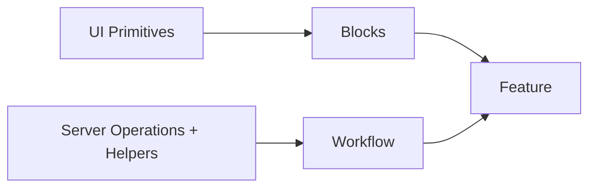
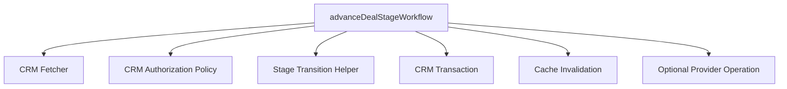
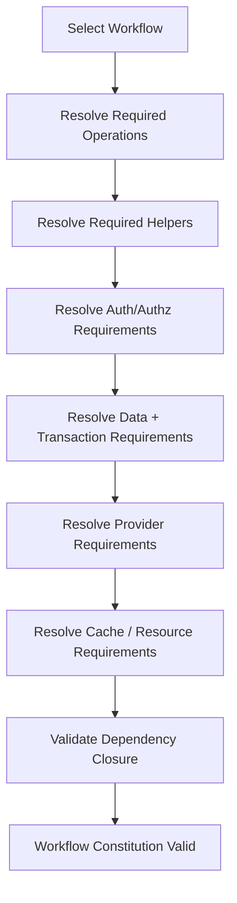

# Canonical Workflow Constitution Correction

> **Workflows do not merely contain the business logic left over after other responsibilities have been classified. A workflow is the named constitution through which existing server operations and helpers are arranged into reusable application logic.**

**Status:** Canonical correction  
**Applies to:** The Codependent Coding™ WebApp Architecture, The Hipster Stack™ Technology Stack, The Maximal Template™ Domain Library, Simples™, Ontologies™, The Constituter™, Ordinary Objects™, and Loaded Vibes™ architecture enforcement.

---

## 1. Purpose

This note corrects the canonical definition of **workflow** within The Codependent Coding™ WebApp Architecture.

Earlier architecture material defined `lib/workflows/` primarily by exclusion:

> domain or business logic that remains after reads, CRUD writes, authentication, authorization, transactions, integrations, constants, utilities, and other more precise responsibilities have been classified.

That definition was useful for preventing workflows from becoming a generic service layer, but it was incomplete.

The previous definition described what a workflow was **not** without sufficiently defining what a workflow **is**.

The corrected architecture gives workflows a positive responsibility:

> **A workflow is a reusable constitution of application logic formed by arranging existing server operations and helpers into a coherent behavioral capability.**

This correction supersedes prior definitions of workflows as merely “remaining domain logic” or a residual business-logic category. The existing master architecture currently contains that older residual definition and should be updated accordingly.

---

# 2. Canonical Definition

## Workflow

A **Workflow** is a named, reusable orchestration boundary for application logic.

A workflow **constitutes behavior** by arranging existing server operations and helpers according to the rules, sequence, dependencies, conditions, and invariants required to realize an application capability.

Possible constituents include:

```text
fetchers
actions
transaction helpers
authentication helpers
authorization policies
roles
permissions
resource policies
provider integration operations
cache operations
schemas
validation helpers
domain helpers
constants
utilities
other architecture-owned server capabilities
```

These capabilities do not lose their individual architectural identities when used by a workflow.

A fetcher remains a fetcher.

An action remains an action.

A transaction remains a transaction.

An authorization policy remains an authorization policy.

A Stripe operation remains a Stripe integration operation.

The workflow establishes the **arrangement through which those capabilities act together**.

---

# 3. Constituted, Not Composable

The distinction is fundamental.

The architecture should not describe a workflow as though several smaller objects are physically assembled into a larger composite object.

Instead:

```text
existing server operations + helpers
                ↓
        ordered relationships
                ↓
      constraints + conditions
                ↓
          coordination
                ↓
           WORKFLOW
                ↓
   higher-order application behavior
```

The workflow exists in the **constitution of those relationships**.

Its constituents continue to exist independently before, during, and after that constitution.

This is the practical architectural meaning of:

> **Constituted, Not Composable.**

---

# 4. The Origami Model

An origami swan provides the useful conceptual model.

Begin with a sheet of paper.

Fold it according to a particular arrangement and a swan appears.

```text
paper
  ↓
fold relationships
  ↓
origami constitution
  ↓
swan
```

Unfold the paper.

The swan is gone.

The paper is not.

Nothing had to be destroyed for the swan to cease existing. The higher-order form existed because of the arrangement imposed upon material that remained independently real throughout the process.

A workflow behaves the same way.

```text
fetcher
action
authz policy
transaction
provider helper
cache helper
    │
    ├──── arranged according to application rules
    │
    ▼
WORKFLOW
    │
    ▼
higher-order application behavior
```

Remove that arrangement and the workflow ceases to exist as that workflow.

Its constituents remain perfectly valid architectural capabilities.

The application's ability to fetch data did not disappear.

The action did not disappear.

The authorization policy did not disappear.

The provider operation did not disappear.

What disappeared was the particular **constitution that made them behave as one named application process**.

---

# 5. Workflows Constitute Logic

The corrected distinction is:

```text
server operations + helpers
        ↓
    constitute
        ↓
     workflow
        ↓
 reusable application logic
```

A workflow therefore functions as the architecture's **logic unit**.

This gives application logic an explicit reusable boundary equivalent in purpose—not implementation—to the presentation system's reusable units.

The presentation side has identifiable visual capabilities:

```text
UI primitives
      ↓
presentation arrangements
      ↓
blocks
```

The application-logic side has identifiable behavioral capabilities:

```text
server operations + helpers
           ↓
 behavioral arrangements
           ↓
       workflows
```

A feature can then orchestrate the application capability by using the presentation and logic required by that feature.



The arrows indicate architectural use and constitution, not ontological part-whole ownership.

---

# 6. Workflow Constituents Retain Their Responsibilities

A workflow may coordinate many server responsibilities, but it does not absorb them.

This invariant is critical.

| Capability | Architectural owner | Workflow relationship |
|---|---|---|
| Persisted read | `lib/fetchers/` | Workflow invokes the fetcher when the behavior requires persisted state. |
| Ordinary CRUD mutation | `lib/actions/` | Workflow invokes the action when the behavior requires that mutation boundary. |
| Atomic persistence | `lib/db/transactions/` | Workflow invokes the transaction when several database effects must share atomicity. |
| Authentication | `lib/auth/` | Workflow uses identity/session capabilities when required. |
| Authorization | `lib/authz/` | Workflow evaluates the required application access rules. |
| Provider behavior | `lib/integrations/{provider}/` | Workflow invokes provider-specific operations without absorbing provider mechanics. |
| Cache behavior | `lib/cache/` | Workflow may participate in required invalidation or cache lifecycle behavior. |
| Runtime validation | `schemas/` | Workflow may depend upon validated inputs or invoke appropriate validation boundaries. |
| Generic/domain helper | appropriate `lib/` owner | Workflow coordinates the helper as part of the behavioral constitution. |

The workflow owns the **relationship and orchestration**.

It does not steal responsibility from the capabilities it coordinates.

---

# 7. Workflow Is Not a Service Layer

This correction does **not** create a generic application-service abstraction.

The following remains prohibited without a separate real architectural justification:

```text
services/
managers/
processors/
use-cases/
application-services/
domain-services/
business-services/
```

A workflow is not where arbitrary server code goes.

It is not permission to move fetcher implementation into workflows.

It is not permission to move CRUD persistence into workflows.

It is not permission to implement Stripe mechanics inside workflows.

It is not permission to redefine authorization inside workflows.

It is not a wrapper around every function merely to produce another layer.

A workflow must represent an identifiable application behavior whose constitution has architectural value.

---

# 8. Workflows Are Not Mandatory for Trivial Operations

Not every action requires a workflow.

A simple CRUD operation can remain:

```text
feature
    ↓
action
    ↓
database
```

For example:

```text
rename project
update contact phone number
archive simple record
change profile display name
```

If the action already completely expresses the required behavior, inventing a workflow adds nothing.

A workflow becomes appropriate when a meaningful application capability requires several operations, rules, decisions, conditions, or effects to act according to a defined behavioral arrangement.

Therefore:

> **Workflows are first-class logic units, but they are not mandatory ceremony.**

---

# 9. Example: Deal Advancement

Consider:

```text
advanceDealStageWorkflow
```

Advancing a CRM deal may require:

```text
get current deal
        ↓
authorize actor against deal
        ↓
validate requested stage transition
        ↓
determine transition consequences
        ↓
persist the new state atomically
        ↓
record related activity
        ↓
invalidate affected CRM views
        ↓
optionally trigger provider behavior
```

Those concerns already have architectural owners.

The workflow does not replace those owners.

Instead:



`advanceDealStageWorkflow` is the named behavioral constitution.

Remove that workflow and the fetcher, policy, transaction helper, cache helper, and provider operation still exist.

What no longer exists is their particular arrangement into **advance deal stage** behavior.

---

# 10. Example: Invoice Approval

A more consequential example:

```text
approveInvoiceWorkflow
```

may be constituted from:

```text
invoice fetcher
billing authorization policy
invoice readiness helper
invoice total validation
approval transaction
audit helper
Stripe operation where applicable
cache invalidation
```

The workflow establishes:

- sequencing;
- conditions;
- required relationships;
- decision points;
- failure boundaries;
- application invariants;
- consequences of successful completion.

The workflow does not turn Stripe into billing domain logic or turn a transaction into a workflow.

Each constituent retains its own responsibility.

---

# 11. Feature and Workflow Distinction

Features and workflows are both orchestration boundaries, but they operate at different architectural surfaces.

## Feature

A **feature** constitutes an application capability at the route/application layer.

It may coordinate:

- presentation;
- workflows;
- fetchers;
- actions;
- authentication;
- authorization;
- client boundaries;
- application state;
- other required application helpers.

Its purpose is to make the capability available to the application interface.

## Workflow

A **workflow** constitutes reusable application **logic**.

It coordinates the server operations and helpers necessary for a defined behavior.

Its purpose is not presentation.

The relationship is therefore:

```text
route
  ↓
feature
  ├── presentation
  │     ↓
  │   blocks
  │     ↓
  │   primitives
  │
  └── application logic
        ↓
      workflows
        ↓
      server operations + helpers
```

A feature answers:

> **What application capability is this interface orchestrating?**

A workflow answers:

> **What arrangement of server capabilities constitutes the behavior required by that capability?**

---

# 12. Workflows as Simples™

Under The Maximal Template™ Domain Library, a supported workflow may be represented as a **Simple™**.

This does not mean the workflow is an independently composable package.

It means the architecture and generator recognize it as a normalized supported unit of application logic.

A workflow Simple may declare:

```text
identity
domain
purpose
requirements
dependencies
conflicts
server operations
helpers
required resources
required authorization
required integrations
required routes/features
owned generator artifacts
configuration properties
```

The workflow can therefore participate in the same normalized configuration model used by The Constituter™ and Hipster Stack™ generator.

---

# 13. Constituter Implications

The corrected workflow definition provides the missing configurable abstraction for the logic side of The Constituter™.

Presentation can already be configured through normalized relationships such as:

```text
feature
  ↓
block
  ↓
primitive
  ↓
variant
  ↓
semantic design tokens
```

Application logic can now be configured through:

```text
feature
  ↓
workflow
  ↓
server operations + helpers
```

This allows The Constituter to expose meaningful behavioral choices rather than arbitrary source-file toggles.

For example, a user should not ordinarily configure:

```text
☑ getInvoiceById
☑ requireBillingPermission
☑ calculateInvoiceTotals
☑ createApprovalAuditEvent
☑ approveInvoiceTx
☑ invalidateInvoiceCache
```

Those implementation capabilities may instead be constituted as:

```text
☑ Invoice Approval Workflow
```

The configuration engine resolves the constituent requirements automatically.

That is a genuine generator-level capability rather than decorative configurability.

---

# 14. Dependency Resolution

A selectable workflow carries the dependencies required for that workflow to exist.



A user may configure the application at the workflow level.

The dependency graph determines what underlying server operations and helpers must remain in the generated application.

The user therefore controls **meaningful logic capabilities** without being required to understand every implementation dependency.

---

# 15. Generator Implications

During generation, Hipster Stack must reason about workflow constitution explicitly.

A selected workflow requires its constituent capabilities.

A removed workflow does **not** automatically mean every constituent capability should be removed, because another workflow or feature may require the same capability.

Therefore artifact retention is dependency-based:

```text
selected workflow
      ↓
required capabilities
      ↓
shared dependency graph
      ↓
artifact ownership
      ↓
retain / remove / transform
```

This is another reason the workflow must not be modeled as a composite blob containing duplicated copies of its dependencies.

A fetcher shared by three workflows remains one fetcher.

An authorization policy shared by six workflows remains one authorization policy.

A provider helper required by several behaviors remains one provider helper.

The workflows differ in the constitutions they establish.

---

# 16. Canonical Workflow Invariants

The following rules are normative.

1. **A workflow is a positive architectural responsibility, not a residual category.**
2. **A workflow constitutes reusable application logic from existing server operations and helpers.**
3. **Workflow constituents retain their original architectural ownership and identity.**
4. **A workflow owns orchestration, sequencing, relationships, conditions, and behavioral invariants—not every implementation it invokes.**
5. **A workflow may coordinate fetchers, actions, transactions, auth, authz, provider operations, cache behavior, schemas, and appropriate helpers.**
6. **Provider mechanics remain provider-owned.**
7. **Persisted reads remain fetcher-owned.**
8. **Ordinary CRUD mutation boundaries remain action-owned.**
9. **Atomic database invariants remain transaction-owned.**
10. **Authentication remains auth-owned.**
11. **Authorization remains authz-owned.**
12. **Network/provider operations remain outside database transactions.**
13. **A workflow is created only when a meaningful reusable behavioral constitution exists.**
14. **Trivial CRUD does not require a ceremonial workflow.**
15. **Workflow dependency closure must be machine-resolvable when the workflow is exposed through The Constituter or generator.**
16. **Removing a workflow does not imply removing a constituent that remains required elsewhere.**
17. **A selectable workflow must correspond to a real supported implementation in The Maximal Template.**
18. **Features may use workflows as reusable units of application logic.**

---

# 17. Corrected Architecture Classifier

The previous classifier:

```text
REMAINING DOMAIN / BUSINESS LOGIC?
    lib/workflows/{domain}/
```

is superseded.

The corrected classifier is:

```text
REUSABLE ORCHESTRATION OF APPLICATION LOGIC?
    lib/workflows/{domain}/

    Does it arrange multiple server operations,
    helpers, rules, conditions, or effects into a
    named application behavior?

        YES → workflow

        NO  → place the capability according to
              its own architectural responsibility
```

The classifier for underlying responsibilities remains unchanged:

```text
PERSISTED DATABASE READ?
    lib/fetchers/

ORDINARY CRUD WRITE?
    lib/actions/

ATOMIC DATABASE OPERATION?
    lib/db/transactions/

AUTHENTICATION?
    lib/auth/

AUTHORIZATION?
    lib/authz/

PROVIDER-SPECIFIC BEHAVIOR?
    lib/integrations/{provider}/

CACHE?
    lib/cache/

GENERIC / DOMAIN HELPER?
    its most precise existing lib responsibility
```

---

# 18. Corrected Governing Sentence

The existing governing sentence defines workflows as owners of remaining domain logic. That language is superseded.

The corrected governing sentence is:

> **Routes own URL and HTTP boundaries. Features orchestrate application capabilities. Components render. Fetchers read persisted data. Actions own ordinary CRUD mutation boundaries. Schemas validate runtime input. Workflows constitute reusable application logic from server operations and helpers. Transactions preserve atomic database invariants. Authentication establishes identity. Authorization decides access. Integrations own provider mechanics. Webhooks own provider HTTP request lifecycles.**

---

# 19. Corrected Logic Model

The canonical application model is now:

```text
URL / HTTP
    ↓
route
    ↓
feature
    │
    ├──────── PRESENTATION
    │
    │         blocks
    │           ↓
    │       UI primitives
    │           ↓
    │    semantic design tokens
    │
    └──────── APPLICATION LOGIC
              │
              workflows
              │
              ├── fetchers
              ├── actions
              ├── transactions
              ├── auth
              ├── authz
              ├── integrations
              ├── cache
              ├── schemas
              └── server helpers
```

This model gives the generator two explicit configurable constitutions beneath the feature boundary:

```text
presentation constitution
    primitives → blocks

behavioral constitution
    server capabilities → workflows
```

The feature then orchestrates the application capability that uses them.

---

# 20. Mereological Clarification

The architecture intentionally avoids treating higher-order behavior as proof that a new independently existing composite object has appeared.

A workflow is real as an architectural relation and executable behavior.

That does not require pretending its constituents cease to be independently meaningful or become ontological fragments of a larger object.

The arrangement matters.

The constituents matter.

The relationship between them matters.

The workflow is the name given to the stable behavioral constitution produced by that arrangement.

Or, less formally:

> **Fold the server operations correctly and you get business logic. Unfold them and the workflow disappears. The fucking fetcher is still sitting there.**

---

# 21. Canonical Summary

A workflow is **not**:

- miscellaneous business logic;
- a generic service;
- a replacement for actions;
- a replacement for fetchers;
- a transaction;
- an integration;
- an authorization policy;
- a container into which related server code is physically moved;
- a mandatory layer around trivial CRUD.

A workflow **is**:

- a named behavioral constitution;
- a reusable unit of application logic;
- an orchestration boundary;
- an arrangement of existing server operations and helpers;
- dependency-resolvable;
- selectable when supported by the Maximal Template;
- configurable through The Constituter where appropriate;
- reusable by features;
- removable without implying that its still-required constituents cease to exist.

## Governing Principle

> **Server operations and helpers own capabilities. Workflows constitute behavior from those capabilities. Features orchestrate that behavior into application capabilities.**

Or, in the language of the stack:

> **The workflow is not the pieces. The workflow is how the pieces are constituted.**

**Constituted, Not Composable.**