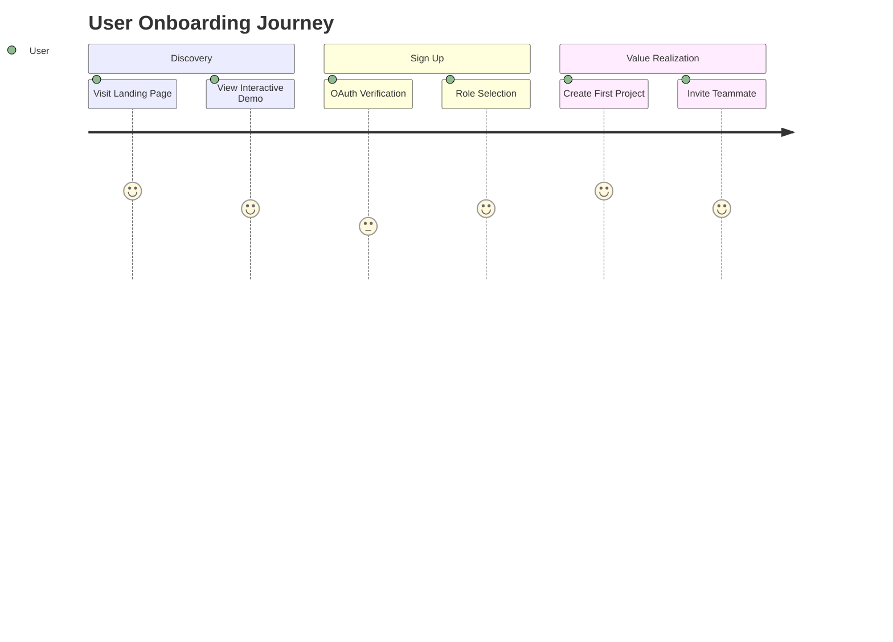
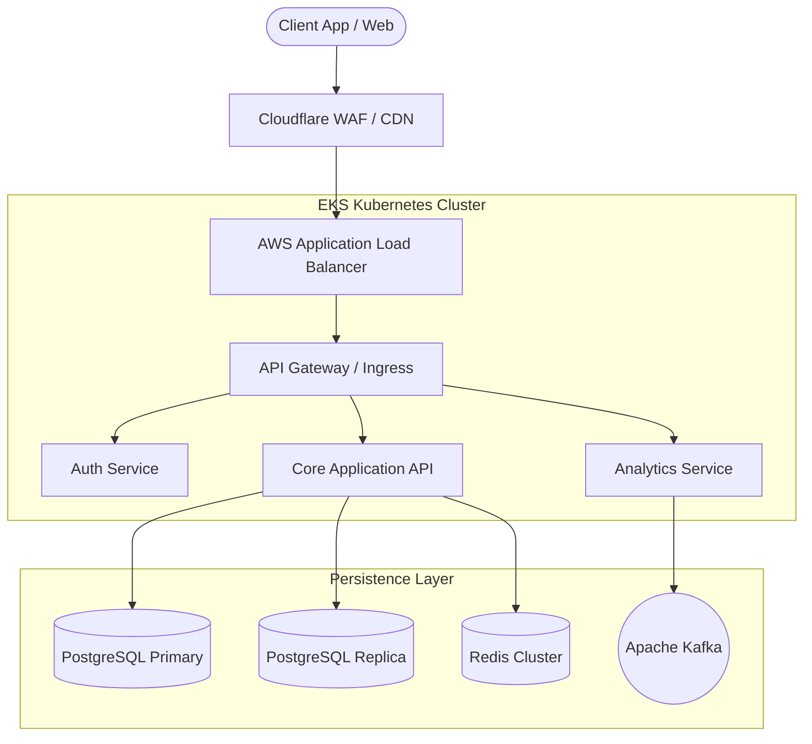
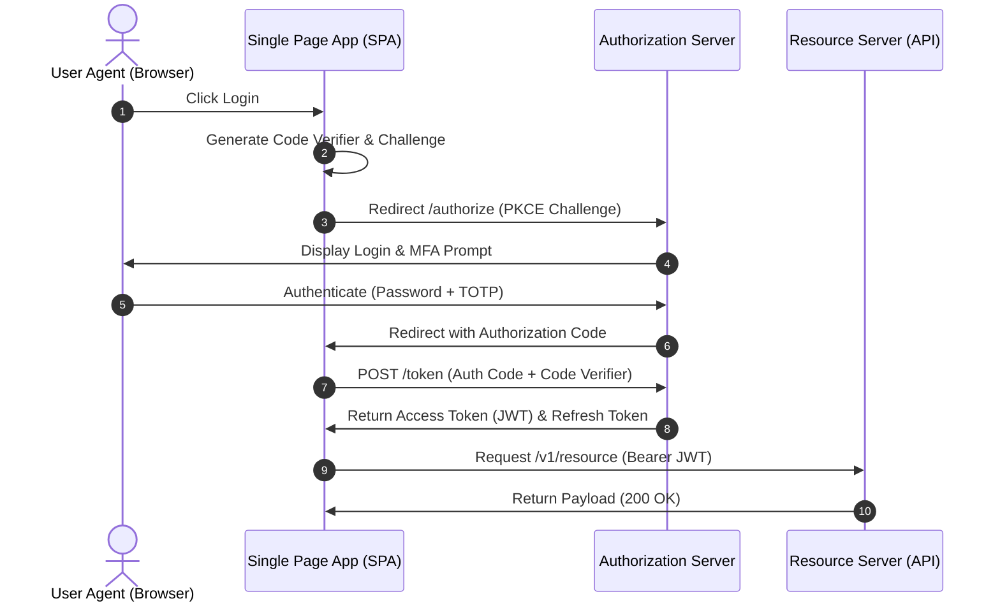
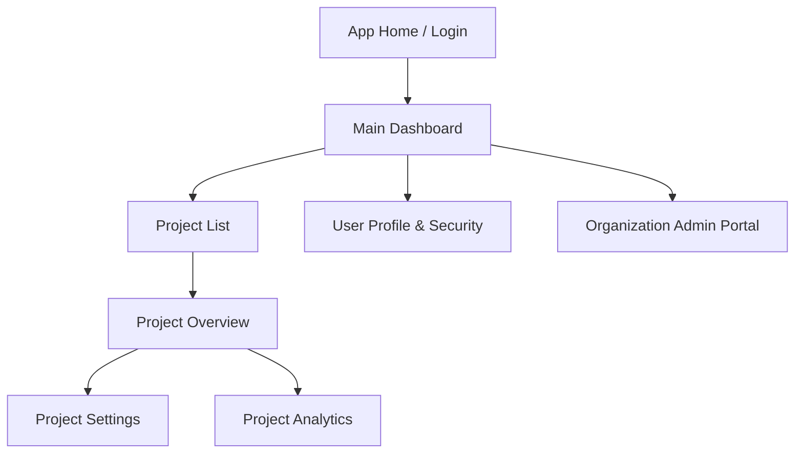

# Enterprise Software Engineering Template Suite

---

## Document 1: Product Requirements Document (PRD)

**Document Metadata**
* **Project Name:** [Project Title]
* **Product Manager:** [PM Name]
* **Engineering Lead:** [Eng Lead Name]
* **Design Lead:** [Design Lead Name]
* **Status:** [Draft / Under Review / Approved / In Development]
* **Target Release Date:** [YYYY-MM-DD]
* **Last Updated:** [YYYY-MM-DD]

---

### 1. Executive Summary & Problem Statement
* **Background & Context:** Describe the current state, pain points, or market opportunities.
* **Problem Statement:** What specific problem are we solving? Who is impacted, and why is this problem critical to solve now?
* **Value Proposition:** What is the proposed solution, and how does it deliver value to users and the business?

---

### 2. Goals & Success Metrics
#### 2.1 Business Objectives
* [Objective 1: e.g., Increase user retention by 15% in Q3]
* [Objective 2: e.g., Reduce customer onboarding friction]

#### 2.2 Key Performance Indicators (KPIs)
| Metric | Baseline | Target Goal | Tracking Method |
| :--- | :--- | :--- | :--- |
| **Activation Rate** | 24% | 40% | Amplitude / Mixpanel |
| **P99 Response Time** | N/A | < 200ms | Datadog |
| **Churn Rate** | 5.2% | < 3.0% | Stripe Analytics |

---

### 3. User Personas & Use Cases
#### 3.1 Primary Personas
* **[Persona 1 Name / Role]:** Brief background, key motivations, pain points.
* **[Persona 2 Name / Role]:** Brief background, key motivations, pain points.

#### 3.2 User Stories & Journey


---

### 4. Functional Requirements
*Prioritized using the MoSCoW Framework (Must have, Should have, Could have, Won't have).*

| ID | Module / Feature | Description | Priority | Target Persona |
| :--- | :--- | :--- | :--- | :--- |
| **FR-01** | User Authentication | SSO via Google & GitHub with MFA support. | **Must** | All |
| **FR-02** | Dashboard Analytics | Real-time chart visualization of daily usage stats. | **Must** | Admin |
| **FR-03** | CSV Data Export | Export raw transactional data to standard CSV. | **Should** | Manager |
| **FR-04** | Custom Theme Customizer | Dark/Light theme toggle with accent colors. | **Could** | All |

---

### 5. Non-Functional Requirements (High-Level)
* **Performance:** Page load under 1.5 seconds globally on 4G networks.
* **Scalability:** Support up to 50,000 concurrent active users at peak load.
* **Availability:** 99.9% uptime SLA.
* **Compliance:** GDPR, CCPA, and SOC 2 Type II readiness.

---

### 6. Scope Out & Risks
#### 6.1 Out of Scope (Explicitly Excluded)
* Native mobile applications (iOS/Android) for Phase 1.
* Legacy database migration tools.

#### 6.2 Risks & Dependencies
| Risk / Dependency | Impact | Mitigation Strategy | Owner |
| :--- | :--- | :--- | :--- |
| **Third-party API Rate Limits** | High | Implement Redis caching layer with fallback backoff. | Eng Lead |
| **Regulatory Delay (GDPR)** | Medium | Legal counsel review scheduled for Week 2. | Product Lead |

---

<br>

---

## Document 2: Technical Requirements Document (TRD)

**Document Metadata**
* **Project Name:** [Project Title]
* **Author(s):** [Tech Lead / Principal Engineer]
* **PRD Reference:** [Link to PRD]
* **Status:** [Draft / Approved / In Progress]
* **Target Implementation Date:** [YYYY-MM-DD]

---

### 1. Technical Scope & System Boundary
* **Overview:** High-level summary of technical changes required across existing services and newly proposed infrastructure.
* **In-Scope Engineering:** Services, APIs, datastores, background workers, and pipelines to be modified/built.
* **Out-of-Scope Technical Work:** Infrastructure or legacy components left untouched.

---

### 2. Detailed Non-Functional Requirements (NFRs)
#### 2.1 Latency, Throughput & Scale
* **Read Throughput:** Target $5,000\text{ RPS}$ peak load.
* **Write Throughput:** Target $1,200\text{ RPS}$ peak load.
* **Latency SLAs:** 
  * $P_{50} \le 50\text{ ms}$
  * $P_{95} \le 150\text{ ms}$
  * $P_{99} \le 300\text{ ms}$

#### 2.2 Reliability & Fault Tolerance
* **Availability Target:** $99.95\%$ uptime (max $\approx 21.9\text{ minutes}$ downtime/month).
* **RPO (Recovery Point Objective):** $< 1\text{ minute}$ of data loss.
* **RTO (Recovery Time Objective):** $< 15\text{ minutes}$ for service restoration.

---

### 3. Data Storage & Schema Requirements
* **Primary Database:** PostgreSQL 16 (Relational consistency, transactional support).
* **Cache Layer:** Redis Cluster v7 (Session caching, rate limiting).
* **Search / Analytics Engine:** OpenSearch (Log aggregation and full-text querying).

#### Data Retention & Archival
* Active data stored in PostgreSQL for 180 days.
* Cold data migrated to S3 Parquet format via automated ETL pipelines for long-term storage.

---

### 4. Service Interfaces & API Contracts
* **Protocol:** REST / gRPC / GraphQL
* **Data Serialization:** JSON / Protobuf
* **Error Handling Standard:** RFC 7807 Problem Details format.

```json
{
  "type": "https://api.example.com/errors/rate-limit-exceeded",
  "title": "Too Many Requests",
  "status": 429,
  "detail": "Quota exceeded. Allowed limit: 100 req/min.",
  "instance": "/v1/projects/1234/deployments"
}
```

---

### 5. Technical Risk Assessment
| ID | Technical Risk | Severity | Probability | Mitigation Strategy |
| :--- | :--- | :--- | :--- | :--- |
| **TR-01** | Database locking on large concurrent writes | High | Medium | Implement connection pooling (PgBouncer) & optimistic locking |
| **TR-02** | Cold start latency in serverless edge functions | Low | High | Provision warm instances for critical user flows |

---

<br>

---

## Document 3: Architecture Document (AD)

**Document Metadata**
* **Project Name:** [Project Title]
* **System Architect:** [Architect Name]
* **Status:** [Draft / Under Review / Approved]
* **Version:** 1.0.0

---

### 1. Executive Summary & Architectural Goals
This document specifies the system architecture for [Project Title]. Key goals:
1. **Decoupled Architecture:** Microservices communicating asynchronously via Kafka message queues.
2. **Horizontal Scalability:** Stateless compute tier deployed on Kubernetes (EKS).
3. **High Availability:** Multi-AZ deployment across three Availability Zones.

---

### 2. High-Level Architecture


---

### 3. Subsystem Breakdown & Components
#### 3.1 API Gateway Tier
* **Technology:** Envoy / Kong
* **Responsibilities:** SSL termination, rate-limiting, CORS enforcement, global request routing.

#### 3.2 Compute Services
* **Core Service:** Go / Node.js stateless web service scaling automatically via Kubernetes HPA based on CPU/Memory thresholds.
* **Worker Service:** Python / Go background workers consuming events from Kafka topics.

#### 3.3 Storage Layer
* **Database Strategy:** CQRS pattern separating high-throughput writes from query-heavy read traffic.

---

### 4. Cross-Cutting Concerns
#### 4.1 Observability (Metrics, Logs, Traces)
* **Metrics:** Prometheus scrapers collecting application and node metrics, visualized in Grafana.
* **Distributed Tracing:** OpenTelemetry collectors forwarding trace data to Jaeger/Datadog.
* **Structured Logging:** JSON formatted logs shipped via Vector to Elastic Cloud.

#### 4.2 Disaster Recovery & Business Continuity
* **Multi-AZ Failover:** Automatic health check routing across 3 Availability Zones.
* **Database Backups:** Automated continuous WAL-G backups to Amazon S3 with cross-region replication.

---

<br>

---

## Document 4: Authentication & Authorization (AuthN/AuthZ) Specification

**Document Metadata**
* **Project Name:** [Project Title]
* **Security Lead / Architect:** [Security Lead Name]
* **Status:** [Draft / Approved]
* **Compliance Standards:** OIDC, OAuth 2.0, NIST SP 800-63B

---

### 1. Identity & Authentication (AuthN)
#### 1.1 Authentication Protocol
* **Standard:** OpenID Connect (OIDC) built on OAuth 2.0.
* **Supported Identity Providers (IdPs):** Okta, Auth0, Google Workspace SSO, Azure AD.

#### 1.2 User Authentication Flow (Authorization Code Flow with PKCE)


---

### 2. Token Specification & Management
#### 2.1 Token Lifecycle
* **Access Tokens:** Short-lived JSON Web Tokens (JWT). Expiration: 15 minutes.
* **Refresh Tokens:** Encrypted tokens stored in secure, `HttpOnly`, `SameSite=Strict` cookies. Expiration: 7 days with sliding window rotation.

#### 2.2 JWT Payload Schema Definition
```json
{
  "iss": "https://auth.example.com/",
  "sub": "usr_987654321",
  "aud": "https://api.example.com",
  "exp": 1700000000,
  "iat": 1699999100,
  "org_id": "org_acme_corp",
  "roles": ["workspace_admin", "developer"],
  "permissions": ["projects:read", "projects:write", "users:manage"]
}
```

---

### 3. Authorization (AuthZ) Architecture
#### 3.1 Model: Role-Based & Attribute-Based Access Control (RBAC / ABAC)
Access control decisions are validated using fine-grained authorization policy evaluation.

| Role | Target Resource | Allowed Actions | Conditions |
| :--- | :--- | :--- | :--- |
| **Owner** | `Organization` | `Create, Read, Update, Delete` | Is active billing member |
| **Admin** | `Project` | `Create, Read, Update` | Belongs to Target `org_id` |
| **Member** | `Project` | `Read` | Belongs to Target `org_id` |

---

### 4. Security Enforcement & Data Protection
* **Data in Transit:** TLS 1.3 enforced across all public and internal service boundaries.
* **Token Invalidation / Revocation:** Redis token blocklist checked on every high-privilege API request.

---

<br>

---

## Document 5: Design Specification Document (UI/UX & Frontend Design)

**Document Metadata**
* **Project Name:** [Project Title]
* **Design Lead:** [Designer Name]
* **Frontend Lead:** [Frontend Engineer Name]
* **Figma Workspace:** [Link to Figma Tokens / Components]

---

### 1. User Experience Principles & Guidelines
* **Clarity First:** Prioritize visual hierarchy, minimal interface clutter, and immediate user feedback.
* **Accessibility (a11y):** Full WCAG 2.1 Level AA compliance across all web and mobile views.
* **Performance-Driven UX:** Optimistic UI updates, skeleton loaders, and smooth 60fps animations.

---

### 2. Information Architecture & Navigation Structure


---

### 3. Design Tokens & Visual System Specifications
#### 3.1 Color System
| Token Name | Hex Code | Purpose / Usage |
| :--- | :--- | :--- |
| `color-brand-primary` | `#2563EB` | Primary buttons, active states, key interactive links |
| `color-surface-bg` | `#0F172A` | Background visual layer (Dark Theme) |
| `color-text-primary` | `#F8FAFC` | High-contrast body copy |
| `color-status-error` | `#EF4444` | Validation errors, destructive actions |

#### 3.2 Typography Tokens
* **Primary Font Family:** Inter, system-ui, sans-serif.
* **Scale:**
  * `text-xs`: 12px / Line Height: 16px
  * `text-sm`: 14px / Line Height: 20px
  * `text-base`: 16px / Line Height: 24px
  * `text-xl`: 20px / Line Height: 28px
  * `text-display`: 32px / Line Height: 40px

---

### 4. Interactive States & Component Standards
#### Component: Button (`Primary`)
* **Default:** Background `color-brand-primary`, text white, border-radius `6px`.
* **Hover:** Lighten background by 10%, cursor pointer.
* **Focused:** $2\text{px}$ outline offset with `color-brand-primary` ring.
* **Disabled:** Opacity 50%, `cursor: not-allowed`, no mouse pointer events.
* **Loading State:** Replace label with centered loading spinner; maintain explicit button width to prevent layout shift.

---

### 5. Accessibility & Responsiveness Strategy
* **Keyboard Navigation:** Full support for `Tab`, `Shift+Tab`, `Space`, `Enter`, and `Escape` key interactions.
* **Screen Readers:** Mandatory `aria-label`, `aria-expanded`, `aria-live`, and semantic HTML structures (`<main>`, `<nav>`, `<header>`).
* **Responsive Breakpoints:**
  * **Mobile:** $320\text{px} - 639\text{px}$
  * **Tablet:** $640\text{px} - 1023\text{px}$
  * **Desktop:** $1024\text{px} +$