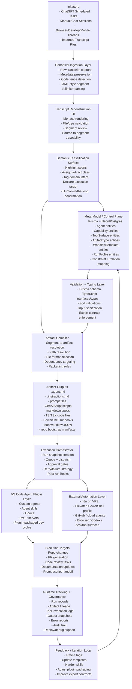

```mermaid

flowchart TD
    A["Initiators
    - ChatGPT Scheduled Tasks
    - Manual Chat Sessions
    - Browser/Desktop/Mobile Threads
    - Imported Transcript Files"] --> B["Canonical Ingestion Layer
    - Raw transcript capture
    - Metadata preservation
    - Code fence detection
    - XML-style segment delimiter parsing"]

    B --> C["Transcript Reconstruction UI
    - Monaco rendering
    - File/tree navigation
    - Segment review
    - Source-to-segment traceability"]

    C --> D["Semantic Classification Surface
    - Highlight spans
    - Assign artifact class
    - Tag domain intent
    - Declare execution target
    - Human-in-the-loop confirmation"]

    D --> E["Meta-Model / Control Plane
    Prisma + Neon/Postgres
    - Agent entities
    - Capability entities
    - ToolSurface entities
    - ArtifactType entities
    - WorkflowTemplate entities
    - RunProfile entities
    - Constraint + relation mapping"]

    E --> F["Validation + Typing Layer
    - Prisma schema
    - TypeScript interfaces/types
    - Zod validations
    - Input sanitization
    - Export contract enforcement"]

    D --> G["Artifact Compiler
    - Segment-to-artifact resolution
    - Path resolution
    - File format selection
    - Dependency targeting
    - Packaging rules"]

    F --> G

    G --> H["Artifact Outputs
    - .agent.md
    - .instructions.md
    - prompt files
    - GenAIScript scripts
    - markdown specs
    - TS/TSX code files
    - PowerShell runbooks
    - n8n workflow JSON
    - repo bootstrap manifests"]

    H --> I["Execution Orchestrator
    - Run snapshot creation
    - Queue + dispatch
    - Approval gates
    - Retry/failure strategy
    - Post-run hooks"]

    I --> J["VS Code Agent Plugin Layer
    - Custom agents
    - Agent skills
    - Hooks
    - MCP servers
    - Plugin-packaged dev cycles"]

    I --> K["External Automation Layer
    - n8n on VPS
    - Elevated PowerShell profile
    - GitHub / cloud agents
    - Browser / Codex / desktop surfaces"]

    J --> L["Execution Targets
    - Repo changes
    - PR generation
    - Code review tasks
    - Documentation updates
    - Prompt/script handoff"]

    K --> L

    L --> M["Runtime Tracking + Governance
    - Run records
    - Artifact lineage
    - Tool invocation logs
    - Output snapshots
    - Error reports
    - Audit trail
    - Replay/debug support"]

    M --> N["Feedback / Iteration Loop
    - Refine tags
    - Update templates
    - Harden skills
    - Adjust plugin packaging
    - Improve export contracts"]

    N --> E

```

