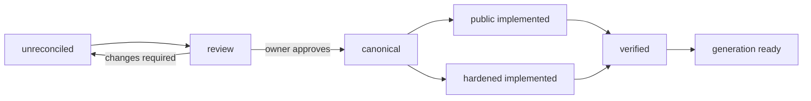

# Simple Canonicalization Workflow

> [!abstract]
> One Simple means one real source file. This workflow turns accumulated architecture material + observed source + owner decisions into one approved Simple record with a public golden prototype, hardened golden prototype, relationship model, and generation disposition.

## Gate Zero — Select One Real File

Canonicalization starts from an actual file path, not a broad concept.

Examples:

- `lib/fetchers/projectsFetchers.ts`
- `lib/db/tenant.ts`
- `components/blocks/kanban-board.tsx`
- `app/crm/pipeline/page.tsx`
- `prisma.config.ts`

A library page such as **Database** may aggregate several Simples, but it does not become one fake mega-Simple merely because the website has one Database route.

## 1. Gather Evidence

Collect four evidence classes for the selected file:

1. **Codependent Coding knowledge** — current architecture, doctrine, corrections, patterns, security rules, lifecycle material.
2. **Observed public/demo implementation** — current Maximal Template/showroom source.
3. **Observed related implementation** — imports, callers, callees, selects, DTOs, policies, transactions, schemas, tests, config, migrations, provider boundaries.
4. **Historical/superseded material** — retained long enough to expose contradictions instead of silently averaging them together.

Record source pointers in the Simple note under `source_mirror`, `depends_on`, and **Source Material** links.

## 2. Classify the File

Apply the current architecture classifier before writing doctrine.

The Simple's `simple_type` records the file's architectural responsibility, for example:

```text
route
feature
page-template
block
primitive
fetcher
action
workflow
transaction
select
dto-mapper
auth
authz
integration
webhook
schema
type
cache
constant
utility
config
prisma-lifecycle
database
```

Do not create a new class because a file has an interesting name. Classify by what it actually does.

## 3. Reconcile Contradictions

For every material conflict, write:

- **source conflict** — the competing rules/implementations;
- **newest controlling direction** — when an explicit later user decision exists;
- **observed implementation evidence** — what the source actually does today;
- **proposed winning rule** — what should become canonical;
- **owner approval** — `pending` until explicitly approved.

### Rule

A document being newer, larger, or labeled canonical does not bypass the owner approval gate when this process is reconciling competing source material.

### Known example

Older material defined workflows as residual business/domain logic. The later explicit correction defines workflows positively as reusable constitutions of existing server operations/helpers. The corrected workflow definition therefore controls the proposal, but each affected Simple still records the decision and approval state rather than pretending the conflict never existed.

## 4. Write the Architectural Contract

Populate the Simple note's **Codependent Coding Knowledge** section:

- Canonical Definition
- Responsibility
- Contract
- Invariants
- Boundaries & Separations
- Interfaces & Exposures
- Lifecycle / State / Transitions
- Side Effects
- Anti-Patterns
- Canonicalization Decisions

The contract must explain what the file **owns** and what it **does not own**.

## 5. Encode Relationships

Direct relationships belong in properties/wikilinks so Obsidian and future machine tooling can consume them.

### Relationship classes

| Property | Meaning |
|---|---|
| `uses` | Direct architectural/source dependency. |
| `requires` | Must exist for this Simple/composition to be valid. |
| `permits` | Explicitly valid optional relationship. |
| `conditional` | Valid only when a stated condition holds. |
| `prohibits` | Architecture-forbidden relationship. |
| `substitutes` | Supported alternative occupying the same role. |
| `variants` | Supported implementation/presentation variation of the same Simple. |
| `ontologies` | Ontology/application recipes in which the Simple participates. |
| `providers` | External providers materially involved in the Simple. |

Do **not** manually maintain inverse properties when Obsidian backlinks/Dataview can derive them.

## 6. Model the Negative Space

Every consequential Simple should identify not only what connects to it, but what would be invalid.

Classify candidate relationships as:

```text
required
permitted
conditional
prohibited
architectural nonsense / invalid composition
```

This is the knowledge layer that can later become architecture validation and Anthimeria dependency rules.

## 7. Establish the Public Demo Golden Prototype

Copy or normalize the actual public/showroom implementation into the note.

The public prototype may deliberately differ from production when the demo doctrine requires public browsability, seeded data, simulated mutation behavior, or other explicitly safe showcase behavior.

Never describe a shortcut as hardened behavior.

Record:

- `public_source_path`
- `public_implementation_status`
- exact code or a source-backed complete implementation
- demo-only assumptions

## 8. Establish the Hardened Golden Prototype

Derive the hardened implementation from:

1. approved architecture/security doctrine;
2. existing implementation evidence;
3. explicit hardening backlog findings;
4. the smallest complete change that makes the intended production claim true.

Do not invent a second architecture merely because the public demo differs.

Record:

- `hardened_source_path`
- `hardened_implementation_status`
- complete proposed/approved hardened code
- explicit **Hardening Delta**

If no code difference is justified, say so. A pure block, select, DTO mapper, type, or config file may legitimately have identical public/hardened source while surrounding runtime contracts differ.

## 9. Classify Generation Disposition

For each Simple choose the supported disposition:

- **Invariant** — architecture/security behavior that always ships.
- **Derived** — included because selected application/presentation composition requires it.
- **Selectable** — genuine supported whole-application capability choice.
- **Presentation-configurable** — page/block/primitive/variant/token choice exposed to the user.

Backend security and dependency closure are not optional checkboxes.

## 10. Validate

Populate `tests` and `validation` from the behavior that actually matters.

Typical checks:

- architecture boundary;
- typecheck/build;
- exact caller/callee relationships;
- read-only/write-only responsibility;
- tenant/resource scope;
- auth/authz behavior;
- RLS enforcement under actual runtime role;
- provider signature/retry/idempotency semantics;
- concurrency behavior;
- accessibility for presentation Simples;
- generation/dependency closure.

Evidence, not prose confidence, advances implementation status.

## 11. Owner Canonicalization Gate

Before a Simple becomes canonical:

```text
canonicalization_status: review
owner_approval: pending
```

After explicit approval and required reconciliation:

```text
canonicalization_status: canonical
owner_approval: approved
status: active
authority: source-of-truth
```

Approval can accept the proposal, change it, or send it back through reconciliation.

## 12. Project to the Website

Only after the record is coherent should the website consume it.

The same underlying Simple record projects three user-facing views:

### Architecture

Definition, responsibility, contract, invariants, boundaries, anti-patterns, lifecycle, relationships, constraints.

### Implementation

Properties, dependency/constraint relationships, variants, Ontology membership, generation disposition, and real supported controls.

### Source

Public Demo Golden Prototype and Hardened Golden Prototype, with the hardening delta visible rather than hidden.

## 13. Finish the Implementation Pair

While context is fresh:

1. implement/verify the public showroom file;
2. implement/verify the hardened file or edition-specific transform;
3. update the Simple note with real source paths and evidence;
4. update backlinks/relationships;
5. mark statuses truthfully;
6. continue to the next file required by the dependency graph.

## Status State Machine



Public and hardened implementation can progress in parallel after the architectural contract is sufficiently stable; their status fields remain independent.

## First Reference Slice

[[codependentcoding.simples.database.map|Database]] is the first reference slice. It proves that a website-level library can aggregate multiple one-file Simples while preserving file-level ownership and a real public/hardened source delta.
