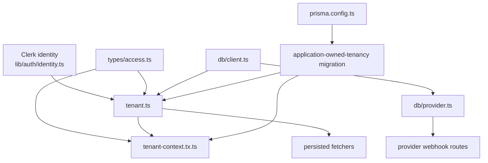

# Database Library

> [!abstract] First vertical slice
> **Database is a library projection, not one giant Simple.** A Simple still means one real source file. This map gathers the file-level Simples that currently constitute the database foundation and provides the model the public Database page can project.

## Current Public Projection

The current Hipster Stack deployment models Database as one hard-coded library item in `apps/web/lib/libraries.ts` and renders it through `features/libraries/library-detail.tsx`.

Current public copy:

- **Category:** Data
- **Title:** Database
- **Description:** Neon/Postgres, Prisma, and tenant containment.
- **Status:** Fixed foundation
- **Highlights:** Postgres, Prisma, Tenant containment
- **Related:** Organizations, RBAC, Core
- **Works with:** Billing, Auth

The existing detail page turns that model into the decorative `Included / Fixed foundation` panel plus static highlight and relationship cards. That page is useful as presentation scaffolding, but it is not the future source of truth.

## File-Level Simples in This Slice

| Simple | Architectural responsibility | Public code | Hardened disposition |
|---|---|---|---|
| [[codependentcoding.database.client.simple]] | Prisma + Neon runtime client | Observed | Same code shape; runtime credential must become non-bypass |
| [[codependentcoding.database.tenant.simple]] | Tenant transaction boundary + showroom read boundary | Observed | Remove demo identity from ordinary generated reads |
| [[codependentcoding.database.provider.simple]] | Provider/webhook DB transaction boundary | Observed | Same core shape; provider truth and retry semantics remain external concerns |
| [[codependentcoding.transactions.tenant-context.simple]] | Resolve local app tenancy and set transaction-local context | Observed | Current application-owned tenancy shape is suitable; verify under restricted role |
| [[codependentcoding.prisma.application-owned-tenancy.simple]] | RLS policy correction for application-owned organizations/memberships | Observed | Same SQL policy model; enforcement depends on restricted runtime role |
| [[codependentcoding.config.prisma.simple]] | Prisma migration/seed connection lifecycle | Observed | Migration connection stays privileged and separate from runtime connection |
| [[codependentcoding.types.access.simple]] | Identity/access contracts | Observed | Same contract |

## Architecture



The arrows mean architectural dependency/use, not part-whole ownership.

## Canonical Knowledge

### Database responsibility

`lib/db/` owns Prisma/Neon runtime database infrastructure and reusable database-specific helpers. Prisma's schema, migration, generation, and seed lifecycle remain under the root `prisma/` responsibility.

### Tenant security path

The intended hardened path is:

```text
Clerk identity
    ↓
application User
    ↓
application Membership
    ↓
application Organization
    ↓
transaction-local app.organization_id
    ↓
scoped Prisma operation
    ↓
PostgreSQL RLS
```

The public showroom deliberately adds one extra boundary: `withTemplateReadTransaction()` pins read-only demo fetchers to the seeded demo identity so signed-out visitors can inspect the application.

### Public versus hardened

The public showroom and generated application are **not** different architectures. They are different security/runtime dispositions of the same source grammar.

- Public showroom: safe seeded/read-only browsing is allowed without authentication.
- Hardened template: ordinary fetchers resolve the real authenticated identity and application membership.
- Public showroom may run with deployment shortcuts, but it must not present those shortcuts as runtime security attestations.
- Hardened runtime must use a PostgreSQL role without `BYPASSRLS`; privileged owner/admin credentials are migration/administrative lifecycle only.

> [!warning] Verification boundary
> `The Maximal Template™ Backlog` records that the audited showroom connection was `neondb_owner` with `BYPASSRLS = true`. This map does **not** independently re-query the live database. Treat that as recorded implementation evidence until re-verified.

## Relationship Model

### Required

- `tenant.ts` requires the Prisma client, access contracts, and tenant-context transaction helper.
- tenant-context resolution requires Clerk identity to have been adapted into an application `User`.
- hardened tenant containment requires the application-owned tenancy policies and a non-bypass runtime DB role.
- Prisma migrations require the privileged/direct connection configured by `prisma.config.ts`.

### Permitted

- Fetchers may use the tenant transaction boundary.
- Provider webhook handlers may use provider transactions and organization-scoped provider transactions.
- Domain transaction helpers may use tenant-scoped transaction clients.

### Conditional

- `withTemplateReadTransaction()` is valid only for the public showroom/read-only demonstration boundary.
- Provider organization context is valid only after the provider payload has been authenticated and mapped to trusted application state.

### Prohibited

- Public demo identity in generated/private application fetchers.
- Runtime application traffic using a `BYPASSRLS` role while claiming RLS containment.
- Provider network calls inside Prisma transaction callbacks.
- Treating Clerk organization state as the canonical application tenant model.

## Website Projection

The future `/libraries/database` page can now be driven from this library map + child Simple records rather than the current static `libraries.ts` copy.

Suggested first workbench presentation:

1. **File explorer** — the seven Simples above as the initial database tree.
2. **Code surface** — public and hardened source tabs from the selected Simple note.
3. **Architecture** — responsibility, invariants, boundaries, anti-patterns.
4. **Relationships** — required/permitted/conditional/prohibited relationships as compact controls.
5. **Implementation consequence** — selecting `Public Showroom` vs `Hardened Template` changes the displayed source/security disposition where the source actually differs.
6. **No fake toggle:** RLS and tenant isolation are not end-user configuration choices.

## Canonicalization Status

This is a **review slice**, not owner-approved canon.

The observed source and current doctrine are reconciled enough to demonstrate the model, but every child Simple remains `owner_approval: pending`. Nothing becomes canonical merely because this map says it.

## Source Material

- [[10.PROJECTS.CODEPENDENTCODING.WebApp-Architecture.Master.Source-Document]]
- [[10.PROJECTS.CODEPENDENTCODING.WebApp-Architecture.Template-Demo]]
- [[10.PROJECTS.CODEPENDENTCODING.WebApp-Architecture.Template-Backlog]]
- [[simples.ts|current public library registry]]
- [[simplesFeature.tsx|current public library detail renderer]]

## Dataview

```dataview
TABLE simple_type AS "Type", source_path AS "Source", canonicalization_status AS "Canonical", public_implementation_status AS "Public", hardened_implementation_status AS "Hardened"
FROM "10 PROJECTS/10.PROJECTS.CODEPENDENTCODING/10.PROJECTS.CODEPENDENTCODING.Simples"
WHERE parent = link("codependentcoding.simples.database.map")
SORT source_path ASC
```
