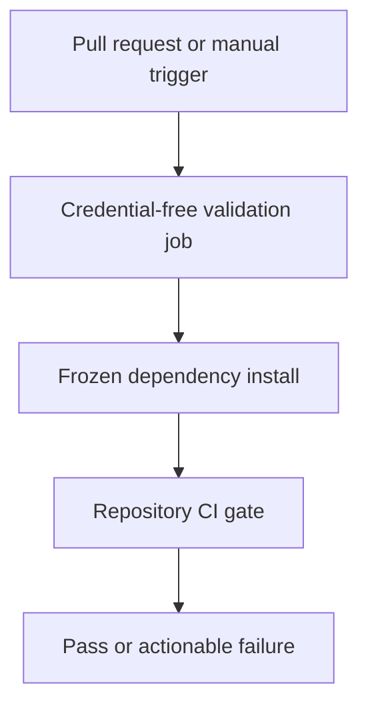

# `spec-process-cicd-pull-request-validation.md`

> [!info] Generated source mirror
> Original path: `The Hipster Stack™ Technology Stack\template\spec\spec-process-cicd-pull-request-validation.md`
> SHA-256: `17c3a49fc3de972c3ac218f6e745d7c207ae935b40ad803e5a49758e1ea41961`

````markdown
---
title: CI/CD Workflow Specification - Pull Request Validation
version: 1.0
date_created: 2026-08-03
last_updated: 2026-08-03
owner: Repository maintainer
tags: [process, cicd, github-actions, validation]
---

## Workflow Overview

**Purpose**: Give every pull request one deterministic credential-free install, validation, test, and production-build result.

**Trigger Events**: Pull request changes and explicit manual dispatch.

**Target Environments**: Ephemeral GitHub-hosted Linux runner; no deployment environment.

## Execution Flow Diagram



## Jobs & Dependencies

| Job Name   | Purpose                                   | Dependencies         | Execution Context          |
| ---------- | ----------------------------------------- | -------------------- | -------------------------- |
| validation | Install and execute the local CI contract | Repository toolchain | GitHub-hosted Linux runner |

## Requirements Matrix

### Functional Requirements

| ID      | Requirement                                        | Priority | Acceptance Criteria                            |
| ------- | -------------------------------------------------- | -------- | ---------------------------------------------- |
| REQ-001 | Install exactly the locked dependency graph        | High     | Frozen install succeeds or fails the job       |
| REQ-002 | Use the repository-pinned runtime/toolchain        | High     | No floating local/CI package-manager selection |
| REQ-003 | Execute the same credential-free gate used locally | High     | One local script determines the result         |
| REQ-004 | Cancel a superseded run for the same change        | Medium   | Older in-progress run is cancelled             |

### Security Requirements

| ID      | Requirement                         | Implementation Constraint                        |
| ------- | ----------------------------------- | ------------------------------------------------ |
| SEC-001 | Read-only repository access         | No write, token persistence, or environment gate |
| SEC-002 | No provider/database credentials    | Validation must pass with secrets absent         |
| SEC-003 | No deployment or migration mutation | Workflow performs validation only                |

### Performance Requirements

| ID       | Metric           | Target                 | Measurement Method  |
| -------- | ---------------- | ---------------------- | ------------------- |
| PERF-001 | Job count        | One validation job     | Workflow inspection |
| PERF-002 | Maximum duration | Twenty minutes or less | Job timeout         |

## Input/Output Contracts

### Inputs

```yaml
repository_event: pull_request | workflow_dispatch
provider_secrets: none
deployment_environment: none
```

### Outputs

```yaml
validation_status: success | failure | cancelled
logs: step-scoped install or validation diagnostics
```

### Secrets & Variables

None beyond GitHub's read-only repository token.

## Execution Constraints

- **Timeout**: Twenty minutes maximum.
- **Concurrency**: One current run per workflow/change identity; superseded work is cancelled.
- **Permissions**: Repository contents read-only.
- **Runner**: GitHub-hosted Linux.

## Error Handling Strategy

| Error Type      | Response          | Recovery Action                            |
| --------------- | ----------------- | ------------------------------------------ |
| Frozen install  | Fail install step | Repair dependency manifest/lockfile parity |
| Validation/test | Fail CI-gate step | Reproduce with the same local gate         |
| Superseded run  | Cancel            | Follow the newest commit's run             |

## Quality Gates

| Gate                          | Criteria                                 | Bypass Conditions |
| ----------------------------- | ---------------------------------------- | ----------------- |
| Credential-free repository CI | Local CI contract completes successfully | None in workflow  |
| Repository secret scan        | Owned by the existing separate workflow  | Not duplicated    |

Coverage thresholds, visual suites, browser matrices, real-database attacks, deployments, and migrations are explicitly outside this workflow.

## Monitoring & Observability

GitHub retains normal workflow logs and status. This baseline adds no external alerts, metrics, or observability integration.

## Integration Points

| System               | Relationship                                      |
| -------------------- | ------------------------------------------------- |
| Repository scripts   | Sole source of validation behavior                |
| Secret scan workflow | Independent required repository-security evidence |
| Vercel               | Deployment-specific evidence; not invoked here    |

## Compliance & Governance

- Workflow changes require the normal Issue-linked pull request and fresh checks.
- Action dependencies remain immutable-reference pinned.
- Production deployment, migration, and credential changes require owner authorization elsewhere.

## Edge Cases & Exceptions

| Scenario                  | Expected Behavior            | Validation Method      |
| ------------------------- | ---------------------------- | ---------------------- |
| Provider secrets absent   | Validation still passes      | Pull request run       |
| Lockfile drift            | Frozen install fails clearly | Contract test/workflow |
| New commit supersedes old | Older run is cancelled       | Concurrency inspection |

## Validation Criteria

- **VLD-001**: Workflow has one read-only validation job.
- **VLD-002**: All third-party actions use immutable commit references.
- **VLD-003**: Frozen install and the local CI gate are the only implementation commands.
- **VLD-004**: Contract tests reject deployment, migration, coverage, or browser expansion.

## Change Management

1. Update this behavioral specification when scope changes.
2. Review the associated Issue and accepted ADRs.
3. Change the workflow and its contract test together.
4. Confirm the pull request's own validation and security checks.

## Version History

| Version | Date       | Changes               | Author                |
| ------- | ---------- | --------------------- | --------------------- |
| 1.0     | 2026-08-03 | Initial specification | Repository maintainer |

## Related Specifications

- [ADR-0010: CI and Vercel ownership](../docs/adr/adr-0010-ci-and-vercel-ownership.md)
- [Quality-gates contract](../.agents/contracts/quality-gates.yaml)

````