# The Codependent Coding™ WebApp Architecture

> [!IMPORTAT]
> **Authoritative architecture, composition, generation, domain-library, and agent-tooling reference.**

**Edition:** 2026.08  
**Status:** Active source of truth  
**Scope:** Application architecture, technology/generator model, maximal domain library, configuration model, generated-project contract, and architecture-aware Codex tooling.

---

## Executive Summary

The **Codependent Coding™ WebApp Architecture** is the umbrella system for defining how a modern, opinionated, multi-tenant TypeScript web application is structured, configured, generated, extended, and validated.

It unifies five tightly related but non-interchangeable parts:

| Part                                            | Role                                                                                                                                                                                     |
| ----------------------------------------------- | ---------------------------------------------------------------------------------------------------------------------------------------------------------------------------------------- |
| **The Codependent Coding™ WebApp Architecture** | The governing architecture and documentation system. It defines responsibilities, boundaries, invariants, composition, security posture, and implementation grammar.                     |
| **The Hipster Stack™ Technology Stack**         | The concrete technology stack plus deterministic constitution/generation system and CLI that consumes a dependency-closed Virgule against The Maximal Template.                          |
| **The Maximal Template™ Domain Library**        | The single runnable superset application containing every supported implementation that may be retained, removed, or transformed during generation.                                      |
| **Simples™ and Ontologies™**                    | The normalized building-block catalog and the nine default application-definition starting points used to configure the maximal template.                                                |
| **The Loaded Vibes™ Codex Plugin**              | The Codex-oriented architecture-enforcement and software-operations layer: governance, agents, skills, instructions, prompts, validators, smoke tests, and developer-environment assets. |

The generated standalone application is **The Arrangement™ Generated Artifact**: a white-label project produced when The Hipster Stack consumes a dependency-closed **Virgule™ Application Definition** against The Maximal Template. It contains no runtime dependency on the generator and no requirement to remain connected to a hosted control plane.

The architecture is deliberately opinionated. It does not ask each project, developer, or coding agent to rediscover where reads, writes, workflows, policies, provider code, transactions, forms, presentation, routes, or webhooks belong. Responsibility is classified by **what code does**.

### Governing sentence

> [!IMPORTANT]
**Routes own URL and HTTP boundaries. Features orchestrate application capabilities. Components render. Fetchers read persisted data. Actions own ordinary CRUD mutation boundaries. Schemas validate runtime input. Workflows constitute reusable application logic from server operations and helpers. Transactions preserve atomic database invariants. Authentication establishes identity. Authorization decides access. Integrations own provider mechanics. Webhooks own provider HTTP request lifecycles.**

### Governing structural rule

```text
functional responsibility first
    ↓
minimum hierarchy necessary
    ↓
stable explicit boundaries
    ↓
deterministic configuration
    ↓
generated standalone application
```

---

# 1. Authority, Scope, and Source Precedence

## 1.1 Controlling direction

This document adopts the newest explicit product direction:

- **The Codependent Coding™ WebApp Architecture** is the umbrella architecture and documentation system.
- **The Hipster Stack™ Technology Stack** is the technology/generator/CLI system.
- **The Maximal Template™ Domain Library** is the single superset implementation source.
- **Simples™** are the normalized supported building blocks exposed from the maximal template.
- **Ontologies™** are the nine default normalized SaaS starting specifications.
- **The Anthimeria™ Workbench** is the web configuration workbench.
- **The Virgule™ Application Definition** is the portable recipe configured in Anthimeria and progressed through draft, normalized, validated, and dependency-closed states.
- **The Arrangement™ Generated Artifact** is the generated standalone application.
- **Loaded Vibes™** is the architecture-aware Codex coding-agent plugin.

Older documents that assign these names different product roles are historical implementation evidence only where they conflict with this direction.

## 1.2 Source precedence used by this document

When supplied material disagrees, this document resolves the disagreement using the following precedence:

1. the newest explicit user-authored direction and explicit instructions;
2. the later Maximal Template demo doctrine where it refines architecture behavior;
3. the Maximal Template canonical architecture;
4. current repository-local source-of-truth documents in `DigitalHerencia/TheHipsterStack`;
5. durable Codependent Coding / DevNotes architecture, security, lifecycle, and knowledge-system material where compatible;
6. current repository implementation as evidence of what exists;
7. older product-role descriptions and superseded synthesis material.

This hierarchy is intentionally explicit. A source can remain valuable implementation evidence without retaining authority over product identity.

## 1.3 Normative versus observed material

This note distinguishes two types of statements:

- **Normative architecture** — what the system is supposed to be and the rules a conforming implementation follows.
- **Observed implementation state** — what a repository currently implements or names today.

Observed state does not silently redefine normative architecture. Conversely, this document does not claim an implementation exists merely because the architecture defines it.

---

# 2. System Identity and Product Topology

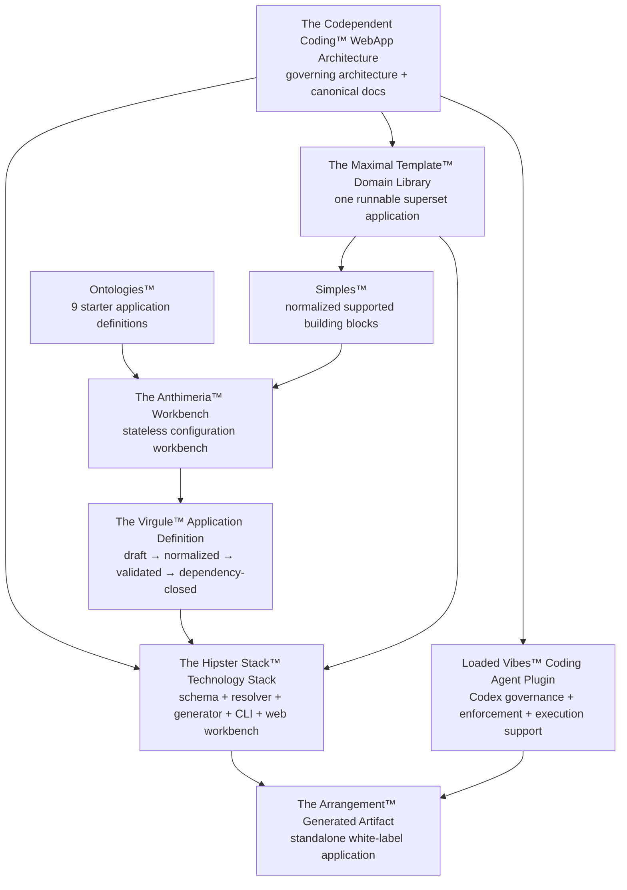

## 2.1 The architecture is not the generator

The architecture defines the rules, boundaries, and supported composition model. The Hipster Stack implements those rules as a deterministic project constitution/generation system.

## 2.2 The generator is not the template

The generator owns configuration semantics, dependency resolution, artifact ownership, transformation logic, safe materialization, and CLI/Web adapters.

The Maximal Template owns application code.

Generator metadata whose only purpose is to tell the generator how to prune or transform the template must remain outside the standalone template.

## 2.3 Simples are not arbitrary packages

A **Simple™** is a normalized supported building block in the domain library. A Simple may correspond to a route surface, feature, block, primitive, workflow, integration capability, server operation/helper, validation shape, or style capability.

The brand name does **not** imply that every Simple can be selected independently. Dependency rules determine legal composition.

## 2.4 Ontologies are presets over one model

An **Ontology™** is a normalized starter application definition. The nine Ontologies are default starting points, not nine separate templates and not nine separate applications.

Every Ontology resolves through the same configuration contract and can be customized within the set of generator-supported choices.

---

# 3. Architectural Invariants

The following invariants are architecture-level defaults.

1. **Responsibilities are classified by behavior, not by fashionable abstraction names.**
2. **Routes stay thin.**
3. **Normal features orchestrate; they do not become presentation junk drawers.**
4. **Pure presentation owns no persisted reads/writes, authorization, provider SDKs, or business workflows.**
5. **All persisted application reads live in fetchers.**
6. **Ordinary persisted CRUD writes live behind actions.**
7. **Workflows constitute named reusable application logic by arranging existing server operations and helpers; their constituents retain their original responsibilities.**
8. **Database selects, DTO mappers, and atomic transaction helpers live under the DB responsibility.**
9. **Authentication and authorization remain separate.**
10. **Application tenancy is application-owned unless explicitly changed by a later accepted decision.**
11. **Provider mechanics live with the provider, except when a stronger application responsibility owns them.**
12. **Webhook HTTP lifecycle remains at the HTTP edge.**
13. **PostgreSQL RLS is a containment layer, not a replacement for application authorization.**
14. **Network/provider calls do not occur inside database transaction helpers.**
15. **Consequential authorization, payment, readiness, and tenant decisions must not depend on stale cache.**
16. **Client code exists only when browser behavior requires it.**
17. **No new directory exists without a real responsibility boundary.**
18. **No configuration control exists unless it produces a real deterministic generation effect.**
19. **Generated applications remain runnable and understandable without generator internals.**
20. **Architecture enforcement should be mechanizable where a stable boundary exists.**

---

# 4. Architecture at a Glance

## 4.1 Presentation and application flow

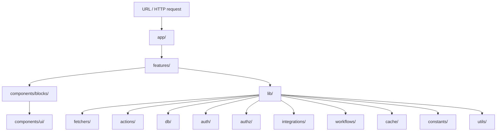

The canonical normal presentation chain is:

```text
UI primitive
    ↓
block
    ↓
feature
    ↓
page / route
```

Two deliberate exceptions are defined later:

- static public pages may compose blocks directly when no application orchestration exists;
- React Hook Form feature forms may compose UI primitives directly.

## 4.2 Responsibility map

| Concern | Canonical home | Core rule |
|---|---|---|
| URL / page route | `app/` | Own routing and route-level HTTP concerns only. |
| Provider webhook route | `app/api/{provider}/.../route.ts` | Own raw request lifecycle and provider acknowledgement. |
| Application orchestration | `features/` | Combine application helpers and presentation. |
| Browser-only orchestration | `*.client.tsx` | Create only when browser state/interaction requires it. |
| Reusable UI composition | `components/blocks/` | Pure presentation composed from primitives. |
| Navigation | `components/nav/` | Reusable structural presentation. |
| Page/application shell | `components/shells/` | Reusable structural frame. |
| Raw UI primitive | `components/ui/` | Lowest-level presentation primitive. |
| Persisted read | `lib/fetchers/` | Read-only. |
| Ordinary persisted CRUD write | `lib/actions/` | Mutation boundary; authn/authz/validation/scoping required as applicable. |
| Prisma runtime/client | `lib/db/` | Database runtime infrastructure. |
| Prisma select | `lib/db/selects/` | Precise persisted projection. |
| DTO mapper | `lib/db/dto/` | Persisted/domain shape → transport-safe application shape. |
| Atomic DB transaction | `lib/db/transactions/` | Preserve multi-write database invariants. |
| Authentication | `lib/auth/` | Clerk and app-facing identity/session helpers. |
| Authorization | `lib/authz/` | RBAC, ABAC, resource policy, tenant/resource decisions. |
| Provider behavior | `lib/integrations/{provider}/` | Provider-specific client/mechanics/adapters. |
| Reusable application-logic orchestration | `lib/workflows/{domain}/` | Constitute named behavior from existing server operations and helpers; do not wrap trivial CRUD ceremonially. |
| Cache | `lib/cache/` | Tags, lifetimes, invalidation and related infrastructure. |
| Constant | `lib/constants/` | Stable shared constants. |
| Generic utility | `lib/utils/` | True generic utility only. |
| Prisma schema/migrations/seed | `prisma/` | Prisma-owned lifecycle. |
| Runtime schemas | `schemas/` | Shared Zod validation at trust boundaries. |
| Shared TS contracts | `types/` | Useful shared compile-time contracts. |

---

# 5. Routes and HTTP Boundaries

## 5.1 Route ownership

`app/` owns:

- URL structure;
- layouts;
- route groups;
- route loading/error boundaries;
- Next.js route handlers;
- provider webhook HTTP boundaries.

It does not own:

- database reads;
- ordinary CRUD persistence logic;
- authorization policy definitions;
- provider SDK mechanics;
- domain workflows;
- arbitrary presentation implementation.

## 5.2 Public route group

Static public content belongs under a public route group such as:

```text
app/(public)/
├── page.tsx
├── features/
│   └── page.tsx
├── pricing/
│   └── page.tsx
├── faq/
│   └── page.tsx
├── contact/
│   └── page.tsx
├── terms/
│   └── page.tsx
└── privacy/
    └── page.tsx
```

**Marketing** is a business/application domain. It is not the architectural name for all public content.

## 5.3 Static public-page exception

If a public page has no persisted read, persisted write, application workflow, auth/authz orchestration, or provider operation, it does **not** need a meaningless feature layer.

A static public page may directly compose pure blocks:

```tsx
export default function HomePage() {
  return (
    <>
      <HeroCentered />
      <FeatureGrid />
      <StatsSection />
      <CallToAction />
    </>
  );
}
```

Do not create `landingFeature`, public-page fetchers, or public-page actions merely for symmetry.

## 5.4 Data-driven route pattern

A normal dynamic route remains thin:

```text
app/(tenant)/projects/[projectId]/page.tsx
            ↓
ProjectDetailFeature
            ↓
fetchers / authz / workflows / blocks
```

When useful, wrap the feature in route-level Suspense:

```tsx
<Suspense fallback={<ProjectDetailSkeleton />}>
  <ProjectDetailFeature projectId={projectId} />
</Suspense>
```

Feature-specific skeletons live with the feature and should mirror the real layout.

---

# 6. Features and Presentation

## 6.1 Normal feature contract

A feature is an application capability boundary.

A normal feature may orchestrate:

```text
feature
├── fetcher(s)
├── action(s)
├── workflow helper(s)
├── auth/authz helper(s)
├── integration helper(s)
├── cache helper(s)
├── schema/type contracts
└── presentation blocks
```

Normal features consume blocks rather than scattering raw UI primitives through application orchestration.

## 6.2 Client feature boundary

Server Components are the default.

Create a `.client.tsx` companion only for browser-specific needs such as:

- drag and drop;
- browser-only APIs;
- local interaction state;
- live filtering/sorting where client ownership is deliberate;
- rich editors;
- interactive calendars;
- streaming presentation behavior that requires client state.

A client feature does not become permission to move server responsibilities into the browser.

## 6.3 Form feature exception

All application forms use **React Hook Form** unless a later explicit decision changes that.

Forms are a deliberate exception to the normal feature → block presentation rule. A domain form may be a self-contained feature that composes UI primitives directly:

```text
features/projects/newProjectForm.tsx
├── React Hook Form
├── Zod resolver/schema
├── submission behavior
├── project action
├── relevant auth/authz
└── components/ui/*
```

Do **not** create a generic form block merely to wrap domain-form presentation.

Do **not** create parallel architecture such as:

```text
forms/
form-hooks/
form-fields/
form-services/
```

unless a later real responsibility justifies it.

## 6.4 Blocks

`components/blocks/` contains reusable pure UI compositions.

Blocks may:

- compose UI primitives;
- expose narrow presentation props;
- implement presentation-only variation;
- render visual states.

Blocks do not:

- query Prisma;
- mutate persisted state;
- perform authorization;
- own React Hook Form state;
- call provider SDKs;
- run domain workflows;
- own route behavior.

Grouped block files may provide multiple related variants, for example:

```text
hero-sections.tsx
├── HeroCentered
├── HeroSplit
├── HeroWithStats
└── HeroMinimal
```

## 6.5 UI primitives

`components/ui/` is the lowest-level presentation layer. It may contain shadcn/BoldKit-derived primitives adapted to the project design system.

Primitives must not own domain or server responsibilities.

---

# 7. Persisted Reads: Fetchers

A fetcher is **every persisted application database read**.

```text
lib/fetchers/
├── crmFetchers.ts
├── projectFetchers.ts
├── supportFetchers.ts
└── ...
```

A fetcher:

- is read-only;
- authenticates when the operation requires identity;
- authorizes when the operation requires access control;
- incorporates tenant/resource scope into the query itself;
- uses precise Prisma selects where useful;
- maps persisted records to appropriate DTOs;
- may use safe cache behavior;
- never performs a persisted mutation.

## 7.1 Protected-read path

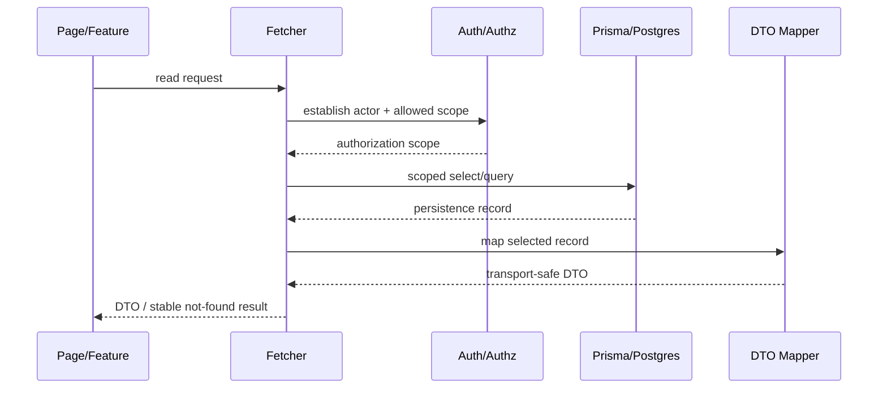

The important security rule is not “fetch broadly and check later.” Tenant/resource scope belongs in the actual persisted read predicate whenever feasible.

---

# 8. Persisted Writes: Actions, Workflows, and Transactions

## 8.1 Action contract

`lib/actions/` owns ordinary persisted CRUD mutation boundaries.

Examples:

```text
createContact
updateContact
deleteContact
createProject
archiveInvoice
restoreTicket
```

An action may:

1. authenticate;
2. authorize;
3. validate runtime input;
4. normalize mutation input;
5. preserve tenant/resource scope;
6. perform a simple CRUD write directly when the operation is genuinely simple;
7. call a workflow when the mutation has meaningful domain sequencing/rules;
8. call a transaction helper when atomic multi-write persistence is required;
9. invalidate relevant cache;
10. return a stable result or redirect as appropriate.

Actions are **not** generic application-service buckets.

Provider-specific mechanics do not become actions merely because a button initiated them.

## 8.2 Workflow contract

`lib/workflows/{domain}/` owns named reusable orchestration boundaries that constitute application logic by arranging existing server operations and helpers according to meaningful behavioral rules, sequencing, conditions, dependencies, and invariants.

The capabilities used by a workflow retain their architectural identity and ownership: a fetcher remains a fetcher, an action remains an action, a transaction remains a transaction, authorization remains authorization, and provider mechanics remain integration-owned. A workflow owns their behavioral arrangement; it does not absorb their implementations or become a generic service layer.

Examples:

```text
workflows/crm/advanceDealStage.ts
workflows/projects/resolveTaskDependencies.ts
workflows/support/determineEscalation.ts
workflows/invoicing/calculateInvoiceTotals.ts
workflows/social/resolvePublishTime.ts
```

A workflow may coordinate multiple application responsibilities but remains domain-oriented and shallow.

Avoid:

```text
services/
use-cases/
application/
domain/services/
managers/
processors/
```

unless a concrete later boundary requires them.

## 8.3 Transaction helper contract

`lib/db/transactions/` owns atomic database operations and multi-write persistence invariants.

A transaction helper:

- receives already-valid persistence-ready inputs;
- performs only database work that must succeed/fail atomically;
- may set transaction-local tenant context where required;
- may write audit/outbox state as part of the same atomic unit;
- never performs network/provider calls inside the transaction;
- does not own the HTTP request lifecycle;
- does not become the business workflow.

## 8.4 Mutation path

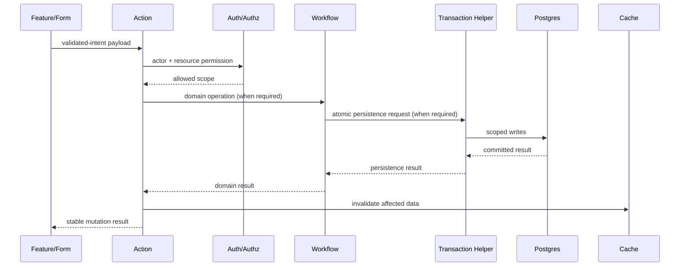

For trivial CRUD, the workflow or transaction step may not be necessary. The architecture does not add layers merely to satisfy a diagram.

---

# 9. Database Layer, Selects, DTOs, and Data Contracts

## 9.1 `lib/db/`

```text
lib/db/
├── client.ts
├── selects/
├── dto/
└── transactions/
```

Neon database responsibility terminates here.

Prisma runtime/database access belongs here; Prisma's schema/migration/seed lifecycle remains at repository root under `prisma/`.

## 9.2 Selects

A Prisma select defines the exact persisted projection needed by an operation.

Selects should:

- minimize unnecessary columns;
- make persisted shape intentional;
- support authorization scoping;
- support DTO mapping;
- avoid leaking giant generated record types into presentation code.

## 9.3 DTO mappers

DTO mappers convert persisted/domain values into transport-safe application data.

```text
Persistence Record
      ↓
DTO Mapper
      ↓
Transport-safe DTO
      ↓
Feature / Block
```

A DTO is not a duplicate Prisma model. It exists when the transport/application boundary has a different shape, representation, or trust requirement.

## 9.4 Schemas and types

`schemas/` owns runtime validation contracts such as Zod schemas.

`types/` owns useful shared TypeScript contracts.

Do not create schemas or types only to make directory symmetry look complete.

## 9.5 Trust progression

```text
external / untrusted
        ↓
runtime validated
        ↓
authenticated
        ↓
authorized
        ↓
domain-valid
        ↓
persistence-ready
        ↓
committed
        ↓
transport-safe
```

The system should make this progression visible in code ownership rather than treating “typed” and “trusted” as synonyms.

---

# 10. Authentication, Authorization, Tenancy, and RLS

## 10.1 Authentication

`lib/auth/` owns Clerk authentication implementation and app-facing session/identity helpers.

Authentication answers:

> **Who is this identity?**

Clerk owns verified external identity and session state.

## 10.2 Application-owned tenancy

The application database owns the product's tenant model unless explicitly reallocated later.

Canonical concepts include:

```text
User
Organization
Membership
Role
Capability / Permission
Resource
Policy
Tenant context
```

Clerk Organizations or metadata are not automatically the source of truth for product tenancy, business roles, entitlements, payment state, or workflow state.

## 10.3 Authorization

`lib/authz/` owns application authorization:

- roles;
- capabilities/permissions;
- resources;
- RBAC;
- ABAC;
- ownership rules;
- resource policy;
- tenant scope;
- high-risk operation restrictions.

Authorization answers:

> **What may this authenticated actor do to this resource in this context?**

## 10.4 Authorization progression

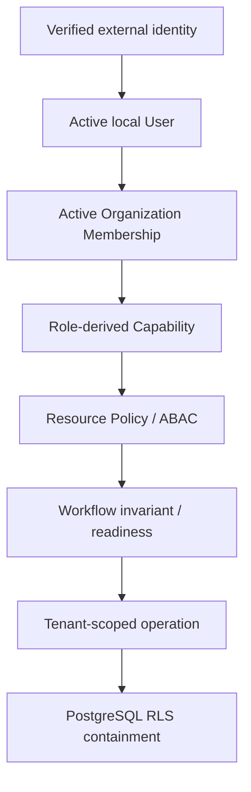

## 10.5 PostgreSQL RLS

RLS is defense in depth and a secure default for material tenant-owned production data where the application model supports tenant containment.

RLS:

- does not replace app authorization;
- should execute under a production-equivalent non-bypass role;
- should use trusted tenant context;
- should have explicit operation policies;
- should be validated with cross-tenant tests;
- requires a deliberate exception if omitted from material tenant-owned production data.

The preferred containment path is:

```text
Authentication
    ↓
Authorization
    ↓
Scoped query/write
    ↓
PostgreSQL RLS
```

---

# 11. Integrations and Provider Boundaries

## 11.1 Provider classification

Provider-specific external-service behavior belongs in:

```text
lib/integrations/{provider}/
```

Examples:

```text
lib/integrations/stripe/
lib/integrations/cloudinary/
lib/integrations/hugging-face/
lib/integrations/vercel-blob/
lib/integrations/sendgrid/
```

Possible provider files include:

```text
client.ts
config.ts
checkout.ts
portal.ts
subscriptions.ts
upload.ts
transformations.ts
email.ts
inference.ts
webhooks.ts
```

## 11.2 Functional exceptions

Three technology integrations are classified by stronger application responsibility:

```text
Clerk  → lib/auth/
Neon   → lib/db/
Prisma → lib/db/ + root prisma/
```

Classification follows what the technology **does in this architecture**, not merely who sells it.

## 11.3 Provider truth

Provider state and application interpretation remain distinct.

Examples:

- Stripe owns payment/refund/subscription truth.
- The application owns the entitlement or workflow consequence of that state.
- Clerk owns verified identity/session truth.
- The application owns memberships, business roles, tenant relationships, and domain lifecycle.

Provider mechanics should be adapted at provider boundaries rather than spread across features, actions, or UI.

---

# 12. Webhook HTTP Boundaries and Provider Reconciliation

Webhook handlers are HTTP boundaries and belong in `app/api`.

```text
app/api/
├── clerk/
│   └── webhooks/
│       └── route.ts
├── stripe/
│   └── webhooks/
│       └── route.ts
└── sendgrid/
    └── webhooks/
        └── route.ts
```

The route owns the request lifecycle:

```text
receive request
    ↓
verify raw provider signature
    ↓
decode / validate supported envelope
    ↓
classify event
    ↓
reconcile consequential provider truth
    ↓
perform idempotent local persistence
    ↓
finalize durable processing state
    ↓
return provider acknowledgement
```

A hardened provider-event path may use:

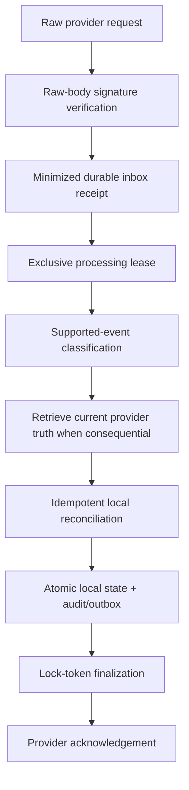

Provider events are notifications, not automatically ordered commands. The system assumes duplicates, retries, concurrent deliveries, delays, and out-of-order arrival.

The transaction helper is **not** the webhook. The provider integration helper is **not** the webhook. They support the HTTP boundary.

---

# 13. Caching

`lib/cache/` owns reusable caching infrastructure, including tags, lifetimes, and invalidation helpers.

Caching is an optimization, not a source of truth.

## 13.1 Safe default

Tenant operational data should be fresh by default unless a specific cache contract proves staleness is acceptable.

Do not make consequential decisions from stale cache, including:

- authorization;
- membership validity;
- payment truth;
- entitlement readiness;
- deadline-sensitive workflow decisions;
- security state.

## 13.2 Version-specific APIs

The architecture defines cache **semantics**. Exact Next.js cache APIs are implementation-version concerns and should be pinned to the repository's supported framework version rather than treated as timeless doctrine.

---

# 14. Functional Decomposition and Minimum Hierarchy

The architecture explicitly rejects hierarchy for hierarchy's sake.

Good:

```text
lib/workflows/crm/
├── advanceDealStage.ts
├── calculatePipelineValue.ts
├── detectStalledDeal.ts
└── calculateSalesVelocity.ts
```

Avoid without a real reason:

```text
lib/workflows/crm/pipeline/services/domain/
```

Likewise, prefer meaningful ownership:

```text
crmActions.ts
crmFetchers.ts
crmTypes.ts
crmSchemas.ts
```

or a similarly shallow scale-appropriate grouping over arbitrary ladders of `services`, `managers`, `processors`, and `helpers`.

A directory is an architecture decision. If its responsibility cannot be explained, it should not exist.

---

# 15. The Architecture Classifier

Use this classifier before creating a new file:

```text
STATIC PUBLIC PRESENTATION ONLY?
    app/(public) page + components/blocks

REACT HOOK FORM?
    feature form + components/ui

APPLICATION ORCHESTRATION?
    features/

PERSISTED DATABASE READ?
    lib/fetchers/

ORDINARY PERSISTED CRUD WRITE?
    lib/actions/

PRISMA SELECT?
    lib/db/selects/

DTO MAPPER?
    lib/db/dto/

ATOMIC DATABASE TRANSACTION?
    lib/db/transactions/

CLERK / AUTHENTICATION?
    lib/auth/

RBAC / ABAC / AUTHORIZATION?
    lib/authz/

PROVIDER-SPECIFIC EXTERNAL BEHAVIOR?
    lib/integrations/{provider}/

WEBHOOK HTTP LIFECYCLE?
    app/api/{provider}/.../route.ts

REUSABLE ORCHESTRATION OF APPLICATION LOGIC?
    lib/workflows/{domain}/

    Does it arrange server operations, helpers, rules,
    sequencing, conditions, or effects into a named behavior?

        YES → workflow
        NO  → use the capability's precise owning responsibility

CACHE CONCERN?
    lib/cache/

CONSTANT?
    lib/constants/

TRUE GENERIC UTILITY?
    lib/utils/

PRISMA SCHEMA / MIGRATION / SEED?
    prisma/

RUNTIME INPUT VALIDATION?
    schemas/

SHARED COMPILE-TIME CONTRACT?
    types/
```

If the answer already exists in this classifier, do not invent another architectural layer.

---

# 16. SOLID Applied to the Codependent Coding Architecture

SOLID remains useful when interpreted through the actual architecture rather than through generic Java/OOP examples.

## 16.1 Single Responsibility Principle — SRP

**A module should have one reason to change because it owns one architectural responsibility.**

Correct architecture-specific examples:

| Responsibility | Correct owner | Wrong mixing |
|---|---|---|
| URL structure | `app/` | Route contains Prisma query and policy logic. |
| Application capability orchestration | `features/` | UI block calls provider SDK and database. |
| Persisted reads | `lib/fetchers/` | Feature executes raw Prisma read. |
| CRUD writes | `lib/actions/` | Block mutates database. |
| Domain rules | `lib/workflows/{domain}/` | Action becomes a catch-all business service. |
| Atomic persistence | `lib/db/transactions/` | Workflow manually coordinates half-committed writes. |
| Authentication | `lib/auth/` | Layout embeds business-role policy. |
| Authorization | `lib/authz/` | Clerk metadata becomes the application policy engine. |
| Provider mechanics | `lib/integrations/{provider}/` | Stripe SDK imports appear throughout routes/features. |
| Presentation | `components/*` | Block decides tenant access. |

SRP in this system is not “keep every file tiny.” A file can be substantial if its content belongs to one coherent responsibility.

## 16.2 Open/Closed Principle — OCP

**Stable architectural contracts should be extendable without turning every extension into a rewrite of unrelated layers.**

Architecture-aligned examples:

- Add a new hero variation in the grouped hero block catalog without changing route or database responsibilities.
- Add a new CRM workflow helper without converting `crmActions` into a domain-service monolith.
- Add a provider under `lib/integrations/{provider}` without importing its SDK across pages and features.
- Add a new Ontology preset by seeding the same Virgule Application Definition model rather than creating a second generator.
- Add a new supported Simple by extending the generator's ownership/dependency catalog and maximal template, not by adding a decorative toggle.

OCP does **not** mean every internal module needs a plugin interface. The architecture prefers concrete code until a real variation point exists.

## 16.3 Liskov Substitution Principle — LSP

**Where the system intentionally defines substitutable contracts, an implementation must honor the full contract rather than merely share a shape.**

Useful examples in this architecture:

- Block variants with the same documented props must preserve the same meaning and required behavior.
- A provider adapter introduced behind an application-owned contract must preserve the contract's success/error semantics, idempotency expectations, and security boundary.
- A UI primitive wrapper that claims native input compatibility must preserve expected input behavior such as `disabled`, focus, value, and change semantics.

LSP is **not** permission to invent base classes, generic repositories, or provider interfaces where no substitution requirement exists.

## 16.4 Interface Segregation Principle — ISP

**Callers should depend on the smallest useful contract for their responsibility.**

Architecture-aligned examples:

- A block receives a narrow presentation DTO, not a giant Prisma record.
- A feature receives only the fields its orchestration needs.
- A fetcher uses a precise select rather than hydrating every relation.
- The Anthimeria Workbench exposes only configuration properties the generator can actually honor.
- A provider helper returns an application-useful result rather than leaking the entire provider SDK response everywhere.

The select → mapper → DTO pipeline is a concrete ISP mechanism in this architecture.

## 16.5 Dependency Inversion Principle — DIP

**High-level application behavior should not depend directly on low-level infrastructure details when the architecture has a meaningful application-owned boundary.**

Correct examples:

- Features do not import Stripe, Prisma, or Cloudinary SDKs.
- Workflows call narrow provider helpers under `integrations/{provider}` when provider behavior is required.
- Route pages call features, not database clients.
- Presentation consumes DTOs and blocks, not persisted records.
- Generator Web UI and CLI both depend on the same application-definition/resolution semantics rather than each implementing configuration rules.

DIP here is **boundary-oriented**, not abstraction-maximalist. Do not create a generic `PaymentProvider` interface merely because SOLID says “inversion” if the product has one concrete provider and no real substitution need. The provider boundary itself already localizes the low-level dependency.

---

# 17. Clean Code Reconciled with the Architecture

The useful parts of Clean Code are retained, but generic rules are subordinate to this architecture.

## 17.1 Meaningful names reveal architectural role

Prefer names that communicate both domain and responsibility:

```text
getContactByIdAndOrganization
createProject
updateInvoice
calculatePipelineValue
resolveTaskDependencies
contactSelect
contactDto
verifyStripeWebhook
```

Avoid vague names:

```text
service
manager
processor
helpers
data
stuff
handler
```

unless the file truly owns that exact responsibility.

Boolean names should expose state semantics when useful (`isOpen`, `hasAccess`, `shouldRevalidate`), and units/formats should be explicit when ambiguity matters (`amountInCents`, `expiresAtUtc`).

## 17.2 Small means coherent, not “20 lines”

There is no canonical 20-line rule.

Split a function or component when it contains multiple responsibilities, becomes difficult to reason about, or hides a meaningful reusable boundary.

Do not split coherent code into a swarm of tiny files merely to hit a line-count aesthetic.

## 17.3 Side effects must match the name and layer

A fetcher is read-only.

A transaction helper performs database effects and nothing external.

A block presents UI.

An action may write.

A provider helper may call its provider.

A function should not surprise its caller by crossing into responsibilities its name and layer do not own.

## 17.4 Comments explain why, constraints, and non-obvious contracts

Do not use comments to narrate obvious syntax.

Do use comments when they preserve consequential context, for example:

- why an RLS transaction context must be set a particular way;
- why a provider event must reconcile current provider truth;
- why a query deliberately includes a tenant predicate;
- why a Next.js workaround exists for a pinned version;
- why a transform preserves a file during generation;
- why a seemingly redundant validation guard is security-significant.

“Self-documenting code” is not a reason to erase architectural rationale.

## 17.5 One level of abstraction means respecting layer ownership

A page should read like a route-level outline:

```tsx
export default async function ProjectPage({ params }: PageProps) {
  return (
    <Suspense fallback={<ProjectDetailSkeleton />}>
      <ProjectDetailFeature projectId={params.projectId} />
    </Suspense>
  );
}
```

The feature owns capability orchestration. The fetcher owns the read. The workflow owns domain rules. The transaction owns atomic writes. The page should not mix those details.

## 17.6 Error handling belongs at the boundary that understands the failure

Use:

- route `error.tsx` / error boundaries for render failures;
- stable action results for expected validation/domain mutation failures;
- provider adapters to translate provider-specific errors;
- transaction rollback for persistence failure;
- logs/telemetry at operational boundaries where the system can act on the evidence.

Do not adopt “let everything crash” as a universal strategy. Expected failures should become explicit, stable application outcomes; unexpected failures should surface safely and observably.

## 17.7 Avoid premature abstraction

The architecture already names its responsibilities. Do not wrap a fetcher in a repository in a service in a manager unless a concrete requirement proves that additional boundary earns its cost.

Clean code in this system is **obvious ownership, narrow contracts, truthful names, minimal hierarchy, explicit trust boundaries, and predictable side effects.**

---

# 18. The Maximal Template™ Domain Library

## 18.1 Definition

The Maximal Template is one **runnable, standalone, white-label superset application** containing all supported implementation material that the generator can legally retain, remove, or transform.

It is not nine templates.

It is not generator source code.

It is not a package marketplace.

It is the application-source inventory from which Arrangements are generated.

## 18.2 Hard boundary

The template may contain application-owned:

- routes;
- features;
- blocks/primitives/nav/shells;
- fetchers/actions/workflows;
- auth/authz;
- database client/selects/DTOs/transactions;
- schemas/types;
- integrations;
- webhooks;
- cache/constants/utils;
- Prisma schema/migrations/seed;
- application tests;
- application CI/deployment setup;
- application-local agent/context assets when those govern the generated app itself.

The template must not contain generator-only:

- retain/remove ownership catalogs;
- Anthimeria session/UI state;
- CLI implementation;
- dependency-resolution and materialization internals;
- generator-specific transform metadata that has no application runtime/development purpose.

## 18.3 Maximal means supported

A capability belongs in the maximal template only when a working supported implementation exists.

Naming a future capability in doctrine does not make it selectable.

---

# 19. Simples™: The Domain-Library Building Blocks

A Simple is a supported building block exposed from the maximal application through a normalized catalog.

## 19.1 Simple categories

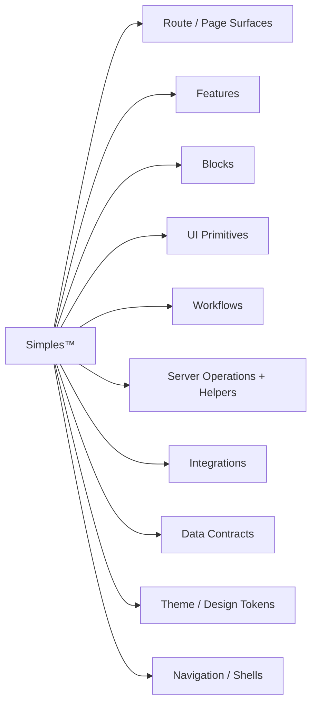

## 19.2 Route/page Simples

### Public and product

- Landing page
- Pricing page
- Features / product-tour page
- Contact / demo-request page
- FAQ page
- Terms / privacy surfaces where required

### Authentication and onboarding

- Sign in
- Sign up
- Workspace setup / onboarding
- Team invitation surfaces

### Core application

- Main dashboard / overview
- Data list / table
- Detail / single-record view
- Kanban board
- Calendar / timeline
- Analytics / reports dashboard

### Settings and management

- User profile settings
- Team / members
- Billing / subscriptions
- API / integrations settings

### Utility and error

- 404
- 500 / fatal server error
- access denied / unauthorized
- maintenance / empty state where supported

### Domain application surfaces

- CRM pipeline, contact directory, account profile, revenue analytics
- Project overview, backlog, timeline/Gantt, my tasks
- Support inbox, ticket workspace, knowledge base, SLA analytics
- Marketing campaign studio, audience manager, attribution analytics
- Invoice creator, invoice directory, expense upload/OCR
- Social calendar, composer, media library
- AI generation workspace, prompt playground, usage dashboard
- B2B shared dashboard, document vault, billing hub
- Admin record inspector, bulk user operations, audit logs

## 19.3 Presentation block Simples

### Public/product blocks

- Hero
- Feature grid
- Testimonials
- Logo cloud
- CTA
- Stats
- Team
- FAQ
- Footer
- Contact
- Pricing
- Comparison table
- Changelog / bento compositions where supported

### Application blocks

- Dashboard composition
- Data table
- Record detail
- Kanban board
- Calendar
- Timeline
- Analytics dashboard
- Split pane
- Settings composition
- Onboarding composition
- Invoice
- File vault
- Media library
- Chat workspace
- Audit log
- Error/empty states

## 19.4 UI primitive Simples

The supported primitive catalog may include the following families where the maximal template actually contains the implementation.

### Forms and input

- Button / button group
- Input / input group
- Textarea
- Checkbox
- Radio group
- Select / native select / combobox
- Switch
- Slider
- Label / field
- Input OTP
- Dropzone
- Date picker / date-range picker / time picker
- Tag input
- Rating
- Multi-step form support
- Stepper

### Layout and containers

- Card
- Layered card
- Stat card
- Dialog
- Drawer
- Sheet
- Accordion
- Collapsible
- Tabs
- Scroll area
- Aspect ratio
- Separator
- Resizable
- Container

### Feedback and status

- Alert
- Alert dialog
- Badge
- Progress
- Skeleton
- Spinner
- Toast / Sonner
- Empty state
- Loading states
- Math curve loader
- Math curve progress
- Math curve background

### Navigation

- Breadcrumb
- Dropdown / context / menubar
- Navigation menu
- Command palette
- Pagination
- Popover
- Tooltip
- Hover card
- Tour

### Data display

- Avatar
- Table / data table
- Calendar
- Kbd
- Timeline
- Tree view
- Annotation/legend helpers

### Charts

- Area
- Bar
- Line
- Pie
- Donut
- Radar
- Radial bar
- Gauge
- Sparkline
- Funnel
- Heatmap
- Sankey
- Treemap

### Decorative / technical visual primitives

- Sticker
- Marquee
- SVG shape catalog
- ASCII shape catalog
- Shape builder / export tooling where supported
- Motion helpers consistent with the design system

## 19.5 Logic and server-operation Simples

The domain library also normalizes application logic capabilities:

- fetchers;
- actions;
- workflows;
- transaction helpers;
- Prisma selects;
- DTO mappers;
- schemas;
- types;
- auth;
- authz;
- cache;
- integration helpers;
- webhook handlers;
- constants;
- utilities;
- Prisma schema/domain models;
- environment/config requirements.

These are not displayed as arbitrary source-file toggles. The configuration system presents application concepts and derives the owned artifacts required to realize them.

---

# 20. Business-Domain Library

The nine default Ontologies are not the full conceptual business-logic library.

The wider workflow/domain vocabulary may include:

| Domain | Representative logic |
|---|---|
| CRM | pipeline stages, contact/account relationships, stalled-deal detection, sales velocity |
| Project management | task hierarchy, dependency resolution, milestone progress, schedule rules |
| Customer support | SLA calculation, escalation, assignment, ticket lifecycle |
| Marketing automation | audience rules, drip timing, attribution, campaign metrics |
| Invoicing/accounting | totals, taxes, currencies, invoice status, expense rules |
| Social publishing | schedule resolution, platform variants, publishing lifecycle |
| AI products | usage/credit calculation, model selection, rate limiting |
| Client portals | approval state, project status, document lifecycle |
| Admin/operations | audit classification, bulk-operation rules, privileged controls |
| HRIS / ATS | employee lifecycle, time-off accrual, hiring pipeline |
| ERP / supply chain | inventory rules, fulfillment, asset depreciation |
| E-commerce | pricing/discount rules, variants, returns lifecycle |
| FinTech/accounting | double-entry ledger, reconciliation, spending limits |
| BI / analytics | aggregation pipelines, metric formulas, report visibility |
| Cybersecurity / identity governance | access policy, audit trails, threat/risk logic |
| CMS | publishing workflow, version history, asset mapping |

A domain appearing here does not automatically make it a default Ontology or supported selectable implementation. Generator support remains the truth test.

---

# 21. Ontologies™: The Nine Default Starter Specifications

An Ontology is a preset over the same normalized Virgule Application Definition.

## 21.1 Ontology catalog

| Ontology | Primary surfaces | Representative workflows | Common integrations |
|---|---|---|---|
| CRM / Pipeline Tracker | pipeline, contacts, accounts, analytics | deal stage, stalled deal, pipeline value, velocity | email, optional Stripe |
| Project Management / Task Tracker | projects, backlog, task detail, timeline, my tasks | dependencies, health, milestone progress | Blob, Cloudinary, email |
| Customer Support / Ticketing | inbox, ticket workspace, knowledge base, SLA analytics | SLA, escalation, priority, assignment | email, Blob, Cloudinary |
| Marketing Automation & Analytics | campaigns, audiences, analytics | audience rules, sequences, attribution | email, Cloudinary, analytics providers |
| Invoicing & Expense Tracker | invoices, invoice editor, expenses, billing | totals, taxes, invoice status, expense rules | Stripe, Blob, optional OCR |
| Social Media Scheduler | calendar, composer, media | publish time, variants, publishing lifecycle | Cloudinary, Blob, social providers |
| AI-Powered Wrapper / Micro-SaaS | generation, playground, usage | usage, credits, rate limits, model selection | Hugging Face, optional model providers, Stripe |
| B2B Client Portal | shared dashboard, documents, billing | approvals, project state, document lifecycle | Blob, Cloudinary, Stripe, email |
| Internal Tools / Admin Portal | records, users, audit | audit classification, bulk operations | provider admin surfaces as required |

## 21.2 Shared foundation

Ontologies draw from a common foundation:

```text
shared foundation
├── public/product surfaces
├── authentication
├── onboarding
├── settings
├── navigation
├── shells
├── organization/membership
├── authorization
├── database foundation
├── validation
└── common error/loading infrastructure
```

The configuration model is therefore:

```text
shared foundation
+ ontology preset
+ user overrides
+ selected optional capabilities
+ selected presentation variants
+ required dependencies
= normalized and validated Virgule
```

## 21.3 CRM example

A CRM Ontology may resolve:

```text
CRM
├── routes
│   ├── /dashboard
│   ├── /crm/pipeline
│   ├── /crm/contacts
│   ├── /crm/contacts/[contactId]
│   ├── /crm/accounts/[accountId]
│   └── /crm/analytics
├── features
│   ├── pipeline
│   ├── contacts
│   ├── contact detail/editor
│   ├── account detail
│   └── analytics
├── blocks
│   ├── dashboard
│   ├── data table
│   ├── record detail
│   ├── kanban board
│   └── analytics dashboard
├── workflows
│   ├── advance deal stage
│   ├── detect stalled deal
│   ├── pipeline value
│   └── sales velocity
├── auth/authz
├── fetchers/actions/db helpers
├── cache
└── optional providers
```

All other Ontologies follow the same architectural grammar.

---

# 22. The Anthimeria™ Workbench

## 22.1 Role

The Anthimeria Workbench is the stateless web application used to configure an Ontology or build a custom Virgule Application Definition from supported Simples.

It is an adapter over the same configuration semantics used by the CLI and portable config file.

It does not own a second rules engine.

## 22.2 Configuration model

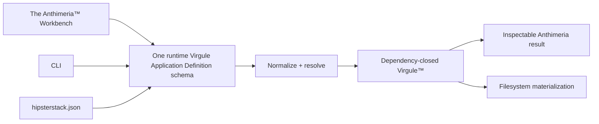

## 22.3 Canonical configuration entities

The normalized configuration domain includes:

- Virgule Application Definition / Recipe
- Preset / Ontology
- Property
- Provider
- Capability
- Dependency
- Constraint
- Resource
- Authorization Model
- Role
- Route Surface
- Artifact Set
- Artifact
- Virgule lifecycle state: draft, normalized, validated, dependency-closed

## 22.4 Property mechanisms

Supported property mechanisms include:

```text
text
toggle
select
multi-select
relation
rollup
derived
structured
reorderable
```

Property metadata may define:

- allowed values;
- visibility;
- enablement;
- requirements;
- conflicts;
- derivation;
- generation effects;
- validation.

Resolved values carry provenance such as:

```text
DEFAULT
PRESET
USER
DERIVED
REQUIRED
LOCKED
```

## 22.5 User-facing configuration hierarchy

The workbench should conceptually expose configuration in this order:

```text
Ontology
  ↓
routes / page surfaces
  ↓
features per route
  ↓
feature presentation
  ├── blocks
  │    ↓
  │  UI primitives / variants
  │    ↓
  │  semantic design tokens
  │
  └── feature logic
       ↓
     workflows
       ↓
     server operations + helpers
```

This hierarchy represents the user's mental model. The generator remains free to derive the exact artifact graph required to implement it.

## 22.6 Dependency graph

The user must not be allowed to create a knowingly broken configuration.

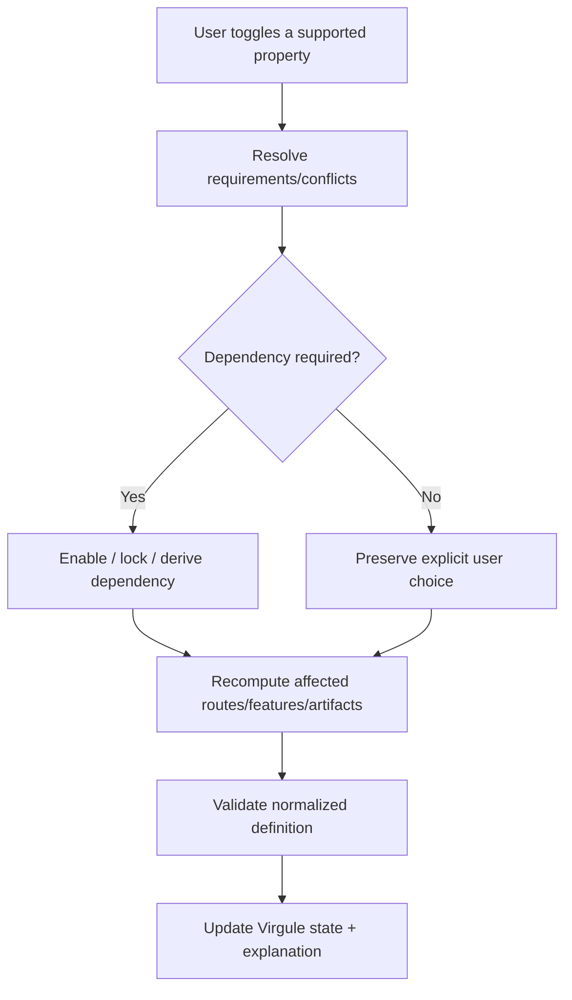

The UI may:

- disable impossible controls;
- auto-enable required dependencies;
- mark derived/locked choices;
- explain why a choice is unavailable;
- show downstream effects;
- warn before destructive changes.

## 22.7 Workbench presentation

The Anthimeria Workbench uses a dense two-panel developer-workbench model:

- **left:** schema-backed controls and dependency-aware configuration;
- **right:** resolved configuration, generation consequences, required artifacts/providers, and portable output.

Useful actions include:

- inspect;
- copy;
- download;
- share portable configuration where supported;
- pass the same normalized configuration to CLI execution.

No hidden web-only defaults are permitted.

---

# 23. The Hipster Stack™ Technology Stack and Generator

## 23.1 Role

The Hipster Stack is the concrete technology and deterministic project constitution/generation system implementing this architecture.

It consumes a dependency-closed Virgule against The Maximal Template to produce an Arrangement.

## 23.2 Fixed technical foundation

The fixed foundation includes the repository-supported form of:

- TypeScript;
- Next.js App Router;
- React Server Components by default;
- pnpm;
- Zod;
- Prisma ORM;
- Neon / PostgreSQL;
- Clerk authentication;
- application-owned users, organizations, memberships, roles/capabilities, and authorization;
- PostgreSQL RLS for tenant containment where the application model requires it;
- fetchers;
- actions;
- workflows;
- transaction helpers;
- Prisma selects;
- DTO mappers;
- integration adapters/helpers;
- webhook HTTP boundaries and reconciliation;
- shadcn-compatible / BoldKit-adapted presentation primitives;
- Tailwind CSS semantic design tokens;
- Vercel-oriented deployment assumptions;
- architecture and validation contracts owned by the generated application where appropriate.

The generator does not ask users to choose fundamental architecture the system has already decided.

## 23.3 Generation lifecycle

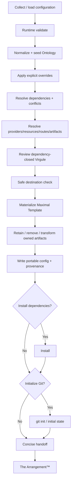

## 23.4 One-template rule

Ordinary generation uses one repository-owned maximal template.

It does not fetch a template from GitHub during normal generation and does not require provider credentials or a hosted Hipster Stack service to materialize a local project.

## 23.5 CLI

The target public CLI vocabulary is:

```text
hipster-stack create [directory]
hipster-stack add <supported-surface>
hipster-stack explain
hipster-stack doctor
hipsterstack.json
```

Where the live repository has not completed the identifier migration, current implementation names are evidence of transition rather than competing doctrine.

The CLI owns:

- command parsing;
- interactive prompts;
- review;
- progress;
- terminal output;
- safe destination handling.

It delegates configuration meaning and generation mechanics to shared schema/resolution code.

## 23.6 CLI and Anthimeria parity

```text
CLI ─────────────┐
Anthimeria ──────┼──> one Virgule schema / resolver / dependency-closure model
config file ─────┘
```

No adapter gets a hidden dependency graph, separate defaulting logic, or divergent semantics.

---

# 24. The Arrangement™ Generated-Artifact Contract

The Arrangement is the finished generated application.

It should be:

- standalone;
- white-label;
- runnable;
- understandable without generator internals;
- architecture-conformant;
- dependency-complete;
- configured only with supported capabilities;
- free of unused maximal-template surfaces intentionally removed by generation;
- equipped with required local configuration/examples without secrets;
- capable of normal source-control ownership after generation.

A generated app may retain `hipsterstack.json` or equivalent provenance/config handoff when useful, but it does not require a generator runtime to operate.

## 24.1 Generated artifact boundary

```text
generator metadata          generated application
------------------          ---------------------
ownership catalog     ─X→   no
pruning rules         ─X→   no
Anthimeria UI state   ─X→   no
CLI implementation    ─X→   no

app code               →    yes
application tests      →    yes
application docs       →    yes, when useful
app-local AGENTS/rules →    yes, when they govern the app
env examples           →    yes
CI/deployment config   →    yes, when supported
portable provenance    →    yes, when intentionally part of handoff
```

---

# 25. Loaded Vibes™ Coding Agent Plugin for Codex

## 25.1 Role

Loaded Vibes is the architecture-aware Codex plugin purpose-built to work with Arrangements and other repositories that explicitly adopt the Codependent Coding WebApp Architecture.

Its purpose is not to invent architecture. Its purpose is to make the architecture **operational for coding agents**.

## 25.2 Plugin responsibility

The plugin should help an agent:

1. inspect the actual repository and local instructions;
2. identify the relevant architectural context before changes;
3. classify requested work into the correct layers;
4. preserve route/feature/presentation and server-operation boundaries;
5. respect auth/authz/tenancy/provider/security invariants;
6. plan bounded work;
7. implement without architecture drift;
8. validate architecture boundaries;
9. run proportional smoke/quality checks;
10. produce evidence-backed handoff.

## 25.3 Canonical content families

The plugin includes the following content families defined by the current direction.

### Governance

Markdown governance slices that operationalize:

- architecture classifier;
- layer contracts;
- security boundaries;
- feature/route orchestration;
- protected-read rules;
- mutation rules;
- workflow and transaction boundaries;
- webhook behavior;
- provider isolation;
- configuration and secrets rules;
- validation and completion evidence.

### Custom agents

Agent roles should be responsibility-oriented rather than personality-oriented. The plugin requires roles capable of:

- context/architecture inspection;
- bounded planning;
- implementation/execution;
- architecture/security review;
- verification/conformance;
- Git/GitHub delivery where authorized.

Exact role names are implementation detail; the responsibilities above are normative.

### Skills

Skills should encode narrow repeatable operations such as:

- map task context and affected files;
- classify a new file or change;
- implement a fetcher/action/workflow/transaction/webhook correctly;
- validate architecture imports/boundaries;
- inspect authorization/tenant scope;
- review provider integration placement;
- create/update GitHub work items when requested;
- produce implementation handoff/evidence.

Skills do not become a second knowledge system. They are executable derivatives of the architecture.

### Instructions and prompts

The plugin may include reusable instructions/prompts for:

- context collection;
- implementation planning;
- scoped execution;
- code review;
- architecture review;
- security review;
- test/validation selection;
- PR/commit preparation;
- handoff.

### Architecture-validation scripts

Mechanical validators should enforce stable rules that can be checked reliably, for example:

- illegal Prisma imports outside allowed DB/server paths;
- feature → `components/ui` imports except declared form-feature exceptions;
- block imports of server/database/provider responsibilities;
- persisted DB reads outside fetchers/transactions where prohibited;
- provider SDK imports outside provider-owned/auth/db boundaries;
- client modules importing server-only operations incorrectly;
- malformed expected project structure;
- missing required architecture files in an Arrangement.

Validators must report actual evidence. They must not claim semantic guarantees they cannot mechanically establish.

### Smoke tests

Smoke tests should prove that the generated project has the minimum usable shape, for example:

- package graph installs;
- expected configuration parses;
- architecture validator runs;
- typecheck/build or focused equivalent succeeds when included in project contract;
- required root/application files exist;
- representative route loads or build output materializes;
- no generator-only debris was accidentally copied.

### Bundled developer-environment assets

The plugin direction explicitly includes:

- ESLint configuration;
- Prettier configuration;
- `.gitattributes`;
- `.gitignore`;
- `.editorconfig`;
- global `AGENTS.md` with universal workflow;
- Codex `config.toml` with required MCP/plugin configuration;
- GitHub commit instructions;
- GitHub pull-request instructions.

These assets must remain templates/configuration, not hard-coded secret stores.

## 25.4 Plugin workflow

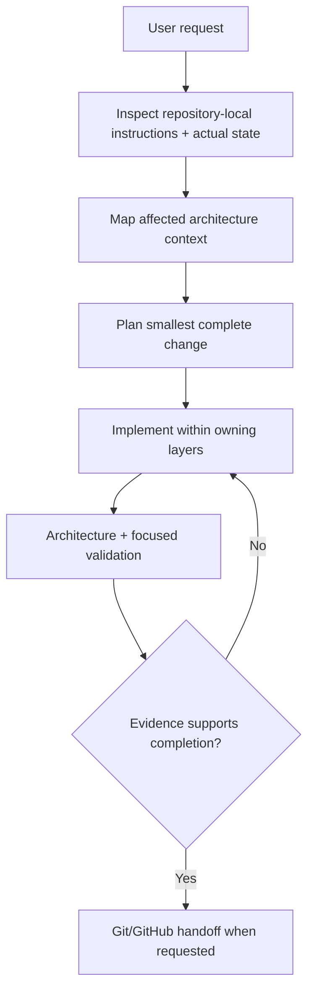

## 25.5 Plugin anti-goals

Loaded Vibes should not:

- redesign a healthy architecture on every task;
- turn every change into enterprise ceremony;
- create generic service layers;
- add tests/CI/observability only because a checklist mentions them;
- claim checks ran when they did not;
- collect or print secrets;
- silently override repository-local instructions;
- treat current implementation as permission to violate controlling architecture;
- become a generic stack-agnostic prompt bundle.

## 25.6 Relationship to comparative plugin patterns

Context mapping, project planning, issue management, system-architecture review, security review, and GitOps-style delivery are useful capability categories demonstrated by mature agent/plugin ecosystems. Loaded Vibes should adopt those ideas only where they serve this architecture and should not reproduce unrelated generic plugin breadth.

---

# 26. Visual and Documentation System

The architecture documentation and public product surfaces share a deliberate visual language.

## 26.1 Visual character

The target is:

- dark-mode only;
- black / near-black canvases;
- white / off-white primary text;
- restrained cyan-teal signal color;
- dense technical composition;
- strong borders;
- square or minimally rounded geometry;
- mechanical rather than bouncy motion;
- controlled glow;
- bold condensed/industrial display type;
- mono technical body/code treatment;
- desert/circuit visual motifs.

Avoid:

- pastel rainbow palettes;
- candy-color UI;
- excessive rounded cards;
- toy-like iconography;
- generic startup-gradient aesthetics;
- decorative motion that competes with information.

## 26.2 Brand color

The current product web contract uses approximately:

```text
canvas: #05030b / black
text:   white / off-white
signal: #2f7a8d
```

The signal color is for underlines, status accents, restrained glow, circuit detail, and hierarchy—not for flooding the interface.

## 26.3 Typography roles

The current direction uses:

- bold Copperplate-like display treatment for key headings/wordmarks where available;
- JetBrains Mono-style technical body/UI text;
- Fira Code-style code text;
- Big Shoulders-style treatment for the Digital Herencia wordmark where available.

Build-safe fallbacks are required. Typography should be treated as a role contract, not as a reason to ship fragile font dependencies.

## 26.4 Supplied visual assets

The current visual reference set includes:

- `Digital Herencia Banner(3).png`
- `Digital Herencia Desert BG(2).png`
- `Digital Herencia White Logo(3).png`
- `Hipster Stack Crown.webp`
- `Hipster Stack Logo White.webp`
- `Loaded Vibes Logo Black(3).png`

Recommended use:

| Asset | Role |
|---|---|
| Digital Herencia Banner | Full-width branded lower-page / ecosystem banner treatment |
| Digital Herencia Desert BG | Bottom-anchored background art for Simples / Anthimeria / docs section breaks |
| Digital Herencia White Logo | Parent-brand/footer/credits mark on dark surfaces |
| Hipster Stack Crown | Hero/identity art for technology/generator surface |
| Hipster Stack Logo White | Dark-surface wordmark |
| Loaded Vibes Logo Black | Light-surface or inverted/derived usage only; do not place black-on-dark without a dark-safe treatment |

The artwork establishes atmosphere; it does not control technical semantics.

---

# 27. Theme and Semantic Design Tokens

The visual system is configured through semantic tokens rather than arbitrary per-component colors.

The Anthimeria Workbench may expose normalized theme controls that deterministically transform the supported `globals.css`/Tailwind theme layer.

Supported dimensions may include:

- palette;
- background/foreground;
- primary/secondary/accent;
- destructive/success/warning/info;
- border/input/ring;
- chart colors;
- signal/neon accents;
- radius;
- border width;
- hard-shadow offset;
- spacing/padding/margins within bounded supported scales;
- motion/animation values;
- heading/body/code font roles.

The Maximal Template source includes the canonical token bridge required by the supported Tailwind/shadcn configuration. Generated output should not invent a second styling system.

A dark-only Arrangement should remove or lock light-mode choices rather than retaining a fake option.

---

# 28. Reference Application Structure

The exact tree scales with the generated configuration, but the architectural shape remains:

```text
arrangement/
│
├── app/
│   ├── (public)/
│   ├── (auth)/
│   ├── onboarding/
│   ├── dashboard/
│   ├── {selected-domain-routes}/
│   ├── settings/
│   └── api/
│       └── {provider}/.../route.ts
│
├── features/
│   ├── {domain}/
│   └── ...
│
├── components/
│   ├── blocks/
│   ├── nav/
│   ├── shells/
│   └── ui/
│
├── lib/
│   ├── actions/
│   ├── fetchers/
│   ├── db/
│   │   ├── client.ts
│   │   ├── selects/
│   │   ├── dto/
│   │   └── transactions/
│   ├── auth/
│   ├── authz/
│   ├── integrations/
│   ├── workflows/
│   ├── cache/
│   ├── constants/
│   └── utils/
│
├── prisma/
│   ├── schema.prisma
│   ├── migrations/
│   └── seed.ts
│
├── schemas/
├── types/
├── generated/
├── components.json
├── eslint.config.mjs
├── next.config.ts
├── package.json
├── postcss.config.mjs
├── prisma.config.ts
├── proxy.ts
├── tsconfig.json
└── .env.example
```

Only selected supported domain material survives generation.

---

# 29. Golden Vertical Slice

When establishing or validating a domain, use one complete resource flow as the reference.

A golden vertical slice should demonstrate, as applicable:

```text
list route
search/filter client behavior
detail route
new form
edit form
fetchers
CRUD actions
schemas
types
selects
DTO mapping
authentication
authorization
tenant scope
RLS
Suspense
custom skeleton
transaction behavior
cache invalidation
provider boundary if applicable
tests / validation evidence
```

Once one resource is correct, adjacent resources should follow the same grammar rather than inventing new architecture.

---

# 30. Anti-Patterns

The following are architecture drift unless explicitly justified.

## Routes and features

- public pages grouped under `(marketing)` merely because they are public;
- static public pages wrapped in meaningless features;
- page components containing database queries;
- pages owning domain policy;
- routes acting as business-service layers;
- arbitrary client components replacing Server Component defaults.

## Presentation

- blocks containing Prisma/database logic;
- blocks performing authorization;
- blocks calling providers;
- blocks owning React Hook Form state;
- normal features importing arbitrary UI primitives instead of blocks;
- one-off giant presentation components that duplicate catalog blocks;
- childlike/cartoonish neo-brutal styling.

## Server/application

- database reads outside fetchers;
- actions used as generic business services;
- provider calls scattered through actions/features/routes;
- network calls inside DB transaction helpers;
- workflow folders used as junk drawers;
- generic `services/` architecture layered on top of already named responsibilities;
- unnecessary directory nesting.

## Auth/security

- treating Clerk Organization metadata as product tenancy by default;
- authorizing after a broad cross-tenant fetch;
- using RLS as a replacement for application policy;
- stale cache driving access/payment/readiness decisions;
- accepting webhook payloads without authenticating the raw request;
- assuming webhook event order or uniqueness.

## Generator/configuration

- multiple competing configuration semantics for CLI and web;
- decorative toggles with no generation effect;
- selectable capabilities not backed by working maximal-template implementation;
- generator ownership metadata copied into generated runtime code;
- normal generation depending on live GitHub or provider credentials;
- multiple equal template sources.

## Agent/plugin

- claiming validation passed when it did not run;
- replacing repository-local instructions with plugin defaults;
- architecture-wide redesign for a bounded change;
- adding process artifacts because a generic best-practice list mentions them;
- treating generated code, docs, and actual runtime state as interchangeable evidence.

---

# 31. Validation and Conformance

Validation should prove the behavior that matters and stay proportional to the requested outcome.

## 31.1 Architecture checks

Mechanical checks may verify:

- import direction;
- server/client boundaries;
- provider SDK placement;
- Prisma placement;
- illegal feature → primitive imports;
- block purity;
- required root structure;
- schema/config parsing;
- forbidden generator metadata in output.

## 31.2 Static/runtime checks

Depending on the generated application contract:

- formatting;
- lint;
- typecheck;
- architecture validation;
- Zod/config validation;
- Prisma validation;
- migrations;
- unit/integration tests;
- PostgreSQL integration tests;
- RLS cross-tenant tests;
- webhook replay/idempotency tests;
- browser tests;
- accessibility tests;
- secret scanning;
- production build.

The architecture does not require running every possible check for every tiny change. The evidence set is chosen based on changed behavior and blast radius.

## 31.3 Generation checks

A generator conformance check should establish that:

- the same Virgule Application Definition resolves identically regardless of adapter;
- dependency/conflict resolution is deterministic;
- invalid combinations are rejected or normalized;
- selected Simples retain their dependencies;
- unselected optional surfaces are removed cleanly;
- transforms preserve runnable syntax;
- portable configuration/provenance is truthful;
- generated project installs/builds under the supported environment when that is part of release acceptance.

## 31.4 Evidence rule

Never translate “expected,” “configured,” or “should pass” into “passed.”

A completion claim requires executed evidence or a clearly labeled inspection-only conclusion.

---

# 32. Delivery, Operations, and Repository Hygiene

## 32.1 Configuration and secrets

- Validate required environment variables.
- Keep provider secrets server-only.
- Never expose secret values through generated client code.
- `.env.example` documents names/shape, not credentials.
- The Hipster Stack/Anthimeria does not collect production provider secrets merely to scaffold a project.

## 32.2 Migrations

Prisma owns schema/migration/seed lifecycle.

Schema changes require:

- deliberate migration ownership;
- review of tenant/RLS consequences;
- rollout compatibility appropriate to the change;
- production verification appropriate to blast radius.

## 32.3 Observability

Observability should be added where it answers an operational question, not as decorative infrastructure.

Important events may include:

- authorization failures;
- provider reconciliation failures;
- webhook retry/dead-letter conditions;
- high-risk admin operations;
- failed background/scheduled work;
- deployment or migration failures.

## 32.4 Delivery

Repository changes should follow the smallest complete unit of work appropriate to the repository:

```text
inspect actual state
→ identify owning responsibility
→ make focused change
→ run proportional verification
→ review diff
→ commit / PR / merge when requested
→ verify final state
```

---

# 33. Source-of-Truth Allocation

A robust architecture distinguishes facts by authority.

| Fact class | Authority |
|---|---|
| Verified identity / session | Clerk |
| Application user state | Application PostgreSQL |
| Organizations / memberships / business roles / capabilities | Application PostgreSQL |
| Domain lifecycle state | Application domain state |
| Payment/refund/subscription provider truth | Stripe |
| Application entitlement interpretation | Application domain |
| File/media provider truth | Relevant storage/media provider, interpreted by application |
| Architectural requirements | This canonical architecture + repository-local adopted contracts |
| Configuration intent | Virgule Application Definition |
| Resolved generation authority | Dependency-closed Virgule Application Definition |
| Repository change history | Git / GitHub |
| Deployment result | Deployment platform plus post-deployment verification |
| Actual implementation | Current repository state |
| Completion evidence | Executed checks and observed final state |

No single provider, code generator, agent, or document should pretend to own facts outside its responsibility.

---

# 34. Governance and Change Control

This source is deliberately comprehensive, but it should not become bureaucratic.

## 34.1 Change rule

Change architecture only when the responsibility model or governing behavior actually changes.

A normal feature implementation does not require rewriting architecture doctrine.

## 34.2 Conflict rule

When repository code disagrees with this source:

1. determine whether the repository is stale or this doctrine is wrong;
2. do not invent a silent compromise;
3. update the side that is actually wrong;
4. preserve migration/provenance evidence when the change is consequential.

## 34.3 Repository-local adoption

A generated or existing repository may adopt this architecture through local instructions/contracts.

Once adopted, repository-local state controls implementation details such as:

- supported framework/provider versions;
- selected Ontology/Simples;
- actual route inventory;
- actual provider set;
- accepted exceptions.

The umbrella architecture controls responsibilities; the repository controls its actual supported configuration.

---

# 35. Implementation Status and Transitional Facts

This section prevents normative architecture from being confused with observed current repository state.

## 35.1 Hipster Stack repository

As observed on 2026-08-15, the current public generator repository is `DigitalHerencia/TheHipsterStack`, and the former `DigitalHerencia/LoadedVibes` repository URL redirects to it.

Current source-of-truth repository documents already describe:

- one shared application-definition schema;
- deterministic resolver / then-named Generation Plan implementation;
- one `template/`;
- `apps/web`;
- `packages/cli`;
- `packages/core`;
- `packages/schema`;
- `/libraries/*` Simples;
- `/docs/*`;
- `/configure` then-named Constituter implementation;
- target `hipster-stack` CLI naming.

Some older prose inside the live repository still reflects earlier product-role assignments. The newest direction in this source controls product identity.

## 35.2 CLI rename

The `hipster-stack` command family and `hipsterstack.json` are target public vocabulary in current repository governance. A live runtime may still contain earlier identifiers until its scoped migration is complete.

Do not claim the rename has shipped without observing it.

## 35.3 Loaded Vibes plugin

The Loaded Vibes Codex plugin is defined here as a normative product component based on the newest explicit direction.

This synthesis did **not** find a definitive live standalone implementation that proves every listed plugin content family already ships under the Loaded Vibes name. Therefore:

- the plugin contract is authoritative;
- implementation status must be verified in its eventual repository/package before claiming release completeness.

## 35.4 Existing CodependentCoding repository

The current `DigitalHerencia/CodependentCoding` repository still contains prior Knowledge System material and older identity text.

That content remains valuable architecture/security/provenance evidence but must not override this newer product topology.

---

# 36. Professional Documentation Information Architecture

The eventual public documentation site should separate learning and reference concerns rather than flatten everything into one long page.

Recommended top-level information architecture:

```text
Docs
├── Introduction
├── Architecture
│   ├── System Map
│   ├── Layer Contracts
│   ├── Route / Feature Orchestration
│   ├── Data & Trust Boundaries
│   ├── Auth / Authz / Tenancy / RLS
│   ├── Integrations
│   ├── Webhooks
│   ├── Caching
│   └── Error / Loading / Operations
│
├── Hipster Stack
│   ├── Technology Stack
│   ├── Installation
│   ├── CLI
│   ├── hipsterstack.json
│   ├── Generation Lifecycle
│   └── The Anthimeria Workbench
│
├── Maximal Template
│   ├── Domain Library
│   ├── Simples
│   ├── Ontologies
│   ├── Directory Structure
│   └── The Arrangement
│
├── Patterns
│   ├── Fetchers
│   ├── Actions
│   ├── Workflows
│   ├── Transactions
│   ├── Selects / DTOs
│   ├── Forms
│   ├── UI Composition
│   └── Provider Webhooks
│
├── Security
│   ├── Trust Model
│   ├── Tenancy
│   ├── RBAC / ABAC
│   ├── RLS
│   └── Provider Security
│
├── Loaded Vibes
│   ├── Plugin Overview
│   ├── Agents
│   ├── Skills
│   ├── Instructions / Prompts
│   ├── Validators
│   └── Environment Assets
│
└── Reference
    ├── Architecture Classifier
    ├── Glossary
    ├── Configuration Properties
    ├── Ontology Matrix
    ├── Simple Catalog
    └── Conformance Rules
```

This single note is the master synthesis. The public docs may later split it into navigable sections without creating competing definitions.

---

# 37. Glossary

| Term                                        | Canonical meaning                                                                                                   |
| ------------------------------------------- | ------------------------------------------------------------------------------------------------------------------- |
| **Codependent Coding™ WebApp Architecture** | Umbrella architecture and documentation system.                                                                     |
| **Hipster Stack™ Technology Stack**         | Concrete technology foundation plus constitution/generation engine, CLI, shared schema/resolver, and web workbench. |
| **Maximal Template™ Domain Library**        | One runnable superset application containing all supported generated material.                                      |
| **Simple™**                                 | A normalized supported building block from the maximal domain library.                                              |
| **Ontology™**                               | One of nine default normalized starter application definitions/presets.                                             |
| **The Anthimeria™ Workbench**               | Stateless web configuration workbench over the shared Virgule model and resolver.                                   |
| **The Virgule™ Application Definition**     | Portable recipe and statement of user intent through draft, normalized, validated, and dependency-closed states.   |
| **The Arrangement™ Generated Artifact**     | Generated standalone white-label application produced from a dependency-closed Virgule and The Maximal Template.   |
| **Loaded Vibes™**                           | Codex coding-agent plugin that operationalizes and enforces the architecture.                                       |
| **Route**                                   | URL/HTTP boundary.                                                                                                  |
| **Feature**                                 | Application capability orchestration boundary.                                                                      |
| **Client Feature**                          | Deliberate browser-only orchestration companion.                                                                    |
| **Block**                                   | Pure reusable UI composition.                                                                                       |
| **Primitive**                               | Lowest-level UI component.                                                                                          |
| **Fetcher**                                 | Read-only persisted application data operation.                                                                     |
| **Action**                                  | Ordinary persisted CRUD mutation boundary.                                                                          |
| **Workflow**                                | Named reusable orchestration boundary that constitutes application logic from existing server operations/helpers.   |
| **Transaction Helper**                      | Atomic database persistence helper preserving multi-write invariants.                                               |
| **Select**                                  | Precise Prisma projection.                                                                                          |
| **DTO Mapper**                              | Persistence/domain → transport-safe mapping function.                                                               |
| **Schema**                                  | Runtime boundary validation contract.                                                                               |
| **Authentication**                          | Establishes verified identity/session.                                                                              |
| **Authorization**                           | Decides permitted operation/resource/context.                                                                       |
| **Tenant**                                  | Architectural isolation concept.                                                                                    |
| **Organization**                            | Canonical application-owned tenant entity in the default model.                                                     |
| **Membership**                              | Contextual relationship connecting a User to an Organization and business authority.                                |
| **RLS**                                     | PostgreSQL row-level containment layer.                                                                             |
| **Integration**                             | Provider-specific external-service mechanics.                                                                       |
| **Webhook**                                 | Provider HTTP request boundary and reconciliation lifecycle.                                                        |

---

# 38. Quick Reference

## 38.1 Presentation

```text
static public page
    → blocks
    → primitives

normal application route
    → feature
    → blocks
    → primitives

form route
    → form feature
    → UI primitives
```

## 38.2 Reads

```text
feature
→ fetcher
→ auth/authz scope
→ Prisma select
→ database
→ mapper
→ DTO
→ presentation
```

## 38.3 Writes

```text
feature/form
→ action
→ auth/authz + schema
→ workflow when domain logic exists
→ transaction when atomicity requires it
→ database
→ cache invalidation
→ stable result
```

## 38.4 Providers

```text
feature/workflow
→ provider helper in integrations/{provider}
→ provider SDK/API
```

Never hide a provider HTTP webhook route in `lib/`.

## 38.5 Generation

```text
Ontology + user choices
→ Virgule Application Definition
→ normalize
→ validate
→ resolve dependencies/conflicts
→ dependency-closed Virgule
→ Hipster Stack + Maximal Template
→ retain/remove/transform
→ Arrangement
```

## 38.6 Agent workflow

```text
inspect reality
→ identify owning boundary
→ plan smallest complete change
→ implement
→ validate what changed
→ report evidence
```

---

# 39. Synthesis Decisions and Corrections

This master source intentionally corrects several conflicts and weak examples in earlier material.

| Area              | Resolution                                                                                                                           |
| ----------------- | ------------------------------------------------------------------------------------------------------------------------------------ |
| Umbrella identity | Codependent Coding™ WebApp Architecture is the controlling umbrella.                                                                 |
| Generator         | Hipster Stack™ owns technology/generation/CLI semantics.                                                                             |
| Template          | Maximal Template™ is one supported superset application.                                                                             |
| Building blocks   | `Simples™` is presentation/configuration vocabulary over supported library elements, not proof of independent package composability. |
| Presets           | Nine starter recipes are `Ontologies™`.                                                                                              |
| Generated app     | Generated transformed project is `The Arrangement™ Generated Artifact`.                                                              |
| Agent product     | Loaded Vibes™ is the Codex coding-agent plugin in the newest direction.                                                              |
| Public routes     | Static public content is `(public)`, not the marketing business domain.                                                              |
| Static pages      | Static pages may compose blocks directly; they do not require empty features.                                                        |
| Forms             | RHF form features are an explicit feature → UI primitive exception.                                                                  |
| Normal features   | Normal features consume blocks rather than raw UI primitives.                                                                        |
| Clerk tenancy     | Clerk establishes identity; application owns Organization/Membership/roles by default.                                               |
| Actions           | Actions are ordinary CRUD mutation boundaries; do not turn them into generic services or provider buckets.                           |
| Workflows         | Named reusable application-logic constitutions; constituents retain ownership and trivial CRUD needs no ceremony.                    |
| Transactions      | DB-only atomicity; no provider/network I/O inside.                                                                                   |
| SOLID             | Applied through real architecture boundaries; no abstraction-for-abstraction's-sake.                                                 |
| Clean Code        | No arbitrary line-count rule; comments and error handling are boundary/context aware.                                                |
| Config            | Web, CLI, and config file share one resolver; no decorative toggles.                                                                 |
| Visual system     | Dark industrial technical system with restrained cyan/teal signal, not rainbow/cartoon neo-brutalism.                                |
| Conformance       | Executed evidence is required for “passed” claims.                                                                                   |

---

# 40. Final Architecture Statement

The Codependent Coding™ WebApp Architecture is intentionally easy to reason about because responsibility is visible.

If code owns a URL, it is a route.

If it orchestrates an application capability, it is a feature.

If it only presents reusable UI, it is a block or primitive.

If it reads persisted data, it is a fetcher.

If it owns an ordinary CRUD mutation boundary, it is an action.

If it maps persisted data, it is a DTO mapper.

If it defines a Prisma projection, it is a select.

If it preserves atomic database invariants, it is a transaction helper.

If it establishes identity, it belongs to authentication.

If it decides access, it belongs to authorization.

If it exists because a provider exists, it belongs to the provider integration unless a stronger application responsibility owns it.

If it handles a provider HTTP request, it is a route handler.

If it arranges existing server operations and helpers into named reusable application behavior, it is a workflow.

If it configures the application, it resolves through the one Virgule Application Definition.

If it generates the project, The Hipster Stack consumes one dependency-closed Virgule against the one Maximal Template to produce The Arrangement.

If it is selectable, it must have a real supported generation effect.

If an agent changes the codebase, it must respect the same boundaries.

> **Do not invent an abstraction when the responsibility already has a name.**

---

# Appendix A — Source and Provenance Register

This synthesis was constructed from the current supplied and connected materials, including:

## User-authored / supplied architecture sources

- `Papa's Got A Brand New Bag(2).md` — historical user-authored source for the then-current product direction, naming, Ontologies, Simples, Constituter, generator, Loaded Vibes plugin, SOLID/Clean Code source examples, component/theme catalogs; current branded vocabulary is governed by `CODEPENDENTCODING.TERMINOLOGY.md`.
- `The Maximal Template™ Canonical Architecture(2).md` — canonical file classifier, application profiles, placement rules, feature composition, server/application structure, and directory tree.
- `The Maximal Template™ Demo Doctrine(2).md` — refined public-route, form-feature, tenancy, RLS, public-demo, naming, and visual-language rules.
- `The-Codependent-Coding-WebApp-Architecture(1).pdf` — prior 33-page standalone architecture edition used as a consolidation baseline, not as controlling source where later materials refine it.
- Supplied neo-brutalist public-page mockup and current Digital Herencia / Hipster Stack / Loaded Vibes brand assets.

## Current connected repository sources

`DigitalHerencia/TheHipsterStack`:

- `context/docs/product.md`
- `context/docs/architecture.md`
- `context/docs/configuration.md`
- `context/docs/template.md`
- `context/docs/generator-cli.md`
- `context/docs/web.md`
- repository structure at `master`

These establish current generator configuration semantics, the then-named Generation Plan implementation model, one-template ownership, CLI target vocabulary, the then-named Constituter/Simples web surfaces, and visual contract. Product-role statements that conflict with the newer explicit direction were treated as transitional.

`DigitalHerencia/DevNotes`:

- repository-local Obsidian metadata/naming contracts;
- existing Codependent Coding architecture/security/lifecycle/pattern material used as compatible background evidence only;
- no existing canonical notes were modified by this synthesis.

`DigitalHerencia/CodependentCoding`:

- existing prior Knowledge System structure and evidence;
- treated as historical/current implementation evidence where compatible, not as controlling product identity where superseded.

## Comparative plugin/agent references available in the working context

- Awesome Copilot context-engineering plugin
- Awesome Copilot project-planning plugin
- Awesome Copilot software-engineering-team plugin
- GitHub Issues skill

These informed capability categories only; they do not define Loaded Vibes architecture or product semantics.

---

# Appendix B — Known Implementation Gaps / Verification Requirements

The architecture is definitive, but several implementation facts still require repository-level proof before release claims are made:

1. Verify that the current Hipster Stack runtime has completed the target public CLI/config rename before documenting the command family as shipped.
2. Verify the exact current generator ownership graph and supported selectable Simples before exposing every catalog entry in Anthimeria.
3. Verify which of the wider business-domain library entries are implemented versus conceptual.
4. Verify the actual Loaded Vibes Codex plugin package/repository and its precise agents/skills filenames before publishing a shipped-content manifest.
5. Verify that generated Arrangements enforce the form-feature exception and normal feature → block boundary consistently.
6. Verify application-owned tenancy and RLS coverage in the actual maximal template.
7. Verify webhook durability/idempotency behavior in implemented providers before advertising hardened reconciliation as present everywhere.
8. Verify that the dark-only visual contract is applied consistently and that the black Loaded Vibes mark has an appropriate dark-surface variant before using it on the primary black canvas.
9. Verify generation and architecture validators against a clean generated project rather than relying only on source inspection.

These are implementation-verification requirements, not unresolved architecture questions.
