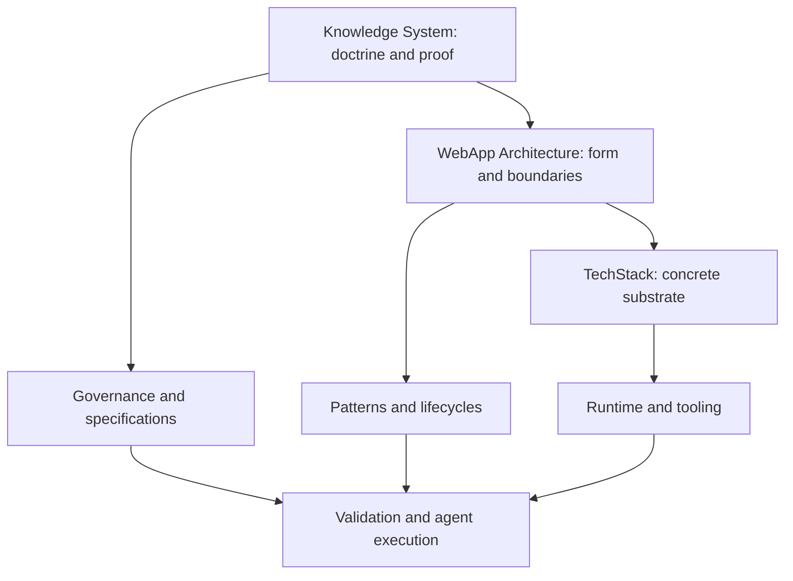
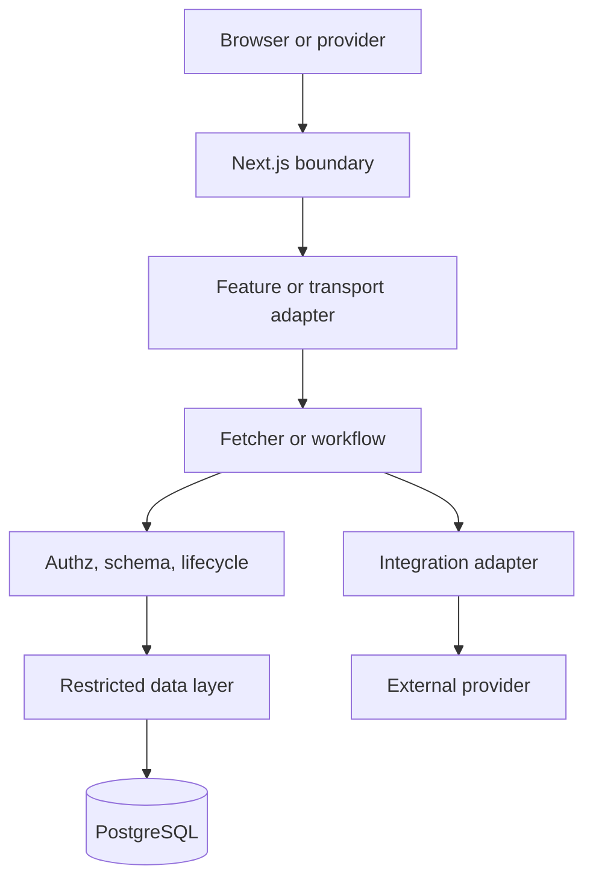

# System Map

## Canonical hierarchy

## Runtime ownership

| Fact or decision | Canonical owner | Reconciled into |
|---|---|---|
| Authentication, sessions, external identity | Clerk | local `User` through verified webhooks |
| Tenant membership, RBAC, domain and entitlement state | PostgreSQL application model | fetchers/workflows and DTOs |
| Payment object and settlement state | Stripe | bounded provider mirrors through verified webhooks/retrieval |
| Product transition legality | Domain policy and application workflow | atomic database transition |
| Tenant containment | Application authorization plus PostgreSQL RLS | transaction-scoped runtime role |
| Routes and HTTP outcomes | Next.js `app/` | feature entrypoints and responses |
| Page experience | `features/` | pure presentation components |
| Durable engineering intent | Canonical Markdown and accepted decisions | machine contracts and implementation |
| Conformance | Tests, validators, builds, review, runtime evidence | handoff and conformance reports |

## Application flow

The data layer never calls upward into React or routing. Integration adapters never decide product authorization. UI visibility never replaces authoritative policy. External state becomes product state only through reconciliation.

## Repository part-whole model

- The knowledge system contains doctrine, models, architecture, patterns, contracts, governance, proof, and provenance.
- Loaded Vibes™ is one architectural definition inside the knowledge system.
- Hipster Stack™ is the implementation substrate of Loaded Vibes™.
- A generated template instantiates the architecture but is not the architecture.
- A product application specializes a generated template but cannot silently redefine the knowledge system.
- Vouch, Vibes, and Control Plus are evidence-bearing implementations with project-specific and legacy behavior.
