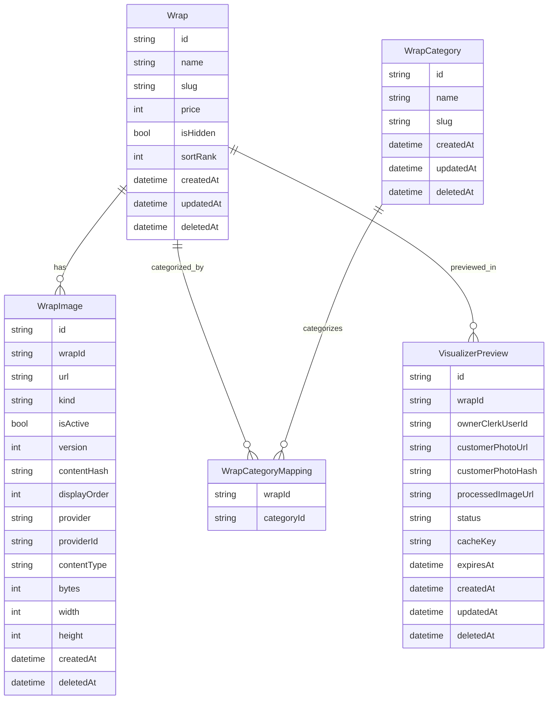
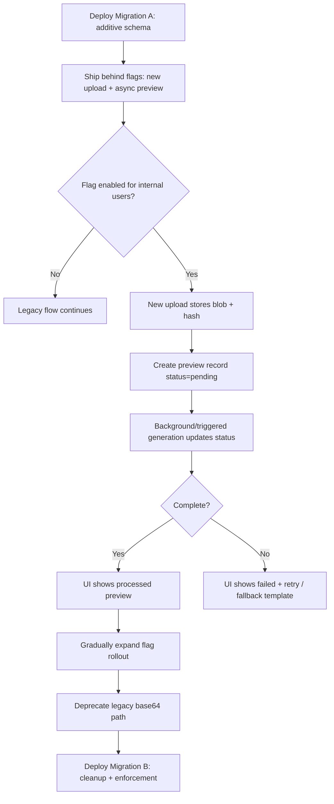

## Executive summary

The current Wrap Catalog and Vehicle Visualizer are already architected around solid production patterns—App Router pages as server components, domain-layer DTO fetchers and server actions, and explicit authz capabilities (catalog.manage / visualizer.use). fileciteturn9file0 fileciteturn63file0 fileciteturn18file0 However, several design choices will become reliability, security, and UX bottlenecks at “ship-ready” scale: (1) large `data:` URLs are passed from the client and persisted as `customerPhotoUrl`, (2) preview generation is synchronous and can be slow/timeout-prone, (3) media metadata is under-modeled (URLs without stable provider identifiers), and (4) catalog/visualizer asset roles exist but are not consistently consumed by the UI (many surfaces still use `images[0]`). fileciteturn52file0 fileciteturn53file0 fileciteturn40file0 fileciteturn49file0

Key changes to become production-ready:

- **Move vehicle photo ingestion off `data:`-URL storage**: store uploads in a dedicated object store (prefer private) and persist only references + hashes in DB; this reduces DB bloat and enables safe retention/cleanup. fileciteturn52file0 fileciteturn16file0 citeturn1search1turn1search8
- **Make preview generation resilient**: decouple “create preview request” from “generate preview output” and support polling; keep current deterministic cache key, but avoid long blocking actions. fileciteturn81file0 fileciteturn53file0 citeturn0search4turn7search7
- **Harden remote fetch + upload surfaces**: prevent SSRF-by-redirect, enforce streaming size limits, and align client/server MIME validation. fileciteturn54file0 fileciteturn51file0
- **Normalize catalog asset consumption**: always resolve a “hero” asset for catalog selectors/cards and a “visualizer_texture” asset for preview compositing; stop using `images[0]` as an implicit contract. fileciteturn30file0 fileciteturn55file0 fileciteturn49file0
- **Promote media to a first-class domain concept**: store provider identifiers (e.g., Cloudinary `public_id`) and technical metadata (bytes, type, width/height) to support safe deletion, reproducible transforms, and validation. fileciteturn29file0 citeturn0search0
- **Adopt tag-based caching + targeted invalidation** for catalog reads (wrapping DB fetchers in Next.js cache components where appropriate), replacing broad `revalidatePath` calls with `revalidateTag` for more predictable performance. fileciteturn27file0 citeturn7search0turn7search2

The repo is close to production readiness; the largest “must-fix” items are media handling, async preview orchestration, and consistent asset-role usage across UI and pipeline. fileciteturn29file0 fileciteturn54file0

## Repository inventory and current-state audit

### Relevant files and locations for catalog and visualizer

| Area | Path(s) | What they do today |
|---|---|---|
| Core schema | `prisma/schema.prisma` | Defines `Wrap`, `WrapCategory`, `WrapImage` (with `kind/isActive/version/contentHash/displayOrder`), and `VisualizerPreview` (with `ownerClerkUserId`, `customerPhotoUrl`, `processedImageUrl`, TTL, cache key). fileciteturn16file0 |
| Catalog server actions | `lib/catalog/actions/*.ts` | Wrap CRUD, category CRUD, category mapping, image upload/metadata/reorder, publish gating. fileciteturn24file0turn25file0turn27file0turn37file0 |
| Catalog fetchers/types | `lib/catalog/fetchers/*.ts`, `lib/catalog/types.ts` | DTO mapping + Zod schemas, searching/filtering, asset role enums (`hero`, `visualizer_texture`, `visualizer_mask_hint`, `gallery`). fileciteturn34file0turn35file0turn30file0 |
| Catalog UI | `app/(tenant)/catalog/**`, `components/catalog/**` | Catalog listing, filtering, pagination, detail page; admin manager; image manager UI. fileciteturn46file0turn47file0turn45file0turn42file0turn41file0 |
| Visualizer server actions | `lib/visualizer/actions/*.ts` | `uploadVehiclePhoto()` creates/reuses `VisualizerPreview` by cache key; `generatePreview()` runs server pipeline and updates DB status. fileciteturn52file0turn53file0 |
| Visualizer pipeline | `lib/visualizer/preview-pipeline.ts`, `lib/visualizer/compositor.ts` | Reads vehicle photo, calls mask generator (HF + fallback), resolves wrap texture, composites via Sharp, stores output in Vercel Blob or `data:` URL. fileciteturn54file0turn57file0turn59file0 |
| HF segmentation integration | `lib/visualizer/huggingface.ts`, `lib/visualizer/config.ts` | Calls HF Inference endpoint with raw bytes; selects labels in `{car, truck, bus, vehicle}`; retries + timeout. fileciteturn55file0turn58file0 |
| Visualizer UI | `app/(tenant)/visualizer/page.tsx`, `components/visualizer/**` | Wrap selection + upload/template modes; client submits upload then blocks on `generatePreview`; preview rendered. fileciteturn48file0turn49file0turn51file0turn62file0 |
| Auth & authorization | `proxy.ts`, `lib/auth/session.ts`, `lib/auth/identity.ts`, `lib/authz/*` | Clerk middleware route protection, server-side session resolution, capability checks, owner/admin guards. fileciteturn83file0turn21file0turn23file0turn18file0turn72file0 |
| Cloudinary wrap asset storage | `lib/catalog/image-storage.ts` | Uploads wrap images to Cloudinary if configured, otherwise `public/uploads/wraps`. Signed or unsigned support; “destroy” best-effort cleanup. fileciteturn29file0 |
| DB migrations and recent changes | `prisma/migrations/**` | Migration adds wrap asset-role metadata + visualizer preview ownership and category slug uniqueness. fileciteturn68file0turn69file0 |

### Current domain model and data flow

The catalog domain is built around a `Wrap` entity with related `WrapImage` rows (multi-role asset storage) and many-to-many `WrapCategory` mappings. fileciteturn16file0 Wrap creation defaults to hidden (`isHidden: true`), and “publishing” is achieved by setting `isHidden` false—guarded by a validator requiring active `hero` and `visualizer_texture` roles. fileciteturn24file0turn25file0turn31file0turn30file0

The visualizer domain is anchored by `VisualizerPreview` records that function as (a) a per-user preview request ledger and (b) a cache keyed by a deterministic hash of the vehicle photo + wrap texture + model configuration. fileciteturn16file0turn81file0turn52file0 The “upload” UI currently converts the file to a `data:` URL client-side and sends that string to `uploadVehiclePhoto`, which stores it in the database and reuses existing previews when possible. fileciteturn51file0turn52file0 Preview generation then calls `generatePreview`, which executes segmentation + compositing synchronously and stores the output (public Vercel Blob if configured, else inline `data:`). fileciteturn53file0turn54file0turn59file0

Authorization is consistently server-side: the middleware protects most routes, pages enforce capability checks, and server actions use guards like `requireOwnerOrPlatformAdmin()` and `requireCapability()`. fileciteturn83file0turn45file0turn52file0turn72file0 This matches Clerk’s recommended server-side usage patterns (`auth()` and middleware for App Router). citeturn1search0turn1search5

## Gaps and risks

### Security risks

The visualizer supports both `data:` URLs and remote HTTPS image URLs, with a host allowlist check. fileciteturn52file0turn58file0 However, remote fetch behavior is not explicitly hardened against **redirect-based SSRF**: if a permitted host returns an HTTP redirect to a disallowed host, default fetch redirect behavior can defeat a single pre-check. This is a common SSRF footgun unless redirects are disabled or re-validated on each hop. fileciteturn54file0

For wrap asset uploads, Cloudinary unsigned uploads are supported via `upload_preset` (and for signed uploads, the code builds a signature). fileciteturn29file0 Unsigned uploads can be safe when constrained by upload presets and when uploads are gated behind authenticated users, but Cloudinary generally recommends signed uploads for stronger control and to avoid quota abuse if an unsigned preset leaks. citeturn0search5turn0search1

Vercel Blob storage is currently configured as `access: "public"` with a deterministic filename (`visualizer/previews/{previewId}.png`) and `addRandomSuffix: false`. fileciteturn59file0 For user vehicle photos and generated previews (potentially PII), public URLs should be treated as externally shareable secrets; Vercel notes public Blob URLs are “hard to guess” specifically when a random suffix is used, and private stores are recommended for authenticated delivery. citeturn1search8turn1search1

### Performance and reliability risks

Blocking UI on synchronous preview generation is the main production risk. `generatePreview()` does: fetch input image (maybe), call Hugging Face inference with retries/timeouts, resize and composite with Sharp, then write to storage. fileciteturn53file0turn55file0turn54file0 This can exceed typical serverless request budgets, producing timeouts and poor UX (especially if HF queues). The internal docs acknowledge fallback-first and call out the need for operational instrumentation and fallback rates. fileciteturn66file0turn67file0

Storing large `customerPhotoUrl` strings in the DB (often base64) is high-overhead. It increases write amplification and can inflate row sizes significantly, and it also forces the cache key generation path to hash very large strings repeatedly. fileciteturn52file0turn81file0turn16file0 Even though the cache key hashes the photo URL, the DB stores the full string today. fileciteturn16file0turn52file0

Catalog reads are not explicitly cached; the code leans on server rendering plus occasional `revalidatePath()` calls after mutations. fileciteturn27file0turn46file0 Next.js’s current caching guidance emphasizes tag-based caching and on-demand invalidation for data (including DB queries) via cache components and `revalidateTag`, which can be more precise and more scalable than path revalidation. citeturn7search2turn7search0

### UX and product risks

Multiple UI surfaces assume `wrap.images[0]` is the correct hero/thumbnail asset (catalog card, visualizer selector, fallback overlay). fileciteturn39file0turn50file0turn49file0turn62file0 This is brittle because `WrapImage` includes multiple roles (e.g., `visualizer_texture`) and ordering can change; the result is users seeing the wrong imagery (texture tiles displayed as the product hero). fileciteturn30file0turn41file0

The catalog manager UX is split: `CatalogManager` provides quick CRUD + mapping, while `WrapImageManager` lives in the wrap detail page and manages assets with better role semantics and optimistic UI. fileciteturn42file0turn41file0turn40file0 For “ship-ready,” catalog management needs a single coherent owner workflow: list → edit → assets → publish readiness → publish. fileciteturn25file0turn31file0

Form validation is inconsistent: some surfaces use domain Zod schemas (`createWrapSchema`, `updateWrapSchema`), while `CatalogManager` uses its own ad-hoc schemas and stringly-typed numeric fields. fileciteturn30file0turn42file0 This increases drift risk and complicates maintenance. Zod itself encourages schemas as the single source of truth for parsing and validation, including refinements and transforms. citeturn3search2turn3search5

## Target domain model and API/contract updates

### Target principles

Server actions are already used pervasively across mutations (`"use server"`), which aligns with Next.js guidance that server functions run server-side and should include explicit auth/authz validation. fileciteturn24file0turn27file0turn0search4 To get production-ready behavior, the contract boundaries need to be hardened:

- **Catalog**: “asset roles are explicit and deterministic,” and UI always resolves “the active hero” rather than “first image.” fileciteturn30file0turn25file0
- **Visualizer**: “uploads are stored as assets, not base64 strings,” and preview generation becomes a state machine you can poll. fileciteturn16file0turn53file0
- **Media**: “URLs are not the only identifier”—store provider metadata so deletion and transforms don’t rely on URL parsing. fileciteturn29file0 citeturn0search0

### Recommended schema evolution and Prisma diffs

The current schema is workable but under-modeled for media and operational correctness. fileciteturn16file0 The production-ready target is to (a) eliminate DB-stored base64 photos, (b) store stable media identifiers, (c) normalize asset selection semantics, and (d) support publish readiness and ordering.

A minimal, low-risk evolution (keep `WrapImage`; add missing metadata + stable IDs):

```diff
 model Wrap {
   id                  String   @id @default(cuid())
   name                String
+  slug                String?  // human-friendly URL; unique when active
   description         String?
   price               Int
   installationMinutes Int?
   isHidden            Boolean  @default(false)
+  sortRank            Int      @default(0) // curated ordering
   createdAt           DateTime @default(now())
   updatedAt           DateTime @updatedAt
   deletedAt           DateTime?
 }

 model WrapImage {
   id           String   @id @default(cuid())
   wrapId       String
   url          String
   kind         String   @default("gallery")
   isActive     Boolean  @default(true)
   version      Int      @default(1)
   contentHash  String   @default("")
   displayOrder Int      @default(0)
+  altText      String?  // accessibility + SEO
+  contentType  String?  // e.g. image/webp
+  bytes        Int?     // size in bytes
+  width        Int?
+  height       Int?
+  provider     String?  // "cloudinary" | "local"
+  providerId   String?  // e.g. Cloudinary public_id
   createdAt    DateTime @default(now())
   deletedAt    DateTime?
 }

 model VisualizerPreview {
   id                     String   @id @default(cuid())
   wrapId                 String
   ownerClerkUserId       String   @default("legacy")
-  customerPhotoUrl       String
+  customerPhotoUrl       String   // now: https URL to stored asset (no base64)
+  customerPhotoHash      String   // sha256(bytes) computed at upload
   processedImageUrl      String?
   status                 String   @default("pending")
   cacheKey               String   @unique
   sourceWrapImageId      String?
   sourceWrapImageVersion Int?
   expiresAt              DateTime
   createdAt              DateTime @default(now())
   updatedAt              DateTime @updatedAt
   deletedAt              DateTime?
 }
```

This schema keeps the current migration strategy (Prisma Migrate generating SQL migrations and keeping schema + DB in sync) while enabling production-grade features like deterministic media deletion and better validation/observability. citeturn0search6turn0search3

If you are willing to do a bigger redesign, introduce a dedicated `MediaAsset` table and reference it from `WrapAsset` and `VisualizerUpload` domains; that yields cleaner polymorphism and safer retention policies at the cost of more migrations and refactors. (Unspecified in repo today; recommended as a Phase 2 hardening step.) fileciteturn16file0

### Catalog API shape and DTO contracts

Today, catalog mutations are server actions called directly from client components. fileciteturn24file0turn27file0turn41file0 This is valid, but production readiness usually benefits from a clear “public API contract” even if the transport remains server actions.

A “contract-first” shape that fits both server actions and Route Handlers:

```ts
// Wrap upsert contract (server action or POST/PATCH route)
type WrapUpsert = {
  name: string;
  slug?: string;                 // optional; auto-generated from name if blank
  description?: string | null;
  priceCents: number;
  installationMinutes?: number | null;
  isHidden: boolean;
  sortRank: number;
  categoryIds: string[];         // replaces separate "save categories" step
};

// Wrap asset upload contract
type WrapAssetUpload = {
  wrapId: string;
  role: "hero" | "gallery" | "visualizer_texture" | "visualizer_mask_hint" | "swatch";
  isActive: boolean;
  file: File;                    // server action FormData; or signed upload then finalize
  altText?: string;
};
```

This consolidates what is currently split across `updateWrap()`, `setWrapCategoryMappings()`, and `addWrapImage()` flows into a cohesive “edit wrap” transaction with atomic category mappings (reducing partial states). fileciteturn25file0turn37file0turn27file0

### Zod schemas and React Hook Form field specs

The repo already uses Zod for the domain layer and React Hook Form across admin surfaces, and it defines a custom Zod resolver to integrate consistently. fileciteturn30file0turn41file0turn86file0 React Hook Form’s design goal is performant local form state with minimal re-renders and standard HTML constraint compatibility. citeturn3search0 Zod provides `.refine()` and `.superRefine()` for cross-field validation, which is essential for conditional catalog rules (e.g., “publishing requires active hero + active visualizer texture”). citeturn3search2turn3search5

Below is a ship-ready field specification for the **Wrap Manager** (owner-only), designed to replace the ad-hoc `CatalogManager` form fields with a single canonical schema per domain.

**Wrap Manager — Wrap Editor form (React Hook Form + Zod)**

| Field key | Label | Type | Required | Validation rules | Conditional logic |
|---|---|---:|---:|---|---|
| `name` | Wrap name | text | ✅ | 1–120 chars; trim | slug auto-suggests from name |
| `slug` | URL slug | text | ⛔ | lowercase `[a-z0-9-]`, 1–80, unique among non-deleted wraps | if blank, generated; if provided, validate uniqueness server-side |
| `description` | Description | textarea | ⛔ | ≤500 chars | optional |
| `priceCents` | Price (cents) | number | ✅ | int > 0; cap (e.g. ≤1,000,000,000) | show formatted USD preview |
| `installationMinutes` | Install time (minutes) | number | ⛔ | int ≥ 0; reasonable max (e.g. 10,000) | optional |
| `categoryIds` | Categories | multi-select | ⛔ | array max 50; each id non-empty | if categories empty, allow but warn on publish |
| `sortRank` | Sort rank | number | ✅ | int ≥ 0 | lower rank = higher in list |
| `isHidden` | Hidden from customers | checkbox | ✅ | boolean | publish toggle triggers server “publish readiness” validation |
| `assets.hero` | Hero image | file | ✅ to publish | MIME: jpg/png/webp; ≤5MB; min dimension recommendation | required before `isHidden=false` |
| `assets.visualizer_texture` | Visualizer texture | file | ✅ to publish | MIME: png/webp; ≤10–20MB; alpha preferred | required before `isHidden=false` |
| `assets.visualizer_mask_hint` | Mask hint | file | ⛔ | MIME: png; ≤5MB | optional; if present, affects pipeline |
| `assets.gallery[]` | Gallery images | file[] | ⛔ | MIME: jpg/png/webp; each ≤5MB | optional |
| `assets.swatch` | Swatch/thumbnail | file | ⛔ | MIME: webp/png; ≤1MB; square | optional; used for fast grids |

This formalizes what is currently partially implemented via `WrapImageManager` and server-side publish validation. fileciteturn41file0turn31file0turn25file0turn29file0

Sample RHF configuration using the repo’s internal resolver:

```ts
import { useForm } from "react-hook-form";
import { z } from "zod";
import { zodResolver } from "@/lib/forms/zod-resolver";

const wrapEditorSchema = z.object({
  name: z.string().trim().min(1).max(120),
  slug: z.string().trim().max(80).regex(/^[a-z0-9-]+$/).optional(),
  description: z.string().trim().max(500).optional(),
  priceCents: z.coerce.number().int().positive(),
  installationMinutes: z.coerce.number().int().min(0).optional(),
  categoryIds: z.array(z.string().min(1)).max(50).default([]),
  sortRank: z.coerce.number().int().min(0).default(0),
  isHidden: z.boolean().default(true),
});

type WrapEditorValues = z.infer<typeof wrapEditorSchema>;

export const useWrapEditorForm = (defaults: Partial<WrapEditorValues>) =>
  useForm<WrapEditorValues>({
    resolver: zodResolver(wrapEditorSchema),
    defaultValues: defaults,
    mode: "onChange",
  });
```

This aligns with the repo’s existing approach (Zod schemas in the domain layer, RHF for admin UX, and consistent error mapping). fileciteturn30file0turn86file0turn41file0

## Visualizer pipeline and media strategy

### Segmentation model usage and mask contracts

The current implementation calls the Hugging Face Inference API for image segmentation by POSTing raw image bytes (`Content-Type: application/octet-stream`) and expecting an array of `{ label, score, mask }`, where `mask` is a base64-encoded black-and-white image. fileciteturn55file0turn58file0 This matches Hugging Face’s Image Segmentation task API contract (response is an array of predicted segments with `label`, `mask` (base64), and `score`). citeturn0search2turn8search0

The repo also locks the default model to `keras/segformer_b1_cityscapes_1024` for v1 because it’s relatively small compared to larger variants, with operational constraints in mind. fileciteturn67file0turn58file0 The Keras SegFormer model pages enumerate parameter sizes across variants, showing `segformer_b1_cityscapes_1024` at 13.68M parameters and larger models like b5 at 81.97M. citeturn9search0turn9search1

### Texture application, blending, and client/server responsibilities

Today’s server compositing is:

1. Read vehicle photo → obtain or generate mask (HF or fallback ellipse). fileciteturn54file0turn55file0
2. Resolve wrap texture from `WrapImage` role precedence, resize it, and apply vehicle mask via `dest-in`. fileciteturn54file0turn57file0
3. Blend masked texture onto the vehicle photo using Sharp composite (`multiply` or `overlay`) and configured opacity. fileciteturn57file0turn58file0
4. Store result to Vercel Blob (`put`) when a token exists; else return inline data URL. fileciteturn59file0

This pipeline is coherent and already avoids the earlier “client-only overlay” as the authoritative output when `processedImageUrl` exists, but UI fallback overlay still uses `wrap.images[0]` and a hard-coded inset/mix-blend mode. fileciteturn62file0turn49file0

**Production-ready refinements (without changing the fundamental approach)**:

- **Deterministic asset selection (no `images[0]`)**:
  - Catalog surfaces should display: active `hero` if present → else first active gallery.
  - Visualizer pipeline should use: active `visualizer_texture` if present → else active hero → else fallback synthetic.
  This selection logic already exists server-side (via image priority), but the UI needs the same rule. fileciteturn54file0turn52file0turn30file0

- **Mask handling**: support optional `visualizer_mask_hint` as a multiplier on the vehicle mask to exclude regions like windows or to constrain coverage—without requiring a fully new model. This is consistent with the repo’s stated “mask hint” direction. fileciteturn30file0turn64file0turn65file0

- **Blend modes and controls**: keep `multiply`/`overlay`, but treat them as user-facing tuning knobs only if you can explain them; otherwise keep them config-only. Next.js caching guidance supports separating configuration-based cache keys (already in `buildVisualizerCacheKey`) so previews are invalidated when blend/opacity changes. fileciteturn81file0turn58file0 citeturn7search2

- **Client vs server rendering**: keep compositing server-side for determinism and to avoid leaking raw assets/tokens; client should only show status, poll results, and render images. Route Handlers are the right place for polling endpoints if you choose to formalize it beyond server actions. citeturn7search7turn0search4

### Cloudinary / Blob media strategy and constraints

The repo currently uses Cloudinary for catalog wrap image uploads when configured, falling back to local `public/uploads/wraps`. fileciteturn29file0 For previews it uses Vercel Blob when configured, falling back to inline `data:` content. fileciteturn59file0

For production readiness, adopt a clear policy by asset class:

**Recommended media storage policy**

| Asset class | Storage | Access mode | Why |
|---|---|---|---|
| Catalog hero/gallery/swatch/texture | Cloudinary | Public | Merchandising assets should be cacheable, transformable, CDN delivered. Cloudinary upload and destroy APIs support signed operations and return asset metadata. citeturn0search0 |
| Customer vehicle uploads | Vercel Blob | Private | Vehicle photos are user content; private storage requires auth for reads and is recommended for sensitive files. citeturn1search1turn1search8 |
| Generated previews | Vercel Blob | Private by default (public only if explicitly shareable) | Avoid “URL == authorization” for user photos; if public, require random suffix and/or expiring share token. citeturn1search8turn1search9 |

To implement private Blob reads, you will need a Route Handler (or server action) that checks preview ownership and then streams the blob from storage, rather than directly embedding the blob URL in the client. This aligns with Vercel’s guidance for delivering private blobs through functions where you implement authentication. citeturn1search8turn7search7

For Cloudinary, production readiness improves significantly if you store `public_id` (and optionally `asset_id`) rather than attempting to parse it from the URL. Cloudinary’s destroy endpoint explicitly requires `public_id` and signature for signed calls. citeturn0search0 This suggests updating your schema to persist provider identifiers (see schema diff section). fileciteturn29file0

### Upload flow hardening

A ship-ready upload flow should enforce consistent constraints at three layers:

1. **Client accept/messaging** (UX guidance only)
2. **Server validation** (authoritative)
3. **Storage policy** (preset constraints / signed URLs / MIME and size limits)

Hugging Face inference expects either base64 in JSON (`inputs`) or raw bytes payloads for image segmentation. citeturn0search2turn8search0 Since the repo already uses raw bytes, the upgrade is primarily about *where the bytes come from*: accept a file upload, store it safely, then process it—rather than persisting base64. fileciteturn55file0turn52file0

## Migration, testing, and rollout roadmap

### Migration plan and data backfill

Prisma Migrate is already used with SQL migration files; this is compatible with production rollouts that require deterministic schema changes across environments. citeturn0search6turn0search3 A safe rollout plan:

- **Migration A (schema additive)**
  - Add media metadata columns to `WrapImage` and additional columns to `VisualizerPreview` (`customerPhotoHash`, and optionally `customerPhotoBlobPath` if using private storage).
  - Add `Wrap.slug` and `Wrap.sortRank`.
  - Add partial unique index at the SQL layer to enforce “one active hero” and “one active visualizer_texture” per wrap (because the app enforces it today but DB does not).
  (DB partial index SQL is not represented directly in Prisma schema; consider custom SQL migrations.) fileciteturn68file0turn27file0turn30file0

- **Backfill job**
  - Compute `contentType/bytes/width/height` for existing wrap images (fetch HEAD where possible; otherwise leave unspecified).
  - For visualizer previews: if old records store `data:` URLs, either (a) leave as legacy with a feature flag, or (b) convert lazily upon access (read base64 → store to Blob → rewrite to URL). fileciteturn16file0turn52file0turn59file0

- **Migration B (behavioral switch behind flags)**
  - Update UploadForm to upload files to storage + pass URL reference (no base64).
  - Update preview pipeline read path to support private blob reads (server-side token usage). fileciteturn51file0turn54file0turn59file0

### Testing and acceptance criteria

A production-ready roadmap should be driven by verifiable acceptance criteria. Below is a prioritized implementation roadmap with “done” conditions.

| Priority | Work item | Acceptance criteria |
|---|---|---|
| P0 | Replace base64 upload flow | Uploading a vehicle photo does not create a `data:` URL DB row; DB stores a URL + hash; uploads > limit are rejected server-side; client error messages match server rules. fileciteturn52file0turn51file0 |
| P0 | Make preview generation non-blocking | Visualizer can return immediately with `status=pending`, UI polls and transitions through states; no long request blocks the UI; failures are visible with retry. fileciteturn53file0turn62file0 |
| P0 | Deterministic asset resolution in UI | Catalog cards and visualizer selector show active hero or intent-specific thumbnail; never show texture tiles as hero unless no hero exists. fileciteturn39file0turn50file0turn30file0 |
| P0 | Harden remote image fetching | Remote fetch rejects redirects to non-allowlisted domains; enforces max bytes while streaming; logs failures with enough context. fileciteturn54file0turn58file0 |
| P1 | Unify catalog manager UX | Owner can create/edit wraps in a single “Wrap Editor” with publish readiness; category mapping is not a separate save step; image role management is integrated. fileciteturn42file0turn41file0turn25file0 |
| P1 | Media provider metadata persisted | Cloudinary uploads store provider identifiers and do not rely on URL parsing for deletion; preview assets have deterministic cleanup hooks. fileciteturn29file0turn84file0 citeturn0search0 |
| P1 | Cache + invalidation modernization | Catalog fetchers optionally use cache components and tag-based invalidation; `revalidatePath` usage is reduced to exceptional cases. fileciteturn27file0 citeturn7search2turn7search0 |
| P2 | Cleanup jobs & retention | A scheduled job deletes expired preview rows *and* associated stored objects; retention settings are documented; metrics exist for run counts and deletes. fileciteturn84file0turn59file0 |
| P2 | Mask hint integration | When a `visualizer_mask_hint` is present, final mask = vehicleMask * hint; visualizer output demonstrably avoids excluded zones. fileciteturn30file0turn54file0 |

### Mermaid diagrams

**Entity relationships (target)**



**Rollout flowchart (feature-flagged)**



### Notes on enabled connectors and source coverage

This report’s code-level findings are derived from direct inspection of the DigitalHerencia/CtrlPlus repository via the GitHub connector (paths cited throughout). fileciteturn16file0turn54file0turn42file0turn83file0 External best-practice recommendations are grounded in primary documentation for Next.js server functions and caching, Prisma migrations, Cloudinary upload APIs, Hugging Face inference task contracts, Clerk server-side auth, and Vercel Blob access modes. citeturn0search4turn7search2turn0search6turn0search0turn0search2turn1search0turn1search8