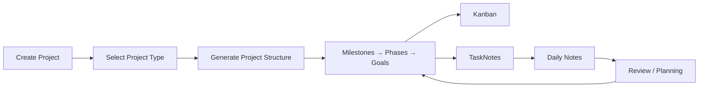
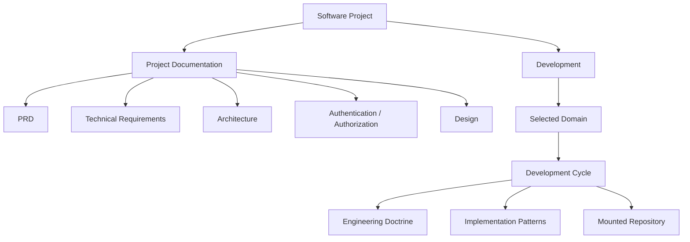
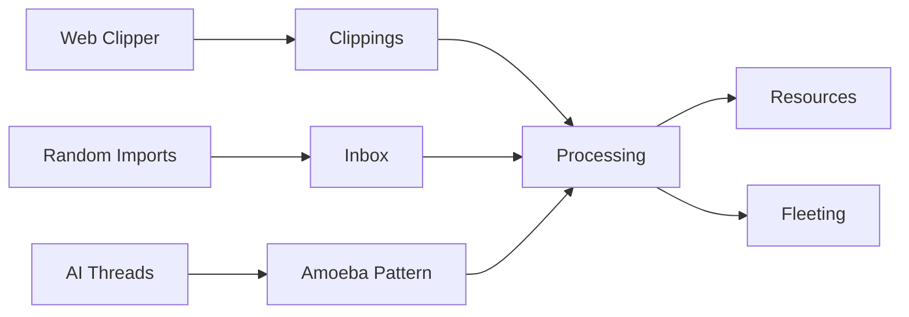
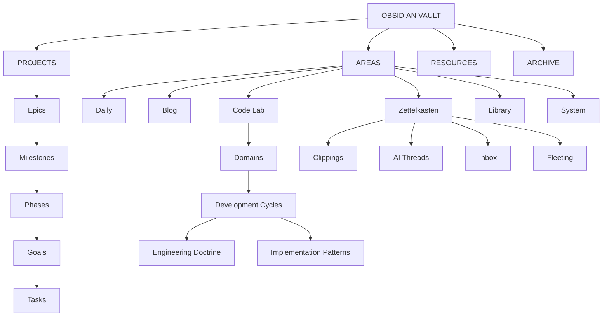

<div align="center">
  

  <br />
  <br />

  <h1>YOU CAN SEE THE CODE IN OUR CONVERSATION HISTORY</h1>
  
  <p align="center">
    <a href="#architecture">Architecture</a>
    ·
    <a href="#workflows">Workflows</a>
    ·
    <a href="#plugin-system">Plugin System</a>
    ·
    <a href="#system-model">System Model</a>
  </p>

<p align="center"> 
   
   
   
   
   
   
   
   
   </p>

</div>

> [!CAUTION]
>
> This is a private Obsidian workspace for managing projects, tracking productivity, writing code, organizing notes and resources, maintaining documentation, and developing creative work.

# ARCHITECTURE

The vault uses **PARA** as its top-level organizational model.

## Projects

Projects contain active work organized through a hierarchical planning structure:

| Level         | Purpose                         |
| ------------- | ------------------------------- |
| **Epic**      | Major body of project work      |
| **Milestone** | Significant project outcome     |
| **Phase**     | Defined stage of a milestone    |
| **Goal**      | Specific outcome within a phase |
| **Task**      | Executable unit of work         |

## Areas

Areas are persistent workbenches for disciplines and recurring activities.

| Area             | Purpose                                           |
| ---------------- | ------------------------------------------------- |
| **Daily**        | Planning, stand-ups, reviews, and project cadence |
| **Blog**         | Creative writing and social media                 |
| **Code Lab**     | Software development and engineering practice     |
| **Zettelkasten** | Material ingestion and knowledge processing       |
| **Library**      | Navigation and management of vault knowledge      |
| **System**       | Vault infrastructure and operational components   |

## Resources

Resources contains durable material organized by type.

* Articles
* Books   
* Documentation
* General
* Knowledge
* Media 
* Patterns 
* Repositories 
* Standards  
* Tech Stack 

## Archive

Archive contains material that is no longer active.

* Inactive areas
* Inactive projects
* Legacy resources
* Deprecated system artifacts

# WORKFLOWS

Workflows describe how work moves through the architecture.

## Project Workflow



### Project Types

Projects are created from templates for:

| Type            | Primary Artifacts                      |
| --------------- | -------------------------------------- |
| **Operations**  | Business docs, financial docs, OKRs    |
| **Product**     | Product documentation                  |
| **Design**      | Wikis, mockups, user flows             |
| **Engineering** | Software documentation and development |
| **Marketing**   | Campaigns, launches, social media      |

### Project Execution

All project types use the same planning hierarchy:

1. Create the project from a template.
2. Define milestones.
3. Break milestones into phases.
4. Define goals within each phase.
5. Create tasks from those goals.
6. Track milestones, phases, and goals through Kanban.
7. Track executable work through TaskNotes.
8. Use Daily Notes for project status and the day's agenda.

### Software Projects

Software projects add a documentation and development layer.



Project documentation provides traceability between the project's planning hierarchy and its authoritative documentation.

### Marketing

Marketing work is performed through the Blog and its associated content workflows.

### Operations

Operations projects use project-specific templates for:

* Business documentation
* Financial documentation
* OKRs

These artifacts remain within the project folder.

### Design

Design projects use project-specific templates for:

* Wikis
* Mockups
* User flows

These artifacts remain within the project folder.

## Area Workflows

Area workflows provide recurring processes around the architecture.

### Code Lab

Development is organized by **domain → development cycle**.

Each development cycle contains:

1. Engineering Doctrine
2. Implementation Patterns

Code artifacts are maintained in mounted repositories.

### Zettelkasten

The Zettelkasten provides the ingestion and processing path for incoming material.



### Library

The Library provides the workspace for navigating and managing relationships throughout the vault.

| Capability | Library Surface          |
| ---------- | ------------------------ |
| Bookmarks  | Saved resources          |
| Backlinks  | Note relationships       |
| Tags       | Knowledge classification |
| Properties | Structured metadata      |
| Note Graph | Visual relationships     |

### System

System contains the infrastructure that operates the vault.

| Component            | Function                      |
| -------------------- | ----------------------------- |
| Bases                | Structured views              |
| TaskNotes            | Task management               |
| Mounted Repositories | Code artifacts                |
| Templates            | Reusable note structures      |
| Scripts              | Automation                    |
| Assets               | Vault assets                  |
| SOPs                 | Standard operating procedures |

### Daily

Daily organizes notes by year, month, and date.

```text
Year
└── Month
    └── Date
```

A generated Daily Note assembles the current project's relevant tasks and information into a stand-up and agenda.

| Daily workflow      | Focus           |
| ------------------- | --------------- |
| **Sprint Planning** | Milestones      |
| **Daily Stand-up**  | Tasks           |
| **Weekly Sync**     | Phase progress  |
| **Post-Mortem**     | Completed goals |

Each workflow records the relevant work, blockers, roadmap information, and supporting resources.

# PLUGIN SYSTEM

The plugin system supplies the capabilities used by the architecture and workflows.

| Capability                         | Plugin / System                                       |
| ---------------------------------- | ----------------------------------------------------- |
| Menus                              | Note Toolbar                                          |
| Daily Progress                     | Daily Notes                                           |
| Tasks                              | TaskNotes                                             |
| Project Documentation Traceability | Callout Studio                                        |
| Structured Views                   | Bases                                                 |
| Interactive Properties             | Meta Bind                                             |
| Macros                             | QuickAdd                                              |
| Note Generation                    | Templater                                             |
| Dashboards                         | Hearth                                                |
| Visual Project Flow                | Kanban                                                |
| Web Capture                        | Obsidian Web Clipper                                  |
| Ingest                             | Note Refactor                                         |
| Version Control                    | Obsidian Git                                          |
| Code Workspace                     | CodeSpace                                             |
| Visual Organization                | Iconic                                                |
| Resource Management                | Backlinks / Tags / Footnotes / Bookmarks / Properties |
| Knowledge Management               | Graph                                                 |
| Formatting                         | Linter                                                |
| Actions                            | Command Palette                                       |
| Navigation                         | Switcher                                              |
| Schedule                           | Calendar                                              |
| Diagrams                           | Mermaid                                               |

# SYSTEM MODEL



---

Made in Nuevo Mexico · 2026 · Ivan P. Roman · Digital Herencia

