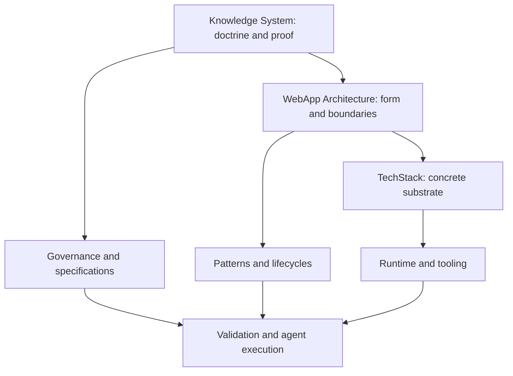
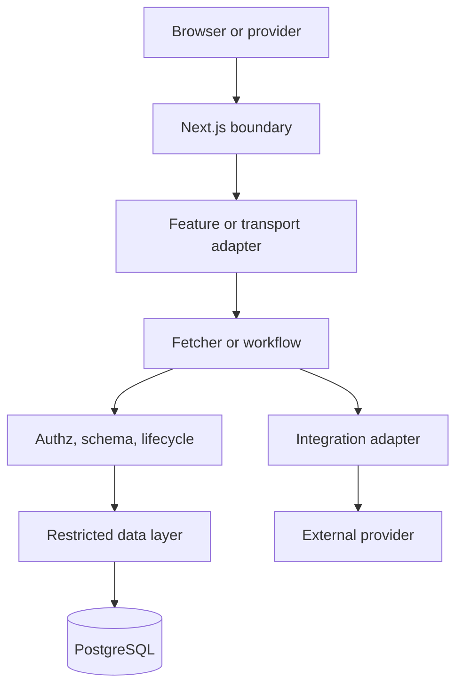

# Hipster Stack™ Technology Map

| Technology | Owns | MUST NOT own | Integration and proof |
|---|---|---|---|
| TypeScript | strict compile-time interfaces and exhaustive handling | runtime input trust | strict config; no `any`/unsafe casts; typecheck gate |
| Next.js App Router | routes, RSC execution, Server Actions, Route Handlers, metadata, cache/navigation effects | domain policy, direct persistence/provider mechanics | thin `app/`; build and route tests |
| React | server-first component composition, Suspense, deliberate client islands | protected data authority | RSC default; accessibility/component tests |
| Neon Postgres | durable application state, constraints, transactions, RLS | provider payment/identity truth | pooled restricted runtime; direct migration role; real DB tests |
| Prisma ORM | typed approved data access, schema/migrations/client generation | domain DTOs above data layer, RLS authorization replacement | explicit selects; generated types contained; schema/build tests |
| Clerk | sign-in/up, sessions, authentication, external identity | tenant membership, RBAC, billing, workflow state | server auth adapter; verified idempotent webhooks; auth E2E |
| Stripe Billing | provider customer/subscription/payment truth | product entitlement policy or tenant authorization | tenant-owned billing, server-derived IDs/URLs, idempotency, webhook normalization |
| Stripe Connect | optional connected-account/payment-rail mechanics | subscription billing or product marketplace ontology | separate module, account scope, money/currency, readiness/recovery tests |
| Tailwind CSS 4 | mobile-first utility composition and semantic token consumption | business logic | canonical responsive breakpoints/container queries where appropriate; visual/a11y review |
| shadcn/ui + Radix | owned accessible UI primitives | protected reads, workflows, server actions in catalog fixtures | local source ownership; keyboard and semantics tests |
| Zod | runtime validation and typed parsing at trust boundaries | authorization or DB constraints | shared schemas; invalid-input tests |
| React Hook Form | complex client-form state and accessible interaction | authoritative validation or mutation | Zod resolver where useful; Server Action result mapping |
| Vitest | unit, focused integration, contract tests | proof of real DB/provider behavior when mocked | deterministic tests; coverage interpreted by risk |
| Playwright | critical browser workflows, responsive/keyboard behavior | complete DB isolation proof | representative desktop/mobile flows; trace/screenshots on failure |
| ESLint flat config | static code/import/file-boundary rules | runtime truth | current compatible plugins; CI lint gate |
| Prettier | deterministic formatting | semantic correctness | format-check gate |
| pnpm | reproducible dependency/install/script surface | architectural decisions | pinned version, frozen lockfile, dependency review |
| GitHub | version history, issues, PRs, review, release coordination | runtime application truth | branch protection, minimal Actions permissions, secret scanning |
| GitHub Actions | repeatable CI orchestration | duplicate definition of repository gates | invokes canonical scripts; least-privilege tokens |
| Vercel | preview/production hosting and deployment integration | domain architecture | isolated environments, validated vars, build/deploy/smoke evidence |

## Canonical use rules

Technologies are subordinate to architecture. Provider-native concepts are translated at adapters. Concrete products MUST pin compatible versions and record upgrades. A technology MAY be omitted when its owned capability is not required, provided the omission does not weaken a mandatory invariant. New technologies require a decision identifying the missing capability, ownership, boundary, operational burden, security impact, validation, and removal path.

## Non-canonical use

Direct Prisma in routes/components; provider SDKs in actions/components; Clerk metadata as product role truth; client-created Stripe prices/customers/return URLs; public environment exposure by naming accident; Tailwind arbitrary values replacing semantic tokens without reason; copied shadcn prototypes containing product logic; mocked tests claimed as RLS/concurrency proof; CI scripts drifting from package scripts; or deploying before migrations and smoke checks.
---
title: Loaded Vibes WebApp Architecture
type: source-document
scope: domain
project: CodependentCoding
domain: architecture
artifact: loaded-vibes-webapp-architecture
kind: source-document
namespace: codependentcoding.docs.loaded-vibes-architecture.source-document
status: active
authority: source-of-truth
parent: "[[codependentcoding.manifest.map]]"
depends_on:
  - "[[codependentcoding.docs.engineering-doctrine.source-document]]"
  - "[[codependentcoding.docs.layer-contracts.contract]]"
  - "[[codependentcoding.docs.hipster-stack-tech.map]]"
supersedes: []
tags:
  - codependentcoding/architecture
  - loadedvibes/architecture
  - status/active
created: 2026-08-08
updated: 2026-08-08
source_repository: DigitalHerencia/CodependentCoding
source_path: docs/10-loaded-vibes-architecture.md
source_commit: 773a3469b80d8f8aafccecd749c60ebdb8a930ae
source_blob: bcea61b3fb6aa4941b4dd20626c3e810f9ba154b
source_format: markdown
---
# Loaded Vibes™ WebApp Architecture

## Context and topology

Loaded Vibes™ is the reusable architectural form for a server-first multi-tenant B2B SaaS application. A browser reaches a Next.js application deployed on Vercel. Clerk supplies authentication, Neon Postgres stores application truth, Prisma mediates approved application persistence, and Stripe supplies optional subscription billing and/or Connect payment capabilities. Provider events enter through verified Route Handlers and reconcile into bounded local state.

## Architectural grammar

> Routes adapt. Features orchestrate. Components render. Fetchers read. Actions write. Schemas validate. Authorization decides. Transactions preserve invariants. Webhooks reconcile external truth.

## Repository topology

| Root | Canonical ownership |
|---|---|
| `app/` | routes, layouts, metadata, params, redirects, Suspense, HTTP |
| `features/` | page/use-case presentation orchestration and page-state loaders |
| `components/ui/` | domain-agnostic accessible primitives |
| `components/shared/` | reusable product-agnostic presentation |
| `components/<domain>/` | domain presentation over DTO/display contracts |
| `lib/fetchers/` | authenticated, authorized, bounded reads |
| `lib/actions/` | thin public Server Action adapters |
| `lib/<domain>/workflows/` | named application use cases |
| `lib/auth/` | Clerk-to-local actor adaptation |
| `lib/authz/` | membership, capabilities, scopes, resource/workflow policies |
| `lib/db/selects/` | exact Prisma projections |
| `lib/db/dto/` | persistence-to-transport mapping |
| `lib/db/queries/` | internal trusted-scope reads |
| `lib/db/commands/` | bounded persistence writes |
| `lib/db/transactions/` | atomic database mechanics and canonical RLS transaction helper |
| `lib/integrations/` | provider SDK clients and semantic adapters |
| `lib/webhooks/` | durable verified event processing and reconciliation |
| `schemas/` | Zod runtime trust-boundary schemas |
| `types/` | stable transport and shared contracts |
| `prisma/` | schema, migrations, grants, RLS policies, generated client |
| `context/`, `.agents/` | human and machine governance |

## Dependency direction

Dependencies flow from framework/presentation adapters toward stable application/domain/data/provider ports. Data, domain, and integration layers MUST NOT depend on routes, features, or presentation. Detailed imports are governed by [[codependentcoding.docs.layer-contracts.contract|Layer Contracts]].

## Tenant model

`Tenant` is the abstraction; `Organization` is the reference entity. Access is established through local `User` plus active `Membership`. Membership roles aggregate capabilities. Resource policies evaluate actual records; workflow policies evaluate legal state. A product MAY rename Organization only through an approved ADR and coherent reset of schema, migrations, RLS, code, contracts, copy, fixtures, and tests.

Every tenant-owned table MUST contain an unambiguous tenant key and supporting indexes. The runtime connection MUST set tenant context transaction-locally in the one canonical database helper. All tenant operations MUST use the returned transaction-scoped Prisma client.

## Read boundary

```text
untrusted read input → Zod → actor → membership/capability scope
→ RLS-scoped transaction → explicit select → DTO mapper → serializable DTO
```

Exported fetchers self-secure. They are read-only and MUST NOT hide synchronization writes. Singular absence returns `null` when expected; routes decide `notFound()`. Collections are bounded and paginated. Freshness is default for tenant-operational, authz, entitlement, readiness, and payment state.

## Mutation boundary

```text
form/client intent → Server Action → schema → actor → workflow
→ resource authorization → invariant/readiness checks
→ transaction/provider sequence → audit/outbox → invalidation intent
→ framework invalidation/redirect → ActionResult
```

Actions adapt transport. Workflows own sequence. Transaction helpers own atomic database facts. Integration adapters own provider mechanics. Framework effects remain in actions/routes.

## Provider consistency

PostgreSQL and providers do not share ACID transactions. A consequential provider workflow MUST persist stable local intent and idempotency before the provider call, make the network call outside a DB transaction, persist normalized results, and reconcile authoritative provider truth through retrieval and webhooks. Partial states MUST be operator-visible and recoverable.

## Presentation composition

```text
semantic tokens → primitives → shared components → domain components
→ blocks → feature orchestration → route
```

Server Components are default. Client boundaries exist only for browser events, local interaction, or browser APIs. Pure presentation accepts typed props/slots and action references; it MUST NOT call protected fetchers, Clerk backend APIs, provider SDKs, or Prisma. The asset contract includes accessibility, responsive behavior, fixtures, and registry metadata. Catalog/workbench routes are isolated from production defaults.

## Caching and revalidation

Request-local memoization MAY deduplicate actor/session resolution. Persistent cache requires named ownership, key and tenant scope, freshness budget, authorization analysis, invalidation owner, failure behavior, and tests. Workflows return logical invalidation plans; Server Actions apply precise tags/paths after success. Cache entries MUST NOT become authority for irreversible decisions.

## Errors and observability

Expected failures use stable codes such as `VALIDATION_ERROR`, `UNAUTHENTICATED`, `FORBIDDEN`, `NOT_FOUND`, `CONFLICT`, `RATE_LIMITED`, and `PROVIDER_ERROR`. Unknown failures receive correlation context and a safe external message. Logs MUST include operation, request/event ID, safe actor/tenant/resource identifiers, duration, outcome, and error class; they MUST exclude secrets, raw tokens, unrestricted provider payloads, payment data, and sensitive personal fields.

## Configuration and deployment

Environment is parsed centrally at startup into separate server/public typed objects. Runtime uses pooled restricted DB credentials; migrations use a direct privileged owner path. Package manager and supported versions are pinned in generated products. GitHub Actions invokes repository-owned gates. Vercel preview and production deployments follow approved environment separation, migration ordering, rollback planning, and post-deploy verification.

## Non-goals

The architecture does not require microservices, a generic service layer, client-side data authority, Clerk Organizations, Stripe Connect, persistent caching, or a sample Project domain. Optional modules MUST be removable without corrupting core boundaries.
---
title: Codependent Coding System Map
type: map
scope: domain
project: CodependentCoding
domain: architecture
artifact: system-map
kind: map
namespace: codependentcoding.docs.system-map.map
status: active
authority: source-of-truth
parent: "[[codependentcoding.manifest.map]]"
depends_on:
  - "[[codependentcoding.docs.knowledge-system-definition.source-document]]"
supersedes: []
tags:
  - codependentcoding/architecture
  - codependentcoding/map
  - status/active
created: 2026-08-08
updated: 2026-08-08
source_repository: DigitalHerencia/CodependentCoding
source_path: docs/00-system-map.md
source_commit: 773a3469b80d8f8aafccecd749c60ebdb8a930ae
source_blob: c9f0988d29f792d554ce75a35fc8bd79af556d24
source_format: markdown
---
# System Map

## Canonical hierarchy



## Runtime ownership

| Fact or decision | Canonical owner | Reconciled into |
|---|---|---|
| Authentication, sessions, external identity | Clerk | local `User` through verified webhooks |
| Tenant membership, RBAC, domain and entitlement state | PostgreSQL application model | fetchers/workflows and DTOs |
| Payment object and settlement state | Stripe | bounded provider mirrors through verified webhooks/retrieval |
| Product transition legality | Domain policy and application workflow | atomic database transition |
| Tenant containment | Application authorization plus PostgreSQL RLS | transaction-scoped runtime role |
| Routes and HTTP outcomes | Next.js `app/` | feature entrypoints and responses |
| Page experience | `features/` | pure presentation components |
| Durable engineering intent | Canonical Markdown and accepted decisions | machine contracts and implementation |
| Conformance | Tests, validators, builds, review, runtime evidence | handoff and conformance reports |

## Application flow



The data layer never calls upward into React or routing. Integration adapters never decide product authorization. UI visibility never replaces authoritative policy. External state becomes product state only through reconciliation.

## Repository part-whole model

- The knowledge system contains doctrine, models, architecture, patterns, contracts, governance, proof, and provenance.
- Loaded Vibes™ is one architectural definition inside the knowledge system.
- Hipster Stack™ is the implementation substrate of Loaded Vibes™.
- A generated template instantiates the architecture but is not the architecture.
- A product application specializes a generated template but cannot silently redefine the knowledge system.
- Vouch, Vibes, and Control Plus are evidence-bearing implementations with project-specific and legacy behavior.
---
title: Codependent Coding Engineering Doctrine
type: source-document
scope: domain
project: CodependentCoding
domain: engineering-doctrine
artifact: doctrine
kind: source-document
namespace: codependentcoding.docs.engineering-doctrine.source-document
status: active
authority: source-of-truth
parent: "[[codependentcoding.manifest.map]]"
depends_on:
  - "[[codependentcoding.docs.knowledge-system-definition.source-document]]"
  - "[[codependentcoding.docs.epistemology.reference]]"
supersedes: []
tags:
  - codependentcoding/doctrine
  - codependentcoding/engineering
  - status/active
created: 2026-08-08
updated: 2026-08-08
source_repository: DigitalHerencia/CodependentCoding
source_path: docs/02-engineering-doctrine.md
source_commit: 773a3469b80d8f8aafccecd749c60ebdb8a930ae
source_blob: 0f62c3fd823083f3736f8e1ca1b445219babbebb
source_format: markdown
---
# Engineering Doctrine

## Causal model

The target applications handle tenant-owned state, provider-owned truth, asynchronous delivery, and agent-assisted change. Therefore the doctrine optimizes for explicit ownership, bounded authority, recoverable operations, narrow interfaces, and executable proof. Those values produce the layer grammar, server-operation contracts, security model, lifecycle model, and governance system.

## Principles

1. **Model before folders.** Define concepts, relationships, truth owners, invariants, and lifecycles before organizing code.
2. **Architecture owns responsibility.** Every consequential decision and side effect has one authoritative owner.
3. **Server owns business truth.** Clients submit intent and render results; they do not establish identity, scope, price, entitlement, settlement, or legal transition.
4. **Trust is earned progressively.** External data becomes runtime-valid, authenticated, authorized, domain-valid, persistence-ready, committed, and transport-safe through explicit boundaries.
5. **Reads and writes are different systems.** Fetchers are self-securing and read-only; actions adapt mutation transport; workflows coordinate use cases; transactions protect atomic facts.
6. **State ownership is plural but precise.** Clerk owns identity truth, Stripe owns provider payment truth, PostgreSQL owns application truth, and workflows own interpretation and transitions.
7. **Defense in depth is not duplicated policy.** Application authz makes business decisions; RLS contains tenant rows if application code errs.
8. **External success is not local completion.** Provider operations require durable intent, stable idempotency, recoverable intermediate state, webhook reconciliation, and operator-visible failures.
9. **Pure presentation is reusable presentation.** Components accept typed props/slots and do not acquire protected data or provider authority.
10. **Frameworks adapt around the application.** Next.js owns routes and framework effects; application workflows remain framework-neutral.
11. **Types do not validate runtime input.** Zod or equivalent runtime schemas guard every untrusted boundary.
12. **Persistence representations do not escape.** Selects limit retrieval; DTO mappers translate and serialize; generated Prisma models remain internal.
13. **Transactions are short and honest.** Network calls never run inside database transactions. Concurrent invariants use constraints, conditional writes, versions, and justified isolation.
14. **Errors are contracts.** Expected errors use stable codes; unknown errors preserve internal causes and expose safe messages.
15. **Freshness is a security property.** Authz, entitlement, readiness, payment, and time-sensitive decisions MUST NOT rely on unproven stale caches.
16. **Validation precedes completion.** A claim names the command or review performed, result, environment, and limits of what it proves.
17. **Specifications precede consequential implementation.** Product intent, acceptance, security, data, migration, and test impacts are bounded before code changes.
18. **Agents operate narrowly.** They inspect governing sources, preserve fixed boundaries, record decisions and evidence, and escalate authority-changing choices.
19. **Automation enforces settled decisions.** Formatting, types, imports, contracts, schema, tests, builds, and deployment checks mechanize doctrine where feasible.
20. **Exceptions are governed debt.** A deviation requires an owner, rationale, scope, risk, compensating control, expiry/review condition, and removal path.

## Opinionated defaults

- React Server Components by default; client islands only for browser interaction.
- Mobile-first Tailwind CSS 4 responsive composition; semantic tokens; accessible primitives.
- React Hook Form for nontrivial browser forms, backed by shared Zod schemas and authoritative server validation.
- Organization/Membership multi-tenancy; capability-based RBAC plus resource/workflow policies.
- Fresh authenticated tenant reads unless persistent caching is deliberately proved safe.
- One named workflow per business use case and one authoritative workflow per durable transition.
- Real PostgreSQL tests for RLS, constraints, transactions, concurrency, and leases.
- Pull-request delivery with CI, review, deploy authorization, and post-deploy smoke verification.

## Change and abstraction

Prefer the smallest correct change, direct domain-named modules, and local duplication over premature generic frameworks. Extract an abstraction only when a stable repeated concept has one meaning, one contract, and clear callers. Refactor behind characterization and contract tests. Broad rewrites require explicit scope and migration evidence.
---
title: Codependent Coding Supporting Infrastructure and Integration Patterns
type: reference
scope: domain
project: CodependentCoding
domain: patterns
artifact: infrastructure-integration-patterns
kind: reference
namespace: codependentcoding.patterns.infrastructure-integration-patterns.reference
status: active
authority: source-of-truth
parent: "[[codependentcoding.patterns.supporting-patterns.reference]]"
depends_on:
  - "[[codependentcoding.docs.loaded-vibes-architecture.source-document]]"
  - "[[codependentcoding.docs.security-model.contract]]"
supersedes: []
tags:
  - codependentcoding/patterns
  - codependentcoding/infrastructure
  - codependentcoding/integrations
  - status/active
created: 2026-08-08
updated: 2026-08-08
source_repository: DigitalHerencia/CodependentCoding
source_path: patterns/11c-infrastructure-integration-patterns.md
source_commit: 773a3469b80d8f8aafccecd749c60ebdb8a930ae
source_blob: 435e1f5e5f8f3edc896bd77743de84e90cf2d670
source_format: markdown
---
# Supporting Infrastructure and Integration Patterns

## SP10 - Configuration

**Purpose / context.** Centralize validated application/framework/integration settings into typed immutable server/public projections.
**Responsibilities.** Own typed config structure, integration projections, safe defaults, and explicit browser-public subset.
**Non-responsibilities.** No secret storage, domain policy, authorization, database/provider effects, or scattered environment parsing.
**Inputs.** Validated environment values plus canonical static configuration constants.
**Outputs.** Typed immutable server config and deliberately exposed public config.
**Dependencies.** Environment Validation, pure constants, framework config interfaces where needed.
**Callers.** Integration clients, DB/bootstrap, framework config, approved server modules; browser only receives public subset.
**Callees.** Pure projection helpers only; no runtime network/DB.
**Invariants.** One canonical source per setting; required values fail early; server secrets never enter public projection.
**Failure behavior.** Missing/invalid required config stops startup/build or optional-module initialization with safe actionable error.
**Security.** Secrets are server-only and not logged; public values are allowlisted; credentials consumed only by approved integrations.
**Tenant isolation.** Deployment config is not tenant product state; per-tenant settings use authorized persistence boundaries.
**Transaction behavior.** None.
**Caching behavior.** Process-lifetime immutable module state is allowed; dynamic product state is not config.
**Validation.** Environment/config schemas, TypeScript interfaces, startup/build checks, rule against scattered raw env access where feasible.
**Testing.** Environment matrix, optional modules, public/server separation, missing/invalid values, integration projection correctness.
**Naming.** Capability/domain settings such as `stripeConfig`; avoid anonymous config bags.
**Placement.** `lib/config` and approved root framework config files; server-only when secrets are referenced.
**Lifecycle.** Build/process startup and deployment initialization before request/integration lifecycles.
**Anti-patterns.** `process.env!` across code, secrets in client bundle, business policy in environment, unsafe silent defaults.
**Adjacent relationships.** Environment Validation parses raw strings; Configuration exposes typed settings; Integration/DB consumes them; Deployment supplies values.

## SP11 - Environment validation

**Purpose / context.** Fail fast when build/runtime environment values are missing, malformed, unsafe, or inconsistent.
**Responsibilities.** Separate server/public variables, parse URLs/enums/numbers/booleans, enforce cross-field/optional-module requirements, document names in `.env.example`.
**Non-responsibilities.** No provider availability check, authorization, tenant state, secret retrieval, migration, or product behavior.
**Inputs.** Raw environment strings/absence.
**Outputs.** Typed validated server/public env objects or immediate bounded configuration error.
**Dependencies.** Zod/runtime schema and pure refinements.
**Callers.** Configuration/bootstrap, framework build/runtime initialization, test/repository tooling.
**Callees.** Pure schema parsing only.
**Invariants.** Secret values never enter public output; required variables explicit by enabled module/environment; `.env.example` contains no credentials.
**Failure behavior.** Invalid required values stop startup/build before requests; errors identify variable class without echoing secret values.
**Security.** Raw env values are sensitive until classified; prevent server credential exposure to browser/logs.
**Tenant isolation.** Environment is deployment-scoped, not tenant-scoped, unless architecture explicitly dedicates an environment per tenant.
**Transaction behavior.** None.
**Caching behavior.** Validated environment may be process/module-cached because it is immutable for the process.
**Validation.** Executable env schema runs in required build/runtime contexts; repository checks can reconcile `.env.example` names safely.
**Testing.** Missing/invalid URLs, ranges, public/server split, optional integration combinations, production/test rules, redacted failures.
**Naming.** Canonical provider/infrastructure nouns and explicit public prefixes.
**Placement.** Central env module under `lib/config` or approved equivalent plus root `.env.example`.
**Lifecycle.** Build/process/deployment lifecycle before Configuration consumers initialize.
**Anti-patterns.** Non-null env assertions, per-file parsing, public secret prefix, committed credentials, optional module failing late.
**Adjacent relationships.** Schema supplies parser; Configuration owns typed settings; Deployment injects values; Validation/CI proves required environment classes.

## SP12 - Cache and revalidation

**Purpose / context.** Cache only when an explicit performance need can coexist with authorization scope, freshness, stale behavior, and invalidation ownership.
**Responsibilities.** Own cache key composition, tenant/auth scope, TTL/freshness, tags/paths, invalidation application boundary, and stale/failure semantics.
**Non-responsibilities.** Does not turn cached state into authorization/payment/readiness authority, hide synchronization writes, or move framework cache APIs into Workflows.
**Inputs.** Approved scoped read key/DTO-producing read or server-created invalidation plan after mutation.
**Outputs.** Same DTO contract as uncached read, cache hit/miss behavior, or applied invalidation effect.
**Dependencies.** Secure Fetcher/read owner, stable DTO, framework cache adapter, explicitly approved cache provider if any.
**Callers.** Fetchers/read infrastructure for caching; Server Actions/framework adapters for invalidation.
**Callees.** Secure read on miss/revalidation; framework invalidation adapter after successful mutation.
**Invariants.** No cross-tenant/auth key collision; failed mutation never triggers success invalidation; cached state cannot bypass fresh consequential checks.
**Failure behavior.** Cache failure follows declared criticality; committed mutation plus invalidation failure remains a cache/recovery problem, not fake DB rollback.
**Security.** Sensitive DTO storage/retention explicit; no secrets in keys/logs; user/tenant scope included when output differs by authority.
**Tenant isolation.** Tenant and owner/user scope affecting legal data are part of key/query boundaries; cross-tenant hit is critical.
**Transaction behavior.** Cache outside DB transaction; Workflow returns logical invalidation plan, framework applies after commit.
**Caching behavior.** Declare uncached/request-local/persistent strategy, TTL/freshness, tags, stale semantics, read-your-writes explicitly.
**Validation.** Cache-key/invalidation rules where deterministic; import rule forbids framework cache effects in Workflows.
**Testing.** Tenant/user isolation, hit/miss equivalence, stale/fresh behavior, success-only invalidation, read-after-write, invalidation failure.
**Naming.** Tags/keys encode tenant/resource/collection intent; avoid generic wildcard keys/invalidation.
**Placement.** `lib/cache` or approved read infrastructure; framework effect at Action/route boundary.
**Lifecycle.** RL-10 plus read stages of RL-01/RL-03 and post-commit stages of RL-04/RL-05.
**Anti-patterns.** Cached auth as authority, missing tenant key, invalidate everything, write inside Fetcher, `revalidatePath` in Workflow.
**Adjacent relationships.** Fetcher owns secure read; DTO owns value; Workflow emits plan; Server Action applies framework invalidation.

## SP13 - Integration adapter

**Purpose / context.** Isolate one external provider's SDK/API syntax, credentials, account scope, idempotency mechanics, and response/error normalization.
**Responsibilities.** Initialize provider client, translate trusted provider-neutral commands, preserve account scope, apply idempotency, retrieve truth, normalize results/errors.
**Non-responsibilities.** No product authorization, Membership, lifecycle legality, UI, Prisma persistence, or redirect-derived entitlement.
**Inputs.** Trusted validated provider-neutral command with server-derived provider IDs/account scope/money/URLs/idempotency identity.
**Outputs.** Bounded normalized provider result/error needed by Workflow/reconciliation.
**Dependencies.** Provider SDK/client, typed Configuration, provider-derived runtime schemas, redacted Observability.
**Callers.** Application Workflows, webhook/reconciliation processors, explicit server jobs.
**Callees.** Provider SDK/API and pure provider mapping helpers only.
**Invariants.** Provider mechanics stay here; account scope preserved; money/currency explicit; raw provider object never becomes domain state.
**Failure behavior.** Provider errors normalized with internal cause; ambiguous writes surface for Workflow recovery/retrieval rather than guessed.
**Security.** Server-only, least credential scope, allowlisted/server-derived return URL/customer/price/account IDs, signed webhook helpers where applicable.
**Tenant isolation.** Provider IDs arrive only after server tenant authorization/derivation and never prove tenant ownership themselves.
**Transaction behavior.** Network outside DB transaction; cross-system consistency uses Workflow operation/recovery/reconciliation.
**Caching behavior.** Consequential provider reads uncached by default; any cache states scope/freshness and never replaces reconciliation.
**Validation.** Input schemas/types, SDK/version/config checks, rule forbidding raw SDK imports elsewhere, normalization checks.
**Testing.** Request/response mapping, sandbox tests, connected-account scope, idempotent retry/ambiguous failure, malformed provider-derived values.
**Naming.** Application-oriented verbs such as `createInvoiceCheckout`; avoid SDK-overload names leaking through app.
**Placement.** `lib/integrations/<provider>`, server-only.
**Lifecycle.** Provider stage of RL-04/RL-06 and retrieval/verification stage of RL-08/RL-09.
**Anti-patterns.** Provider SDK in Route/Component/Action/Workflow, authz inside adapter, provider payload as domain model, network in DB tx.
**Adjacent relationships.** Workflow owns sequence; Adapter owns mechanics; Provider Mirror/DTO normalizes; Webhook reconciles; Configuration supplies credentials.

## SP14 - Logging and observability

**Purpose / context.** Produce safe correlated operational evidence for requests, transitions, retries, failures, providers, and releases without becoming product truth.
**Responsibilities.** Own structured event/log/metric/trace vocabulary, correlation, safe identifiers, duration/outcome/attempt fields, sampling/retention/redaction.
**Non-responsibilities.** No product audit invariant, authz, business transition, recovery decision, or raw payload archive.
**Inputs.** Typed operational event/error context already classified for safe logging.
**Outputs.** Structured logs, metrics, traces, alerts, or provider-neutral telemetry events.
**Dependencies.** Observability/log provider adapter, Configuration, correlation/redaction helpers.
**Callers.** Routes, Fetchers, Actions, Workflows, transaction runners, webhooks, background/release tooling via bounded event contracts.
**Callees.** Logging/metrics/tracing provider only.
**Invariants.** Stable operation correlation; bounded/redacted sensitive data; telemetry failure does not change product truth; durable audit is separate.
**Failure behavior.** Telemetry failure degrades independently/retries if configured and never exposes secrets or changes primary result.
**Security.** No secrets, tokens, cookies, raw webhook/provider/card/bank/KYC payloads or unrestricted user content.
**Tenant isolation.** Tenant IDs may correlate operations but logging access cannot become cross-tenant product read surface.
**Transaction behavior.** Ordinary telemetry outside DB tx; required Audit/Outbox commits through transaction owner.
**Caching behavior.** No application cache authority; telemetry provider buffering/sampling follows retention policy.
**Validation.** Event/redaction schema, forbidden-field checks where feasible, adapter import/config validation.
**Testing.** Correlation, redaction, errors/retries, telemetry-provider failure, sampling/retention config.
**Naming.** Stable event names/operation fields; avoid free-form prose as only machine signal.
**Placement.** `lib/observability` and owner-local event definitions; Audit remains in persistence layer.
**Lifecycle.** Cross-cuts runtime/release lifecycles at observability stages, especially recovery and post-deploy health.
**Anti-patterns.** Raw object dumps, secrets in metadata, logs as source of truth, swallowed telemetry hiding primary failure, unbounded payload retention.
**Adjacent relationships.** Error contract supplies failure class; Audit owns durable consequential evidence; Workflow/Webhook supplies operation context; Deployment consumes health telemetry.
