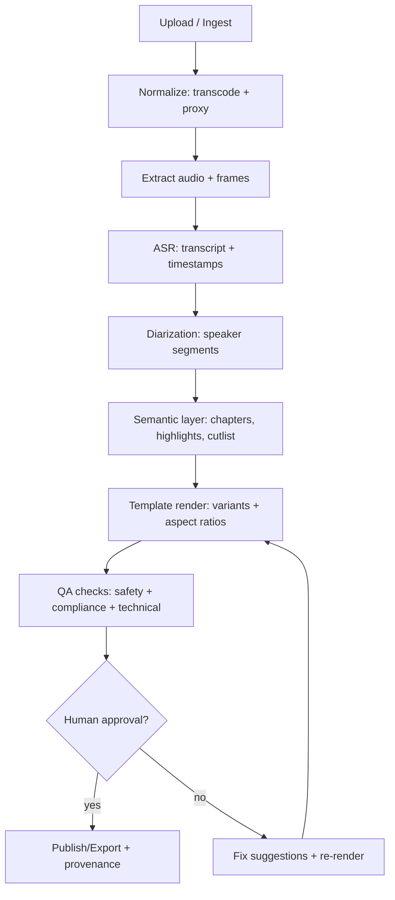
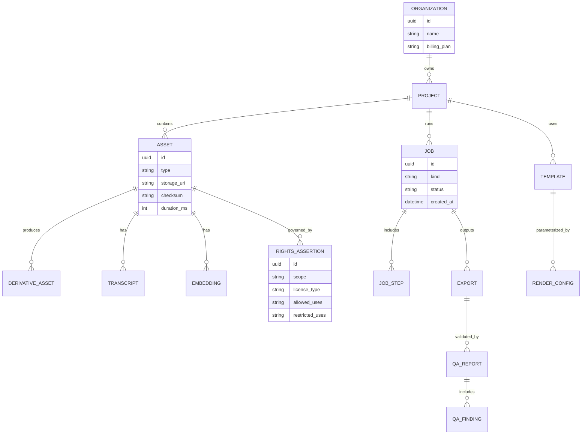
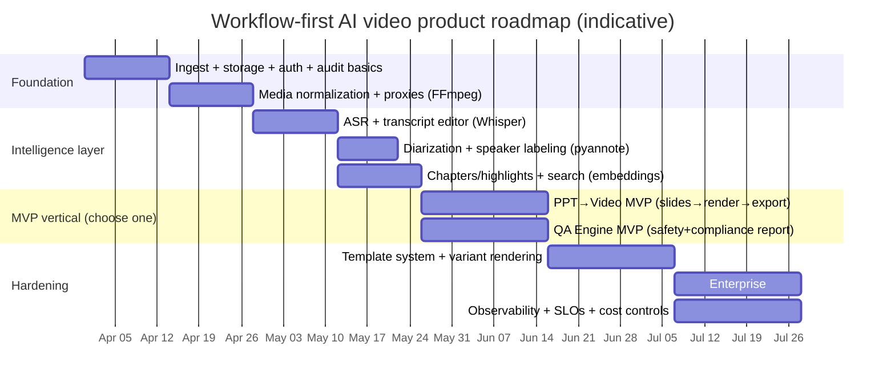

## Related

- [[deep-research-report]]

## Type

type:: research

- research

## Executive summary

This white paper focuses on **AI-powered video workflow products** (ingest → analyze → edit → render → QA → publish) rather than building or operating frontier **text-to-video generation** models end-to-end, specifically to avoid the failure modes exposed by Sora’s product shutdown: high and volatile compute costs, unclear unit economics, and amplified IP/identity risk at consumer scale. citeturn0news45turn0news44turn0news46

On **March 24, 2026**, entity["company","OpenAI","ai research company"] discontinued its Sora video app, with reporting attributing the decision largely to **high computational demand**, profitability challenges, and strategic refocus. citeturn0news45turn0news44turn0news46 The same reporting indicates the move effectively **collapsed a proposed ~$1B collaboration/investment arrangement with The Walt Disney Company**, which was reportedly not finalized and involved licensing characters for use in the Sora product. citeturn0news45

Against this backdrop, “workflow” products are attractive because they can be built around:

- **Deterministic media operations** (transcode, cut, captions, conform, multi-format exports) using mature tooling (e.g., FFmpeg) rather than stochastic video generation at scale. citeturn1search7
- **Selective, modular ML** (ASR, diarization, video understanding, brand safety checks, summarization) that can be scaled independently. citeturn12search0turn12search2turn8search1turn6search0
- **Enterprise governance** (audit logs, access controls, provenance, disclosures) aligned with emerging transparency obligations around synthetic media. citeturn2search5turn3search9turn2search4turn2search0

Enabled connectors used for this research (via `api_tool`):

- Hugging Face (Models / Datasets / Papers / Spaces / Docs connector)

This report assumes **no specific cloud provider** and instead provides cloud-neutral reference architectures; model-serving examples target Hugging Face Inference Endpoints because it provides managed deployment, autoscaling, logs, and configurable access control modes (private/public/authenticated). citeturn1search0turn1search9turn1search6

## Market context and why workflow products win

Multiple market reports converge on strong growth, but they disagree materially on **forecast magnitude** because of different definitions (video generator vs generator/editor), base years, and forecast windows:

- entity["company","Spherical Insights & Consulting","market research firm"]: **$551.7M (2023) → $2.98B (2033)** at **~18.37% CAGR**. citeturn0search0turn0search1turn5search0
- entity["company","Fortune Business Insights","market research firm"]: **$847M (2026) → $3.35B (2034)** at **~18.8% CAGR**; Marketing & Advertising is projected to lead applications (e.g., **~33.88% in 2026** in their segmentation), and **PowerPoint→video** is projected to be among the fastest-growing sources. citeturn0search2
- entity["company","Allied Market Research","market research firm"] press-release framing for a broader “generator/editor” lens: **$0.6B (2023) → $9.3B (2033)** at **~30.7% CAGR**. citeturn5search5turn5search10
- entity["company","MarkNtel Advisors","market research firm"]: Asia-Pacific described as **>37% share**, with drivers including connectivity and creator ecosystems (note: these are analyst claims, not regulatory findings). citeturn0search3turn0search4

The common thread across these sources is that **marketing/advertising and high-volume short-form output** are leading demand drivers, and that **automation in editing and repackaging** is a major adoption path. citeturn0search2turn0search0turn5search5 This matters because workflow products directly monetize the “high-volume repackaging problem” (variants, localization, format conversions, QA) while keeping compute predictable and legally governable.

The Sora episode highlights why consumer-facing, frontier video generation can be structurally fragile:

- Reporting cites **compute intensity** and **weak profitability** as key reasons for shutdown. citeturn0news45turn0news44turn0news46
- Reporting also emphasizes **partner shock** and the collapse of a high-profile entertainment collaboration, underscoring execution risk when product strategy depends on very large compute commitments and complex IP licensing. citeturn0news45

**Implication:** A viable strategy is to build “video workflow rails” that (1) accelerate content throughput for marketers and enterprises, and (2) treat generative video as an optional plug-in (or not at all), instead of the core product.

## Product strategy and five concrete app ideas

### Core design axioms to avoid Sora-style pitfalls

A workflow-first product strategy should optimize for:

- **Bounded unit cost**: Move the expensive part (full generation) out of the always-on path; make the default path CPU-heavy deterministic media ops + light/moderate inference. This directly addresses the “high computational demands” theme cited in Sora’s discontinuation coverage. citeturn0news45turn0news46turn1search7
- **Rights-first by construction**: Require rights metadata and usage constraints at ingest (what you own, what you licensed, what you’re allowed to synthesize), which reduces exposure under copyright and publicity regimes. citeturn2search4turn3search1turn2news53turn2search5
- **Auditable transformations**: Maintain a tamper-evident internal audit trail and optionally attach C2PA provenance to exports, acknowledging that provenance metadata can be stripped in the wild and is not a standalone solution. citeturn4search5turn4news58

### Comparative table: pipeline, PPT→video, ad variants, UGC simulator, QA engine

The table below compares five app ideas specifically requested: **pipeline**, **PPT→video**, **ad variants**, **UGC simulator**, and a **QA engine**.

| App idea                                         | Primary pipeline scope                                                                 |                          Compute cost profile | Revenue model fit                              | Legal risk profile                              | Time-to-MVP | Required HF models (examples)                                                                                 | Key GitHub repos / OSS                                                   |
| ------------------------------------------------ | -------------------------------------------------------------------------------------- | --------------------------------------------: | ---------------------------------------------- | ----------------------------------------------- | ----------: | ------------------------------------------------------------------------------------------------------------- | ------------------------------------------------------------------------ |
| Pipeline OS (video workflow orchestrator)        | ingest → transcode → ASR → captions → cutlists → render → publish                      | Medium (CPU-heavy + optional GPU for ASR/LLM) | Seats + usage (per render minute) + enterprise | Medium (depends on customer content)            |  8–12 weeks | `openai/whisper-large-v3-turbo`, `pyannote/speaker-diarization-3.1`, `openai/clip-vit-large-patch14`          | FFmpeg; PySceneDetect; workflow engine (Temporal/Prefect); OpenTelemetry |
| PowerPoint→Video Studio                          | PPTX import → slide rendering → narration → subtitles → multi-aspect export            |     Low–Medium (mostly CPU; optional TTS GPU) | Per-seat + per-export; SMB-friendly            | Low–Medium (mostly first-party decks)           |   4–8 weeks | `openai/whisper-large-v3-turbo` (if aligning to recorded narration), `microsoft/speecht5_tts`                 | python-pptx; LibreOffice/unoconv; FFmpeg; Remotion (license caveat)      |
| Ad Variant Factory                               | template + brand kit → generate hooks/copy → auto-resize → batch render → A/B packages |                    Medium (LLM + render farm) | Usage-based; performance tier                  | Medium–High (claims, endorsements, disclosures) |  6–10 weeks | `meta-llama/Llama-3.1-8B-Instruct`, `unitary/toxic-bert`, `Falconsai/nsfw_image_detection`                    | FFmpeg; Remotion (license caveat); OpenTelemetry; queue/orchestrator     |
| UGC Simulator (consented synthetic spokespeople) | script → TTS/voice → on-camera avatar/lipsync (bounded) → render variants              |                                   Medium–High | Enterprise licensing + per-minute              | High (publicity/deepfake disclosure; consent)   |  8–14 weeks | `microsoft/speecht5_tts` (commercial-friendly), `Falconsai/nsfw_image_detection`, optional deepfake detectors | FFmpeg; face/track libraries; consent ledger; provenance tooling         |
| Video QA Engine (brand safety + compliance)      | analyze final video → detect issues → generate report + fix suggestions                |                                    Low–Medium | Per-minute analyzed + enterprise               | Medium (moderation decisions; transparency)     |   4–8 weeks | `Falconsai/nsfw_image_detection`, `llava-hf/LLaVA-NeXT-Video-7B-hf`, `MCG-NJU/videomae-base`                  | PySceneDetect; FFmpeg; rules engine; reporting UI                        |

Supporting evidence for key table assumptions:

- Marketing/advertising as a leading segment and PPT→video as fast-growing are explicitly called out in entity["company","Fortune Business Insights","market research firm"]’ segmentation narrative. citeturn0search2
- Sora’s compute pressure as a product weakness is repeatedly cited in reporting on its discontinuation. citeturn0news45turn0news46turn0news44
- EU transparency obligations around deepfakes raise compliance stakes for “UGC simulator”-style products in particular. citeturn2search5

## Reference architecture for workflow-first video products

### System architecture overview

A cloud-neutral architecture that scales from SMB to enterprise generally has 6 layers:

1. **Ingest & storage**: signed uploads, virus scanning, media normalization, object storage for source + intermediates, lifecycle policies.
2. **Metadata & search**: Postgres for jobs/assets; optional vector search for embeddings / transcripts.
3. **Workflow orchestration**: durable workflows with retries, timeouts, idempotent steps.
4. **Media compute**: CPU pool for transcode/render; GPU pool for ML inference (ASR, VLM, LLM, moderation).
5. **Human-in-the-loop**: review UI for cutlists, captions, disclosures, and compliance signoff.
6. **Delivery**: exports, platform publishing, provenance, audit logs.

This separation aligns with the operational reality that “deterministic encode/render” differs materially from “GPU inference,” enabling cost control and isolating GPU scaling. citeturn0news45turn1search7turn1search0

### Workflow flowchart (mermaid)



Key building blocks referenced above:

- FFmpeg for concatenation/encoding/transcoding (including recommended concat workflows). citeturn1search7
- PySceneDetect for content-aware scene detection and export of boundaries for downstream tools like FFmpeg. citeturn1search8turn1search11
- ASR using Whisper large-v3-turbo (MIT license on HF; model card describes the “turbo” variant as a pruned/modified decode stack for speed). citeturn12search0
- Speaker diarization via `pyannote/speaker-diarization-3.1` (MIT; access-gated on HF). citeturn12search2

### Durable orchestration options

You can implement the “workflow orchestration” layer with:

- entity["organization","Temporal","workflow orchestration platform"] for durable execution of long-running workflows (“code never fails” positioning and multi-language SDKs). citeturn9search6
- entity["organization","Prefect","workflow orchestration"] for Python-native orchestration with retries and resume semantics (closer to data/ML style flows). citeturn9search2turn9search0
- entity["organization","Dagster","data orchestrator"] for asset-centric orchestration and observability (particularly strong if your product emphasizes datasets/assets and lineage-like reasoning). citeturn9search7

For GPU-heavy batch inference and parallel media analysis, Ray’s task/actor primitives can also be used in a compute cluster, but you’ll typically still want a higher-level workflow engine for job durability and auditability. citeturn9search11turn9search10

### Data model ER diagram (mermaid)



The explicit `RIGHTS_ASSERTION` object is a structural mitigation: it forces rights and consent metadata into the product rather than relying on post-hoc policing, which is important given copyright takedown dynamics and publicity rights constraints. citeturn2search4turn3search1turn2news53

### Model serving via Hugging Face Inference Endpoints

Hugging Face Inference Endpoints provides:

- Managed deployment of models to production with selectable inference engines (vLLM/TGI/SGLang/llama.cpp/TEI) and containerized lifecycle management. citeturn1search6turn1search4turn1search0
- Configurable access modes: **Private**, **Public**, and **Authenticated**, plus AWS PrivateLink for intra-region secured connectivity in AWS deployments. citeturn1search9
- Enterprise controls listed in official docs (e.g., SSO and audit logs) at the platform subscription layer. citeturn1search6

This is suitable for workflow products that want **repeatable, auditable inference** without building custom infra first, but you must still validate model licenses and gating constraints (see the next section). citeturn12search2turn12search3turn12search4

## Implementation roadmap, PRD, and agentic workflow design

### Roadmap timeline (mermaid)



The “choose one MVP vertical” approach is recommended because market reports emphasize both PPT→video growth and marketing demand, but trying to ship all five ideas at once tends to produce a brittle product surface area and unclear message. citeturn0search2turn0search0turn5search5

### PRD feature set with acceptance criteria (workflow OS baseline)

Below is an MVP PRD slice that can support either PPT→video or QA-engine verticalization.

| Feature                             | Acceptance criteria (testable)                                                                                                                                                                                                             |
| ----------------------------------- | ------------------------------------------------------------------------------------------------------------------------------------------------------------------------------------------------------------------------------------------ |
| Upload + checksum + virus scan      | Upload up to N GB single asset; server computes checksum; quarantine path for flagged files; user can’t access quarantined assets. (Security controls align with OWASP “Files and Resources” category expectations.) citeturn10search10 |
| Normalize + generate proxies        | For any input video, system produces (a) mezzanine (high quality) and (b) proxy (low bitrate) within target runtime; errors are retriable and idempotent. citeturn1search7                                                              |
| ASR transcript with word timestamps | For a 10-minute English clip, generate transcript + timestamps; transcript edits persist; re-render captions reflect edits. citeturn12search0turn7search11                                                                             |
| Speaker diarization                 | Given a multi-speaker clip, system segments speakers; editor can rename speakers; export includes speaker-labeled SRT/VTT. citeturn12search2                                                                                            |
| Scene detection + cutlist export    | Detect scenes; export timestamps compatible with downstream splitting/encoding workflows. citeturn1search8turn1search11turn1search7                                                                                                   |
| Variant renderer                    | Given a template and dataset inputs, generate 9:16, 1:1, 16:9 variants; deterministic render with reproducible settings. citeturn1search7turn1search3                                                                                  |
| QA checks                           | Run NSFW classification on representative frames; flag policy violations; produce a signed report object linked to the export version. citeturn0search2turn0news45turn2search5                                                        |
| Audit log + approvals               | Every export has an approver identity, timestamp, and immutable job graph; supports enterprise governance expectations. citeturn1search6turn2search0turn11search0                                                                     |

### Sample agent instructions, skills, and tool plugins

The goal of “agents” here is not autonomous publishing; rather it is **structured assistance** across deterministic steps with explicit approvals. This aligns with enterprise risk management guidance that emphasizes governance and lifecycle controls for AI systems. citeturn2search0turn11search0

```yaml
agent:
    name: VideoWorkflowConductor
    purpose: >
        Assist operators in producing compliant, on-brand video derivatives by orchestrating
        deterministic media steps and bounded ML inference, never publishing without explicit approval.
    guardrails:
        - never_generate_ip_sensitive_assets: true
        - require_rights_assertion_for_export: true
        - require_human_approval_for_publish: true
        - log_all_tool_calls_to_audit_trail: true
    skills:
        - ingest_planner:
              description: choose proxy/encode settings; validate input constraints
        - transcript_editor:
              description: propose transcript fixes; align captions to edits
        - cutlist_designer:
              description: propose highlights; output EDL-like cutlists for review
        - brand_style_applier:
              description: enforce safe fonts/colors/logo positioning via templates
        - compliance_reviewer:
              description: run checks; recommend disclosures; compile QA report
    tool_plugins:
        - media.transcode_ffmpeg:
              inputs: [asset_uri, profile]
              outputs: [mezzanine_uri, proxy_uri]
        - audio.asr_whisper:
              inputs: [audio_uri, language_hint]
              outputs: [transcript_json, word_timestamps]
        - audio.diarize_pyannote:
              inputs: [audio_uri]
              outputs: [speaker_segments]
        - vision.scene_detect:
              inputs: [video_uri]
              outputs: [scene_boundaries]
        - vision.nsfw_check:
              inputs: [frame_batch]
              outputs: [nsfw_scores]
        - publish.export_package:
              inputs: [render_uri, metadata, disclosures]
              outputs: [export_uri, provenance_manifest_uri]
```

The explicit “require_rights_assertion_for_export” and “require_human_approval_for_publish” constraints are direct mitigations for copyright/publicity obligations and synthetic media disclosure trends. citeturn2search4turn3search1turn2search5turn3search9

## Security, legal, and safety risk analysis

### Copyright and platform liability surface

If you operate a platform that hosts user-generated video or derivative exports, you must expect takedowns and disputes. The U.S. Copyright Office’s Section 512 resources summarize that safe harbors can limit monetary liability for qualifying service providers, but require conditions such as a notice-and-takedown process, responding expeditiously to valid notices, and policies like repeat-infringer handling. citeturn2search4turn2search6

**Workflow-product implication:** Build a **takedown-ready content system** with:

- Asset IDs, checksums, and lineage from source to export (supports rapid pinpointing of infringing derivatives). citeturn2search4turn1search7
- A repeat-infringer policy and enforcement hooks if you are hosting user content rather than acting as a pure B2B processor. citeturn2search4turn2search6

(Non-legal advice: consult counsel; the point here is to engineer the system so legal compliance is implementable, not theoretical.) citeturn2search4

### Publicity, voice/likeness, and “synthetic performer” disclosure

The right of publicity generally concerns unauthorized **commercial** use of a person’s identity (name/likeness/voice) and is largely state-based in the U.S. citeturn3search1 This becomes product-critical for “UGC simulator” concepts that generate or manipulate realistic portrayals.

Recent U.S. state actions increasingly target disclosure and digital replica usage:

- Reporting on legislation signed in New York describes required disclosure when AI-generated “synthetic performers” are used in ads targeted to New York audiences, with an effective date of **June 9, 2026**. citeturn2news53turn3search9
- New York Civil Rights Law §50-f defines “digital replica” and establishes liability frameworks and exemptions (notably around expressive works), illustrating how detailed these regimes are becoming. citeturn3search0

**Workflow-product implication:** If you sell “synthetic spokesperson” functionality, ship with:

- Consent ledger + contract artifact storage (who authorized what, for which channels, for what duration). citeturn3search1turn3search0
- Automatic disclosure injection and export metadata labeling for ad inventory/regions that require it. citeturn2news53turn3search9

### EU AI Act transparency obligations for deepfakes

EU AI Act Article 50 summarizes transparency obligations, including that deployers of systems generating or manipulating image/audio/video constituting a “deep fake” must disclose that content is artificially generated or manipulated, with specific exceptions and context requirements. citeturn2search5

**Workflow-product implication:** Embed “disclosure” into the workflow as a first-class artifact (not an afterthought):

- `DISCLOSURE` object bound to exports (caption overlay, metadata, or distribution-side label manifests). citeturn2search5turn4search5
- Region-aware compliance templates (EU vs US state ad regimes differ). citeturn2search5turn2news53

### Provenance (C2PA) and its limits

The C2PA specification defines signed “manifests” (content credentials) for provenance and editing history, including trust decisions based on signer identity and cryptographic validation. citeturn4search5turn4search4

However, reporting emphasizes that provenance metadata can be inconsistently surfaced by platforms and can be stripped, meaning provenance should be viewed as **necessary but not sufficient** for public disclosure. citeturn4news58turn4search5

**Workflow-product implication:** Use C2PA for:

- Internal chain-of-custody and audit readiness (enterprise value). citeturn4search5turn11search0
- Export-time provenance attachments where compatible, plus UI-level disclosure overlays for jurisdictions demanding “clear marking.” citeturn2search5turn4search5

### Security controls and enterprise adoption requirements

Enterprise adoption usually hinges on: access controls, auditability, incident response, and secure SDLC. While implementation varies, NIST CSF 2.0 provides a general taxonomy of cybersecurity outcomes for governance and risk management, and NIST’s Generative AI Profile complements AI-specific risk considerations. citeturn11search0turn2search0

For application-layer requirements, OWASP ASVS organizes core verification domains (authentication, access control, cryptography, logging, file handling) that map well to a video workflow product that processes uploads and generates distributable outputs. citeturn10search10

## Concrete GitHub and Hugging Face recommendations

### Hugging Face model recommendations (with license and product-fit notes)

The following models came directly from Hugging Face discovery (connector + verification via web sources) and are commonly deployable either on your own infrastructure or via Hugging Face Inference Endpoints depending on license, gating, and resource requirements. citeturn1search0turn1search6turn1search9

| Task                                    | Recommended HF model ID                     | License / access                                              | Why it fits workflow products                                                                                                      |
| --------------------------------------- | ------------------------------------------- | ------------------------------------------------------------- | ---------------------------------------------------------------------------------------------------------------------------------- |
| Speech-to-text (ASR)                    | `openai/whisper-large-v3-turbo`             | MIT citeturn12search0                                      | High-quality ASR; “turbo” variant targets faster decoding, fits captioning and search indexing. citeturn12search0turn7search11 |
| Speaker diarization                     | `pyannote/speaker-diarization-3.1`          | MIT, **gated access** citeturn12search2                    | Enables speaker labeling and better captions; gating affects automation and procurement. citeturn12search2                      |
| Video understanding (caption/QA)        | `llava-hf/LLaVA-NeXT-Video-7B-hf`           | Llama 2 license citeturn8search1                           | Supports “video→text” reasoning useful for QA reports, “what happens in this clip,” etc. citeturn8search1turn8search0          |
| Video classification embeddings         | `MCG-NJU/videomae-base`                     | CC BY-NC 4.0 (non-commercial) citeturn0news45turn6search0 | Strong academic backbone for video representations; **license may block commercial use**. citeturn6search0                      |
| Image-text embedding (frame search)     | `openai/clip-vit-large-patch14`             | (see HF card; widely used) citeturn6search3                | Useful for semantic search over keyframes and matching brand assets to scenes. citeturn6search3                                 |
| Summarization                           | `facebook/bart-large-cnn`                   | MIT citeturn6search1                                       | Practical for transcript summarization / chapter titles / descriptions. citeturn6search1                                        |
| Text generation (scripts, CTA variants) | `meta-llama/Llama-3.1-8B-Instruct`          | Llama 3.1 license, **gated** citeturn12search4             | Good “copy factory” for ad variants and localization; gating impacts automation. citeturn12search4                              |
| NSFW image moderation (frames)          | `Falconsai/nsfw_image_detection`            | Apache-2.0 citeturn0news45turn1search0                    | Fast brand-safety filter on sampled frames; fits QA engine. citeturn0news45                                                     |
| Toxicity moderation (text)              | `unitary/toxic-bert`                        | Apache-2.0 citeturn4search1                                | Useful for scripts/captions moderation, comments, or generated copy. citeturn4search1                                           |
| Deepfake detection (optional)           | `prithivMLmods/Deep-Fake-Detector-v2-Model` | Apache-2.0 citeturn5search5turn2search5                   | Adds a risk-control layer for face manipulations; treat as heuristic not ground truth. citeturn4news58turn2search5             |
| Commercial-friendly TTS                 | `microsoft/speecht5_tts`                    | MIT citeturn13search0                                      | Safer licensing posture than some voice-cloning models; good for narration workflows. citeturn13search0                         |

Important licensing pitfall discovered in sourcing:

- `coqui/XTTS-v2` is under **Coqui Public Model License**, and its LICENSE explicitly states the license “allows only non-commercial use of [the] model and its outputs.” citeturn12search3turn12search1
  This makes it unsuitable for most commercial SaaS use unless you negotiate separate terms.

### Hugging Face Inference Endpoints deployment notes (practical)

- If you deploy via Inference Endpoints, use **Private** endpoints by default for customer data isolation; only move to Authenticated/Public if you have a strong abuse and quota model. citeturn1search9turn1search6
- Plan for gated models (e.g., `pyannote/*`, `meta-llama/*`) to complicate CI/CD and customer-controlled deployments, since access tokens and gating acceptance may be required. citeturn12search2turn12search4
- For LLM serving, use engines like vLLM/TGI available within Inference Endpoints to reduce ops overhead and improve throughput. citeturn1search6turn1search4

### GitHub recommendations (open-source projects and libraries)

Below are concrete GitHub repos and OSS building blocks commonly used for workflow-first video products. Where licensing is non-standard, it is explicitly called out.

```text
Core media pipeline
- FFmpeg (transcode/encode/filters): https://github.com/FFmpeg/FFmpeg
- PySceneDetect (scene/shot detection): https://github.com/Breakthrough/PySceneDetect
- OpenCV (frame extraction / CV primitives): https://github.com/opencv/opencv

Programmatic rendering / templating
- Remotion (React video framework; LICENSE caveat for companies): https://github.com/remotion-dev/remotion
  - Remotion docs: https://www.remotiondocs.com/
- MoviePy (Python video editing): https://github.com/Zulko/moviepy

Speech / captions
- openai/whisper (reference implementation): https://github.com/openai/whisper
- whisper.cpp (fast C++ inference variant): https://github.com/ggerganov/whisper.cpp

Orchestration & distributed execution
- Temporal (workflow engine): https://github.com/temporalio/temporal
- Prefect: https://github.com/PrefectHQ/prefect
- Dagster: https://github.com/dagster-io/dagster
- Ray: https://github.com/ray-project/ray

Observability
- OpenTelemetry (spec + SDKs): https://github.com/open-telemetry/opentelemetry-specification
```

Key evidence highlights about these components:

- FFmpeg provides documented concat modes (filter/demuxer/protocol) useful for render pipelines. citeturn1search7
- PySceneDetect is explicitly designed for content-aware scene detection and exporting boundaries into downstream tools. citeturn1search8turn1search11
- Remotion is a React-based programmatic video framework and explicitly notes licensing considerations for company use. citeturn1search1turn1search5
- Whisper’s official repo describes multilingual ASR and translation capabilities and is MIT licensed. citeturn7search15turn7search11

## Monetization, GTM, and enterprise adoption strategy

### Monetization models that fit workflow products

Workflow products map well to monetization that aligns revenue with compute:

- **Usage-based**: bill by rendered minute / exported minute / analyzed minute. This is natural for video operations, where “minutes processed” approximates compute and storage cost. citeturn1search7turn1search0
- **Seat-based + governance**: charge per editor/reviewer seat plus premium governance features (SSO, audit logs, retention rules). Hugging Face documentation similarly emphasizes enterprise controls like SSO/audit logs at subscription tiers, which reflects common enterprise buying patterns for software handling sensitive content. citeturn1search6turn11search0
- **Template marketplace / agency model**: monetize templates, automation packs, or managed onboarding; this aligns with the market emphasis on marketing/advertising volume demand. citeturn0search2turn0search0

### Go-to-market sequencing (pragmatic)

A capital-efficient sequencing (anchored to what market reports say is growing fastest) is:

1. PPT→video for internal enablement: sales enablement, training, L&D, product walk-throughs—fast feedback loops and lower rights risk. citeturn0search2
2. QA engine as the “enterprise wedge”: brand safety, disclosure enforcement, and audit-grade reporting becomes a cross-cutting requirement across many video pipelines. citeturn2search5turn2search0
3. Ad variant factory as expansion: once templates + rendering are robust, add copy generation and batch testing flows. citeturn0search2turn4search2

### Enterprise adoption checklist (minimum bar)

Enterprises commonly require:

- Strong identity and access controls, auditability, and logging (NIST CSF 2.0 emphasizes governance outcomes; OWASP ASVS organizes verification domains for web apps). citeturn11search0turn10search10
- Clear synthetic media disclosure controls in relevant jurisdictions (EU AI Act transparency; state ad disclosure laws). citeturn2search5turn3search9turn2news53
- DMCA takedown readiness for platforms hosting or distributing user content at scale. citeturn2search4turn2search6

## Annotated source list

entity["organization","Reuters","news agency"]: Primary reporting for the March 24, 2026 shutdown decision and the reported Disney arrangement details; used to ground the “Sora pitfall” framing and timeline. citeturn0news45

entity["organization","NIST","us standards institute"]: AI RMF + Generative AI Profile and CSF 2.0 are used as governance-aligned reference points for risk and security program design rather than product feature speculation. citeturn2search0turn11search0

EU AI Act Article 50 (Service Desk): Used to ground deepfake disclosure obligations that most directly affect “UGC simulator” and high-realism synthesis use cases. citeturn2search5

U.S. Copyright Office Section 512 resources: Used to ground platform-level takedown and safe-harbor engineering requirements. citeturn2search4

Hugging Face Inference Endpoints docs: Used to ground endpoint access modes (private/public/authenticated), deployment model, and managed inference concepts. citeturn1search6turn1search9turn1search0

Model cards / primary papers for Whisper, VideoMAE, CLIP, TimeSformer, Video-MME, and LLaVA-NeXT-Video: Used to ground the feasibility of modular video understanding and transcription layers without full text-to-video generation. citeturn7search11turn6search0turn6search3turn6search7turn8search0turn8search1
